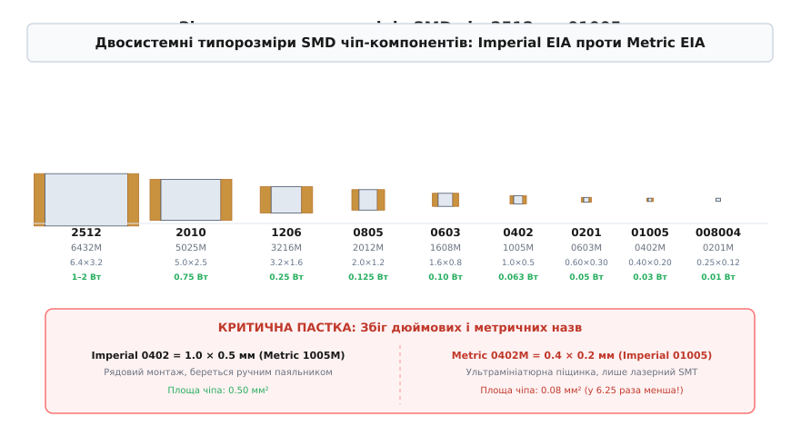
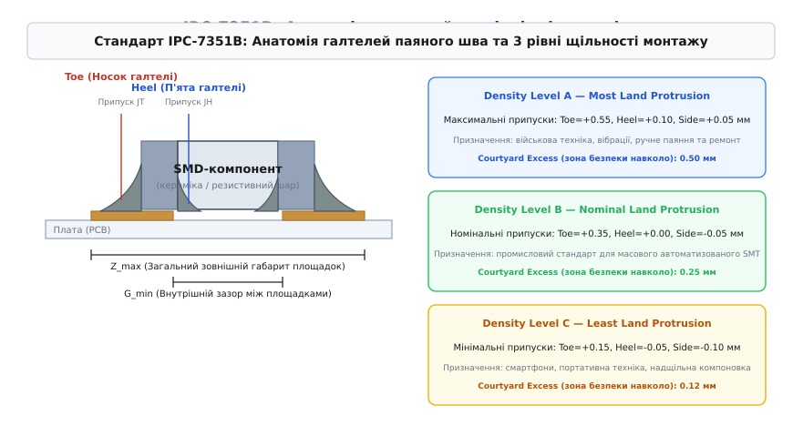
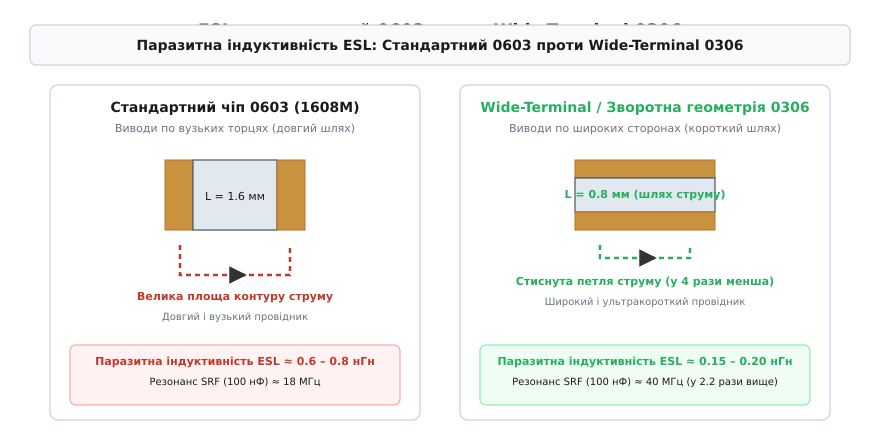
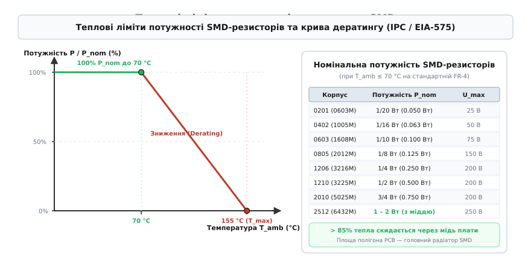

# Система корпусів EIA для пасивних SMD-компонентів

<preknowlist>
- [Корпуси](topic:hw-components/packages) — базові відмінності між наскрізним монтажем THT і поверхневим SMD, контактні площадки та паяння.
- [Резистор](topic:hw-components/resistor) — закон Ома, опір матеріалів та розсіювання потужності.
- [MLCC](topic:hw-components/mlcc) — багатошарові керамічні чіп-конденсатори, діелектрики та структура шарів.
- [Індуктивність](topic:ph-electromagnetism/inductance) — магнітне поле провідника зі струмом, паразитна індуктивність петлі.
- [Маркування SMD](topic:hw-components/smd-marking) — принципи кодування та скорочених позначень компонентів на платі.
</preknowlist>

У виробництві друкованих плат помилка в одній букві суфікса при замовленні пасивних компонентів здатна зупинити монтажну лінію вартістю в мільйони доларів. Якщо інженер закладає в специфікацію конденсатор типорозміру «0402», маючи на увазі дюймовий стандарт Imperial EIA (розмір 1.0 × 0.5 мм), а відділ закупівель постачає партію за метричним позначенням Metric 0402M (розмір 0.4 × 0.2 мм), компонент виявляється у 6.25 раза меншим за площею. Під час автоматизованого монтажу мікроскопічний чіп просто провалюється у зазор між мідними площадками друкованої плати, розчинний флюс змиває його з позиції, а залишки припою утворюють коротке замикання.

## Пастка двох систем: Imperial EIA проти Metric EIA / IEC

Стандартизація розмірів пасивних чіп-компонентів *(chip components)* історично формувалася двома незалежними інженерними центрами — Асоціацією електронної промисловості США *(Electronic Industries Alliance, EIA; стандарт EIA-96 / EIA-CB-11)* та Міжнародною електротехнічною комісією *(International Electrotechnical Commission, IEC; стандарт IEC 60115-8 / JIS C 5012)*. У результаті виникла паралельна номенклатура, де той самий фізичний об'єм описується двома різними чотиризначними кодами.

Дюймова система **Imperial EIA** вимірює габарити компонента в сотих частках дюйма *(hundredths of an inch / 10-mil units)*. Перші дві цифри коду задають номінальну довжину `L`, а другі дві — ширину `W`. Наприклад, код `0805` розшифровується як `0.08` дюйма завдовжки та `0.05` дюйма завширшки:

```
L = 0.08″ = 0.08 · 25.4 мм = 2.032 мм ≈ 2.0 мм
W = 0.05″ = 0.05 · 25.4 мм = 1.270 мм ≈ 1.25 мм
```

Метрична система **Metric EIA / IEC** використовує десяті частки міліметра *(tenths of a millimeter)*. Код `2012M` (де літера «M» позначає metric) відповідає розміру `2.0 × 1.2` мм. Для уникнення плутанини в міжнародній технічній документації метричний код завжди супроводжують суфіксом `M` або записують у формі `Metric 2012`.


*Геометричне зіставлення типорозмірів пасивних SMD від силового 2512 до ультрамініатюрного 01005 у єдиному масштабі. Нижній блок демонструє критичну небезпеку збігу назв дюймового 0402 (1.0 × 0.5 мм) та метричного 0402M (0.4 × 0.2 мм), різниця площ між якими перевищує шість разів.*

Головна небезпека полягає в тому, що цифрові комбінації двох систем частково перетинаються, позначаючи кардинально різні компоненти:

1. **Збіг 0402:** Дюймовий `0402` (Metric `1005M`) має розміри `1.0 × 0.5` мм і площу `0.50` мм². Метричний `0402M` (Imperial `01005`) має розміри `0.4 × 0.2` мм і площу `0.08` мм². Метричний чіп легший за дюймовий у 15 разів і монтується лише на ультрапрецизійних лініях.
2. **Збіг 0603:** Дюймовий `0603` (Metric `1608M`) має розміри `1.6 × 0.8` мм і є найпопулярнішим базовим компонентом для ручного макетування. Метричний `0603M` (Imperial `0201`) має розміри `0.6 × 0.3` мм — це порошинка, яку неможливо втримати ручним пінцетом.

Зведена сітка стандартних типорозмірів охоплює діапазон від масивних силових компонентів до мікроскопічних чіпів:

| Дюймовий код (Imperial) | Метричний код (Metric/IEC) | Довжина L (мм) | Ширина W (мм) | Площа S (мм²) | Типове застосування |
| :--- | :--- | :--- | :--- | :--- | :--- |
| **2512** | **6432M** | 6.4 ± 0.20 | 3.2 ± 0.20 | 20.48 | Струмові шунти, силові перетворювачі, розсіювання 1–2 Вт |
| **2010** | **5025M** | 5.0 ± 0.20 | 2.5 ± 0.20 | 12.50 | Високовольтні дільники, демпфери (snubbers) |
| **1812** | **4532M** | 4.5 ± 0.20 | 3.2 ± 0.20 | 14.40 | Танталові та керамічні конденсатори високої ємності |
| **1210** | **3225M** | 3.2 ± 0.20 | 2.5 ± 0.20 | 8.00 | Фільтри живлення DC-DC, варистори |
| **1206** | **3216M** | 3.2 ± 0.20 | 1.6 ± 0.15 | 5.12 | Стандартні резистори 0.25 Вт, захисні світлодіоди |
| **0805** | **2012M** | 2.0 ± 0.20 | 1.25 ± 0.15 | 2.50 | Зручний ручний та автоматизований монтаж, прототипи |
| **0603** | **1608M** | 1.6 ± 0.15 | 0.8 ± 0.15 | 1.28 | Основний промисловий стандарт побутової та автоелектроніки |
| **0402** | **1005M** | 1.0 ± 0.05 | 0.5 ± 0.05 | 0.50 | Щільний монтаж, материнські плати, пам'ять DDR4/DDR5 |
| **0201** | **0603M** | 0.6 ± 0.03 | 0.3 ± 0.03 | 0.18 | Смартфони, процесорні модулі, носима електроніка |
| **01005** | **0402M** | 0.4 ± 0.02 | 0.2 ± 0.02 | 0.08 | Модулі бездротового зв'язку 5G, слухові апарати, SiP |
| **008004** | **0201M** | 0.25 ± 0.013 | 0.125 ± 0.013 | 0.031 | Напівпровідникові інтегральні підкладки, смарт-годинники |

> 🔧 **Навіщо це.** Створюючи бібліотеку посадкових місць *(footprints)* у САПР (Altium, KiCad, Cadence Allegro), суворо дотримуйтесь правила: у назві компонента обов'язково вказуйте обидва стандарти, наприклад `RES_C0603_1608M`. Це виключає двозначність при експорті переліку елементів (BOM) на автоматизовані виробничі лінії в Азії чи Європі.

## Межі мініатюризації: 01005 (0402M), 008004 (0201M) та фізика мікроскладання

Зменшення лінійних розмірів компонентів обумовлене потребою розмістити тисячі пасивних елементів усередині компактних корпусів System-in-Package (SiP) та радіочастотних модулів смартфонів. Проте перехід від 0402 до 01005 (0.4 × 0.2 мм) і 008004 (0.25 × 0.125 мм) натрапляє на фундаментальні фізичні обмеження матеріалів і процесів мікроскладання.

Перший бар'єр — **дисперсність паяльної пасти**. Паяльна паста складається з мікроскопічних сфер припою, зважених у рідкому флюсі. За стандартом IPC J-STD-005 пасти діляться за розміром зерна:
- **Type 3 (25–45 мкм):** Стандарт для корпусів 0805, 0603, 1206;
- **Type 4 (20–38 мкм):** Застосовується для 0402;
- **Type 5 (10–25 мкм) та Type 6 (5–15 мкм):** Необхідні для 01005 і 008004.

Якщо нанести пасту Type 3 на контактний майданчик чіпа 008004 (розміром 0.12 × 0.10 мм), вікно лазерного трафарету матиме ширину лише 90 мкм. У такий отвір фізично поміщаються лише дві-три кульки припою Type 3, що унеможливлює дозування об'єму і призводить до закупорювання апертури трафарету. Перехід на ультрадрібні порошки Type 5/6 вирішує проблему дозування, але різко збільшує питому площу поверхні металу. Це прискорює окиснення порошку киснем повітря, вимагаючи паяння в середовищі чистого азоту (N₂) із залишковим вмістом кисню менше 50 ppm.

Другий бар'єр — **ефект перекидання на торець (Tombstoning / Manhattan effect)**. Маса чіпа 01005 становить лише 0.04 мг (40 мікрограмів). Під час оплавлення припою в конвекційній печі сила тяжіння, що притискає чіп до плати, становить мізерні `F_g = m · g ≈ 4 · 10⁻⁷` Н. Сила поверхневого натягу рідкого припою на змочуваному торці досягає `F_s ≈ 10⁻⁴` Н — вона у 250 разів перевищує вагу деталі. Якщо один із торців прогрівається на частку секунди швидше або має більшу кількість пасти, різниця сил миттєво підіймає чіп у вертикальне положення, розриваючи контакт на протилежному боці.

Третій бар'єр — **електростатичні сили та зчеплення (Triboelectric & Van der Waals forces)**. Для деталей розміру 008004 гравітаційні сили стають слабшими за сили ван дер Ваальса та трибоелектричні заряди. Компонент перестає вільно падати з сопла маніпулятора під дією власної ваги й прилипає до стінок пластикової стрічки живильника *(feeder tape)* або кінчика вакуумного захвату. Для його скидання монтажні автомати застосовують імпульсний продув стисненим іонізованим повітрям і прецизійні сопла з алмазним або керамічним покриттям.

## Геометрія контактного майданчика: стандарт IPC-7351B

Щоб забезпечити повторюваність монтажу та мінімізувати механічні напруження паяного з'єднання, розробники використовують міжнародний стандарт **IPC-7351B** *(Generic Requirements for Surface Mount Design and Land Pattern Standard)*.

Стандарт задає геометрію трьох менісків (галтелей) припою, що формуються навколо металізованого торця чіпа:
1. **Носок галтелі (Toe, JT):** Зовнішній виступ міді за межі торця деталі. Формує пологий меніск припою, що забезпечує міцність з'єднання при вигині плати та дозволяє системі оптичної інспекції (AOI) перевірити якість змочування;
2. **П'ята галтелі (Heel, JH):** Внутрішній виступ міді під тілом компонента. Формує внутрішній меніск, який утримує деталь від зсуву й розвантажує кутові концентратори напружень;
3. **Бічні галтелі (Side, JS):** Виступи міді обабіч торця. Забезпечують ефект самоцентрування розплавом припою.


*Анатомія контактного майданчика SMD чіпа: взаємне розташування галтелей Toe, Heel, Side та розмірних ліній Z_max і G_min. Праворуч зіставлено три рівні щільності монтажу Density Level A, B, C із відповідними нормативними припусками та зонами безпеки Courtyard.*

IPC-7351B класифікує умови монтажу за трьома рівнями щільності *(Density Levels)*:

- **Density Level A (Most Land Protrusion):** Максимальні припуски площадок (`J_T = +0.55` мм, `J_H = +0.10` мм). Створює масивні галтелі припою з максимальною механічною міцністю. Застосовується для приладів військового призначення, авіоніки, автомобільної електроніки з високим рівнем вібрацій, а також для плат, які збираються або ремонтуються вручну;
- **Density Level B (Nominal Land Protrusion):** Промисловий стандарт для масового автоматизованого монтажу побутової та промислової апаратури (`J_T = +0.35` мм, `J_H = 0.00` мм). Забезпечує оптимальний баланс між міцністю шва, технологічним виходом придатних виробів і щільністю компоновки;
- **Density Level C (Least Land Protrusion):** Мінімальні припуски (`J_T = +0.15` мм, `J_H = −0.05` мм). Розрахований на надщільний монтаж у смартфонах, планшетах і портативних модулях. Вимагає прецизійних автоматів встановлення та прямого лазерного контролю об'єму паяльної пасти (SPI).

Математичний апарат розрахунку розмірів `Z_max` (загальний габарит), `G_min` (внутрішній зазор) та `X_max` (ширина площадки) за методом середньоквадратичного додавання допусків (RMS) детально виведено у вставці [Розрахунок площадок IPC-7351B](topic:hw-components/eia-package-system/math-ipc7351-land-pattern.md).

## Оптичний контроль якості паяння (IPC-A-610)

Якість сформованих галтелей перевіряється на відповідність стандарту **IPC-A-610** *(Acceptability of Electronic Assemblies)*. Автоматичні установки оптичної інспекції (AOI) підсвічують паяне з'єднання світлодіодними кільцями різного спектра (червоний, зелений, синій) і фіксують кут відбиття світла:

- **Кут змочування (Wetting Angle, θ):** Нормальний припій утворює плавний увігнутий меніск із кутом `θ ≤ 30°`. Кут `θ > 90°` свідчить про погане змочування (окиснення торця або дефіцит флюсу).
- **Висота галтелі носка (Toe Fillet Height):** За стандартом IPC-A-610 Class 2 припій повинен підніматися на торець деталі щонайменше на 25% від загальної висоти чіпа `H` плюс товщина шару припою під компонентом. Для високонадійних виробів Class 3 висота підйому має становити не менше 50% висоти торця.
- **Ширина контакту (End Joint Width):** Припій має покривати не менше 75% ширини металізованого виводу для Class 2 і не менше 100% для Class 3.

Для корпусів 0201 та 01005 стандартна двовимірна кольорова AOI стає неефективною через глибину різкості оптичних лінз. Виробництва переходять на 3D-профілометрію на основі фазового зсуву муарових смуг *(Moiré phase-shift 3D AOI)*, яка вимірює фізичну карту висот кожної галтелі з роздільною здатністю до 0.5 мкм.

## Паразитні параметри: паразитна індуктивність ESL та високочастотна поведінка

Внутрішня структура пасивного SMD-компонента складається з прямокутного керамічного або танталового тіла, внутрішніх струмопровідних шарів і двох зовнішніх металізованих виводів (нікелевий бар'єрний шар із покриттям чистим оловом або сплавом олово-свинець).

Струм, що протікає крізь чіп, заходить через один торець, долає довжину компонента й повертається через шину заземлення друкованої плати. Цей замкнений контур утворює одновиткову котушку з еквівалентною послідовною індуктивністю *(Equivalent Series Inductance, ESL)*.


*Порівняння контуру струму: стандартний корпус 0603 утворює довгу петлю з індуктивністю 0.7 нГн, тоді як широкотермінальний корпус зворотної геометрії 0306 скорочує шлях струму вдвічі, стискаючи площу магнітної петлі та знижуючи ESL до 0.16 нГн.*

Індуктивність прямокутного провідника визначається його довжиною `L` та площею контуру над опорною площиною заземлення `h`:

```
ESL ≈ 0.2 · L · (ln(2 · L / (W + t)) + 0.5 + (W + t) / (3 · L))   [нГн]
```

Типові значення власної індуктивності для стандартних типорозмірів пасивних чіпів:
- **1206:** 1.20–1.50 нГн
- **0805:** 0.80–1.00 нГн
- **0603:** 0.50–0.70 нГн
- **0402:** 0.30–0.40 нГн
- **0201:** 0.15–0.20 нГн
- **01005:** 0.08–0.12 нГн

Чому зменшення ESL є критичним для силових шин сучасних мікропроцесорів? Індуктивність чинить опір швидкій зміні струму: реактивний опір `X_L = 2π · f · ESL` лінійно зростає з частотою. Разом із власною ємністю конденсатора `C` паразитна індуктивність утворює коливальний контур із власною резонансною частотою *(Self-Resonant Frequency, SRF)*:

```
f_0 = 1 / (2 · π · √(ESL · C))
```

На частотах вище `f_0` конденсатор перестає працювати як ємність: його імпеданс починає зростати за індуктивним законом, і він більше не шунтує високочастотних завад живлення.

### Зворотна геометрія (Reverse-Geometry / Wide-Terminal: 0306, 0508, 0612)

Щоб кардинально зменшити ESL без зменшення габаритів деталі, розроблено корпуси зі **зворотною геометрією виводів** *(Wide-Terminal / Reverse Geometry)*:
- Замість виводів на вузьких торцях контакти розташовані вздовж **довгих сторін** чіпа;
- Корпус `0306` має довжину шляху струму 0.8 мм замість 1.6 мм у звичайного `0603`, а ширину контактного фронту — 1.6 мм замість 0.8 мм;
- Довжина шляху струму скорочується вдвічі, а ширина провідника подвоюється, що знижує ESL у 4–5 разів — до **0.12–0.18 нГн**.

Це підвищує власну резонансну частоту конденсатора ємністю 100 нФ з 18 МГц (для 0603) до 40–50 МГц (для 0306), забезпечуючи ефективне придушення комутаційного шуму ядра процесора (детальний схемотехнічний та фізичний аналіз наведено у вставці [Зворотна геометрія Wide-Terminal](topic:hw-components/eia-package-system/comp-reverse-geometry.md)).

## Механічна стійкість і розтріскування при вигині плати (Flexure Cracking)

Керамічне тіло SMD-конденсаторів MLCC на основі титанату барію (BaTiO₃) вирізняється високою твердістю, але низькою пластичністю. Під час розділення групових панелей *(depaneling / V-scoring)*, прикручування плати гвинтами до шасі або термоциклування плата FR-4 деформується.

Коефіцієнт лінійного теплового розширення (CTE) склотекстоліту становить приблизно 14–17 ppm/°C, тоді як кераміка має CTE близько 6–8 ppm/°C. Напруження зсуву від припою передаються на керамічне тіло.

Якщо деформація плати перевищує 1.0–1.5 мм на 100 мм довжини, біля торцевого контакту зароджується типова діагональна **тріщина під кутом 45°**. Тріщина пошкоджує черговані внутрішні електроди конденсатора:
- На початковому етапі дефект проявляється як повільний ріст струму витоку;
- Під час потрапляння атмосферної вологи всередині тріщини зароджується електрохімічна міграція іонів металу, що призводить до раптового короткого замикання шини живлення та вигорання друкованої плати.

Сприйнятливість до розтріскування різко зростає зі збільшенням довжини корпусу. Корпуси 1206, 1210 та 1812 у 5–10 разів частіше ламаються від вигину плати, ніж компактні 0603 чи 0402.

Для запобігання аваріям у критичних виробах застосовують два рішення:
1. **М'які виводи (Soft Termination / Flexible Termination):** Між керамічним тілом і шаром нікелю наноситься шар струмопровідної епоксидної смоли з додаванням срібла (Ag-Epoxy). Цей еластичний прошарок демпфує до 3–5 мм механічного вигину без руйнування кераміки.
2. **Орієнтація компонентів на платі:** Довга вісь чіпа повинна бути орієнтована паралельно лініям можливого вигину (паралельно краю плати або лініям кріплення), щоб мінімізувати розтягувальні сили вздовж тіла деталі.

## П'єзоелектричний шум: акустичний писк кераміки (Singing Capacitors)

Титанат барію BaTiO₃, який застосовується як основа високоємнісних діелектриків Class II (X5R, X7R, Y5V), є п'єзоелектричним матеріалом. Коли змінна напруга пульсацій перетворювача живлення (частота 1–20 кГц) прикладається до обкладок конденсатора, кристалічна ґратка деформується за законом прямого п'єзоефекту.

Корпус компонента починає вібрувати з частотою пульсацій напруги. Через паяні шви ці мікроскопічні коливання передаються на друковану плату, яка діє як акустична мембрана динаміка. Плата починає видавати виразний високочастотний писк *(singing capacitor noise)*.

Рівень акустичного тиску безпосередньо залежить від об'єму керамічного тіла та площі контакту з платою. Заміна одного масивного конденсатора 1206 або 1210 на три-чотири паралельні конденсатори 0402 чи 0603 знижує акустичний шум на 15–20 дБ, роблячи роботу схеми безшумною.

## Ефект падіння ємності від постійної напруги (DC-Bias Effect)

Ще один критичний ефект, жорстко прив'язаний до вибору типорозміру MLCC, — деградація ефективної ємності під дією постійної напруги зміщення *(DC-Bias Voltage)*.

Діелектрична проникність кераміки `ε_r` зменшується за сильного електричного поля всередині діелектрика через насичення сегнетоелектричних доменів. Напруженість поля `E` визначається робочою напругою `V` та товщиною діелектричного шару `d`:

```
E = V / d
```

Щоб досягти високої ємності (наприклад, 10 мкФ) у крихітному корпусі 0402, виробники змушені зменшувати товщину ізоляційного шару `d` до 0.8–1.2 мкм. У більшому корпусі 1206 або 1210 той самий номінал формується шарами товщиною 3.0–4.5 мкм.

Якщо подати робочу напругу 5.0 В на конденсатор 10 мкФ:
- У корпусі `0402` напруженість поля сягає `E = 5 / (1.0 · 10⁻⁶) = 5` МВ/м, і реальна ємність падає на **75–80%** — до мізерних 2.0–2.5 мкФ;
- У корпусі `1206` напруженість становить `E = 5 / (3.5 · 10⁻⁶) = 1.4` МВ/м, і конденсатор зберігає **70–80%** початкової ємності (7.0–8.0 мкФ).

> 🔧 **Навіщо це.** Якщо ви обираєте вихідний фільтрувальний конденсатор для імпульсного стабілізатора на 5 В або 12 В, ніколи не обирайте мінімально доступний корпус (0402). Завжди перевіряйте графік *DC Bias Characteristic* у даташиті виробника (Murata, TDK, Taiyo Yuden). Для збереження номіналу фільтрації під робочою напругою вибирайте корпус 0805 або 1206, інакше стабілізатор втратить стійкість контуру зворотного зв'язку через чотирикратну нестачу реальної ємності.

## Тепловий режим і ліміти розсіювання потужності

SMD чіп-резистори розсіюють електричну енергію у вигляді тепла за законом Джоуля-Ленца: `P = I² · R`. Оскільки площа поверхні чіпа становить лише кілька квадратних міліметрів, пряма теплова конвекція у навколишнє повітря відводить менше 10–15% тепла.

Понад **85–90% тепла** скидається через металізовані торці в мідні контактні площадки та внутрішні шари друкованої плати. Тепловий опір між резистивним шаром і навколишнім середовищем описується рівнянням теплопередачі:

```
ΔT = T_j − T_amb = P · R_th(j-a)
```

де `T_j` — температура резистивного елемента (junction), `T_amb` — температура навколишнього повітря, а `R_th(j-a)` — повний тепловий опір «кристал-середовище» (складається з теплового опору кераміки чіпа `R_th(j-pad)` та теплового опору мідного полігона плати `R_th(pad-a)`).


*Зліва — стандартна крива дератингу потужності: до 70 °C резистор розсіює 100% номінальної потужності, після чого допустиме навантаження лінійно спадає до нуля при 155 °C. Справа — таблиця номінальної потужності та граничної робочої напруги для стандартних SMD корпусів.*

Номінальна потужність розсіювання `P_nom` гарантується виробником за умови температури навколишнього середовища `T_amb ≤ 70` °C на стандартній двошаровій платі FR-4:

- **0201 (0603M):** 1/20 Вт (0.050 Вт), `U_max = 25` В
- **0402 (1005M):** 1/16 Вт (0.063 Вт), `U_max = 50` В
- **0603 (1608M):** 1/10 Вт (0.100 Вт), `U_max = 75` В
- **0805 (2012M):** 1/8 Вт (0.125 Вт), `U_max = 150` В
- **1206 (3216M):** 1/4 Вт (0.250 Вт), `U_max = 200` В
- **1210 (3225M):** 1/2 Вт (0.500 Вт), `U_max = 200` В
- **2010 (5025M):** 3/4 Вт (0.750 Вт), `U_max = 200` В
- **2512 (6432M):** 1.00 Вт (стандарт) ... 2.0–3.0 Вт (спеціальні версії на масивних полігонах), `U_max = 250` В

### Крива теплового зниження потужності (Derating Curve)

Якщо температура всередині корпусу пристрою перевищує 70 °C, резистор не здатний віддавати повну потужність без перевищення максимальної температури кристала `T_max` (зазвичай 125 °C або 155 °C). 

Допустима потужність лінійно знижується за формулою дератингу:

```
P_allowed(T) = P_nom · ((T_max − T_amb) / (T_max − 70))   [при T_amb > 70 °C]
```

Розрахуємо допустиму потужність резистора 0805 (`P_nom = 0.125` Вт, `T_max = 155` °C) при роботі в закритому блоці живлення за температури `T_amb = 105` °C:

```
P_allowed(105) = P_nom · ((T_max − T_amb) / (T_max − 70))
= 0.125 · ((155 − 105) / (155 − 70))   [підстановка температур]
= 0.125 · (50 / 85)                    [обчислення різниць температур]
= 0.125 · 0.5882                       [коефіцієнт дератингу]
= 0.0735 Вт ≈ 73.5 мВт                 [максимально допустима потужність]
```

Навантаження резистора потужністю 100 мВт за такої температури призведе до деградації резистивного шару, температурного дрейфу опору (TCR drift) і подальшого перегорання.

### Обмеження за граничною робочою напругою (Maximum Working Voltage)

Для високих номіналів опору (понад 100 кОм) максимальна потужність обмежується не теплом, а електричною міцністю діелектричного зазору:

```
P = U² / R  →  U = √(P · R)
```

Для резистора 0402 номіналом 1 МОм номінальна потужність 0.063 Вт теоретично дозволяла б прикласти напругу `U = √(0.063 · 10⁶) = 251` В. Проте максимальна робоча напруга корпусу 0402 становить лише **50 В**. Перевищення цієї межі спричиняє мікродуговий пробій вздовж поверхні кераміки незалежно від того, що розсіювана потужність складає лише `(50)² / 10⁶ = 2.5` мВт. Для напруг 200–500 В обирають виключно корпуси 1206, 2010 або 2512.

## Вплив способу паяння на розміщення компонентів (Reflow проти Wave Soldering)

Технологічний процес паяння диктує суворі обмеження на вибір і взаємну орієнтацію SMD-корпусів:

### 1. Паяння оплавленням пасти в конвекційній печі (Reflow Soldering)
Основний спосіб для двостороннього SMT. Паста наноситься через трафарет, чіпи встановлюються автоматом і плата проходить через піч із зонами попереднього прогріву (150–190 °C) та пікового оплавлення (235–250 °C для безсвинцевих сплавів SAC305). 
- **Головний дефект:** Tombstoning через нерівномірне прогрівання площадок;
- **Правило розводки:** Забезпечувати сувору симетрію мідних підвідних доріжок до обох виводів чіпа. Заборонено підключати один торець до полігона без термобар'єра, якщо інший торець з'єднаний із тонкою сигнальною доріжкою.

### 2. Паяння хвилею припою (Wave Soldering)
Застосовується на змішаних платах, де на верхньому боці стоять THT-елементи, а на нижньому — приклеєні SMD-чіпи, які занурюються у розплавлену хвилю олова:
- **Ефект екранування (Shadowing Effect):** Високе тіло чіпа створює гідродинамічну «тінь» позаду себе. Хвиля припою не змочує задній торець, залишаючи контакт сухим;
- **Правило розводки:** Для хвильового паяння дозволені лише корпуси не більші за 1206 (ідеально 0805 або 0603). Чіпи обов'язково розміщують **довгою віссю перпендикулярно** до напрямку руху плати крізь хвилю, а на задніх краях площадок додають спеціальні розвантажувальні мідні пелюстки *(solder thieves)* для скидання надлишку припою без утворення перемичок.

## Спеціалізовані пасивні корпуси: MELF та резистивні збірки

Окрім класичних прямокутних чіпів, у системі пасивних компонентів існують дві спеціальні родини:

1. **Циліндричні корпуси MELF (Metal Electrode Leadless Face):**
   - **MicroMELF (0102):** Довжина 2.2 мм, діаметр 1.1 мм (еквівалент 0805);
   - **MiniMELF (SOD-80 / 0204):** Довжина 3.6 мм, діаметр 1.4 мм (еквівалент 1206);
   - **MELF (0207):** Довжина 5.8 мм, діаметр 2.2 мм (еквівалент 2512).
   Циліндрична керамічна форма забезпечує нанесення однорідної спіральної резистивної канавки лазером по всьому колу. Резистори MELF перевершують плоскі чіпи за імпульсною перевантажувальною стійкістю (ESD та Surge) та стабільністю опору (TCR до 5 ppm/°C). Їх застосовують у прецизійній медичній апаратурі та автомобільних блоках керування двигуном.

2. **Чіп-збірки (Resistor / Capacitor Arrays):**
   - Корпуси `0402x4` (Metric 1005x4) та `0603x4` (Metric 1608x4) містять 4 незалежні резистори в єдиному восьмиконтактному корпусі;
   - Заощаджують до 60% площі плати при узгодженні паралельних шин пам'яті DDR, інтерфейсів SPI та підтяжках ліній шини I2C.

## Практичне керівництво з вибору типорозміру на етапі проектування

Вибір оптимального корпусу пасивного SMD-елемента є результатом компромісу між чотирма технічними критеріями:

```
1. Розсіювана потужність та струм  → Більший корпус (1206, 2512, Wide-Terminal)
2. Робоча частота та низький ESL   → Менший корпус (0402, 0201, 0306)
3. Витрати площі та щільність      → Менший корпус (0402, 0201)
4. Технологічність ручного ремонту → Середній корпус (0805, 0603)
```

### Практичний розбір інженерного завдання: вибір шунта для струму 8 А

Розглянемо задачу розробки вузла вимірювання струму `I = 8` А у перетворювачі живлення з падінням напруги на шунті не більше 80 мВ:

```
R_shunt = U_drop / I = 0.080 / 8 = 0.010 Ом = 10 мОм
P_dissipated = I² · R_shunt = (8)² · 0.010 = 64 · 0.010 = 0.64 Вт
```

Аналізуємо варіанти корпусів:
1. **Корпус 1206 (`P_nom = 0.25` Вт):** Непридатний — потужність 0.64 Вт перевищує номінал у 2.56 раза, резистор згорить за кілька секунд.
2. **Корпус 2512 (`P_nom = 1.0` Вт):** Придатний за теплом (`0.64 < 1.0` Вт), але займає значну площу (6.4 × 3.2 мм) і має високий ESL ≈ 1.8 нГн, що спотворює форму вимірюваного сигналу на частоті ШІМ 500 кГц.
3. **Широкотермінальний корпус 0612 (`P_nom = 1.5` Вт):** Ідеальний вибір. Має компактні розміри (1.6 × 3.2 мм), розсіює до 1.5 Вт за рахунок широкого мідного контакту, а наднизький ESL = 0.2 нГн забезпечує точне зчитування форми струму без індуктивних сплесків на фронтах перемикання транзисторів.

> 🔧 **Навіщо це.** Під час трасування пасивних компонентів розміру 0402 та 0603 завжди дотримуйтесь теплової симетрії підвідних провідників. Якщо одна контактна площадка підключається до тонкої доріжки шириною 0.2 мм, а інша напряму вливається в суцільний мідний шар заземлення, швидкість прогріву площадок у печі буде різною. Це гарантовано спричинить масовий підйом чіпів на торець (tombstoning). Завжди використовуйте термобар'єри *(thermal relief)* на земляних площадках та забезпечуйте однакову ширину підвідних доріжок до обох виводів чіпа.
