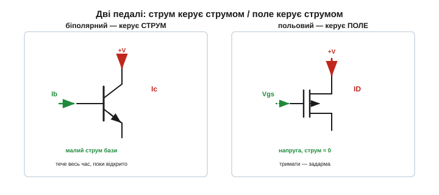
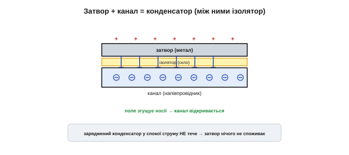
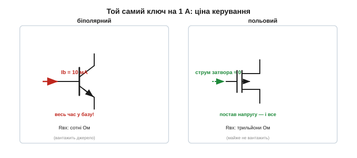
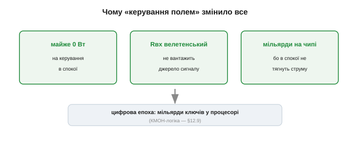

# Керування полем: як напруга керує струмом і чому це майже задарма

<preknowlist>
- [Робота BJT](root:hw-components/bjt-operation) — струмокерований прилад: у базу весь час тече керівний струм Ib, і він відмикає у β разів більший струм Ic = β·Ib.
- [Напівпровідник](root:ph-condensed/semiconductor) — речовина, що проводить завдяки порівняно небагатьом вільним носіям заряду; що їх більше в даному об'ємі, то менший його опір.
- [Електричне поле](root:ph-electromagnetism/electric-field) — те, що діє на заряд силою; його джерелом є нерухомий заряд, і воно проникає навіть крізь ізолятор.
- [Конденсатор](root:hw-components/capacitor) — дві обкладки з ізолятором між ними; заряд Q = C·U сидить на них без струму, а струм тече лише ту коротку мить, поки ємність заряджається.
- [Зміщення діода](root:hw-components/diode-bias) — зворотно зміщений p-n перехід не проводить і розширює навколо себе збіднену зону, вільну від рухомих носіїв.
</preknowlist>

Біполярний транзистор має рису, яку легко проминути, доки не почнеш рахувати енергію: свій стан він тримає лише доти, доки в нього **вливають струм**. Щоб [біполярний ключ](root:hw-components/bjt-switch) пропускав один ампер, у базу треба безупинно лити десяту частку ампера — і ці міліампери течуть **увесь час**, поки ключ відкритий, обертаючись просто на тепло. Відкритий стан коштує не одну мить на вмикання, а безперервну плату за саме лиш **утримання**.

Тож поставмо питання руба: чи можна керувати великим струмом так, щоб за **утримання** стану не платити нічим? Яким тоді має бути керівний вивід? Споживачем струму він бути не може — інакше плата повернеться. Він мусить бути чимось, що **тримає** свій вплив само, у спокої, без жодного руху заряду. Така річ у природі є, і вона проста: **нерухомий заряд** та його [електричне поле](root:ph-electromagnetism/electric-field). Заряд, якому нема куди подітися, лишається на місці скільки завгодно довго, і його поле висить задарма. Якби струмом у напівпровіднику вдалося керувати цим полем, а не другим струмом, — утримання стану стало б безкоштовним. Саме на цьому стоїть **польовий** транзистор *(field-effect transistor, FET)*: керує **поле**, а не струм. Розберімо, як це виходить фізично — і чому «задарма» тут не образ, а точний рахунок.

## Як поле змінює провідність, нічого не вливаючи

Почнімо з того, від чого залежить провідність шматка [напівпровідника](root:ph-condensed/semiconductor). Струм у ньому несуть **вільні носії** — рухомі заряди; і за незмінної геометрії провідність тим більша, чим **більше** цих носіїв у робочому шляху. Мало носіїв — високий опір, шлях майже перекрито; багато — низький опір, струм тече вільно. Отже, керувати провідністю — це керувати **числом носіїв** у каналі.

Тепер головний хід. Піднесімо збоку до напівпровідника електрод і подаймо на нього заряд. Його [поле](root:ph-electromagnetism/electric-field) проникає в напівпровідник і діє силою на тамтешні рухомі носії: однойменні відштовхує, різнойменні притягує. Досить сильне поле **збирає** носії в тонкий приповерхневий шар — і там, де їх нагромадилося, простягається провідна доріжка; або, навпаки, **виганяє** носії з шару — і доріжка зникає. Керівний електрод при цьому **не обмінюється з каналом жодним носієм**: він нічого не вливає, лише своїм полем наказує наявним зарядам зібратися чи розійтися. Оцей вплив поля на провідність і зветься **польовим ефектом** *(field effect)*, а вивід, що його чинить, — **затвором** *(gate)*. Робочий струм тече каналом між двома іншими виводами: **витоком** *(source)*, звідки носії беруться, і **стоком** *(drain)*, куди вони стікають; а керівна величина — це напруга затвор–витік **Vgs**.

Ось у чому корінна відмінність від біполярного приладу. Там керування — це **інжекція**: у базу впорскують реальний струм носіїв, і саме вони, розлившись, відмикають прилад; прибрав інжекцію — стан зник. Тут керування — це **наказ полем**: затвор не постачає носіїв, він лише зганяє чи розганяє ті, що вже є. Різниця «вливати проти наказувати» і є вся суть; з неї випливе решта.


*Дві природи керування. Біполярний: у базу безперервно інжектують струм Ib, і ці носії відмикають Ic. Польовий: затвор нічого не вливає — саме лиш його поле згущує носії в каналі витік→стік. Ліворуч керують вливанням, праворуч — наказом на відстані.*

## Чому поле тримається задарма

«Задарма» варто довести, а не проголосити. Поле — це не потік, а **стан простору**, і джерело цього стану — **нерухомий заряд**. Розгляньмо затвор, відділений від каналу ізолятором. Подаймо на нього заряд Q. Стекти йому нікуди — з обох боків ізолятор, — тож він **лишається** на затворі, а разом із ним лишається і його поле в каналі. Скільки завгодно довго, без жодної підкачки.

А тепер згадаймо, що таке струм: це **рух заряду за одиницю часу**. Заряд на затворі нерухомий — отже струм крізь затвор **нульовий**, а з ним нульова й потужність утримання, бо P = U·I, а I = 0. Ось точний сенс «задарма»: одного разу ми виконали роботу, щоб **поставити** заряд (і поле), а далі природа тримає його безплатно, як тримає нерухомий камінь на полиці. Плата виникає тільки тоді, коли заряд треба **пересунути** — прибрати поле або поставити нове: лише в цю мить заряд кудись тече, а отже тече струм.

Порівняймо з базою біполярного. Її керівний стан тримається інжекцією крізь **прямо зміщений перехід**, а такий перехід за означенням **мусить проводити** — прибереш струм, і стан миттю зникне. База тримає стан, тільки поки крізь неї ллється струм; затвор тримає стан **нерухомим зарядом**, і струм йому не потрібен. Ту саму відмінність видно і в опорі керівного виводу по постійному струму: у бази це прямо зміщений перехід, опір невеликий — вона **відбирає** струм у того, хто нею керує; затвор — ізольована обкладка, його опір по постійному струму **колосальний** (частки наноампера витоку), тож він майже нічого не відбирає в джерела сигналу, а просто «слухає» його напругу.

> 🔧 **Навіщо це.** Саме ця властивість — тримати стан без струму — зробила польовий транзистор основою цифрової техніки. У процесорі мільярди ключів, і більшість часу кожен просто **стоїть** у своєму стані. Якби кожен, як біполярний, для утримання тягнув хоч дещицю струму, мільярд дещиць склалися б у десятки тисяч ампер лише на «нічогонероблення» — кристал би згорів. Поле замість струму знімає цю плату вщент: мовчазний ключ не коштує нічого.

## Затвор — конденсатор: що коштує нуль, а що ні

Розгляньмо затвор пильніше, і стане видно знайому конструкцію. Затвор — одна пластина; канал під ним — друга; між ними ізолятор. Це [конденсатор](root:hw-components/capacitor): дві обкладки, розділені діелектриком. Тому й уся поведінка керування — це поведінка конденсатора, з його точним законом.

Щоб підняти на затворі напругу U, треба покласти на нього заряд

```
Q = C·U
```

де C — [ємність затвора](root:hw-components/gate-capacitance). Тече цей заряд лише ту коротку мить, поки конденсатор заряджається (за [сталою RC](root:hw-analog/rc-time-constant) кола затвора); зарядився — і струм спинився, хоч напруга й поле лишилися. Звідси — точний поділ рахунку на дві частини.

**Утримання** коштує нуль: заряд стоїть, струму нема. **Перемикання** коштує, і скільки саме — легко порахувати. Якщо ключ перемикають із частотою f, то щоразу цю ємність доводиться перезаряджати — раз у раз лити на затвор заряд Q і зливати його назад. Середній струм затвора й динамічна потужність тоді:

```
I ≈ Q·f   = C·U·f
P ≈ C·U²·f
```

**Умова: силовий MOSFET з ємністю затвора C = 1 нФ, керуємо напругою U = 10 В.**
```
Заряд на затворі:       Q = C·U    = 1e-9 · 10       = 10 нКл   (ставимо раз)
Струм на утримання:     I = 0                                    (заряд стоїть)

Перемикаємо f = 100 кГц:
Середній струм затвора:  I ≈ Q·f    = 10e-9 · 1e5      = 1 мА
Динамічна потужність:    P ≈ C·U²·f = 1e-9 · 100 · 1e5 = 0.01 Вт = 10 мВт
```

Тримати відкритим — рівно нуль. Смикати сто тисяч разів на секунду — усього міліампер і десяток міліват. Ось чому польове керування таке вигідне для логіки, що більшість часу **стоїть**, і чому воно ж вимагає **потужного драйвера затвора** там, де перемикати доводиться часто й швидко: уся плата польового ключа сидить у цьому C·U²·f.


*Затвор, ізолятор і канал — це конденсатор. Напруга заряджає його раз (Q = C·U), і далі поле тримає канал відкритим без струму. Рахунок приходить лише за перезаряджання цієї ємності — тобто рівно стільки разів, скільки ключ перемикають.*

## Два способи керувати каналом: прибрати носіїв чи додати

Поле може керувати провідністю двома протилежними шляхами, і на кожному збудовано свій рід польового транзистора. Різниця в тому, що поле робить із носіями — **проганяє** їх чи **зганяє**.

Перший шлях — **збіднення** *(depletion)*. Канал уже проводить сам по собі, а затвором служить [зворотно зміщений p-n перехід](root:hw-components/diode-bias). Його поле розширює навколо себе **збіднену зону** — шар, з якого носіїв вигнано, — і ця зона з боків **стискає** провідний канал, лишаючи вужчий прохід. Глибше зміщення — товща збіднена зона — вужчий канал — менший струм; досить глибоко — канал перетиснуто зовсім. Так улаштований **JFET** *(junction FET — «перехідний»)*. Він **нормально відкритий** *(normally-on)*: без напруги на затворі канал є, і поле його лише **прикриває**.

Другий шлях — **збагачення** *(enhancement)*. Каналу немає зовсім, а затвор ізольовано від напівпровідника тонким шаром оксиду ([шаром скла](root:hw-components/mosfet-structure)). Поле такого затвора **притягує** носії до поверхні й **створює** провідну доріжку там, де її не було; більша напруга — густіша доріжка — більший струм. Так улаштований **MOSFET** *(metal-oxide-semiconductor FET)*. Він **нормально закритий** *(normally-off)*: без напруги каналу немає, і поле його **відчиняє**.

Обидва — те саме керування полем; уся відмінність у тому, чи поле **прибирає** носіїв (збіднення, нормально відкритий), чи **додає** їх (збагачення, нормально закритий). Саме нормально закритий MOSFET став основою цифрової техніки: у спокої він розімкнений, як і належить безпечному ключеві. Те, з якої напруги-[порога](root:hw-components/mosfet-threshold) канал починає проводити, і чим [N-канальний прилад різниться від P-канального](root:hw-components/nmos-pmos), — окремі теми; тут важливий сам вибір із двох знаків одного польового ефекту.

## Керує напруга — тому й «підсилення» інше

У цій різниці ховається наслідок, який видно вже в самій **розмірності** керування. У біполярного вихідний струм задає вхідний **струм**, тож «підсилення» — це відношення струму до струму:

```
β = Ic / Ib     — безрозмірне (А/А)
```

У польового вихідний струм задає вхідна **напруга**. Отже його «підсилення» — це вже не безрозмірне число, а відношення струму до напруги, тобто **провідність**, що міряється в сименсах (А/В). Цю величину звуть **крутість** *(transconductance, gm)*:

```
gm = ΔId / ΔVgs     — провідність (А/В), сименс
```

Змінилася не позначка, а **природа** зв'язку: керівна дія біполярного — струм, польового — напруга, і тому їхні коефіцієнти підсилення несумірні за самою розмірністю. Порахувати вплив просто:

**Умова: MOSFET із крутістю gm = 0.5 А/В; піднімаємо напругу затвор–витік на 1 В.**
```
ΔId = gm · ΔVgs = 0.5 · 1 = 0.5 А
```

Пів ампера приросту стоку — і жодного струму, витраченого на керування, бо вхід польового це напруга, яку він «слухає» ізольованим затвором. Звідси й безцінна для схемотехніки риса: польовий каскад майже не **вантажить** те, чим керує, — кволий давач, попередній ступінь, високоомне джерело. Він міряє напругу, нічого з неї не відбираючи; повне пояснення того, як крутість пов'язує вхідну напругу з вихідним струмом, — в [окремій темі про gm](root:hw-analog/transconductance).


*Той самий ключ на 1 А: біполярному в базу треба безперервно лити ~10 мА, польовому в затвор — майже нічого. Тому «підсилення» біполярного безрозмірне (струм/струм, β), а польового має розмірність провідності (струм/напруга, крутість gm): на вході стоїть напруга, і вхідний струм ≈ 0.*

## Зворотний бік ізольованого затвора

Чесно довести ідею до кінця — значить назвати й ціну. Та сама риса, що дає польовому нескінченний вхідний опір, — ізольований затвор із **дуже тонким** шаром оксиду (одиниці нанометрів) — робить його ж вразливим. Тонкий ізолятор означає, що навіть помірна напруга створює в ньому величезне поле; а статична електрика з пальця, у кілька кіловольт, легко **пробиває** оксид і **назавжди** руйнує затвор. Тому польові транзистори бояться статичного розряду *(ESD, electrostatic discharge)*: їх зберігають в антистатичній тарі, а на затвори ставлять захисні діоди.

Друга частина ціни вже прозвучала в рахунку C·U²·f: ємність затвора, безкоштовна на утриманні, мусить перезаряджатися **щоперемикання**, і на високих частотах це вже відчутна динамічна потужність та стеля швидкості. Виходить симетрично: ізольований тонкий затвор дає силу (тримає стан задарма, не вантажить джерело) і водночас слабкість (боїться пробою, потребує заряду на кожне перемикання) — це одна й та сама риса, обернена двома боками.

> 🔧 **Навіщо це.** Практичний висновок прямий: MOSFET на столі не беруть за затвор голими руками й не лишають затвор «висіти» в повітрі непідключеним — заряд, що набіжить на ізольовану обкладку, нема куди стекти, і поле легко дійде до пробою. Заземлений браслет, антистатичний килимок, зберігання у струмопровідній фользі — не забаганка, а пряма плата за той самий ізольований затвор, що дає всю економність.

## Керувати зміною, а не утриманням

Складімо тепер усе в одну думку. Два способи керувати струмом різняться не деталями будови, а **питанням**, яке вони ставлять керівному виводу. Струмове керування питає: «скільки струму ти вливатимеш — і вливатимеш **безперервно**?», і рахунок за це йде весь час, поки стан тримається. Польове керування питає інше: «скільки заряду ти **припаркуєш** поруч?», і припаркований заряд тримає своє поле сам, задарма; рахунок приходить лише тоді, коли заряд доводиться пересунути.

Виявилося, що весь цифровий світ — це світ припаркованого заряду. Мільярди ключів і комірок, кожна тримає свій стан полем, нічого не споживаючи в спокої, а струм тягне лише в **мить** перемикання — на цьому стоїть [КМОН-логіка](root:hw-digital/cmos), а на ній — усі процесори й пам'ять. Саме тому на клаптику кремнію вміщуються мільярди ключів і не плавлять його: мовчазний ключ безкоштовний, і платить схема лише за те, що **міняється**.

Ось де справжня вага ідеї «керувати струмом полем». Вона переносить плату з утримання на зміну — а оскільки будь-яке обчислення більшість часу свій стан **тримає**, а не міняє, ця єдина відмінність і виявилася достатньою, щоб віддати польовому транзистору всю обчислювальну техніку. (Ідея ця, до речі, стара: її запатентували ще 1925 року, а робочою вона стала аж тоді, коли навчилися ізолювати затвор шаром скла, — про цей тридцятирічний шлях є [окрема історія](root:hw-components/field-control/hist-mosfet.md).)


*Наслідки одного принципу. Керування полем не витрачає струму на утримання → величезний вхідний опір і майже нульова статична потужність → мільярди ключів на одному кристалі, що не плавлять його. Плата залишається одна — за перемикання, C·U²·f, — і саме на цьому збудовано весь цифровий світ.*
