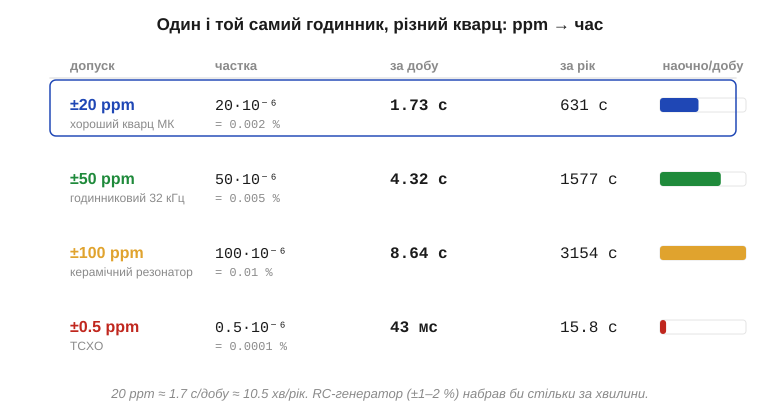
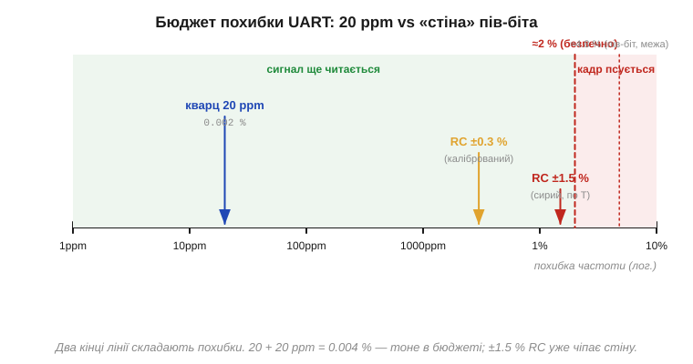

# 🧮 ppm-арифметика: ±20 ppm у секундах за добу і в дрейфі зв'язку

«±20 ppm» — типова паспортна [точність кварцу](topic:hw-components/frequency-accuracy-ppm). Розберімо, що це число означає **руками**: як за секунду перевести його в «скільки годинник збреше за добу» і в «чи витримає послідовний зв'язок (*UART*)», і чому той самий допуск буває то катастрофою, то непомітним.

### Що таке ppm

**ppm** (*parts per million*, частин на мільйон) — це просто інша назва для **відносної похибки** Δf/f, помноженої на мільйон. Один ppm — це одна мільйонна:

```
1 ppm = 1·10⁻⁶ = 0.0001 %
20 ppm = 20·10⁻⁶ = 0.002 %
```

Чому не у відсотках? Бо хороший кварц збивається на тисячні частки відсотка, і писати «0.002 %» незручно — забагато нулів. ppm — це масштаб, у якому числа для кварцу стають зручними: одно- чи двоцифровими. Думати про це варто так: ppm — це **скільки одиниць похибки припадає на мільйон одиниць величини**. Якщо номінал 16 000 000 Гц, то 20 ppm — це 20 «непевних» герц на кожен мільйон, тобто:

```
Δf = f · (ppm·10⁻⁶) = 16 000 000 × 20·10⁻⁶ = 320 Гц
```

### Інтуїція: ppm — це частка часу

Головна ідея, з якої випливає все решта: годинник рахує **час**, відлічуючи такти. Якщо частота завищена на частку x = ppm·10⁻⁶, то й тактів за секунду набіжить на ту саму частку більше — і годинник «з'їсть» зайвий час — ту саму частку від прожитого. Іншими словами, **відносна похибка частоти дорівнює відносній похибці часу**. Тому ppm одразу перекладається в секунди: бери частку й множ на проміжок.

```
помилка часу = (ppm·10⁻⁶) · інтервал
```

Доба — це 86400 секунд. Звідси й знаменита оцінка для ±20 ppm:

```
за добу:  20·10⁻⁶ × 86400 с  = 1.728 с  ≈ 1.7 с/добу
за рік:   20·10⁻⁶ × 86400 × 365 ≈ 631 с ≈ 10.5 хв/рік
```

Знак ± означає, що годинник може як спішити, так і відставати на стільки — допуск задає **коридор**, а не напрям. Решта типових допусків рахується тим самим множенням; зведено на драбині нижче.


*Той самий годинник із різним джерелом частоти. ±20 ppm кварцу МК — 1.7 с/добу; годинниковий камертон ±50 ppm — 4.3 с/добу (≈ 26 хв/рік); дешевий керамічний резонатор ±100 ppm — майже 9 с/добу. Для контрасту TCXO ±0.5 ppm збивається лише на 43 мс за добу. Усе — одне множення частки на 86400.*

> 🔧 **Навіщо це.** Це усний розрахунок, який варто вміти робити за столом. Питання «годинник пристрою відстав на 5 хвилин за два тижні — це нормально?» розв'язується миттєво: 5 хв = 300 с за 14 діб ≈ 21 с/добу ≈ 250 ppm. Для кварцу ±20 ppm — це **в десять разів** за межею паспорта, отже, проблема не в старінні, а в схемі (швидше за все, не та [навантажувальна ємність CL](topic:hw-analog/pierce-oscillator), що тягне частоту) або в підробці.

### Той самий допуск — у швидкості зв'язку

Тепер інший бік медалі. Послідовний зв'язок без окремої лінії такту (*asynchronous*, як UART) тримається на тому, що **обидва кінці однаково міряють час біта**. Передавач кладе біти з періодом, заданим своїм тактом; приймач відлічує від стартового фронту й читає кожен біт **у його середині**. Якщо їхні частоти розходяться, точка читання поступово сповзає від середини до краю — і на якомусь біті промахується.

Запас тут — пів-біта (поки накопичена різниця менша за пів-біта, читання ще влучає в правильний біт). Кадр UART — це ≈ 10–11 бітів (старт + 8 даних + стоп), а накопичується похибка від старту до **останнього** біта. Грубо:

```
бюджет на сумарну похибку ≈ (½ біта) / (бітів у кадрі)
                          ≈ 0.5 / 10.5 ≈ 4.8 %   (теоретична межа, нуль запасу)
```

На практиці закладають запас на джиттер і фазу старт-біта, тож реальний **безпечний** бюджет — близько ±2 % на з'єднання, і він ділиться між двома кінцями. Тепер підставимо наші 20 ppm:

```
кварц:   20 ppm = 0.002 %   два кінці → 0.004 %   запас ≈ у 500 разів
RC, сирий: ±1.5 %           два кінці → до 3 %     уже за межею 2 %
```


*Вісь — відносна похибка частоти (логарифмічна). Кварц 20 ppm стоїть біля лівого краю — 0.002 %, на три порядки лівіше від безпечної межі ≈2 %. Калібрований внутрішній RC (≈0.3 %) ще влазить у зелену зону, а сирий нескомпенсований RC (≈1.5 %, та ще й «гуляє» з температурою) підпирає стіну — досить невеликого нагріву, щоб кадр почав сипатися.*

Ось і відповідь, чому той самий ±20 ppm — то «10 хвилин на рік» (відчутно для годинника), то «запас у сотні разів» (для UART): усе залежить від того, **з чим порівнюємо частку**. Для відліку часу мірило — доба, і дрібна частка набігає в помітні секунди. Для зв'язку мірило — частка пів-біта, і навіть сирий RC часто проходить, а кварцу там просто ніде збитися.

### Де це працює

Ця арифметика перетворює абстрактний паспортний допуск на конкретний вердикт «годиться / ні» для задачі. Вона ж пояснює піраміду точності джерел частоти: чому для годинника реального часу (*RTC*) женуться за одиницями ppm, а для тактування UART вистачає і скромного джерела. І вона змикається з [добротністю Q](topic:hw-analog/quality-factor): висока Q кварцу — це фізична причина, чому його Δf/f тримається в межах десятків ppm, а LC-контур чи RC — ні. Запам'ятати варто дві дії: **секунди за добу = ppm·10⁻⁶ × 86400**, а **запас для зв'язку = частка пів-біта проти суми похибок обох кінців**.
