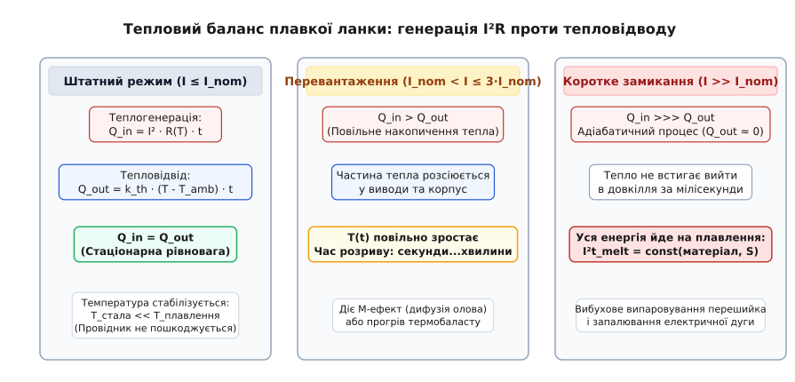
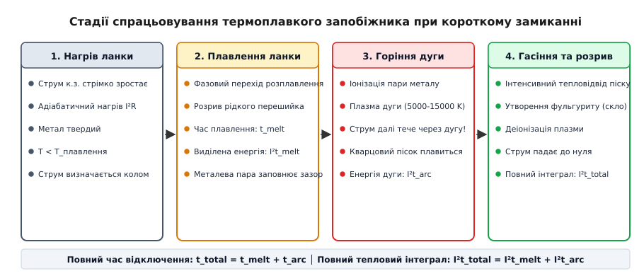
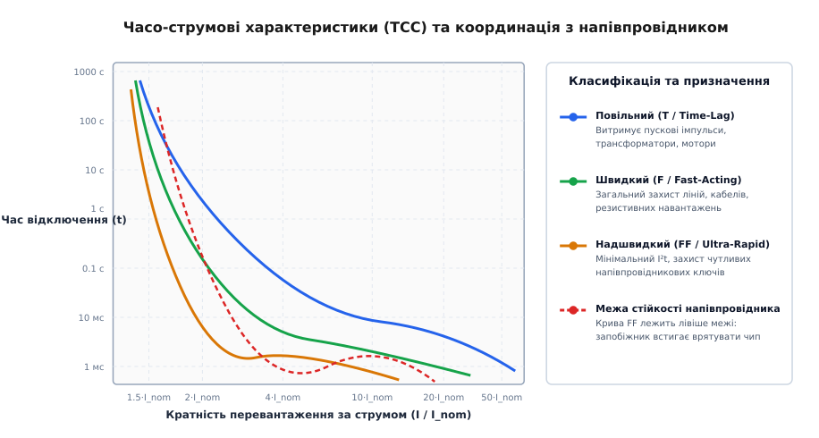
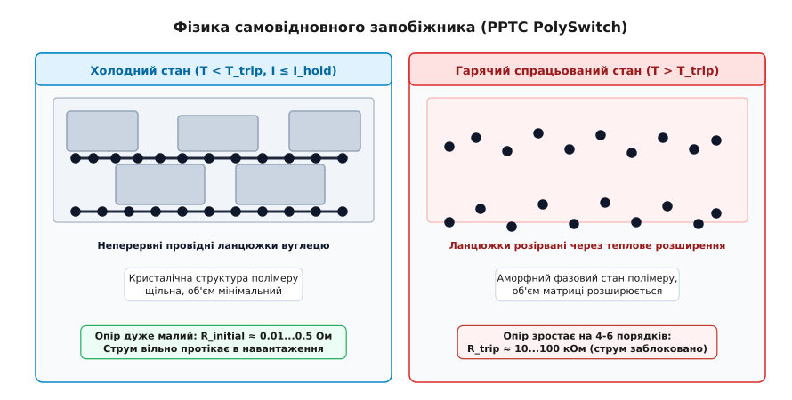

# 🔌 Принцип роботи запобіжника

<preknowlist>
- [Закон Ома](topic:hw-analog/ohms-law) — співвідношення між напругою, струмом і активним опором провідника `V = I · R`.
- [Джоулеве тепло](topic:ph-electromagnetism/joule-heating) — виділення теплової потужності `P = I² · R` під час проходження електричного струму.
- [Опір і температура](topic:ph-condensed/resistance-temperature) — зростання питомого опору металів при нагріванні та стрибки провідності матеріалів.
- [Коротке замикання](topic:hw-analog/short-circuit) — аварійне зростання струму в колі з малим внутрішнім імпедансом джерела.
</preknowlist>

Коли на друкованій платі пробиває силовий транзистор або металевий інструмент випадково замикає клеми джерела живлення 24 В з внутрішнім опором 10 мОм, струм у контурі за частки мікросекунди злітає від штатних 2 А до 2400 А. Густина струму в мідних провідниках шириною 1 мм перевищує десятки тисяч амперів на квадратний міліметр, температура міді зростає на тисячу градусів за мілісекунду, текстоліт плати вибухає з виділенням горючих газів, а проводи спалахують відкритим полум'ям. Єдиний спосіб запобігти катастрофічній пожежі та руйнуванню обладнання — встановити в коло елемент, який розірве аварійний струм раніше, ніж решта провідників встигне нагрітися до критичної температури. Цим елементом є запобіжник — навмисно спроєктована найслабша ланка системи, що перетворює руйнівну енергію аварійного струму на кероване власне самознищення або зворотний фазовий перехід.

### Тепловий баланс та фазовий перехід плавлення

В основі роботи класичного одноразового плавкого запобіжника лежить закон Джоуля-Ленца: протікання електричного струму `I` крізь калібрований провідник з активним опором `R` супроводжується виділенням теплової енергії `Q = I² · R · t`. У кожну мить часу тепловий стан плавкої ланки визначається динамічним балансом між швидкістю генерації тепла та швидкістю його відведення в навколишній простір:

```
P_gen = P_cond + P_conv + P_rad + C_th · (dT / dt)
```

де `P_gen = I² · R(T)` — миттєва потужність тепловиділення, `P_cond` — тепловий потік через металеві виводи в контактні тримачі та друковані доріжки, `P_conv` — конвективне охолодження газом або наповнювачем усередині корпусу, `P_rad` — теплове випромінювання нагрітого металу, а `C_th · (dT/dt)` — швидкість акумуляції теплової енергії в масі самого провідника.


*Тепловий баланс плавкої ланки в різних режимах: у штатному режимі (ліворуч) тепло встигає відводитися через виводи; при помірному перевантаженні (посередині) ланка повільно накопичує енергію; при короткому замиканні (праворуч) тепловідводом можна знехтувати, і вся енергія йде на вибухове розплавлення.*

Поки струм не перевищує номінального значення `I_nom`, система перебуває в стаціонарній тепловій рівновазі: `dT/dt = 0`. Усе виділене тепло повністю розсіюється через виводи й корпус, а температура ланки стабілізується на безпечному рівні (типово 70–130 °C), за якого метал не окислюється й не втрачає механічної міцності.

Коли струм перевищує номінал у 1.5–3 рази (зона помірного перевантаження), теплогенерація починає переважати тепловідвід: `P_gen > P_loss`. Температура ланки повільно піднімається. З підвищенням температури питомий опір металу зростає за лінійним законом `ρ(T) = ρ₀ · [1 + α · (T - T₀)]`, де для міді та срібла температурний коефіцієнт `α ≈ 0.0039 1/K`. Зростання опору ще більше збільшує потужність `I²R`, створюючи слабкий додатний зворотний зв'язок. Через секунди або хвилини найгарячіша точка провідника досягає температури плавлення `T_m`.

При короткому замиканні, коли кратність струму перевищує номінал у 10–100 разів, процес набуває виключно адіабатичного характеру: час наростання аварії (мікросекунди або мілісекунди) настільки малий, що тепловідвід у довкілля становить менше ніж 0.1% від згенерованої енергії (`P_loss ≈ 0`). Уся джоулева енергія витрачається на внутрішнє нагрівання металу.

Досягнувши температури плавлення `T_m`, провідник поглинає приховану питому теплоту плавлення `λ_m` при незмінній температурі. У цей момент тверда кристалічна ґратка руйнується, метал переходить у рідкий стан, а його питомий опір стрибкоподібно зростає в 1.5–2.2 раза.

На рідкий стовпчик розплавленого металу починають діяти дві руйнівні фізичні сили:
1. **Капілярна нестійкість Релея-Плато:** під дією сил поверхневого натягу циліндричний рідкий стовпчик мимовільно розпадається на ланцюжок окремих ізольованих сферичних крапель, мінімізуючи свою поверхневу енергію.
2. **Електродинамічний пінч-ефект (Pinch Effect):** радіальні сили Лоренца `F = j × B`, породжені власним потужним магнітним полем струму високої густини, стискають рідкий метал у радіальному напрямку, виштовхуючи його з вузьких місць і прискорюючи утворення геометричних розривів.

У місці першого найтоншого розриву густина струму миттєво злітає до нескінченності, метал вибухоподібно закипає й випаровується, утворюючи первинний газовий зазор, заповнений розжареною металевою парою.

> 🧮 **Математична вставка:** [Розрахунок теплового інтеграла плавлення I²t та інтегрування імпульсних струмів](topic:hw-components/fuse-operation/math-i2t-derivation.md). Суворе виведення диференціального балансу адіабатичного нагріву, формула Мейєра через константи металу, геометрія перфорованих звужень та аналітичні формули `I²t` для експоненційних, трикутних і півсинусоїдних імпульсів.

### Металургія ланки та металургійний М-ефект (ефект Меткалфа)

Вибір матеріалу для плавкого елемента є компромісом між електропровідністю, стійкістю до окислення, температурою плавлення та хімічною стабільністю.

Срібло (Ag) є ідеальним матеріалом для високоточних і силових швидкодіючих запобіжників: воно має найвищу питому електропровідність, не окислюється на повітрі при температурах до кількох сотень градусів, а його оксиди термічно розпадаються назад у чистий метал при нагріванні вище 200 °C. Мідь (Cu) близька до срібла за провідністю, проте за високих температур піддається повільному окисленню, через що мідні ланки покривають тонким шаром срібла, нікелю або олова.

Однак срібло й мідь мають високу температуру плавлення (962 °C і 1085 °C відповідно). Якщо запобіжник зазнає помірного тривалого перевантаження (наприклад, 130–150% від номіналу), срібна смужка розжарюється до 800–900 °C протягом кількох хвилин. Таке екстремальне розжарення корпусу може пошкодити контактні затискачі, розплавити прилеглі пластикові деталі приладу або розпаяти доріжки на друкованій платі задовго до того, як срібло нарешті розплавиться.

Для вирішення цієї проблеми інженери застосовують металургійний ефект, відкритий британським металургом Альфредом Меткалфом — **М-ефект** (*Metcalf effect* / *M-effect*).

Суть М-ефекту полягає в тому, що на середину срібної або мідної смужки наносять крихітну краплю або смужку металу з низькою температурою плавлення — зазвичай олова (Sn, точка плавлення 232 °C) або евтектичного сплаву олово-свинець / олово-срібло.

Фізичний механізм розгортається у три стадії:
1. При перевантаженні струмом ланка нагрівається до температури близько 230 °C. Олов'яна крапля плавиться першою, залишаючись у рідкому стані на поверхні твердого срібла.
2. Рідке олово починає активно дифундувати в тверду кристалічну ґратку срібла, розчиняючи його. На межі розділу фаз утворюється інтерметалічна сполука (Ag₃Sn / Ag₄Sn).
3. Цей інтерметалід має дві вирішальні властивості: його температура плавлення істотно нижча за чисте срібло (евтектична точка близько 221–480 °C залежно від пропорції), а питомий електричний опір у 5–10 разів вищий, ніж у чистого срібла. Утворена високоомна пляма починає розжарюватися значно інтенсивніше за решту смужки, лавиноподібно розплавляється та розмикає ланку при температурі всього 250–350 °C замість 962 °C.

Завдяки М-ефекту запобіжник отримує можливість безпечно вимикати малі струми перевантаження за помірної температури корпусу, зберігаючи при цьому високу електропровідність і мінімальний опір у штатному робочому режимі.

> 📜 **Історична вставка:** [Від свинцевих смужок Едісона до піщаних патронів: історія плавкого захисту](topic:hw-components/fuse-operation/hist-edison-fuse.md). Як небезпечні пожежі в перших освітлювальних мережах Нью-Йорка привели до патенту Томаса Едісона 1880 року, появи закритих патронів Мордея й Картрайта, заснування лабораторій Underwriters Laboratories (UL) та винаходу самовідновних полімерних структур PolySwitch.

### Механізм гасіння електричної дуги та кварцовий пісок

Найпоширеніша помилка початківця — вважати, що процес захисту завершується в мить розплавлення та розриву металевої нитки. Насправді фізичний розрив металу — це лише середина процесу, і часто найнебезпечніша його фаза.

У момент розриву ланки між її розплавленими кінцями залишається зазор величиною від десятих часток міліметра до кількох міліметрів. Напруга джерела живлення виявляється прикладеною до цього мікроскопічного проміжку, створюючи напруженість електричного поля `E = V / d` порядку мільйонів вольтів на метр. Під дією термоелектронної емісії з розпечених крапель металу та ударної іонізації залишкова пара металу миттєво іонізується — спалахує **електрична дуга**.


*Чотири послідовні фази спрацьовування запобіжника при короткому замиканні: від початкового нагріву ланки до плавлення, горіння електричної дуги та її остаточного згасання в кварцовому піску з утворенням непровідного фульгуриту.*

Електрична дуга — це стовп квазінейтральної високотемпературної плазми з температурою від 5000 до 15 000 K. Опір плазмового шнура дуже низький, тому струм продовжує безперешкодно протікати крізь дугу. Якщо дугу не загасити за частки мілісекунди, енергія, що виділиться в обмеженому об'ємі корпусу запобіжника (`Q = ∫ v_arc(t) · i(t) dt`), призведе до зростання внутрішнього тиску газів до сотень атмосфер. Скляний або керамічний корпус лусне з вибухом, а розпечена плазма та бризки металу спалять навколишні компоненти плати.

Щоб погасити дугу, необхідно примусово підняти її спад напруги `v_arc(t)` вище за напругу джерела живлення `V_source`. Цього досягають за допомогою дугогасного наповнювача — високоочищеного гранульованого **кварцового піску** (діоксиду кремнію, `SiO₂`).

Фізика гасіння дуги у кварцовому піску базується на трьох одночасних механізмах:

1. **Інтенсивний кондуктивний відбір тепла:** Сумарна площа поверхні тисяч дрібних гранул кварцового піску, що оточують плавку смужку, становить десятки квадратних сантиметрів у мікроскопічному об'ємі. Плазмовий шнур дуги вступає в безпосередній контакт із холодними гранулами кварцу. Теплопровідність кварцу та величезна площа контакту спричиняють вибухоподібне охолодження дугового каналу.
2. **Деіонізація та рекомбінація зарядів:** Охолодження плазми знижує теплову енергію електронів нижче потенціалу іонізації газу. Швидкість рекомбінації електронів з позитивними іонами різко зростає, концентрація носіїв заряду в стовпі падає на кілька порядків, і опір дуги стрімко підскакує в тисячі разів.
3. **Утворення штучного фульгуриту:** Плазма дуги оплавляє прилеглі піщинки кварцу (точка плавлення `SiO₂ ≈ 1710 °C`). Розплавлений кварц розчиняє в собі пари металу й при охолодженні за лічені мікросекунди твердне в монолітну склоподібну трубку — **фульгурит** (лат. *fulgur* — блискавка). Фульгурит є високоякісним електричним ізолятором: він герметизує розплавлені кінці електродів, фізично блокуючи можливість повторного запалювання дуги.

Параметр, що кількісно описує здатність запобіжника безпечно загасити дугу максимального аварійного струму без механічного руйнування корпусу, називається **граничною відключною здатністю** (*Breaking Capacity* або *Interrupting Rating*). Прості скляні запобіжники без наповнювача мають низьку відключну здатність (35–100 А при 250 В AC), тому їх застосовують лише в низькоенергетичних вторинних колах. Керамічні патрони, заповнені кварцовим піском, мають відключну здатність від 1.5 кА до 100–200 кА, що дозволяє безпечно встановлювати їх прямо на силових вводах мережі живлення 230/400 В.

> 🔧 **Навіщо це.** Заміна перегорілого керамічного запобіжника з піском на дешевий прозорий скляний того самого струмового номіналу (наприклад, 10 А) у вхідному колі блока живлення — це груба помилка. Якщо на платі станеться глухе коротке замикання мережі зі струмом к.з. 1500 А, скляна колба без піску не зможе згасити дугу й розлетиться на дрібні уламки, перетворившись на шрапнель і спричинивши внутрішню пожежу.

### Тепловий інтеграл I²t та координація захисту з напівпровідниками

Для оцінки теплової дії короткочасних імпульсів струму стандартного номінального струму `I_nom` недостатньо. Інженери використовують величину **інтеграла Джоуля** або **теплового інтеграла**:

```
I²t = ∫₀^t i²(τ) dτ
```

Ця величина вимірюється в амперах у квадраті на секунду (А²·с) і прямо пропорційна тепловій енергії, яка виділиться на будь-якому постійному активному опорі контуру за час протікання струму `i(t)`.

Повний процес відключення запобіжника характеризується трьома інтегральними значеннями:

```
I²t_total = I²t_melt + I²t_arc
```

1. **Інтеграл плавлення (`I²t_melt`):** енергія, необхідна для нагрівання та повного розплавлення металевої ланки до моменту виникнення електричної дуги. Ця величина є суто внутрішньою константою конструкції запобіжника (залежить лише від матеріалу й площі перерізу перешийка) і не залежить від напруги кола.
2. **Дуговий інтеграл (`I²t_arc`):** енергія, яка виділяється в колі за час горіння та гасіння електричної дуги в піщаному наповнювачі. Ця величина істотно залежить від напруги живлення кола, індуктивності мережі та коефіцієнта потужності (cos φ).
3. **Повний інтеграл відключення (`I²t_total` або `I²t_clearing`):** сумарна теплова енергія, яку пропустить запобіжник у навантаження від моменту виникнення аварії до повного знеструмлення кола.


*Часо-струмові характеристики запобіжників різної швидкодії (T, F, FF) у логарифмічному масштабі та їхня координація з граничною кривою стійкості напівпровідника.*

Особливе значення тепловий інтеграл має для захисту силової напівпровідникової електроніки — випрямляльних діодів, тиристорів, симісторів, IGBT та MOSFET.

Кремнієвий кристал силового транзистора чи діода має мікроскопічний об'єм (частки кубічного міліметра), а отже, його власна теплоємність мізерно мала. При протіканні надструму короткого замикання температура p-n переходу підскакує вище критичної межі (150–200 °C) за частки мілісекунди, викликаючи незворотний тепловий пробій напівпровідника або розплавлення алюмінієвих мікропроволочок контактного зварювання.

У технічній документації на будь-який силовий напівпровідниковий прилад виробник обов'язково вказує гранично допустимий тепловий інтеграл кристала: `I²t_device` (або `I²t_SCR` для імпульсу 10 мс).

Щоб запобіжник зміг урятувати дорогий силовий напівпровідниковий модуль, обов'язково має виконуватися строге правило **координації захисту**:

```
I²t_total(fuse) < k_safety · I²t_device
```

де `k_safety = 0.7...0.8` — інженерний коефіцієнт запасу на розкид параметрів мережі та підвищену температуру.

Звичайні швидкі запобіжники загального призначення (тип F) для цього непридатні: їхній дуговий інтеграл `I²t_arc` занадто великий. Для порятунку кремнію застосовують спеціалізовані **надшвидкі запобіжники** (*Super-Rapid* / *Ultra-Fast*, класи aR та gR за стандартом IEC 60269-4). Вони виготовляються з тонких срібних стрічок із десятками паралельних перфорацій, що забезпечує мінімальну площу перешийків та утворення багатьох коротких дуг одночасно, знижуючи повний `I²t_total` до рівня, безпечного для кремнієвого кристала.

> ⚙️ **Алгоритмічна вставка:** [Алгоритм інженерного вибору та координації запобіжника](topic:hw-components/fuse-operation/proj-fuse-sizing.md). Повний розрахунковий модуль на C та C++: автоматичний підбір номіналу з урахуванням температурного дератингу, пускового імпульсу `I²t`, циклічної втоми металу (Pulse Factor), каскадної селективності та координації з напівпровідниками.

### Часо-струмові характеристики (Time-Current Curves)

Залежність часу відключення запобіжника від кратності протікаючого струму описується паспортом компонента у вигляді графіків — **часо-струмових характеристик** (TCC). Через те, що струм змінюється від одиниць до тисяч амперів, а час спрацьовування — від мікросекунд до годин, ці графіки завжди будують у подвійному логарифмічному масштабі: по осі абсцис відкладають струм або його кратність `I / I_nom`, по осі ординат — час `t`.

За формою та розташуванням кривої TCC запобіжники поділяють на класи швидкодії:

- **Надшвидкі (Ultra-Rapid / Very Fast / FF):** Крива максимально зсунута ліворуч униз. Спрацьовують за 0.1–2 мс при кратності 5–10 `I_nom`. Призначені виключно для захисту силових напівпровідників (тиристорів, діодів, транзисторів). Не витримують жодних пускових сплесків.
- **Швидкі (Fast-Acting / F):** Стандартний захист загального призначення. При перевантаженні 200% розмикають коло за 1–10 секунд, при короткому замиканні (10 `I_nom`) — за 10–50 мс. Захищають резистивні навантаження, кабельні лінії та друковані плати без великих вхідних ємностей.
- **Повільні (Slow-Blow / Time-Lag / T):** Мають виражену затримку спрацьовування. При 200% струму тримають коло десятки секунд, при 5–10 `I_nom` час спрацьовування становить від 100 мс до 1 секунди. Призначені для навантажень із високими пусковими струмами (електродвигуни, силові трансформатори, імпульсні блоки живлення з великими конденсаторами фільтра).

Конструктивно повільний запобіжник вирізняється тим, що його ланка має підвищену теплову масу. У скляних корпусах це часто спірально намотаний дріт навколо керамічного сердечника або подвійний елемент: міцна пружина з тугоплавкого металу, зафіксована краплею легкоплавкого припою з термобаластом. Короткий імпульс струму нагріває баласт, але припій не встигає розплавитися, і після закінчення імпульсу тепло безпечно розсіюється у виводи.

### Самовідновні полімерні запобіжники (PolySwitch / PPTC)

В сучасній мікроелектроніці, портативних гаджетах та інтерфейсних портах (USB, HDMI, Ethernet PoE) заміна перегорілого одноразового запобіжника створює значні незручності. Тому для захисту слабкострумових ліній застосовують **самовідновні запобіжники** на основі полімерних матеріалів із позитивним температурним коефіцієнтом опору — **PPTC** (*Polymeric Positive Temperature Coefficient*, комерційна назва *PolySwitch*).


*Мікроструктура полімерного самовідновного запобіжника PPTC: у холодному стані (ліворуч) кристалічна матриця стискає частинки вуглецю в неперервні провідні ланцюжки; при нагріванні вище T_trip (праворуч) аморфна фаза розширюється, розриваючи контакт між частинками.*

#### Фізична структура та фазовий перехід

Серцевиною PPTC-запобіжника є композитний матеріал, що складається з двох компонентів:
1. Матриця з частково кристалічного неполярного органічного полімеру (найчастіше поліетилен високої щільності HDPE або полівініліденфторид PVDF).
2. Дрібнодисперсні провідні наночастинки технічного вуглецю (сажі, *carbon black*) або металевого порошку, рівномірно розподілені в об'ємі полімеру.

Механізм функціонування PPTC базується на явищі квантової та контактної перколяції при фазовому переході полімеру:

- **Холодний стан (провідний, `T < T_trip`):** Полімер перебуває у напівкристалічній фазі. Кристалічні зони (кристаліти) під час застигання витісняють нерозчинні частинки вуглецю в аморфні проміжки між кристалітами. У результаті вуглецеві частинки виявляються спресованими у високій локальній концентрації, утворюючи розгалужену тривимірну сітку неперервних струмопровідних ланцюжків. Опір приладу в цьому стані мінімальний і становить від кількох міліомів до десятих часток ома (`R_initial ≈ 0.01...0.5 Ом`). Струм безперешкодно протікає в навантаження.
- **Фазовий перехід розмикання (`T ≥ T_trip`):** Коли струм крізь прилад перевищує поріг спрацьовування, джоулеве тепло `I²R` нагріває полімер. При досягненні температури фазового переходу `T_trip` (зазвичай 120–135 °C) кристаліти полімеру плавляться, і полімер переходить в повністю аморфний стан.
- **Стрибок опору (Trip state):** Перехід у безладний аморфний стан супроводжується різким стрибком питомого об'єму матеріалу (термічне розширення полімерної матриці сягає 5–15%). Полімер розсуває частинки вуглецю, відстань між ними перевищує радіус тунелювання електронів, і провідні перколяційні ланцюжки масово розриваються. Опір приладу стрибкоподібно підскакує на **4–6 порядків** — від міліомів до десятків і сотень кілоомів (`R_trip ≈ 10...100 кОм`).

#### Динамічна рівновага у спрацьованому стані

Після стрибка опору струм у колі падає до мізерного значення — залишкового струму витоку `I_leak` (одиниці або десятки міліамперів).

Однак цей малий залишковий струм, протікаючи крізь велетенський опір `R_trip`, продовжує виділяти в приладі теплову потужність:

```
P_latch = I_leak² · R_trip = V_source² / R_trip
```

Ця розсіяна потужність точно врівноважує тепловідвід у повітря, утримуючи температуру полімерної матриці вище точки `T_trip`. Прилад самоблокується (защіпається, *latched state*) у високоомному стані і залишатиметься розімкненим доти, доки користувач повністю не вимкне напругу живлення схеми.

#### Струм утримання (I_hold) та струм спрацьовування (I_trip)

У паспортних даних PPTC-запобіжників завжди зазначають два струмові параметри, що часто викликають плутанину:

- **Струм утримання (`I_hold`):** максимальний струм, який прилад гарантовано несе нескінченно довго за температури 23 °C без переходу у високоомний стан.
- **Струм спрацьовування (`I_trip`):** мінімальний струм, за якого прилад гарантовано переходить у високоомний стан протягом заданого часу (зазвичай `I_trip ≈ 2 · I_hold`).

Зона між `I_hold` та `I_trip` є областю невизначеності: залежно від температури середовища та умов охолодження на платі прилад може як утримувати цей струм годинами, так і повільно перейти у стан розриву.

Обидва струми надзвичайно сильно залежать від температури навколишнього середовища: при нагріванні приладу до 60–85 °C значення `I_hold` падає на 30–50% від номіналу, що вимагає обов'язкового врахування температурного запасу при проєктуванні.

#### Процес охолодження, рекристалізація та гістерезис опору

Коли зовнішнє живлення вимикається, тепловиділення припиняється, і полімер охолоджується нижче точки `T_trip`.

Полімерна матриця рекристалізується, повертаючись до вихідного щільного об'єму. Кристаліти знову стискають частинки вуглецю в неперервні провідні ланцюжки, і прилад повертається в низькоомний стан, готовий до наступного циклу захисту.

Проте процес відновлення має дві важливі особливості:
1. **Час відновлення (Reset time):** охолодження та повна рекристалізація полімеру потребують часу — від кількох секунд до кількох хвилин залежно від маси корпусу та тепловідводу плати.
2. **Гістерезис та залишковий опір (`R_1max`):** після першого спрацьовування кристалічна структура полімеру ніколи не повертається в ідеальний початковий стан. Нове просторове розташування вуглецевих доріжок призводить до того, що опір приладу після відновлення стає дещо вищим за початковий заводський опір (`R_post_trip ≈ 1.2...1.8 · R_initial`). У паспортах виробники нормують цей параметр як `R_1max` — максимальний опір через 1 годину після спрацьовування.

### Практичний інженерний розрахунок і вибір запобіжника

Повний покроковий алгоритм вибору запобіжника для реального електронного пристрою складається з п'яти обов'язкових етапів:

1. **Розрахунок номінального струму з урахуванням температури:**
   Визначають максимальний тривалий струм навантаження `I_load_max` та максимальну робочу температуру всередині корпусу `T_amb_max`. За графіком дератингу знаходять коефіцієнт `k_temp(T)`. Розраховують мінімальний номінал:
   ```
   I_nom ≥ I_load_max / (k_temp · k_UL)
   ```
   де `k_UL = 0.75` для запобіжників стандарту UL (для запобіжників IEC `k_UL = 1.0`).

2. **Аналіз форми та розрахунок інтеграла пускового імпульсу `I²t_inrush`:**
   Визначають піковий струм `I_pk` та форму пускового імпульсу (заряд конденсаторів живлення через експоненту, пусковий струм трансформатора або електродвигуна). Обчислюють математичний інтеграл `I²t_pulse`.

3. **Врахування коефіцієнта імпульсної циклічної втоми:**
   Визначають планований ресурс роботи виробу за кількістю включень у мережу. Для побутової та промислової апаратури з ресурсом 100 000 циклів номінальний інтеграл плавлення запобіжника обирають із запасом у 5 разів:
   ```
   I²t_melt(fuse) ≥ 5 · I²t_inrush
   ```

4. **Вибір класу швидкодії та координація з напівпровідниками:**
   - Для захисту ліній із ємнісним або індуктивним пуском обирають повільний тип **T (Slow-Blow)**.
   - Для захисту загальних кіл живлення без пускових сплесків обирають швидкий тип **F (Fast)**.
   - Для захисту тиристорних перетворювачів, діодних мостів або силових MOSFET перевіряють виконання умови `I²t_total(fuse) < 0.75 · I²t_semiconductor`. Якщо умова не виконується, обирають надшвидкий запобіжник класу **FF / Ultra-Rapid**.

5. **Перевірка номінальної напруги, роду струму (AC vs DC) та відключної здатності:**
   - Номінальна напруга запобіжника повинна бути не меншою за напругу кола: `V_fuse ≥ V_circuit`.
   - Для кіл постійного струму (DC) перевіряють саме **DC-рейтинг напруги** (використовувати AC-номінал у DC-колах категорично заборонено через відсутність природного нуля напруги для гасіння дуги).
   - Гранична відключна здатність запобіжника `I_breaking` повинна гарантовано перевищувати максимальний можливий струм короткого замикання джерела живлення в точці монтажу (`I_breaking ≥ I_fault_max`).

### Типові інженерні помилки та пастки

- **Плутанина номінального струму зі струмом спрацьовування:** Запобіжник із позначкою «2 А» розрахований на нескінченно тривале протікання струму 2 А. Він не розмикає коло при 2.1 А; для розплавлення ланки за прийнятний час струм повинен перевищити 1.5–2.0 від номіналу (3–4 А).
- **Використання швидкого запобіжника у колах з імпульсним пуском:** Встановлення запобіжника типу F на вході імпульсного блока живлення призводить до того, що він або згорає при першому ж увімкненні від заряду вхідного конденсатора, або деградує від імпульсної втоми й перегорає через кілька тижнів експлуатації без жодної аварії в навантаженні.
- **Ігнорування різниці між змінним (AC) та постійним (DC) струмом:** Запобіжник із маркуванням «250 V AC», встановлений у високовольтне коло постійного струму «250 V DC» (наприклад, акумуляторна збірка сонячної станції), при спрацьовуванні спалахує незгасною дугою, яка випалює плату до вугілля, оскільки зазор не розрахований на відсутність природного переходу напруги через нуль.
- **Очікування нульового струму від спрацьованого PPTC:** Полімерний запобіжник PolySwitch не є гальванічним розмикачем: у спрацьованому стані крізь нього продовжує текти струм витоку в кілька міліамперів. Якщо схема потребує повного знеструмлення для безпеки обслуговування, послідовно з PPTC обов'язково застосовують електромеханічне реле або ручний вимикач.
- **Вплив монтажного охолодження на платі:** Розпайка SMD-запобіжника на широкі мідні полігони друкованої плати без термобар'єрів значно посилює тепловідвід від виводів, зміщуючи криву спрацьовування у бік більших струмів і більшого часу відключення.

Запобіжник у сучасній електроніці — це високоточний термодинамічний і плазмохімічний прилад, у якому переплітаються закони Джоуля-Ленца, фазові переходи металів, квантова перколяція полімерів та фізика деіонізації високотемпературної плазми. Розуміння цих фізичних процесів дозволяє інженеру обирати захисні компоненти усвідомлено, гарантуючи бездоганну надійність апаратури як у штатних перехідних режимах, так і в екстремальних умовах аварійних коротких замикань.
