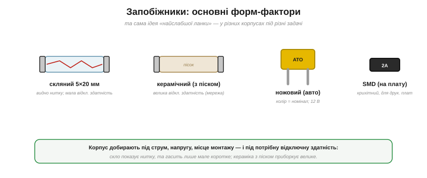
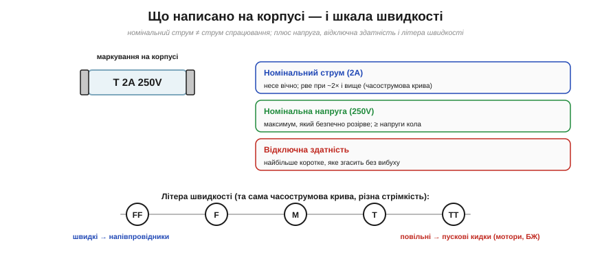

# 🔌 Запобіжник як компонент: корпуси, швидкі/повільні, вибір номіналу

Запобіжник — це навмисно найслабша ланка, тоненький дріт, який нагрівається від власного I²R і плавиться раніше, ніж згорить щось дорожче; коли він спрацьовує, важить не лише номінальний струм, а й уся [часострумова характеристика](root:embedded/fuses-ptc) — як швидко він рве при тому чи іншому перевантаженні. Самої ідеї досить, щоб зрозуміти, **навіщо** запобіжник, але недостатньо, щоб піти й купити правильну деталь. У магазині на тебе дивиться десяток циліндриків, на кожному надруковано «T 2A 250V», і вибір не той — це або згорілий MCU, або запобіжник, що вибухає в руці. Тому розберемося предметно: у яких **корпусах** буває запобіжник, що означає кожне з трьох чисел на його тілі, що таке літери **F/T**, чому повільний запобіжник терпить пусковий кидок, а швидкий ні, і як порахувати номінал для реальної плати з ESP32.

### Форм-фактори: той самий принцип у різних корпусах


*Чотири поширені корпуси. Скляний циліндр 5×20 мм — видно перегорілу нитку, але гасить лише невелике коротке. Керамічний (наповнений піском) — велика відключна здатність, для мережі. Ножовий автомобільний (ATO) — колір кодує номінал, для 12 В. SMD — крихітний, прямо на друковану плату.*

Корпус не змінює фізику — всередині все та сама [плавка ланка](root:embedded/fuses-ptc), що тане від власного нагріву. Що він змінює — це **як гаситься дуга** в момент розриву й **скільки аварійного струму** запобіжник витримає, перш ніж сам стане джерелом небезпеки. Звідси й розмаїття форм:

- **Скляний циліндр** (5×20 мм, рідше 6×32 мм) — класика електроніки; крізь скло видно, ціла нитка чи ні. Зручно для діагностики, але скло — слабка оболонка: при великому короткому всередині спалахує дуга, і гасити її нема чим, лише повітрям.
- **Керамічний циліндр** (із піском усередині) — для мережі: пісок гасить дугу, тож **відключна здатність** велика (механізм — у розділі «Чому пісок гасить дугу»).
- **Ножовий автомобільний** (ATO/mini/maxi) — устромляється в тримач, колір = номінал, світ 12 В. Низька напруга борту означає, що й дугу гасити легше, тому пластиковий корпус без піску тут цілком прийнятний.
- **SMD-запобіжник** — для поверхневого монтажу на плату; є й [**самовідновні** (PTC)](root:embedded/fuses-ptc) у тому ж дрібному корпусі. Саме цей клас найчастіше стоїть на платах з мікроконтролером, і нижче для нього є окремий числовий приклад.

> 🔧 **Навіщо це.** Корпус ти обираєш не за красою, а за двома речами: куди він фізично сяде (тримач під циліндр, посадкове місце SMD на платі) і яке середовище він захищає (мережа 230 В вимагає кераміки, борт 12 В чи лінія 3.3 В пробачать скло чи SMD). Помилка в корпусі — це або деталь, що не влізе, або деталь, що не згасить дугу.

### Чому пісок гасить дугу

Тут ховається фізика, без якої «велика відключна здатність кераміки» — просто магічне закляття. Розберемо ланцюжок.

Коли плавка ланка розривається під струмом, метал не просто зникає — у місці розриву на коротку мить тримається **електрична дуга**: іонізований, розпечений до тисяч градусів канал із пари металу й газу, який **проводить струм майже так само добре, як цілий дріт**. Поки дуга горить, коло фактично не розірване. Якщо її не загасити, у мережі з потужним джерелом дуга може триматися мілісекунди й більше, виділяючи стільки енергії, що скляна колба лусне, а бризки металу полетять назовні. Саме тому скляний запобіжник на серйозному короткому замиканні **вибухає** — не від струму як такого, а від невгашеної дуги.

Щоб дугу погасити, треба зробити три речі одночасно: відвести від каналу тепло (охолодити плазму нижче порога іонізації), фізично розірвати канал і вбрати пару металу. Пісок (кварцовий, SiO₂) робить усе три:

```
дуга спалахує  → розпечена пара металу заповнює порожнину
пісок поряд    → величезна площа контакту відбирає тепло (теплоємність + теплопровідність)
плазма холоне  → іонізація зникає, канал перестає проводити
пара металу    → вплавляється в пісок, утворюючи скловидну масу (фульгурит)
                 яка ще й механічно ізолює кінці ланки
результат      → струм обривається за частки мілісекунди, без вибуху
```

Кожна піщинка — це холодна поверхня з великою сумарною площею контакту з гарячою плазмою. Тепло йде в пісок швидше, ніж дуга встигає підтримувати іонізацію, тому плазма деіонізується й гасне. А розплавлений метал не повисає крапельками в порожнині (де він знову замкнув би коло), а вплавляється в кварц, перетворюючись на тверде скло, що **механічно** розводить кінці ланки. Порожнистий скляний запобіжник нічого з цього не вміє: у нього всередині повітря, яке і тепло відводить погано, і пару металу нікуди не зв'язує.

> 🔧 **Навіщо це.** Параметр «відключна здатність» (breaking capacity) — це безпосередній наслідок цієї фізики. Скляний без наповнювача обриває десятки-сотні ампер; керамічний із піском — тисячі або десятки тисяч. У низьковольтному борті 12 В чи на лінії 3.3 В струми к.з. малі, а напруга низька (дузі важко підтриматися), тому скла/SMD достатньо. У мережі 230 В, де трансформатор підстанції здатен віддати тисячі ампер, потрібен пісок — інакше запобіжник стане бомбою замість захисту.

### Три числа на корпусі (а не одне)


*Маркування «T 2A 250V» містить три різні числа: номінальний струм, номінальну напругу й тип швидкості. Знизу — шкала літер швидкості від FF (надшвидкі) до TT (наднеспішні): це практичне обличчя часострумової кривої.*

На корпусі стоїть не один параметр, а **три**, і кожне відповідає за свій бік захисту:

- **Номінальний струм** — який запобіжник несе **вічно**. Це **не** струм спрацювання, і плутанина тут — джерело більшості помилок. Перегорає він не на номіналі, а при перевищенні, бо при номінальному струмі тепло I²R, що виділяється в ланці, рівно врівноважується тепловідводом у виводи й корпус — ланка гаряча, але стабільна. Щоб її розплавити, треба вкинути більше тепла, ніж встигає піти, а це настає приблизно при подвоєнні струму (точну точку дає [часострумова крива](root:embedded/fuses-ptc)). «2 А» означає «несе 2 А скільки завгодно, рве десь від 4 А».
- **Номінальна напруга** — найбільша напруга, яку він здатен **безпечно розірвати**. Має бути **не менша** за напругу кола, і причина — знову дуга: що вища напруга, то легше їй підтримати іонізований канал через проміжок розриву. Запобіжник на 32 В у мережі 230 В небезпечний не тому, що «не витримає 230 В» статично, а тому, що при розриві дуга на 230 В не згасне в проміжку, розрахованому на 32 В.
- **Відключна здатність** (*breaking capacity*) — найбільший аварійний струм, який він перерве, **не вибухнувши**. Це пряма міра того, наскільки добре корпус гасить дугу: у скляних вона мала (десятки-сотні ампер), у керамічних із піском — тисячі. Має перевищувати можливий струм короткого замикання в точці встановлення.

### Літери швидкості F/T

Перед номіналом стоїть літера — це **швидкість**, практичне обличчя [часострумової кривої](root:embedded/fuses-ptc). Та крива показує: чим більше перевантаження, тим швидше рве; а літера каже, наскільки вся крива зсунута «ліворуч» (швидко) чи «праворуч» (із затримкою). Фізично різниця — у тепловій масі плавкої ланки: тонка ланка з малою теплоємністю розжарюється миттєво (швидкий), товстіша або з тепловим баластом накопичує тепло повільніше й терпить короткі сплески (повільний).

- **FF / F** — надшвидкі / **швидкі**: для чутливих напівпровідників, рвуть від найменшого й найкоротшого перевантаження, бо тонка ланка не встигає «розмазати» імпульс у часі — вона реагує майже на миттєву енергію.
- **T / TT** — повільні (із затримкою) / наднеспішні: терплять короткий **пусковий кидок** (мотори, трансформатори, блоки живлення з вхідним конденсатором, а також лампи розжарювання, чий [холодний опір](root:ph-condensed/resistance-temperature) у рази нижчий за робочий), бо ланка має достатню теплову масу, щоб увібрати енергію короткого сплеску, не встигнувши розплавитися, а потім охолонути.
- **M** — середні, між ними.

Той самий номінальний струм, але різна стрімкість: швидкий захищає делікатне, повільний не зважає на законний сплеск. Вибір між ними — це завжди компроміс: підеш надто «швидко» — запобіжник перегорятиме від законного пускового струму при кожному ввімкненні; підеш надто «повільно» — він не встигне врятувати напівпровідник, який згорає за мікросекунди.

### Як дібрати: коротко

1. **Струм.** Номінал **трохи більший** за робочий струм, із запасом (запобіжник теж дереться від тепла й не любить працювати «впритул»; типово беруть номінал на 1.5–2× від робочого струму).
2. **Швидкість.** F — для електроніки й напівпровідників; T — для навантажень із пусковим кидком.
3. **Напруга.** Номінальна напруга ≥ напруги кола (і врахуй, що **постійний** струм гасити важче за змінний: у змінному струм 100 разів на секунду проходить через нуль, і дуга має природну мить згаснути; у постійному такої миті нема, тому DC-номінал запобіжника завжди нижчий за AC).
4. **Відключна здатність** ≥ можливого струму к.з. (мережа → кераміка).
5. **Корпус** — під тримач чи плату.

### Числовий приклад: запобіжник для плати з ESP32

**Умова.** Плата керування на ESP32 живиться від зовнішнього 5 В адаптера. У штатному режимі вона тягне до 0.5 А (ESP32 із піками Wi-Fi-передачі) плюс 0.3 А на периферію — разом до 0.8 А. На вході стоїть вхідний конденсатор 470 мкФ, який при ввімкненні дає короткий зарядний кидок. Треба дібрати вхідний SMD-запобіжник, що захистить від короткого замикання на платі, але не перегорить ні від робочого струму, ні від пускового кидка.

```
Крок 1. Робочий струм (максимум):
  I_роб = I_esp + I_перифер = 0.5 + 0.3 = 0.8 А

Крок 2. Номінал із запасом ×1.5…2 (щоб ланка не працювала «впритул»):
  I_ном = 0.8 × 1.5 ≈ 1.2 А  →  беремо стандартний ряд: 1.25 А

Крок 3. Перевірка робочого режиму:
  0.8 А < 1.25 А  ✓  (несе вічно, із запасом ~36 %)

Крок 4. Перевірка пускового кидка від C = 470 мкФ.
  Кидок короткий (мікросекунди-мілісекунди), його енергія мала,
  але швидкий (F) запобіжник на 1.25 А може його «побачити».
  → беремо повільний: T 1.25 A — теплова маса ланки переживе кидок.

Крок 5. Напруга кола = 5 В DC.
  Стандартний SMD-запобіжник на 32 В або 63 В ≥ 5 В  ✓  (із величезним запасом)

Крок 6. Відключна здатність.
  Джерело — адаптер 5 В з обмеженням струму; струм к.з. невеликий
  (одиниці-десятки ампер). SMD з ВЗ ~50 А достатньо.  ✓
```

**Висновок:** **T 1.25 A, 63 V, SMD** — повільний, бо терпить зарядний кидок конденсатора; 1.25 А, бо це 1.5× від 0.8 А робочого; SMD у корпусі під плату. При короткому замиканні (наприклад, перевернутий транзистор замкнув 5 В на землю) струм підскочить до десятків ампер, ланка миттєво розплавиться — і ESP32 із доріжками вціліють. А ось якби ми поставили швидкий F-запобіжник того ж номіналу, він міг би перегоряти при кожному ввімкненні від кидка 470 мкФ — захист, що сам себе вимикає, нікому не потрібен.

### Типові граблі

- **Не плутай номінал зі струмом спрацювання** (2 А несе 2 А, рве близько 4 А+). Найчастіша помилка новачка: «у мене 1.8 А робочого, поставлю запобіжник на 1.8 А» — і він перегорає вже на робочому струмі, бо номінал ≠ струм розриву.
- **Ніколи не став «жирніший», щоб не перегорав** — це вимикає весь захист. Якщо запобіжник перегорає на робочому струмі, проблема в *доборі* (замалий номінал, надто швидка літера), а не в тому, що «треба товщий».
- **Скляний на мережевому короткому може вибухнути** (мала відключна здатність, бо повітря не гасить дугу) — туди потрібна кераміка з піском.
- **DC гасити важче за AC** — не став AC-номінал у постійнострумове коло без перевірки DC-рейтингу; у постійному струмі нема переходу через нуль, і дуга не має природної миті згаснути.
- Перегорілий запобіжник — це **симптом**: спершу знайди причину (коротке, перевантаження), потім став новий **такий самий**. Запобіжник, що перегорів удруге за хвилину, кричить, що в колі є несправність, яку новий циліндрик не вилікує.
