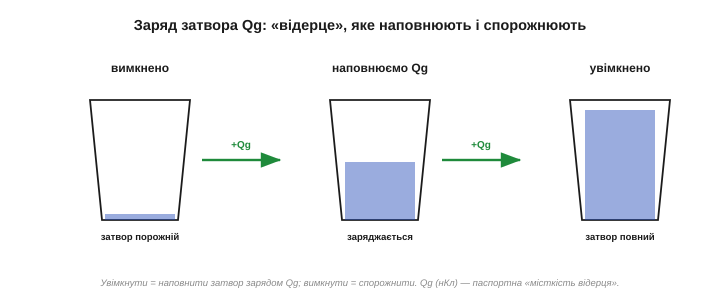
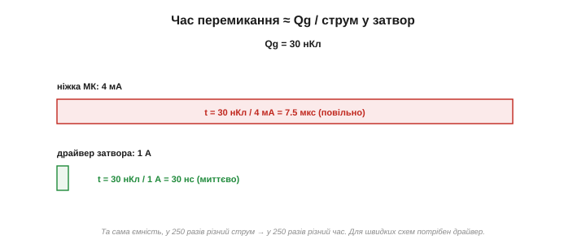
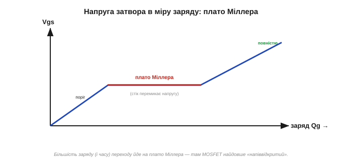
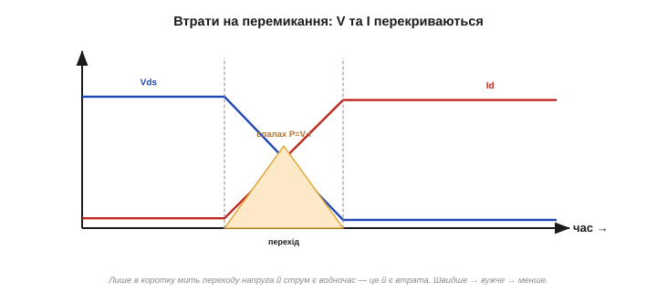
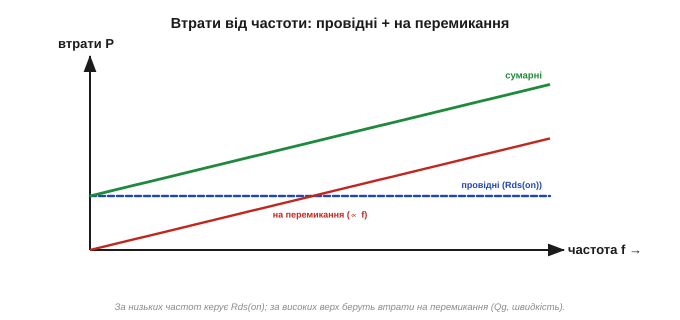
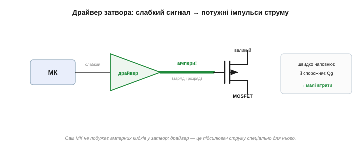

# Затвор як ємність: швидкість перемикання

[Затвор MOSFET — це конденсатор](topic:hw-components/field-control), і в **спокої** він струму не бере. Та сама властивість має зворотний бік: щоб **перемкнути** MOSFET, цей конденсатор треба щоразу **зарядити** (увімкнути) чи **розрядити** (вимкнути). Якщо ключ вмикають зрідка, це байдуже. Але коли MOSFET перемикають **тисячі й мільйони разів за секунду** — у ШІМ-регуляторах, перетворювачах живлення, — заряджання затвора стає головним: воно і обмежує **швидкість**, і додає **втрат**. Це друга половина історії втрат, доповнення до [опору відкритого каналу Rds(on)](topic:hw-components/rds-on).

### Заряд затвора Qg — скільки треба «налити»

Ємність затвора — величина примхлива: вона змінюється з напругою, тож рахувати нею незручно. Тому в даташиті подають інше, практичніше число — **повний заряд затвора** *(total gate charge, Qg)*: скільки заряду (у нанокулонах, нКл) треба «впхати» в затвор, щоб повністю його відкрити. Хочеш увімкнути — достав у затвор Qg; хочеш вимкнути — забери Qg назад.

Це наче відерце, яке треба наповнити, щоб ключ відкрився, і спорожнити, щоб закрився. Розмір відерця — Qg — і визначає, скільки «роботи» на кожне перемикання. У дрібних сигнальних MOSFET воно крихітне (одиниці нКл), у потужних силових — десятки й сотні нКл.


*Затвор — це відерце місткістю Qg (нанокулони). Щоб увімкнути MOSFET, його треба наповнити зарядом, щоб вимкнути — спорожнити. Більший прилад — більше відерце, більший Qg.*

Чому саме заряд, а не ємність? Бо ємність затвора **нелінійна** — вона помітно більша, поки канал відкривається, і менша потім. Рахувати зі змінною ємністю незручно, а **повний заряд** Qg усе це вже враховує одним числом: він і є та ємність, проінтегрована по напрузі. Тому даташити оперують зарядом Qg і готовою кривою «напруга затвора від заряду».

> 🧮 **У числах.** Чому ємність бреше, що означають частини кривої заряду (Qgs і Міллерів Qgd) і як із Qg порахувати струм драйвера (I = Qg / t) та втрати на перемикання — у математичній вставці [«Заряд затвора Qg: кулони, а не фаради»](topic:hw-components/gate-capacitance/math-gate-charge.md).

### Швидкість: час ≈ Qg / струм у затвор

Як швидко перемкнеться ключ? Рівно настільки, наскільки швидко ми зможемо доставити (чи забрати) той заряд Qg. А швидкість доставки заряду — це **струм**: заряд = струм × час, тож

```
час перемикання ≈ Qg / I(затвора)
```

Чим більший струм у затвор, то швидше наповнюється «відерце». Кволенька ніжка мікроконтролера дає одиниці міліампер — заряджатиме повільно; потужний **драйвер затвора** дає ампери — наповнить миттю.

Порахуймо. Хай Qg = 30 нКл:

```
ніжка МК (4 мА):     t = Qg / I = 30 нКл / 4 мА   = 7.5 мкс   (повільно)
драйвер затвора (1 А): t = Qg / I = 30 нКл / 1 А   = 30 нс     (миттєво)
```

Та сама ємність — а різниця у швидкості в **250 разів**, бо в 250 разів різний струм заряду. Ось чому для швидкого перемикання потужних MOSFET ніжки МК замало.


*Час перемикання = Qg, поділений на струм заряду. Ніжка МК (міліампери) заряджає затвор мікросекунди; драйвер затвора (ампери) — наносекунди. Той самий Qg, у сотні разів різна швидкість.*

Зверніть увагу: **вимикання** так само потребує струму — щоб **витягти** заряд Qg назад із затвора. Якщо лишити затвор спорожнюватися лише крізь [підтяжний резистор](topic:hw-components/mosfet-power-switch), він розрядиться повільно, і ключ довго гаснутиме (а отже, довго стоятиме в гарячій напіввідкритій зоні). Тому драйвер жене струм в **обидва** боки — швидко наповнює й швидко спорожняє «відерце».

### Плато Міллера: чому в середині «затинається»

Заряджання затвора не рівномірне — у ньому є підступна **сходинка**. Коли напруга на затворі доходить до певного рівня й MOSFET починає **перемикати напругу на стоці**, затвор на якийсь час ніби **застрягає**: напруга на ньому майже не росте, хоч заряд далі вливається. Цю «полицю» звуть **плато Міллера** *(Miller plateau)*.

Звідки воно? У MOSFET є невелика ємність **затвор–стік** (її звуть міллерівською). Поки стік різко змінює свою напругу під час перемикання, ця ємність «перекачує» заряд, і весь струм затвора йде на неї, а не на підняття напруги затвора — звідси й застій. Саме на плато Міллера й минає **більша частина** часу перемикання, і саме там MOSFET найдовше перебуває в небезпечному напіввідкритому стані. Нам не треба рахувати це точно — досить розуміти: у заряді Qg є «горб», що й гальмує перехід.


*Напруга затвора в міру вливання заряду: спершу росте, тоді застрягає на плато Міллера (стік перемикає напругу), далі росте знову. Більшість часу переходу — на цьому плато; саме воно гальмує перемикання.*

У плато Міллера є й підступний практичний наслідок. Та сама ємність затвор–стік може **перекинути** різкий стрибок напруги зі стоку назад на затвор і ненароком прочинити (чи не дати закрити) ключ — це звуть **паразитним вмиканням**. Тому в швидких схемах затвор тримають «міцно»: драйвером із малим вихідним опором, розташованим **близько** до затвора, щоб той не гуляв сам по собі. Для повільних схем це знову ж таки байдуже, а от для імпульсних перетворювачів паразитне вмикання — реальна причина перегріву й відмов, тож близький потужний драйвер там не примха, а необхідність.

### Втрати на перемикання

Найгарячіший стан MOSFET — **напіввідкритий**, коли на ньому водночас і чимала напруга, і чималий струм. У сталому режимі ключ туди не потрапляє (він або повністю відкритий, або закритий). Але **під час кожного перемикання** він **мусить пройти** крізь цю зону — на ту коротку мить, поки заряджається затвор. І там спалахує **сплеск потужності**: напруга й струм перекриваються, виділяється порція тепла.

Енергія, втрачена за одне перемикання, приблизно `E ≈ ½ · V · I · t(перемикання)`. Що **швидше** перемикання (менший t), то менша ця порція — ось ще навіщо швидкий драйвер. А тепер головне: ця енергія губиться **на кожному** перемиканні, тож сумарна **втрата на перемикання** *(switching loss)* росте з **частотою**:

```
P(перемикання) ≈ E · f       (енергія за один раз × скільки разів за секунду)
```


*У мить перемикання напруга на ключі й струм крізь нього перекриваються — спалах потужності (тепла). Що швидший перехід, то вужчий спалах і менша втрачена енергія. Тому швидкий драйвер економить тепло.*

Числа на відчуття. Хай ключ комутує 12 В і 2 А, а перехід триває t = 1 мкс. Енергія за один перехід: E ≈ ½·V·I·t = 0.5·12·2·(1·10⁻⁶) = 12 мкДж. На частоті 20 кГц це P = E·f = 12 мкДж · 20000 = **0.24 Вт** — терпимо. А на 200 кГц — уже **2.4 Вт**, удесятеро більше, бо вдесятеро частіше перемикаємо. Прискорив би драйвер перехід до 0.1 мкс — і втрата впала б у десять разів. Ось чому на високих частотах борються за кожну наносекунду переходу.

А чи завжди швидше — краще? Ні. [Резистор затвора](topic:hw-components/mosfet-power-switch) тут важить: більший резистор уповільнює заряд Qg, тож перемикання м'якше — менше різких стрибків напруги й струму, а отже менше **електромагнітних завад** *(EMI)* та дзвоніння. Але сповільнення збільшує втрати на перемикання й грійку. Тому резистором затвора **балансують**: швидше — холодніше, але «брудніше» в ефірі; повільніше — тихіше, але гарячіше. Інженер шукає золоту середину між втратами й завадами.

### Дві втрати, дві поведінки

Тепер видно повну картину втрат у силовому ключі — і вона з **двох** доданків із різною поведінкою:

- **Провідні втрати** *(conduction)*, P = Id²·[Rds(on)](topic:hw-components/rds-on) — від струму й опору; від **частоти не залежать**.
- **Втрати на перемикання** *(switching)*, P = E·f — від енергії переходу й частоти; **ростуть із частотою**.

За низьких частот головні — провідні втрати (дивись на Rds(on)). За високих — верх беруть втрати на перемикання (дивись на Qg і швидкість драйвера). Десь є межа, де вони зрівнюються; вище неї частоту піднімати вже невигідно — ключ перегріється саме від перемикань.


*Провідні втрати від частоти не залежать (рівна лінія). Втрати на перемикання ростуть із частотою. Сумарні — їхня сума: за низьких частот керує Rds(on), за високих — Qg і швидкість перемикання.*

Приклад із життя: керуючи обертами мотора через ШІМ, інженер обирає частоту як компроміс. Низька (скажімо, 1 кГц) — чути неприємний писк, зате втрат на перемикання майже нема. Висока (20–30 кГц, вище чутного) — тиша, але вже відчутні втрати на перемикання, тож потрібен пристойний драйвер і, можливо, радіатор. Тому типові драйвери моторів і працюють десь на 20 кГц — щойно за межею чутного, де ще не пече перемиканнями.

І ще ширша думка. Кожне перемикання будь-якого MOSFET коштує енергії на перезаряд його ємностей — близько ½·C·V² на затвор. У процесорі таких перемикань — мільярди транзисторів, помножені на мільярди тактів за секунду; і вся та крихітна енергія, складена докупи, і є тепло, що його відводить радіатор на чипі. Розженеш частоту вдвічі — удвічі більше перемикань — удвічі більше тепла. Саме тому процесори впираються в «теплову стелю»: це той самий заряд затвора, лише в неосяжному масштабі.

> 🔧 **Навіщо це.** Звідси й практичний поділ. **Простий ключ** (увімкнув реле, лампу, нагрівач — перемикань мало): втрати на перемикання мізерні, дивись лише на Rds(on), і ніжки МК для затвора цілком досить. **Швидкий ШІМ чи перетворювач живлення** (десятки–сотні кГц): втрати на перемикання вже відчутні — потрібні і малий Qg, і **швидкий драйвер затвора**, що жене ампери, аби пройти небезпечну зону якнайшвидше. Не плутай ці два світи: те, що байдуже для реле, критичне для імпульсного перетворювача.

### Драйвер затвора

Звідси й окрема деталь у швидких схемах — **драйвер затвора** *(gate driver)*: невелика мікросхема (або каскад), що приймає кволий логічний сигнал від МК і видає в затвор **потужні короткі імпульси** струму — амперні, в обидва боки (швидко зарядити й швидко розрядити). Він — як підсилювач струму спеціально для затвора: сам МК такого кидка не подужає, а драйвер легко. Усередині [драйвера затвора](topic:hw-power/gate-driver) — «тотемний» вихід, що жене ці ампери; а щоб живити затвор **верхнього** N-ключа над силовою шиною, додають бутстрепний конденсатор, і саме за цим бувають низькобічні, півмостові та ізольовані драйвери.


*Між МК і затвором ставлять драйвер: він приймає слабкий логічний сигнал і видає в затвор потужні імпульси струму (ампери), щоб швидко наповнювати й спорожняти Qg. Сам МК для великих MOSFET надто кволий.*

Для більшості простих задач — увімкнути моторчик, світлодіод, помпу — усе це «повільні» перемикання, і ніжки мікроконтролера з резистором затвора цілком досить; про Qg можна навіть не згадувати. Знати про заряд затвора варто на той випадок, коли візьметеся за щось **швидке** — імпульсний перетворювач, потужний світлодіодний драйвер, керування двигуном на високій частоті. Тоді Qg і драйвер виходять на перший план, і саме вони, а не Rds(on), вирішують, чи буде ключ холодним.

> 🔧 **Навіщо це.** Є компроміс між [Rds(on)](topic:hw-components/rds-on) і Qg: малий Rds(on) зазвичай дається ціною більшого затвора (більшого Qg), бо обидва ростуть із розміром кристала. Тому «найкращого взагалі» MOSFET немає — є найкращий **під твою частоту**: для рідкісних перемикань бери найменший Rds(on) (Qg байдужий), для високочастотного ШІМ шукай баланс, а то й жертвуй опором заради меншого заряду й швидшого, холоднішого перемикання.

### Той самий заряд у цифрі

Затвор-конденсатор у спокої безкоштовний, але на кожне перемикання вимагає заряду Qg — а це і обмежує швидкість (час ≈ Qg/струм), і додає втрат, що ростуть із частотою. Та сама фізика — заряд-розряд ємностей на кожному такті — керує й споживанням **цифрових** мікросхем: знаменита формула «потужність = ємність × напруга² × частота» описує саме це, тільки для мільярдів крихітних затворів у процесорі на [комплементарних парах MOSFET](topic:hw-digital/cmos). Тож заряд затвора, що тут визначає тепло одного силового ключа, у неосяжному масштабі визначає й тепловий бюджет цілого процесора.
