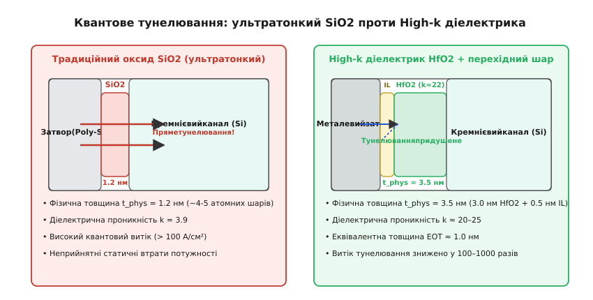
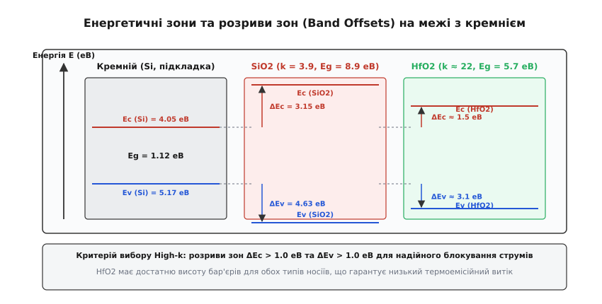
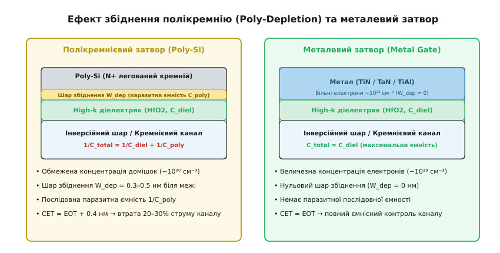
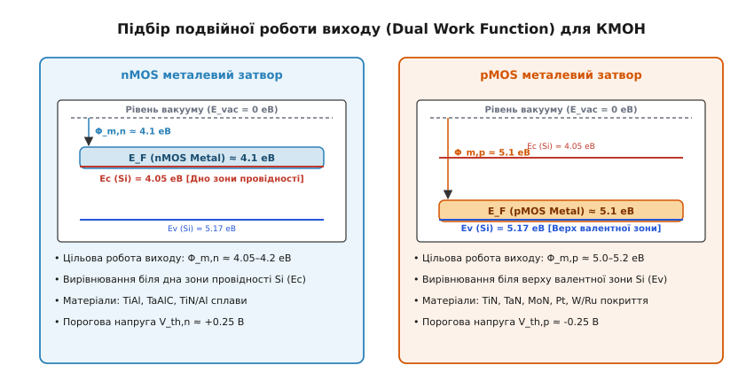
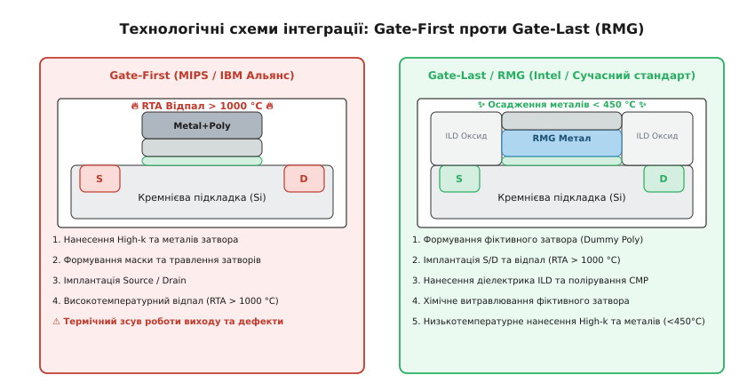

# High-k діелектрик і металевий затвор (HKMG)

<preknowlist>
- [Будова MOSFET](topic:hw-components/mosfet-structure) — планарна структура транзистора, тонкий підзатворний діелектрик і наведення інверсійного каналу.
- [Порогова напруга MOSFET](topic:hw-components/mosfet-threshold) — умови відкривання транзистора, робота виходу електродів та зонні діаграми.
- [Техпроцес](topic:hw-components/process-node) — масштабування транзисторів, товщина підзатворного оксиду tox та геометричні норми мікросхем.
- [Квантове тунелювання](topic:ph-quantum/quantum-tunnelling) — проходження носіїв заряду крізь потенціальний бар'єр діелектрика (пряме та Фаулера-Нордгейма).
- [Часо-залежний пробій оксиду (TDDB)](topic:hw-components/tddb) — електрична деградація ультратонких підзатворних шарів під високою напруженістю поля.
</preknowlist>

У 2007 році під час переходу на 45-нанометровий технологічний вузол кремнієва мікроелектроніка вперше у своїй історії вперлася в нездоланний квантовомеханічний бар'єр. Протягом сорока років швидкість та щільність мікропроцесорів невпинно зростали завдяки класичному закону масштабування Деннарда: що коротшим ставав канал транзистора, то тоншим робили шар підзатворного ізолятора з діоксиду кремнію `SiO₂`. Проте на позначці фізичної товщини `1.2 нм` — шару всього з чотирьох атомних моношарів — діелектрик перестав бути ізолятором. Хвильові функції електронів провідності почали вільно пронизувати потенціальний бар'єр шляхом прямого квантового тунелювання, створюючи велетенський струм витоку крізь затвор, що перевищував `100 А/см²`.

Цей витік означав теплову смерть мікропроцесорів. Чипи розсіювали десятки ватів потужності у вигляді пасивного тепла навіть у стані повного простою, коли тактова частота була вимкнена. Статичні втрати енергії зрівнялися з динамічним споживанням на перемикання логічних вентилів, а подальше підвищення тактової частоти загрожувало фізичним розплавленням кристала. Класична пара «діоксид кремнію — полікремнієвий затвор» (`SiO₂/Poly-Si`), на якій трималася вся цифрова революція другої половини XX століття, повністю вичерпала свій фізичний ресурс.

Виходом із глухого кута став революційний дует технологій, відомий як **HKMG** (англ. *High-k Metal Gate* — діелектрик із високою діелектричною проникністю та металевий затвор). Заміна `SiO₂` на оксид гафнію `HfO₂` розірвала зв'язок між ємнісним контролем та квантовим витоком, а перехід на металеві затвори усунув паразитарне збіднення та нестабільність порогової напруги. Впровадження HKMG врятувало закон Мура та визначило вигляд усіх сучасних нанорозмірних транзисторів.

---

## 1. Фізичний глухий кут ультратонкого SiO₂: квантовий витік і крах закону Деннарда

Щоб зрозуміти, чому діоксид кремнію більше не міг працювати, необхідно звернутися до електростатики польового транзистора. Затвор керує струмом у каналі завдяки електричному полю, яке притягує носії заряду до поверхні напівпровідника та утворює провідний інверсійний шар. Сила цього ємнісного зв'язку визначається питомою ємністю підзатворного діелектрика на одиницю площі `C_ox`:

```
C_ox
= ε_0 · k / t_phys                     [питома ємність підзатворного діелектрика]
```

де `ε_0 ≈ 8.854 · 10⁻¹⁴ Ф/см` — діелектрична проникність вакууму, `k` — відносна діелектрична проникність матеріалу ізолятора (для діоксиду кремнію `k = 3.9`), а `t_phys` — фізична товщина діелектричного шару.

Коли довжина каналу `L_g` зменшується, електричне поле стоку починає паразитно проникати вглиб каналу, знижуючи потенціальний бар'єр біля витоку (ефект DIBL — *Drain-Induced Barrier Lowering*) та викликаючи підпороговий витік між витоком і стоком. Щоб зберегти повний електростатичний контроль затвора над каналом і придушити короткоканальні ефекти, ємність `C_ox` зобов'язана безперервно зростати.

Оскільки діоксид кремнію мав фіксовану діелектричну проникність `k = 3.9`, єдиним шляхом збільшення `C_ox` протягом чотирьох десятиліть було фізичне стоншення шару `t_phys`:

```
180 нм вузол (1999 рік)  →  t_phys ≈ 3.5 нм
130 нм вузол (2001 рік)  →  t_phys ≈ 1.8 нм
 90 нм вузол (2003 рік)  →  t_phys ≈ 1.2 нм
 65 нм вузол (2005 рік)  →  t_phys ≈ 1.0 нм  (SiON, 4 атомні моношари)
```

За товщини `t_phys < 1.5 нм` прямокутний потенціальний бар'єр діоксиду кремнію висотою `3.15 еВ` стає прозорим для квантового тунелювання. Хвильова функція електрона провідності не встигає повністю згаснути всередині ультратонкого шару і проникає крізь нього за один квантовий стрибок.


*Квантове тунелювання. Ультратонкий SiO2 (1.2 нм) зазнає лавиноподібного витоку, тоді як фізично товстіший шар High-k HfO2 придушує тунелювання на порядки при тій самій ємності.*

Густина струму прямого тунелювання експоненційно залежить від фізичної товщини бар'єру: кожні `0.2 нм` зменшення товщини `SiO₂` збільшують струм витоку крізь затвор рівно в десять разів (`10×`). На вузлі 65 нм сумарний статичний струм витоку затворів багатомільярдного кристала зрівнявся з корисним динамічним струмом перемикання транзисторів. Подальше зменшення товщини діоксиду кремнію до `0.8 нм` призвело б до того, що витік затвора перевищив би робочий струм увімкненого транзистора, зробивши функціонування логічних вентилів неможливим.

> 🔧 **Навіщо це.** Квантовий витік ультратонкого оксиду зруйнував масштабування Деннарда — емпіричне правило, згідно з яким зменшення транзисторів автоматично знижувало споживану потужність на такій самій частоті. Саме тому близько 2005 року тактові частоти процесорів зупинилися на позначці `3.5…4.0 ГГц`, а напівпровідникова галузь була змушена перейти до багатоядерних архітектур.

---

## 2. Концепція High-k: розрив зв'язку між ємністю та товщиною

Щоб подолати глухий кут, інженери звернулися до фундаментальної формули ємності плоского конденсатора `C_ox = ε_0 · k / t_phys`. Якщо замінити діоксид кремнію матеріалом з істотно вищою відносною діелектричною проникністю `k` (High-k, від англ. *high dielectric constant*), з'являється можливість збільшити фізичну товщину шару `t_phys` у кілька разів, зберігши необхідну високу ємність затвора.

Для зручного кількісного порівняння різнорідних ізоляторів введено параметр **еквівалентної товщини оксиду** (англ. *Equivalent Oxide Thickness*, скорочено **EOT**). EOT показує, яку фізичну товщину мав би шар класичного `SiO₂` (`k_SiO2 = 3.9`), щоб забезпечити точно таку саму питому електричну ємність, як і шар High-k товщиною `t_highk` із проникністю `k_highk`:

```
EOT
= t_highk · (k_SiO2 / k_highk)         [еквівалентна товщина оксиду]
```

Якщо як High-k діелектрик обрати діоксид гафнію `HfO₂` з діелектричною проникністю `k ≈ 22…25`, співвідношення `k_SiO2 / k_highk = 3.9 / 22 ≈ 0.177`. Це означає, що шар `HfO₂` фізичною товщиною `3.5 нм` має електричну ємність, абсолютно еквівалентну шару `SiO₂` товщиною всього `0.62 нм`!

```
                    ПОРІВНЯННЯ БАР'ЄРІВ ДЛЯ EOT = 1.0 нм
┌───────────────────────────────────────┬───────────────────────────────────────┐
│     Традиційний діоксид кремнію       │      High-k діелектрик (HfO2)         │
├───────────────────────────────────────┼───────────────────────────────────────┤
│ Фізична товщина: t_phys = 1.0 нм      │ Фізична товщина: t_phys = 5.6 нм      │
│ Діелектрична проникність: k = 3.9     │ Діелектрична проникність: k = 22.0    │
│ Еквівалентна товщина: EOT = 1.0 нм    │ Еквівалентна товщина: EOT = 1.0 нм    │
│ Бар'єр тунелювання: 4 моношари        │ Бар'єр тунелювання: ~20 моношарів     │
│ Квантовий витік: > 100 А/см²          │ Квантовий витік: < 0.01 А/см²         │
└───────────────────────────────────────┴───────────────────────────────────────┘
```

Збільшення фізичної товщини з `1.0 нм` до `3.5…5.0 нм` перетворює діелектричний шар на нездоланну стіну для квантового прямого тунелювання. Хвильова функція електрона експоненційно затухає в об'ємі товстого бар'єру задовго до протилежного електрода. У результаті струм витоку крізь затвор скорочується на два-три порядки (у `100–1000 разів`) за абсолютно незмінної або навіть збільшеної керуючої ємності.

Повні математичні виведення двошарової моделі EOT з інтерфейсним оксидом, розрахунок прозорості бар'єру у квазікласичному наближенні ВКБ та квантовий зсув центроїду заряду інверсії наведені в математичній вставці.

> 🧮 **Математика:** [Еквівалентна товщина оксиду та квантове тунелювання](topic:hw-components/hkmg/math-eot.md)

---

## 3. Матеріалознавчий відбір діелектрика та зонні розриви (Band Offsets)

Вибір альтернативного діелектрика виявився складним компромісом між діелектричною проникністю `k`, шириною забороненої зони `E_g` та енергетичними розривами зон на межі з кремнієм.

У фізиці твердого тіла існує фундаментальна закономірність: що вища діелектрична проникність матеріалу `k`, то вужчою є його власна заборонена зона `E_g`. Наприклад, діоксид титану `TiO₂` має гігантську діелектричну проникність `k ≈ 80`, але його заборонена зона становить лише `3.0 еВ`.

Щоб діелектрик надійно блокував не лише квантове тунелювання, а й звичайну класичну **термоемісію** носіїв над бар'єром за робочих температур кристала `85…125 °C`, енергетичні бар'єри на межі розділу кремній–діелектрик повинні перевищувати щонайменше `1.0 еВ` як для зони провідності (`ΔE_c > 1.0 еВ`), так і для валентної зони (`ΔE_v > 1.0 еВ`):

1. **Розрив зони провідності `ΔE_c` (бар'єр для електронів):**
   ```
   ΔE_c = χ_Si - χ_diel
   ```
   де `χ_Si ≈ 4.05 еВ` — спорідненість кремнію до електрона, а `χ_diel` — спорідненість діелектрика.

2. **Розрив валентної зони `ΔE_v` (бар'єр для дірок):**
   ```
   ΔE_v = E_g,diel - E_g,Si - ΔE_c
   ```
   де `E_g,Si = 1.12 еВ` — ширина забороненої зони кремнію.


*Зонні розриви діелектриків. HfO2 забезпечує високі бар'єри як для електронів (ΔEc ≈ 1.5 еВ), так і для дірок (ΔEv ≈ 3.1 еВ), запобігаючи термоемісійному витоку носіїв.*

```
                   ЗОННІ ХАРАКТЕРИСТИКИ КАНДИДАТІВ HIGH-K
┌───────────┬──────────────┬──────────────────┬──────────────┬──────────────┐
│ Матеріал  │ Проникність  │  Заборонена зона │ Бар'єр для e-│ Бар'єр для h+│
│           │      k       │      E_g (еВ)    │  ΔE_c (еВ)   │  ΔE_v (еВ)   │
├───────────┼──────────────┼──────────────────┼──────────────┼──────────────┤
│ SiO2      │     3.9      │       8.9        │     3.15     │     4.63     │
│ Si3N4     │     7.5      │       5.3        │     2.00     │     2.18     │
│ Al2O3     │     9.0      │       8.8        │     2.80     │     4.88     │
│ HfO2      │    22.0      │       5.7        │     1.50     │     3.08     │
│ ZrO2      │    23.0      │       5.8        │     1.40     │     3.28     │
│ La2O3     │    30.0      │       5.5        │     2.30     │     2.08     │
│ TiO2      │    80.0      │       3.0        │     0.05 ⚠   │     1.83     │
└───────────┴──────────────┴──────────────────┴──────────────┴──────────────┘
```

Діоксид гафнію `HfO₂` та його модифікації (силікати гафнію `HfSiO_x` та оксинітриди `HfSiON`) виявилися ідеальними переможцями матеріалознавчого конкурсу:
- вони забезпечують високу проникність `k ≈ 20…25`;
- володіють симетричними, достатньо високими бар'єрами для електронів (`1.50 еВ`) та дірок (`3.08 еВ`);
- демонструють високу термодинамічну сумісність із кремнієм, не утворюючи небажаних силіцидних фаз за температур до `900 °C`.

Для нанесення цих надтонких плівок застосовують прецизійний метод **атомно-шарового осадження** (англ. *Atomic Layer Deposition*, **ALD**), під час якого пари хлориду або алкіламіду гафнію та окисника по черзі подаються в реактор, нарощуючи плівку строго по одному атомарному моношару за технологічний цикл.

### Роль інтерфейсного шару (Interfacial Layer, IL)

Навіть за використання ідеального ALD-процесу оксид гафнію не наносять безпосередньо на кремнієвий кристал. Якщо `HfO₂` безпосередньо контактує з кристалічним кремнієм, різниця сталих кристалічної ґратки породжує колосальну кількість обірваних зв'язків та поверхневих пасток (`D_it > 10¹² см⁻²·еВ⁻¹`). Заряджені пастки створюють сильне кулонівське розсіювання, що руйнує рухливість електронів у каналі.

Тому під шаром `HfO₂` завжди формують високоякісний ультратонкий перехідний шар **інтерфейсного оксинітриду кремнію** (`IL — Interfacial Layer`) товщиною `0.4…0.6 нм` (всього два моношари атомів). Цей шар вирощують за допомогою озонового або термічного окиснення кремнію перед осадженням гафнію. Він пасивує поверхню кремнію, знижуючи густину дефектів до `D_it < 10¹⁰ см⁻²·еВ⁻¹` і зберігаючи високу швидкість дрейфу носіїв заряду.

---

## 4. Криза сумісності: чому полікремнієвий затвор зламав High-k

Коли на початку 2000-х років дослідники вперше нанесли традиційний полікристалічний кремнієвий затвор (Poly-Si) поверх нового діелектрика `HfO₂`, отримані транзистори виявилися повністю непрацездатними. Замість очікуваного стрибка швидкодії транзистори продемонстрували колосальне падіння струму, неконтрольоване зростання порогової напруги та сильну деградацію рухливості електронів.

Причиною фіаско стали три фундаментальні фізичні несумісності між полікремнієм та High-k діелектриком.

### А. Ефект збіднення полікремнію (Poly-Depletion Effect)

Полікристалічний кремній — це напівпровідник, а не метал. Навіть за граничного легування донорами або акцепторами концентрація активних вільних носіїв у ньому обмежена межею розчинності домішок `N_poly ≈ (1…3) · 10²⁰ см⁻³`.

Коли до затвора n-MOSFET прикладають позитивну напругу для відкривання каналу, електричне поле відштовхує вільні електрони всередині полікремнію від межі з оксидом углиб затвора. Біля самої поверхні діелектрика оголюється тонкий шар нерухомих іонізованих донорів товщиною `W_dep ≈ 0.3…0.5 нм`, збіднений на вільні носії заряду.


*Збіднення затвора. Полікремній утворює паразитний шар збіднення Wdep, що зменшує діючу ємність, тоді як металевий затвор ліквідує збіднення і повертає повний контроль над каналом.*

Цей збіднений шар діє як додатковий паразитний конденсатор `C_poly = ε_Si / W_dep`, увімкнений послідовно з ємністю діелектрика `C_highk`:

```
1 / C_total
= 1 / C_highk + 1 / C_poly            [послідовне з'єднання ємностей затвора]
```

Послідовна паразитна ємність додає до еквівалентної електричної товщини затвора (Capacitance Equivalent Thickness, **CET**) близько `0.35…0.45 нм`:

```
CET
= EOT + W_dep · (k_SiO2 / ε_Si)        [збільшення електричної товщини через збіднення]
```

Коли цільовий EOT становив `1.0 нм`, добавка `0.4 нм` через збіднення полікремнію крала майже **30% корисної ємності затвора**, нівелюючи левову частку переваг від впровадження оксиду гафнію.

### Б. Закріплення рівня Фермі (Fermi-Level Pinning)

На межі розділу полікремній–гафній (`Poly-Si / HfO₂`) за високих температур утворюються специфічні хімічні зв'язки `Si–Hf` та висока концентрація кисневих вакансій. Ці дефекти породжують у забороненій зоні високу густину поверхневих електронних станів.

Ці пастки намертво захоплюють електрони і **закріплюють рівень Фермі** (англ. *Fermi-Level Pinning*, **FLP**) полікремнію поблизу середини забороненої зони кремнію (`Mid-gap ≈ 4.5…4.6 еВ`), незалежно від того, як сильно затвор був легований фосфором чи бором.

У результаті контактна різниця потенціалів `Φ_ms` між затвором і каналом зміщується, а порогові напруги `|V_th|` як nMOS, так і pMOS транзисторів катастрофічно зростають до `+0.7…0.8 В` та `-0.7…0.8 В` відповідно. За напруги живлення процесора `V_dd ≈ 1.0 В` відкрити такий транзистор стає практично неможливо, оскільки запас керуючої напруги над порогом `(V_dd - V_th)` падає майже до нуля.

### В. Дистанційне розсіювання на м'яких оптичних фононах (Remote Soft Phonon Scattering)

Діоксид кремнію `SiO₂` утворений переважно ковалентними зв'язками, тоді як оксид гафнію `HfO₂` є високополярним діелектриком із великою часткою іонного зв'язку. У кристалічній ґратці `HfO₂` виникають низькоенергетичні коливання іонів — **м'які поздовжні оптичні фонони** (англ. *Soft Optical Phonons*).

Дипольні коливання ґратки High-k створюють далекодіючі флуктуації електричного поля, які вільно проникають крізь ультратонкий перехідний шар і розсіюють електрони та дірки, що рухаються в кремнієвому каналі (поляризаційне розсіювання Фреліха). Без спеціального екранування рухливість носіїв заряду в каналі падала на `30–50%`, різко знижуючи граничну швидкодію транзисторів.

---

## 5. Перехід на металевий затвор (Metal Gate): подвійна робота виходу

Вирішити кризу полікремнію міг лише повний перехід на справжні металеві електроди (Metal Gate). Заміна легованого напівпровідника металом миттєво зняла всі три фундаментальні проблеми:

1. **Концентрація вільних електронів** у металі становить `~10²³ см⁻³` (проти `10²⁰ см⁻³` у полікремнії). Шар збіднення у металі повністю зникає (`W_dep = 0`), екранна довжина Томаса–Фермі менша за `0.05 нм`, і транзистор повертає повну ємність `CET = EOT`.
2. Метал усуває зв'язки `Si–Hf`, ліквідуючи закріплення рівня Фермі та стабілізуючи порогову напругу.
3. Висока густина вільних електронів у металі діє як дзеркальний плазмонний екран, що екранує м'які оптичні фонони з діелектрика та повертає рухливість носіїв у каналі до `85…90%` від рівня класичного `SiO₂`.

### Вимога подвійної роботи виходу (Dual Work Function)

Проте використання металу створило новий виклик: у металі неможливо змінити положення рівня Фермі легуванням, як це робилося в полікремнії. Робота виходу електрона з металу `Φ_m` (англ. *Work Function* — енергія, необхідна для перенесення електрона з рівня Фермі у вакуум) є фіксованою фундаментальною властивістю матеріалу.

Порогова напруга транзистора `V_th` лінійно залежить від контактної різниці потенціалів `Φ_ms = Φ_m - Φ_s`:

```
V_th
= Φ_ms + 2 · ψ_B + Q_dep / C_ox - Q_eff / C_ox [порогова напруга з металевим затвором]
```

Для досягнення симетричних, низьких порогових напруг `V_th,n ≈ +0.25 В` та `V_th,p ≈ -0.25 В`, необхідних для швидкого перемикання КМОН-логіки при низькій напрузі живлення `V_dd < 1.0 В`, робота виходу затворів повинна бути різною для nMOS та pMOS:

- **nMOS затвор (Band-edge n-metal):** робота виходу повинна лежати біля дна зони провідності кремнію `E_c`:
  ```
  Φ_m,n ≈ 4.05…4.20 еВ
  ```
  Цьому критерію відповідають сплави та сполуки: алюмінід титану `TiAl`, карбід танталу-алюмінію `TaAlC`, нітрид танталу `TaN` із додаванням алюмінію.

- **pMOS затвор (Band-edge p-metal):** робота виходу повинна лежати біля верху валентної зони кремнію `E_v`:
  ```
  Φ_m,p ≈ 5.05…5.20 еВ
  ```
  Цьому критерію відповідають сполуки та метали: нітрид титану `TiN`, рутеній `Ru`, платина `Pt`, молібден `Mo`, вольфрам `W` або надтонкі оксидні ковпачки `Al₂O₃`.


*Подвійна робота виходу. Метал nMOS підбирають до дна зони провідності Si (4.1 еВ), а метал pMOS — до верху валентної зони (5.1 еВ), досягаючи низьких симетричних порогових напруг.*

Спроба використати один універсальний метал із роботою виходу посередині забороненої зони (Mid-gap metal, `Φ_m ≈ 4.65 еВ`) призвела б до зростання порогових напруг обох транзисторів до `|V_th| ≈ 0.6 В`, що зробило б неможливою роботу на низьких напругах. Тому кожен КМОН-чип на HKMG вимагає нанесення **двох різних металів із прецизійно налаштованою роботою виходу** на одній і тій самій кремнієвій пластині.

### Дипольна інженерія межі розділу (Interface Dipole Engineering)

У промислових техпроцесах пошук і нанесення екзотичних чистих металів з екстремальними роботами виходу (як-от радіоактивний або токсичний рутеній чи платина) створює величезні технологічні труднощі: благородні метали погано піддаються анізотропному плазмовому травленню і погано тримаються на оксидах.

Тому інженери винайшли елегантне рішення — **дипольну інженерію** (англ. *Dipole Engineering*). Базовим матеріалом для обох типів затворів слугує технологічний нітрид титану `TiN`. Для точного зсуву його ефективної роботи виходу на межу розділу `HfO₂ / IL` або `HfO₂ / Metal` наносять надтонкий (менше одного моношару) шар легуючого оксиду:
- Оксид лантану `La₂O₃` для nMOS дифундує до межі розділу та утворює орієнтовані електричні диполі `La–O–Si`, які зміщують потенціал зон на `ΔV_dipole ≈ -0.3…-0.4 В`, зсуваючи роботу виходу `TiN` (з `4.6 еВ` до `4.2 еВ`);
- Оксид алюмінію `Al₂O₃` для pMOS утворює диполі зворотного напрямку, зміщуючи потенціал зон на `ΔV_dipole ≈ +0.3…-0.4 В`, підвищуючи роботу виходу `TiN` до `5.05 еВ`.

Це дозволило використовувати єдину базову металеву систему, регулюючи пороги транзисторів виключно товщиною та складом нанорозмірних ковпачкових шарів.

> 🔧 **Навіщо це.** Дипольна інженерія дозволила створювати так звані **багатопорогові бібліотеки стандартних комірок** (Multi-Vt: LVT — низький поріг для критичних шляхів швидкодії, SVT — стандартний, HVT — високий поріг для енергозбереження) без зміни геометрії транзисторів, лише варіюючи дозу дипольних оксидів у масці затвора.

---

## 6. Архітектури інтеграції: битва Gate-First проти Gate-Last (RMG)

Головною інженерною проблемою впровадження HKMG став вибір технологічного маршруту формування транзистора на пластині. Напівпровідникова індустрія розкололася на два табори: прихильників підходу **Gate-First** (альянс IBM, AMD, Sony, Toshiba, GlobalFoundries, Samsung) та авторів підходу **Gate-Last / RMG** (корпорація Intel).


*Схеми інтеграції HKMG. Gate-First руйнує метали відпалом при 1000 °C, тоді як Gate-Last (RMG) осаджує метали після високотемпературних стадій при температурах нижче 450 °C.*

### Gate-First (MIPS — Metal-Inserted Poly-Silicon)

У схемі Gate-First виробничий процес повторював класичний маршрут:
1. На кремнієву пластину наносили шар High-k діелектрика `HfO₂`.
2. Поверх осаджували надтонкі шари металів для налаштування роботи виходу nMOS та pMOS.
3. Зверху наносили захисний шар полікремнію (Poly Cap) та формували геометрію затворів літографією та травленням.
4. Проводили іонну імплантацію областей витоку і стоку (Source / Drain).
5. Виконували фінальний **високотемпературний швидкий термічний відпал** (англ. *Rapid Thermal Anneal*, **RTA**) за температури `1000…1050 °C` для активації домішок у витоку і стоці.

**Фатальний недолік Gate-First:** температура `1000 °C` виявилася згубною для тонких металевих шарів та оксиду гафнію. Під час відпалу атоми металу nMOS та pMOS взаємно дифундували, кисень виходив із ґратки `HfO₂`, викликаючи кристалізацію аморфного діелектрика, утворення струмопровідних меж зерен та неконтрольований зсув роботи виходу металу pMOS назад до середини забороненої зони. Альянс IBM витратив мільярди доларів на спроби стабілізувати Gate-First, але зіткнувся з низьким виходом придатних кристалів та затримками виходу процесорів.

### Gate-Last (RMG — Replacement Metal Gate)

Корпорація Intel під керівництвом матеріалознавця Роберта Чау (англ. *Robert Chau*) обрала радикально складніший, але фізично бездоганний маршрут — **заміщений металевий затвор** (англ. *Replacement Metal Gate*, **RMG** або **Gate-Last**), вперше впроваджений у масове виробництво у 2007 році на 45-нм процесорах Penryn.

Послідовність виготовлення транзистора за маршрутом Gate-Last:

1. **Формування фіктивного затвора (Dummy Gate):** на пластину наносять тимчасовий шар оксиду та звичайного полікремнію, який виконує роль геометричного макета майбутнього затвора.
2. **Формування витоку і стоку:** проводять імплантацію домішок та вирощують напружені шари кремній-германію `SiGe` у витоку/стоці pMOS для прискорення дірок.
3. **Високотемпературний відпал (RTA > 1000 °C):** проводять активацію домішок витоку і стоку. Оскільки справжнього High-k та металів на пластині ще немає, екстремальний нагрів нічого не пошкоджує.
4. **Осадження міжрівневого діелектрика та полірування (ILD & CMP):** пластину заливають шаром ізолюючого оксиду `SiO₂` (Interlayer Dielectric) і полірують методом хіміко-механічної планаризації (CMP) доти, доки не оголяться верхівки полікремнієвих фіктивних затворів.
5. **Витравлювання фіктивного затвора (Dummy Gate Removal):** селективним хімічним травленням повністю видаляють фіктивний полікремній. На його місці в діелектрику утворюються глибокі канавки (траншеї) суб-40-нанометрової ширини, на дні яких відкривається чистий кремнієвий канал.
6. **Низькотемпературне осадження High-k та металів:** методом ALD на дно канавок наносять надтонкий перехідний шар `SiO₂` (`0.5 нм`), шар `HfO₂` (`2.0 нм`), шари налаштування роботи виходу `TiAl` (nMOS) та `TiN` (pMOS), після чого заповнюють траншею масивним провідним металом (алюмінієм `Al` або вольфрамом `W` безфтористими прекурсорами FFW для запобігання корозії оксиду).
7. **Фінальна CMP:** надлишки металів зрізають фінальним прецизійним поліруванням, контролюючи відсутність прогинів (Dishing) та ерозії діелектрика, формуючи ідеально планарні ізольовані металеві затвори.

```
                    МАРШРУТ GATE-LAST (REPLACEMENT METAL GATE)
   1. Фіктивний затвор          2. Відпал S/D > 1000 °C        3. Травлення фіктивного
  ┌─────────────────┐             ┌─────────────────┐             ┌─────────────────┐
  │   Dummy Poly    │             │   Dummy Poly    │             │  Відкрита       │
  ├─────────────────┤             ├─────────────────┤             │  канавка        │
  │   Dummy Oxide   │             │   Dummy Oxide   │             │                 │
══╧═════════════════╧══         ══╧═════════════════╧══         ══╧═════════════════╧══
   Si Substrate                    S (1000°C)   D (1000°C)       Si Channel (чистий)

   4. Нанесення High-k ALD      5. Метали Dual Work Function   6. Заповнення Al/W + CMP
  ┌─────────────────┐             ┌─────────────────┐             ┌─────────────────┐
  │                 │             │                 │             │  Bulk Al / W    │
  │                 │             │ WorkFunc Metals │             ├─────────────────┤
  │ HfO2 ALD (<450°C)             │ HfO2 ALD        │             │ TiN / TiAl / HfO2│
══╧═════════════════╧══         ══╧═════════════════╧══         ══╧═════════════════╧══
```

**Чому Gate-Last здобув абсолютну перемогу:** найкритичніші матеріали — діелектрик `HfO₂` та метали роботи виходу — наносяться наприкінці виробничого циклу і **ніколи не зазнають температур вище 400…450 °C**. Це гарантує стабільність зонної структури, відсутність міждифузії, ідеальні порогові напруги та найвищу надійність.

Крім того, витравлювання фіктивного полікремнію знімало механічне напруження в кремнієвому каналі, дозволяючи впровадженим у витік і стік напруженим шарам `SiGe` деформувати кремнієву ґратку каналу з максимальною силою, що додатково підвищувало рухливість дірок у pMOS на `100%`.

У 2011 році провідний світовий контрактний виробник **TSMC** остаточно відмовився від Gate-First на своєму вузлі 28 нм і перейшов на Gate-Last (RMG). Незабаром Samsung та GlobalFoundries також капітулювали. Архітектура Replacement Metal Gate стала загальноприйнятим світовим стандартом мікроелектроніки.

Детальна хроніка наукових баталій, ролі Ґордона Мура, команди Роберта Чау та індустріальної війни альянсів викладена в історичній вставці.

> 📜 **Історія:** [Історія прориву HKMG: битва за 45 нанометрів](topic:hw-components/hkmg/hist-hkmg.md)

---

## 7. Проблема довготривалої надійності: пастки, TDDB та BTI

Перехід на High-k діелектрики створив нові виклики для довготривалої надійності мікросхем. Оксид гафнію має більшу внутрішню концентрацію дефектів, ніж бездоганний термічний `SiO₂`.

Основними механізмами деградації HKMG-стеків є:

1. **Захоплення заряду та нестабільність порогової напруги (BTI):**
   Кисневі вакансії в ґратці `HfO₂` діють як пастки, здатні захоплювати електрони при позитивній напрузі на затворі (ефект PBTI — *Positive Bias Temperature Instability* у nMOS) або дірки при негативній напрузі (NBTI у pMOS). Накопичення заряду в пастках призводить до поступового дрейфу порогової напруги `V_th` під час багаторічної експлуатації, сповільнюючи логічні схеми. Для придушення BTI в оксид гафнію додають невеликі концентрації азоту (`HfSiON`) або лантану, які заповнюють кисневі вакансії на атомному рівні.

2. **Часо-залежний пробій діелектрика (TDDB):**
   Завдяки фізичному потовщенню шару High-k (`t_phys ≈ 3.5 нм` замість `1.0 нм` для чистого `SiO₂`), середня напруженість електричного поля всередині діелектрика `E = V_dd / t_phys` зменшилася з критичних `10 МВ/см` до безпечних `3…4 МВ/см`. Це кардинально зменшило швидкість генерації нових дефектів під час роботи, збільшивши час до статистичного перколяційного пробою ізолятора (TDDB) і гарантуючи понад 10 років безвідмовної роботи процесорів у серверах, смартфонах та автомобільних системах.

3. **Стійкість до струмів витоку та термоциклування:**
   На відміну від полікремнію, металевий затвор не схильний до міжзернової дифузії бору з затвора в канал (ефект *Boron Penetration*), що раніше викликало неконтрольований розкид порогових напруг у p-MOSFET. Металевий затвор діє як непроникний дифузійний бар'єр, підвищуючи термічну стійкість транзисторів до екстремальних робочих навантажень.

---

## 8. Еволюційний спадок: від планарного HKMG до FinFET та GAA

Технологічний прорив HKMG став поворотним моментом, який врятував закон Мура від передчасної зупинки та заклав основу всієї сучасної напівпровідникової архітектури.

```
                    ЕВОЛЮЦІЯ ТРАНЗИСТОРНИХ СТЕКІВ ЗАТВОРУ
┌─────────────────────────┬─────────────────────────┬─────────────────────────┐
│ Планарний транзистор    │ 3D-транзистор FinFET    │ Nanosheet GAA транзистор│
│ (1970–2005, > 65 нм)    │ (2011–2022, 22–3 нм)    │ (2022–сьогодні, ≤ 2 нм) │
├─────────────────────────┼─────────────────────────┼─────────────────────────┤
│ • Poly-Si затвор        │ • HKMG Replacement Gate│ • Наносторінковий HKMG  │
│ • Тонкий SiO2 / SiON    │ • 3D Fin обгортання     │ • Затвор охоплює з 4 б. │
│ • Планарний канал       │ • HfO2 ALD діелектрик   │ • HfO2 / HfZrO2 ALD     │
│ ⚠ Зупинка через витік   │ • Dual Metal WorkFunc   │ • Dual WorkFunc метали  │
└─────────────────────────┴─────────────────────────┴─────────────────────────┘
```

Коли на вузлі `22 нм` планарний канал остаточно вичерпав можливості електростатичного керування і галузь перейшла на об'ємні тривимірні транзистори [**FinFET**](topic:hw-components/finfet), саме комбінація оксиду гафнію та заміщеного металевого затвора дозволила сформувати ідеальний ізолюючий та провідний шар навколо тонких вертикальних кремнієвих «плавників» за допомогою конформного атомно-шарового осадження ALD.

Сьогодні найсучасніші транзистори з круговим затвором [**GAA / RibbonFET**](topic:electronics/nanosheet-gaa) на нормах 3 нм та 2 нм, у яких кремнієві наносторінки з усіх чотирьох боків охоплені металом, є прямими спадкоємцями тієї самої фундаментальної системи матеріалів: нанорозмірного діелектрика `HfO₂` або сегнетоелектричного `HfZrO₂` та багатошарових металів роботи виходу, вперше приручених у 2007 році. Металевий затвор і High-k діелектрик залишаються непорушним фундаментом усієї передової мікроелектроніки людства.
