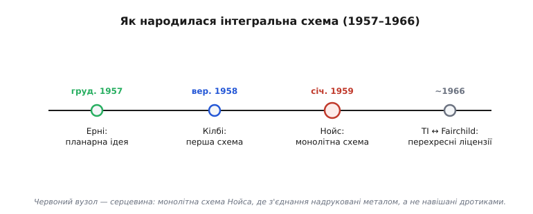
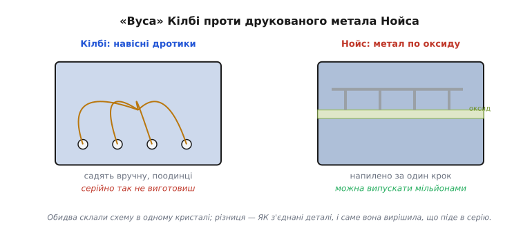
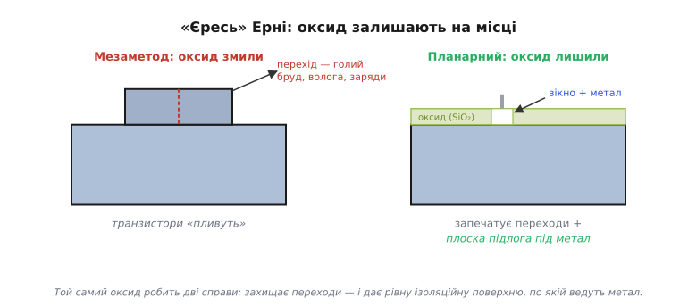
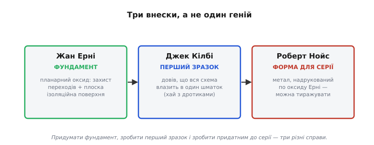
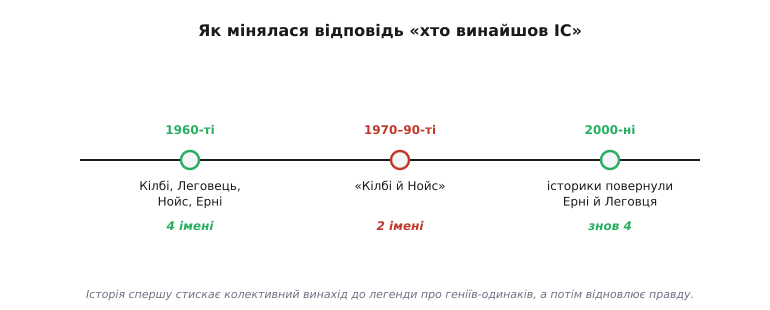

# Винайдення інтегральної схеми

Коли ми будуємо обчислювальну машину знизу вгору — з транзисторів складаємо [вентилі](topic:hw-digital/basic-gates), із вентилів — [тригери й регістри](topic:hw-digital/state-memory), а тоді [процесор](topic:hw-arch/what-is-processor) і [пам'ять](topic:hw-arch/memory-as-array), — легко мовчки прийняти як належне одну дивовижну річ: що всі ці мільйони транзисторів **уже сидять разом** в одному крихітному шматочку кремнію. А це геть не очевидно. Транзистор винайшли 1947 року як **окрему** деталь — рукотворну крихту, яку треба було поодинці припаювати до плати. Щоб дійти від однієї такої крихти до мільярда сусідів на одному кристалі, хтось мусив зробити стрибок думки: а що, як виготовляти не **окремі** деталі, а **цілу схему разом**, як єдине ціле? Цей стрибок зробили наприкінці 1950-х — і, як майже завжди у великій техніці, зробив його не один геній. За звичною формулою «Кілбі й Нойс винайшли мікросхему» ховаються щонайменше **три** різні внески трьох різних людей, тиха, але вирішальна роль фізика на прізвище **Ерні**, і довгий патентний суд за те, чий же це, власне, винахід. Розберімо все по черзі — бо ця історія напрочуд точно показує, **як** узагалі народжуються винаходи.

Почнімо з того стану речей, який ці люди застали, — бо саме він робить їхній крок зрозумілим. На середину 1950-х транзистор уже існував і вже витісняв громіздку вакуумну лампу: він був малий, холодний і надійний. Та вся радість швидко впиралася в одну стіну, яку інженери того часу називали «тиранією чисел» (*tyranny of numbers*). Складна схема — скажімо, комп'ютер чи система наведення — потребувала **тисяч** деталей: транзисторів, резисторів, конденсаторів. І кожну з цих тисяч деталей треба було виготовити окремо, а потім **поодинці** з'єднати з рештою — припаяти вручну тисячі, а то й десятки тисяч дротяних перемичок. Кожне паяння — це місце, де щось може відірватися, замкнути, втомитися. Що складніша схема, то більше з'єднань; що більше з'єднань, то ймовірніше, що бодай одне підведе, — і вся машина встане. Виходило зачароване коло: люди вже вміли **придумувати** складні схеми, але вже не вміли надійно їх **зібрати**. Складність уперлася в стелю не задуму, а збирання.

*Ланцюг подій, з якого виросла мікросхема. Червоний вузол — серцевина історії: монолітна інтегральна схема Роберта Нойса (січень 1959), у якій з'єднання надруковані металом по поверхні, а не навішані дротиками. Та до неї вже були дві сходинки: планарна ідея Ерні (грудень 1957) і перша працююча схема в одному шматку від Кілбі (вересень 1958). Як часто буває з великими винаходами, рішення тут просте на словах — «робити не окремі деталі, а цілу схему разом», — але здійснили його кілька людей, і ще роки потому тривав суд за те, кому належить авторство.*

Отут і визріло питання, з якого все почалося. Якщо кожне рукотворне з'єднання — це слабке місце, то чи не можна **позбутися самих з'єднань** як окремої операції? А що, як виготовляти не тисячу деталей, які потім доводиться зшивати, а **відразу всю схему як одне суцільне тіло** — у тому самому шматку матеріалу, тим самим процесом, так, щоб деталі народжувалися вже з'єднаними? Думка проста на словах і майже єретична на практиці: вона вимагала перестати мислити схему як **набір деталей** і почати мислити її як **єдиний виріб**. Двоє людей по різні боки країни дійшли до цієї думки майже одночасно — і пішли до неї двома різними шляхами.

---

## Джек Кілбі й «монолітна ідея»: ціла схема в одному шматку

Перший із двох — **Джек Кілбі** (*Jack Kilby*, 1923–2005), американський інженер, людина небалакуча, ґрунтовна й уперта. Влітку 1958 року він щойно влаштувався у фірму **Texas Instruments** (TI) — і опинився в становищі, яке несподівано стало його шансом. Новачок ще не мав права на спільну літню відпустку, тож майже порожнім корпусом ходив сам і мав рідкісну для інженера розкіш — кілька тижнів тиші, щоб думати над великою задачею без поточної метушні. А задачею була та сама «тиранія чисел».

Кілбі міркував так. Усі деталі схеми — і транзистори, і резистори, і конденсатори — у принципі можна зробити **з того самого** напівпровідника. Резистор — це просто смужка матеріалу з певним опором; конденсатор — два провідники з прошарком між ними; усе це реально витворити в кремнії чи германії. А якщо всі деталі можна зробити з одного матеріалу, то навіщо робити їх **нарізно** й потім зшивати? Зробімо їх **усі разом, в одному суцільному шматочку** напівпровідника — і проблема тисяч окремих деталей зникне сама собою. Цю думку згодом назвали **«монолітною ідеєю»** (*monolithic idea*): від грецького «монос» — один, «літос» — камінь; уся схема як **один камінь**, а не купа склеєних докупи камінчиків.

**12 вересня 1958 року** Кілбі показав керівництву працюючий доказ цієї ідеї — крихітну пластинку **германію**, на якій умістилася ціла дрібна схема (генератор коливань). Вона працювала: на екрані осцилографа побігла синусоїда. Це й була **перша у світі інтегральна схема** — кілька електронних деталей, виготовлених разом в одному шматочку напівпровідника. Стіну «тиранії чисел» було пробито: Кілбі довів, що схему **можна** робити суцільною, а не складати з окремих деталей. За цей крок він — через довгих сорок два роки — отримає Нобелівську премію з фізики 2000 року, але про неї та її гірку несправедливість ми скажемо наприкінці.

> 🔧 **Навіщо це.** Сама ідея, яку довів Кілбі, — це фундамент, на якому стоїть **геть усе** залізо мікроелектроніки. Кожен мікроконтролер, кожен давач, кожна пам'ять, з якими ви матимете справу, — це **монолітна** інтегральна схема: мільйони деталей, народжених разом в одному кристалі кремнію тим самим процесом. Коли ви тримаєте чип і бачите на ньому маркування «IC» (*integrated circuit*), ви тримаєте пряме продовження тієї германієвої пластинки 1958-го. Уся мікроелектроніка існує тому, що колись хтось вирішив робити не окремі деталі, а **цілу схему разом**.

Та сам Кілбі чесно знав і слабке місце свого першого зразка — і саме воно лишило двері відчиненими для другого героя цієї історії. Деталі в його схемі вже сиділи в одному шматку, але **з'єднані** між собою вони були по-старому: тонкими золотими дротиками, які людина припаювала **поодинці** під мікроскопом. Для одного дослідного зразка це годилося; для **масового** виробництва — аж ніяк. Виходило половинчасто: «тиранію чисел» подолали для самих деталей, але вона нікуди не поділася для **з'єднань** між ними. Потрібен був хтось, хто прибере й цю, останню, ручну операцію.

---

## Роберт Нойс і монолітна схема, придатна до серії

Цим «кимось» став **Роберт Нойс** (*Robert Noyce*, 1927–1990) — теж американець, але вдачею повна протилежність Кілбі: блискучий, харизматичний, природжений лідер, якого згодом назвуть «мером Кремнієвої долини». На той момент він був одним із засновників молодої каліфорнійської фірми **Fairchild Semiconductor** — і, що важливо, прийшов до тієї самої «монолітної ідеї» **незалежно** від Кілбі, лише на кілька місяців пізніше: запис у його робочому зошиті датований **січнем 1959 року**. Історія тут не зводить двох суперників до «хто на день раніше»; вони справді думали в один бік окремо один від одного, і кожен додав своє.

А додав Нойс саме те, чого бракувало зразкові Кілбі, — **спосіб з'єднувати деталі без жодного ручного дротика**. Замість того щоб припаювати золоті перемички поодинці, Нойс запропонував **надрукувати** всі з'єднання відразу: напилити тонкі доріжки алюмінію просто **по плоскій поверхні** кристала, поверх ізоляційного шару, — за один технологічний крок, на цілу пластину водночас. Деталі з'єднувалися б самі собою, в тому ж процесі, що їх і породжує, без єдиного дотику людської руки. Ось у чому полягала справжня різниця між двома винахідниками — і саме вона, а не дата в зошиті, виявилася вирішальною.

*Та сама ідея, втілена двома способами. Ліворуч — гібридна схема Кілбі: усі деталі вже в одному шматку германію, але з'єднані навісними золотими дротиками, які садять вручну поодинці, — серійно так не виготовиш. Праворуч — монолітна схема Нойса: доріжки алюмінію напилені просто по поверхні кристала поверх ізоляційного оксиду, разом з усім чипом за один крок. Обидва склали схему в одному кристалі; різниця — у тому, як з'єднані деталі, і саме вона вирішила, чия конструкція піде в масове виробництво. Звідси й важлива тонкість: «винайшов перший» і «винайшов те, що можна випускати мільйонами» — це не конче та сама людина.*

Тут і криється корінь усієї плутанини з авторством, тож проговорімо її чесно й точно. **Кілбі зробив це першим** — він раніше показав працюючу схему в одному шматку, і первородство тут за ним. Але **конструкцію, яку справді можна масово виготовляти**, — пласку, з друкованими, а не навісними з'єднаннями — запропонував **Нойс**. Саме монолітна схема Нойса, а не дротяний зразок Кілбі, стала прямим предком **усіх** сьогоднішніх мікросхем: коли дивишся на сучасний кремнієвий кристал, бачиш плаский «пиріг» Нойса, а не германієву пластинку з золотими вусами. Тому питання «хто винайшов інтегральну схему?» не має однієї чесної відповіді: один **довів, що це взагалі можливо**, другий **зробив це придатним до життя**. Обидва внески різні, і обидва необхідні. Та щоб зрозуміти, **звідки** в Нойса взялася та плоска поверхня, по якій так зручно друкувати метал, доведеться відступити на крок назад — до людини, яку формула «Кілбі й Нойс» зазвичай узагалі забуває.

---

## Жан Ерні й «єресь» планарного процесу: оксид, який не змили

Бо ідея Нойса «напилити метал просто по поверхні» висить у повітрі, поки не спитаєш просту річ: **по якій саме поверхні**? Щоб провести металеві доріжки поверх кристала й не наробити коротких замикань, потрібна рівна, гладенька, **ізоляційна** підлога над усіма деталями. А ще донедавна такої підлоги в напівпровідниковій техніці просто не було — поверхня кристала з транзисторами була горбкувата й електрично «жива». Цю підлогу — і набагато більше — дав один тихий фізик із того ж таки Fairchild, **Жан Ерні** (*Jean Hoerni*, 1924–1997).

Ерні був не зовсім типовою постаттю для американської електроніки: **швейцарець** за походженням, фізик-теоретик із докторатами з двох європейських університетів (Женева і Кембридж), людина радше книжкова, ніж цехова. Поки колеги налагоджували виробництво, Ерні, як згадували сучасники, «сидів і малював у своєму зошиті». І в тому зошиті ще **в грудні 1957 року** він записав думку, що суперечила здоровому глузду всієї тодішньої галузі.

Щоб відчути, наскільки вона була зухвала, треба знати тодішнє ремесло. Транзистори тоді робили так званим **мезаметодом** (*mesa* — «столова гора» іспанською): активну частину лишали припіднятою над рештою кристала, наче пласку гору, а захисний шар **оксиду** (того самого діоксиду кремнію, SiO₂, що сам собою наростає на кремнії), який використовували під час травлення, наприкінці **обов'язково змивали**. Так вважали за єдино правильне: оксид — це технологічне «риштування», його місце — на смітнику, а робочу поверхню належить **оголити**. Платою за це була відкрита назовні межа p-n переходу — найделікатніше місце транзистора, тепер беззахисне перед брудом, вологою й випадковими зарядами. Транзистори через це «пливли» за параметрами й були примхливі. З цим миналися як з неминучим злом.

Ерні запропонував зробити рівно навпаки — і саме в цьому полягала його «єресь»: **не змивати оксид, а лишити його на місці**. Хай тонкий шар діоксиду кремнію залишиться суцільною плівкою поверх усього кристала, накриваючи й запечатуючи делікатні переходи там, де вони виходять на поверхню. Колеги спершу не вірили: навіщо лишати «бруд» на робочій поверхні? Та Ерні мав рацію — і навіть глибшу, ніж сам спершу гадав.

*У чому полягав здогад Ерні. Ліворуч — старий «мезаметод»: захисний оксид наприкінці змивають, і межа p-n переходу виходить на голу поверхню, де її псують бруд, волога й заряди (звідси примхливість і ненадійність). Праворуч — планарний процес: той самий оксид залишають суцільним шаром поверх кристала. І тоді він робить одразу дві справи: запечатує переходи (надійність і стабільність) — і слугує рівною ізоляційною «підлогою», по якій уже можна вести металеві доріжки, прорізавши в ній лише потрібні вікна. Друга роль оксиду — те, чого Ерні спершу й не шукав, — і стала містком до інтегральної схеми.*

Виявилося, що один-єдиний шар оксиду розв'язує **дві** різні задачі заразом — і друга з них була та, якої Ерні навіть не ставив. Перша, очікувана: оксид **захищає** переходи, тож транзистори перестають «пливти» й стають надійні та повторювані — самé по собі величезне досягнення. А друга, побічна й воістину доленосна: цей самий оксид — чудовий **ізолятор**, і він укриває кристал **рівною, плоскою плівкою**. Тобто планарний процес Ерні задарма дав ту саму гладеньку ізоляційну підлогу, якої потребувала ідея Нойса: тепер можна було прорізати в оксиді крихітні вікна там, де треба торкнутися деталей, і **напилити поверх метал**, не боячись коротких замикань. Спосіб, яким Ерні просто хотів зробити транзистори надійнішими, несподівано виявився саме тим фундаментом, на якому стало можливим **друкувати цілі схеми**. Цей метод і назвали **планарним процесом** (*planar process* — від «plane», площина): уся структура транзистора плоска, схована під захисним оксидом. Ерні занотував його в зошиті в грудні 1957-го, виготовив працюючий планарний транзистор навесні 1959-го, а Fairchild подав на нього патент (№ 3,025,589) у травні 1959 року, з Ерні як **єдиним** автором.

> 🔧 **Навіщо це.** Планарний процес — не музейний експонат, а **той самий** спосіб, яким мікросхеми роблять і досі. Кожен сучасний чип — це плаский «пиріг» із шарів, де оксид то ізолює, то захищає, а метал біжить доріжками поверх нього крізь прорізані вікна, — рівно за Ерні, тільки шарів тепер десятки, а доріжки тонші за вірус. [Фотолітографія](topic:hw-components/photolithography) — «друк схеми світлом» — друкує саме на тій плоскій поверхні, яку винайшов Ерні. Без його оксиду не було б ні монолітної схеми Нойса, ні взагалі масового виробництва чипів. Це наочний приклад того, як «непомітна» інженерна деталь виявляється важливішою за гучний винахід, що на ній стоїть.

Тому правдива формула цієї історії — не «Кілбі й Нойс», а **троє**. Зведімо їхні ролі разом, бо саме в цьому розподілі — головний урок.

---

## Три внески, а не один геній

*Точна, по ролях, атрибуція. Жан Ерні — фундамент: планарний процес, що дав і захист переходів, і плоску ізоляційну поверхню під метал. Джек Кілбі — перший зразок: довів, що цілу схему можна вмістити в один шматок напівпровідника (хай і з ручними дротиками). Роберт Нойс — придатна до серії форма: метал, надрукований по оксиду Ерні замість дротиків, — саме цю конструкцію й можна випускати мільйонами. «Придумати фундамент», «зробити перший зразок» і «зробити так, щоб це масово виготовлялося» — три різні справи; прибери будь-яку, і дива не буде.*

Придивімося до цього розподілу уважніше, бо він повчальний. **Жан Ерні** заклав **фундамент**: без планарного оксиду немає рівної ізоляційної поверхні — отже, нема куди класти метал, і вся ідея друкованих з'єднань повисає. **Джек Кілбі** зробив **перший працюючий зразок**: довів, що сама ідея «вся схема в одному шматку» реальна, а не фантазія, — і первородство по праву його. **Роберт Нойс** дав **придатну до серії форму**: прибрав ручні дротики, поклавши метал просто на оксид Ерні, — і саме його конструкцію можна було тиражувати мільйонами. Три внески шикуються в ланцюжок, де кожна ланка спирається на попередню: основа Ерні → доказ Кілбі → серійна форма Нойса. Викинь будь-яку ланку — і ланцюг розривається: без оксиду нема куди класти метал, без дротиків Кілбі не було б доказу, що схема в одному шматку взагалі працює, без плаского метала Нойса не було б чого випускати серійно.

І це навіть ще не повний список. У ті самі роки незалежно працювали й інші: скажімо, **Курт Леговець** (*Kurt Lehovec*) запатентував спосіб **електрично ізолювати** сусідні деталі на одному кристалі p-n переходом — ще одну необхідну цеглинку інтегральної схеми, без якої деталі в спільному кристалі заважали б одна одній. Винахід складався з кількох незалежних шматочків, які різні люди принесли майже водночас, — і це типова, а не виняткова картина для великої техніки. Так само було з [першим процесором](topic:hw-arch/what-is-processor), із появою [архітектури RISC](topic:hw-arch/isa), із народженням [програмовної логіки](topic:hw-digital/programmable-logic): за зручним «хтось один винайшов» майже завжди ховається кілька різних рук, що зробили кілька різних, але неподільних справ.

Тут варто на мить відступити вбік і помітити ще одну спільну рису цих людей — і застерегтися від поспішних висновків про неї. І Нойс, і Ерні прийшли у Fairchild не випадково: обидва належали до знаменитої **«зрадницької вісімки»** (*traitorous eight*) — групи з восьми молодих інженерів, які 1957 року гуртом пішли від свого тодішнього керівника, нобелівського лауреата й винахідника транзистора **Вільяма Шоклі** (*William Shockley*), і заснували Fairchild Semiconductor. Шоклі був блискучим фізиком і нестерпним керівником; «зрада» полягала в тому, що підлеглі не витримали його манери й пішли робити справу самі. Із цієї вісімки, до речі, виросла потім і ціла Кремнієва долина — Нойс згодом співзаснував **Intel**. Спокусливо побачити тут «геніїв-бунтарів», та чесніше сказати інакше: видатний результат дала не так чиясь окрема геніальність, як **середовище** — місце, де зібралися сильні різні люди й де ідея одного (оксид Ерні) могла відразу лягти в основу ідеї іншого (метал Нойса). Винахід був колективним не лише на папері, а й по суті.

---

## Патентна війна й несподівано мудрий мир

Якщо винахід зробили майже одночасно дві фірми, розв'язка напрошувалась сама: **суд**. І він справді тривав роками. TI спиралася на первородство Кілбі — він показав працюючу схему раніше. Fairchild спиралася на конструкцію Нойса — саме його монолітна, з друкованим металом, схема була тим, що пішло в життя. Кожна сторона подала свій патент, кожна доводила, що **справжній** винахід належить їй, і юристи з'ясовували те, що ми вже й самі побачили: один зробив **перший зразок**, другий — **придатну до серії форму**.

Суди виходили заплутані й тривали довго. Підсумок, якщо стиснути, був роздвоєний: право на сам **принцип** інтегральної схеми в масовій свідомості більше пов'язали з Кілбі й TI, а от ключову **монолітну конструкцію** з друкованими по оксиду з'єднаннями суд віддав **Нойсові**. Вирішальне рішення виніс Апеляційний суд із митних і патентних справ США (*Court of Customs and Patent Appeals*) у справі **Noyce v. Kilby 6 листопада 1969 року** — на користь Нойса; а 1970-го Верховний суд відмовився переглядати справу, тим самим його лишивши чинним. Спір упирався в дрібну, але вирішальну деталь формулювань: чи означав вислів у заявці Кілбі (метал «прокладено», *laid down*) те саме, що надійне з'єднання-прилягання, як у Нойса, — і суд вирішив, що ні. Тобто навіть суд по-своєму повторив головну думку цієї історії: винахід **роздвоєний**, і чесно віддати його комусь одному не виходить навіть юридично — тим паче що до самого присуду фірми вже помирилися.

А далі сталося те, що в цій історії найповчальніше — і найдоросліше. Замість того щоб роками поборювати одна одну в судах, дві фірми **домовилися**. Приблизно в **1966 році** TI й Fairchild уклали угоду про **перехресне ліцензування** (*cross-licensing*): кожна визнала патенти іншої й дозволила іншій ними користуватися, а решта виробників могла ліцензувати винахід в обох. Замість «переможець забирає все» обрали «хай індустрія росте, а ми обидві заробляємо з кожного чипа». І рішення виявилося мудрим: ринок мікросхем, нікому не віддаючи монополії, вибухнув зростанням, і виграли від цього всі — обидві фірми, уся галузь і, врешті, ми з вами, бо саме цей мир розчистив дорогу дешевим масовим чипам. Це рідкісний випадок, коли суперечку про авторство залагодили не присудом «хто кого», а спільним інтересом дати винаходу жити.

---

## Чим скінчилося — і що з цього взяти

*Як сама відповідь на питання «хто винайшов ІС» мінялася з часом. У 1960-х фахові тексти чесно називали кількох — Кілбі, Леговця, Нойса, Ерні. Згодом, заради зручності переказу, історію стиснули до двох звучних імен — «Кілбі й Нойс», — і Ерні з Леговцем тихо випали з підручників. А вже у 2000-х історики техніки (зокрема Леслі Берлін і Бо Лоєк) повернули забуті імена назад, відновивши повну картину. Наочний приклад, як історія спершу спрощує колективний винахід до легенди про геніїв-одинаків, а потім, придивившись, відновлює правду. Урок простий: коли вам називають одного «винахідника» — питайте, кого забули.*

Зведімо нитки докупи. Долі трьох героїв склалися дуже по-різному, і в цій нерівності — окрема гірка нота. **Джек Кілбі** дожив до визнання: **2000 року** він отримав **Нобелівську премію з фізики** «за участь у винаході інтегральної схеми» — і, людина скромна, у промові окремо згадав внесок інших, зокрема Нойса. **Роберт Нойс** Нобеля не дочекався: він **помер 1990 року**, а премію посмертно не присуджують, тож його ім'я в нобелівському формулюванні відсутнє — хоча мало хто сумнівається, що, доживши, він розділив би її з Кілбі. А **Жан Ерні**, без чийого оксиду не було б ні тієї премії, ні самої масової мікросхеми, лишився в тіні чи не найдужче: його ім'я рідко звучить поряд із двома гучнішими, хоч саме його «єресь» зробила всю конструкцію можливою. Винахід був спільний — а слава розподілилася дуже нерівно.

І ось у цій нерівності — **головний** урок історії, ширший за саму електроніку. Велике в техніці майже ніколи не буває справою одного генія-одинака, хай як зручно так переказувати. За формулою «Кілбі й Нойс винайшли мікросхему» стоять **щонайменше троє**: Ерні дав фундамент, Кілбі — перший доказ, Нойс — придатну до життя форму (а поряд були ще й Леговець, і вся «зрадницька вісімка», і незліченні безіменні руки на виробництві). Підручники й музейні таблички люблять одне звучне ім'я, бо легенда про самотнього генія простіша за правду про колективну працю. Та правда зазвичай інша — і чесніша: за кожним «хтось придумав» ховається кілька різних людей, що зробили кілька різних, неподільних справ. Тримайте це в голові не лише тут, а щоразу, коли вам називатимуть єдиного «винахідника» чого завгодно: майже напевно поряд були інші, кого переказ для зручності забув.
