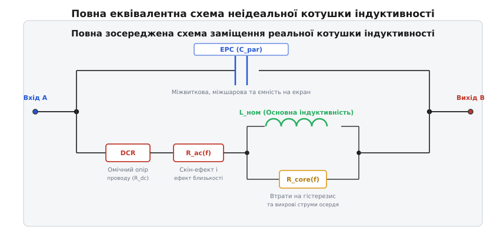
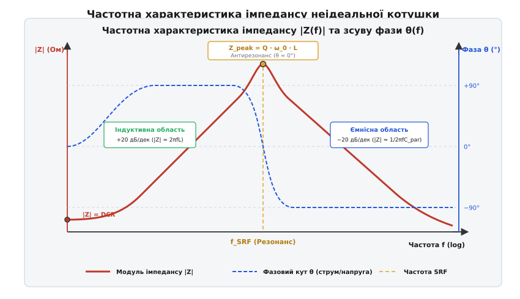
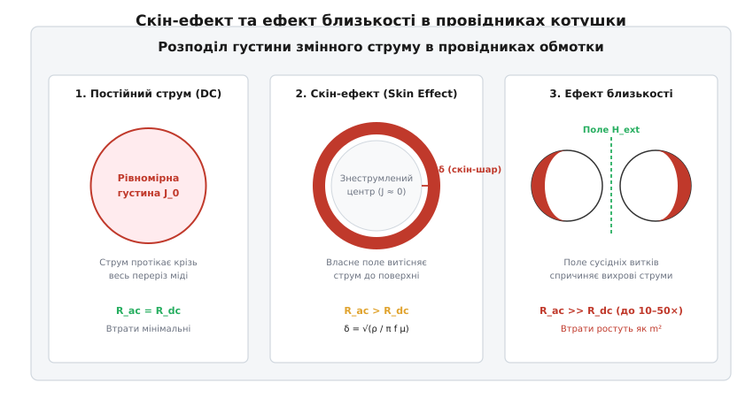
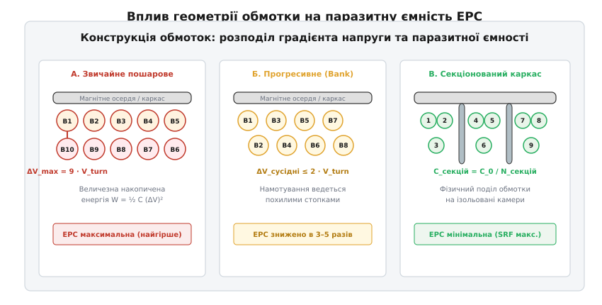
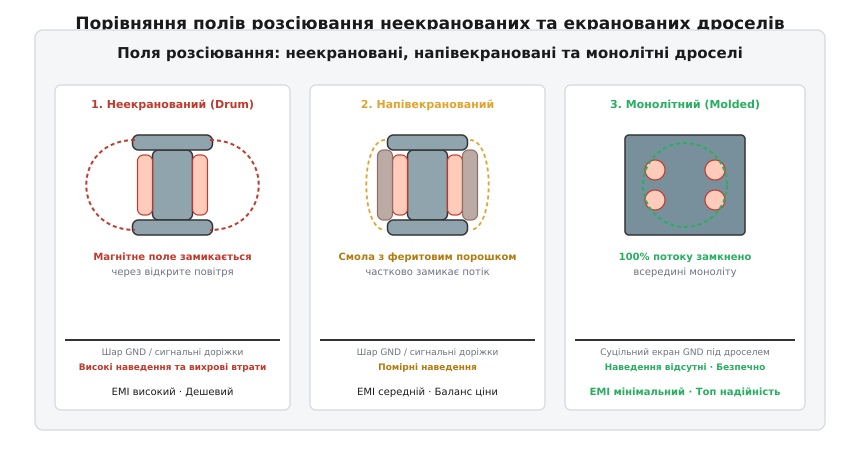

# Паразити котушки

<preknowlist>
- [Котушка](topic:ph-electromagnetism/inductor-coil) — накопичення енергії в магнітному полі та електрорушійна сила самоіндукції.
- [Індуктивність](topic:ph-electromagnetism/inductance) — коефіцієнт пропорційності між електричним струмом і створеним магнітним потоком.
- [Закон електромагнітної індукції Фарадея](topic:ph-electromagnetism/faraday-law) — виникнення ЕРС при зміні магнітного потоку в часі.
- [Ферит і втрати в осерді](topic:hw-components/core-losses) — гістерезис, вихрові струми в магнетику та комплексна проникність.
- [Власна резонансна частота (SRF)](topic:hw-components/self-resonant-frequency) — явище резонансу між основною індуктивністю та паразитною ємністю.
- [Добротність Q](topic:hw-analog/quality-factor) — співвідношення між збереженою та розсіяною енергією коливальної системи.
- [Скін-ефект](topic:hw-components/skin-effect) — витіснення змінного струму високої частоти до поверхні провідника.
- [Паразити конденсатора](topic:hw-components/capacitor-parasitics) — еквівалентний послідовний опір ESR та паразитна індуктивність ESL.
- [Вихрові струми](topic:ph-electromagnetism/eddy-currents) — індукційні струми у масивних металевих провідниках у змінному магнітному полі.
- [Джоулеве тепло](topic:ph-electromagnetism/joule-heating) — тепловиділення при протіканні електричного струму крізь активний опір.
</preknowlist>

У синхронному знижувальному імпульсному перетворювачі (*Buck converter*) із вхідною напругою 12 В, вихідною напругою 1.2 В та струмом навантаження 15 А при підвищенні частоти перемикання з 300 кГц до 2.2 МГц силова котушка індуктивністю 1.0 мкГн із паспортним активним опором постійному струму `DCR = 4.5 мОм` за 30 секунд після ввімкнення нагрівається до температури +140 °C. Розрахунок статичних теплових втрат на постійному струмі прогнозував розсіювання потужності всього `P_dc = I² · DCR = 15² · 0.0045 = 1.01 Вт`, що для даного габариту корпусу мало викликати перегрів не більше ніж на +25 °C відносно навколишнього середовища. Одночасно з цим ККД перетворювача падає з розрахункових 93% до неприйнятних 78%, а на комутаційному вузлі осцилограф фіксує інтенсивні високочастотні коливальні сплески (*ringing*) з амплітудою до 28 В та спектральним піком на частоті 145 МГц, які виводять з ладу затвори силових польових транзисторів.

Фізична причина цієї теплової та електродинамічної катастрофи полягає в тому, що на високих частотах реальна котушка індуктивності повністю втрачає властивості ідеального індуктивного накопичувача. Замість чистої індуктивності `L`, яка протидіє зміні струму та накопичує магнітну енергію `W = ½ · L · I²`, компонент перетворюється на складне просторово розподілене коло втрат та паразитних ємностей. Високочастотне змінне електромагнітне поле витісняє лінії струму з глибини мідного провідника до його поверхні (**скін-ефект**) та змушує вихрові струми сусідніх витків концентруватися у вузьких контактних зонах (**ефект близькості**), збільшуючи дійсний активний опір обмотки у 20–80 разів. Одночасно мікроскопічні електричні поля між витками, шарами та корпусом формують еквівалентну паралельну ємність (**EPC**), яка на власній резонансній частоті повністю шунтує індуктивність і перетворює дросель на ємнісне коротке замикання для високочастотних завад.

---

### Повна зосереджена схема заміщення реальної котушки

Для точного математичного опису та схемотехнічного аналізу неідеальну котушку замінюють еквівалентною схемою із зосередженими параметрами, кожен елемент якої відображає конкретний фізичний механізм розсіювання або збереження електромагнітної енергії.


*Повна зосереджена схема заміщення реальної котушки індуктивності. Послідовна гілка включає номінальну індуктивність (L), омічний опір проводу постійному струму (DCR), динамічний високочастотний опір міді (R_ac) та паралельний еквівалентний опір втрат у магнітному осерді (R_core). Паралельно всій структурі підключено еквівалентну паразитну ємність (EPC), що об'єднує міжвиткові, міжшарові та просторові ємності на екран.*

#### 1. Номінальна індуктивність обмотки `L(f)`
Відображає здатність котушки накопичувати кінетичну енергію магнітного поля, створеного впорядкованим рухом носіїв заряду. Вона визначається кількістю витків `N`, геометрією магнітного контуру (довжиною середньої лінії `l_e` та ефективною площею перерізу `A_e`) і дійсною частиною комплексної магнітної проникності осердя `μ'`:

```
L = μ_0 · μ'(f) · N² · A_e / l_e
```

де `μ_0 = 4·π·10⁻⁷ Гн/м` — магнітна стала (від лат. *inductio* — наведення, спонукання). У реальних компонентах із феромагнітним або феритовим осердям значення `μ'` монотонно зменшується на високих частотах унаслідок магнітної релаксації доменних стінок (явище феромагнітного резонансу), через що базова індуктивність падає при наближенні до гігагерцового діапазону.

Крім того, під дією сильного постійного струму підмагнічування `I_dc` робоча точка на кривій намагнічування зміщується в область насичення, що викликає явище **струмового дератингу індуктивності** (*DC-bias de-rating*). Диференціальна проникність `μ_diff = dB/dH` зменшується, внаслідок чого ефективна індуктивність котушки може зменшуватися на 20–50% при номінальному струмі навантаження.

При нагріванні осердя до температури Кюрі `T_Curie` тепловий рух атомів руйнує спонтанну доменну намагніченість, і магнітна проникність катастрофічно падає до одиниці (`μ_r → 1`), перетворюючи дросель на звичайну котушку без осердя.

Для запобігання передчасному насиченню в магнітний контур вводять калібрований немагнітний зазор довжиною `l_gap`. За законом Ома для магнітного кола повний магнітний опір дорівнює сумі опорів осердя та зазору `R_m = l_core / (μ_0 · μ_r · A) + l_gap / (μ_0 · A)`. Навіть мікроскопічний проміжок `0.1 мм` концентрує до 90% накопиченої магнітної енергії в повітрі, розширюючи діапазон лінійності струму в рази.

У багатофазних стабілізаторах живлення процесорів (VRM) застосовують **зв'язані індуктивності** (*Coupled Inductors*). Матриця взаємної індуктивності `M_ij = k_ij · √(L_i · L_j)` з від'ємним коефіцієнтом зв'язку `k < 0` дозволяє частково скомпенсувати постійний магнітний потік у спільній серцевині осердя, що пригнічує струмові пульсації та кардинально покращує динамічний відгук перетворювача на стрибки навантаження.

Комплексна магнітна проникність осердя записується як `μ = μ' - j · μ''`. Тангенс кута магнітних втрат матеріалу `tan δ_m = μ'' / μ'` безпосередньо визначає якість осердя на високих частотах: власна добротність осердя становить `Q_core = 1 / tan δ_m`.

#### 2. Опір постійному струму `DCR` (`R_dc`)
Активний омічний опір мідного або алюмінієвого провідника обмотки на нульовій частоті (від англ. *Direct Current Resistance*). Розраховується за класичним законом Пульє:

```
DCR = ρ · l_wire / A_wire
```

де `ρ` — питомий електричний опір металу (для відпаленої міді при +20 °C `ρ ≈ 1.724·10⁻⁸ Ом·м`), `l_wire` — повна розгорнута довжина проводу обмотки, а `A_wire = π · d² / 4` — площа поперечного перерізу жили. Оскільки мідь має додатний температурний коефіцієнт опору `α_Cu ≈ +0.393 % / °C`, при нагріванні котушки до робочої температури +125 °C величина DCR зростає на 41% від початкового кімнатного значення:

```
DCR(T) = DCR_20 · ( 1 + α_Cu · (T - 20) )
```

#### 3. Високочастотний активний опір провідника `R_ac(f)`
Частотно-залежна добавка до опору міді, викликана електродинамічним перерозподілом ліній струму під дією вихрових струмів скін-ефекту та ефекту близькості. Якщо на постійному струмі густина струму `J` є строго однорідною по всьому перерізу провідника, то на високих частотах струм стискається в тонкий приповерхневий шар, багаторазово зменшуючи ефективну площу провідності.

#### 4. Еквівалентний паралельний опір втрат в осерді `R_core(f)`
Відображає сумарні незворотні теплові втрати енергії в магнітному матеріалі осердя. Складається з трьох фізичних складових:
- **Втрати на динамічний гістерезис `P_hyst`:** Енергія, яка витрачається на циклічну переорієнтацію магнітних доменів і долання внутрішнього тертя кристалічної ґратки магнетика за кожний період коливань (описується емпіричним рівнянням Штейнметца `P_h = k_h · f · B_max^n`);
- **Втрати на вихрові струми Фуко в осерді `P_eddy`:** ЕРС, індукована змінним магнітним потоком всередині самого матеріалу осердя, викликає замкнені мікроструми, пропорційні квадрату частоти та обернено пропорційні питомому об'ємному опору магнетика `P_e ∝ (f · B_max)² / ρ_core`;
- **Залишкові релаксаційні втрати `P_rem`:** Зсув фази між вектором намагніченості `M` та напруженістю прикладеного поля `H`, що описується уявною частиною комплексної проникності `μ''`.

У сучасних імпульсних джерелах із прямокутною формою напруги ШІМ розрахунок втрат за класичною синусоїдальною формулою Штейнметца дає заниження втрат у 2–3 рази. Для врахування крутих фронтів `dB/dt` використовують модифіковане рівняння Штейнметца (iGSE, *improved Generalized Steinmetz Equation*).

#### 5. Паразитна еквівалентна паралельна ємність `EPC` (`C_par`)
Сумарна зосереджена ємність котушки (від англ. *Equivalent Parallel Capacitance*), яка акумулює енергію електричного поля `W_E = ½ · C_par · V²`. Вона складається з:
- Міжвиткової ємності сусідніх витків одного шару `C_tt`;
- Міжшарової ємності між суміжними рядами намотування `C_ll`;
- Ємності витків на магнітне осердя `C_tc` (якщо осердя має провідність або є заземленим);
- Ємності виводів і монтажних контактних площадок на друкованій платі `C_pad`.

---

### Власна резонансна частота (SRF) та інверсія імпедансу

Оскільки еквівалентна схема заміщення котушки містить як індуктивний накопичувач `L`, так і паразитну ємність `EPC`, на певній частоті реактивні опори індуктивності `X_L = ω · L` та ємності `X_C = 1 / (ω · EPC)` стають рівними за модулем.

Ця точка називається **власною резонансною частотою** (*Self-Resonant Frequency*, SRF; від лат. *resonare* — відгукуватися, відлунювати):

```
f_SRF = 1 / ( 2 · π · √(L · EPC) )
```

Комплексний імпеданс реальної котушки описується виразом для паралельного з'єднання індуктивно-активної гілки `Z_s = (DCR + R_ac) + j · ω · L` та паралельної ємності `Z_c = 1 / (j · ω · EPC)`:

```
Z(j·ω) = [ (R_s + j·ω·L) · (1 / (j·ω·EPC)) ] / [ R_s + j·ω·L + 1 / (j·ω·EPC) ]
       = [ R_s + j·ω·L ] / [ (1 - ω²·L·EPC) + j·ω·R_s·EPC ]
```

де `R_s = DCR + R_ac(f)`. Докладний алгоритм експериментального вимірювання та числової екстракції цих параметрів за S-параметрами векторного аналізатора кіл наведено у вставці [алгоритм екстракції паразитів котушки за S-параметрами VNA](topic:hw-components/inductor-parasitics/proj-srf-impedance-analyzer.md).


*Частотна характеристика модуля імпедансу |Z(f)| та фазового зсуву θ(f) неідеальної котушки на подвійній логарифмічній шкалі. Зліва направо: низькочастотне плато DCR; індуктивна область (+20 дБ/декаду, фаза +90°); пік паралельного антирезонансу на частоті SRF (фаза проходить через 0°); високочастотна ємнісна область (−20 дБ/декаду, фаза −90°).*

Частотна поведінка модуля імпедансу `|Z(f)|` розділяється на три принципово відмінні фізичні області:

#### 1. Індуктивна робоча зона (`f << f_SRF`)
На частотах, значно нижчих за резонанс, реактивний опір паразитної ємності `1 / (ω · EPC)` настільки великий, що струм крізь ємнісну гілку практично не протікає. Модуль імпедансу лінійно зростає прямо пропорційно частоті:

```
|Z(f)| ≈ 2 · π · f · L
```

На графіку це відповідає прямій лінії з додатним нахилом **+20 дБ на декаду** (збільшення частоти в 10 разів збільшує імпеданс у 10 разів). Фазовий зсув між напругою та струмом близький до ідеальних `+90°` (`+π/2` рад) — напруга випереджає струм на чверть періоду.

#### 2. Область паралельного антирезонансу (`f ≈ f_SRF`)
У точці `f = f_SRF` індуктивний струм котушки та ємнісний струм EPC мають однакову амплітуду, але протилежні фази (зсув 180°). Вони компенсують один одного у зовнішньому колі, циркулюючи всередині замкненого коливального контуру `L-EPC`.

Модуль повного імпедансу досягає свого абсолютного максимуму `Z_peak`, який обмежується виключно сумарними активними втратами в провіднику та осерді:

```
Z_peak ≈ Q · ω_0 · L 
       ≈ (ω_0 · L)² / R_s 
       ≈ L / ( R_s · EPC )
```

де `Q` — добротність котушки на резонансній частоті (`Q = ω_0 · L / R_s`). У якісних високочастотних індуктивностях піковий імпеданс може сягати сотень кілоом або мегаом, а фазовий зсув проходить через точку строго нульового значення `θ = 0°` (котушка поводиться як чистий активний резистор велетенського номіналу).

#### 3. Ємнісна зона замикання (`f >> f_SRF`)
Якщо частота сигналу або гармонік струму перевищує `f_SRF`, реактивний опір ємності `1 / (ω · EPC)` стає набагато меншим за індуктивний опір `ω · L`. Весь високочастотний струм починає протікати повз витки обмотки через паразитні мікроємності між сусідніми провідниками.

Модуль імпедансу починає спадати зі зростанням частоти за законом:

```
|Z(f)| ≈ 1 / ( 2 · π · f · EPC )
```

Нахил характеристики стає спадним **−20 дБ на декаду**, а фазовий кут інвертується і прямує до `−90°`. У цій області котушка повністю втрачає індуктивні властивості та починає працювати як конденсатор. Якщо інженер використовує такий дросель у фільтрі електромагнітних завад (EMI Filter), він перестає затримувати високочастотний шум і безперешкодно пропускає завади комутації у живильну мережу.

---

### Фізика високочастотних втрат у провіднику обмотки

Зростання активного опору обмотки зі збільшенням частоти обумовлене двома взаємопов'язаними електродинамічними явищами: скін-ефектом та ефектом близькості.


*Розподіл густини струму в поперечному перерізі провідників обмотки. 1: Постійний струм (DC) — однорідна густина по всій площі перерізу. 2: Скін-ефект — власне змінне магнітне поле витісняє носії заряду до зовнішньої поверхні провідника в шар товщиною δ. 3: Ефект близькості — поперечне магнітне поле від сусіднього витка створює замкнені вихрові струми, стискаючи робочий струм у вузьку серпоподібну контактну зону.*

#### 1. Скін-ефект (Skin Effect)
Коли крізь ізольований провідник радіусом `r_0` протікає змінний струм `i(t) = I_0 · sin(ω·t)`, всередині товщі металу виникає концентричне змінне магнітне поле. За законом електромагнітної індукції Фарадея це внутрішнє магнітне поле наводить вихрові ЕРС.

Згідно з правилом Ленца, напрямок індукованих вихрових струмів у центральній осі провідника протилежний до напрямку основного робочого струму (вони віднімаються), а на зовнішній поверхні провідника вихрові струми збігаються за напрямком з основним струмом (вони додаються). У результаті струм повністю витісняється з центральної серцевини проводу до його поверхні.

Густина змінного струму `J(r)` експоненціально спадає вглиб провідника від поверхні `r_0`:

```
J(r) = J_0 · exp( -(r_0 - r) / δ )
```

де `δ` — фундаментальна глибина проникнення змінного струму (**товщина скін-шару**; від англ. *skin* — шкіра, оболонка):

```
δ = √( ρ / (π · f · μ_0 · μ_r) )
```

Для мідного провідника (`ρ = 1.724·10⁻⁸ Ом·м`, `μ_r = 1`) інженерна формула для товщини скін-шару має зручний вигляд:

```
δ_Cu ≈ 66 / √(f)  [мм, де f — частота в Герцах]
```

- При частоті мережі `f = 50 Гц`: `δ = 9.33 мм` (скін-ефект непомітний для звичайних проводів);
- При частоті `f = 100 кГц`: `δ = 0.209 мм` (209 мкм);
- При частоті `f = 1 МГц`: `δ = 0.066 мм` (66 мкм);
- При частоті `f = 10 МГц`: `δ = 0.021 мм` (21 мкм).

Якщо діаметр проводу `d > 2 · δ`, центральна частина провідника практично не бере участі в перенесенні заряду і є баластною масою. Коефіцієнт зростання опору за рахунок власного скін-ефекту для круглого проводу асимптотично прямує до:

```
R_ac_skin / R_dc ≈ d / (4 · δ)   [при d >> δ]
```

#### 2. Ефект близькості (Proximity Effect)
У реальній котушці провідники розташовані впритул один до одного в один або кілька шарів. Кожен виток перебуває не лише у власному полі, але й у потужному зовнішньому змінному магнітному полі `H_ext`, створеному всіма сусідніми витками котушки.

Це зовнішнє поперечне магнітне поле пронизує тіло сусіднього провідника і збуджує в ньому потужні циркуляційні вихрові контури струму. З одного боку провідника цей індукований вихровий струм додається до основного струму, а з протилежного боку — повністю його гасить. У результаті струм зміщується до вузької зони, зверненої до сусіднього витка або міжшарового простору.

У багатошарових обмотках магнітне поле накопичується від шару до шару за законом повного струму Ампера: якщо в першому шарі напруженість поля становить `H_1 = I / b_w`, то в `m`-му шарі вона досягає `H_m = m · (I / b_w)`.

Оскільки густина вихрових струмів пропорційна напруженості поля `J_eddy ∝ H`, а потужність теплових втрат пропорційна квадрату густини струму `P ∝ J²`, теплові втрати на ефект близькості **зростають пропорційно квадрату кількості шарів `m²`**!

Аналітичний розрахунок цього явища описується моделлю Довелла, детальне математичне виведення якої наведено у вставці [аналітична модель Довелла: розрахунок втрат на ефект близькості](topic:hw-components/inductor-parasitics/math-dowell-proximity.md).

З моделі Довелла випливає, що в багатошаровому дроселі на частоті 500 кГц активний опір `R_ac` може перевищувати `DCR` у 50–150 разів, навіть якщо товщина окремого дроту була підібрана відповідно до глибини скін-шару.

---

### Конструктивні методи придушення високочастотних втрат провідника

Для подолання скін-ефекту та ефекту близькості в силових та високочастотних котушках застосовують спеціальні технології виготовлення обмоток:

#### 1. Літцендрат (Litz Wire)
**Літцендрат** (від нім. *Litze* — шнур, пасмо, та нім. *Draht* — провід) являє собою сплетений дріт, складений із багатьох десятків або сотень тонких ізольованих емаль-лаком жил, діаметр кожної з яких задовольняє умові:

```
d_жили ≤ 2 · δ(f)
```

Головна особливість літцендрату полягає у спеціальній топології плетіння: кожна окрема жила періодично змінює своє просторове положення, переходячи від центра пучка до зовнішньої поверхні та навпаки. Завдяки повній симетрії кожна жила за період плетіння охоплює однаковий магнітний потік, що вирівнює індуковані ЕРС і повністю усуває циркуляційні вихрові струми між жилами.

#### 2. Планарні обмотки на друкованих платах (Planar PCB Windings)
Використання плоских мідних доріжок у багатошарових друкованих платах (товщиною фольги 35 мкм, 70 мкм або 105 мкм). Оскільки товщина доріжки вибирається меншою або рівною `δ`, скін-ефект уздовж вертикальної осі мінімізується. Для зниження ефекту близькості шари первинної та вторинної обмоток чергують між собою (інтерлівінг, *interleaving*), що зменшує локальну напруженість поля `H_max` у вікні трансформатора.

#### 3. Намотування мідною шиною на ребро (Edge-Wound Flat Wire)
Намотування прямокутної мідної шини вузькою стороною (ребром) до осердя в один шар. Це забезпечує максимальний коефіцієнт заповнення вікна міддю (до 85–90% проти 40–50% для круглого дроту), мінімальний опір `DCR` та повну відсутність міжшарового ефекту близькості (`m = 1`).

---

### Фізична природа паразитної ємності EPC та методи її мінімізації

Еквівалентна паралельна ємність `EPC` є результатом сумарної електростатичної взаємодії між усіма провідними елементами конструкції котушки.


*Вплив топології намотування на розподіл міжвиткової різниці потенціалів та величину паразитної ємності EPC. А: Звичайне пошарове намотування — між початком першого шару та кінцем другого виникає максимальна різниця потенціалів ΔV = 9·V_turn, що створює колосальну EPC. Б: Прогресивне намотування (Bank Winding) — витки вкладаються похилими стопками, знижуючи міжвиткову напругу до ΔV ≤ 2·V_turn. В: Секціонований каркас (Sectional Bobbin) — фізичний поділ каркаса на ізольовані камери з'єднує ємності секцій послідовно.*

#### Енергетичний парадокс міжшарової ємності
Розглянемо звичайну двошарову обмотку, що складається з двох шарів по `N` витків у кожному (разом `2·N` витків). Нехай падіння напруги на один виток становить `V_turn = V_total / (2·N)`.

У класичному пошаровому намотуванні перший шар намотується зліва направо (витки від `1` до `N`), після чого дріт перекидається на другий шар і намотується справа наліво (витки від `N+1` до `2·N`):
- На лівому краї перший виток контактує через шар міжвиткової ізоляції з останнім витком `2·N`.
- Різниця потенціалів між цими фізично сусідніми провідниками становить:

```
ΔV_max = V(2·N) - V(1) = (2·N - 1) · V_turn ≈ V_total
```

Енергія електричного поля, накопичена в елементарній ємності `C_0` між двома провідниками, пропорційна квадрату напруги:

```
W_E = ½ · C_0 · (ΔV)²
```

Інтегруючи лінійний розподіл напруги `ΔV(x)` уздовж довжини шару від `0` до `V_total`, отримуємо, що еквівалентна динамічна ємність двошарової обмотки становить:

```
EPC_2layer = (4 / 3) · C_layer
```

де `C_layer` — статична ємність плоского конденсатора, утвореного двома суміжними шарами міді. Саме велетенський міжшаровий градієнт напруги формує до 85–95% всієї паразитної ємності стандартних багатошарових котушок.

#### Спеціальні топології намотування для зниження EPC

1. **Одношарове намотування з кроком (Space-Wound / Spaced Windings):**
   Витки укладаються в один шар із фіксованим повітряним проміжком між ними (крок намотування `p = 1.5…3 · d`). Це усуває контакт ізоляції сусідніх витків і зменшує міжвиткову діелектричну проникність до `ε_r ≈ 1` (повітря замість емалі з `ε_r = 3.5…4.2`), що підвищує SRF до сотень мегагерців або гігагерців (застосовується в RF-дроселях).

2. **Прогресивне намотування (Bank Winding):**
   Намотування ведеться не повними поздовжніми шарами на всю довжину каркаса, а короткими похилими секціями (хвилеподібно вперед-назад на глибину 2–3 витків). За такої топології поруч у просторі опиняються витки з різницею номерів не більше 2–3 (наприклад, виток 1 контактує лише з витками 2 та 3). Максимальна напруга між сусідніми точками падає в десятки разів:

   ```
   ΔV_bank ≤ 2 · V_turn << V_total
   ```

   Оскільки накопичена енергія пропорційна `(ΔV)²`, сумарна еквівалентна ємність EPC знижується в 3–8 разів при збереженні тих самих габаритів та індуктивності.

3. **Секціоновані каркаси (Sectional / Split Bobbin Winding):**
   Каркас котушки розділений діелектричними перегородками на `K` незалежних секцій. Обмотка ділиться на `K` послідовно з'єднаних частин, намотаних у різних секціях. Оскільки паразитна ємність кожної секції `C_sec` виявляється підключеною послідовно з ємностями інших секцій, сумарна ємність котушки різко падає:

   ```
   EPC_total ≈ C_sec / K ≈ C_0 / K²
   ```

4. **Кошикове та універсальне намотування (Basket / Honeycomb / Universal Winding):**
   Витки укладаються під великим кутом перехрещення до осі каркаса. Сусідні витки перетинаються лише в точкових вузлах під кутом 45–60°, а не лежать паралельно один до одного, що зводить міжвиткову площу перекриття та паразитну ємність до абсолютного фізичного мінімуму.

---

### Магнітні поля розсіювання, конструкція та екранування

Ступінь локалізації магнітного потоку є вирішальним фактором при виборі компонента для плат із високою щільністю монтажу.


*Конфігурація магнітних полів розсіювання в індуктивностях різної конструкції. 1: Неекранований гантельний дросель — магнітні лінії вільно виходять у повітря та пронизують полігони друкованої плати. 2: Напівекранований дросель — бічні грані залиті феромагнітною смолою. 3: Монолітний композитний дросель — обмотка запресована в металевий порошок, 100% магнітного потоку замкнено всередині.*

Детальний конструктивний розбір і технологічні особливості різних типів корпусів представлено у вставці [конструктивні типи індуктивностей та магнітне екранування](topic:hw-components/inductor-parasitics/comp-shielding-construction.md).

#### Електромагнітна взаємодія котушки з друкованою платою

1. **Трансформаторні наведення на сигнальні доріжки:**
   Змінне магнітне поле розсіювання неекранованої котушки пронизує контури, утворені сигнальними доріжками плати та землею. Відповідно до закону Фарадея, в контурі площею `S` індукується напруга завади:

   ```
   V_noise = - dΦ / dt = - μ_0 · S · (dH / dt)
   ```

   При швидкості перемикання транзисторів `dI/dt = 10 А / 10 нс = 10⁹ А/с` амплітуда завади на сусідній високоомній доріжці зворотного зв'язку може досягати кількох вольтів, викликаючи збій компаратора ШІМ-контролера або хибне спрацьовування захисту від перевантаження.

2. **Вихрові втрати в суцільних полігонах заземлення:**
   Якщо під неекранованою котушкою розташований суцільний мідний шар заземлення (GND plane), лінії поля індукують у міді кругові вихрові струми. За правилом Ленца поле цих струмів спрямоване назустріч основному полю котушки, що призводить до:
   - Зниження ефективної індуктивності дроселя на 15–30%;
   - Додаткового розсіювання тепла Джоуля в міді друкованої плати;
   - Зниження результуючої добротності `Q`.

---

### Придушення дзвінів: розрахунок демпфуючих RC-ланцюгів (Snubbers)

Коли силовий транзистор закривається за час `t_off = 5…15 нс`, струм дроселя перезаряджає паразитну ємність `EPC` та вихідну ємність MOSFET `C_oss`. Виникають незгасаючі коливання на частоті власного резонансу контуру `f_ring = 1 / (2·π·√(L_stray · C_total))`.

Для демпфування цих коливань паралельно комутаційному вузлу або котушці підключають послідовний RC-ланцюг (снабер):
- **Характеристичний опір контуру:** `Z_char = √( L_stray / C_total )`.
- **Опір снаберного резистора:** Для критичного демпфування вибирають `R_snub ≈ Z_char` (зазвичай 2.2 — 10 Ом).
- **Ємність снаберного конденсатора:** Вибирають у межах `C_snub = 2…4 · C_total`, щоб забезпечити поглинання реактивної енергії без надлишкових динамічних втрат потужності `P_snub = C_snub · V_in² · f_sw`.

---

### Теплове моделювання та тепловідведення

Сумарна потужність розсіювання в котушці складається з трьох ключових компонентів:

```
P_dissipated = P_dc + P_ac_winding + P_core
```

Максимальна температура найгарячішої внутрішньої точки обмотки (*Hot-Spot Temperature*) розраховується через тепловий опір корпус-середовище `R_th_ja` (°C/Вт):

```
T_hotspot = T_ambient + P_dissipated · R_th_ja
```

Для ефективного відведення тепла від силових котушок у платах застосовують матриці теплопровідних переходів (*Thermal Vias*), розташованих безпосередньо під широкими контактними площадками силових виводів дроселя.

---

> 🔧 **Навіщо це в реальній розробці:**
> 1. **Вибір робочої частоти DC-DC перетворювача:** Робоча частота перемикання `f_sw` повинна вибиратися не вище `0.1…0.2 · f_SRF` вибраного силового дроселя. Якщо частота перемикання або її значущі гармоніки наближаються до SRF, дросель перетворюється на джерело некерованого перегріву та високочастотних дзвінів.
> 2. **Фільтрація EMI (застосування декількох дроселів):** Оскільки жоден реальний дросель не може фільтрувати завади вище своєї частоти SRF, широкосмугові фільтри живлення будують у вигляді каскаду з двох послідовних котушок: першої — великої індуктивності (наприклад, 10 мкГн, `SRF ≈ 20 МГц`) для придушення низькочастотних пульсацій, та другої — мініатюрної RF-котушки або феритової намистини (*Ferrite Bead*, наприклад, 47 нГн, `SRF ≈ 1.5 ГГц`) для блокування гігагерцового шуму.
> 3. **Трасування плат біля силових вузлів:** Чутливі аналогові вузли (лінії опорної напруги, входи підсилювача струмового шунта, контур зворотного зв'язку FB) повинні віддалятися від силових дроселів мінімум на 3–5 мм або екрануватися захисними кільцями, а під неекранованими котушками в усіх шарах плати обов'язково формується вікно вирізу міді (*copper keep-out zone*).
