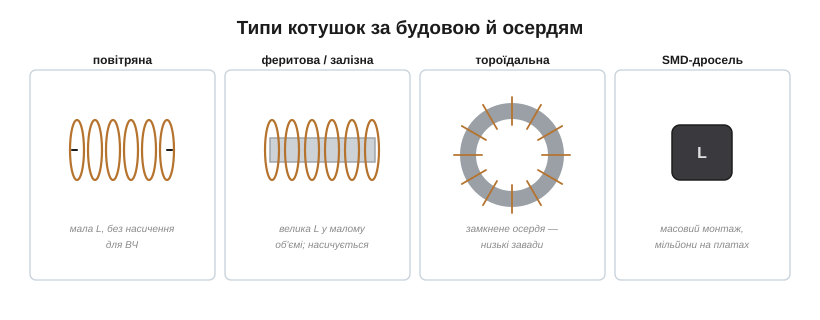
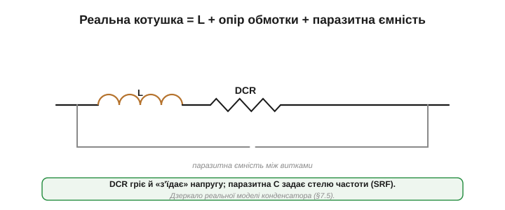
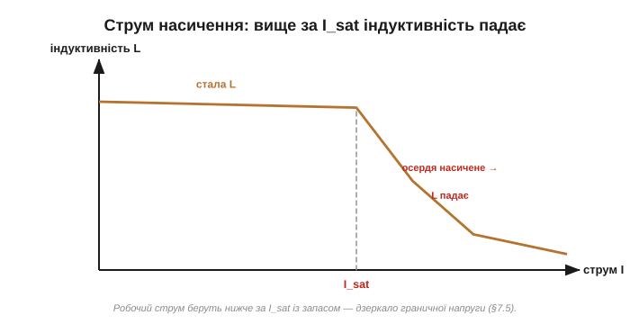
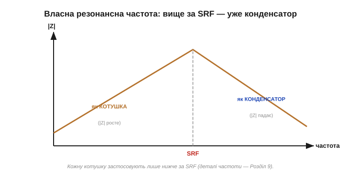
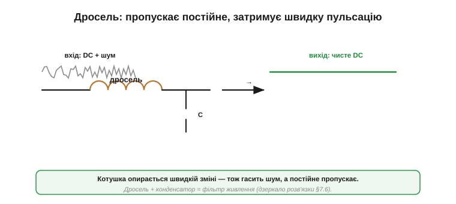
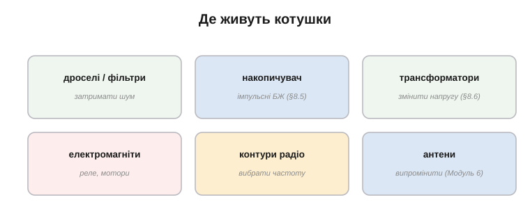
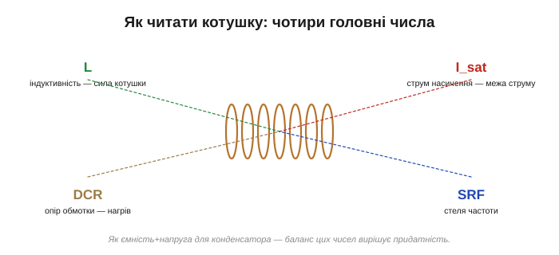

# Типи й застосування котушок

Фізика котушки — це одне, а котушка як **реальна деталь** — інше: які бувають котушки, які в них вади поза ідеалом і де їх шукати на платі. Тут котушка дзеркалить конденсатор: обрати чи впізнати її треба вміти не гірше, і подібно до того, як у конденсатора є [паразитні вади](topic:hw-components/capacitor-parasitics) й [застосування](topic:hw-components/capacitor-uses), у котушки є свої. Дзеркальність триває й глибше: де в конденсатора були ESR, гранична напруга й тип діелектрика, у котушки будуть опір обмотки, струм насичення й тип осердя.

### Типи за будовою й осердям

Котушки різняться передусім **осердям** — саме воно задає, скільки індуктивності вміститься в деталь і як вона поводиться: [осердя множить L](topic:ph-electromagnetism/inductor-coil), але насичується.

*Повітряна (без осердя) — мала L, зате стабільна й без насичення, для високих частот. Феритова/залізна — велика L у малому об'ємі, для живлення й фільтрів. Тороїдальна (кільце) — замкнене осердя майже не випромінює поле назовні, низькі завади. Дрібна SMD-котушка — масовий дросель для плат.*

Коротко про головні родини. **Повітряна** котушка (без осердя) має малу індуктивність, зате не насичується й не має втрат **в осерді** (його просто нема) — її стихія радіочастоти. (Зовсім без втрат вона, звісно, не буває: лишаються опір міді, скін- і проксиміті-ефекти на ВЧ, паразитна ємність і випромінювання поля назовні.) **Феритова** й **залізна** дають велику L у малому об'ємі — для живлення, фільтрів, дроселів. **Тороїдальна** (намотана на кільце) тримає майже все поле в замкненому осерді, тож майже не випромінює завад назовні й не ловить їх — улюблениця якісного живлення. А **SMD-дроселі** — крихітні котушки в корпусі для поверхневого монтажу — стоять мільйонами в кожному гаджеті.

Котушки бувають **екранованими** (осердя оточує обмотку й майже не випускає поле — менше завад сусідам) і **неекранованими** (дешевші, та «світять» полем навколо). Є й **підлаштовувані**: у них осердя можна вкручувати, змінюючи L, — так колись налаштовували радіоприймачі на станцію. Та найчастіше індуктивність фіксована, як номінал резистора, і просто написана на корпусі чи задана кодом. За технологією розрізняють **намотані** (дріт на каркасі — точні, потужні) і **пресовані/багатошарові** (металевий порошок з обмоткою всередині — дешеві, дрібні, для масового монтажу). Як і з конденсаторами, тип підказує, для чого деталь призначена.

### Реальна котушка: опір і паразитна ємність

Як і конденсатор, реальна котушка — це не чиста індуктивність. До неї додаються дві головні вади.

*Реальна котушка: ідеальна L, послідовно з нею — **опір обмотки** (DCR, бо дріт мідний і має опір), а паралельно — **паразитна ємність** між сусідніми витками. Дзеркало [реальної моделі конденсатора](topic:hw-components/capacitor-parasitics), лише вади інші.*

По-перше, обмотка з міді має **опір** (його звуть DCR — опір постійному струму). Він [гріється під струмом](topic:ph-electromagnetism/joule-heating) (I²R) і псує ідеальність котушки. По-друге, сусідні витки розділені тонким ізолятором — а отже, між ними є **паразитна ємність** (та сама ємність, що й [у конденсаторі](topic:hw-components/capacitor): два провідники з ізолятором). Зазвичай вона крихітна, та на високих частотах стає вирішальною.

> 🔧 **Навіщо це.** DCR — перше, на що дивляться в дроселі живлення: великий струм на ньому гріє котушку й «з'їдає» напругу. Тому силові дроселі мотають товстим дротом (малий DCR). А паразитна ємність між витками — причина, чому котушка на дуже високих частотах перестає бути котушкою.

Якість котушки часто описують одним числом — **добротністю** Q: грубо, це відношення «корисної» індуктивної дії до «шкідливих» втрат в опорі. Висока Q означає малі втрати — і це критично для радіочастотних **контурів**, де котушка має бути якомога «чистішою», щоб гостро виділяти частоту. Що таке [добротність](topic:hw-analog/quality-factor) строго — окрема розмова про реактивність і резонанс. Тут лише застереження: висока Q — добре **не завжди**. Для резонансних і ВЧ-кіл — так; а от для подавлення завад (феритові намистини, «втратні» дроселі) корисні якраз **втрати** — там деталь має заваду поглинати й гасити, тож низька Q буває саме тим, що треба.

### Струм насичення

Найважливіша межа котушки з осердям — **струм насичення** (*saturation current*, I_sat). [Осердя множить поле](topic:ph-electromagnetism/inductor-coil), лише поки його доменам ще є куди вишиковуватися. Коли струм надто великий, осердя **насичується** — і індуктивність **падає**. На практиці I_sat у даташиті означає не точку, де котушка зникає, а струм, за якого L просіла на задані кілька десятків відсотків (часто 20–30%) від номіналу.

*Доти, доки струм нижчий за I_sat, індуктивність майже стала. За насичення осердя L падає (за I_sat — на задані кілька десятків відсотків від номіналу), і котушка дедалі гірше опирається струму. Тому робочий струм завжди тримають нижче за I_sat із запасом.*

Насичений дросель — небезпека: він раптом перестає обмежувати струм, і той може злетіти до руйнівного. Тому в даташиті поряд з індуктивністю завжди стоїть **допустимий струм**: робочий струм беруть із запасом нижче за I_sat. Це пряме дзеркало [граничної напруги конденсатора](topic:hw-components/capacitor-parasitics): там не можна перевищувати напругу, тут — струм.

Насичення буває різким (осердя «обвалюється» раптово) і м'яким (L спадає поступово). М'якше поводяться осердя з навмисним **повітряним зазором**: вони тримають менше [індуктивності](topic:ph-electromagnetism/inductance), зате насичуються плавно й за більшого струму. Саме тому в дроселях імпульсних перетворювачів, де струм щомиті змінюється й має піки, осердя часто роблять із зазором — краще трохи менша L, ніж раптовий обвал під піком струму й аварія.

> 🔧 **Навіщо це.** Струм насичення — часта причина, чому імпульсний блок живлення «гріється й вимикається» під навантаженням: дросель насичується, втрачає індуктивність, струм злітає. Тому дросель беруть із запасом за струмом (як конденсатор — за напругою), і в каталозі дивляться саме на **I_sat**, а не лише на номінал L: котушка «10 µH 5 A» і «10 µH 0.5 A» — геть різні деталі під різні задачі.

### Власна резонансна частота

Через ту саму паразитну ємність котушка має ще одну межу — **власну резонансну частоту** (*self-resonant frequency*, SRF). На низьких частотах деталь поводиться як котушка; та що вища частота, то сильніше дається взнаки паразитна ємність між витками. На певній частоті (SRF) котушка й її власна ємність «зрівноважуються», а **вище** за неї деталь поводиться вже не як котушка, а як **конденсатор**.

*До SRF деталь — котушка (опирається зростанню частоти). На SRF власна ємність і індуктивність зрівноважуються. Вище — перемагає паразитна ємність, і «котушка» поводиться як конденсатор. Тому як **індуктивність** котушку застосовують нижче за її SRF.*

Чому саме так і що таке [резонанс](topic:hw-analog/lc-resonance) — це вже частотний, реактивний погляд на деталь; тут досить практичного висновку: **кожна котушка має «стелю» частоти**, вище за яку вона перестає бути котушкою. Якщо деталь потрібна саме як **індуктивність** (контури, дроселі), працюють із добрим запасом нижче за SRF, бо біля неї реактивність злітає й поводиться непередбачувано. (А от деякі завадопридушувальні деталі — ті самі феритові намистини — навмисне ставлять працювати *поблизу й вище* їхньої SRF, у втратній зоні, де вони вже не котушка, а поглинач ВЧ-енергії.) Дрібні високоіндуктивні котушки мають низьку SRF (багато витків — велика паразитна ємність між ними), тож для високих частот беруть малу L і малу паразитну ємність — часто повітряні котушки.

### Дросель: пропустити постійне, спинити змінне

Найпоширеніша роль котушки — **дросель** (*choke*). Сама [індуктивність](topic:ph-electromagnetism/inductance) котушки означає, що вона пропускає постійний струм, а зміні опирається. Тому дросель ставлять, щоб **пропустити корисний постійний (чи повільний) струм, а швидку пульсацію й шум — затримати**.

*Дросель послідовно з живленням: постійний струм іде вільно, а накладений на нього високочастотний шум котушка «гасить», бо опирається швидкій зміні. Окремий випадок — синфазний (common-mode) дросель: дві обмотки на спільному осерді душать спільну заваду в обох проводах, не заважаючи корисному сигналу.*

Це дзеркало [розв'язувального конденсатора](topic:hw-components/capacitor-uses): конденсатор відводить пульсацію в землю, а дросель — не пускає її далі по дроту. Часто їх ставлять разом: дросель + конденсатор утворюють фільтр, що чистить живлення набагато краще, ніж кожен окремо.

Найпростіший дросель — **феритова намистина** (*ferrite bead*): просто кільце фериту на дроті, тобто котушка з одного-двох витків. На постійному й повільному струмі вона майже невидима, а високочастотну заваду перетворює на тепло у фериті. Їх ставлять там, де треба прибрати ВЧ-шум, не чіпаючи корисний сигнал, — на лініях живлення, портах, шлейфах.

> 🔧 **Навіщо це.** Маленький дросель або феритове кільце на кабелі (те потовщення на USB- чи моніторному шнурі) — це **синфазний дросель** проти завад: він не заважає сигналу, але душить високочастотний шум, що наводиться на обидва проводи разом. Та сама фізика — котушка опирається швидкій зміні струму — рятує від перешкод у живленні, у радіо й у цифрових лініях.

### Де живуть котушки

Зведімо застосування. Котушка — деталь не така всюдисуща, як конденсатор, зате незамінна там, де треба запасати енергію в полі, опиратися зміні струму чи зв'язувати кола магнітно.

*Головні ролі: дроселі й фільтри живлення (затримати шум); накопичувач енергії в імпульсних перетворювачах; трансформатори; електромагніти — реле, соленоїди, мотори; налаштовані контури радіо й антени. Скрізь працює одна з трьох ідей: поле, опір зміні струму або взаємоіндукція.*

Приклад із життя: у блоці живлення ноутбука дросель накопичує енергію для імпульсного перетворювача; феритові намистини на USB-портах душать завади; у радіомодулі крихітні котушки утворюють контури, що виділяють потрібну частоту; а трансформатор (котушки на спільному осерді) відділяє електроніку від мережі. П'ять різних котушок в одному пристрої — і кожна служить одній із трьох наскрізних ідей: запасати енергію в полі, опиратися зміні струму чи зв'язувати кола магнітно.

> 🔧 **Навіщо це.** На відміну від конденсатора, котушку на платі впізнати легко: це або помітна намотка дроту, або «брусок»/кільце з ферита, часто більший і важчий за сусідів. Біля мікросхеми живлення майже завжди є дросель (накопичувач імпульсного перетворювача); на вході — феритові намистини проти завад; у радіочастинці — крихітні котушки контурів. Уміючи їх розпізнати, ви читаєте призначення вузла з першого погляду.

### Як читати котушку

Нарешті — на що дивитися, обираючи котушку. Як конденсатор описували ємністю й напругою, так котушку описують чотирма числами.

*Чотири головні параметри котушки: індуктивність **L** (скільки опору зміні струму), допустимий струм **I_sat** (вище — насичення), опір обмотки **DCR** (нагрів і просідання) і власна резонансна частота **SRF** (стеля робочої частоти). Разом вони кажуть, чи годиться котушка для задачі.*

Перші два — як ємність і напруга конденсатора: **L** каже, наскільки сильна котушка, а **I_sat** — скільки струму вона витримає, не насичуючись. **DCR** важливий у силових колах (нагрів), а **SRF** — у високочастотних (стеля частоти). Обрати котушку — це збалансувати ці чотири числа під задачу, точно так само, як [конденсатор](topic:hw-components/capacitor-uses) добирають, балансуючи ємність, напругу, ESR і тип.

**Приклад читання.** Запис «10 µH, 3 A, 25 mΩ, SRF 40 MHz» означає: індуктивність 10 мкГн; тримає до 3 А без насичення; опір обмотки 25 міліом (гріється мало); годиться приблизно до 40 МГц. Для дроселя живлення на 1 А це чудовий вибір; для кола на 100 МГц — ні (вище за SRF). Усе, що треба для рішення, — у цих чотирьох числах. Навчившись їх читати, котушку добирають так само впевнено, як [резистор](topic:hw-components/resistor) чи [конденсатор](topic:hw-components/capacitor). На реальній платі ці чотири числа набувають форми конкретної деталі: як улаштовані [силові дроселі — екрановані SMD-індуктивності](topic:hw-components/power-inductor), чому в їхньому даташиті стоять два різні граничні струми (і межею є менший) і як читати код «4R7» на корпусі — окрема практична розмова.

Окремої уваги варта [феритова намистина](topic:hw-components/ferrite-bead) — деталь, яку зручно описати «найпростішим дроселем», та це зручне перше наближення водночас і головне непорозуміння, через яке її ставлять не туди й не так. Насправді вона зроблена *навмисне поганою* котушкою: задум у ній — не зберігати енергію в полі, а перетворювати високочастотну заваду на тепло в самому магнітному матеріалі.

---
