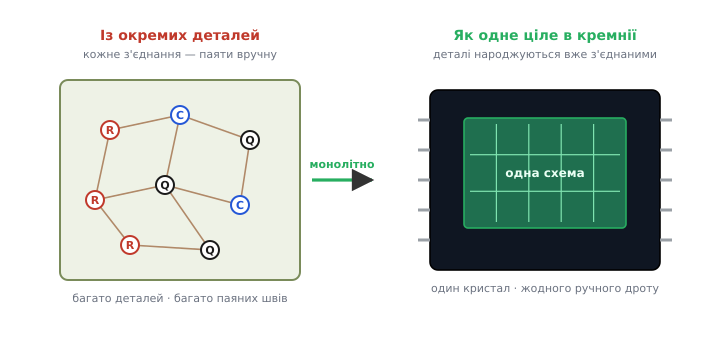
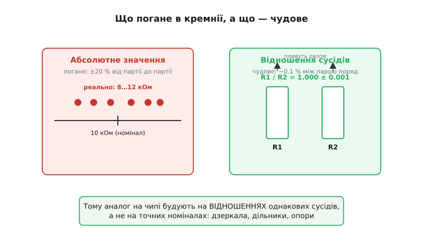
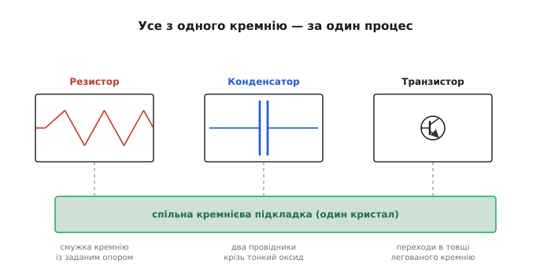
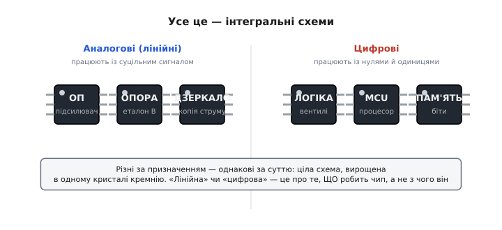

# Інтегральна схема

<preknowlist>
- [Транзистор](topic:hw-components/bjt) — керований напівпровідниковий прилад, головна активна деталь схеми.
- [Резистор](topic:hw-components/resistor) — деталь із заданим опором, що обмежує струм.
- [Конденсатор](topic:hw-components/capacitor) — деталь, що накопичує заряд між двома провідниками.
- [Кремній і монокристал](topic:hw-components/silicon-monocrystal) — напівпровідникова основа, у якій вирощують усю схему.
</preknowlist>

Намалюйте на папері навіть простенький підсилювач — і ви отримаєте десяток деталей: кілька транзисторів, жменю резисторів, пару конденсаторів, дроти між ними. Кожну з цих деталей треба десь узяти, поставити на місце й під'єднати до сусідів. А тепер уявіть схему не на десять деталей, а на десять **мільярдів** — стільки сидить усередині процесора вашого телефона. Зібрати таке з окремих деталей, припаюючи кожну ніжку поодинці, не зміг би ніхто й ніколи: не вистачило б ні рук, ні місця, ні надійності — бодай один холодний шов із мільярда, і пристрій мертвий.

Інтегральна схема (лат. *integer* — цілий; англ. *integrated circuit*, скорочено **IC** або **ІС**) — це відповідь на цю неможливість. Замість того щоб робити деталі **нарізно** й потім зшивати їх докупи, усю схему **вирощують як єдине ціле** в одному крихітному шматочку кремнію. Не набір деталей, а **один виріб**, у якому транзистори, резистори й конденсатори народжуються вже на своїх місцях і вже з'єднаними. Звідси й назва: схема **зінтегрована** — зведена в одне нероздільне ціле.


*Дві відповіді на одну задачу. Ліворуч схему складають із готових деталей, і кожне з'єднання між ними — окремий паяний шов, окреме місце, де щось може відірватися. Праворуч ту саму схему виготовляють монолітно: усі деталі ростуть в одному кристалі кремнію, з'єднання надруковані металом по його поверхні, жодного ручного дроту. Друге — і є інтегральна схема.*

## Чому «разом» — це геть інша річ, ніж «нарізно»

Здавалося б, дрібниця: ну зробили деталі поряд замість того, щоб купувати їх окремо. Але ця дрібниця змінює все одразу за трьома напрямами, і кожен сам по собі вартий цілої революції.

**Перший — масштаб і ціна.** Коли деталь — окремий предмет, ціна схеми зростає разом із кількістю деталей: тисяча транзисторів коштує приблизно в тисячу разів дорожче за один, та ще й тисячу разів треба щось поставити й припаяти. Коли ж уся схема — один виріб, ця залежність ламається. Виготовити кристал на мільйон транзисторів коштує приблизно стільки ж, скільки кристал на тисячу: той самий процес, ті самі кроки, просто рисунок дрібніший. Деталі майже перестають коштувати грошей — платиш за **кристал**, а не за кожен транзистор на ньому. Саме тому транзистор усередині чипа сьогодні коштує мільйонні частки копійки, і саме тому їх можна сипати мільярдами. Усередині дешевого мікроконтролера за долар більше транзисторів, ніж було в усіх комп'ютерах світу 1950-х: беручи готову мікросхему, ви купуєте не «деталі», а працю тисяч інженерів, спресовану в кристал за ціну чашки кави, — бо складність переїхала **всередину** чипа, де вона майже нічого не коштує. Ця залежність — як число деталей на кристалі росте з роками — настільки стала й передбачувана, що дістала окрему назву: [закон Мура](topic:hw-components/moore-law).

**Другий — надійність.** Кожне ручне з'єднання — слабке місце: шов утомлюється, кородує, тріскається від нагрівання. Інженери 1950-х уперлися саме в цю стіну й називали її «тиранією чисел»: що складніша схема, то більше з'єднань, то ймовірніше, що бодай одне підведе. Монолітна схема прибирає цю проблему під корінь — з'єднання всередині неї не паяні, а **надруковані** металом по поверхні кристала за той самий процес, що родить і самі деталі. Немає окремої операції «з'єднати» — немає й тисяч місць, де вона могла б відмовити. Як саме людство дійшло до цієї думки наприкінці 1950-х, хто й коли зробив перший працюючий зразок, і чому за авторство потім судилися роками — це окрема й повчальна історія [винайдення інтегральної схеми](topic:hw-components/ic-invention); тут нам важливо лише те, **що** інтеграція дає.

**Третій напрям — найтонший і найважливіший для аналогової електроніки**, тож на ньому спинимося окремо.

## Найцінніше: сусіди-близнюки

Є властивість монолітної схеми, яку зовні не видно, але яка тримає на собі майже всю аналогову техніку. Коли два транзистори (чи два резистори) вирощено **поряд на одному кристалі**, тим самим процесом, в один і той самий момент — вони виходять майже **тотожними близнюками**. Не «схожими», а саме близнюками: ту саму домішку в них вганяли тим самим струменем, той самий шар нарощували в тій самій печі, той самий рисунок проявляли тим самим світлом. Усе, що могло піти трохи не так, пішло не так **однаково** для обох.

Чому це безцінно — стане зрозуміло, щойно ми розрізнимо дві геть різні точності.

**Абсолютне значення на чипі — погане.** Резистор, вирощений у кремнії, має жахливий допуск свого номіналу: замовили 10 кОм — реально вийде десь від 8 до 12, тобто розкид близько ±20 % від партії до партії. Причина проста: товщина шару, концентрація домішки, температура процесу від запуску до запуску трохи плавають, і разом вони сильно зміщують **саме значення**. Якби аналогову схему треба було будувати на точних номіналах, кремній був би безнадійний.

**Відношення сусідів — чудове.** А тепер головне. Візьмемо **два** резистори поряд. Кожен окремо «гуляє» на ±20 %, але гуляють вони **разом, в один бік**: товстіший шар робить товстішими обидва, гарячіша піч зміщує обидва однаково. Тому хоч самі значення й непевні, їхнє **відношення** R1/R2 тримається з точністю до десятих часток відсотка — у двісті разів точніше за кожне значення окремо. Сусіди-близнюки не знають своїх абсолютних значень, але точно знають, що вони **рівні одне одному**.


*Дві дуже різні точності в одному кристалі. Саме значення деталі непевне — від партії до партії розкид у відсотки. Але два однакові сусіди, вирощені поряд, пливуть разом, тож їхнє відношення майже ідеальне. Уся аналогова схемотехніка на кремнії побудована на правому стовпчику, а не на лівому: точними роблять не номінали, а пропорції.*

Звідси випливає весь стиль аналогового проєктування на кристалі: схему будують так, щоб результат залежав **від відношень однакових сусідів, а не від точних номіналів**. Підсилення задають відношенням двох резисторів. Струм копіюють парою однакових транзисторів — це [дзеркало струмів](topic:hw-analog/current-mirror), де весь фокус саме в тому, що два транзистори поряд мають тотожну криву. Синфазну заваду відкидають [диференційною парою](topic:hw-analog/opamp-input-stage) — двома близнюками, чия точна симетрія й робить усю роботу. [Опорну напругу](topic:hw-sensing/voltage-reference) будують на різниці двох переходів, що пливуть разом. Жоден із цих прийомів не працював би на розсипі окремих деталей із крамниці: там сусіди надто різні, розсипом ви ніколи не дістанете двох однакових транзисторів — а на кристалі вони виходять близнюками самі собою. Саме тому точну аналогову схему — прецизійний підсилювач, джерело опорної напруги, [АЦП](topic:hw-analog/adc) — майже завжди роблять інтегральною, а не паяють із деталей: коли в даташиті бачите «зсув нуля 50 мкВ» чи «нелінійність 0.01 %», це не магія добрих деталей, а геометрія однакових сусідів на одному кремнії. Чому саме розкид значень великий, а розкид відношень малий, і як він спадає з площею деталі — розписано в окремому розборі [математики узгодження сусідів](topic:hw-components/integrated-circuit/math-matching.md).

**Worked-приклад: дільник на відношенні, а не на номіналі.** Хочемо точно поділити напругу навпіл усередині чипа. Беремо два **однакові** резистори поряд — байдуже, що кожен «гуляє» на ±20 %:

```formula
U_out = U_in · R2 / (R1 + R2)
R1 = R2 = R   →   U_out = U_in · R / (2R) = U_in / 2
```

Самі R скоротилися — їхнє абсолютне значення випало з формули цілком. Лишилося відношення двох близнюків, а воно точне. У коді ця думка виглядає так: точність дільника визначає **не** допуск номіналу, а допуск **узгодження** пари:

:::tabs
```cpp
// Похибка інтегрального дільника визначається узгодженням сусідів,
// а не допуском самого номіналу. Числа — типові для кремнію.
constexpr float divider_error_abs   = 0.20f;   // ±20 %: розкид самого значення R — НЕ важить
constexpr float divider_error_match = 0.001f;  // ±0.1 %: розкид відношення R1/R2 — ОСЬ що важить
// саме divider_error_match визначає, наскільки точно вийде U_in/2
```
```c
// Похибка інтегрального дільника визначається узгодженням сусідів,
// а не допуском самого номіналу. Числа — типові для кремнію.
float divider_error_abs = 0.20f;   // ±20 %: розкид самого значення R — НЕ важить
float divider_error_match = 0.001f; // ±0.1 %: розкид відношення R1/R2 — ОСЬ що важить
// саме divider_error_match визначає, наскільки точно вийде U_in/2
```
:::

## Що насправді лежить усередині

Як в одному шматочку кремнію вживаються такі різні речі — і транзистори, і резистори, і конденсатори? Відповідь напрочуд елегантна: **усі вони зроблені з того самого матеріалу тими самими шарами**. Кремнію надають потрібних властивостей, додаючи в нього домішки (це зветься [легуванням](topic:hw-components/doping-etching-metal)): де треба — роблять провідну ділянку, де треба — ділянку з опором, де треба — зустріч двох по-різному легованих шарів, тобто перехід.

З цього словника й складають усі деталі. **Резистор** — це просто вузька смужка слабко легованого кремнію: чим вона довша й тонша, тим більший опір. **Конденсатор** — два провідні шари, розділені тонким прошарком оксиду-діелектрика. **Транзистор** — кілька переходів у товщі по-різному легованого кремнію, і саме він — головний мешканець чипа, бо робити транзистори в кремнії процес уміє найкраще. Усе це народжується **одночасно**, шар за шаром, по всій пластині відразу — як друкований візерунок, а не як набір окремо виточених предметів. Рисунок кожного шару переносять на кремній світлом крізь маску — цей крок зветься [фотолітографією](topic:hw-components/photolithography), і саме його роздільність визначає, наскільки дрібними можуть бути деталі.


*Звідки в одному кристалі стільки різних деталей. Усі вони — варіації одного: по-різному легованого кремнію та шарів оксиду й металу на ньому. Резистор — смужка з опором, конденсатор — два провідники крізь тонкий оксид, транзистор — переходи в товщі. Жодну деталь не «вставляли» — усі виросли разом, за один процес.*

Тут є важлива несиметрія, яку корисно знати наперед. Транзистори кремній родить чудово й майже задарма — вони дрібні й їх може бути скільки завгодно. А от **великі резистори й конденсатори на чипі дорогі**: вони займають багато площі кристала, а площа — це гроші. Тому інтегральна схемотехніка не схожа на схемотехніку з деталей: на платі резистор дешевий, а транзистор дорогий, у кремнії — навпаки. Звідси й хитрощі на кшталт [дзеркала струмів](topic:hw-analog/current-mirror) чи [джерела Відлара](topic:hw-analog/current-mirror/comp-mirror-variants.md): вони дають потрібний малий струм без велетенського резистора, замінивши площу на ще пару дешевих транзисторів.

## Аналогові й цифрові — однакові за суттю

«Інтегральна схема» — це не один тип пристрою, а ціле сімейство, і всередині воно ділиться на дві великі родини за тим, **із чим** працює чип.

**Аналогові (їх ще звуть лінійними) ІС** мають справу із суцільним сигналом — напругою чи струмом, що плавно змінюється й несе величину: гучність звуку, яскравість світла, температуру з давача. Сюди належать [операційні підсилювачі](topic:hw-analog/opamp), джерела опорної напруги, регулятори живлення, давачі. Назва «лінійна» — звідти, що такий чип зазвичай **перетворює** сигнал, зберігаючи його форму, а не зводить його до двох рівнів.

**Цифрові ІС** працюють лише з двома станами — нулем і одиницею, низьким і високим рівнем. Сюди — логічні вентилі, [регістри](topic:hw-digital/register) й пам'ять, мікропроцесори й мікроконтролери. Більшість сучасних цифрових чипів збудовано на [КМОН-технології](topic:hw-digital/cmos) (комплементарні польові транзистори), бо вона майже не споживає струму в спокої.


*Усе це — інтегральні схеми, хоч і роблять геть різне. Поділ на «аналогові» й «цифрові» — про те, ЩО чип робить із сигналом, а не про те, з чого він зроблений: усередині кожного — ціла схема, вирощена в одному кристалі кремнію за тим самим принципом монолітної інтеграції.*

Межа між родинами не глуха. Найцікавіші чипи — **змішані** (англ. *mixed-signal*): на одному кристалі живе й аналогова частина, і цифрова. Саме такий [АЦП](topic:hw-analog/adc), що знімає плавний сигнал із давача й віддає процесорові число, чи [ЦАП](topic:hw-analog/dac), що робить навпаки. А коли на одному кристалі вмістили вже **цілу систему** — процесор, пам'ять, аналогову обв'язку, радіо — це зветься системою-на-кристалі (англ. *system-on-chip*, SoC), і саме так влаштований мозок майже будь-якого сучасного пристрою.

## Чого з вулиці не видно

Той кристал кремнію, про який ми весь час говоримо, насправді крихітний і голий — самотужки з ним нічого не зробиш: він тонший за нігтик, його легко зламати, а виводи на ньому — мікроскопічні майданчики, до яких пальцем не дотягнешся. Тому майже завжди кристал ховають у **корпус** (англ. *package*) — той чорний пластиковий чи керамічний прямокутник із металевими ніжками, який ми й звикли називати «мікросхемою». Усередині корпусу кристал приклеєний на підкладку, а від його мікроскопічних майданчиків до зовнішніх ніжок тягнуться тонюсінькі золоті чи алюмінієві дротики. Корпус робить дві речі: захищає крихкий кремній від світу й **збільшує** виводи з мікронних до таких, що їх можна припаяти рукою чи машиною.

Тож коли ви тримаєте мікросхему, ви тримаєте корпус, а справжня схема — десь усередині, разів у сто менша за нього. Усе, що чип уміє і чого від нього чекати — напруги живлення, призначення кожної ніжки, гранично допустимі режими, — виробник описує в його **даташиті** (англ. *datasheet*, паспорт деталі); це головний документ, з якого починають роботу з будь-якою ІС. І хоч у роботі ви маєте справу з ніжками, а не з кристалом, монолітне нутро дається взнаки: ніжки не можна плутати, бо кожна веде до конкретного місця кристала; струм і напруга мають межу, бо тонкі внутрішні доріжки й переходи не безмежні; а два однакові з вигляду чипи ніколи не тотожні до кінця — кожен кристал несе свій крихітний розкид сусідів.
