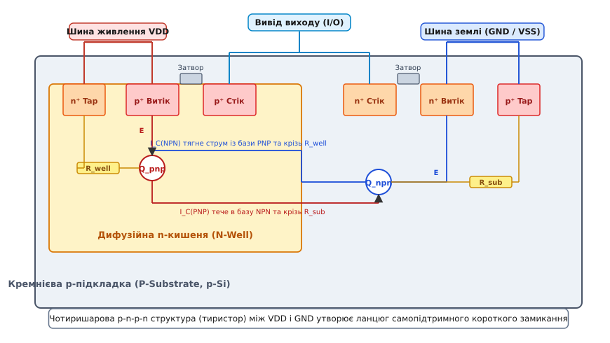
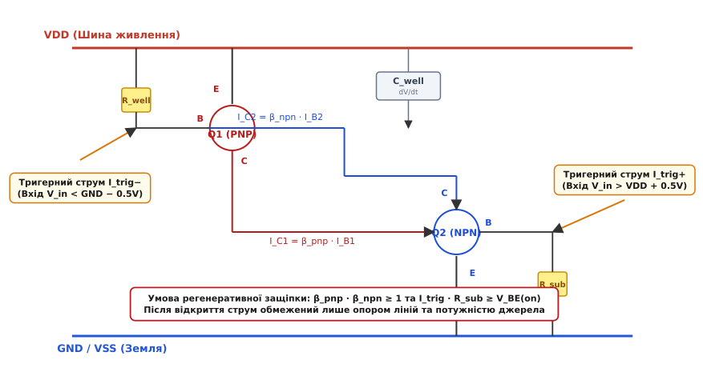
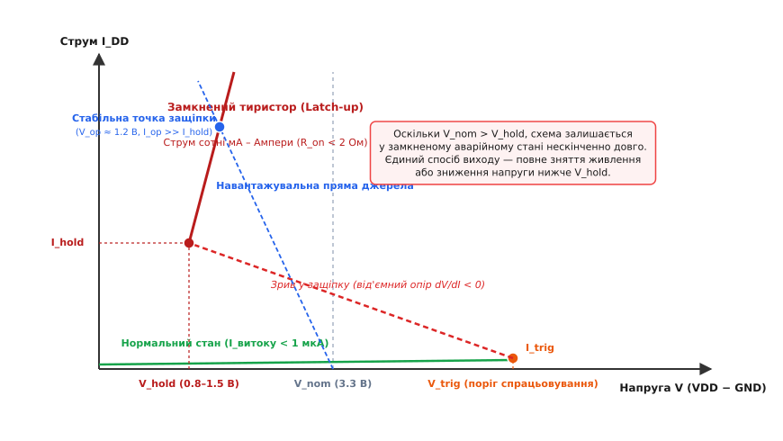

# Latch-up у CMOS: фізика паразитного тиристора, критерії защіпання та інженерні методи захисту

<preknowlist>
- [CMOS-логіка](topic:hw-digital/cmos) — будова комплементарного інвертора, принципи роботи NMOS та PMOS транзисторів.
- [Будова MOSFET](topic:hw-components/mosfet-structure) — витік, стік, затвор, кишеня та p-n переходи між областями легування й підкладкою.
- [Діоди TVS та ESD-захист](topic:hw-components/esd-protection) — захисні діоди на входах-виходах та струми інжекції носіїв при електростатичних розрядах.
- [Послідовність подачі живлення](topic:hw-power/power-sequencing) — різночасове підняття напруг на багаторейкових платах та небезпека подачі сигналів на незаживлені мікросхеми.
- [Абсолютні максимальні параметри](topic:hw-components/abs-max-ratings) — допустимі межі напруг на виводах відносно шин живлення.
</preknowlist>

Мікроконтролер промислового контролера з номінальним струмом споживання у стані спокою 15 мікроампер отримує короткий індуктивний сплеск напруги амплітудою 4.2 вольта тривалістю всього 12 наносекунд на лінію дискретного вводу-виводу при номінальній напрузі живлення 3.3 вольта. Зовнішня перенапруга миттєво зникає, проте струм споживання мікросхеми від шини живлення не повертається до мікроамперного рівня, а лавиноподібно підскакує до 520 міліампер. Напруга на шині живлення просідає через внутрішній опір джерела до 1.3 вольта, температура корпусу за 200 мілісекунд перевищує +160 °C, і якщо живлення не буде фізично розірвано за лічені частки секунди, кристал безповоротно вигорає від локального термічного руйнування металізації та кремнієвих переходів.

Ця катастрофічна відмова є наслідком явища **защіпання** (англ. *latch-up* — «замикання на засув») — паразитного переходу чотиришарової напівпровідникової структури кристала у високопровідний стан керованого кремнієвого випрямляча (тиристора, SCR).

## 1. Анатомія прихованого паразита: як геометрія CMOS утворює структуру p-n-p-n

Будь-яка комплементарна КМОН-пара (CMOS) складається з n-канального (NMOS) та p-канального (PMOS) польових транзисторів, розташованих на єдиній монокристалічній кремнієвій пластині на мінімальній відстані один від одного.


*Фізичний зріз КМОН-інвертора: витокові та стокові дифузійні області разом із кишенею та підкладкою утворюють чотиришарову p-n-p-n структуру, еквівалентну парі зв'язаних біполярних транзисторів PNP та NPN.*

У класичному планарному процесі з p-підкладкою (P-Substrate) n-канальний транзистор формується безпосередньо в тілі підкладки: його витік і стік є сильнолегованими областями `n⁺` із концентрацією домішки до 10²⁰ см⁻³. Для розміщення p-канального транзистора в підкладку за допомогою високотемпературної дифузії або іонної імплантації впроваджується локальна область протилежного типу провідності — **n-кишеня** (N-Well) помірного легування (10¹⁶–10¹⁷ см⁻³), усередині якої створюються витік і стік `p⁺`.

Якщо простежити просторове чергування напівпровідникових шарів від витоку PMOS-транзистора крізь n-кишеню та p-підкладку до витоку NMOS-транзистора, виникає безперервний чотиришаровий ланцюг:

```text
витік PMOS (p⁺)  →  n-кишеня (N-Well)  →  p-підкладка (P-Substrate)  →  витік NMOS (n⁺)
    шар 1 (p)            шар 2 (n)                 шар 3 (p)               шар 4 (n)
```

Ця просторова комбінація з чотирьох шарів почергової провідності `p-n-p-n` формує класичну структуру кремнієвого керованого вентиля (тиристора, англ. *SCR — Silicon Controlled Rectifier*).

Цю чотиришарову систему можна однозначно розділити на два тісно взаємодіючі паразитні біполярні транзистори:

1. **Вертикальний транзистор PNP (`Q1`):**
   - **Емітер:** сильнолегована область `p⁺` витоку PMOS, підключена металізацією до шини живлення VDD.
   - **База:** область n-кишені (N-Well), глибина якої визначає ширину базової області.
   - **Колектор:** навколишня об'ємна p-підкладка (P-Substrate).

2. **Латеральний транзистор NPN (`Q2`):**
   - **Емітер:** сильнолегована область `n⁺` витоку NMOS, підключена металізацією до шини землі GND.
   - **База:** масив p-підкладки між краєм n-кишені та дифузією NMOS.
   - **Колектор:** область n-кишені (N-Well).

Найнебезпечніша геометрична особливість полягає в топологічному перекритті областей: **n-кишеня одночасно слугує базою для транзистора PNP і колектором для транзистора NPN**. Симетрично **p-підкладка є колектором для PNP і базою для NPN**. Колекторний струм кожного з транзисторів безпосередньо вливається в базу іншого, утворюючи фізичний канал перехресного зв'язку.

Ширина бази латерального NPN-транзистора визначається літографічною відстанню між дифузією NMOS та межею n-кишені за вирахуванням ширини збіднених шарів. Ширина бази вертикального PNP-транзистора визначається глибиною залягання дна кишені відносно дифузії `p⁺` витоку. Оскільки вертикальні розміри в сучасних мікроелектронних процесах складають десяті частки мікрометра, вертикальний PNP-транзистор має відносно високий коефіцієнт підсилення струму бази (`β_pnp ≈ 0.5–5.0`), що робить структуру вкрай чутливою до струмових збурень.

У субмікронних процесах та FinFET-топологіях фізичні відстані між кишенями скорочуються до десятків нанометрів. Хоча тривимірна геометрія плавників FinFET зменшує площу контакту активних областей із підкладкою, висока щільність струму та сильні локальні електричні поля створюють додаткові ризики генерації гарячих носіїв, здатних викликати лавинні процеси в глибині кремнію.

## 2. Схемотехнічний позитивний зворотний зв'язок і критерій самопідтримки

У нормальному робочому стані мікросхеми цей прихований тиристор знаходиться у глибокому відсіканні. Шина VDD має максимальний додатний потенціал, n-кишеня підтягнута до VDD через омічні контакти `n⁺` (VDD Tap), а p-підкладка притиснута до землі GND через контакти `p⁺` (Substrate Tap). Центральний перехід між n-кишенею та p-підкладкою зміщений у зворотному напрямку, а струм витоку крізь нього не перевищує часток пікоампера.


*Схемотехнічна модель тиристорного ефекту: паразитні транзистори Q1 (PNP) та Q2 (NPN) охоплені перехресним додатним зворотним зв'язком і шунтовані опорами R_well та R_sub.*

Електрична взаємодія між транзисторами визначається наявністю розподілених об'ємних опорів напівпровідникового матеріалу:
- `R_well` — розподілений опір тіла n-кишені між емітерно-базовим переходом PMOS та найближчим металізованим контактом VDD;
- `R_sub` — розподілений опір об'єму p-підкладки між емітерно-базовим переходом NMOS та контактом заземлення GND.

Опори `R_well` та `R_sub` увімкнені паралельно емітерно-базовим переходам відповідних біполярних транзисторів, відводячи незначні струми витоку на шини живлення без відкриття переходів.

### Механізм регенеративної лавини

Якщо в підкладку або кишеню потрапляє сторонній імпульсний струм завади `I_trig`, розвивається незворотний динамічний процес:

```text
послідовність лавинного замикання:
  1. Струм інжекції I_trig протікає крізь опір підкладки R_sub на землю GND.
  2. На опорі виникає падіння напруги: V_BE(NPN) = I_trig · R_sub.
  3. Коли напруга досягає порогу відмикання кремнієвого p-n переходу (V_BE ≥ 0.65 В), транзистор Q2 (NPN) відкривається.
  4. Колекторний струм NPN транзистора (I_C2 = β_npn · I_B2) починає витікати з n-кишені.
  5. Цей струм протікає крізь опір кишені R_well, створюючи спад напруги: V_EB(PNP) = I_C2 · R_well.
  6. Щойно V_EB досягає 0.65 В, відкривається транзистор Q1 (PNP).
  7. Колекторний струм PNP транзистора (I_C1 = β_pnp · I_B1) вливається безпосередньо в базу NPN транзистора Q2.
  8. Додатковий базовий струм ще сильніше відкриває Q2, що збільшує колекторний струм I_C2, який ще сильніше відкриває Q1.
```

Цей процес є класичним замкненим **додатним зворотним зв'язком** (англ. *regenerative positive feedback*). Час наростання лавини надзвичайно малий і складає від 0.5 до 2 наносекунд. Щойно петльове підсилення перевищує одиницю, лавина стає абсолютно некерованою.

Строгий математичний критерій самопідтримуваної защіпки виражається через добуток статичних коефіцієнтів підсилення струму бази `β` обох транзисторів:

```text
β_pnp · β_npn ≥ 1
```

або у термінах коефіцієнтів передачі струму емітера `α`:

```text
α_pnp + α_npn ≥ 1
```

Повний математичний вивід петльового підсилення, рівнянь Кірхгофа для вузлів бази та точного розрахунку струмів шунтування наведено в документі [🧮 Математичний критерій защіпання](topic:hw-components/latch-up/math-latchup-criterion.md). Історичний нарис про те, як ця фундаментальна вразливість мало не знищила технологію КМОН у 1970-х роках і як її вперше діагностували в лабораторіях Sandia, викладено у статті [📜 Історія відкриття та приборкання засувки у КМОН](topic:hw-power/power-sequencing/hist-latchup.md).

### Вольт-амперна характеристика та стан утримання


*Вольт-амперна характеристика латчапу (Snapback): після досягнення напруги спрацьовування структура переходить крізь область від'ємного диференційного опору в низькоомний стан з напругою утримання V_hold.*

Після спрацьовування защіпки вольт-амперна характеристика між виводами VDD та GND демонструє S-подібний вигляд із ділянкою **від'ємного диференційного опору** (англ. *negative differential resistance / snapback*):

- **Напруга утримання (`V_hold`):** мінімальна різниця потенціалів між VDD та GND, необхідна для збереження відкритого стану обох біполярних транзисторів у глибокому насиченні. Для кремнію вона становить:

```text
V_hold = V_CE(sat, NPN) + V_EB(on, PNP) ≈ 0.8 … 1.5 В
```

- **Струм утримання (`I_hold`):** мінімальний наскрізний струм, нижче якого петльове підсилення падає нижче одиниці, і тиристор самовільно розмикається (типово від 10 до 100 мА залежно від площі структури).

Якщо напруга живлення схеми `V_DD` перевищує `V_hold` (що завжди справджується для ліній живлення 1.8 В, 2.5 В, 3.3 В та 5.0 В), схема потрапляє у стабільну рівноважну точку з аномально високим струмом і залишається в ній **нескінченно довго**, навіть якщо зовнішній пусковий імпульс давно припинився.

## 3. Спускові гачки Latch-up: електричні, динамічні та радіаційні тригери

Щоб паразитний тиристор перейшов із закритого стану у провідний, у кристалі має виникнути початковий імпульс струму, здатний створити падіння напруги не менше 0.65 В на опорах `R_sub` або `R_well`.

В реальних умовах експлуатації діють чотири основні класи спускових тригерів:

```text
клас тригера         фізична природа впливу                    типове джерело збурення
Вхідна перенапруга   інжекція носіїв крізь ESD-діоди           зворотний ЕРС індуктивностей, гаряче підключення
Швидкісне dV/dt      ємнісний струм перезаряду кишені          дзвін шини живлення, імпульсні перетворювачі
ESD / Лавина         ударна іонізація зворотно зміщеного p-n   статичний розряд від тіла людини (HBM/CDM)
Радіаційний SEL      трек вільних пар носіїв від іона          важкі космічні іони, нейтрони високих енергій
```

### Тригер 1: Перенапруги та від'ємні викиди на виводах вводу-виводу (I/O Injection)

Найпоширеніша причина защіпання в промисловій та автомобільній електроніці — інжекція неосновних носіїв заряду через захисні діоди виводів GPIO.

1. **Позитивна перенапруга (`V_in > V_DD + 0.5 В`):**
   - На вході мікросхеми відкривається внутрішній верхній захисний діод ESD, сформований переходом `p⁺` дифузії входу до n-кишені, підключеної до VDD.
   - Діод впорскує масивний потік дірок у n-кишеню.
   - Ці дірки діють як емітерний струм біполярного транзистора, дифундують крізь n-кишеню і збираються p-підкладкою.
   - Струм дірок тече крізь підкладку до заземленого контакту, створюючи падіння напруги `I_hole · R_sub ≥ 0.65 В`, що миттєво відкриває латеральний NPN-транзистор.

2. **Від'ємний викид напруги (`V_in < GND - 0.5 В`):**
   - Відкривається нижній захисний діод між p-підкладкою (GND) та `n⁺` дифузією виводу.
   - У p-підкладку інжектуються електрони (неосновні носії).
   - Електрони рухаються крізь підкладку до зворотно зміщеної n-кишені, втягуються її електричним полем і створюють колекторний струм у кишені.
   - Протікаючи крізь опір `R_well` до шини VDD, струм електронів створює падіння `I_electron · R_well ≥ 0.65 В`, відмикаючи вертикальний PNP-транзистор.

### Тригер 2: Швидкі перехідні процеси на шині живлення (`dV/dt`)

Latch-up може виникнути навіть за повної відсутності сигналів на виводах вводу-виводу — виключно через високу швидкість наростання напруги живлення під час гарячого підключення або комутації навантажень.

Бар'єрна ємність зворотно зміщеного переходу між n-кишенею та p-підкладкою становить `C_well`. При різкому стрибку напруги живлення зі швидкістю `dV_DD / dt` крізь бар'єрну ємність протікає струм зміщення:

```text
I_disp = C_well · (dV_DD / dt)
```

Цей ємнісний струм витікає з n-кишені і тече крізь опір підкладки `R_sub` на землю. Якщо крутизна фронту живлення перевищує критичне значення:

```text
(dV_DD / dt)_crit ≥ V_BE(on) / (C_well · R_sub)
```

напруга на базі NPN перевищує 0.65 В, і кристал самозамикається в момент увімкнення живлення. Для сучасних техпроцесів критична швидкість становить від 0.5 до 5 В/нс. У системах гарячої заміни без контролерів плавного пуску (Hot-Swap) швидкість наростання напруги на виводах може сягати 20–50 В/нс, що практично гарантовано запускає защіпання незахищених мікросхем.

### Тригер 3: Електростатичні розряди (ESD) та лавинний пробій

При впливі електростатичного імпульсу напруга на переході n-кишеня — p-підкладка може перевищити напругу лавинного пробою (`V_BR ≈ 15–30 В`). Виникає ударна іонізація кремнію: первинні носії високої енергії вибивають вторинні електронно-діркові пари, генеруючи лавинний струм амплітудою в сотні міліампер. Цей струм безпосередньо зміщує обидва паразитні емітерні переходи у прямому напрямку, переводячи тиристор у провідний стан за частки наносекунди.

### Тригер 4: Іонізуюче випромінювання та космічні частинки (Single Event Latchup — SEL)

В умовах космічного простору, ядерних установок та високогірної авіації мікросхеми зазнають бомбардування важкими зарядженими частинками (іонами заліза, кремнію, протонами високих енергій).

Коли важкий іон прошиває кристал КМОН, він втрачає енергію за рахунок лінійних втрат енергії (LET, англ. *Linear Energy Transfer*). Уздовж треку іона діаметром кілька нанометрів утворюється плазмовий шнур із високою щільністю вільних електронно-діркових пар (від 10¹⁸ до 10²⁰ см⁻³). Якщо згенерований іоном електричний заряд перевищує критичний поріг структури:

```text
Q_ion > Q_crit
```

просторові заряди збіднених шарів миттєво екрануються, потенціал кишені та підкладки вирівнюється, і тиристор замикається. Це явище має назву **радіаційна засувка від одиночної події** (англ. *Single Event Latchup — SEL*). На відміну від логічних збоїв (SEU), які скидаються перезавантаженням, SEL без спеціального захисту знищує супутникову апаратуру за лічені мілісекунди.

Критична чутливість мікросхеми до радіаційного защіпання характеризується пороговою лінійною передачею енергії `LET_th` (вимірюється в МеВ·см²/мг). Для цивільних мікросхем `LET_th` становить від 1 до 5 МеВ·см²/мг, що робить їх повністю непридатними для космосу. Радіаційно-стійкі прилади спеціально проєктуються так, щоб їхній поріг перевищував `LET_th > 75–100 МеВ·см²/мг`, що унеможливлює SEL навіть при попаданні релятивістських іонів заліза.

## 4. Механіка теплової загибелі кристала: від надструмів до випаровування металізації

Коли тиристор переходить у відкритий стан, його динамічний внутрішній опір падає до одиниць або часток ома (`R_on ≈ 0.5–2.0 Ом`).

Струм, що протікає крізь замкнений канал між шинами VDD та GND, обмежується виключно внутрішнім опором зовнішнього джерела живлення та тонких провідників металізації на кристалі:

```text
I_latched = (V_DD - V_hold) / (R_source + R_trace + R_on)
```

При `V_DD = 3.3 В`, `V_hold = 1.1 В` та сумарному послідовному опорі 3 Ом струм становить:

```text
I_latched = (3.3 - 1.1) / 3.0 ≈ 0.73 А = 730 мА
```

Увесь цей струм протікає крізь мікроскопічний об'єм кремнію площею всього кілька квадратних мікрометрів. Миттєва густина потужності у зоні защіпання досягає катастрофічних величин:

```text
P_local = V_hold · I_latched = 1.1 В · 0.73 А ≈ 0.80 Вт
```

Розсіювання 0.8 Вт у мікроскопічній ділянці об'ємом 10⁻⁸ см³ генерує тепловий потік понад 10⁷ Вт/см².

### Ланцюг фізичних руйнувань кристала

1. **Термічний розгін кремнію (Thermal Runaway):**
   При локальному нагріванні вище +200 °C концентрація власноруч генерованих теплових носіїв заряду `n_i(T)` у кремнії перевищує концентрацію легуючих домішок. Напівпровідник втрачає p-n переходні властивості й перетворюється на квазіметалевий провідник, опір падає ще сильніше, що викликає подальше зростання струму.

2. **Електродифузія та вигорання металізації:**
   Густина струму в найближчих алюмінієвих або мідних доріжках шарів Metal 1 / Metal 2 перевищує 10⁷ А/см². Відбувається катастрофічна електромеграція: потік електронів буквально здуває атоми металу, формуючи мікропорожнечі, які перетворюються на електричну дугу, що випаровує метал і пропалює захисний діелектрик пасивації.

3. **Спікання контактів і проколювання переходів (Contact Spiking):**
   При температурі понад +450 °C алюміній металізації утворює евтектичний розплав із кремнієм підкладки. Металеві вістря проплавляють дифузійні шари глибиною 0.2–0.5 мкм, утворюючи незворотне монолітне коротке замикання між виводами живлення.

### Методи фізичної діагностики та локалізації відмов (Failure Analysis)

Для точної локалізації місця виникнення защіпання інженери з аналізу надійності застосовують комплекс прецизійних оптичних та електронних методів:
- **Емісійна мікроскопія (EMMI / PHEMOS):** відкритий тиристор у стані глибокого насичення випромінює фотони в ближньому інфрачервоному діапазоні (довжина хвилі 900–1600 нм) внаслідок випромінювальної рекомбінації гарячих носіїв заряду. Високочутлива охолоджувана InGaAs-камера фіксує яскраву світлову пляму точно над зоною латчапу.
- **Оптично індукована зміна опору (OBIRCH / TIVA):** сканування поверхні інфрачервоним лазером викликає локальне нагрівання провідних доріжок. Зміна загального струму споживання схеми дозволяє виявити закорочені або перегріті ділянки з субмікронною точністю.
- **Поперечний зріз за допомогою сфокусованого іонного пучка (FIB/SEM):** прецизійне травлення іонами галію розкриває пошарову структуру дефектної комірки, показуючи оплавлені металеві перемички та дифузійні проколи.

## 5. Конструктивні та топологічні методи захисту (Design and Layout Mitigation)

Боротьба із защіпанням у кремнії будується на двох фундаментальних інженерних принципах:
1. **Знизити коефіцієнти підсилення біполярників**, щоб гарантувати виконання нерівності `β_pnp · β_npn << 1`.
2. **Максимально зменшити шунтувальні опори `R_well` та `R_sub`**, щоб струми будь-яких експлуатаційних перешкод не створювали напруги відмикання емітерних переходів (`V_BE < 0.4 В`).

### Охоронні кільця (Guard Rings)

Охоронне кільце — це суцільна високолегована смуга кремнію з неперервним рядом металізованих контактів, яка повністю оточує вразливу транзисторну групу.

```text
тип охоронного кільця      легування    шина підключення    принцип захисної дії
Кільце основних носіїв     n⁺           VDD                 стягує потенціал кишені до VDD, знижує R_well
Кільце основних носіїв     p⁺           GND                 стягує потенціал підкладки до 0, знижує R_sub
Кільце неосновних носіїв   p⁺           GND                 перехоплює інжектовані дірки в кишені
Кільце неосновних носіїв   n⁺           VDD                 перехоплює інжектовані електрони в підкладці
```

Повний аналіз геометрії охоронних кілець, коефіцієнтів збору носіїв та проектування наведено в документі [🔌 Охоронні кільця та топологічні tap-структури](topic:hw-components/latch-up/comp-guard-rings.md).

### Регулярні Tap-комірки у цифрових бібліотеках

У цифрових схемах із мільярдами транзисторів стандартні комірки (інвертори, вентилі NAND, тригери) виконуються за технологією *Tapless* (без внутрішніх контактів підкладки). Замість цього у кожен ряд комірок алгоритми розміщення автотрасування обов'язково вставляють спеціалізовані **Well-Tap комірки** з кроком:

```text
L_tap ≤ 20 … 30 мкм
```

Це обмежує максимальний розподілений опір підкладки значенням `R_sub < 50–100 Ом`, гарантуючи, що динамічні струми логічного перемикання не підпалять паразитний тиристор.

### Збільшення відстані анод-катод (`L_AK`)

Оскільки коефіцієнт підсилення латерального NPN-транзистора різко падає зі збільшенням ширини його бази (`W_base`):

```text
β_lateral ∝ 1 / W_base²
```

топологічні правила проектування (DRC) вимагають розносити витоки PMOS у кишені та витоки NMOS у підкладці у вихідних каскадах вводу-виводу на відстань не менше 3–6 мкм (проти 0.4–0.8 мкм у внутрішньому логічному ядрі).

## 6. Технологічні бар'єри: епітаксійні пластини, ізоляція траншеями та SOI

Коли топологічних заходів недостатньо або вони надмірно збільшують площу кристала, захист реалізують на рівні фізичної технології виготовлення напівпровідникової пластини.

```text
технологічний бар'єр     механізм пригнічення latch-up                    ефективність захисту
Епітаксійна підкладка    p/p⁺ пластина: шунтування R_sub до < 1 Ом        підвищує I_trig у 5–10 разів
Траншейна ізоляція STI   діелектричні бар'єри SiO₂ глибиною 0.3–0.5 мкм   зменшує площу паразитних переходів
Глибокі траншеї DTI      траншеї глибиною 2–8 мкм до шару похованого n⁺   фізично розриває латеральні біполярники
Кремній на ізоляторі SOI монолітний шар діелектрика BOX під транзисторами 100% імунітет (тиристор не існує)
```

### Епітаксійні підкладки (Epitaxial Substrates, p/p⁺ Epi)

Класичний високоефективний спосіб придушення latch-up у масових мікропроцесорах — використання двошарових епітаксійних пластин:
- **Базова пластина:** наднизькоомний монокристалічний кремній `p⁺` товщиною 500–700 мкм, легований бором до концентрації 10¹⁹ см⁻³ (питомий опір `ρ < 0.01 Ом·см`).
- **Епітаксійний робочий шар:** тонкий шар кремнію p-типу товщиною 2–5 мкм помірного легування (10¹⁵ см⁻³), у якому формуються робочі транзистори.

Масивна низькоомна підкладка `p⁺` працює як еквіпотенціальна заземлена площина, що шунтує опір підкладки: `R_sub` зменшується з типових 1000 Ом до менш ніж 0.5–1.0 Ом. Щоб відкрити перехід NMOS-транзистора на такому опорі, потрібен струм запуску понад 1 А, що практично виключає спонтанне защіпання.

### Ізоляція траншеями: STI та DTI

У сучасних планарних та FinFET-техпроцесах між сусідніми транзисторами протравлюються канавки, заповнені діелектриком диоксиду кремнію:
- **Shallow Trench Isolation (STI):** неглибокі траншеї (0.3–0.4 мкм) переривають поверхневі паразитні канали витоку між сусідніми дифузіями;
- **Deep Trench Isolation (DTI):** глибокі траншеї (2–10 мкм), що доходять до похованих шарів, фізично відсікають латеральний рух електронів крізь підкладку, знижуючи `β_npn` практично до нуля.

### Кремній на ізоляторі (Silicon-on-Insulator — SOI)

Радикальним і абсолютним вирішенням проблеми latch-up є перехід на технологію **кремній на ізоляторі (SOI)** або кремній на сапфірі (SOS):

```text
структура SOI:
  1. Несуча кремнієва пластина (Handle Wafer).
  2. Суцільний шар діелектрика — похований оксид кремнію (Buried Oxide, BOX, шар SiO₂ товщиною 50–200 нм).
  3. Тонкий робочий шар монокристалічного кремнію (10–50 нм), розділений на повністю ізольовані кремнієві острівці траншеями оксиду.
```

У структурі SOI кожен окремий транзистор (і PMOS, і NMOS) лежить у власній діелектричній ванні, оточеній оксидом кремнію з усіх боків. **Спільної p-підкладки та суміжної n-кишені більше не існує в природі.**

Фізичний шлях для утворення чотиришарового ланцюга `p-n-p-n` повністю знищений. Мікросхеми на базі SOI мають абсолютний (100%) природний імунітет до latch-up за будь-яких температур, стрибків напруг та рівнів космічної радіації.

## 7. Галузеві стандарти кваліфікації та тестування: JEDEC JESD78

Усі серійні інтегральні схеми проходять обов'язкову сертифікацію на стійкість до latch-up відповідно до міжнародного стандарту **JEDEC JESD78** (*IC Latch-Up Test*).

Стандарт визначає два обов'язкові методи випробувань:

1. **Тест інжекції струму у виводи вводу-виводу (I/O Current Injection Test):**
   - На кожен цифровий та аналоговий вивід почергово подається калібрований імпульс постійного струму тривалістю не менше 10 мс.
   - Позитивна інжекція струму: `+I_trig ≥ +100 мА` (напруга обмежується рівнем `1.5 × V_DD`).
   - Негативна інжекція струму: `-I_trig ≤ -100 мА` (напруга обмежується рівнем `-0.5 × V_DD`).
   - Для мікросхем підвищеної надійності (Automotive AEC-Q100) тестовий струм збільшують до ±200 мА.

2. **Тест перенапруги на шині живлення (Power Supply Overvoltage Test):**
   - Напруга на виводі VDD піднімається від номінального рівня `V_DD` до напруги абсолютного максимуму `V_DD(max) × 1.5` (або `V_DD + 1.5 В`) із часом наростання `t_rise ≤ 5 мкс` і утримується протягом 10 мс.

### Класифікація за температурою тестування

- **Class I (Кімнатна температура):** випробування проводяться при +25 °C ± 5 °C.
- **Class II (Максимальна робоча температура):** випробування виконуються при максимальній робочій температурі кристала (+85 °C, +105 °C або +125 °C). Оскільки при +125 °C поріг `I_trig` падає у 3–4 рази, успішне проходження тесту Class II є головним підтвердженням надійності топології.

### Критерій успішного проходження тесту

Під час тесту автоматизований стенд вимірює струм споживання мікросхеми від джерела живлення `I_DD` до подачі імпульсу, під час імпульсу та після його завершення:

```text
ΔI_DD = I_DD(після імпульсу) - I_DD(до імпульсу)
```

Якщо після зняття тригерного імпульсу струм `ΔI_DD < 10 мА` (типово не перевищує початкового струму спокою), кристал вважається стійким (PASS). Якщо `ΔI_DD` залишається підвищеним, фіксується виникнення latch-up (FAIL).

### Програмний контроль та тестова процедура JESD78

У лабораторних та виробничих вимірювальних комплексах процедура кваліфікації на latch-up керується спеціалізованим програмним драйвером SMU (Source Measure Unit).

:::tabs
```c
#include <stdio.h>
#include <stdbool.h>
#include <unistd.h>

/* Параметри кваліфікаційного тесту за стандартом JEDEC JESD78 */
#define JESD78_TRIG_CURRENT_MA    100.0   /* Струм інжекції ±100 мА */
#define JESD78_PULSE_DURATION_US  10000   /* Тривалість імпульсу 10 мс */
#define JESD78_MAX_IDD_DELTA_MA   10.0    /* Поріг фіксації засувки 10 мА */

typedef struct {
    double vdd_volts;
    double quiescent_idd_ma;
    bool latchup_detected;
} jesd78_test_result_t;

/* Емуляція вимірювального циклу JESD78 для тестового піна */
jesd78_test_result_t run_jesd78_pin_test(int pin_id, double inject_current_ma) {
    jesd78_test_result_t res = { .vdd_volts = 3.3, .quiescent_idd_ma = 0.015, .latchup_detected = false };
    
    /* 1. Вимірювання початкового струму спокою */
    double idd_baseline = res.quiescent_idd_ma;
    
    /* 2. Подача тригерного струму в пін I/O */
    printf("[JESD78] Тестування піна %d: інжекція %.1f мА...\n", pin_id, inject_current_ma);
    usleep(JESD78_PULSE_DURATION_US);
    
    /* 3. Зняття тригерного струму та стабілізація */
    usleep(5000); /* Пауза 5 мс після завершення інжекції */
    
    /* 4. Фіксація залишкового струму шини живлення */
    double idd_post = idd_baseline; /* У разі відсутності latchup */
    
    double delta_idd = idd_post - idd_baseline;
    if (delta_idd > JESD78_MAX_IDD_DELTA_MA) {
        res.latchup_detected = true;
        printf("[FAIL] Виявлено Latch-up на піні %d! Струм ΔIdd = %.2f мА\n", pin_id, delta_idd);
    } else {
        printf("[PASS] Пін %d витримав тест. ΔIdd = %.4f мА\n", pin_id, delta_idd);
    }
    
    return res;
}
```
```cpp
#include <iostream>
#include <chrono>
#include <thread>
#include <expected>
#include <string_view>

/* Клас кваліфікаційного стенду JESD78 на сучасному C++23 */
class Jesd78Tester {
public:
    static constexpr double kTriggerCurrentMa = 100.0;
    static constexpr std::chrono::milliseconds kPulseDuration{10};
    static constexpr double kMaxAllowedDeltaIddMa = 10.0;

    struct TestReport {
        int pin_id;
        double baseline_idd_ma;
        double residual_idd_ma;
        bool passed;
    };

    enum class TestError {
        SupplyVoltageSag,
        InstrumentTimeout,
        HardwareOvercurrentTrip
    };

    [[nodiscard]] std::expected<TestReport, TestError> evaluatePin(int pin_id, double inject_current_ma) const noexcept {
        const double baseline_idd = measureSupplyCurrentMa();
        
        // Подача каліброваного імпульсу струму в пін
        injectCurrentPulse(pin_id, inject_current_ma, kPulseDuration);
        
        // Витримка часу для завершення перехідних процесів
        std::this_thread::sleep_for(std::chrono::milliseconds(5));
        
        const double residual_idd = measureSupplyCurrentMa();
        const double delta_idd = residual_idd - baseline_idd;
        const bool pass = (delta_idd <= kMaxAllowedDeltaIddMa);

        return TestReport{
            .pin_id = pin_id,
            .baseline_idd_ma = baseline_idd,
            .residual_idd_ma = residual_idd,
            .passed = pass
        };
    }

private:
    double measureSupplyCurrentMa() const noexcept {
        return 0.015; // Типовий струм спокою 15 мкА
    }

    void injectCurrentPulse(int pin_id, double current_ma, std::chrono::milliseconds duration) const noexcept {
        std::this_thread::sleep_for(duration);
    }
};
```
:::

## 8. Схемотехнічний захист на рівні друкованої плати (System & PCB-Level Protection)

Навіть якщо мікросхема сертифікована за стандартом JESD78 Class II (±100 мА), у жорстких польових умовах енергія зовнішніх індуктивних викидів, розрядів статичної електрики або наведених завад може багаторазово перевищити цей поріг.

Для гарантування системної стійкості застосовують комплекс схемотехнічних заходів на рівні друкованої плати:

```text
схемотехнічний захід       спосіб реалізації                            цільовий захисний ефект
Послідовні резистори       R_series = 100–1000 Ом у лініях GPIO         обмеження струму інжекції I_inj < 10 мА
Зовнішні діоди Шотткі      BAT54S між лінією сигналу та шинами VDD/GND   фіксація напруги до відкриття кремнію
Контроль послідовності     IC Power Sequencer (ядро раніше за I/O)      усунення фантомного живлення через входи
Блокувальні конденсатори   MLCC X7R 0.1 мкФ у корпусі 0402/0201 поруч   пригнічення індуктивного dV/dt дзвону
Буфери Partial Power-Down  мікросхеми з підтримкою I_off захисту         вимкнення вхідних діодів при VDD = 0
```

### 1. Послідовні струмообмежувальні резистори
Увімкнення послідовного резистора номіналом `R_series = 100–470 Ом` у лінію сигналу обмежує струм у разі перенапруги. Наприклад, при аварійному стрибку напруги `V_in = 12 В` на вході мікросхеми з живленням 3.3 В струм інжекції через внутрішній діод обмежиться безпечним значенням:

```text
I_inj = (12.0 - (3.3 + 0.7)) / 330 Ом = 8.0 / 330 ≈ 24 мА
```

Струм 24 мА знаходиться значно нижче критичного порогу защіпання (`I_trig ≥ 100 мА`).

### 2. Зовнішнє кліпування діодами Шотткі (Schottky Clamping)
Пряме падіння напруги на діоді Шотткі становить `V_F ≈ 0.25–0.35 В`, тоді як внутрішні кремнієві захисні діоди КМОН-чипа відкриваються лише при `V_F ≈ 0.65–0.75 В`.

Якщо встановити здвоєний діод Шотткі (наприклад, BAT54S) між лінією вводу-виводу та шинами VDD/GND:
- При позитивній перенапрузі зовнішній діод Шотткі відкривається першим і скидає надлишковий струм у шину VDD, обмежуючи напругу на піні рівнем `V_DD + 0.3 В`.
- Внутрішній паразитний діод кремнієвого кристала взагалі не встигає відкритися, і струм неосновних носіїв у n-кишеню не потрапляє.

### 3. Суворе дотримання послідовності подачі напруг живлення (Power Sequencing)
Якщо на сигнальний вхід незаживленої мікросхеми (`V_DD = 0 В`) подати логічний сигнал високого рівня від сусіднього працюючого процесора (`V_sig = 3.3 В`), струм сигналу потече крізь верхній захисний діод входу в незаживлену шину VDD. Це явище «паразитного фантомного живлення» викликає масивну інжекцію носіїв у кишеню й провокує миттєвий latch-up у момент увімкнення основного живлення.

Тому лінії живлення цифрового ядра завжди повинні підніматися раніше або одночасно з напругами периферійних інтерфейсів вводу-виводу.

### 4. Трасування друкованої плати та блокувальні конденсатори
Паразитна індуктивність провідників живлення друкованої плати `L_trace` при швидкому перемиканні вихідних буферів (`dI/dt`) генерує індуктивні викиди `V_spike = L_trace · (dI/dt)`. Якщо на платі відсутні локальні блокувальні конденсатори, амплітуда цих викидів може перевищити поріг `dV/dt` защіпання.

Для усунення цього ризику:
- Керамічні конденсатори MLCC ємністю 0.1 мкФ типорозміру 0402 або 0201 розміщують на відстані не більше 1–2 мм від кожного виводу живлення VDD/GND мікросхеми.
- Виводи живлення підключаються до внутрішніх суцільних полігонів VDD і GND через короткі перехідні отвори великого діаметра для мінімізації індуктивності контуру.
- Вхідні та вихідні інтерфейсні лінії, що виходять на зовнішні роз'єми плати (канали RS-485, CAN-FD, лінії шини I2C та SPI), обов'язково забезпечуються двоступеневими захисними каскадами: швидкодіючий супресор TVS з малою ємністю відсікає піковий високовольтний сплеск, а послідовний резистор із діодами Шотткі обмежує залишковий струм інжекції до безпечного рівня в кілька міліампер.
