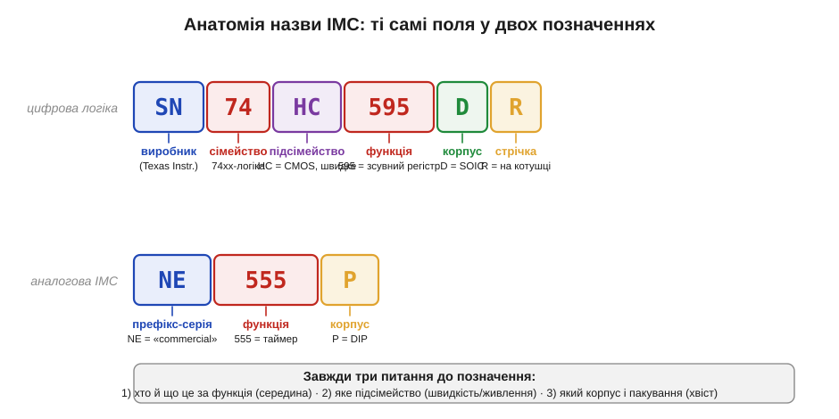
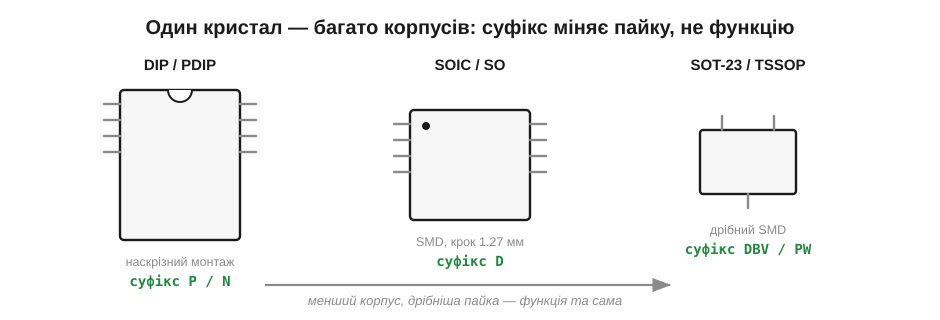

# 🔌 Розшифровка назв ІМС: префікси NE/LM/TL/CD/74 і суфікси корпусів

Жменя стандартних мікросхем-цеглинок живе [по півстоліття](topic:hw-components/legendary-ics) завдяки другому джерелу постачання й ціні перевіреності — і та сама легендарна функція приходить у магазин під десятком різних позначень. Ця вставка про те, **як** ці імена читати. Позначення на корпусі ІМС — не суцільний код, а кілька полів, склеєних докупи: хто зробив, що це за функція, у якому підсімействі й корпусі. Навчившись різати назву на ці шматки, ви впізнаєте «ту саму» мікросхему від п'яти різних виробників і не злякаєтесь хвоста з літер.

### Чому це взагалі важливо

Та сама легендарна функція приходить у магазин під десятком різних позначень. Таймер можна купити як **NE555**, **LM555**, **SE555**, **KA555**, **TLC555** — і це фізично один і той самий восьминогий чип з однаковою розпіновкою. Зсувний регістр «595» існує як **SN74HC595**, **MM74HC595**, **CD74HC595**, **74HCT595** — знов одне ядро. Якби кожне ім'я доводилося вивчати окремо, голова б луснула. Насправді ж усі вони побудовані за однією граматикою, і варто раз її розкласти — далі читаєш будь-яке позначення прямо з аркуша. Розберімо цю граматику поле за полем, починаючи зліва.


*Будь-яке позначення розкладається на ті самі поля: префікс виробника/серії → номер функції (ядро) → літери підсімейства → суфікс корпусу → суфікс пакування. SN74HC595DR і NE555P — різні мікросхеми, але читаються за одним правилом.*

### Префікс: хто й якого ґатунку

Перші літери — це **префікс виробника або серії**. Історично кожна фірма мала свій:

- **LM** — лінійний монолітний (*Linear Monolithic*) префікс National Semiconductor; під ним вийшли LM358, LM393, LM317, LM7805 — пів-аналогового світу.
- **NE / SE** — серії Signetics: **NE** позначає комерційний температурний діапазон (*commercial*, 0…70 °C), **SE** — розширений військовий (*military*). Звідси NE555 vs SE555 — той самий кристал, різна гарантована температура.
- **TL** — префікс Texas Instruments для лінійки на польових входах і опорних джерелах: TL072, TL431, TLC555.
- **CD** — *CMOS Digital*, серія, що пішла від RCA (4000-логіка): CD4011, CD4051, CD4066.
- **µA / uA** — стара серія Fairchild (µA741 — канонічний операційний підсилювач, µA7805 — стабілізатор).

Сьогодні ці префікси частіше вказують не так на фірму, як на **родовід** функції: купуючи LM358, ви берете схему, яку National зафіксувала десятиліття тому, хай навіть фізичний чип зійшов з конвеєра іншого виробника. Це і є [друге джерело постачання](topic:hw-components/legendary-ics) у дії.

Поверх цього кожен теперішній виробник додає **свою** двобуквенну прикмету спереду: **SN** (Texas Instruments), **MM** (колишній National), **MC** (Motorola/onsemi), **KA** (Fairchild/onsemi), **HEF** (NXP). Тому SN74…, MM74…, CD74… — це «74-логіка від TI / National / RCA-лінії». Префікс ліворуч — лише штамп заводу; суть несе те, що в середині.

### Серцевина: номер функції

Якщо префікс — це штамп заводу, то справжня суть позначення сидить одразу за ним. Усередині назви стоїть **число (іноді з літерами) — власне функція**. Саме його ви називаєте, коли кажете «постав 555» чи «це 358-й». Це найстійкіша частина назви: вона переходить від виробника до виробника майже недоторканою.

Тут є два світи. У **цифровій логіці** працює загальний каталог сімейства **74xx** (*seven-forty-something*): 7400 — чотири елементи І-НЕ, 7404 — шість інверторів, 74595 — зсувний регістр, 74138 — дешифратор. Номер кодує **логічну функцію**, і він спільний для всіх виробників — це фактично галузевий стандарт, а не власність однієї фірми. Поряд живе **4000-серія** (CD4000) з тією самою ідеєю, але іншою нумерацією: 4011 — І-НЕ, 4051 — аналоговий мультиплексор, 4066 — ключі.

У **аналогових та інтерфейсних** ІМС число прив'язане до конкретної розробки: 555 — таймер, 358/324 — операційні підсилювачі, 393/339 — [компаратори](topic:hw-analog/comparator), 431 — опорне джерело, 7805 — стабілізатор +5 В. Тут немає наскрізної «таблиці функцій»: номер просто треба знати або подивитися в довіднику. Часто остання цифра підказує кількість каналів: **358** — два ОП, **324** — чотири; **393** — два компаратори, **339** — чотири.

### Підсімейство: літери між числом і кінцем

У 74-логіці між «74» і номером функції стоять **літери підсімейства** — і це не косметика, а зовсім інша внутрішня електроніка з іншою швидкістю, живленням і логічними рівнями:

```
74xx     класична TTL (біполярна, історична)
74LSxx   Low-power Schottky TTL
74HCxx   High-speed CMOS — рівні CMOS, живлення 2…6 В
74HCTxx  HC з ВХОДАМИ під рівні TTL (стикувати зі старою логікою)
74ACxx   Advanced CMOS — швидша
74LVCxx  Low-Voltage CMOS — 1.65…3.6 В, дружнє до 3.3 В МК
```

Ці літери — те, на що дивляться **насамперед**, коли чип треба завести в сучасну систему. Наприклад, **74HC** живиться 2…6 В і чудово працює від 3.3 В; **74HCT** має вхідні пороги під старі 5-вольтові TTL; **74LVC** створене для 1.8…3.3 В і часто терпить 5 В на входах. Сплутати їх — означає отримати «логіку, що не читається»: рівні не збігаються, і нулі з одиницями перестають розпізнаватись. Те саме число функції (скажімо, 595) у різних підсімействах поводиться по-різному саме через ці дві-три літери.

> 🔧 **Навіщо це.** Коли логіка «дивно поводиться» при стикуванні з 3.3-вольтовим мікроконтролером — першим ділом гляньте на підсімейство. **HC** хоче рівні CMOS, **HCT** — рівні TTL; від цього залежить, чи прочитає чип вашу одиницю. Вибір літер між «74» і номером — це вибір рівнів і напруги живлення, а не дрібниця в назві.

### Хвіст: суфікс корпусу й пакування

Номер сказав, що чип робить, літери підсімейства — на яких рівнях; лишилося прочитати кінцівку. Останні літери після номера — це **корпус** (*package*) і **спосіб постачання**. На функцію вони не впливають **узагалі**: усередині той самий кристал, міняється лише оболонка й те, як деталь приїде до вас.


*DIP, SOIC і дрібний SMD — один кристал, різні корпуси. Суфікс у назві (P, D, DBV…) каже, що паяти, а не що чип робить. Чим менший корпус, тим дрібніша пайка.*

Біда в тім, що **єдиного стандарту суфіксів немає** — кожен виробник тримає свою таблицю. Та найходовіші букви впізнавані. У Texas Instruments, наприклад:

```
N, P    DIP / PDIP — вивідний, для макетної плати й паяння руками
D       SOIC — найпоширеніший SMD, крок 1.27 мм
PW      TSSOP — дрібніший SMD
DBV     SOT-23 — мінікорпус на кілька ніг
DR      D + суфікс R: SOIC, поставка на котушці (tape&reel)
```

Звідси практичний висновок: **NE555P** і **NE555D** — однакові таймери, лише перший у DIP під макетку, другий у SOIC під поверхневий монтаж. Хвостова **R** (як у 74HC595**DR**) не міняє ні корпус, ні функцію — вона лише каже, що чипи намотані на стрічку-котушку для автомата-складальника, а не насипані в пакетик. Замовивши «…R» поодинці, ризикуєте отримати шмат семиметрової стрічки — для ручного складання беруть варіант без R.

### Як читати будь-яке позначення: три питання

Зведемо в робочий алгоритм. Дивлячись на незнайому назву, ставимо до неї три питання — від середини до країв:

1. **Що це за функція?** Знаходимо число в середині (555, 358, 595, 431…) — воно й каже, що чип робить. Префікс виробника зліва поки ігноруємо.
2. **Яке підсімейство?** Для 74-логіки читаємо літери перед номером (HC/HCT/LVC…) — це швидкість, живлення й логічні рівні. Для аналогових — дивимось, чи літери в номері кодують число каналів.
3. **Який корпус і пакування?** Хвіст після номера (P/N/D/PW…) — це форма корпусу для пайки, а кінцева R — постачання на котушці.

> 🔧 **Навіщо це.** Назва ІМС читається **з середини**: спершу номер функції (що це), потім підсімейство (рівні й живлення), наприкінці корпус (як паяти). Префікс зліва — лише штамп виробника тієї самої перевіреної схеми, тож **NE555 = LM555 = KA555** для практики однакові, а вибирати маєте за середніми й хвостовими полями. Це й дає змогу безпечно міняти один «легендарний» чип на його двійника від іншої фірми — рівно те [друге джерело](topic:hw-components/legendary-ics), заради якого ці цеглинки й [живуть півстоліття](topic:hw-components/legendary-ics).
