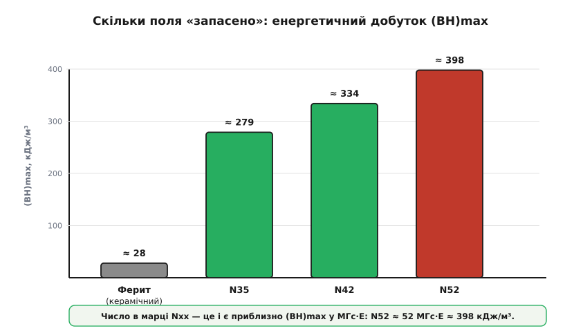
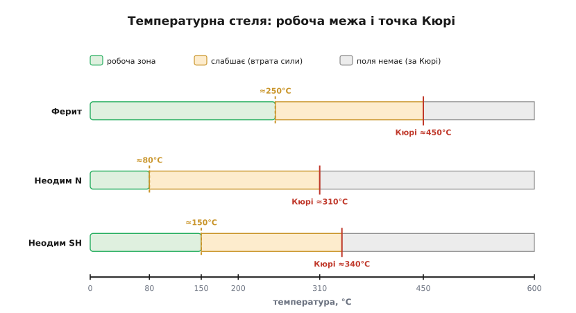

# Класи магнітів

Магніт у пристрої — це **деталь, яку купуєш за маркою**, як купують резистор за номіналом. Фізику [постійного магнетизму](topic:ph-condensed/permanent-magnets) — чому магніт «не розряджається», що таке точка Кюрі й коли [впорядкування доменів](topic:ph-condensed/ferromagnetism) розпадається — лишимо фізиці; практичний бік інший: які родини магнітів існують і за якими числами між ними вибирати. Дві родини покривають майже все, що ставлять у серійний виріб, і вибір між ними — це торг чотирьох величин: сила, ціна, температура, крихкість. Розберемо кожну так, щоб з каталогу постачальника ви брали магніт свідомо, а не «той, що сильніший».

### Дві родини: чим живуть і скільки коштують

На полиці постачальника постійні магніти діляться на дві великі родини, і прірва між ними — у кілька разів за силою:

- **Ферит** (*ferrite*, від латинського *ferrum* — залізо; він же керамічний, *ceramic*) — спечений оксид заліза з барієм чи стронцієм. Дешевий, твердий, темно-сірий. Не іржавіє в принципі — це вже оксид, далі окиснюватися нема чому, — і терпить нагрів до сотень градусів. Слабкий: «прилипає», але великого зусилля не дасть. Це магніт холодильникових сувенірів, дешевих гучномовців, магнітних сепараторів.
- **Неодим** (*neodymium*, від грецьких *neos* — новий і *didymos* — близнюк; сполука NdFeB, неодим-залізо-бор) — найсильніший із серійних магнітів. Той самий об'єм тягне у 5–10 разів дужче за ферит. Дорожчий, блищить металевим покриттям, боїться нагріву й корозії. Це магніти моторів, жорстких дисків, защіпок, давачів положення.

Поряд існують ще дві рідкісніші родини. **Самарій-кобальт** (*SmCo*, від мінералу самарскіту, у якому відкрили самарій) — майже такий сильний, як неодим, але незрівнянно стійкіший до тепла, тільки дорожчий. **AlNiCo** (алюміній-нікель-кобальт) — сплав із надзвичайно стабільним із температурою полем, проте легко розмагнічується зовнішнім полем. У типовому пристрої вибір майже завжди зводиться до «ферит чи неодим», а ці дві спливають лише за особливих вимог — і нижче стане видно, за яких саме.

### Що означає марка N35–N52

Обираючи неодим заради сили, одразу впираєшся в його маркування — і тут марка не маркетинг, а число з фізичним змістом. Літера **N**, а за нею **35…52** — це приблизно **енергетичний добуток** (*maximum energy product*, (BH)max) у старих одиницях МГс·Е (мегагаус-ерстед). Енергетичний добуток — це міра того, скільки магнітного поля «запаковано» в одиницю об'єму матеріалу: добуток найбільших значень індукції B та напруженості H, які магніт здатен утримувати одночасно. Чим більше число, тим густіше в магніт запхано поле — тим сильніша тяга за той самий об'єм. Тому маленький неодимовий диск тримає дужче, ніж удесятеро більший феритовий: у нього вищий (BH)max.


*Енергетичний добуток (BH)max — скільки поля запасено в одиниці об'єму. Ферит відстає в рази; усередині неодимового ряду N52 приблизно на 40 % сильніший за N35. Число в марці — це і є приблизно (BH)max у мегагаус-ерстедах.*

Сучасні каталоги частіше подають (BH)max у кілоджоулях на кубометр, тож переведення між одиницями корисно тримати під рукою. Множник простий — 1 МГс·Е ≈ 7.96 кДж/м³:

```
N35:  35 МГс·Е × 7.96 ≈ 279 кДж/м³
N52:  52 МГс·Е × 7.96 ≈ 398 кДж/м³
```

**N52** — практична верхня межа серійного неодиму; усе, що марковане вище (N54, N55), або лабораторне, або просто завищене маркування. Тому, побачивши «N60» на дешевому магніті з невідомого джерела, можна впевнено читати це як рекламу, а не як паспортну величину.

### Дві стелі: робоча температура й точка Кюрі

Висока марка дає силу, але саме тут ховається головна підступність неодиму — він не любить тепла, і втрачає силу за двома різними механізмами. Верхня, остаточна межа — **[точка Кюрі](topic:ph-condensed/permanent-magnets)** (*Curie point*, T_C, на честь П'єра Кюрі): температура, за якою теплові коливання остаточно руйнують упорядкування доменів і магнетизм **зникає назавжди**, навіть після охолодження. Та задовго до Кюрі лежить нижча, **робоча межа** (*max operating temperature*): за нею магніт ще працює, проте сила «пливе». Частина цієї втрати **оборотна** — повертається, щойно магніт охолоне; частина **лишається** назавжди, бо найслабші зони магніту перевернулися й уже не повертаються самі. Робоча межа — це і є та температура, вище якої незворотна частина стає неприйнятною.


*Температурні стелі. У звичайного неодиму N робоча межа лише ≈80 °C, а Кюрі ≈310 °C; ферит спокійно тримає сотні градусів. Високотемпературні марки неодиму піднімають робочу стелю ціною трохи меншої сили.*

Саме тому до **N** додають **температурну літеру**, що позначає робочу стелю: без літери ≈80 °C, M ≈100 °C, H ≈120 °C, SH ≈150 °C, UH ≈180 °C, EH ≈200 °C. Тобто «N42SH» — це сила марки N42, але магніт тримає до 150 °C. У моторі чи біля силового ключа це критично: дешевий «N52» без літери поряд із гарячою котушкою тихо втратить частину поля — і пристрій «здеградує» без жодної видимої поломки, без диму, без запаху. Просто за півроку защіпка стане слабшою, а давач почне збоїти.

Чому неодим узагалі такий тепловразливий, видно з фізики: сила постійного магніту тримається на [коерцитивності](topic:ph-condensed/permanent-magnets) — упертості, з якою матеріал тримає намагніченість проти зовнішніх збурень, — а в неодиму коерцитивність із нагрівом падає швидко. Самарій-кобальт тут виграє вдвічі: його точка Кюрі близько 800 °C проти ≈310 °C у неодиму, тож SmCo спокійно працює там, де неодим уже «попливе».

### Скільки сили з'їдає нагрів

Оборотна частина втрати підлягає простому правилу, і його варто вміти прикинути ще до замовлення. Намагніченість неодиму спадає приблизно лінійно з температурою — близько **−0.11 % на кожен градус** Цельсія вище кімнатної (точне число залежить від марки, але −0.11 % — добрий орієнтир).

**Приклад (на скільки слабшає магніт у гарячому корпусі).** Неодимовий магніт із достатньою температурною літерою працює всередині корпусу, де усталюється 75 °C — це ще в межах робочої зони, тож утрата буде оборотною. Оцінимо, скільки сили лишиться проти кімнатних 25 °C:

```
ΔT   = 75 − 25 = 50 °C
втрата = 0.11 % × 50 = 5.5 %
лишилось ≈ 100 % − 5.5 % = 94.5 % сили
```

Десь п'ять-шість відсотків сили — на гарячому корпусі це часто дрібниця, і вони повернуться, коли пристрій охолоне. Небезпека не тут, а за робочою межею: вискоч за неї — і втрата перестає бути оборотною. Тому температурну літеру беруть **із запасом над найгарячішою точкою**, де магніт реально опиниться, а не над кімнатною.

> 🔧 **Навіщо це.** Коли в проєкті є мотор, защіпка, давач положення чи енкодер, вибір магніта зводиться до трьох чисел: марка (сила, N35…N52), температурна літера (до якого нагріву тримає) і покриття (де працюватиме). Помилка в будь-якому з трьох тихо «з'їдає» поле або вбиває магніт корозією — без диму й без явної поломки. Найпідступніша саме температура: магніт, узятий «на N52» без літери, у нагрітому вузлі деградує місяцями, і причину потім шукають де завгодно, тільки не в магніті.

### Як пускати в роботу: граблі

Силу й температуру з паспорта вибрати неважко; складніше те, що неодим примхливий фізично — взяти його в руки й поставити на місце вже непросто. Ось типове, що псує складання:

- **Крихкість.** Спечений неодим — як кераміка: твердий, але **колеться**. Два магніти, що з розгону клацнули один об одного, легко скидають кутики й бризкають гострими скалками в очі. Не давайте їм вільно «стрибати» назустріч — підводьте повільно.
- **Корозія.** Гола NdFeB-сполука у вологому повітрі іржавіє й кришиться зсередини, тому неодимові магніти майже завжди **покривають** — нікелем (шар Ni-Cu-Ni, блискучий), цинком (сірий, дешевший) чи епоксидом (матовий, найстійкіший до вологи). Подряпали покриття — відкрили шлях іржі під нього. Для вулиці чи вологого середовища беріть епоксидне або цинкове покриття, не голий нікель на тонкому шарі.
- **Сила недооцінена.** Навіть невеликий неодим тягне кілограми й боляче, до синця, защемлює шкіру, що потрапила між двома магнітами; великі магніти прямо травмонебезпечні й здатні зламати палець.
- **Розмагнічування полем.** Сильне зовнішнє поле, спрямоване проти власного (від сусіднього магніта чи котушки), може **частково розмагнітити** магніт — і робить це тим легше, чим магніт гарячіший. Тепло й зустрічне поле б'ють по тій самій коерцитивності, тож разом вони небезпечніші, ніж кожне окремо.

### Коли що брати

Усі чотири величини сходяться в коротке правило вибору. Дешево, тепло, без вимог до сили (гучномовець, простий утримувач, навчальний дослід) — **ферит**: він копійчаний і не боїться ні нагріву, ні вологи. Потрібна сила в малому об'ємі (мотор, тонка защіпка, давач) — **неодим**, із маркою під потрібне зусилля, температурною літерою із запасом над найгарячішою точкою й покриттям під середовище. Гаряче понад можливості неодиму (під капотом, у потужному двигуні), а ціна не вирішальна — **самарій-кобальт**: він тримає там, де неодим здається. Потрібне гранично стабільне поле, нечутливе до температури (давачі, вимірювальні прилади), і не лякає, що матеріал легко збити сильним зовнішнім полем — **AlNiCo**. У дев'яти випадках із десяти, втім, відповідь — ферит або неодим, а саме між цими двома й варто навчитися вибирати впевнено.
