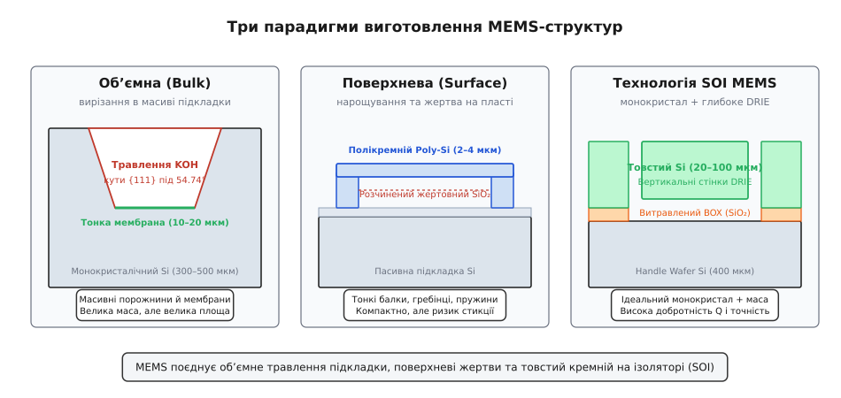
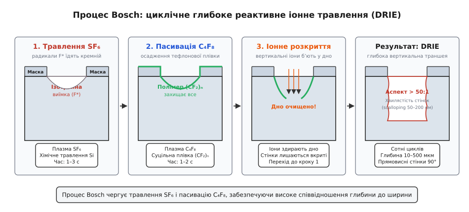
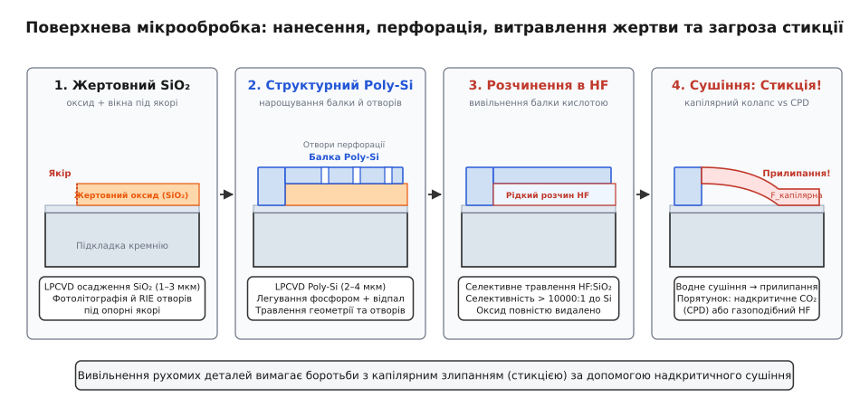
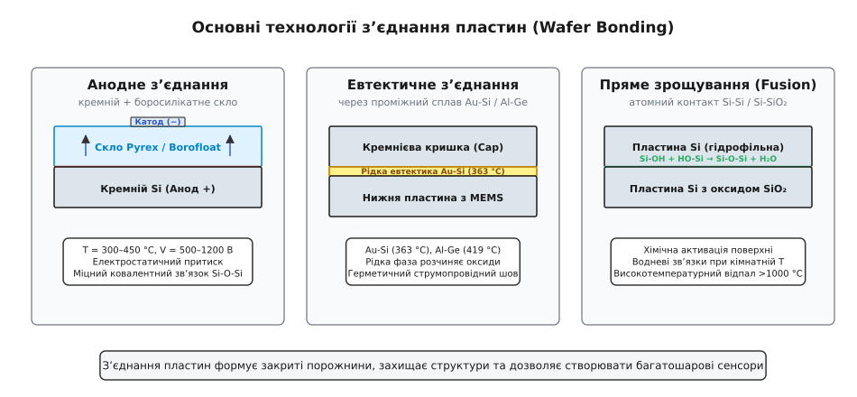
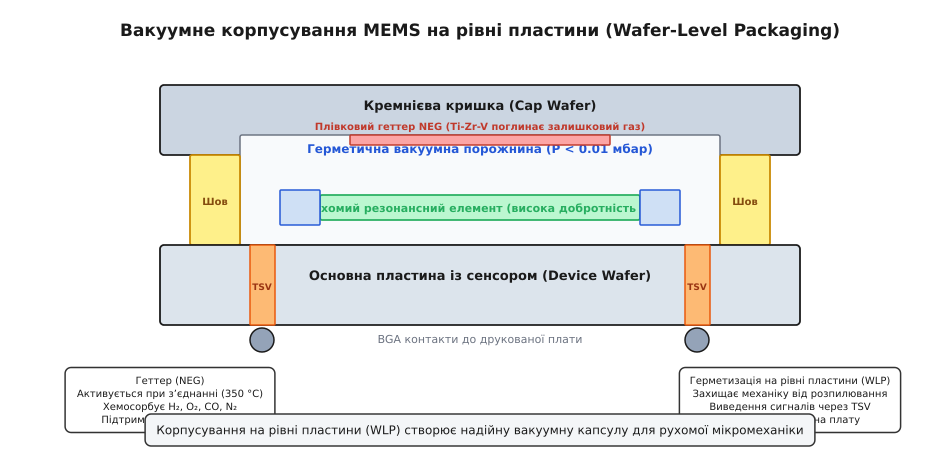

# Мікрофабрикація MEMS

<preknowlist>
* [Кремній і монокристал](topic:hw-components/silicon-monocrystal/silicon-monocrystal-d.md): кристалічна гратка алмазного типу, орієнтації (100), (110), (111) та площини спайності.
* [Фотолітографія](topic:hw-components/photolithography/photolithography-d.md): нанесення фоторезисту, експонування УФ-світлом, проявлення та формування маски для травлення.
* [Шар за шаром](topic:hw-components/doping-etching-metal/doping-etching-metal-d.md): базові операції мікроелектроніки — термічне окиснення, хімічне осадження (CVD/LPCVD) та сухе плазмове травлення (RIE).
</preknowlist>

Звичайна інтегральна мікросхема є монолітною статичною структурою: мільярди транзисторів і металевих міжз'єднань жорстко зафіксовані в шарах діелектриків на поверхні кремнієвої підкладки. Спроба створити датчик прискорення, кутової швидкості чи тиску за стандартним CMOS-маршрутом закінчується невдачею — планарні польові транзистори не мають рухомих компонентів, здатних зміщуватися під дією інерційних сил чи зовнішнього тиску. Мікроелектромеханічні системи (MEMS, Micro-Electro-Mechanical Systems) вимагають принципово іншої просторової архітектури: вільно підвішених балок товщиною в кілька мікрометрів, гребінчастих електростатичних приводів з рухомими зубцями, закритих вакуумних порожнин і тонких деформівних кремнієвих мембран.

Виготовлення таких тривимірних рухомих мікроструктур стало можливим завдяки адаптації базових операцій мікроелектроніки та створенню специфічних технологій мікрообробки: прецизійного хімічного різьблення кристалічної гратки кремнію, осадження та селективного розчинення жертовних шарів, глибокого реактивного іонного травлення з вертикальними стінками та герметичного зрощування пластин.

## Три технологічні парадигми MEMS

Історично й технологічно виробництво MEMS сформувалося навколо трьох головних підходів: об'ємної мікрообробки (Bulk Micromachining), поверхневої мікрообробки (Surface Micromachining) та технології кремній на ізоляторі (SOI MEMS).


*Три парадигми виготовлення MEMS-структур: формування порожнин у товщі монокристалічного кремнію (Bulk), пошарове нарощування тонких плівок із видаленням жертви (Surface) та глибоке структурування монокристалу на прихованому оксиді (SOI MEMS).*

* **Об'ємна мікрообробка (Bulk Micromachining)** перетворює саму монокристалічну кремнієву пластину товщиною 300–500 мкм на функціональний механічний елемент. Хімічним або плазмовим шляхом у товщі підкладки витравлюються наскрізні отвори, конічні або прямокутні каверни, формуючи пружні мембрани, масивні інерційні тіла та канавки. Оскільки структури вирізаються безпосередньо з монокристалічного кремнію, вони мають ідеальну пружність без механічного гістерезису, високу механічну міцність і велику інерційну масу, що критично для прецизійних датчиків тиску та сейсмоприймачів.
* **Поверхнева мікрообробка (Surface Micromachining)** залишає кремнієву підкладку пасивною механічною основою. Усі рухомі та нерухомі деталі (балки, торсіони, гребінчасті структури) формуються на поверхні пластини з тонких плівок полікристалічного кремнію (Poly-Si) товщиною 1–5 мкм. Простір під рухомими елементами звільняється завдяки селективному хімічному розчиненню проміжного жертовного шару діоксиду кремнію (SiO₂). Цей підхід дозволяє створювати надзвичайно компактні структури з розмірами в одиниці мікрометрів і легко інтегрувати їх поруч зі стандартними CMOS-транзисторами на одному кристалі.
* **Технологія SOI MEMS (Silicon-on-Insulator)** об'єднує переваги обох методів. Використання тришарової пластини (товста основа Handle Wafer, шар прихованого оксиду BOX і монокристалічний приладовий шар Device Layer товщиною 10–100 мкм) у поєднанні з глибоким плазмовим травленням DRIE дозволяє створювати високі прямовисні мікроструктури з монокристалу з великою масою та прецизійними зазорами.

## Об'ємна мікрообробка: анізотропне рідинне травлення

Основою класичної об'ємної мікрообробки є рідинне хімічне травлення монокристалічного кремнію у водних розчинах сильних лугів. На відміну від ізотропного травлення в сумішах плавикової, азотної та оцтової кислот (HNA, де швидкість розчинення однакова в усіх напрямках), гарячі лужні розчини демонструють виражену **кристалографічну анізотропію** — швидкість травлення критично залежить від орієнтації атомних площин кремнію.

### Хімія та механізм анізотропії в розчинах KOH та TMAH

Найпоширенішими анізотропними травителями є гідроксид калію (KOH) та гідроксид тетраметиламонію (TMAH, (CH₃)₄NOH). Загальна хімічна реакція окисно-відновного розчинення кремнію в лужному середовищі описується рівнянням:

`Si + 2OH⁻ + 2H₂O → Si(OH)₂O₂²⁻ + 2H₂ ↑`

Реакція протікає в кілька послідовних стадій: гідроксид-іони `OH⁻` атакують поверхневі атоми кремнію, утворюючи кремнієвий комплекс з виділенням газоподібного водню `H₂`, після чого комплекс розчиняється у воді у вигляді силікату.

Швидкість цього процесу лімітується густиною розташування атомів на поверхні та кількістю розірваних ковалентних зв'язків (dangling bonds), що припадають на одиницю площі. У монокристалічному кремнії:
1. Площини `{100}` мають 2 ковалентні зв'язки, спрямовані всередину кристала, і 2 зв'язки, доступні для атаки реагентом.
2. Площини `{110}` мають 1 зв'язок всередину і 3 відкритих зв'язки, що забезпечує найвищу швидкість реакції.
3. Площини `{111}` є площинами з найщільнішим гексагональним пакуванням атомів, де кожен атом має 3 міцних зв'язки вглиб кристала і лише 1 зв'язок назовні.

Внаслідок цього швидкість травлення площин `{111}` у розчині KOH є у 100–400 разів меншою, ніж для площин `{100}`:

`R_{110} > R_{100} ≫ R_{111}`

Для стандартної концентрації 30–40% KOH при температурі 80 °C типові швидкості травлення становлять `R_{100} ≈ 1.0–1.4` мкм/хв, тоді як `R_{111} ≈ 0.005` мкм/хв. Травлення практично повністю зупиняється на площинах `{111}`, перетворюючи їх на природні кристалографічні обмежувальні бар'єри.

У пластинах із поверхневою орієнтацією `(100)` площини `{111}` перетинають поверхню під суворим фізичним кутом `θ = 54.74°`. Детальний векторний виведення цього кута, розрахунок геометрії маски та явище підтравлення опуклих кутів наведено у вставці про [геометричний розрахунок кутів](topic:hw-components/mems-fabrication/math-anisotropic-etch.md).

| Параметр | KOH (Гідроксид калію) | TMAH (Тетраметиламоній гідроксид) |
| :--- | :--- | :--- |
| **Типова концентрація** | 30–40 wt% | 15–25 wt% |
| **Робоча температура** | 75–85 °C | 80–90 °C |
| **Швидкість R_{100}** | 1.0–1.4 мкм/хв | 0.5–0.9 мкм/хв |
| **Анізотропія R_{100}/R_{111}** | 200:1 – 400:1 | 30:1 – 80:1 |
| **Селективність до SiO₂** | Низька (1:200 – 1:500) | Висока (1:2000 – 1:5000) |
| **Селективність до Si₃N₄** | Ідеальна (> 1:10000) | Ідеальна (> 1:10000) |
| **CMOS-сумісність** | Ні (забруднення іонами K⁺) | Так (чистий органічний луг) |

Маскою для травлення в KOH зазвичай служить плівка нітриду кремнію Si₃N₄, нанесена методом LPCVD, оскільки плівка діоксиду кремнію SiO₂ розчиняється в гарячому KOH із помітною швидкістю (1–5 нм/хв) і не витримує тривалого травлення наскрізних каверн товщиною 400 мкм. Натомість TMAH є CMOS-сумісним реагентом, оскільки не містить рухливих іонів лужних металів (`K⁺`, `Na⁺`), які руйнують підзатворний діелектрик польових транзисторів, і дозволяє використовувати термооксид SiO₂ як надійну маску.

### Методи контролю товщини мембран: Стоп-шари

Для виготовлення деформівних мембран датчиків тиску товщиною 10–30 мкм недостатньо просто вимкнути таймер травлення: коливання товщини вихідної пластини (Total Thickness Variation, TTV ±10 мкм) призводять до неприпустимого розкиду товщини готової мембрани. Для прецизійної зупинки процесу застосовують внутрішні бар'єри:

1. **Борний P⁺ стоп-шар (Boron Etch-Stop):** Кремній легують бором до надвисокої концентрації `N_A > 5 · 10¹⁹` см⁻³ за допомогою глибокої дифузії або іонної імплантації. При такій концентрації рівень Фермі опускається глибоко у валентну зону, змінюючи енергетичні стани поверхні та унеможливлюючи утворення необхідних для травлення комплексів `Si(OH)₄`. Швидкість травлення падає більш ніж у 100 разів. Недоліком методу є високі внутрішні механічні напруження через менший атомний радіус бору відносно кремнію (ефект розмірної невідповідності кристалічної гратки), що може викликати короблення тонких мембран.
2. **Електрохімічна зупинка травлення (ECE, Electrochemical Etch-Stop):** Використовують пластину з сформованим епітаксійним p-n-переходом (наприклад, тонка n-епітаксійна плівка на p-підкладці). До підкладки та n-шару прикладають контрольовану електричну різницю потенціалів відносно платинового електрода в розчині KOH. Поки йде травлення p-підкладки, p-n-перехід зміщений у зворотному напрямку і струм не тече. Щойно травлення досягає межі n-шару, до розчину відкривається ділянка під анодним потенціалом. На поверхні кремнію миттєво виникає анодне окиснення з утворенням тонкого пасивуючого шару оксиду кремнію, і травлення самостійно блокується з точністю до десятих часток мікрометра.
\n\n## Глибоке реактивне іонне травлення (DRIE)

Незважаючи на простоту, анізотропне рідинне травлення має непереборне обмеження: похилі стінки 54.74° займають занадто велику площу кристала при глибокому травленні і роблять неможливим виготовлення довільних фігур (кіл, вигнутих пружин, вертикальних гребінців). Справжній прорив у тривимірній мікрообробці відбувся з появою сухого плазмового процесу глибокого травлення.


*Процес Bosch: циклічне чергування ізотропного травлення SF₆, пасивації фторполімером C₄F₈ та спрямованого іонного розкриття дна для формування траншей з аспектним співвідношенням понад 50:1.*

### Циклічний процес Bosch

Основним промисловим методом сухої мікрообробки став винайдений інженерами компанії Robert Bosch GmbH метод часового мультиплексування (Time-Multiplexed DRIE, або Bosch Process). Детальну історію його створення описано у вставці про винахід [процесу Bosch](topic:hw-components/mems-fabrication/hist-bosch-process.md).

Технологія базується на швидкому повторенні трьох взаємопов'язаних фаз в індуктивно зв'язаній плазмі високої густини (ICP):

1. **Фаза ізотропного травлення кремнію:** У реактор подається гексафторид сірки `SF_6`. Плазма ICP розщеплює газ на вільні хімічно активні радикали фтору `F*`. Фтор спонтанно розчиняє кремній з утворенням леткого газу `SiF_4`, витравлюючи на дні невелику сферичну каверну глибиною 0.5–2 мкм за 1–3 секунди:
   `Si + 4F^* → SiF_4 ↑`
2. **Фаза конформної пасивації:** Подача `SF_6` перекривається, і вмикається потік октафторциклобутану `C_4F_8`. Радикали `CF_2` полімеризуються на всіх відкритих поверхнях, утворюючи шар тефлоноподібного фторполімеру `(CF_2)_n` товщиною 20–50 нм. Цей шар повністю захищає кремній від хімічного впливу.
3. **Фаза спрямованого депасивування:** На тримач підкладки подається радіочастотний потенціал зміщення (RF bias). Позитивні іони плазми прискорюються електричним полем строго вертикально і бомбардують горизонтальні ділянки. За 0.1–0.3 секунди іонне розпилення здирає полімерну плівку з дна траншеї. Оскільки вертикальні стінки паралельні вектору руху іонів, вони не зазнають прямого удару і залишаються надійно вкритими полімером.

Під час наступного імпульсу `SF_6` радикали фтору атакують виключно відкрите дно, просуваючись углиб підкладки, тоді як боковини залишаються заблокованими.

Повторення цього циклу сотні разів дозволяє отримувати прямовисні траншеї з аспектним співвідношенням (глибина до ширини) понад 50:1 при швидкості травлення від 3 до 20 мкм/хв. Побічним ефектом дискретності є нанорозмірна хвилястість бічних поверхонь — **скалопінг (scalloping)** з висотою мікрохвиль 20–100 нм.

### Неідеальності процесу DRIE

При проектуванні мікроструктур для DRIE враховують три специфічні фізичні ефекти:

* **ARDE (Aspect Ratio Dependent Etching / RIE Lag):** Швидкість травлення залежить від ширини розкриття траншеї. У широких вікнах (100 мкм) газовий обмін відбувається вільно, і швидкість травлення є максимальною. У вузьких щілинах (2 мкм) виникає кнудсенівський дифузійний опір переносу газу: надходження свіжих радикалів `F*` і видалення молекул `SiF_4` сповільнюються. В результаті вузька траншея витравлюється на 30–50% повільніше, ніж широка поруч.
* **Ефект нотчингу (Notching):** Якщо травлення досягає діелектричного стоп-шару (наприклад, схованого оксиду SiO₂ у пластинах SOI), позитивні іони плазми накопичуються на ізоляторі, оскільки заряд не може стекти на підкладку. Виникає локальне електричне поле, яке відхиляє траєкторію наступних падаючих іонів убік. Іони здирають захисний полімер біля основи кремнієвої балки, і радикали фтору швидко протравлюють глибоку виїмку (нотч) у місці контакту балки з оксидом, що може призвести до її відриву.
* **Мікромаскування та «чорний кремній» (Black Silicon):** Якщо напруга зсуву занижена або час пасивації надлишковий, мікроскопічні острівці фторполімеру або розпиленого оксиду не встигають видалятися з дна і стають масками для подальшого травлення. На дні каверни виростає густий ліс голчастих кремнієвих стовпчиків, який повністю поглинає світло і виглядає як оксамитово-чорна поверхня.
\n\n## Поверхнева мікрообробка (Surface Micromachining)

Якщо об'ємна мікрообробка формує структури всередині підкладки, то поверхнева мікрообробка вирощує їх на поверхні з чергованих шарів тонких плівок.


*Поверхнева мікрообробка: нанесення жертовного оксиду, структурування балки Poly-Si з перфораційними отворами, селективне витравлення SiO₂ у розчині HF та виникнення капілярної стикції під час рідинного сушіння.*

### Тріада матеріалів поверхневої мікрообробки

Класичний поверхневий MEMS-процес (наприклад, технології Sandia SUMMiT V або MUMPs) базується на точно підібраній системі матеріалів:

1. **Ізоляційний шар (Нітрид кремнію, Si₃N₄):** Наноситься безпосередньо на кремнієву підкладку методом LPCVD товщиною 0.5–1 мкм. Служить електричним ізолятором і захищає підкладку від підтравлювання під час видалення жертви.
2. **Жертовний шар (Sacrificial Layer, Фосфоросилікатне скло PSG або SiO₂):** Осаджується методом LPCVD з дисиліційдигідриду або TEOS товщиною 1–3 мкм. У ньому фотолітографією витравлюються вікна під майбутні механічні опори (якорі, anchors). Після виготовлення всієї структури цей шар повністю розчиняється кислотою, звільняючи простір під рухомими деталями.
3. **Структурний шар (Полікристалічний кремній, Poly-Si):** Осаджується методом LPCVD розпадом силану `SiH_4` при температурі 580–620 °C товщиною 1.5–4 мкм. Для надання провідності полікремній легують фосфором (n-тип) або бором (p-тип). З нього формують самі рухомі балки, гребінчасті структури та зубці приводів.

### Механічні напруження та високотемпературний відпал

Тонкі плівки полікремнію після осадження містять високі внутрішні залишокві механічні напруження `σ_{res}`, зумовлені нерівноважним ростом кристалічних зерен та різницею коефіцієнтів теплового розширення плівки й підкладки.

* **Напруження стиску (Compressive, σ < 0):** Довга балка, закріплена з двох кінців, під дією стискаючих сил втрачає стійкість і вигинається хвилею вгору або вниз (явище поздовжнього вигинання Ейлера — buckling).
* **Напруження розтягу (Tensile, σ > 0):** Помірне напруження розтягу (10–30 МПа) є бажаним, оскільки стабілізує плоску форму мембран і балок. Проте надмірний розтяг (> 100 МПа) збільшує жорсткість пружин і може викликати розтріскування підвісів.
* **Градієнт напружень по товщині (Stress Gradient, Δσ/Δz):** Якщо напруження у верхніх шарах плівки відрізняються від нижніх, після вивільнення консольна балка миттєво скручується або загинається вгору, спотворюючи ємнісні зазори.

Для усунення градієнта напружень і зниження абсолютного значення напружень до безпечного рівня (< 10 МПа) структури обов'язково піддають **високотемпературному стабілізаційному відпалу** при температурі 1000–1050 °C в атмосфері азоту протягом 1–2 годин. Під час відпалу відбувається перекристалізація зерен полікремнію і повна релаксація внутрішніх дислокацій.

### Вивільнення структур та проблема стикції (Stiction)

Після формування малюнка полікремнію настає критичний етап — **вивільнення структур (Release Etch)**. Пластину занурюють у концентрований 49% водний розчин плавикової кислоти (HF) або буферизований розчин (BOE):

`SiO_2 + 6HF → H_2SiF_6 + 2H_2O`

Селективність травлення HF до діоксиду кремнію відносно полікремнію та нітриду кремнію перевищує 10 000:1. Оксид повністю вимивається з-під полікремнію за кілька хвилин.

Щоб кислота могла проникнути під широкі пластини сейсмомас (розміром 200 × 200 мкм) без необхідності годинами тримати кристал у кислоті, у тілі полікремнію заздалегідь проектують матрицю регулярних **перфораційних отворів вивільнення (Release Holes)** розміром 2 × 2 мкм з кроком 10–20 мкм.

Головною небезпекою під час вивільнення є **стикція (Stiction, злипання)**. Під час виймання пластини з промивної деіонізованої води та її висихання під дією випаровування між тонкою балкою і підкладкою утворюється меніск рідини. Сили поверхневого натягу води створюють величезний капілярний тягнучий тиск Лапласа:

```
P_{cap} = (2 · γ · cos(θ_c)) / d_{gap}   [капілярний тиск Лапласа]
```

де `γ = 0.0728` Н/м — поверхневий натяг води, `θ_c` — кут змочування, `d_{gap}` — зазор між балкою та підкладкою (зазвичай 1–2 мкм).

Для зазору 1 мкм капілярний тиск досягає `P_{cap} ≈ 1.5` атм (150 кПа). Ця сила легко долає пружність тонкої кремнієвої балки і притискає її до підкладки. Щойно поверхні торкаються одна одної, між ними виникають сили Ван-дер-Ваальса, водневі зв'язки та електростатичні заряди. Балка намертво прилипає до дна і більше ніколи не повертається у вихідний стан (вихід придатних падає до нуля).

### Методи подолання стикції

1. **Надкритичне сушіння в діоксиді вуглецю (CPD, Critical Point Drying):** Пластину після промивання водою переносять в ізопропіловий спирт, а потім у герметичну камеру високого тиску з рідким `CO_2`. Камеру нагрівають вище критичної точки діоксиду вуглецю (`T_c = 31.1°C`, `P_c = 73.8 бар`). У надкритичному стані межа поділу «рідина–газ» повністю зникає, а поверхневий натяг стає рівним нулю (`γ = 0`). Потім тиск плавно скидають при постійній температурі, і газ виходить без виникнення жодних капілярних сил.
2. **Газофазне травлення парами плавикової кислоти (Vapor HF Release):** Процес проводять у парах `HF / H_2O / Спирт` при температурі 40–60 °C. Оксид розчиняється в газовому середовищі без утворення суцільної рідкої плівки на кристалі.
3. **Гідрофобні самоскладальні моношари (SAM):** Обробка поверхні кремнію органічними молекулами (наприклад, фторованими силанами FDTS або OTS) формує мономолекулярний шар, який робить поверхню гідрофобною (`θ_c > 110°`) і знижує енергію адгезії на два порядки.
4. **Механічні мікрошпильки (Dimples):** На нижній поверхні балок фотолітографією формують невеликі точкові виступи висотою 0.5 мкм, які зменшують площу прямого контакту поверхонь у тисячі разів.

## Технологія кремній на ізоляторі (SOI MEMS)

Поверхнева мікрообробка ідеально підходить для мініатюрних сенсорів, але обмежена товщиною полікремнію (зазвичай не більше 3–5 мкм). Крім того, полікристалічний матеріал має міжзеренні межі, які погіршують стабільність модуля Юнга та викликають вищі механічні втрати (знижуючи добротність резонаторів).

Технологія **SOI MEMS** об'єднує високу якість монокристалічного кремнію з високою товщиною структур.

Пластина кремній на ізоляторі (SOI, Silicon-on-Insulator) складається з трьох шарів:
* **Handle Wafer (Опорна підкладка):** Монокристалічний кремній товщиною 300–500 мкм, що служить механічним каркасом.
* **Buried Oxide (BOX, Прихований оксид):** Термічний діоксид кремнію SiO₂ товщиною 1–3 мкм, який виконує роль жертовного або ізолюючого шару.
* **Device Layer (Приладовий шар):** Високоякісний монокристалічний кремній товщиною від 10 до 100 мкм з контрольованою кристалографічною орієнтацією та рівнем легування.

Маршрут виготовлення SOI MEMS:
1. За допомогою фотолітографії на приладовий шар наноситься маска.
2. Процесом DRIE (Bosch) у товстому монокристалічному шарі прорізаються прямовисні балки та гребінчасті приводи на всю глибину до прихованого оксиду BOX. Оксид SiO₂ має високу селективність до фтору і служить природним стоп-шаром травлення.
3. Проводиться селективне витравлення прихованого оксиду під рухомими балками у парах HF (Vapor HF). Товсті кремнієві балки (20–50 мкм) мають високу вертикальну жорсткість, тому вони повністю стійкі до стикції навіть без застосування CPD.

Завдяки монокристалічній структурі добротність резонаторів у SOI MEMS перевищує `Q > 100 000`, що робить цю технологію безальтернативною для навігаційних гіроскопів вищого класу точності.
\n\n## З'єднання пластин (Wafer Bonding)

Рухомі мікромеханічні структури неможливо захистити звичайним заливанням у пластмасовий корпус: розплавлений епоксидний компаунд затече в зазори між балками і заблокує їхній рух. Крім того, алмазна пилка під час розрізання пластини на окремі чипи використовує струмінь води з абразивом, який миттєво зруйнував би відкриті кремнієві пружини.

Тому критичним етапом фабрикації є **з'єднання пластин на рівні пластини (Wafer Bonding)**, яке дозволяє герметизувати сенсори всередині захисної кремнієвої або скляної капсули до операції дискового різання.


*Основні технології з’єднання пластин: анодне зрощування кремнію з боросилікатним склом, низькотемпературне евтектичне з’єднання через проміжний металевий шар та високотемпературне пряме зрощування гідрофільних поверхонь.*

### 1. Анодне з'єднання (Anodic Bonding)

Анодне з'єднання (також відоме як польове зрощування, Field-Assisted Bonding) застосовується для герметичного зрощування монокристалічного кремнію з лужно-боросилікатним склом (Schott Borofloat 33 або Corning Pyrex 7740). Скло підбирається таким чином, щоб його коефіцієнт теплового розширення (КТР, `α ≈ 3.25 · 10⁻⁶` К⁻¹) точно збігався з КТР кремнію (`α ≈ 2.6 · 10⁻⁶` К⁻¹) у всьому робочому діапазоні температур, що запобігає розтріскуванню спаю при охолодженні.

Фізичний механізм анодного з'єднання:
1. Сендвіч «кремній–скло» нагрівають до температури 300–450 °C. При цій температурі оксиди натрію `Na_2O` в склі дисоціюють, і іони натрію `Na⁺` набувають високої рухливості.
2. До зразка прикладають постійну високу напругу 500–1200 В: кремній підключають до позитивного полюса джерела (анод), а скло — до негативного (катод).
3. Під дією електричного поля позитивні іони `Na⁺` дрейфують через товщу скла в напрямку катода. Біля межі контакту «кремній–скло» утворюється нескомпенсований шар збіднення з фіксованих негативних іонів кисню `O²⁻` товщиною кілька сотень нанометрів.
4. Усе прикладене падіння напруги зосереджується в цьому надтонкому шарі збіднення, створюючи колосальну напруженість електричного поля `E > 10⁶` В/см.
5. Виникає потужний електростатичний тиск притискання (тиск Максвелла `P_{elec} = (ε · E²) / 2 > 10–20` бар), який притискає пластини одну до одної на атомарному рівні, пластично згладжуючи нанонерівності поверхні.
6. Іони кисню `O²⁻` під дією поля переходять на поверхню кремнію і вступають у незворотну хімічну реакцію окиснення з утворенням ковалентних зв'язків `Si-O-Si`:
   `Si + 2O^{2-} → SiO_2 + 4e^-`

Формується монолітний, абсолютно герметичний молекулярний шов із міцністю на розрив понад 10–20 МПа (при випробуваннях на розрив руйнування відбувається по тілу скла, а не по шву).

### 2. Евтектичне з'єднання (Eutectic Bonding)

Евтектичне з'єднання використовує проміжний металевий шар, який при нагріванні утворює з кремнієм або германієм рідку евтектичну фазу при температурі, значно нижчій за температуру плавлення окремих компонентів:

* **Золото–кремній (Au-Si):** Евтектична точка відповідає температурі 363 °C при вмісті 19 ат.% кремнію (температура плавлення чистого Au — 1064 °C, чистого Si — 1414 °C).
* **Алюміній–германій (Al-Ge):** Евтектична точка 419 °C при 28 ат.% германію. Цей сплав є повністю CMOS-сумісним (не містить золота) і широко використовується для інтеграції MEMS безпосередньо поверх CMOS-пластин.
* **Золото–олово (Au-Sn):** Евтектична точка 280 °C при 80 ваг.% Au.

Під час евтектичного з'єднання пластини нагрівають трохи вище евтектичної точки. Рідкий розплав за рахунок капілярних сил змочує поверхні, розчиняє природні тонкі оксиди і заповнює мікрорельєф. При наступному охолодженні розплав кристалізується, утворюючи міцний, вакуумно-щільний і електропровідний металевий шов.

### 3. Пряме гідрофільне зрощування (Direct Fusion Bonding)

Пряме зрощування дозволяє з'єднувати дві кремнієві пластини (`Si-Si` або `Si-SiO_2`) взагалі без проміжних металевих чи клейових шарів.

Процес включає чотири кроки:
1. **Прецизійна підготовка поверхні:** Шорсткість поверхні повинна бути меншою за `R_q < 0.5` нм.
2. **Хімічна активація:** Пластини обробляють в окислювальних розчинах RCA або кисневій плазмі, насичуючи поверхню гідроксильними групами `-OH` (гідрофільний стан).
3. **Первинний контакт при кімнатній температурі:** Пластини суміщають у вакуумі. За рахунок сил Ван-дер-Ваальса та водневих зв'язків між молекулами води та силанольними групами `Si-OH` виникає первинна адгезія (`Si-OH ··· HO-Si`).
4. **Високотемпературний відпал:** Зразок нагрівають до 900–1100 °C. Вода десорбується, а силанольні групи переходять у міцні силіцій-кисневі ковалентні містки:
   `Si-OH + HO-Si → Si-O-Si + H_2O ↑`

## Вакуумна герметизація та корпусування на рівні пластини (Wafer-Level Packaging)

Багато типів MEMS-пристроїв мають суворі вимоги до тиску залишкових газів усередині герметичної порожнини:

* **Акселерометри:** Вимагають помірного тиску газу (100–500 мбар сухого азоту). Газ створює необхідне в'язкісне стискаюче демпфування (Squeeze-film damping), яке гасить паразитні коливання на власній резонансній частоті і захищає балку від руйнування при сильних ударах.
* **Гіроскопи та резонатори:** Вимагають глибокого вакууму (`P < 0.01` мбар). Присутність молекул газу викликає в'язке тертя об повітря, що знижує механічну добротність `Q` з 50 000 до менш ніж 100, роблячи збудження коливань енергетично неможливим.


*Вакуумне корпусування MEMS на рівні пластини (WLP): захисна кремнієва кришка з тонкоплівковим геттером NEG, герметичний евтектичний шов, вакуумований чутливий резонатор і виведення сигналів через наскрізні отвори TSV на контакти BGA.*

### Тонкоплівкові геттери (Non-Evaporable Getters, NEG)

Навіть якщо зрощування пластин проводилося у високовакуумній камері, з часом тиск усередині мікропорожнини неминуче зростає через десорбцію молекул газів (`H_2`, `CO`, `CO_2`, `H_2O`) з внутрішніх стінок кремнієвої капсули.

Для підтримки стабільного вакууму протягом 15–20 років експлуатації всередину кожної порожнини інтегрують **невипарні геттери (NEG)**.

Геттер являє собою тонкоплівковий шар спеціального трикомпонентного сплаву титану, цирконію та ванадію (`Ti-Zr-V`), нанесений магнетронним напиленням на внутрішню поверхню кришки (Cap Wafer).

На повітрі геттер пасивований тонким оксидним шаром. Під час операції евтектичного або анодного зрощування (при нагріванні до 350–400 °C у вакуумі) оксидна плівка розчиняється вглиб кристалічної гратки металу — відбувається **теплова активація геттера**. На поверхні оголюються хімічно чисті атоми `Ti`, `Zr` та `V`, які починають неперервно хемосорбувати молекули навколишніх газів, утворюючи стабільні нітриди, оксиди та гідриди. Завдяки геттеру рівень вакууму в мікрокапсулі залишається нижчим за `10⁻³` мбар протягом усього життєвого циклу сенсора.

### Наскрізні кремнієві перехідні отвори (TSV)

Для виведення електричних сигналів із закритої вакуумної порожнини на зовнішню друковану плату застосовують технологію **наскрізних кремнієвих переходів (TSV, Through-Silicon Vias)**:

1. У кремнієвій кришці або підкладці методом DRIE Bosch витравлюються глибокі вертикальні колодязі діаметром 10–50 мкм на всю товщину пластини (200–400 мкм).
2. Стінки колодязів ізолюють діелектриком (LPCVD `SiO_2` або `Si_3N_4`) і покривають тонким бар'єрним шаром титану/нітриду титану (`Ti/TiN`), який запобігає дифузії міді в кремній.
3. Колодязі заповнюють металом (гальванічна мідь `Cu`, вольфрам `W` або легований полікремній).
4. На зовнішній поверхні формують перерозподільний шар металізації (RDL) та масив контактних кульок BGA (Ball Grid Array).

Така конструкція дозволяє монтувати герметичний MEMS-чип безпосередньо на друковану плату стандартним поверхневим монтажем (SMT) без використання громіздких корпусів і розварювання золотих дротиків.

## Інженерний приклад: розрахунок параметрів мікробалки та циклу DRIE

Розглянемо чисельний розрахунок частоти кремнієвої резонаторної балки та параметрів технологічного процесу її виготовлення методом глибокого реактивного іонного травлення.

Власна резонансна частота консольної балки довжиною `L`, товщиною `t` та шириною `w` описується формулою:

```
f₀ = 0.1615 · (t / L²) · √(E / ρ)   [резонансна частота консольної балки]
```

де `E = 169 · 10⁹` Па — модуль Юнга монокристалічного кремнію, `ρ = 2330` кг/м³ — густина кремнію.

:::tabs
@tab C
```c
#include <stdio.h>
#include <math.h>

typedef struct {
    double length_um;       /* Довжина балки, мкм */
    double thickness_um;    /* Товщина балки, мкм */
    double width_um;        /* Ширина балки, мкм */
    double target_depth_um; /* Цільова глибина травлення, мкм */
    double etch_rate_um_min;/* Швидкість травлення DRIE, мкм/хв */
    double cycle_time_s;    /* Час одного циклу Bosch, с */
} MemsParams;

void calculate_mems(const MemsParams* p) {
    const double E = 169e9;    /* Модуль Юнга кремнію, Па */
    const double rho = 2330.0; /* Густина кремнію, кг/м^3 */

    /* Переведення в метри */
    double L = p->length_um * 1e-6;
    double t = p->thickness_um * 1e-6;

    /* Розрахунок резонансної частоти */
    double f0 = 0.1615 * (t / (L * L)) * sqrt(E / rho);

    /* Розрахунок параметрів травлення */
    double total_time_min = p->target_depth_um / p->etch_rate_um_min;
    double total_time_s = total_time_min * 60.0;
    int num_cycles = (int)ceil(total_time_s / p->cycle_time_s);
    double depth_per_cycle_nm = (p->target_depth_um * 1000.0) / num_cycles;

    printf("Резонансна частота f0: %.2f кГц\n", f0 / 1000.0);
    printf("Загальний час травлення: %.2f хв\n", total_time_min);
    printf("Кількість циклів Bosch: %d\n", num_cycles);
    printf("Глибина за цикл: %.1f нм\n", depth_per_cycle_nm);
}

int main(void) {
    MemsParams params = {
        .length_um = 300.0,
        .thickness_um = 10.0,
        .width_um = 20.0,
        .target_depth_um = 50.0,
        .etch_rate_um_min = 4.5,
        .cycle_time_s = 3.5
    };
    calculate_mems(&params);
    return 0;
}
```
@tab C++
```cpp
#include <iostream>
#include <cmath>
#include <format>

struct MemsParams {
    double length_um;       // Довжина балки, мкм
    double thickness_um;    // Товщина балки, мкм
    double width_um;        // Ширина балки, мкм
    double target_depth_um; // Цільова глибина травлення, мкм
    double etch_rate_um_min;// Швидкість травлення DRIE, мкм/хв
    double cycle_time_s;    // Час одного циклу Bosch, с
};

void calculate_mems(const MemsParams& p) {
    constexpr double E = 169e9;    // Модуль Юнга кремнію, Па
    constexpr double rho = 2330.0; // Густина кремнію, кг/м^3

    // Переведення в метри
    const double L = p.length_um * 1e-6;
    const double t = p.thickness_um * 1e-6;

    // Розрахунок резонансної частоти
    const double f0 = 0.1615 * (t / (L * L)) * std::sqrt(E / rho);

    // Розрахунок параметрів травлення
    const double total_time_min = p.target_depth_um / p.etch_rate_um_min;
    const double total_time_s = total_time_min * 60.0;
    const int num_cycles = static_cast<int>(std::ceil(total_time_s / p.cycle_time_s));
    const double depth_per_cycle_nm = (p.target_depth_um * 1000.0) / num_cycles;

    std::cout << std::format("Резонансна частота f0: {:.2f} кГц\n", f0 / 1000.0);
    std::cout << std::format("Загальний час травлення: {:.2f} хв\n", total_time_min);
    std::cout << std::format("Кількість циклів Bosch: {}\n", num_cycles);
    std::cout << std::format("Глибина за цикл: {:.1f} нм\n", depth_per_cycle_nm);
}

int main() {
    constexpr MemsParams params{
        .length_um = 300.0,
        .thickness_um = 10.0,
        .width_um = 20.0,
        .target_depth_um = 50.0,
        .etch_rate_um_min = 4.5,
        .cycle_time_s = 3.5
    };
    calculate_mems(params);
    return 0;
}
```
:::
\n