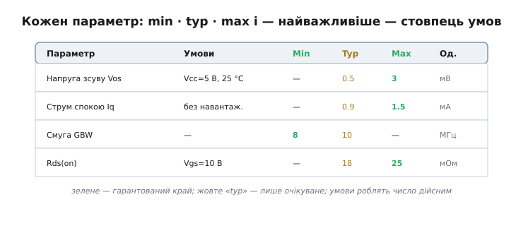
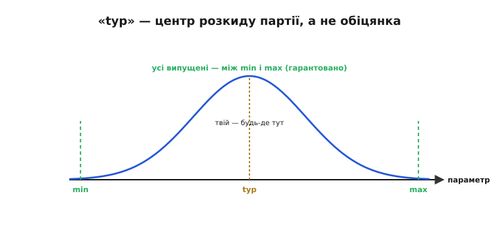
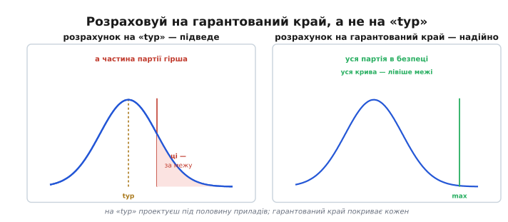
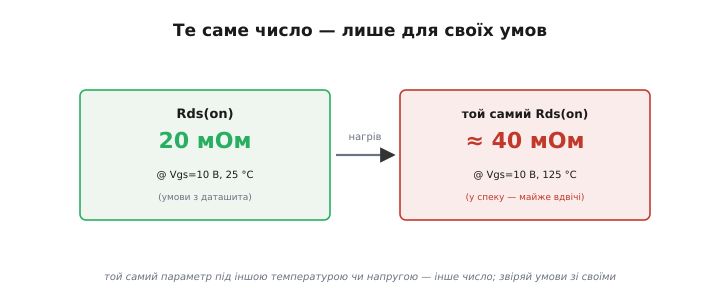
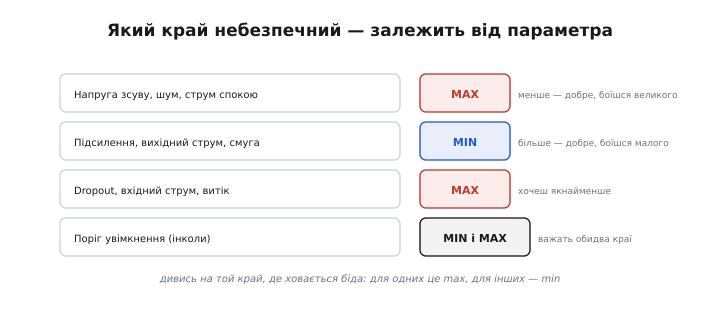
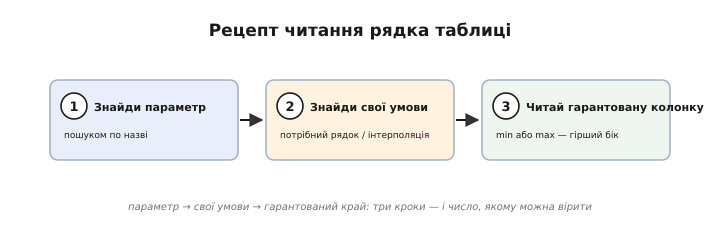

# Min/typ/max і умови вимірювання: чому «typ» — не обіцянка

Серце даташита — таблиця **Electrical Characteristics** (електричні характеристики). Саме тут живуть **числа**: підсилення, зсув, струми, опори — усе, на чому ви рахуватимете схему. І влаштована ця таблиця так, що недосвідчений читач бере звідти геть не ті значення й потім дивується, чому розрахунок не збігається з реальністю. Розберімо, як читати її правильно — бо одне число тут ніколи не буває просто «числом».

### Три колонки замість одного числа

Перше, що впадає в око: кожен параметр поданий не одним значенням, а **трьома** — у колонках **Min**, **Typ** і **Max** (від латинських *minimum* — найменше, *maximum* — найбільше, і англійського *typical* — типове, звичне). Плюс — критично важливий стовпець **Conditions** (умови).

*Кожен рядок — параметр зі своїми min / typ / max і умовами вимірювання. Зелені краї (min, max) — те, що виробник гарантує; жовтий «typ» — лише очікуване. Стовпець умов каже, за яких обставин ці числа взагалі дійсні.*

Чому три числа, а не одне? Бо жоден параметр не однаковий для всіх екземплярів і всіх умов. Виробник міг би дати одне «середнє» — але це обманювало б: ваш конкретний прилад майже напевно не точно такий. Тому замість обіцянки, яку не дотримати, дають **діапазон**: гарантовані краї плюс типове значення всередині. Навчитися знімати з цих трьох колонок **правильне** число — і є вся суть теми.

Зверніть увагу й на стовпець одиниць та на префікси: легко переплутати мВ із мкВ, нА з мкА — і помилитися на порядки. На цьому спотикаються чи не частіше, ніж на самих числах, тож завжди звіряйте, у чому виміряно параметр.

### «typ» — не обіцянка, а очікування

Найпоширеніша й найдорожча помилка новачка — узяти значення з колонки **Typ** і рахувати на нього. Бо «typ» — це **не** те, що вам гарантовано. Це **типове** значення: центр того розкиду, з яким сходять із конвеєра мільйони приладів.

*Параметри приладів партії розкидані дзвоном довкола середнього. «typ» — вершина цього дзвона, найімовірніше значення. Та гарантують виробники лише краї — min і max: усі випущені прилади лежать між ними. Ваш конкретний екземпляр може бути будь-де в цьому проміжку, не обов'язково на «typ».*

Уявіть параметр як зріст людей у великому натовпі: типовий — десь посередині, але трапляються і нижчі, і вищі, аж до крайніх меж. Так само з приладами: «typ» — це «найчастіше буває отак», але саме ваш екземпляр може виявитися ближчим до краю. Виробник чесно про це попереджає, даючи **min** і **max** — і **тільки їх** він зобов'язується витримати для **кожного** проданого приладу. «typ» же ні до чого не зобов'язує: це орієнтир, очікування, а не гарантія. Інколи параметр узагалі дають **лише** як «typ», без гарантованих меж, — таке число суто інформаційне, і покладатися на нього в розрахунку не можна зовсім.

Звідки взагалі береться той розкид? Кожен прилад — це мільйони мікроскопічних структур, надрукованих на кремнії; найдрібніші коливання процесу (товщини шарів, кількості домішок) роблять екземпляри трохи різними. Додайте вплив температури й старіння — і стане ясно, чому виробник не може пообіцяти одне точне число, лише діапазон. Це не недбалість, а чесне визнання фізики: ідеально однакових приладів не буває.

Навіщо ж тоді взагалі дають «typ»? Він корисний для **прикидки**: уявити, як прилад поводитиметься «зазвичай», оцінити споживання чи підсилення в типовому випадку, порівняти прилади між собою. Просто не для гарантійного розрахунку. До речі, вужчі гарантовані межі зазвичай **коштують дорожче**: виробник відбирає (сортує) кращі екземпляри в окремий, точніший сорт — звідси й «прецизійні» версії того самого чипа з мікровольтовим зсувом за більші гроші. Те, як [розкид партії за статистикою перетворюється на сорти](root:hw-components/min-typ-max/math-tolerance-statistics.md), і чому за вужчий край доплачують, варте окремого розбору.

### Чому розраховують на гарантований край

Звідси й залізне правило: серйозну схему рахують **по гарантованих межах**, а не по «typ». Бо якщо закластися на типове, схема працюватиме на **половині** приладів — а на інших, що випали на «гірший» бік розкиду, відмовить.

*Заклавшись на «typ», ви проектуєте під середину розкиду — а помітна частина партії, гірша за typ, випадає за вашу межу й підводить. Заклавшись на гарантований край (max чи min), ви покриваєте кожен екземпляр: уся крива лежить із безпечного боку.*

Візьмімо типовий рядок [електричних характеристик](root:hw-components/datasheet-structure): «typ» вхідний струм 1 нА, «max» — 10 нА. Розрахуєте на 1 нА — і схема працюватиме на більшості чипів, та зрідка трапиться екземпляр на 10 нА, і саме він зіпсує точний вимір. А розрахуєте на гарантовані 10 нА — і будь-який прилад із партії вкладеться. Парадокс лише уявний: ви ніби «перестраховуєтеся», беручи найгірше число, — але саме воно зветься гарантованим, бо тільки його обіцяно для всіх. Інженер проектує так, щоб схема працювала з **будь-яким** приладом, що відповідає даташиту, а не лише зі «щасливим» зразком зі свого столу.

Тонкість: не всі гарантовані числа однаково тверді. Частину параметрів **перевіряють на кожному** приладі на заводському тесті (100 % tested) — це найнадійніша гарантія. Іншу частину «гарантують за конструкцією» *(guaranteed by design)*: не міряють на кожному, а ручаються з розрахунку й вибіркових перевірок. Друге трохи слабше за перше, та все одно куди надійніше за «typ». У ретельних даташитах поряд із числом є позначка, до якого роду воно належить.

Та й перегинати не варто: брати найгірший бік **кожного** параметра водночас — це проектувати під прилад, якого, може, й не існує (усі параметри на межі одночасно — рідкість). Тому досвідчені інженери закладаються на гарантовані краї там, де параметр **критичний** для схеми, а другорядні беруть ближче до «typ» — баланс між надійністю й вартістю.

### Умови — половина числа

Тепер про стовпець, який недосвідчені читачі взагалі пропускають, — **Conditions**. А дарма: число без умов нічого не варте, бо той самий параметр під різними умовами **різний**.

*Опір відкритого MOSFET «20 мОм» дійсний лише за вказаних умов (Vgs = 10 В, 25 °C). У спеку (125 °C) той самий прилад має вже ≈40 мОм — майже вдвічі більше. Беручи число, завжди звіряйте умови його вимірювання зі своїми.*

Кожне число в таблиці виміряне за **конкретних** обставин: за певної температури, напруги живлення, навантаження, частоти. Змініть умови — зміниться й число. Опір відкритого ключа, виміряний при 25 °C, у спеку буде помітно більший; підсилення, виміряне на низькій частоті, на високій впаде; струм спокою при 5 В і при 3 В різний. Тому, виписуючи параметр, інженер дивиться **не лише на число, а й на рядок умов поруч** — і питає себе: «а мої умови такі самі?». Якщо ваша схема працюватиме при 85 °C, а число дане для 25 °C, — воно вам **не** підходить напряму; треба шукати значення для вашої температури (часто його дають окремим рядком чи [графіком залежності](root:hw-components/datasheet-graphs)). Це найтонша пастка таблиці: число ніби є, ви його берете — а воно не для вашого світу.

Дві практичні дрібниці про умови. По-перше, **виноски**: біля числа часто стоїть значок примітки, а внизу сторінки — рядок із додатковими умовами тесту («виміряно за такого навантаження», «усереднено за стільки-то зразків»). Їх читають, бо вони міняють сенс числа. По-друге, **температурний сорт** приладу: гарантовані min/max дійсні в усьому **робочому** діапазоні температур, а він залежить від сорту — комерційний (0…70 °C), індустріальний (−40…85 °C), автомобільний (−40…125 °C). Прилад «того самого» номера, але іншого сорту, гарантує свої числа у вужчому чи ширшому діапазоні — і коштує відповідно.

Той самий принцип — і з напругою живлення. Струм спокою, виміряний при 5 В, при 3.3 В буде інший; вихідний розмах при різних рейках теж. Тому, переносячи прилад на нижчу шину (а саме так роблять сучасні плати), не лінуйтеся перечитати ключові параметри для **вашої** напруги, а не для тієї, на якій їх зручно було виміряти виробникові. Інакше легко взяти красиве «вітринне» число, зняте за найвигідніших умов, а в реальній схемі дістати геть інше.

### Який край дивитися

Лишилося зрозуміти, **котру** з гарантованих колонок брати — min чи max. Відповідь залежить від того, з якого боку параметра ховається **біда**.

*Для одних параметрів небезпечний великий бік (зсув, шум, струм спокою, dropout — їх боїшся завеликими, тож дивишся max). Для інших — малий (підсилення, вихідний струм, смуга — їх боїшся замалими, тож дивишся min). А деякі (пороги) важать обома краями.*

Логіка проста: дивися на той край, де чаїться проблема. Боїтеся, що параметр буде **завеликим** (зсув спотворить вимір, струм спокою висадить батарею, dropout не дасть стабілізаторові втримати вихід) — берете **max**. Боїтеся, що **замалим** (підсилення не дотягне, вихідний струм не прокачає навантаження, смуга не встигне за сигналом) — берете **min**. А для деяких параметрів небезпечні **обидва** краї (наприклад, поріг спрацювання, що має лежати у вузькому вікні) — тоді перевіряють і min, і max. Колонка «typ» при цьому майже завжди лишається осторонь: вона для інтуїції, не для розрахунку.

Корисний прийом — перед тим як виписати число, спитати себе: «а що станеться, якщо цей параметр виявиться **гіршим**, ніж я гадаю?». Відповідь одразу показує небезпечний бік. «Гірше» — це більше (перегрів від струму спокою)? Дивишся max. «Гірше» — це менше (підсилювач не дотягне)? Дивишся min. Параметр, у якого зле з обох боків, перевіряєш обома краями. Звичка ставити це питання рятує від машинального хапання «typ».

### Рецепт читання рядка

Зведімо все до трьох кроків, які стають рефлексом.

*Знайди параметр (пошуком по назві) → знайди свої умови (потрібний рядок або інтерполяцію між ними) → читай гарантовану колонку (min або max — той бік, де біда). Три кроки — і в руках число, якому можна вірити.*

Отже: **перше** — знайти потрібний параметр (часто швидше пошуком по назві, ніж гортанням). **Друге** — знайти **свої** умови: якщо параметр дано для кількох температур чи напруг, узяти рядок, що відповідає вашим, а як точного нема — обережно проінтерполювати чи взяти найгірший. **Третє** — прочитати **гарантовану** колонку (min або max — той край, що небезпечний), а «typ» лишити для прикидки. Три кроки — і ви маєте число, з яким можна йти в розрахунок, певні, що воно дійсне для будь-якого приладу у ваших умовах.

Простежмо на рядку такої таблиці. Хай нас цікавить **напруга зсуву** ОП для точного вимірювача при кімнатній температурі. Знаходимо рядок «Vos» — умови «Vcc=5 В, 25 °C» збігаються з нашими, добре. Зсув псує точний вимір, тож небезпечний **великий** бік — беремо **max = 3 мВ** (а не typ 0.5 мВ!). Саме на 3 мВ і закладаємо похибку схеми. Узяли б 0.5 — і кожен інший прилад дав би в рази більший зсув, ніж ми розрахували, а схема брехала б у полі, хоч на столі й працювала.

> 🔧 **Навіщо це.** Головна таблиця даташита подає кожен параметр трійцею min / typ / max плюс умови — і читати її треба з трьома звичками. **Перша:** «typ» — не обіцянка, а очікуване; рахуй на **гарантований край** (min або max), бо тільки його витримає кожен прилад. **Друга:** дивись на той край, де ховається біда (завеликий зсув → max; замале підсилення → min). **Третя:** завжди звіряй **умови** числа зі своїми — те саме значення під іншою температурою чи напругою інше. Хто бере з таблиці «typ» за паспортне, той рано чи пізно складе схему, що працює лише на власному столі.
