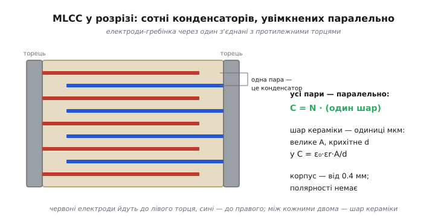
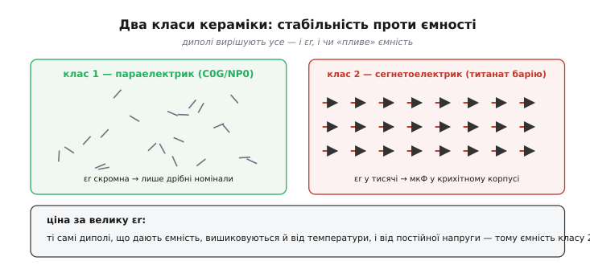
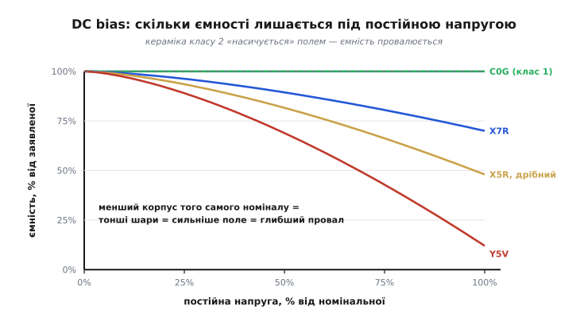

# MLCC

Розкривши майже будь-яку сучасну плату, ви побачите розсип крихітних безбарвних прямокутників — їх там сотні, більше за будь-яку іншу деталь. Це MLCC (англ. *multi-layer ceramic capacitor* — багатошаровий керамічний конденсатор): неполярний конденсатор без виводів, від 0.4 мм завдовжки, що паяється просто на контактні майданчики. Коштує він центи, має мізерні [послідовний опір і власну індуктивність](root:hw-components/capacitor-parasitics) — тому саме його ставлять [поряд із кожною мікросхемою для розв'язки живлення](root:hw-components/capacitor-uses), — і покриває діапазон ємностей від часток пікофарада до десятків мікрофарад. На корпусі зазвичай **нічого не написано**: розсипавши стрічку, номінал уже не відновити без вимірювання.

За цією буденністю ховається пастка. Той самий «10 мкФ», куплений у двох різних корпусах, на робочій напрузі може дати вдвічі різну ємність — і схема, що покладається на точне число, тихо попливе. Щоб розуміти, коли MLCC можна довіряти, а коли ні, треба зазирнути всередину.

## Будова: багато конденсаторів паралельно

Усередині корпусу — «гребінка»: десятки, а то й сотні шарів кераміки завтовшки в одиниці мікрометрів, між ними тонкі металеві електроди. Електроди виходять **через один** до протилежних металізованих торців: парні — до лівого, непарні — до правого. Кожна пара сусідніх електродів із шаром кераміки між ними — це маленький конденсатор; усі вони з'єднані торцями **паралельно**, тож [їхні ємності додаються](root:hw-components/capacitors-series-parallel).

Звідси й уся хитрість. [Ємність плоского конденсатора](root:ph-electromagnetism/capacitance) — це `C = ε₀·εr·A/d`: росте з площею пластин `A` і падає з відстанню між ними `d`. Багатошарова структура тисне на обидва важелі одночасно. Сотня шарів дає сотню паралельних пар — фактично велике сумарне `A`; а шар у кілька мікрометрів робить `d` крихітним. Перемноживши одне на одне в об'ємі з міліметр, отримуємо мікрофаради там, де одна пара пластин дала б пікофаради.


*Електроди виходять через один до різних торців; кожна пара сусідів — окремий конденсатор, а всі пари ввімкнені паралельно. Полярності немає — деталь працює будь-яким боком.*

> 🔧 **Навіщо це.** Мала власна індуктивність — пряме слідство цієї будови: струм заходить широкими торцями в сотні коротких електродів паралельно, а не в один довгий виток. Тому MLCC встигає віддати заряд за наносекунди, коли цифрова мікросхема смикає струм на перемиканні, — і саме за це він став головним конденсатором розв'язки.

## Класи кераміки

Уся різниця між «надійним» і «підступним» MLCC — у кераміці між електродами. Тут проходить вододіл на два класи.

**Клас 1** — стабільний параелектрик; найпоширеніший код **C0G**, він же **NP0** (англ. *negative-positive-zero* — натяк на майже нульовий температурний коефіцієнт). Його діелектрична проникність `εr` скромна, тому в одному корпусі вміщаються лише дрібні номінали — пікофаради й одиниці нанофарад. Зате ємність майже не залежить ні від температури, ні від напруги: дрейф нормують як 0 ±30 ppm/°C, тобто менш ніж 0.3 % у всьому діапазоні −55…+125 °C. Це конденсатор, ємність якого можна вважати числом.

**Клас 2** — сегнетоелектрик на основі титанату барію (BaTiO₃). Його `εr` сягає тисяч — звідси мікрофаради в крихітному корпусі. Але за велику проникність він платить нестабільністю: ємність «пливе» від температури, від прикладеної напруги й навіть повільно спадає з часом.


*Велику проникність класу 2 дають внутрішні диполі, які легко вишиковуються полем. Та сама легкість робить ємність залежною від температури й напруги — те, чого позбавлений клас 1.*

Чому така прірва, видно з механізму. Велика `εr` означає, що кераміка сильно поляризується у відповідь на поле — а в титанаті барію за це відповідають домени з власними диполями, які охоче розвертаються. Та сама податливість і робить клас 2 примхливим: усе, що зачіпає ці диполі — нагрів, постійна напруга, час, — зрушує і ємність.

## Розшифровка коду класу 2

Поведінку класу 2 кодують за стандартом EIA трьома знаками «літера-цифра-літера»: нижня межа робочої температури, верхня межа, найбільший дрейф ємності в цьому діапазоні.

```
літера → нижня T:   X = −55 °C   Y = −30 °C   Z = +10 °C
цифра  → верхня T:   5 = +85 °C   6 = +105 °C  7 = +125 °C
літера → дрейф ΔC:   R = ±15%     S = ±22%     V = +22…−82%
```

Звідси читаються три ходові марки та клас 1 поряд для порівняння:

```
X7R:      −55…+125 °C,   ΔC ≤ ±15%        робоча конячка
X5R:      −55…+85 °C,    ΔC ≤ ±15%        дешевше, у дрібних корпусах
Y5V:      −30…+85 °C,    ΔC +22…−82%      найдешевша, найнестабільніша
C0G/NP0:  клас 1,        ≈0 ±30 ppm/°C    для точних кіл
```

Ключове застереження: ці «±15 %» — **лише** температурний дрейф, виміряний без сигналу. Прикладена напруга додає свій, окремий і часто більший провал — і саме він найчастіше застає зненацька.

## DC bias: куди зникає ємність

Сегнетоелектрик має величезну `εr` саме тому, що його диполі легко вишиковуються полем. Але прикладена **постійна** напруга вишиковує їх заздалегідь — і на додаткову зміну заряду, з якої й народжується ємність, їх лишається менше. Ефективна `εr`, а з нею і ємність, **падає** з напругою. Це і є ефект **DC bias** — відхилення від [лінійної залежності заряду від напруги](root:ph-electromagnetism/capacitance), на яку конденсатор начебто має спиратися. Що тонші шари — тобто що **менший корпус** за того самого номіналу, — то сильніше поле в кераміці за тієї ж напруги й то глибший провал.


*C0G не пливе зовсім; X7R на повній номінальній напрузі втрачає десятки відсотків; дрібний X5R — близько половини; Y5V — майже все. Криві орієнтовні — точні беруть із графіка «Capacitance vs. DC bias» у даташиті конкретної деталі.*

Наслідок суто практичний. Конденсатор «10 мкФ X5R 0603» на шині 5 В — це реально 5–6 мкФ; той самий номінал у ще меншому корпусі 0402 — і того менше. Тому ємність розв'язки та фільтрів живлення рахують не за написом у каталозі, а за робочою точкою на кривій DC bias.

**Скільки ємності лишиться насправді.** Припис: фільтр на шині 3.3 В будуємо на «10 мкФ X5R 0402», даташит показує −55 % ємності за 3.3 В. Перевіримо, чи вистачить:

```c
// груба прикидка фактичної ємності на робочій напрузі
const float c_nominal = 10.0f;   // мкФ, напис у каталозі
const float derate    = 0.55f;   // частка втрати з даташита @3.3 В
float c_actual = c_nominal * (1.0f - derate);
// c_actual = 10.0 * 0.45 = 4.5 мкФ

const float c_needed = 6.0f;     // скільки треба фільтру
// 4.5 < 6.0  →  не вистачає: беремо більший корпус або два конденсатори
```

Висновок просто з арифметики: на робочій напрузі від паспортних 10 мкФ лишається 4.5 — менше за потрібні 6. Або більший корпус (товщі шари, менший провал), або два конденсатори паралельно.

## Типові граблі

- **Точні кола на класі 2.** Таймер, фільтр чи генератор, де ємність задає частоту, на X7R попливе з температурою й напругою — це одна з [неідеальностей реального конденсатора](root:hw-components/capacitor-parasitics). Де потрібне стале число — лише C0G або плівковий конденсатор.
- **Заміна корпусу «один в один».** Поставили 0402 замість 0805 того самого номіналу — і мовчки втратили половину ємності через сильніший DC bias. Номінал збігається, корпус — ні, поведінка інша.
- **«Спів» плати.** Кераміка класу 2 п'єзоелектрична: пульсації напруги змушують її механічно стискатися, плата вібрує й чути писк на звукових частотах. Працює це й навпаки — зовнішня вібрація народжує електричний шум у чутливих колах.
- **Тріщини від згину.** Кераміка крихка. MLCC біля краю плати, роз'єму чи кріпильного отвору тріскається, коли плату згинають, — а тріщина наскрізь може стати коротким замиканням просто по живленню. У відповідальних місцях ставлять корпуси з еластичними виводами (англ. *soft termination* — м'яка металізація, що гасить вигин) або два конденсатори послідовно.

## Варіації класу

Базову лінійку доповнюють спеціальні виконання: автомобільні з кваліфікацією AEC-Q200 на ширші температури й удари; високовольтні на сотні вольт із товщими шарами; низькоіндуктивні «перевернуті» корпуси для найшвидшої розв'язки; прецизійні C0G для високочастотних кіл. Але дев'ять із десяти MLCC на типовій платі — це X7R та X5R на розв'язці плюс жменя C0G там, де ємність мусить бути числом, а не «приблизно».

> 📜 Сама кераміка з гігантською проникністю — титанат барію — народилася під час Другої світової, коли воюючі країни шукали заміну дефіцитній слюді для конденсаторів і виявили, що BaTiO₃ дає більш як удесятеро вищу `εr`. Багатошарову конструкцію довели до промислового випуску американські виробники в 1960-х, а здешевив MLCC до сьогоднішніх центів японський перехід на дешеві нікелеві електроди замість срібно-паладієвих: масовий випуск таких конденсаторів запустила компанія Murata близько 1982 року.
