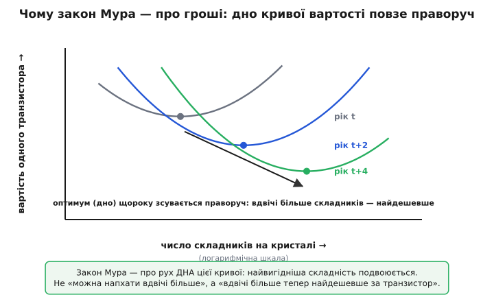
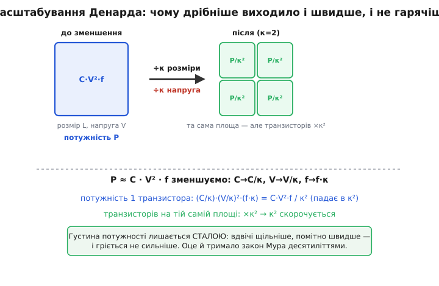

# Закон Мура: чому транзисторів на кристалі щороку вдвічі більше — і чому це обіцянка економіки, а не закон природи

Між першими мікросхемами 1960-х і чипом, що лежить у вашому телефоні, проліг розрив, який важко вкласти в голову: тоді на кристалі вміщалося кілька десятків транзисторів, тепер — десятки **мільярдів**. Це не плавне «з кожним роком трохи краще», як буває з двигунами чи акумуляторами. Це безперервне **подвоєння**: кожні приблизно два роки на тій самій площині кремнію опиняється вдвічі більше складників, ніж було. Шістдесят років поспіль. Саме цей оглушливий, неприродно рівний темп і називають законом Мура.

І перше, що про нього треба засвоїти, — він **не закон природи**. Закон Ома випливає з фізики провідника й виконується сам собою; його не можна «не дотриматися». Закон Мура — це **спостереження за галуззю плюс її ж самосправджувана мета**. Ґордон Мур не відкрив силу, що змушує транзистори дрібнішати. Він помітив **тренд у графіку** й сказав: якщо так піде далі, ось що буде. Галузь прочитала це як план — і тридцять років усім світом гнала технологію, щоб тренд справдився. Тому правильніше казати не «закон Мура працює», а «галузь поки що тримає темп закону Мура». Різниця тонка, але вона вирішує все: закон природи не можна порушити, а економічну обіцянку — можна, і саме це з нею тепер і відбувається.

> 🔧 **Навіщо це.** Інженер не «користується» законом Мура як формулою — він на нього **планує**. Закладаючи виріб, що вийде через три роки, ви прикидаєте: на той час за ті самі гроші чипи матимуть удвічі-вчетверо більше пам'яті, обчислень, інтеграції. На цьому стоять дорожні карти продуктів, ціни, обіцянки замовникам. А коли темп ламається (а він ламається), ті самі плани треба перебудовувати — інакше закладаєте зростання, якого вже не буде. Розуміти **чому** закон тримався й **чому** тепер сповільнюється — значить не наосліп екстраполювати графік, а бачити, де він зігнеться.

### Що саме подвоюється — і чому це насправді про гроші

Ходяча версія закону — «потужність комп'ютерів подвоюється щодва роки» — зручна, але змазана. Мур говорив про щось точніше й несподівано приземлене. Подивімося, що він **насправді** виміряв.

У 1965-му Мур, тоді директор досліджень у Fairchild Semiconductor, мав під рукою лише кілька точок даних — мікросхеми, випущені між 1959 і 1965 роками. Він наніс на графік не «швидкість» і не «потужність», а **кількість складників на тій мікросхемі, що дає найдешевший складник**. Ось де ключ, який зазвичай губиться. Зробити кристал із дуже малою кількістю транзисторів дорого **в перерахунку на транзистор** — накладні витрати корпусу, виводів, випробування діляться на жалюгідну жменьку. Напхати ж у кристал занадто багато для тодішньої технології теж дорого: що складніший чип, то більша ймовірність, що десь у ньому буде дефект, — а один дефект викидає весь кристал. Між цими двома схилами є **дно**: певна кількість транзисторів, за якої ціна одного складника найнижча.


*Для кожного року є крива «вартість одного транзистора залежно від того, скільки їх на кристалі»: ліворуч дорого через накладні витрати, праворуч — через дефекти й малий вихід придатних. Закон Мура — про те, що дно цієї U-подібної кривої щороку зсувається праворуч: оптимальна (найдешевша) складність подвоюється.*

Мурове спостереження було саме про **рух цього дна**. Технологія дешевшає й чистішає так, що оптимальна точка — найвигідніша складність — щороку подвоюється. Не «можна напхати вдвічі більше», а «вдвічі більше тепер **вигідно**, бо так найдешевше за транзистор». Це робить закон Мура передусім **економічним** твердженням, а вже потім технічним. Транзистори дрібнішають не тому, що інженерам кортить, а тому, що дрібніший транзистор — **дешевший** транзистор, і ринок невпинно тягне туди, де дешевше.

Звідси випливає те, що дивує початківця найбільше: головний наслідок закону Мура — не «швидше», а «дешевше за функцію». Швидкість, пам'ять, інтеграція — усе це похідні. Корінь — **вартість одного транзистора падає експоненційно**, і вже це падіння тягне за собою решту.

> Хто такий Ґордон Мур, як з'явилися ті п'ять-шість точок на графіку 1965 року, чому стаття називалася «Cramming more components onto integrated circuits», як у 1975-му Мур **сам переглянув** свій прогноз із подвоєння щороку на подвоєння щодва роки, і чому «закон Мура» його назвав не він, а Карвер Мід, — у вставці [як народився закон Мура](root:hw-components/moore-law/hist-moore-prediction.md). Тут ми беремо закон як готовий тренд і розбираємо, **чому** він тримався й **чому** ламається.

### Подвоєння — це не «трохи більше», це вибух

Слово «подвоєння» звучить буденно, але за ним ховається експонента, а інтуїція людини до експонент сліпа. Проживімо це в числах, бо без цього масштаб закону Мура не відчути.

Нехай якогось року на кристалі вміщається N транзисторів. Через два роки — 2N. Ще через два — 4N. Через десять років (п'ять подвоєнь) — 2⁵ = 32N. За двадцять років — 2¹⁰ = 1024N, **у тисячу разів** більше. За тридцять — мільйон разів. Жодна лінійна звичка тут не допомагає: коли кажуть «зростає щороку», уявляється драбинка, а тут — стіна, що йде в небо. Саме тому той розрив між десятками транзисторів 1960-х і десятками мільярдів сьогодні — не дивовижа, а проста арифметика тридцяти подвоєнь поспіль.

Перекладімо це на щось, що можна порахувати в коді — у скільки разів виросте кількість транзисторів за задане число років при подвоєнні щодва роки:

:::tabs
```cpp
#include <cmath>

// У скільки разів зросте складність за `years` років
// при подвоєнні кожні `double_time` років (закон Мура: double_time = 2).
double moore_factor(double years, double double_time) {
    double doublings = years / double_time;   // скільки подвоєнь сталося
    return std::pow(2.0, doublings);          // кожне подвоєння — множник 2
}

// Приклад: транзистори на флагманському чипі.
// 1971: Intel 4004 — 2300 транзисторів.
// Скільки прогнозує закон Мура через 50 років (до 2021)?
double base   = 2300.0;
double factor = moore_factor(50.0, 2.0);      // 2^(50/2) = 2^25 ≈ 33.5 млн
double pred   = base * factor;                // ≈ 7.7×10¹⁰ — близько 77 мільярдів
```
```python
# У скільки разів зросте складність за `years` років
# при подвоєнні кожні `double_time` років (закон Мура: double_time = 2).
def moore_factor(years, double_time):
    doublings = years / double_time   # скільки подвоєнь сталося
    return 2.0 ** doublings           # кожне подвоєння — множник 2

# Приклад: транзистори на флагманському чипі.
# 1971: Intel 4004 — 2300 транзисторів.
# Скільки прогнозує закон Мура через 50 років (до 2021)?
base   = 2300.0
factor = moore_factor(50.0, 2.0)      # 2^(50/2) = 2^25 ≈ 33.5 млн
pred   = base * factor                # ≈ 7.7e10 — близько 77 мільярдів
```
:::

**Що каже ця прикидка.** 2³⁰ ≈ 33.5 млн помножити на 2300 дає близько 77 мільярдів транзисторів до 2021 року. І це не пальцем у небо: процесор Apple M1 Ultra (2022) має 114 мільярдів транзисторів, графічний чип NVIDIA GB202 (2025) — понад 92 мільярди. Груба експонента, проведена крізь півстоліття від чипа з 2300 транзисторів, влучає в правильний **порядок величини** — і це найкраще свідчення, наскільки рівно тримався темп. Жоден інший показник техніки не дозволяє екстраполювати на п'ятдесят років уперед і не схибити на порядки.

> Точне виведення: чому подвоєння — це експонента 2^(t/T), як перейти від «подвоєння щодва роки» до річного темпу зростання (≈ 41% на рік), звідки взялися «18 місяців», які насправді стосуються не кількості транзисторів, а швидкодії, і як рахувати наведену вартість одного транзистора в часі — у вставці [арифметика подвоєння](root:hw-components/moore-law/math-doubling.md). Тут досить самої ідеї: подвоєння через рівні проміжки — це експоненційне зростання, і воно вибухове.

### Чому це трималося шістдесят років: двигун під капотом

Тут постає чесне питання, повз яке прослизають усі популярні переказки. Гаразд, дрібніший транзистор дешевший — але **чому** дрібнішання так довго давало одночасно й дешевше, й швидше, й холодніше? Адже зазвичай у техніці за одне платиш іншим. Чому десятиліттями вдавалося зменшувати транзистор і **не наражатися** на розплату? Відповідь — окрема, глибша закономірність, яку часто плутають із самим законом Мура, хоча це інше.

У 1974 році Роберт Денард з IBM зі співавторами показав чудову річ про польовий транзистор (MOSFET). Якщо зменшувати **всі** його розміри в однакове число разів κ — довжину, ширину, товщину підзатворного шару — і **одночасно** в κ разів піднімати концентрацію домішки та в κ разів знижувати напругу живлення, то транзистор не просто стає меншим. Він стає меншим **і кращим за всіма статтями водночас**: перемикається швидше, споживає менше, а головне — **густина потужності лишається сталою**. Тобто на одиниці площі кристала виділяється стільки ж тепла, скільки й до зменшення, попри те що транзисторів на цій площі тепер удвічі більше. Це й називають масштабуванням Денарда.

Ось де закон Мура й теорія електричних кіл зчіплюються в одне. Розгляньмо, чому густина потужності трималася. Динамічна потужність, яку поглинає цифрова комірка на кремнії, описується простим виразом теорії кіл:

```
P ≈ C · V² · f
```

де C — ємність вузла, V — напруга живлення, f — частота перемикання. Кожен перемик заряджає й розряджає паразитну ємність вузла, а енергія, запасена в ємності, — це ½CV². Тепер прокрутімо масштабування Денарда крізь цю формулу. Зменшуємо розміри в κ разів: ємність C (вона пропорційна розмірам) падає в κ разів. Напругу V теж знижуємо в κ разів — отже, V² падає в κ² разів. Частоту f можна **підняти** в κ разів, бо менший, тонший транзистор перемикається швидше. Перемножмо:

```
P_нова ≈ (C/κ) · (V/κ)² · (f·κ) = C·V²·f / κ²
```

Потужність **одного** транзистора падає в κ² разів. А скільки транзисторів тепер уміщається на тій самій площі? Площа кожного впала в κ² разів — отже, на тій самій ділянці їх стало в κ² разів **більше**. Помножте впалу-в-κ² потужність кожного на вирослу-в-κ² їх кількість — і κ² скорочується. Сумарна потужність на одиницю площі **не змінюється**.


*Зменшення всіх розмірів у κ разів плюс зниження напруги в κ разів: потужність кожного транзистора падає в κ², але на тій самій площі їх стає в κ² більше — добуток сталий. Саме це давало «вдвічі більше транзисторів без зростання нагріву» й тримало закон Мура десятиліттями.*

Оце і є двигун, що тягнув закон Мура. Поки масштабування Денарда працювало, кожне нове покоління технології давало вдвічі щільніший, помітно швидший кристал, який **гріється не сильніше за попередній**. Це був справжній безкоштовний обід: і густіше, і швидше, і не гарячіше — за одне зменшення. Закон Мура рахував транзистори; масштабування Денарда пояснювало, **чому** ці транзистори вдавалося напхати, не спаливши кристал. Два різні твердження, але саме їхній збіг створив золоту добу, коли процесори щороку самі собою ставали швидшими.

> Повне масштабування Денарда — як саме змінюються затримка, струм, поле, чому константа поля рятує надійність, чому концентрацію домішки треба піднімати в κ разів, і де ця ідеалізація розходиться з реальним транзистором, — окрема тема [масштабування MOSFET і закон Денарда](root:hw-components/mosfet-scaling). Тут важливе одне: доки воно діяло, зменшення транзистора було чистим виграшем без розплати, і це й живило закон Мура.

### Чому темп ламається: атоми, струми витоку й стіна потужності

Безкоштовних обідів не буває довго, і десь у середині 2000-х за столик прийшов рахунок. Зрозуміти, чому закон Мура сповільнюється, — значить побачити, де саме впирається фізика, бо економічну обіцянку врешті обмежує саме вона.

Перший і найгучніший удар — **масштабування Денарда зламалося** близько 2005–2006 років. Причина — у тій самій формулі P ≈ C·V²·f, тільки тепер вона працює проти нас. Щоб тримати густину потужності сталою, треба було далі знижувати напругу V. Але напругу не можна знижувати безкінечно: транзистор відмикається лише тоді, коли напруга на затворі впевнено перевищує **поріг відмикання**, а сам поріг знизити важко — нижче за нього транзистор перестає по-справжньому замикатися й починає **підтікати**. Через закритий, але вже надто «низькопороговий» транзистор тече **струм витоку** (*leakage*), і цей струм гріє кристал, навіть коли той нічого не обчислює. Коли напругу перестали знижувати, член V² у формулі застиг, а транзисторів на площі більшало — і густина потужності полізла вгору. Кристал уперся в **стіну потужності** (*power wall*): далі підвищувати частоту стало нічим — тепло нікуди дівати.

Саме тому десь із 2005 року тактова частота настільних процесорів **перестала рости** і застрягла на кількох гігагерцах, де стоїть і досі. До того кожне покоління саме собою бігало швидше; відтоді — ні. Галузь зробила вимушений поворот: якщо не можна гнати **один** процесор швидше, поставмо на кристал **кілька** повільніших ядер і розпаралельмо роботу. Так народилася доба багатоядерних процесорів — не від хорошого життя, а тому, що в одинарну швидкість уперлися в стіну тепла. Закон Мура (транзисторів усе ще більшає) тривав, але обіцянка «і вони самі собою швидші» — урвалася разом із масштабуванням Денарда.

Другий удар підкрадається з іншого боку — з **розміру атома**. Сучасні транзистори вже такі дрібні, що ключові їхні шари рахуються одиницями атомів завтовшки. Підзатворний діелектрик тоншав, доки крізь нього не **потекло квантове тунелювання** — електрони почали просто просочуватися крізь бар'єр, який класично мав бути непроникним. Канал звузився настільки, що окремі атоми домішки вже помітно міняють поведінку транзистора, і два сусідні транзистори, зроблені однаково, виходять різними. Маркетингові «нанометри» (наприклад, «3 нм») давно вже не дорівнюють жодному фізичному розміру на кристалі — це назва покоління технології, а не довжина. А справжні розміри підбираються до межі, нижче за яку транзистор перестає бути транзистором: кільком атомам не накажеш надійно тримати замкнений і відкритий стан.

> 🔧 **Навіщо це.** Для розробника це означає кінець епохи «зачекай два роки — і той самий код побіжить удвічі швидше сам собою». Однопотокова швидкість майже стоїть. Виграш тепер дають **паралельність** (багато ядер, GPU), **спеціалізовані прискорювачі** (нейромережеві блоки, апаратні кодеки) і **щільніша інтеграція**, а не зростання частоти. Хто й досі планує продукт, наосліп екстраполюючи стару криву «само стане швидшим», закладе зростання, якого не буде. Реальний важіль перемістився з «чекати кращого заліза» на «писати під багато ядер і прискорювачі».

### Не закон, а дороговказ: що з ним робити інженерові

Підсумуймо чесно, чим закон Мура є й чим не є, бо плутанина тут коштує дорого. Це **не рівняння**, з якого щось виводять, і **не сила природи**, яка діятиме сама. Це **спостережений тренд**, що шістдесят років слугував галузі спільною метою й самосправджувався, бо всі в нього вірили й під нього вкладалися. Доки під ним крутився двигун масштабування Денарда, тренд давав і густіше, і швидше, і дешевше за одне зменшення. Двигун заглух у середині 2000-х — і відтоді закон тримається наполовину: транзисторів **усе ще** більшає (хоч повільніше й дорожче), але дармова швидкість скінчилася.

Що це означає на практиці? По-перше, **планувати, але з виправкою на згин**. Закладати, що за три роки за ті самі гроші чипи матимуть більше транзисторів, досі розумно — але вже **не подвоєння щодва роки**, а помітно повільніше, і кожне покоління коштує заводу дедалі дорожче. По-друге, **шукати виграш не там, де раніше**. Колишній приріст ішов сам — від частоти; теперішній доводиться **брати руками** — паралельністю, спеціалізованими блоками, тіснішою інтеграцією пам'яті й логіки. Звідси гасло «**More than Moore**» (більше, ніж Мур): коли далі дрібнити транзистор стає невигідно, виграш беруть з іншого — складають кристали в **стос** (3D-інтеграція), кладуть поряд у спільному корпусі різні **чиплети**, додають аналогові й радіочастотні вузли, давачі, фотоніку. Не «ще вдвічі дрібніше», а «розумніше скласти те, що є».

І наостанок — головна звичка думки. Коли наступного разу хтось проведе пряму лінію крізь графік і скаже «отже, через десять років буде ось стільки», згадайте, що під тією лінією весь час крутився конкретний фізичний двигун. Лінія трималася, **доки крутився двигун**. Денардів двигун уже заглух; на черзі — стіна атомного розміру. Закон Мура — це не пророцтво, яке справдиться саме, а опис того, що галузь **поки що спромоглася зробити**. Хто це бачить, той не екстраполює наосліп, а питає щоразу: а що саме тягне криву зараз — і чи не от-от воно скінчиться.

### Що варто винести

Закон Мура — це спостереження, що **кількість транзисторів на кристалі при найдешевшій вартості одного складника подвоюється** приблизно щодва роки (спершу Мур сказав «щороку», у 1975-му **сам** виправив на «щодва роки»). Це передусім **економічне** твердження — про падіння вартості одного транзистора, — а вже потім технічне; і це **не закон природи**, а самосправджувана мета галузі. Подвоєння через рівні проміжки — **експонента**: тридцять подвоєнь перетворюють десятки транзисторів на десятки мільярдів, і груба екстраполяція крізь півстоліття влучає в правильний порядок. Тримався закон так довго завдяки **масштабуванню Денарда**: зменшення всіх розмірів і напруги в κ разів лишало густину потужності сталою (з P ≈ C·V²·f густіше **й** швидше **й** не гарячіше), тож зменшення транзистора було чистим виграшем без розплати. Двигун заглух близько 2005 року, коли напругу далі знижувати стало нікуди (поріг, **струми витоку**), частота вперлася в **стіну потужності** — і галузь повернула на **багатоядерність**. Другий бар'єр — **атомний розмір** і квантове тунелювання. Тому сьогодні закон тримається наполовину: транзисторів більшає, але дармова швидкість скінчилася, а виграш беруть паралельністю, прискорювачами й тіснішою інтеграцією («More than Moore»). Хто бачить **двигун** під кривою, той не екстраполює пряму наосліп, а знає, що тренд триває рівно доти, доки під ним щось крутиться.

---
