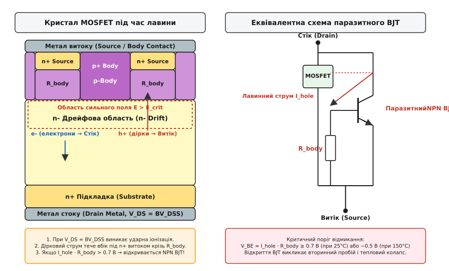
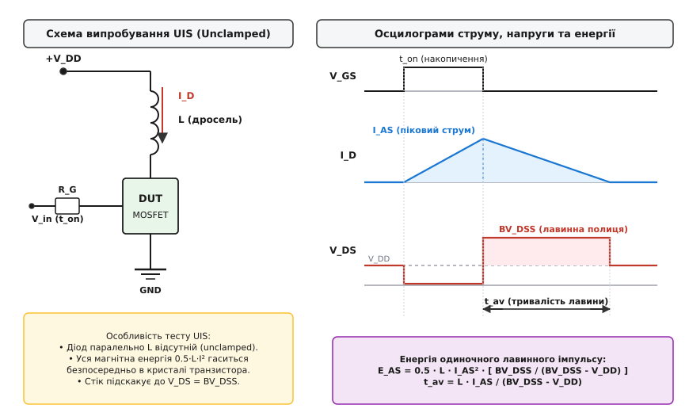
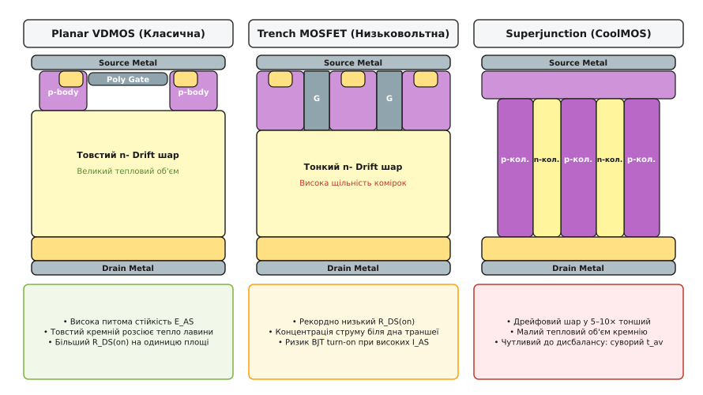
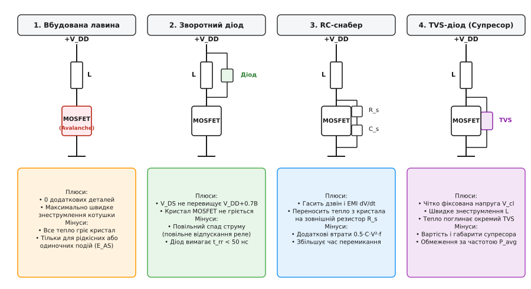

# Лавинна робота MOSFET

<preknowlist>
- [Опір каналу Rds(on)](topic:hw-components/rds-on) — провідний стан силового ключа та статичне падіння напруги на ньому.
- [Брикання котушки](topic:hw-components/inductor-kickback) — стрибок напруги самоіндукції під час розриву струму в індуктивному навантаженні.
- [Зміщення діода](topic:hw-components/diode-bias) — поведінка p-n переходу при зворотному зміщенні та напруга пробою.
- [Робота BJT](topic:hw-components/bjt-operation) — емітерний перехід, база та механізм відмикання біполярного транзистора.
- [Тепловий ланцюжок](topic:hw-components/thermal-chain) — перехідний тепловий опір, ємність кристала та розсіювання тепла переходом.
</preknowlist>

Коли силове коло розмикає струм у кілька десятків амперів за лічені наносекунди, навіть паразитна індуктивність провідників друкованої плати у 20–50 нГн генерує високовольтний сплеск напруги самоіндукції, здатний багаторазово перевищити напругу живлення. Якщо ж навантаженням є реальна обмотка соленоїда, реле чи двигуна з власною індуктивністю в одиниці або десятки мілігенрі, енергія розриву магнітного поля становить сотні міліджоулів.

Силовий польовий транзистор із каналом збагачення (MOSFET, Metal-Oxide-Semiconductor Field-Effect Transistor), на відміну від дрібносигнальних логічних транзисторів, розрахований на роботу в умовах таких перенапруг. Замість миттєвого руйнування при перевищенні паспортної напруги стоку `BV_DSS` він може переходити в контрольований режим лавинного пробою (Avalanche Breakdown), тимчасово перетворюючись на потужний стабілітрон і поглинаючи магнітну енергію безпосередньо своїм кремнієвим кристалом. Проте межа між безпечним лавинним поглинанням енергії та катастрофічним тепловим вибухом напівпровідника визначається тонкою взаємодією фізики ударної іонізації, паразитного біполярного транзистора та теплової динаміки.

### Фізика лавинного пробою в силовому кристалі

Усі сучасні кремнієві силові транзистори будуються за вертикальною структурою (Vertical DMOS або Trench MOSFET). Струм у них тече не вздовж поверхні пластини, як в інтегральних мікросхемах, а вертикально крізь усю товщу напівпровідника — від виводів витоку на верхньому боці кристала до металізованої підкладки стоку на нижньому.

Вертикальний стек складається з чотирьох послідовних шарів: сильнолегованого n+ контакту витоку, p-подібної кишені тіла (p-body), слаболегованого епітаксійного шару дрейфу (n- drift) і сильнолегованої підкладки стоку (n+ substrate).

Коли на затвор подано нульову напругу (`V_GS = 0 В`), а до стоку прикладено високу додатну напругу відносно витоку (`V_DS > 0`), p-n перехід, утворений областю p-body та епітаксійним n- дрейфовим шаром, опиняється під зворотним зміщенням.

Під дією прикладеної напруги вільні носії заряду відтягуються від металургійної межі переходу: дірки відходять углиб p-body до верхнього контакту витоку, а електрони — через n- шар до нижнього контакту стоку. Навколо переходу формується збіднена область (Space Charge Region), повністю позбавлена вільних носіїв, яка складається лише з нерухомих іонізованих атомів легувальної домішки: негативних акцепторів у p-області та позитивних донорів у n-області.

Оскільки шар дрейфу n- легований значно слабше, ніж p-body, практично вся ширина збідненої області та все падіння напруги `V_DS` зосереджуються саме в n- дрейфовій зоні.

Зі зростанням напруги `V_DS` напруженість електричного поля всередині збідненого шару зростає. Розподіл електричного поля має форму трикутника з максимумом `E_max` на самій межі переходу:

```
E_max = (2 · V_DS) / W_dep
```

де `W_dep` — ширина збідненого шару.

Коли напруженість поля досягає критичної позначки `E_crit ≈ 2–3 · 10⁵ В/см` (для кремнію), розпочинається процес **ударної іонізації** (Impact Ionization).

Вільні електрони, які потрапляють у зону високого поля внаслідок теплової генерації або струму витоку, розганяються електричним полем до величезних швидкостей. Їхня кінетична енергія перевищує ширину забороненої зони напівпровідника (`E_g = 1.12 еВ` для кремнію при кімнатній температурі).

Зіштовхуючись із нейтральними атомами кристалічної ґратки кремнію, такий високоенергетичний електрон вибиває зв'язаний валентний електрон у зону провідності. У результаті одного зіткнення замість одного вільного електрона утворюються два вільні електрони та одна дірка — виникає нова електронно-діркова пара.

Новонароджені носії негайно підхоплюються тим самим сильним електричним полем: електрони прискорюються в бік стоку (+), а дірки — в бік витоку (−). На своєму шляху вони знову зіштовхуються з атомами ґратки й породжують нові покоління пар. Процес набуває лавиноподібного (експоненційного) характеру:

```
M = 1 / [ 1 - (V_DS / BV_DSS)ⁿ ]
```

де `M` — коефіцієнт лавинного розмноження носіїв, а показник степеня `n` для кремнієвих p-n переходів зазвичай становить від 3 до 6.

Коли напруга `V_DS` наближається до напруги лавинного пробою `BV_DSS` (Breakdown Voltage Drain-Source), знаменник прямує до нуля, а коефіцієнт `M` прямує до нескінченності. Лавинний пробій стає самопідтримуваним: крізь кристал починає протікати масивний струм, а напруга на стоці перестає зростати й жорстко стабілізується на рівні `BV_DSS`.


*Зліва: вертикальний розріз кристала силового MOSFET під час лавини з ударною іонізацією в n- дрейфовій зоні та бічним дірковим струмом крізь опір R_body. Справа: еквівалентна електрична схема із паразитною NPN біполярною структурою.*

### Паразитний BJT та механізм вторинного теплового пробою

Сам по собі лавинний пробій кремнієвого p-n переходу є оборотним процесом: якщо обмежити струм і не допустити перегріву, після зняття високої напруги структура повністю відновлює свої ізоляційні властивості. Проте в силовому польовому транзисторі існує внутрішня небезпека, закладена в саму топологію його комірок — **паразитний біполярний транзистор** (Parasitic NPN BJT).

Погляньмо на послідовність напівпровідникових областей від верхнього контакту до нижнього:
1. Сильнолегований витік `n+ Source` (виконує роль емітера біполярного транзистора);
2. Кишеня `p-Body` (виконує роль бази біполярного транзистора);
3. Дрейфовий шар `n- Drift` разом із підкладкою `n+ Substrate` (виконує роль колектора біполярного транзистора).

Ці три шари утворюють повноцінний біполярний n-p-n транзистор, увімкнений паралельно робочому каналу польового транзистора.

У нормальному режимі роботи виробники надійно блокують цей біполярний транзистор: верхня металізація витоку одночасно накриває як n+ витік, так і вихід p-body на поверхню, закорочуючи емітер і базу накоротко (`V_BE = 0 В`).

Проте під час лавинного пробою ситуація різко змінюється. Згенерований в об'ємі дрейфового шару лавинний струм розділяється на два потоки:
- Електрони рухаються вниз до додатно зміщеного стоку.
- Дірки рухаються вгору в область p-body, прямуючи до контакту витоку, щоб покинути кристал.

Геометрія комірки змушує цей дірковий струм `I_hole` протікати в бічному (горизонтальному) напрямку під тонким дифузійним шаром n+ витоку, перш ніж він дістанеться металевого контакту.

Шар p-body безпосередньо під n+ витоком має дуже малу товщину і кінцевий питомий опір, який в інженерній практиці називають **бічним опором тіла** або опором вищипування (Pinch Base Resistance, `R_body`).

Протікаючи крізь цей розподілений опір `R_body`, дірковий струм створює омічне падіння напруги:

```
V_BE_parasitic = I_hole · R_body
```

Ця напруга прикладена прямо між областю p-body (базою) та областю n+ витоку (емітером).

Щойно добуток `I_hole · R_body` досягає порогової напруги відмикання кремнієвого емітерного переходу (близько `0.65–0.70 В` при температурі 25 °C), паразитний біполярний n-p-n транзистор відкривається.

Відкриття паразитного BJT запускає катастрофічний ланцюг подій, відомий як **вторинний біполярний пробій** (Bipolar Second Breakdown / BJT Turn-On):

1. **Інжекція електронів:** Відкритий n+ емітер починає масивно інжектувати електрони в p-базу, які пролітають у збіднений колекторний шар.
2. **Спад напруги утримання (Snapback):** Напруга пробою біполярного транзистора з відкритою базою `BV_CEO` (Collector-Emitter with Open Base) фізично значно нижча за лавинну напругу p-n переходу `BV_CBO` (яка і є паспортною `BV_DSS`). Для силового кремнію типове співвідношення становить:

```
BV_CEO ≈ (0.5 ... 0.65) · BV_DSS
```

3. **Колапс напруги та шнурування струму:** Напруга на стоці транзистора миттєво падає від високої лавинної полиці `BV_DSS` до низького рівня `BV_CEO`. Проте зовнішнє індуктивне навантаження працює як джерело незмінного струму (`L` не дозволяє струму миттєво зменшитися).
4. **Утворення гарячої плями (Hot-Spot):** Через неминучі мікроскопічні неоднорідності кристала паразитний транзистор відкривається нерівномірно по всій площі, а в одній найгарячішій або найменш легованій мікрокомірці. Увесь індуктивний струм багатоамперного транзистора раптово стягується в мікроскопічний шнур діаметром у кілька мікрометрів (Current Filamentation).
5. **Теплове руйнування:** Густина струму в цьому локальному шнурі перевищує мільйони амперів на квадратний сантиметр. Температура в точці шнурування за частки мікросекунди перетинає точку плавлення кремнію (+1414 °C). Кристал локально випаровується, пропалюючи наскрізний струмопровідний кратер між стоком, витоком і тонким затворним оксидом.

Транзистор перетворюється на незворотне коротке замикання між усіма трьома виводами (Drain-Source-Gate Short).

Щоб мінімізувати опір `R_body`, сучасні виробники напівпровідників застосовують складні технологічні прийоми: глибоке високодозне імплантування іонів бору (`p+ Heavy Body`) точно під центром контакту витоку, самосумісне травлення металізації з заглибленням у кремній та скорочення довжини n+ витокової смужки. Завдяки цьому якісні сучасні транзистори здатні витримувати значні лавинні струми без увімкнення паразитного біполярного транзистора аж до досягнення суто теплової межі кристала.

### Схема випробування на нефіксовану індуктивну комутацію (UIS)

Для стандартизованої перевірки здатності силового транзистора поглинати енергію перенапруг без руйнування міжнародні стандарти (JEDEC JESD24-5, MIL-STD-750) визначають процедуру випробування на **нефіксовану індуктивну комутацію** (Unclamped Inductive Switching, UIS).

Слово *Unclamped* («нефіксована») означає, що паралельно дроселю в схемі випробування принципово **не встановлюють жодних захисних діодів, супресорів чи демпферів**. Уся енергія магнітного поля, накопичена в дроселі, під час вимикання має бути поглинута виключно випробовуваним транзистором.


*Схема випробувального стенда UIS та часові діаграми напруги затвора V_GS, струму стоку I_D та напруги стоку V_DS під час накопичення енергії та її лавинного скидання.*

Робота схеми UIS складається з двох послідовних фаз:

#### Фаза 1: Накопичення енергії (Charge Phase, тривалість `t_on`)
На затвор закритого транзистора від генератора імпульсів подається сигнал відкривання `V_GS` (наприклад, 10 або 12 В). Транзистор відкривається, його опір падає до значення `R_DS(on)`. До випробувального дроселя `L` прикладається майже повна напруга джерела постійного струму `V_DD`.

Струм стоку `I_D(t)` починає лінійно наростати з постійною швидкістю:

```
di / dt = V_DD / L
```

Тривалість імпульсу `t_on` підбирається такою, щоб струм досяг точно заданого випробувального значення `I_AS` (лавинного струму):

```
I_AS = (V_DD / L) · t_on
```

До кінця фази накопичення в магнітному полі дроселя запасається енергія:

```
E_L = (1/2) · L · I_AS²
```

#### Фаза 2: Лавинний розряд (Avalanche Phase, тривалість `t_av`)
У момент досягнення струму `I_AS` затворний драйвер різко притягує затвор транзистора до землі (`V_GS = 0 В`). Провідний канал транзистора миттєво зникає.

Індуктивність `L`, прагнучи підтримати струм неперервним, змінює полярність напруги на своїх виводах і викидає ЕРС самоіндукції `e_L = -L · (di/dt)`. Потенціал стоку підскакує вгору, миттєво пролітає рівень живлення `V_DD` і сягає напруги пробою кристала `BV_DSS`.

У цей момент у транзисторі відкривається зворотний лавинний перехід, який жорстко обмежує напругу стоку на рівні `BV_DSS`.

Струм індуктивності починає спадати, протікаючи крізь об'єм напівпровідника під напругою `BV_DSS`. Рівняння спаду струму має вигляд:

```
di / dt = -(BV_DSS - V_DD) / L
```

Оскільки різниця `BV_DSS - V_DD` залишається практично сталою, струм спадає за строго лінійним законом від `I_AS` до нуля.

Тривалість лавинного імпульсу `t_av` (Avalanche Time) визначається як:

```
t_av = (L · I_AS) / (BV_DSS - V_DD)
```

Упродовж усього інтервалу `t_av` транзистор одночасно перебуває під граничною напругою `BV_DSS` та проводить спадний струм від `I_AS` до 0. Миттєва потужність тепловиділення становить сотні або тисячі ватів, перетворюючи всю електромагнітну енергію на тепло в кристалі.

### Параметри лавинної стійкості в даташитах

У технічній документації (Datasheet) на силові MOSFET розділ *Absolute Maximum Ratings* та спеціалізовані таблиці містять три ключові лавинні параметри:

#### 1. Одиночна лавинна енергія `E_AS` (Single Pulse Avalanche Energy)
Це максимальна кількість енергії в джоулях (або міліджоулях), яку кристал транзистора здатний безпечно поглинути за один одиночний імпульс перенапруги за умови, що початкова температура кристала дорівнювала `25 °C`.

Інженерна формула для розрахунку розсіяної в транзисторі енергії під час тесту UIS враховує внесок джерела живлення:

```
E_AS = (1/2) · L · I_AS² · [ BV_DSS / (BV_DSS - V_DD) ]
```

Повний математичний вивід цього співвідношення та баланс перерозподілу енергії між індуктивністю, джерелом живлення та тепловим імпедансом кристала наведено в [математичній вставці про лавинну енергію UIS](topic:hw-components/mosfet-avalanche/math-uis-energy.md).

> ⚠️ **Пастка паспортного значення `E_AS`:**
> Виробники часто тестують `E_AS` при штучно завищеній індуктивності `L` (наприклад, 10–50 мГн) і відповідно малому струмі `I_AS`. При малому струмі кристал нагрівається повільно, дірковий струм через `R_body` малий, і паразитний BJT не відкривається — даташит декларує красиву цифру в `500–1000 мДж`.
> Але якщо ваша реальна схема має малу індуктивність (наприклад, 100 мкГн) і вимикає великий струм `I_AS = 80 А`, той самий транзистор вибухне при лавинній енергії лише `50 мДж` через спрацьовування BJT-turn-on задовго до вичерпання «паспортних» 500 мДж. Завжди перевіряйте тестові умови `L`, `I_AS` та `V_DD`, за яких вимірювався `E_AS`.

#### 2. Повторювана лавинна енергія `E_AR` (Repetitive Avalanche Energy)
Якщо перенапруга виникає періодично на кожному робочому циклі комутації (наприклад, у високовольтному імпульсному перетворювачі без снабера на частоті 100 кГц), параметр `E_AS` використовувати не можна.

Для періодичних імпульсів застосовують величину `E_AR`. Вона суворо обмежена граничною середньою температурою кристала:

```
P_avg = E_AR · f_sw ≤ (T_j(max) - T_case) / R_thJC
```

Крім того, регулярне бомбардування підзатворного оксиду високоенергетичними гарячими носіями при повторюваній лавині спричиняє поступову деградацію ізоляції затвора, дрейф порогової напруги `V_th` та зростання струму витоку. Більшість сучасних виробників обмежують `E_AR` на рівні лише 1–5% від значення одиночної енергії `E_AS`, або взагалі не рекомендують регулярну роботу в лавинному режимі.

#### 3. Граничний лавинний струм `I_AS` (Peak Avalanche Current)
Це граничний піковий струм стоку на момент початку лавини, перевищення якого веде до миттєвого ввімкнення паразитного біполярного транзистора навіть за нульової початкової тривалості імпульсу. У сучасних даташитах наводиться графік **Avalanche SOA** (Avalanche Safe Operating Area) — крива залежності граничного струму `I_AS` від тривалості лавини `t_av`.

### Температурний коефіцієнт пробою та небезпека теплового розгону

Напруга лавинного пробою `BV_DSS` не є фіксованою константою напівпровідника: вона має виражений **позитивний температурний коефіцієнт** (Positive Temperature Coefficient of Breakdown Voltage, `tk_BV` або `α_BV`):

```
BV_DSS(T_j) = BV_DSS(25°C) · [ 1 + α_BV · (T_j - 25°C) ]
```

Для кремнієвих силових транзисторів коефіцієнт `α_BV` лежить у межах від `+0.05%/°C` до `+0.1%/°C`. Наприклад, транзистор із номіналом `600 В` при нагріванні кристала до 150 °C матиме фактичну напругу лавинного пробою:

```
BV_DSS(150°C) ≈ 600 · [ 1 + 0.0008 · (150 - 25) ] = 600 · 1.10 = 660 В
```

#### Фізична природа позитивного коефіцієнта
Зі зростанням температури кристала теплові коливання атомів кремнієвої ґратки (фонони) стають значно інтенсивнішими. Частота зіткнень електронів із коливною ґраткою зростає, а середня довжина вільного пробігу носія між зіткненнями зменшується.

Щоб на коротшій дистанції встигнути розігнатися до кінетичної енергії, достатньої для вибивання електрона (ударної іонізації), електрону потрібне сильніше електричне поле. Отже, для початку лавини потрібна вища зовнішня напруга `V_DS`.

#### Подвійний ефект позитивного `tk_BV` на надійність:

- **Стабілізуючий ефект по площі кристала:** Якщо через технологічний розкид або локальну неоднорідність тепловідводу одна з тисяч паралельних комірок кристала нагріється сильніше за інші, її локальна напруга пробою `BV_DSS` негайно зросте. Струм лавини автоматично перерозподілиться на сусідні холодніші комірки з нижчою напругою пробою. Це запобігає миттєвій локалізації струму в одній точці на початковому етапі лавини.

- **Дестабілізуючий ефект за повною енергією:** При вищій температурі напруга на лавинній полиці вища (`660 В` замість `600 В`), отже, миттєва потужність розсіювання `P = BV_DSS(T) · I` стає більшою. Водночас порогова напруга відмикання паразитного BJT `V_BE` при нагріванні **спадає** з типовим від'ємним коефіцієнтом `-2 мВ/°C` (від 0.7 В при 25 °C до 0.45 В при 150 °C), а питомий опір `R_body` кремнію через розсіювання на фононах **зростає**.

У результаті критичний струм відмикання паразитного біполярного транзистора `I_crit = V_BE(T) / R_body(T)` при нагріванні кристала катастрофічно знижується:

```
I_crit(150°C) ≈ (0.5 ... 0.6) · I_crit(25°C)
```

#### Термічний дератинг лавинної енергії (Temperature Derating)
Якщо транзистор вступає в лавинний режим, будучи вже попередньо нагрітим робочим струмом до температури `T_j_initial`, допустима енергія одиночного імпульсу `E_AS(T_j)` різко зменшується за лінійним законом:

```
E_AS(T_j) = E_AS(25°C) · [ (T_j(max) - T_j_initial) / (T_j(max) - 25°C) ]
```

Якщо для транзистора з `T_j(max) = 175 °C` та паспортним `E_AS(25°C) = 300 мДж` початкова температура переходу під навантаженням досягла `125 °C`, допустима енергія становить:

```
E_AS(125°C) = 300 · [ (175 - 125) / (175 - 25) ] = 300 · (50 / 150) = 100 мДж
```

Транзистор втратив дві третини своєї лавинної здатності лише через попереднє нагрівання. Нехтування цим правилом — головна причина аварій силових ключів у гарячих підкапотних або промислових блоках керування.

### Еволюція структур: Planar, Trench, Superjunction, SiC та GaN

Здатність транзистора переносити лавинний стрес безпосередньо залежить від внутрішньої тривимірної архітектури напівпровідникового кристала.


*Конструктивне порівняння трьох поколінь кремнієвих силових транзисторів: Planar VDMOS з товстим дрейфовим об'ємом, Trench MOSFET з високою щільністю комірок та Superjunction (CoolMOS) із системою p/n-компенсаційних колон.*

#### 1. Класичні планарні транзистори (Planar VDMOS)
У планарній структурі затвор розташовано горизонтально на поверхні кристала, а струм від каналу розтікається углиб товстого однорідного n- дрейфового шару.
- **Лавинна поведінка:** Найбільш надійна та стійка до лавини технологія. Товстий шар кремнію забезпечує великий фізичний об'єм для розсіювання тепла, завдяки чому питома енергія `E_AS` на одиницю площі кристала є максимальною.
- **Компроміс:** Високий питомий опір відкритого каналу `R_DS(on) · Area`, що робить їх неекономічними для сучасних низьковольтних високоефективних перетворювачів.

#### 2. Траншейні транзистори (Trench-Gate MOSFET)
Затвор протравлюється вертикально вглиб кремнію у вигляді вузьких траншей (канавок), ізольованих оксидом. Струм тече вертикально вздовж стінок траншеї.
- **Лавинна поведінка:** Дозволяє досягти екстремально низького `R_DS(on)` для напруг до 200–250 В. Проте висока щільність комірок призводить до сильної концентрації електричного поля біля закругленого дна траншеї. При лавині струм фокусується поблизу кутів канавок, створюючи високу густину струму в компактному p-body.
- **Особливість проектування:** Вимагає спеціального заокруглення дна траншей (Thick Bottom Oxide) та прецизійного легування p+ кишені для запобігання передчасному пробою затворного діелектрика.

#### 3. Транзистори з компенсацією заряду (Superjunction / CoolMOS / MDmesh)
Для високовольтних застосувань (500–800 В) класичний кремній упирався в теоретичну межу опору (Silicon Limit). Технологія Superjunction обійшла цю межу, замінивши однорідний n- дрейфовий шар системою чергованих тонких вертикальних p-колон та n-колон (Charge Balance). При прикладанні зворотної напруги колони взаємно збіднюють одна одну по горизонталі, що дозволило зробити шар у 5–10 разів тоншим і легованим у десятки разів сильніше.
- **Лавинна поведінка:** Через у 5–10 разів меншу товщину дрейфового шару фізичний об'єм кремнію, що поглинає тепло під час лавини, пропорційно менший. Теплоємність структури вкрай мала.
- **Чутливість до дисбалансу:** Якщо під час виготовлення виникає мікроскопічний дисбаланс легування між p- та n-колонами (Charge Unbalance), електричне поле при лавині деформується, фокусуючи струм в одній окремій колоні. Транзистори Superjunction мають суворо обмежений допустимий час лавини `t_av` (зазвичай до кількох мікросекунд) і вимагають обов'язкового застосування зовнішніх демпферів у високовольтних перетворювачах.

#### 4. Карбід кремнію (SiC MOSFET)
Широкозонний напівпровідник із шириною забороненої зони `3.26 еВ` та критичним електричним полем `E_crit ≈ 2–3 · 10⁶ В/см` (у 10 разів вище, ніж у кремнію).
- **Лавинна поведінка:** Завдяки широкій забороненій зоні порогова напруга відмикання паразитного BJT становить `V_BE ≈ 2.7–2.9 В` (проти 0.7 В у кремнію). BJT turn-on у SiC MOSFET практично неможливий: транзистор не страждає від вторинного біполярного пробою.
- **Слабке місце:** Кристали SiC у 5–10 разів менші за площею, ніж кремнієві аналоги на той самий струм, через що теплоємність мізерна. Головний механізм руйнування при лавині в SiC — це деградація та пробій підзатворного оксиду `SiO2` через екстремальну напруженість поля та колосальний термомеханічний стрес кристала.

#### 5. Нітрид галію (GaN HEMT)
Транзистори GaN на основі двовимірного електронного газу (2DEG) є планарними латеральними приладами без p-n переходів в об'ємі.
- **Лавинна поведінка: ВІДСУТНЯ.** У GaN HEMT немає фізичного механізму стабільної ударної іонізації з фіксацією напруги. При перевищенні максимальної паспортної напруги `V_DS(max)` у кристалі виникає миттєвий діелектричний пробій підкладки або затвора з руйнуванням приладу. Лавинна стійкість GaN дорівнює строго нулю (`E_AS = 0`). Будь-які індуктивні викиди в GaN-схемах мають бути на 100% зафіксовані зовнішніми швидкими колами.

### Інженерний вибір: вбудована лавина проти зовнішнього захисту

Використання власної лавинної стійкості MOSFET як штатного методу гасіння індуктивних викидів є привабливим рішенням, оскільки воно не потребує жодної додаткової деталі на платі. Проте такий підхід має суворі межі застосовності.


*Чотири схемотехнічні альтернативи захисту ключа: 1. Вбудована лавина; 2. Зворотний діод паралельно котушці; 3. RC-снабер; 4. TVS-супресор.*

Детальний інженерний аналіз швидкості розмагнічування, розподілу втрат потужності та розрахункові алгоритми мовами C і C++ наведено в [окремому компонентному порівнянні методів обмеження викидів](topic:hw-components/mosfet-avalanche/comp-avalanche-clamping.md).

#### Коли допустимо спиратися на вбудовану лавину MOSFET:
1. **Одиночні аварійні події (Non-Repetitive Events):**
   - Скидання навантаження (Load Dump) в автомобільній мережі 12/24 В.
   - Аварійне вимкнення приводу при спрацьовуванні струмового захисту чи заклинюванні ротора.
   - Розрив струму в довгих індуктивних дротах живлення при аварійному відключенні акумулятора.
2. **Низькочастотна комутація з тривалими паузами:**
   - Керування електромагнітними клапанами, гідророзподільниками або замками з частотою комутації нижче 1 Гц. За час паузи кристал встигає повністю скинути тепло у фланець і радіатор.
3. **Жорсткі обмеження на час знеструмлення котушки:**
   - В автомобільних бензинових та дизельних форсунках прямого впорскування (GDI / Common Rail) паливо має відсікатися за частки мікросекунди. Застосування звичайного зворотного діода сповільнює спад струму в 10–20 разів, що неприпустимо. Спеціалізовані драйвери використовують активну лавину або зенінг на рівні 50–70 В для надшвидкого закриття голки форсунки.
4. **Кваліфіковані автомобільні компоненти (AEC-Q101):**
   - Використання сучасних транзисторів із 100% заводським тестуванням UIS (Single Pulse Avalanche Tested) у межах не більше 50% від паспортної енергії `E_AS(T_j)`.

#### Коли обов'язковий зовнішній захист (снабер, діод або TVS):
1. **Високочастотний ШІМ-режим (PWM Switching):**
   - У DC-DC перетворювачах (Flyback, Forward, Boost) та інверторах частота становить від 20 кГц до кількох мегагерців. Навіть мізерна лавинна енергія у 5 мкДж на кожному такті при частоті 100 кГц створює постійну додаткову потужність нагріву `P = 5 · 10⁻⁶ · 100 · 10³ = 0.5 Вт`, яка швидко перегріває кристал і призводить до деградації затворного оксиду. Тут обов'язковий RCD-снабер або демпферний TVS.
2. **Навантаження з надлишковою енергією:**
   - Потужні тягові електродвигуни, силові трансформатори, де магнітна енергія `(1/2)·L·I²` перевищує граничний паспортний ліміт `E_AS` навіть найбільшого доступного транзистора.
3. **Використання GaN або Superjunction транзисторів:**
   - Через відсутність лавинного механізму в GaN або надмалу теплоємність у Superjunction зовнішній захист є строго обов'язковим елементом схеми.
4. **Вимоги до електромагнітної сумісності (EMC / EMI):**
   - Лавинний пробій супроводжується різким зламом фронту напруги з високим `dV/dt` та `dI/dt`, що генерує широкий спектр радіозавад. Правильно розрахований RC-снабер пом'якшує фронти та гасить паразитно-резонансні коливання.

### Чекліст розробника для перевірки лавинної надійності

1. **Визначте характер навантаження:** Розрахуйте повну індуктивність контуру `L_total = L_load + L_stray` та максимальний струм вимикання `I_peak`.
2. **Розрахуйте повну енергію імпульсу:**
   ```
   E_pulse = (1/2) · L_total · I_peak² · [ BV_DSS / (BV_DSS - V_DD) ]
   ```
3. **Визначте максимальну початкову температуру:** Знайдіть найгіршу робочу температуру переходу `T_j_initial` за максимально допустимої температури навколишнього середовища.
4. **Виконайте температурний дератинг:** Перерахуйте допустиму паспортну енергію `E_AS(T_j)` за формулою зниження потужності.
5. **Введіть коефіцієнт інженерного запасу:** Переконайтеся, що фактична енергія імпульсу становить не більше 50–70% від здекодованого значення:
   ```
   E_pulse ≤ 0.7 · E_AS(T_j)
   ```
6. **Перевірте піковий струм `I_peak` за кривою Avalanche SOA:** Переконайтеся, що струм вимикання лежить нижче межі відмикання паразитного біполярного транзистора для тривалості імпульсу `t_av`.
7. **Якщо режим повторюваний:** Перевірте сумарну середню потужність втрат `P_total = P_conduction + P_switching + E_pulse · f_sw` і переконайтеся, що результуюча температура кристала `T_j = T_ambient + P_total · R_thJA` не перевищує `T_j(max)`.
