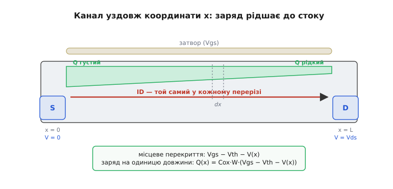
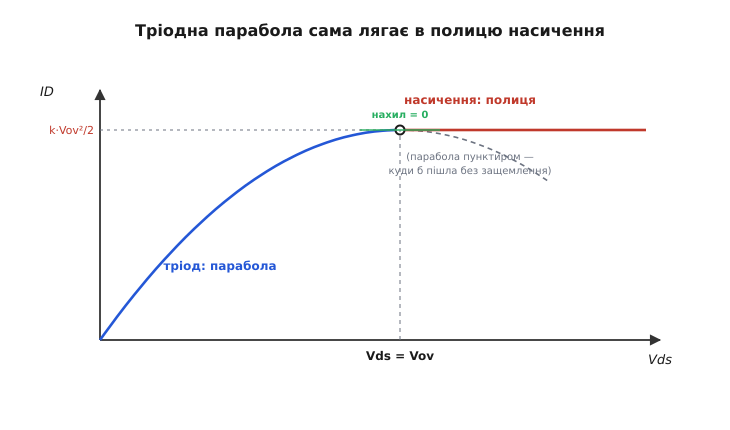
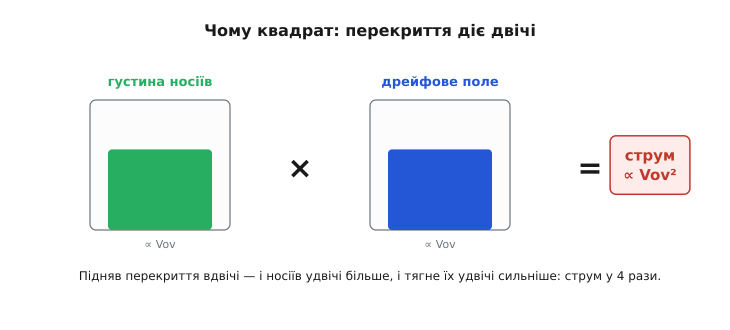

# 🧮 Звідки квадратичний закон ID = (k/2)(Vgs − Vth)²

> Це математична вставка до теми [«MOSFET: підсилювальний і збіднювальний режим»](topic:hw-components/mosfet-modes). У самій темі квадратичну криву ID(Vgs) беруть готовою: «вище порога струм росте, і не лінійно, а як квадрат перекриття». Тут зробимо це чесно — виведемо формулу від першопричини. Жодної магії: один закон Ома, одне означення ємності, один інтеграл уздовж каналу. Наприкінці стане видно, **чому саме квадрат**, а не куб і не лінія, і **звідки** береться гладка полиця насичення, об яку спирається весь аналоговий MOSFET.

Формула, яку треба здобути, виглядає так:

```
насичення:   ID = (k/2)·(Vgs − Vth)²
```

Тут Vgs — напруга затвор-витік, Vth — поріг (*threshold*), а різницю Vgs − Vth називають **перекриттям** (*overdrive*) і скорочують Vov. Множник k = μ·Cox·(W/L) збирає в собі фізику каналу: рухливість носіїв μ, ємність підзатворного шару на одиницю площі Cox і відношення ширини каналу до довжини W/L. Усе це — сталі для конкретного транзистора. Уся динаміка — в одному квадраті (Vov)².

Питання не в тому, як цією формулою користуватися (підставив і порахував), а в тому, **звідки вона взагалі взялася**. Бо квадрат тут не випадковий збіг і не підгонка під вимір — він випливає з геометрії каналу неминуче. Розберімо це.

### Що означають букви: три фізичні величини

Перш ніж рахувати, треба точно знати, що позначає кожен символ — інакше виведення перетвориться на жонглювання літерами.

**Поріг Vth** (*threshold voltage*) — напруга на затворі, з якої під ізолятором уперше виникає суцільний провідний канал. Нижче порога носіїв обмаль, вище — їх стає дедалі більше. Поріг задається будовою транзистора (товщиною ізолятора, легуванням підкладки) і для готового приладу є сталим числом.

**Перекриття Vov = Vgs − Vth** — це «надлишок» напруги затвора над порогом. Саме він керує каналом: не сама Vgs, а те, **на скільки** вона перевищує Vth. Якщо Vgs = Vth, перекриття нульове, канал щойно на межі — струму практично нема. Подвоїли перекриття — і, як побачимо, носіїв стало вдвічі більше.

**Ємнісний коефіцієнт Cox** (*oxide capacitance per area*) — ємність «затвор - канал» на одиницю площі. Затвор і канал — це дві пластини, між ними тонкий ізолятор; виходить плаский [конденсатор](topic:ph-electromagnetism/capacitance). А конденсатор зв'язує заряд і напругу прямо: Q = C·U. Чим тонший ізолятор, тим більший Cox, тим густіший канал збере та сама напруга. Це і є той місток, яким напруга на затворі перетворюється на **заряд** у каналі.

> 🔧 **Навіщо це.** k = μ·Cox·(W/L) — це не абстракція, а ручка, якою інженер крутить транзистор. Хочеш сильніший струм при тому самому перекритті — бери ширший канал (більше W) або коротший (менше L); звідси гігантські відношення W/L у силових ключах і крихітні — у малопотужній логіці. Уся ця залежність уже сидить у виведенні нижче.

### Канал — не однорідна смужка, а клин

Перша спокуса — уявити канал як рівномірний шар провідника й написати закон Ома: струм = напруга / опір. Але так не вийде, і саме звідси росте весь нетривіальний результат.

Розгорнімо канал уздовж координати x: x = 0 біля витоку (*source*), x = L біля стоку (*drain*). Через канал тече струм, отже на ньому є спад напруги — від 0 на витоку до Vds на стоку. Тобто в кожній точці каналу є свій місцевий потенціал V(x), що плавно росте 0 → Vds, поки ми йдемо від витоку до стоку.

А тепер ключове спостереження. Канал збирає затвор силою поля між затвором і **самим каналом** у цій точці. Біля витоку канал сидить на потенціалі 0, тож напруга «затвор - канал» тут повна, Vgs. Біля стоку канал піднявся до V(x), тож напруга, що тисне на канал, уже менша: Vgs − V(x). Носіїв збирається стільки, на скільки ця місцева напруга перевищує поріг:

```
місцеве перекриття у точці x:    Vov(x) = Vgs − Vth − V(x)
```

Біля витоку (V = 0) перекриття повне, Vgs − Vth. Біля стоку (V = Vds) воно менше, Vgs − Vth − Vds. Канал виходить **клином**: густий і товстий біля витоку, тонший і рідший біля стоку.


*Канал як клин уздовж осі x. Витік ліворуч (V = 0), стік праворуч (V = Vds). Місцеве перекриття Vgs − Vth − V(x) меншає до стоку, тому заряд на одиницю довжини Q(x) рідшає. Струм ID при цьому той самий у кожному перерізі — інакше заряд десь нагромаджувався б.*

Це той самий простий конденсатор, тільки місцевий. Заряд носіїв на одиницю довжини каналу — це ємність на одиницю довжини, помножена на місцеву напругу-перекриття. Ємність смужки каналу завдовжки dx і завширшки W дорівнює Cox·W·dx, тож на одиницю довжини маємо Cox·W, а заряд:

```
заряд на одиницю довжини:    Q(x) = Cox · W · (Vgs − Vth − V(x))
```

Ось перший шматок мозаїки. Заряд у каналі не сталий — він **функція координати**, бо місцеве перекриття всюди різне.

### Один струм крізь усі перерізи — друга умова

Друга умова така проста, що її легко проґавити, а без неї нічого не вийде. У сталому режимі струм ID **однаковий у кожному перерізі каналу**. Інакше заряд десь би накопичувався або вибирався — а він не накопичується, бо стан усталений. Скільки електронів за секунду влітає в канал з витоку, стільки ж вилітає в стік. Тож ID — одне число для всього каналу, а не функція x.

Тепер запишемо цей струм у точці x через дрейф. Струм — це заряд, що проходить за секунду; дрейфовий струм — це густина заряду, помножена на швидкість дрейфу. Заряд на одиницю довжини ми вже маємо: Q(x). Швидкість носіїв у напівпровіднику пропорційна полю, з коефіцієнтом рухливості: v = μ·E. А поле вздовж каналу — це нахил потенціалу: E = dV/dx. Складаємо:

```
ID = Q(x) · v = Q(x) · μ · E = μ · Q(x) · dV/dx
```

Підставмо Q(x):

```
ID = μ · Cox · W · (Vgs − Vth − V(x)) · dV/dx
```

Це повне рівняння каналу. Ліворуч — стала ID (та сама всюди). Праворуч — добуток, де V(x) і dV/dx залежать від точки. Здається заплутано, але саме ця сталість лівої частини дозволить нам акуратно проінтегрувати праву по всій довжині.

### Інтеграл уздовж каналу — серце виведення

Перепишемо рівняння так, щоб з одного боку стояв тільки x, а з іншого — тільки V. Помножимо обидві сторони на dx:

```
ID · dx = μ · Cox · W · (Vgs − Vth − V) · dV
```

Зліва — нескінченно малий «крок по довжині» каналу, помножений на сталий струм. Справа — «крок по напрузі» dV, помножений на місцеве перекриття. Тепер просто **просумуємо** обидві сторони по всьому каналу. Зліва йдемо від x = 0 до x = L; справа напруга йде синхронно від V = 0 (витік) до V = Vds (стік):

```
∫₀ᴸ ID dx  =  μ · Cox · W · ∫₀^Vds (Vgs − Vth − V) dV
```

Зліва ID — стала, виноситься з-під суми, а ∫₀ᴸ dx = L. Справа інтеграл елементарний: первісна для (Vgs − Vth − V) по V — це (Vgs − Vth)·V − V²/2. Підставляємо межі 0 і Vds:

```
ID · L = μ · Cox · W · [ (Vgs − Vth)·Vds − Vds²/2 ]
```

Поділимо на L і згорнемо сталі в k = μ·Cox·(W/L):

```
ID = k · [ (Vgs − Vth)·Vds − Vds²/2 ]        (тріодний режим)
```

Це — **тріодна парабола**: повний закон струму, поки канал суцільний від витоку до стоку. Жодного припущення про квадрат ми не робили — він зараз вилупиться сам із цієї формули. Зверніть увагу, **що** ми зробили: розбили канал на тонкі поперечні скибки, у кожній написали закон Ома з місцевим зарядом і місцевим полем, і склали всі скибки докупи. Інтеграл тут не формальність — він буквально складає внески всіх перерізів неоднорідного каналу в один струм.

### Як парабола виходить на полицю

Подивімося на тріодну формулу як на функцію Vds при сталому Vgs (отже, при сталому перекритті Vov = Vgs − Vth):

```
ID = k · [ Vov·Vds − Vds²/2 ]
```

При малих Vds доданок Vds²/2 мізерний, лишається ID ≈ k·Vov·Vds — пряма. Канал поводиться як звичайний резистор, опір якого задає затвор: більше перекриття — крутіша пряма, менший опір. Це **тріодна** (її ще звуть лінійною) ділянка.

Але Vds росте, і квадратичний доданок −Vds²/2 дедалі сильніше пригинає пряму донизу. Парабола загинається. Де в неї вершина? Візьмемо похідну по Vds і прирівняймо до нуля:

```
dID/dVds = k · [ Vov − Vds ] = 0    →    Vds = Vov
```

Вершина параболи — рівно при Vds = Vov = Vgs − Vth. Тут нахил кривої дорівнює нулю: струм перестав рости від напруги. Підставмо Vds = Vov у тріодну формулу й подивімося, на якій висоті ця вершина:

```
ID(вершина) = k · [ Vov·Vov − Vov²/2 ] = k · [ Vov² − Vov²/2 ] = k · Vov²/2
```

Ось воно:

```
ID = (k/2) · Vov² = (k/2)·(Vgs − Vth)²
```

Квадратичний закон — це **значення тріодної параболи в її вершині**. Не окрема загадкова формула, а просто висота тієї самої кривої в точці, де вона перестала рости.


*Та сама крива ID(Vds) при сталому Vgs. Парабола росте до вершини при Vds = Vov; там її нахил рівно нульовий, тож горизонтальна полиця насичення підхоплює її **без зламу**. Пунктир показує, куди парабола «хотіла б» піти далі (вниз) — але фізика туди не пускає.*

### Чому полиця, а не спуск: защемлення замикає математику з фізикою

Формально парабола за вершиною йде вниз: при Vds > Vov доданок −Vds²/2 переважить, і ID нібито мав би спадати. Фізично цього не буває — і ось чому, причому це та сама причина, що тримає весь аналоговий MOSFET.

Згадаймо місцеве перекриття: Vov(x) = Vgs − Vth − V(x). Біля стоку V = Vds. Коли Vds доростає до Vov, місцеве перекриття біля стоку падає до нуля — канал там витончується до нитки й **защемлюється** (*pinch-off*). Далі піднімати Vds канал біля стоку не може стати «від'ємним» — його там просто нема на крихітній ділянці. Уся надлишкова напруга Vds − Vov падає на цьому вузькому защемленому проміжку, а решта каналу лишається такою самою, як була при Vds = Vov. Струм крізь канал — той самий, що в момент защемлення: k·Vov²/2. Він **завмирає на стелі**.

Тому реальна крива не йде за параболою вниз, а зрізається горизонталлю від вершини — це **насичення**. І зшивання виходить гладким не випадково: оскільки у вершині нахил параболи рівно нульовий, горизонтальна полиця стикується з нею без злому, дотично. Математика (нульова похідна) і фізика (защемлення саме там) кажуть одне.

```
тріод (Vds < Vov):       ID = k·[Vov·Vds − Vds²/2]      росте, загинаючись
вершина (Vds = Vov):     ID = k·Vov²/2                  нахил нульовий
насичення (Vds ≥ Vov):   ID = (k/2)·Vov²                стала, не залежить від Vds
```

> 🔧 **Навіщо це.** Саме полиця насичення робить MOSFET підсилювачем і джерелом струму. У насиченні струм майже не зважає на Vds, зате круто слухається Vgs — мала зміна напруги на затворі дає велику зміну струму стоку. Це і є підсилення. Працювати лінійним підсилювачем транзистор має саме в насиченні; у тріоді він поводиться як змінний резистор — корисно для ключів і регульованих опорів, але не для лінійного підсилення.

### Чому саме квадрат, а не лінія й не куб

Тепер найцікавіше — інтуїція, без жодного інтеграла. Чому перекриття входить у **другому** степені? Бо воно діє на струм **двічі, незалежно**.

Згадаймо, з чого складається дрейфовий струм: ID = (густина заряду) × (швидкість носіїв). Підняли перекриття Vov — і подивімося на обидва множники окремо.

**Перший множник — густина.** Заряд у каналі ми вивели: Q ∝ перекриття. Підняв Vov удвічі — затвор зібрав удвічі більше носіїв. Канал став удвічі густішим. Носіїв стало вдвічі більше — це раз.

**Другий множник — швидкість.** У насиченні весь перепад напруги вздовж каналу — це теж приблизно Vov (бо саме при Vds = Vov канал защемлюється, і ця напруга розподілена по довжині L). Більший Vov — крутіший нахил потенціалу — сильніше дрейфове поле E ∝ Vov/L — швидше летять носії. Підняв Vov удвічі — поле вдвічі сильніше — кожен носій тягне вдвічі швидше. Це два.

Струм — добуток цих двох. Удвічі більше носіїв, кожен удвічі швидший: струм у **чотири** рази. Ось і квадрат.


*Перекриття входить у струм двома незалежними каналами: воно і згущує носіїв (густина ∝ Vov), і підсилює дрейфове поле (∝ Vov). Струм — добуток обох, тому ∝ Vov². Підняв перекриття вдвічі — і носіїв удвічі більше, і тягне їх удвічі сильніше: струм у чотири рази.*

Звідси видно, чому **не** лінія: лінійним був би струм, якби перекриття керувало лише одним множником — або тільки кількістю носіїв при фіксованій швидкості, або тільки швидкістю при фіксованій кількості. А воно керує обома одразу. І чому **не** куб: множників рівно два — заряд і поле, — а не три; третьому взятися нема звідки. Квадрат — це точне число незалежних дій перекриття.

Цю саму думку дає й порівняння з [BJT](topic:hw-components/bjt-operation), де струм керується експонентою напруги, а не квадратом. У біполярного носії впорскуються крізь бар'єр, чию висоту напруга змінює експоненційно; у польового напруга просто збирає заряд у пластині конденсатора — лінійно — і той самий заряд тягне лінійно-зростаючим полем. Різна фізика керування — різний закон: експонента там, квадрат тут.

### Тонкощі, які чесно назвати

Квадратичний закон — це **модель**, і як усяка модель вона має межі. Виведення спиралося на кілька припущень, які варто назвати вголос, щоб не вірити формулі сліпо.

Ми мовчки взяли **сталу рухливість** μ й **дрейфову** швидкість v = μ·E. У коротких сучасних каналах поле таке сильне, що швидкість носіїв упирається в стелю (насичення швидкості, *velocity saturation*) — і тоді струм у насиченні стає ближчим до лінійного за перекриттям, ID ∝ Vov, а не Vov². Тому квадратичний закон найкраще описує «довгі» канали; для нанометрових транзисторів він — лише перше наближення.

Ми також знехтували **дифузійним** струмом — припустили, що нижче порога носіїв просто нема. Насправді трохи нижче Vth струм не обривається стрибком, а спадає плавно й експоненційно (підпороговий режим, *subthreshold*) — там працює дифузія, і квадратична формула не діє зовсім. Повна теорія, що зшиває всі режими одним інтегралом, складніша (її називають моделлю Пао-Са, *Pao-Sah*), і квадратичний закон — її зручний наближений шматок для роботи вище порога.

Нарешті, реальна полиця насичення не ідеально горизонтальна: при дуже великих Vds защемлена ділянка трохи поглинає канал, ефективна довжина L меншає, і струм потроху повзе вгору (модуляція довжини каналу, *channel-length modulation*). У першому наближенні цим теж нехтують — звідси «майже» в «майже не залежить від Vds».

Жодне з цих застережень не псує головного. Квадратичний закон ловить **суть** польового керування: затвор - конденсатор збирає заряд лінійно, той самий заряд дрейфує в полі, що теж росте лінійно, добуток дає квадрат, а защемлення зрізає параболу в полицю. Це той кістяк, на якому тримається розрахунок будь-якого MOSFET-каскаду.

### Де цей апарат працює в темі

Усе подальше про MOSFET спирається на ці три формули — тріодну параболу, її вершину й квадрат насичення.

Розрахунок підсилювача на польовому транзисторі починається з вибору робочої точки в насиченні: задаєш потрібний струм ID, з квадратичного закону знаходиш потрібне перекриття Vov = √(2·ID/k), а з нього — напругу зміщення на затворі. Крутість підсилювача (на скільки міліампер змінюється струм на кожен вольт затвора) — це теж похідна квадрата: gm = dID/dVgs = k·Vov = √(2·k·ID). Звідси видно неприємну рису квадратичного приладу: крутість росте лише як корінь зі струму, тож «розгойдати» польовий транзистор сильніше коштує дедалі дорожче за струмом — на відміну від [біполярного](topic:hw-components/bjt-gain), де крутість прямо пропорційна струму.

Та сама квадратична крива пояснює, чому MOSFET — добрий [аналоговий ключ](topic:hw-components/mosfet-switch) і регульований опір у тріоді: відкритий канал має опір приблизно 1/(k·Vov), яким керує затвор. І вона ж стоїть за роботою [струмового дзеркала](topic:hw-analog/current-mirror) на польових транзисторах: два однакові прилади з однаковим Vgs за квадратичним законом несуть однаковий струм — ось і копія струму.

Тож квадрат у ID = (k/2)·(Vgs − Vth)² — не формула, яку треба запам'ятати, а **наслідок**: канал є клином, заряд у ньому рідшає до стоку, інтеграл уздовж каналу дає параболу, а защемлення зрізає її в полицю. Один раз побачивши це виведення, далі читаєш будь-яку MOSFET-схему вже не як набір правил, а як прямий висновок із геометрії каналу.
