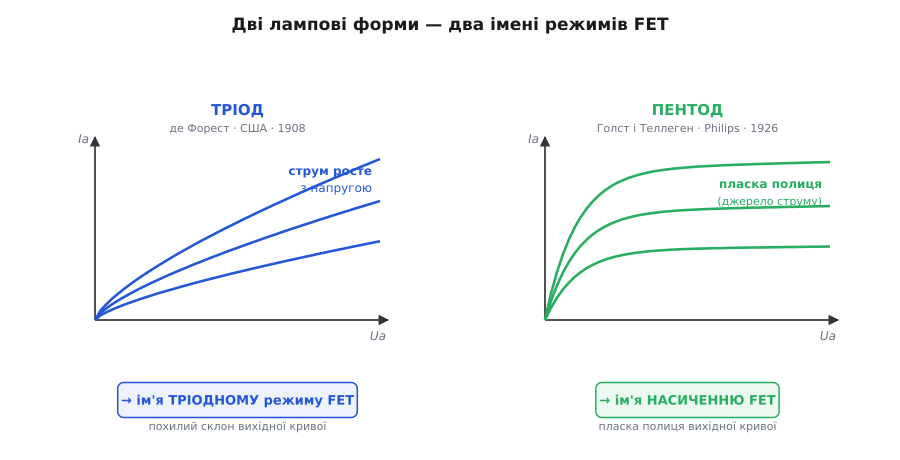
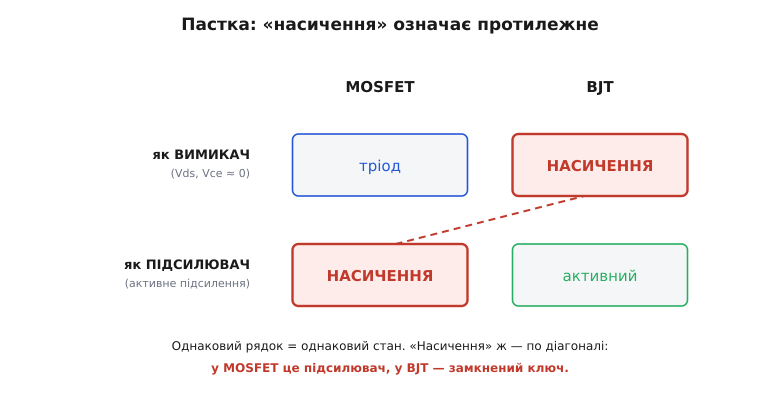

# 📜 Спадок ламп: тріод, пентод і підступне «насичення»

Назви двох режимів MOSFET старші за сам транзистор. «Тріодний режим», «насичення» — жодне з цих слів не описує того, що діється в кремнієвому каналі: ні тріодів, ні якогось наситися-нема-куди там немає. Це мовні скам'янілості з часів, коли кожен інженер-електронник виріс на вакуумних лампах і мимоволі бачив у кривих нового приладу знайомі обриси старих. Щоб зрозуміти, звідки взялися ці імена, доведеться на хвилину відкласти кремній і глянути на скло й вакуум — на дві лампи, чиї характеристики MOSFET випадково повторив своєю формою.

Бо весь фокус іменування тут не у фізиці, а в **силуеті кривої**. Інженер 1960-х, який щойно виміряв вихідну характеристику польового транзистора, не мав для її ділянок готових слів. Зате мав перед очима тисячі разів бачені сімейства кривих тріода й пентода. І коли похилий склон нової кривої лягав точнісінько на форму тріодної характеристики, а пласка полиця — на форму пентодної, назви напросилися самі. Ніхто їх спеціально не «винаходив» і не патентував: це радше загальна звичка цілого покоління, яке думало лампами, а вимірювало вже транзистори.

## Тріод: крива, що весь час повзе вгору

Першу лампу, здатну підсилювати, зробив американець Лі де Форест (англ. *Lee de Forest*). Він узяв свій двоелектродний випрямляч-«Audion» (1906) і додав між розжареною ниткою та пластиною-анодом третій електрод — дротяну сітку (англ. *grid*; назву, кажуть, узяв від ґратчастих ліній розмітки американського футбольного поля). Заявку подав 29 січня 1907-го, а патент США № 879 532 дістав 18 лютого 1908 року. Так народився **тріод** (гр. *treís* — три, за трьома електродами): слабка напруга на сітці керувала великим струмом анода — уперше прилад **підсилював**. Уся довша історія народження лампи — від дефекту едісонової лампочки через діод Флемінга до цього тріода — [зібрана окремо](topic:hw-components/vacuum-tube); нам тут потрібна одна-єдина її риса.

Ця риса — форма анодної характеристики тріода. У тріоді анод «дотягується» своїм полем крізь сітку аж до потоку електронів: що вища напруга на аноді, то дужче він розганяє й витягує на себе електрони, то більший струм. Тому анодний струм **росте разом з анодною напругою** — характеристика тріода похила, весь час повзе вгору, а внутрішній опір анода відносно малий (крива має відчутний нахил).

Ось ця похилість і дала ім'я. У польового транзистора за малих Vds струм стоку так само росте з напругою на стоку — крива теж похило лізе вгору. Обриси збіглися, тож ту ділянку й назвали **тріодною**. Аналогія — суто про форму кривої, а не про механізм: у лампі струм несуть електрони, вирвані з розпеченого металу у вакуум, у польовому транзисторі — електрони в кремнієвому каналі під затвором; спільне лише те, що обидві криві похило зростають. Кремній нічого не «успадкував» від лампи фізично — він успадкував тільки її силует на графіку.

## Пентод: полиця, що не залежить від напруги

Друга назва складніша, бо за нею стоїть не одна лампа, а ціла драма вдосконалень. Тріод був чудовий, але на високих частотах капризував: паразитна ємність між сіткою й анодом заводила частину вихідного сигналу назад на вхід, і підсилювач самозбуджувався — переходив у власне виття замість підсилення. Щоб розірвати цей зворотний зв'язок, 1919 року німець Вальтер Шоттки (нім. *Walter Schottky*) додав між керівною сіткою й анодом четвертий електрод — **екранувальну сітку** (англ. *screen grid*), яка електростатично відгороджувала анод від входу. Вийшов **тетрод** (чотири електроди).

Але екран приніс нову халепу. Швидкі електрони, вдаряючись об анод, вибивали з нього вторинні; коли напруга анода падала нижче за напругу екрана, позитивний екран перехоплював цих вторинних електронів — і струм анода з ростом напруги міг не рости, а **падати**. На характеристиці з'являвся горб зі спадною ділянкою — ділянка від'ємного опору («динатронний» злам), джерело нестабільності й спотворень.

Ліки знайшли в Нідерландах. 1926 року в дослідній лабораторії Philips в Ейндговені двоє голландських інженерів — Гілс Голст (нід. *Gilles Holst*) і Бернард Теллеген (нід. *Bernard D. H. Tellegen*) — додали ще одну, третю сітку — **гальмівну** (англ. *suppressor grid*), увімкнену близько до потенціалу катода. Поставлена між екраном і анодом, вона відштовхувала вторинні електрони назад до анода, і горб зникав. Так постав **пентод** (гр. *pénte* — п'ять, за п'ятьма електродами).

І ось головне для нашої історії — що зробила ця третя сітка з формою характеристики. Екран уже майже відв'язав струм анода від анодної напруги; гальмівна сітка прибрала останній артефакт. У підсумку крива пентода круто злітає біля нуля, а тоді **лягає майже горизонтально**: струм анода виходить на полицю й далі майже не залежить від напруги на аноді. Внутрішній опір анода став дуже високим, а сам пентод — майже ідеальним **джерелом струму**: скільки напруги не додай, струм тримається свого рівня.

Тепер порівняйте це з насиченням польового транзистора. За коліном струм стоку теж лягає на пласку полицю й майже не зважає на Vds — теж поводиться як джерело струму з високим вихідним опором. Форми знову збіглися. Тому другу, «полицеву» ділянку FET на лампову честь назвали **пентодною**.


*Дві лампові форми, що стали іменами. Анодний струм тріода весь час росте з напругою (похилий склон) — ця форма дала назву тріодному режиму FET. Струм пентода круто злітає й лягає на майже сталу полицю (джерело струму) — ця форма дала назву насиченню FET. Аналогія — тільки про силует кривої, не про фізику всередині.*

> 🔧 **Навіщо це.** Знання лампи за кожним іменем миттю робить назву прозорою. «Тріодний режим» — не таємничий термін, а просто «та ділянка, де крива похила, як у тріода». «Пентодний» (він же насичення) — «та, де крива пласка, як у пентода». Замість двох слів, які ніби нізвідки, маєш дві впізнавані картинки. І одразу видно, чому тріод — це вимикач (мала напруга, крутий склон біля нуля), а насичення — підсилювач (пласка полиця = джерело струму): бо самі форми кажуть, резистор перед тобою чи джерело струму.

## Чому все-таки «насичення», а не «пентодна»

За полицевою ділянкою закріпилися аж дві назви. Лампову — «пентодна» — вживають рідше, здебільшого старі підручники й аналогова школа. Прижилася інша, описова: **насичення** (англ. *saturation*). Логіка проста — струм тут «насичується»: доходить до стелі й далі з ростом Vds не збільшується, ніби наситився і більше не бере. Слово зрозуміле само по собі, без жодних ламп, — тому в MOS-літературі воно й перемогло пентодну назву.

Здавалося б, вдалий, самопояснювальний термін. Але саме він ховає чи не найгіршу пастку в усій транзисторній термінології.

## Пастка: у BJT «насичення» означає протилежне

Біда в тому, що слово «насичення» вже було зайняте — і означало геть інше. У [біполярного транзистора з його трьома режимами](topic:hw-components/bjt-regions) «насичення» — це стан **повністю відкритого ключа**: обидва переходи прямо зміщені, напруга колектор–емітер падає до якихось 0.2 В, транзистор проводить усе, що може, і як підсилювач уже не працює. Підсилює BJT у **іншому** режимі, який так і звуть — **активний**.

Зіставмо тепер режими двох транзисторів за тим, що прилад **робить**, а не як його називають:

```
що робить прилад        MOSFET          BJT
──────────────────────────────────────────────
замкнений ключ          тріод     ↔     НАСИЧЕННЯ
(Vds, Vce ≈ 0)
підсилювач              НАСИЧЕННЯ ↔     активний
```

Погляньте, куди потрапило слово «насичення»: у MOSFET воно стоїть у рядку підсилювача, а в BJT — у рядку замкненого ключа. Один термін по діагоналі позначає **два протилежні стани**. MOSFET у насиченні підсилює; BJT у насиченні — глухо замкнений вимикач. А фізичні відповідники йдуть хрест-навхрест: насичення MOSFET рівня активному режиму BJT (обидва підсилюють), а тріод MOSFET — насиченню BJT (обидва — повністю відкритий ключ).


*Той самий термін — на двох протилежних клітинах. Читаємо за рядками (що прилад робить): верхній рядок — обидва як замкнений ключ, нижній — обидва як підсилювач. «Насичення» червоне лягає по діагоналі: у MOSFET це підсилювач, у BJT — замкнений ключ. Фізично рівні не однойменні клітини, а ті, що в одному рядку.*

Чому одне слово так розійшлося? Бо «насичується» у двох приладах різне. У BJT насичується вихідний струм щодо **вхідного керування**: базу так заливає носіями, що додатковий струм бази вже не додає струму колектора — керування наситилось, вихід перестав відгукуватися на вхід. У MOSFET насичується струм стоку щодо **напруги на стоку**: додаткова Vds уже не додає струму. Слово те саме — «струм перестав рости», — але вісь, уздовж якої він перестав рости, різна: у BJT це вхідне керування, у FET — власна вихідна напруга. Звідси й протилежні робочі умови під одним ім'ям.

## Порада: коли непевно — кажіть «активний»

Через цю пастку багато викладачів і підручників (зокрема класичний Sedra & Smith) свідомо називають підсилювальний режим MOSFET не «насиченням», а **активним** — точно як у BJT. Тоді правило стає єдиним для обох приладів: **активний = підсилює**, і жодної діагоналі. Ім'я «насичення» при цьому не забороняють, але поряд одразу проговорюють, що фізично це підсилення, а не відкритий ключ.

Практична звичка проста. Почувши «транзистор у насиченні», спершу спитайте, який це транзистор. Польовий — значить підсилює, сидить на пласкій полиці, і велика Vds на ньому норма. Біполярний — значить замкнений на ключ, Vce мала, підсилення нема. А щоб не заплутати іншого (та й себе), про підсилення кажіть **«активний режим»**, а про повністю відкритий стан — **«глибокий тріод»** для FET чи **«насичення»** для BJT, не покладаючись на голе слово «насичення» без назви приладу.

Три чужі на позір слова — «тріодний», «пентодний», «насичення» — виявляються не випадковими й не злими. Два з них — це просто форми лампових кривих, упізнані в кремнії: похилий склон тріода й пласка полиця пентода. Третє — вдала описова назва тієї ж полиці, що на біду зіткнулася з давнішим, протилежним «насиченням» біполярника. Термінологія транзистора — скам'янілий літопис того, як росла галузь: кремній успадкував словник скла й вакууму, і одне слово по дорозі примудрилося прикипіти до двох протилежних смислів. Знаєш лампу за кожним іменем — і три збивачі з пантелику стають трьома впізнаваними картинками.
