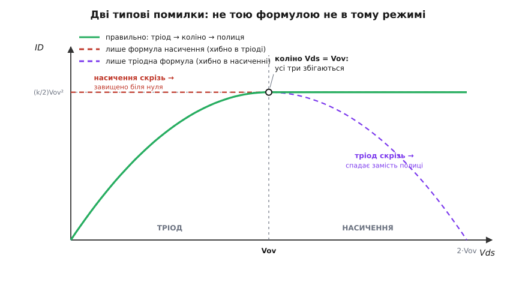

# ⚙️ Визначник режиму: класифікатор і генератор вихідної характеристики

Ви тримаєте в руках транзистор із трьома числами в даташиті — поріг Vth, крутість k, іноді ще коефіцієнт модуляції λ — і подаєте на нього якесь зміщення: стільки-то вольтів на затвор (Vgs), стільки-то на стік (Vds). Питання, з якого починається кожен розрахунок MOSFET: **скільки тече струму?** І тут криється пастка, бо формул не одна, а дві — окрема на тріод, окрема на насичення, — і котру брати, залежить від того, у якому режимі транзистор сидить прямо зараз. Візьмеш не ту — дістанеш число, яке виглядає правдоподібно, а насправді бреше в рази.

Зробімо машинку, що не помиляється. На вхід — параметри приладу й зміщення; на вихід — **назва режиму** (відсічка / тріод / насичення) і **струм ID, порахований саме тою формулою, що годиться для цього режиму**. А коли машинка є, з неї майже задарма випадає бонус: розгорнути Vds від нуля вгору за кількох Vgs — і вона намалює все сімейство кривих ID(Vds), той самий графік із крутими схилами й пласкими поличками, що є обличчям будь-якого MOSFET.

Може здатися, що коду тут на дві формули й нема про що писати. Але вся складність не в арифметиці — арифметика тривіальна. Складність у **виборі**: яку з двох формул застосувати. І саме цей вибір люди плутають найчастіше. Функція, яка спершу вирішує режим, а вже тоді рахує, робить неправильний вибір **структурно неможливим** — ось навіщо її варто написати акуратно.

## Ідея: спершу класифікуй, тоді рахуй

Головна думка проєкту — розчепити два кроки, які так і кортить злити в один. Режим — це **значення, яке обчислюють**, одне з рівно трьох, і дістають його з двох порівнянь, у яких про струм ще жодного слова. Лише коли режим уже лежить у тебе в руці як готова відповідь, ти дивишся на нього й береш відповідну формулу. Класифікація окремо, розрахунок окремо.

Уся діагностика — це два питання, обидва прості нерівності. Перше: **чи канал узагалі відкрито?** Дивимося на перекриття Vov = Vgs − Vth. Якщо воно від'ємне (затвор нижче за поріг), каналу нема — це відсічка, струму нуль, більше й рахувати нічого. Якщо додатне — канал є, і лишається друге питання: **чи стік уже защемило?** Порівнюємо Vds із перекриттям Vov. Менше — канал суцільний, це тріод (транзистор-резистор). Більше або рівно — стоковий кінець защемлено, це насичення (транзистор-джерело струму).

Ось цей класифікатор як чиста функція — жодної арифметики струму, лише два порівняння, що повертають одну з трьох міток:

```python
from dataclasses import dataclass
from enum import Enum

class Region(Enum):
    CUTOFF     = "відсічка"
    TRIODE     = "тріод"
    SATURATION = "насичення"

@dataclass
class Mosfet:
    vth: float          # порогова напруга Vth, В
    k:   float          # крутість k = μ·Cox·W/L, А/В²
    lam: float = 0.0    # модуляція довжини каналу λ, 1/В (0 — ідеальна полиця)

def region(dev: Mosfet, vgs: float, vds: float) -> Region:
    """Чистий класифікатор: два порівняння, жодного струму."""
    vov = vgs - dev.vth              # перекриття (overdrive)
    if vov <= 0:
        return Region.CUTOFF         # канал не відкрито
    if vds < vov:
        return Region.TRIODE         # канал суцільний — резистор
    return Region.SATURATION         # стік защемлено — джерело струму
```

Три гілки — три режими, і читаються вони згори вниз рівно як два питання. Перше `if` згортає всю умову відсічки в один рядок: `vov <= 0` — це те саме, що `Vgs <= Vth`, канал не відкрито. Друге відділяє тріод від насичення по межі Vds = Vov. Межу — точку Vds = Vov — я віддав насиченню (умова тріода строга, `vds < vov`); чому вибір між `<` і `≤` тут ні на що не впливає, стане видно згодом, коли дійдемо до коліна.

## Струм — диспетчер за режимом

Тепер, коли режим — готова величина, розрахунок струму стає простим диспетчером: подивись на мітку й застосуй **лише її** формулу.

```python
def drain_current(dev: Mosfet, vgs: float, vds: float) -> float:
    """ID у формулі, що годиться САМЕ для поточного режиму."""
    vov = vgs - dev.vth
    r = region(dev, vgs, vds)
    if r is Region.CUTOFF:
        return 0.0
    if r is Region.TRIODE:
        return dev.k * (vov * vds - vds * vds / 2)          # ID = k·[Vov·Vds − Vds²/2]
    return (dev.k / 2) * vov * vov * (1 + dev.lam * vds)    # ID = (k/2)·Vov²·(1 + λ·Vds)
```

Кожна гілка чіпає тільки свою формулу й нічию більше. У відсічці струм — чистий нуль. У тріоді працює повна парабола k·[Vov·Vds − Vds²/2] — та, що при малих Vds вироджується в пряму k·Vov·Vds, тобто в звичайний резистор із провідністю k·Vov (її ж, нахил біля початку координат, звуть [провідністю відкритого каналу 1/Rds(on)](root:hw-components/rds-on)). У насиченні — сталий рівень (k/2)·Vov², помножений на поправку (1 + λ·Vds): множник λ живе **тільки в цій гілці**, бо модуляція довжини каналу — явище защемленого стоку, якого до коліна просто не існує. Звідки беруться самі ці формули — від заряду в каналі до інтеграла вздовж нього — розкладено у [виведенні квадратичного закону](root:hw-components/mosfet-modes/math-square-law.md); тут вони нам потрібні як готові інструменти.

Проженімо крізь машинку той самий транзистор, що й на прикладі теми: Vth = 2 В, k = 0.5 А/В².

```python
m = Mosfet(vth=2.0, k=0.5)          # λ=0: ідеальна пласка полиця

for vgs, vds in [(5, 1), (5, 4), (1, 4)]:
    r = region(m, vgs, vds)
    print(f"Vgs={vgs} Vds={vds}  →  {r.value:<10}  ID = {drain_current(m, vgs, vds):.2f} А")
```

```
Vgs=5 Vds=1  →  тріод       ID = 1.25 А
Vgs=5 Vds=4  →  насичення   ID = 2.25 А
Vgs=1 Vds=4  →  відсічка    ID = 0.00 А
```

За один вольт на стоці транзистор ще резистор — тягне 1.25 А й тягнув би більше, якби Vds підняти. За чотири вольти (перевалили коліно Vov = 3 В) він замкнувся на 2.25 А й далі майже не ворухнеться. А зменшивши затвор до 1 В — нижче за поріг, — гасимо канал зовсім. Один і той самий прилад тричі різний, і машинка щоразу сама бере правильну формулу, бо спершу спитала режим.

Увімкнемо модуляцію каналу — задамо λ і глянемо на ту саму полицю за різних Vds:

```python
ml = Mosfet(vth=2.0, k=0.5, lam=0.02)
print(drain_current(ml, 5, 4), drain_current(ml, 5, 10))   # 2.43 2.70
```

Полиця вже не ідеально пласка: 2.43 А за 4 В, 2.70 А за 10 В — ось той легкий нахил, що робить реальний транзистор недосконалим джерелом струму зі скінченним вихідним опором. Керуючи λ, машинка вміє й ідеальну поличку (λ = 0), і реальну похилу.

## Розгортка: сімейство кривих одним циклом

Маючи `drain_current`, намалювати всю вихідну характеристику — питання одного проходу по Vds. Функція розгортки повертає список точок (Vds, ID); цикл по кількох Vgs складає з них сімейство.

```python
def output_curve(dev, vgs, vds_axis):
    return [(vds, drain_current(dev, vgs, vds)) for vds in vds_axis]

vds_axis = [0.5 * i for i in range(11)]          # 0.0, 0.5, … 5.0 В
for vgs in (3.5, 4.0, 5.0):
    ids = " ".join(f"{i:.2f}" for _, i in output_curve(m, vgs, vds_axis))
    print(f"Vgs={vgs}:  {ids}")
```

```
Vgs=3.5:  0.00 0.31 0.50 0.56 0.56 0.56 0.56 0.56 0.56 0.56 0.56
Vgs=4.0:  0.00 0.44 0.75 0.94 1.00 1.00 1.00 1.00 1.00 1.00 1.00
Vgs=5.0:  0.00 0.69 1.25 1.69 2.00 2.19 2.25 2.25 2.25 2.25 2.25
```

Кожен рядок читається як одна крива: спершу струм круто росте (тріод), тоді загинається й застигає (насичення). Коліно видно голим оком — це той стовпчик, де числа перестають рости: для Vgs = 3.5 (Vov = 1.5) струм замерзає на 0.56 А вже після 1.5 В; для Vgs = 5 (Vov = 3) — на 2.25 А після 3 В. Що вищий Vgs, то вища полиця: 0.56 → 1.00 → 2.25. Це і є ті самі криві вихідної характеристики; класифікатор усередині кожного рядка тихо перемикається з `TRIODE` на `SATURATION` рівно на коліні, і саме там струм виходить на стелю.

> 🔧 **Навіщо розділяти класифікацію й розрахунок.** Режим — це відповідь на питання «який прилад у мене зараз у руках: резистор чи джерело струму?», і відповідь відома **до** будь-якої арифметики струму. Зливши обидва кроки в одну формулу «на всі випадки», ти втрачаєш саме цю відповідь — і непомітно застосовуєш вираз там, де він не діє. Окремий класифікатор робить так, що формула фізично не може заговорити раніше, ніж названо режим. Це не педантизм: наступний розділ — про те, що коштує його порушення.

## Пастка: не тою формулою не в тому режимі

Найпоширеніша помилка з MOSFET — узяти одну формулу й молотити нею скрізь, забувши спитати режим. Помилитися можна двома дзеркальними способами, і машинка дає їх побачити. Відв'яжімо обидві формули від класифікатора — хай рахують без перевірки:

```python
def id_triode(dev, vgs, vds):        # тріодна формула — БЕЗ перевірки режиму
    vov = vgs - dev.vth
    return dev.k * (vov * vds - vds * vds / 2)

def id_saturation(dev, vgs, vds):    # формула насичення — БЕЗ перевірки режиму
    vov = vgs - dev.vth
    return (dev.k / 2) * vov * vov * (1 + dev.lam * vds)
```

**Помилка перша: формула насичення в тріоді.** Насиченнєвий вираз (k/2)·Vov² від Vds не залежить зовсім — це горизонтальна лінія на висоті полиці, і вона така **від самого нуля**. Для нашого транзистора за Vds = 1 В (глибокий тріод) вона каже 2.25 А, тоді як правда — 1.25 А. Струм завищено на 80 % там, де він мав би рости від нуля разом із Vds. Фізично це означає стерти резистор: ключ, що мав би падати на собі міліволти й повільно набирати струм, раптом виглядає так, ніби вже жене повний струм на нульовій напрузі — чого не буває.

**Помилка друга: тріодна формула в насиченні.** Тріодна парабола k·[Vov·Vds − Vds²/2] має вершину рівно на коліні, а далі **йде вниз**. За коліном вона бреше вже якісно: за Vds = 4 В дає 2.00 А замість 2.25 (просіла), а за Vds = 6 В = 2·Vov падає рівно до **нуля** — модель заявляє, що транзистор *вимикається*, коли піднімаєш на ньому напругу. Це цілковита нісенітниця: у насиченні струм на Vds майже не зважає, а тут він нібито тане до нуля.


*Той самий транзистор (Vov = 3 В), порахований трьома способами. Зелена суцільна — правильно: тріодна парабола до коліна, тоді пласка полиця. Червона пунктирна — сама лише формула насичення: пласко навіть у тріоді, струм завищено біля нуля. Фіолетова пунктирна — сама лише тріодна формула: за коліном парабола падає замість полиці й доходить до нуля на Vds = 2·Vov. Кожна хибна крива збігається з правильною у своєму рідному режимі й відривається від неї в чужому — тому й лягає на зелену там, де ще права, і відходить убік там, де вже бреше.*

Ось чому розділення двох кроків — не косметика. Кожна формула правильна у своєму режимі й брехлива в сусідньому; єдиний, хто рятує, — класифікатор, що не пускає її за межу.

## Коліно тримається само

Лишається тонкість, через яку вся конструкція взагалі працює: на самому коліні, за Vds = Vov, **обидві формули дають те саме число**. Підставмо межу в тріодну параболу:

```
тріод при Vds = Vov:   k·[Vov·Vov − Vov²/2] = k·Vov²/2 = (k/2)·Vov²
```

А це рівно рівень насичення. Машинка це підтверджує: за Vds = 3 В тріодна формула дає 2.25 А, насиченнєва (при λ = 0) — теж 2.25 А. Мало того, збігаються не лише значення, а й **нахили**: похідна тріодної параболи k·(Vov − Vds) на коліні перетворюється на нуль — а нуль якраз і є нахил пласкої полиці. Крива стуляється без зламу: і за висотою, і за дотичною.

Ось звідки бралася обіцянка, що вибір між `<` і `≤` на межі ні на що не впливає. Оскільки обидві гілки на самій межі повертають однакове число, байдуже, кому саме віддати точку Vds = Vov — тріоду чи насиченню. Тому й підступна рівність із рухомою комою, коли `vds` через округлення виявляється мікроскопічно більшим чи меншим за `vov`, тут нічим не загрожує: по обидва боки від межі струм той самий, стрибка нема.

Одне-єдине місце, де стик усе-таки не ідеально гладкий, — це коли модуляцію каналу пишуть як (1 + λ·Vds), як прийнято в моделі рівня 1. Тоді на коліні полиця виявляється піднятою множником (1 + λ·Vov) над тріодним значенням — маленька, у кілька відсотків, сходинка (для нашого λ = 0.02 і Vov = 3 це 6 %). Акуратніші моделі пишуть поправку як (1 + λ·(Vds − Vov)), щоб на коліні множник був точно одиницею й стик лишався неперервним. Для ручного розрахунку форма (1 + λ·Vds) — стандарт, а сходинку варто просто тримати в голові.

## Складність і походження

Обчислювальної складності тут катма: класифікація — два порівняння, струм — одне множення-додавання, тобто **O(1)** на точку; розгортка сімейства — це O(N·M) для N значень Vgs по M точках Vds, і за будь-яких розумних N, M вона миттєва. Оптимізувати нічого. Уся вага проєкту не в швидкості, а в структурі: **правильність живе в диспетчері режиму, а не в арифметиці**. Формули прості й відомі; неправильними їх робить лише застосування не там, де треба, — і рятує від цього саме те, що ми спершу питаємо режим, а вже потім рахуємо.

Ця триходова розв'язка — не наш винахід. Це квадратична модель Шихмана–Ходжеса (англ. *Shichman–Hodges*, 1968), та сама, що згодом лягла в основу **рівня 1 симулятора SPICE**, реалізованого близько 1972 року в Берклі. Її й досі звуть навчальною: вона зумисне нехтує насиченням швидкості носіїв і короткоканальними ефектами, зате чудово лягає в ручний розрахунок і в голову. Кожен схемний симулятор проганяє рівно цей самий вибір «відсічка / тріод / насичення» мільйони разів за ніч; наша кишенькова функція — той самий кістяк, тільки видно його наскрізь. *(Датування й авторство — усталений факт історії напівпровідникового моделювання, підтверджений документацією SPICE.)*

Тож визначник режиму — це не «дві формули в обгортці», а маленький урок про те, як улаштована правильність: спершу назви, з чим маєш справу, і лише тоді рахуй. Постав це питання перше — і жодна з двох формул уже не збреше.
