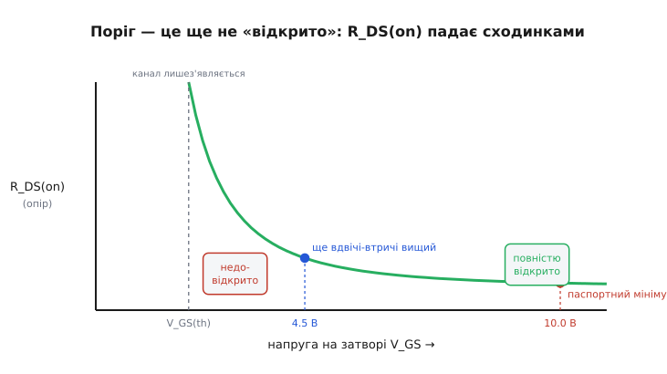
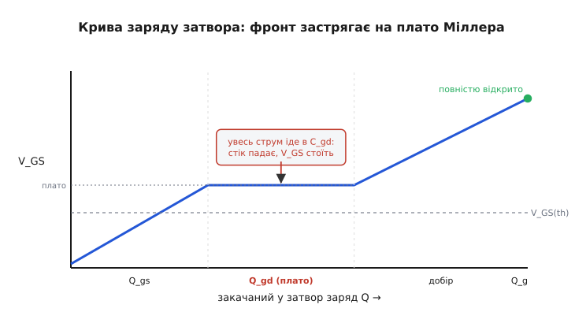
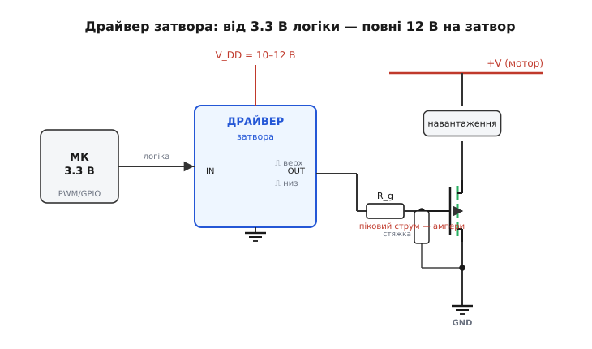

# 🔌 Драйвер затвора: як прочитати в паспорті «повне відкриття» й чим його дати

Найдорожча помилка з MOSFET-ключем оманливо тиха: транзистор начебто ввімкнувся, струм пішов — а корпус за хвилину годен підпекти палець. Майже завжди корінь один: затвор **недокачали**. Між «канал з'явився» і «канал відкрито навстіж» лежить ціла прірва напруги, і паспорт приладу описує її кількома кривими, які варто навчитися читати, мов мапу. А коли власної логіки бракне, щоб ту прірву перестрибнути, ставлять окремий **драйвер затвора** — клас мікросхем, чия єдина робота: від кволого логічного сигналу видати на затвор повні десять-дванадцять вольтів і дати при цьому короткий струм у кілька ампер. Розберемо обидва боки: спершу що саме шукати в паспорті, тоді — який пристрій усе це забезпечує і як його підключити.

### Поріг — це ще не «відкрито»

Перше, що збиває з пантелику в паспорті MOSFET, — рядок **V_GS(th)** (англ. *gate-threshold voltage*, порогова напруга затвор–витік). Звучить так, ніби це напруга, від якої транзистор «вмикається». Насправді ж це напруга, від якої канал лише **починає з'являтися** — у цій точці крізь прилад тече сміховинно малий струм (паспорт зазвичай міряє поріг там, де струм стоку дотягує до якихось 250 мкА). Назвати це «ввімкнено» — однаково що назвати «дверима навстіж» щілину, у яку щойно протиснувся промінь світла.

Чому так? Канал MOSFET — це шар провідності, наведений полем затвора під шаром ізолятора. Що сильніше поле (вища напруга затвор–витік V_GS), то **товщий і провідніший** цей шар, то менший його опір. Біля самого порога шар тонкий-тонкий, опір каналу величезний; підіймаєш V_GS вище — шар наростає, опір стрімко падає. Тобто опір відкритого каналу [R_DS(on)](topic:hw-components/mosfet-switch) — не стала величина приладу, а **функція напруги на затворі**. І саме цю функцію паспорт малює окремою кривою.


*Опір відкритого каналу залежно від напруги на затворі. Біля порога V_GS(th) канал тільки з'являється — опір ще величезний (недовідкрито). Що вище за поріг тягнеш затвор, то нижче падає R_DS(on); паспортний мінімум настає лише за напруги вдвічі-втричі більшої за поріг. Виміряти опір «при порозі» — те саме, що міряти його недовідкритим.*

З цієї кривої й випливає головний практичний висновок: **R_DS(on) має сенс лише в парі з напругою затвора, за якої його виміряли.** Паспортна цифра «R_DS(on) = 8 мОм» без приписки «при V_GS = …» — порожня. Тому в паспорті ви ніколи не побачите опір просто числом: завжди «R_DS(on) при V_GS = 10 В» або «при V_GS = 4.5 В». Це і є та точка кривої, яку виробник вам гарантує.

> 🔧 **Навіщо це.** Звіряючи прилад під свою схему, шукайте в паспорті R_DS(on) **саме при тій напрузі, яку ваша логіка реально подасть на затвор**, — не при будь-якій. Якщо паспорт хвалиться «2 мОм при 10 В», а ви живите затвор від 3.3 В, ці 2 мОм до вас не стосуються зовсім: за 3.3 В цей самий прилад може показувати в десятки разів більше — або взагалі не мати гарантованого значення (виробник його там просто не нормує). Перша звичка під час добору ключа: знайти стовпчик R_DS(on), глянути приписку V_GS — і прикинути, чи ваша логіка туди дотягує.

### Дві криві, що все вирішують: R_DS(on)(V_GS) і Q_g

У паспорті будь-якого силового MOSFET ховаються дві криві, які разом відповідають на питання «чи відкрию я цей прилад своєю логікою і як швидко». Навчитися їх читати — половина вміння добирати ключ.

**Перша — R_DS(on) залежно від V_GS** (її ми щойно бачили на фігурі). Це сходинки опору: круте падіння одразу за порогом, тоді поступове виположування. Дивитися на неї треба так. Знайдіть на горизонтальній осі **свою** напругу затвора. Якщо в цій точці крива вже лягла на пологу «полицю» — прилад за вашої напруги відкривається повністю, опір близький до мінімального, усе гаразд. Якщо ж ваша напруга падає на **крутий** схил кривої — прилад недовідкритий, опір у рази вищий за паспортний мінімум, ключ грітиметься. Один погляд на цю криву одразу каже, годиться прилад під вашу логіку чи ні.

**Друга — заряд затвора Q_g** (англ. *gate charge*, або *gate-charge curve*). Вона відповідає на інше питання: **скільки заряду** треба впхати в затвор, щоб його відкрити, — а отже, наскільки сильним має бути джерело й як швидко воно перемкне ключ. По горизонталі — накопичений у затворі заряд (нанокулони), по вертикалі — напруга затвор–витік V_GS, що при цьому встановлюється. І саме ця крива має дивну особливість, без розуміння якої не зрозуміти ні драйвера, ні втрат на перемикання.


*Як росте напруга затвора в міру закачування заряду. Спершу V_GS лізе вгору, заряджаючи ємність затвор–витік (ділянка Q_gs). Тоді — рівне горизонтальне плато: увесь струм іде в ємність затвор–стік, напруга на затворі стоїть на місці, поки падає напруга на стоку (заряд Q_gd, плато Міллера). По плато V_GS знову росте до повного відкриття. Загальний заряд Q_g — це вся дорога зліва направо.*

Чому посередині кривої — **рівна горизонтальна полиця**, де напруга затвора впирається й не росте, скільки заряду не лий? Це **плато Міллера** (англ. *Miller plateau*), і його механізм вартий того, щоб розібрати на пальцях.

Затвор сполучений ємністю не лише з витоком, а й зі **стоком** — це ємність затвор–стік C_gd. Поки ключ закритий, на стоку висить повна напруга живлення. Коли затвор переходить поріг і канал починає проводити, напруга на стоку рушає **вниз** — від повного живлення до майже нуля. Але стік сполучений із затвором ємністю, тож падіння напруги на стоку «висмоктує» з джерела струм просто крізь цю ємність C_gd. І поки стік падає, **увесь** струм, який джерело подає в затвор, іде на перезаряд C_gd — а на підняття самої напруги затвора V_GS не лишається нічого. Звідси й полиця: напруга затвора завмерла, бо весь струм пішов «на стік». Щойно стік допадає до низу й падати більше нема куди — струм знову береться піднімати V_GS, і плато закінчується.

Заряд, що йде на цю полицю, паспорт окремо називає **Q_gd** (заряд затвор–стік, або заряд Міллера). Це найважча, найповільніша ділянка перемикання: саме на плато Міллера ключ проходить через «напіввідкритий» стан, де на ньому заразом висить і струм, і напруга, — тобто саме тут народжуються [втрати на перемикання](topic:hw-components/switching-transients). І саме тому сила джерела вирішує все: що більший струм воно жене в затвор, то швидше прокачає заряд Q_gd, то коротше триватиме плато — і то менше тепла виділить ключ за кожне клацання.

> 🔧 **Навіщо це.** Дві криві читають у парі. R_DS(on)(V_GS) каже, **чи** ваша логіка відкриє прилад повністю (де лягла полиця опору). Q_g каже, **скільки заряду** для цього треба й де застрягне фронт (плато Міллера). Перша вирішує вибір приладу під напругу логіки; друга — чи потрібен сильний драйвер заради швидкості. Для повільного ввімкнення раз на секунду Q_g байдужа — важить лише полиця опору. Для [імпульсного перетворювача](topic:hw-components/gate-charge-curve-phases) на десятках кілогерц Q_g стає головною: кожне плато Міллера — це сплеск тепла, і їх тисячі за секунду.

### Чому logic-level відкривається від 2.5 В, а стандартний хоче 10 В

Тепер видно корінь поділу MOSFET на два сорти. Уся різниця — у **товщині шару ізолятора** під затвором (підзатворного оксиду) і, відповідно, у тому, де лягає полиця опору на кривій R_DS(on)(V_GS).

**Стандартний** силовий MOSFET має товстіший шар ізолятора. Товстіший ізолятор — слабше поле затвора при тій самій напрузі, тож щоб навести добрий провідний канал, напругу треба гнати високу. У таких приладів поріг звичайно 2–4 В, а полиця опору лягає аж біля **10 В**: повне відкриття настає тільки там, і паспорт нормує R_DS(on) саме «при V_GS = 10 В». Подаси 5 В — потрапиш на крутий схил кривої, прилад недовідкритий. Зате товстий ізолятор витримує велику напругу затвора: гранична V_GS(max) у стандартних приладів сягає ±20 В, тобто проміжок між «робочими 10 В» і «пробоєм 20 В» широкий і безпечний.

**Logic-level** прилад (англ. *logic-level*, «логічного рівня») зроблено з **тоншим** шаром ізолятора. Тонший ізолятор — сильніше поле при тій самій напрузі, тож добрий канал наводиться вже від кількох вольтів: поріг тут звичайно нижчий за ~2.5 В, а полиця опору лягає вже при **2.5–4.5 В** на затворі. Паспорт нормує R_DS(on) саме «при V_GS = 2.5 В» чи «4.5 В» — тобто рівно там, куди дотягує 3.3- або 5-вольтова логіка. За це доводиться платити: тонкий ізолятор пробивається легше, тож гранична V_GS(max) у logic-level приладів нижча — часто ±10…12 В замість ±20. Подаси на затвор logic-level приладу 15 В «про запас» — і ризикуєш пробити ізолятор затвора.

```
                    поріг V_GS(th)   повне відкриття   гранична V_GS(max)
стандартний          2 … 4 В          ≈ 10 В            ±20 В
logic-level          < 2.5 В          2.5 … 4.5 В       ±10 … 12 В
```

Звідси проста дисципліна вибору. **Керуєш затвором напряму з 3.3 або 5 В логіки — бери logic-level** і звіряй R_DS(on) при своїй напрузі. **Не пропусти приписку про граничну напругу:** logic-level прилад не любить високого затвора — 10–12 В для нього вже стеля, тоді як стандартному рівно стільки й треба. Поплутати ці два сорти можна в обидва боки: стандартний прилад під 5-вольтову логіку грітиметься недовідкритим, а logic-level під 12-вольтовий драйвер — ризикує пробоєм затвора.

### Коли логіки бракне: навіщо драйвер

Буває, що жодним вибором приладу не викрутитися. Маєш стандартний MOSFET, якому треба 10 В, а вся плата живиться від 3.3 чи 5 В — узяти десять вольтів просто нізвідки. Або прилад добрий, logic-level, та комутувати треба **швидко** (імпульсний перетворювач, керування мотором), а вивід мікроконтролера дає кволий піковий струм — десятки міліампер — і прокачує заряд затвора так мляво, що плато Міллера розтягується, фронт повзе, ключ перегрівається на кожному перемиканні. В обох випадках між логікою й затвором ставлять **драйвер затвора**.

Драйвер затвора (англ. *gate driver*) — це мікросхема-проміжок, що робить рівно дві речі. По-перше, **піднімає напругу**: на вхід їй заходить кволий логічний рівень (3.3 чи 5 В), а на затвор вона видає повний розмах від окремого живлення — звичайно 10–12 В, рівно стільки, скільки стандартний MOSFET просить для повного відкриття. По-друге — і це часто важливіше — вона дає **піковий струм**: не міліампери виводу, а **ампери** на коротку мить перемикання, щоб блискавично перезарядити ємність затвора, прострибнути плато Міллера й загнати фронт у наносекунди.


*Драйвер стоїть між логікою й силовим ключем. Логічний сигнал заходить на вхід IN; драйвер живиться окремою шиною V_DD (10–12 В) і видає на вихід OUT повний розмах цієї шини. У мить перемикання драйвер жене в затвор піковий струм у кілька ампер — швидко перезаряджаючи ємність затвора крізь резистор R_g. Стяжка тримає затвор біля землі, поки драйвер мовчить.*

Чому сам по собі вивід мікроконтролера цього не може? Дві причини. Напруги він видає рівно стільки, скільки сам має живлення, — вище голови не стрибнеш, 3.3 В так і лишаться 3.3 В. А струму його вихідний каскад тягне геть мало (десятки міліампер на межі), бо він зроблений керувати логікою, а не качати заряд у ємність. Драйвер же має всередині потужний двотактний вихідний каскад — пару міцних транзисторів, верхній притягує затвор до V_DD, нижній садить на землю, — кожен здатний на короткий сплеск у одиниці, а то й десяток ампер. Це і є та «помпа», якої виводу бракне.

Прикиньмо на числах, навіщо саме **піковий** струм такий великий. Хай затвор приладу має повний заряд Q_g = 30 нКл, і ми хочемо перемкнути його за t = 100 нс. Потрібний середній струм заряду:

```
I = Q_g / t = 30·10⁻⁹ Кл / 100·10⁻⁹ с = 0.30 А
```

Уже 300 мА середнього — а вивід мікроконтролера стільки не дасть. Захочемо вдесятеро швидше (за 10 нс, як у силовій імпульсній техніці) — і знадобиться вже **3 ампери**. Ось чому драйвери міряють струмом у амперах: не тому, що затвор «їсть» багато заряду (заряд дрібний, нанокулони), а тому, що впхати цей дрібний заряд треба **дуже швидко**, а швидко × мало = відчутний струм.

> 🔧 **Навіщо це.** Драйвер ставлять, коли спрацьовує бодай одне з двох: **логіки замало за напругою** (стандартному ключу треба 10 В, а на платі 3.3/5) або **замало за швидкістю** (треба перемикати на кілогерцах-мегагерцах, а вивід качає заряд мляво й ключ гріється на перемиканнях). Для простого «увімкнув реле раз на хвилину» драйвер зайвий — там вистачить logic-level приладу прямо з виводу. Драйвер — це про **повне відкриття** там, де логіка не дотягує, і про **швидке перемикання** там, де кожна наносекунда фронту коштує тепла.

### Типове підключення: IN, OUT, V_DD і дрібниці довкола

Драйвер виглядає просто, але кілька виводів і дрібних деталей довкола вирішують, працюватиме він тихо чи дзвенітиме. Розгляньмо типову розпіновку узагальненого однокаскадного драйвера нижнього плеча — конкретні мікросхеми різняться, але кістяк той самий.

```
        ┌───────────────┐
  IN  ──┤ вхід          ├── V_DD   (живлення драйвера, 10–12 В)
        │               │
  GND ──┤ земля    OUT  ├──────── R_g ──┬──→ затвор MOSFET
        │               │               │
        └───────────────┘             стяжка
                                        │
                                       GND
```

- **IN** — логічний вхід. Сюди заходить сигнал від мікроконтролера (GPIO або ШІМ). Драйвер сприймає його як логічний рівень, не вантажачи вивід струмом.
- **V_DD** — живлення самого драйвера, та сама напруга, що піде на затвор: 10–12 В для стандартного MOSFET, або менше для logic-level. Це **окрема** шина, не плутати з 3.3/5 В логіки.
- **GND** — спільна земля. Критично: земля драйвера й земля силового ключа (витік нижнього плеча) мусять сходитися в **одній точці** коротким товстим провідником, бо саме крізь цю землю біжить піковий струм перезаряду затвора туди й назад.
- **OUT** — вихід на затвор. Тут з'являється повний розмах V_DD з піковим струмом у ампери.

І три дрібні, але обов'язкові деталі довкола:

**Резистор затвора R_g (одиниці–десятки ом)** стоїть між OUT і затвором. Він **притишує** перезаряд: без нього піковий струм разом із паразитними індуктивностями доріжок дав би дзвін і викид на фронті, а то й самозбудження. Резистор обмежує пік і пом'якшує фронт — компроміс між швидкістю (менший R_g = швидше, але дзвінкіше) і чистотою (більший R_g = тихіше, але повільніше). Кілька ом — типова відправна точка.

**Стяжка затвор–витік (десятки кілоом)** тримає затвор біля землі, поки драйвер ще не запустився чи його живлення V_DD не встановилося. Без неї в перші мілісекунди ввімкнення живлення затвор «висить у повітрі», і силовий ключ може самочинно прочинитися від наводки. Стяжка — дешева страховка від хибного ввімкнення під час старту.

**Розв'язний конденсатор на V_DD (керамічний, біля корпуса)** — найважливіша й найчастіше забута деталь. У мить перемикання драйвер вихоплює з V_DD сплеск струму в кілька ампер за наносекунди; жоден дріт від далекого джерела такий кидок не встигне підвести — напруга V_DD просіла б, фронт зіпсувався б, драйвер міг би навіть скинутися. Тому впритул до виводів V_DD і GND драйвера ставлять керамічний конденсатор (звичайно 0.1…1 мкФ, а часто й більший поруч): він — місцевий резервуар, що віддає драйверові цей піковий струм миттєво, з відстані кількох міліметрів. Без нього навіть добрий драйвер працює погано й непередбачувано.

> 🔧 **Навіщо це.** «Перший байт» збирання драйвера: живлення V_DD під напругу, яку просить ваш ключ (10–12 В для стандартного), розв'язний конденсатор **упритул** до V_DD/GND, спільна земля з витоком ключа одним коротким провідником, резистор R_g на затворі від дзвону, стяжка проти старту з відкритим ключем. Пропустиш конденсатор чи розженеш землю по півплати — і драйвер дзвенітиме, а фронти попливуть, хоч мікросхема й справна.

### «Перший байт»: що ввімкнути в коді

З боку мікроконтролера драйвер нижнього плеча — найпростіший пристрій: один вихід, одиниця вмикає ключ, нуль вимикає. Уся хитрість не в командах, а в тому, щоб **не лишити вхід драйвера висіти** під час старту.

:::tabs
```cpp
// Драйвер затвора нижнього плеча на виводі PB0.
// Драйвер неінвертований: IN високий → затвор високий → ключ відкрито.
void key_init(void) {
    pinMode(PB0, OUTPUT);     // спершу налаштувати на вихід…
    digitalWrite(PB0, LOW);   // …і одразу подати нуль: ключ закрито
}

void key_on(void)  { digitalWrite(PB0, HIGH); }   // відкрити навантаження
void key_off(void) { digitalWrite(PB0, LOW);  }   // закрити
```
```python
# MicroPython. Драйвер затвора нижнього плеча на виводі PB0.
# Драйвер неінвертований: IN високий → затвор високий → ключ відкрито.
from machine import Pin

key = Pin('PB0', Pin.OUT, value=0)   # налаштувати на вихід і одразу подати
                                     # нуль: ключ закрито ще до першої команди

def key_on():  key.value(1)          # відкрити навантаження
def key_off(): key.value(0)          # закрити
```
:::

Тонкість одна, зате важлива: поки мікроконтролер скидається, його виводи стоять входами (високоомний стан), і лінія IN драйвера «висить». Драйвер із невизначеним входом може клацнути ключем у випадковий бік просто на старті. Тому корисно мати на IN зовнішню **стяжку** до тієї логіки, що означає «вимкнено» (звичайно до землі), а в коді — налаштувати вивід на вихід і **одразу** подати безпечний рівень, як вище. Деякі драйвери мають вхід дозволу (англ. *enable*) — поки він не активний, вихід тримається в безпечному стані незалежно від IN; це ще надійніша страховка від клацання на старті.

Для ШІМ-керування (мотор, перетворювач) команди ті самі, лише замість поодиноких записів вивід веде апаратний ШІМ-канал — драйвер просто повторює його на затворі повним розмахом V_DD, на потрібній частоті й шпаруватості.

### Типові граблі класу

- **Забуте живлення V_DD.** Драйвер без своєї шини V_DD мовчить — вхід приймає, а на вихід дати нема чого. Перевір, що V_DD під'єднане до окремих 10–12 В, а не випадково до тих самих 3.3/5 В логіки (тоді на затворі буде та сама квола напруга, і весь сенс драйвера зникне).
- **Розв'язний конденсатор далеко або відсутній.** Найпідступніша помилка: усе зібрано правильно, а фронти дзвенять і драйвер «глючить». Причина — піковий струм нема звідки взяти миттєво. Керамічний конденсатор **упритул** до виводів V_DD/GND, не за півплати.
- **Розведена земля.** Земля драйвера й витік силового ключа мусять сходитися в одній точці коротким товстим провідником. Якщо піковий струм затвора біжить довгою петлею землі, він наводить завади й псує фронт — а на сильнострумних схемах ще й збиває логіку.
- **R_g = 0.** Спокуса з'єднати вихід драйвера прямо із затвором заради максимальної швидкості дає дзвін, викид напруги на затворі (аж до пробою в logic-level приладів) і завади. Бодай кілька ом між OUT і затвором — майже завжди потрібні.
- **Драйвер під верхнє плече без бутстрепа.** Простий драйвер уміє лише нижнє плече (витік на землі). Щоб керувати n-канальним ключем у [верхньому плечі](topic:hw-components/nmos-pmos), де витік «плаває», потрібен драйвер із плаваючим верхнім каскадом і **бутстреп**-схемою (конденсатор, що сам піднімає живлення верхнього каскаду понад шину живлення). Узяти простий нижньоплечовий драйвер і причепити до верхнього ключа — не спрацює.
- **Logic-level прилад під 12-вольтовий драйвер.** Дзеркальна помилка: подати на затвор logic-level MOSFET повні 12 В драйвера. Його тонкий ізолятор затвора розрахований на ±10…12 В стелі — є ризик пробою. Драйвер під logic-level прилад живлять нижчою V_DD (скажімо, ті самі 5 В), або беруть стандартний MOSFET під 12-вольтовий драйвер.

### Варіації класу

Узагальнений «драйвер затвора» розпадається на кілька різновидів — корисно знати, чим вони різняться, не запам'ятовуючи партномерів.

**Низькоплечовий (low-side) драйвер** — найпростіший, той, що ми розбирали: керує одним ключем, чий витік сидить на землі. Один вхід, один вихід, одне живлення. Цього досить для будь-якого ключа нижнього плеча — реле, нагрівача, світлодіодної стрічки.

**Верхньоплечовий і напівмостовий (high-side / half-bridge) драйвер** уміє керувати ключем, чий витік «плаває» (верхнє плече), або одразу парою «верхній + нижній» (напівміст — основа керування мотором і перетворювачем). Щоб дати верхньому ключеві напругу затвора понад шину живлення, такий драйвер несе **бутстреп**: маленький конденсатор підзаряджається від V_DD, поки нижній ключ відкритий, а тоді його заряд «підкидають» поверх плаваючого витоку верхнього ключа. Це елегантний спосіб дістати «напругу вище живлення» без окремого джерела.

**Ізольований (isolated) драйвер** розриває гальванічний зв'язок між боком логіки й боком силового ключа — сигнал переходить крізь оптичний чи ємнісний бар'єр. Потрібен там, де силова частина сидить під високою напругою щодо логіки (мережеві перетворювачі, тягові інвертори): логіка лишається на безпечній «холодній» землі, а драйвер керує ключем на «гарячому» боці, не з'єднуючи їх напряму.

**Підсилювач-«бустер»** — найпростіший саморобний драйвер: пара комплементарних транзисторів (двотактний емітерний повторювач) між виводом і затвором. Напруги він не піднімає (повторює вхідну), зате дає **піковий струм**, якого виводу бракне. Ставлять, коли напруги логіки на повне відкриття вистачає (logic-level прилад від 5 В), а бракне лише струму для швидкого перемикання.

Спільне в усіх — суть драйвера незмінна: **узяти кволий логічний сигнал і видати на затвор повну напругу з потужним піковим струмом**, щоб ключ відкрився до кінця й перемкнувся швидко. Різняться вони лише тим, *куди* той затвор підключено (нижнє плече, верхнє, плаваюче під високою напругою) і *чи* треба при цьому піднімати ще й напругу. А читаються всі крізь ті самі дві паспортні криві ключа — R_DS(on)(V_GS) і Q_g, — бо саме вони кажуть, яку напругу й який заряд драйвер мусить забезпечити.
