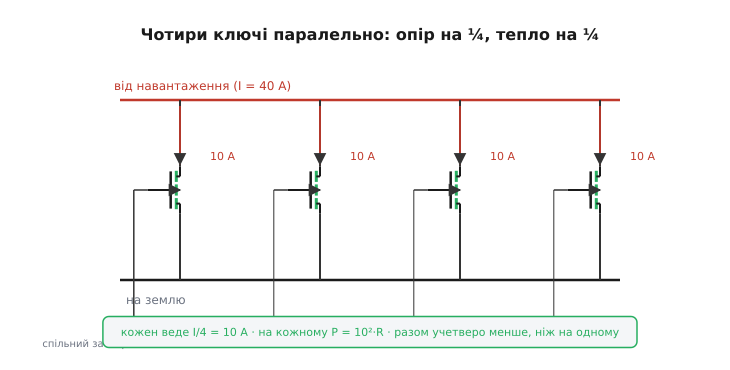
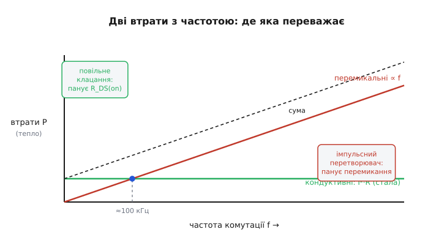

# 🧮 Тепло на R_DS(on): чому квадрат, чому паралель ділить на N, і де парабола перетинає пряму

Один параметр відкритого MOSFET вирішує, чи потрібен ключу радіатор, чи згорить прилад під навантаженням і скільки транзисторів доведеться ставити поряд, — це опір відкритого каналу R_DS(on). Сам опір — дрібниця, частки ома. Але між цим опором і теплом, яке ключ виділяє, стоїть не пряма пропорція, а **квадрат**, і саме квадрат робить усю математику ключа цікавою: він пояснює, чому подвоєний струм учетверо страшніший, чому чотири транзистори поряд гріються не вчетверо, а в **шістнадцять** разів менше за один, і чому крива MOSFET, спершу нижча за пряму біполярного, з ростом струму неминуче її перетинає.

Розберімо цей квадрат до самого кореня. Не як формулу, яку треба запам'ятати, а як наслідок одного простого факту: відкритий MOSFET — це **резистор**, а не джерело сталого падіння. Усе інше випливе звідси саме собою.

## Звідки квадрат: відкритий ключ — це резистор

Почнімо з того, чим відкритий MOSFET відрізняється від відкритого біполярного, бо весь квадрат сидить саме в цій відмінності.

Насичений біполярний транзистор тримає між колектором і емітером майже **сталу** напругу — Uce(sat), десь 0.2 В, — хоч який крізь нього тече струм. Це падіння на p-n-переході, і воно вперте: росте зі струмом ледь-ледь, по суті фіксоване. Тепло на такому ключі — добуток сталого падіння на струм:

```
P_бт = Uce(sat) · I        (падіння стале → P росте лінійно зі струмом)
```

Подвоїли струм — удвічі більше тепла. Проста пропорція, пряма лінія.

Відкритий MOSFET поводиться інакше. У нього між стоком і витоком немає сталого падіння — є **опір** R_DS(on). А напруга на опорі не фіксована, вона сама залежить від струму за законом Ома:

```
U = I · R_DS(on)        (падіння росте разом зі струмом)
```

Ось у цьому вся різниця. У біполярного напруга стала, а в MOSFET вона **сама росте зі струмом**. Тепер порахуймо тепло. Потужність — завжди добуток напруги на струм, P = U·I, це універсально. Підставмо в нього напругу MOSFET:

```
P = U · I = (I · R_DS(on)) · I = I² · R_DS(on)
```

І ось він, квадрат, — і видно, **звідки** він узявся. Струм зайшов у добуток **двічі**: один раз як сам струм, що тече крізь ключ, і другий раз — заховавшись усередині напруги, бо ця напруга сама пропорційна струму. У біполярного струм у добуток заходить лише раз (напруга від нього не залежить), тому там лінія. У MOSFET — двічі, тому парабола.

> 🔧 **Навіщо це.** Квадрат — не математична причепа, а те, що визначає тепловий бюджет ключа. Подвоїли струм навантаження — приготуйтеся не до подвоєного, а до **вчетверо** більшого тепла. Перейшли з 5 А на 10 А на тому самому транзисторі — і замість, скажімо, 0.75 Вт маєте вже 3 Вт; те, що працювало голим, тепер вимагає радіатора або паралельного брата. Інженер, який тримає квадрат у голові, не дивується, чому «трохи більший» струм раптом спалив ключ.

Запишімо обидві формули поряд, щоб квадрат проступив остаточно:

```
біполярний:  P = Uce(sat) · I        ← струм один раз  → пряма
MOSFET:      P = I² · R_DS(on)         ← струм двічі     → парабола
```

Уся подальша поведінка ключа — паралелення, точка перетину, межа радіатора — це наслідки того, що в нижньому рядку струм стоїть **у квадраті**.

## Worked-приклад: квадрат у числах

Поставмо квадрат на конкретні цифри, щоб відчути його силу.

**Той самий ключ R_DS(on) = 30 мОм на трьох струмах: 5, 10, 20 А. Скільки тепла?**
```
I = 5 А:    P = 5²  · 0.03 = 25  · 0.03 = 0.75 Вт
I = 10 А:   P = 10² · 0.03 = 100 · 0.03 = 3.0 Вт      (струм ×2 → тепло ×4)
I = 20 А:   P = 20² · 0.03 = 400 · 0.03 = 12.0 Вт     (струм ×4 → тепло ×16)
```
Струм виріс у чотири рази — з 5 до 20 А, — а тепло підскочило в **шістнадцять**: з 0.75 до 12 Вт. Дванадцять ват на крихітному корпусі — це вже не «тепленький», це розпечений до неможливого прилад, який без масивного радіатора або кількох транзисторів паралельно просто зварить власний кристал. Квадрат карає за струм нещадно.

Звідси й перше практичне правило вибору: на великих струмах **кожен міліом на рахунку**, бо кожен з них множиться на величезне I². Той самий ключ із R_DS(on) удвічі меншим (15 мОм) на 20 А віддав би рівно вдвічі менше — 6 Вт замість 12. Опір входить у тепло лінійно, струм — квадратично; тож коли струм заданий навантаженням і його не зменшити, лишається тиснути на опір — меншим R_DS(on) або кількома приладами поряд. До цього «поряд» зараз і перейдімо, бо там квадрат грає вже на нашу користь.

## Паралель: чому N ключів гріються не в N, а в N² разів менше

Найрозповсюдженіший спосіб приборкати тепло на великому струмі — поставити **кілька однакових MOSFET паралельно**: стоки разом, витоки разом, затвори разом, керовані одним сигналом. Інтуїція підказує, що N транзисторів поділять роботу й кожному дістанеться менше. Але **наскільки** менше — тут квадрат підносить приємний сюрприз.

Простежмо це строго. Хай повний струм навантаження — I, і ми розклали його на N однакових ключів. Однакові прилади під спільним затвором ділять струм порівну (чому саме порівну і що буває, коли вони не зовсім однакові, — окрема тонкість нижче). Отже, крізь кожну гілку тече лише

```
I_гілки = I / N
```

Тепер тепло на **одному** транзисторі. У формулу P = I²·R підставляємо струм **гілки**, а не повний — бо саме стільки тече крізь цей прилад, і опір у нього свій, повний R_DS(on) одного транзистора:

```
P_одного = (I/N)² · R = I²·R / N²
```

Ось де квадрат обернувся на користь. Струм гілки впав у N разів — а тепло на одному приладі, через квадрат, упало в **N²** разів. Кожному окремому транзистору дісталося не «у N разів легше», а **в N² разів легше**.

А скільки тепла виділяє вся збірка разом? Складаємо N однакових транзисторів, на кожному P = I²·R/N²:

```
P_разом = N · P_одного = N · I²·R / N² = I²·R / N
```

Сумарне тепло впало в **N разів** проти одного транзистора. Зведімо обидва висновки разом, бо в них уся суть:

```
на КОЖНОМУ приладі:   тепло ÷ N²     (полегшало в N² разів)
на ВСІЙ збірці разом:  тепло ÷ N      (сумарно вN менше)
```

І це не суперечність, а дві сторони однієї монети. Кожен транзистор полегшав у N² разів, але транзисторів **N штук**; перемножиш — і сумарне полегшення виходить N²/N = N разів. Інакше кажучи: повний струм гріє ту саму збірку так, наче її опір став **R/N** (N однакових опорів паралельно — це і є R/N), а на опорі R/N той самий струм I виділяє I²·R/N. Усе сходиться.

> 🔧 **Навіщо це.** Паралель ділить тепло на N **двічі вигідно**: збірка в цілому гріється в N разів менше, а кожен окремий кристал — аж у N² разів менше, тож йому й радіатор потрібен куди скромніший. Чотири транзистори по 30 мОм на 40 А: на одному було б 40²·0.03 = 48 Вт (нереально), а в четвірці кожен везе 10 А й гріється 10²·0.03 = 3 Вт — посильно для дрібного корпусу, а вся збірка віддає 12 Вт замість 48. Саме так роблять силові вузли на десятки й сотні ампер: не шукають один героїчний транзистор, а ставять поряд кілька звичайних.


*Чотири n-MOSFET між спільними шинами, керовані одним затвором. Повний струм 40 А розкладається на чотири гілки по 10 А. На кожному приладі тепло — (40/4)²·R = 10²·R, удвічі-вчетверо менше, ніж тягнув би один; уся збірка віддає вчетверо менше тепла, бо її сумарний опір став R/4.*

### Чому однакові MOSFET ділять струм самі — і де ця рівновага хитка

Залишилося пояснити, **чому** струм ділиться між гілками порівну, бо на цьому тримається весь попередній розрахунок. І тут MOSFET має властивість, якої біполярний позбавлений, — він **сам себе вирівнює**.

Уявімо, що один із чотирьох транзисторів виявився трішки «жадібнішим» — його R_DS(on) через розкид трохи менший, тож він перетягнув на себе більше струму, ніж сусіди. Більший струм крізь нього означає більше тепла (та сама I²·R), отже, цей прилад **нагрівається сильніше**. А тепер ключовий факт: у відкритого MOSFET опір R_DS(on) **росте з температурою** — у нього додатний температурний коефіцієнт (англ. *positive temperature coefficient*). Нагрівшись, жадібний транзистор **підвищує власний опір** — і тим самим **відштовхує** надлишок струму назад до холодніших сусідів. Струм перерозподіляється, поки всі чотири не зрівняються по нагріву. Це петля від'ємного зворотного зв'язку, вбудована в саму фізику приладу: хто бере забагато — той гріється, хто гріється — той бере менше.

> Чому опір каналу росте з температурою — бо нагрів розхитує кристалічну ґратку, і носії в каналі частіше об неї спотикаються (рухливість падає), тож той самий канал чинить струмові більший опір. Як саме температура гальмує носії заряду розгортає тема [рухливість носіїв заряду](root:ph-condensed/carrier-mobility). Тут нам досить факту: R_DS(on) теплішого MOSFET більший.

Саме цим MOSFET вигідно відрізняється від біполярного, який паралелять зі страхом. У біполярного залежність зворотна: тепліший перехід проводить струм **легше** (струм росте з температурою), тож гарячіший транзистор перетягує **ще більше** струму, гріється **ще дужче** — петля з додатним знаком, яка штовхає один прилад у [тепловий розгін](root:hw-components/thermal-runaway), поки той не згорить. Щоб паралелити біполярні, доводиться ставити в кожен емітер вирівнювальний резистор-баласт. MOSFET цього майже не потребує: додатний коефіцієнт R_DS(on) робить роботу баласта сам.

Але чесність вимагає окреслити межу цієї самовирівнювальної ласки, бо вона не безмежна. Самовирівнювання працює добре, **поки транзистори відкриті повністю** і поділяють спільний нагрів — тобто в усталеному, кондуктивному режимі. По-перше, прилади варто садити на **спільний радіатор**: якщо гарячий транзистор не передає тепла сусідам, його опір росте лише в нього, що допомагає, але якщо тепловий контакт між ними поганий, рівновага гірша. По-друге, самовирівнювання стосується лише **сталого** струму; у **миті перемикання** прилади поділяють струм украй нерівно, і там командують не опори, а паразитні індуктивності виводів та розкид заряду затвора — їх додатний коефіцієнт уже не приборкує. Тому паралель чудово ділить **кондуктивні** втрати й кепсько — **перемикальні**; саме до цього поділу двох родів втрат ми зараз і переходимо.

## Дві природи втрат: стала I²R проти лінійних за частотою

Досі ми рахували лише тепло **відкритого** ключа — кондуктивні втрати, P = I²·R. Це все тепло, поки ключ просто стоїть увімкнений. Але ключ на те й ключ, що він **перемикається**, і кожне перемикання має власну ціну, окрему від R_DS(on). На повільному клацанні раз на секунду ця ціна нікого не обходить; на десятках кілогерц вона стає головною. Розберімо, звідки береться друга природа втрат і де вона переважує першу.

**Кондуктивні втрати** — це знайоме тепло відкритого каналу:

```
P_конд = I² · R_DS(on)
```

Воно залежить лише від струму й опору. Скільки разів на секунду ключ клацає — кондуктивним втратам **байдуже**: поки канал відкритий, він гріється однаково, чи ви перемикаєте раз на годину, чи сто тисяч разів на секунду. На графіку залежності від частоти це **горизонтальна** пряма — стала.

**Перемикальні втрати** (англ. *switching loss*) народжуються інакше — у короткі миті переходу. Затвор MOSFET — це [конденсатор](root:hw-components/gate-capacitance), і щоб змінити стан, його треба перезарядити; поки заряд перетікає (десятки-сотні наносекунд), канал проходить через «напіввідкритий» стан, де на ключі **заразом** і відчутна напруга, і відчутний струм. Їхній добуток у цю мить — велика миттєва потужність, короткий сплеск тепла. Один такий сплеск має приблизно стале значення енергії E_sw (джоулів за одне перемикання), бо він визначається тим, як швидко драйвер перекидає затвор, а не частотою. Але **скільки** цих сплесків за секунду — це рівно частота комутації f. Тому повна перемикальна потужність — енергія одного сплеску, помножена на їхню кількість за секунду:

```
P_перем = E_sw · f        (енергія на перемикання × перемикань на секунду)
```

І ось головна відмінність від кондуктивних: перемикальні втрати **пропорційні частоті**. Подвоїли частоту — удвічі більше сплесків за секунду — удвічі більше перемикального тепла. На графіку це **похила пряма з нуля**: при f = 0 (ключ просто стоїть) перемикальних втрат немає зовсім, і вони ростуть лінійно з частотою.

Складімо обидві природи в повне тепло ключа:

```
P_повне = I²·R_DS(on)  +  E_sw·f
          └─ стала ─┘     └─ ∝ f ─┘
          кондуктивні    перемикальні
```

Перший доданок не залежить від частоти, другий росте з нею лінійно. На малих частотах панує перший (стала), на високих рано чи пізно переможе другий (бо він необмежено росте). Десь між ними — частота, де вони **рівні**, і це межа двох світів.


*Два роди втрат залежно від частоти комутації. Кондуктивні (I²·R_DS(on)) — горизонтальна пряма: від частоти не залежать. Перемикальні (E_sw·f) — похила з нуля: на малій частоті дрібні, з ростом f беруть гору. Пунктир — їхня сума, повне тепло ключа. Зліва від точки перетину (повільне клацання) панує R_DS(on); справа (імпульсний перетворювач на десятках кГц) — перемикання.*

### Точка рівноваги: де перемикання наздоганяє провідність

Знайдімо ту частоту, де перемикальні втрати зрівнюються з кондуктивними, — звідти видно, у якому режимі що головне. Прирівняймо два доданки:

```
E_sw · f_рівн = I² · R_DS(on)

           I² · R_DS(on)
f_рівн = ────────────────
              E_sw
```

Нижче за f_рівн більше тепла дають кондуктивні втрати — править R_DS(on), і ключ варто добирати за малим опором. Вище за f_рівн перемикальні беруть гору — і тоді гнатися за останніми міліомами опору безглуздо: тепло робить уже не опір, а **заряд затвора** й швидкість драйвера. Це поділ на два інженерні світи.

**Де ця межа на типовому ключі.** Хай струм навантаження I = 5 А, опір R_DS(on) = 30 мОм, а одне перемикання коштує E_sw = 7.5 мкДж (типовий порядок для середнього силового MOSFET із пристойним драйвером). На якій частоті перемикання зрівняється з провідністю?
```
P_конд = I²·R = 5²·0.03 = 0.75 Вт              (стала, від частоти не залежить)
f_рівн  = P_конд / E_sw = 0.75 / 7.5×10⁻⁶ = 100 000 Гц = 100 кГц
```
До 100 кГц у цьому ключі панує R_DS(on): хочеш холодніший — бери менший опір. Вище 100 кГц головними стають перемикальні втрати: тепер вирішує заряд затвора й сила драйвера, а не опір каналу. Ось чому просте увімкнення-вимкнення (частки герца) живе **виключно** на R_DS(on) — перемикальних втрат там фактично нуль, — а в [імпульсних перетворювачах](root:hw-components/switching-losses) на сотнях кілогерц борються насамперед із перемиканням, а опір каналу йде другим номером.

> 🔧 **Навіщо це.** Ця точка рівноваги диктує, **який** параметр транзистора оптимізувати. Реле клацає раз на секунду — бери прилад із наймешим R_DS(on), на заряд затвора начхати. [Імпульсний перетворювач](root:hw-analog/class-d-amplifier) на 200 кГц — навпаки: шукай малий заряд затвора й став сильний драйвер, бо опір каналу там уже не головний винуватець тепла. Плутати ці два світи — типова помилка: поставити в швидкий перетворювач «найнижчоомний» транзистор із величезним затвором і дивуватися, чому він печеться, хоч R_DS(on) рекордно малий.

## Де парабола MOSFET перетинає пряму біполярного

Лишилося звести найперший висновок — квадрат проти лінії — до конкретної точки. Ми бачили: тепло біполярного ключа росте зі струмом **лінійно** (P = Uce(sat)·I, пряма крізь початок), а MOSFET — **квадратично** (P = I²·R, парабола). На малих струмах парабола нижча за пряму: квадрат малого числа малий, тож MOSFET холодніший. Але парабола вигинається вгору дедалі крутіше, а пряма росте рівномірно, тож рано чи пізно парабола **наздожене й перетне** пряму. Знайдімо, де саме.

Прирівняймо два тепла — точка перетину там, де вони рівні:

```
I² · R_DS(on) = Uce(sat) · I
```

Поділимо обидві частини на I (струм у точці перетину не нуль, ділити можна) — і один множник I зліва скорочується:

```
I · R_DS(on) = Uce(sat)

            Uce(sat)
I_перет = ────────────
            R_DS(on)
```

Чистий і промовистий результат. Точка перетину — це струм, за якого падіння на опорі MOSFET (I·R_DS(on)) рівно дорівнює сталому падінню біполярного Uce(sat). Логічно: доки на MOSFET падає менше за 0.2 В, він і холодніший; коли його падіння доросло до тих самих 0.2 В — зрівнялися; вище — на MOSFET падає вже **більше**, ніж стале падіння біполярного, і парабола йде над прямою.

**Де перетинаються конкретні ключі.** Біполярний зі сталим Uce(sat) = 0.2 В проти MOSFET із R_DS(on) = 30 мОм. На якому струмі вони гріються однаково?
```
I_перет = Uce(sat) / R_DS(on) = 0.2 / 0.03 ≈ 6.7 А
```
Нижче 6.7 А виграє MOSFET (на ньому падає менше за 0.2 В, тепла менше). На 6.7 А — нічия. Вище 6.7 А парабола вже над прямою: на MOSFET падає більше за 0.2 В, і він гріється **дужче** за біполярний на тому самому струмі. Здавалося б, перевага MOSFET перевертається — але тут і ховається ключ до всієї практики.

Подивімося на формулу точки перетину ще раз: I_перет = Uce(sat)/R_DS(on). Знаменник — це R_DS(on), і ми ним **керуємо**. Уся гра з паралеленням і вибором низькоомного приладу — це гра саме на зсув цієї точки. Візьмемо R_DS(on) удесятеро менший, 3 мОм (один потужний прилад або десяток звичайних паралельно):

```
I_перет = 0.2 / 0.003 ≈ 67 А
```

Точка перетину поїхала з 6.7 А аж на 67 А. Тепер MOSFET холодніший за біполярний на всьому розумному діапазоні струмів — пряму він перетне аж за десятками ампер, куди реальне навантаження зазвичай не доходить. Ось чому в силовій комутації MOSFET майже витіснив біполярний: **меншим R_DS(on) точку перетину відсувають так далеко, що парабола фактично ніколи не доганяє пряму** в робочому діапазоні. Біполярний зі своїм упертим Uce(sat) такої ручки не має — його пряму нічим не опустиш, падіння на p-n-переході фіксоване фізикою. А MOSFET свою параболу притискає до осі скільки завгодно — кожен зекономлений міліом відсуває точку перетину далі вправо.

> 🔧 **Навіщо це.** Точка перетину I_перет = Uce(sat)/R_DS(on) — це кількісна відповідь на питання «MOSFET чи біполярний для мого струму». Порахували: робочий струм нижчий за I_перет — MOSFET холодніший, беріть його. Близько чи вище — або беріть MOSFET із меншим R_DS(on) (відсунете точку), або кілька паралельно (їхній сумарний опір R/N відсуває її в N разів далі). Біполярний має сенс хіба там, де струми скромні, а напруги високі, бо стале падіння 0.2 В на малому струмі іноді програє опору лише дрібно, зате біполярний дешевший і простіший у керуванні. Але щойно струми ростуть — квадрат R_DS(on), приборканий малим опором, виграє завжди.

## Уся арифметика тепла на ключі в одному місці

Зведімо чотири висновки, що всі випливли з одного кореня — «відкритий MOSFET є резистор, тож струм входить у тепло двічі»:

```
квадрат:        P = I² · R_DS(on)              струм у добутку двічі → парабола
паралель N:     на одному  P = (I/N)²·R = I²R/N²    (полегшало в N²)
                на збірці   P = I²R/N               (сумарно вN менше)
двоє втрат:     P_повне = I²·R + E_sw·f         стала + лінійна за частотою
                рівновага  f_рівн = I²·R / E_sw
перетин з BJT:  I_перет = Uce(sat) / R_DS(on)   де парабола доганяє пряму
```

Кожна з цих формул — не окреме правило для запам'ятовування, а наслідок того самого квадрата. Квадрат робить струм небезпечним (×2 струму → ×4 тепла) — і він же робить паралель щедрою (÷N струму → ÷N² тепла на приладі). Він задає параболу, що неминуче перетне пряму біполярного, — і він же дозволяє відсунути той перетин за обрій, давлячи R_DS(on). А над усім цим стоїть друга, незалежна природа тепла — перемикальні втрати, що ростуть із частотою й на швидких ключах переважують усю арифметику опору. Тримаючи в голові ці п'ять рядків, на тепловий бюджет будь-якого MOSFET-ключа можна відповісти ще до того, як прилад уперше нагріється на столі: скільки ват він віддасть, чи потрібен радіатор, скільки приладів ставити поряд і чи не час уже рахувати не опір, а заряд затвора.
