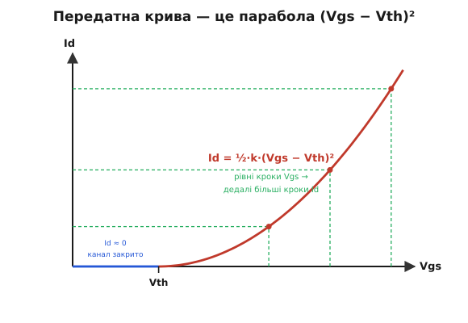
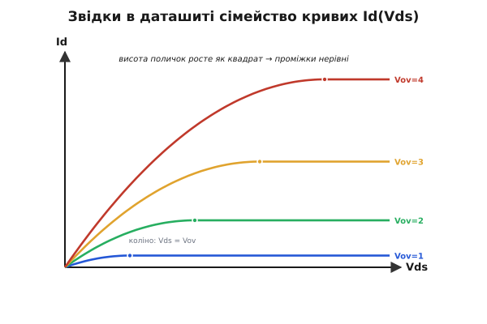

# 🧮 Квадратичний закон: звідки беруться криві в даташиті MOSFET

Передатну криву MOSFET можна описати **якісно**: до порога Vth струму майже нема, за порогом він швидко зростає. Тут — точна формула цієї кривої, чому вона саме **парабола**, а не пряма, і як із одного простого закону випливає все сімейство характеристик, що друкують у паспорті транзистора. Маючи його в голові, ви читаєте даташит не як таблицю чужих чисел, а як одну формулу, накреслену по-різному.

### Головна змінна — перевищення порогу

Важить не сама Vgs, а на скільки вона перевищує поріг. Цю різницю — **перевищення порогу** (overdrive) — позначимо Vov:

```
Vov = Vgs − Vth
```

Поки Vov < 0 (тобто Vgs нижча за поріг) — каналу нема, струм майже нульовий. Щойно Vov > 0 — канал відкрився, і саме Vov керує тим, **наскільки** добре він проводить. Запам'ятати варто одне: усе подальше залежить не від повної напруги на затворі, а від цього надлишку над порогом. Два транзистори з різними Vth, але однаковим Vov, поводяться однаково.

### Чому квадрат, а не пряма

Інтуїція проста, якщо помітити, що від перевищення порогу залежать **дві** речі одразу.

По-перше, **скільки** рухомих електронів затвор стягнув у канал. Затвор з оксидом і поверхнею — це конденсатор: заряд на ньому Q = C·U, де напруга над порогом і є Vov (усе, що нижче порога, пішло на збіднення й корисного заряду не дає). Тож рухомий заряд каналу зростає **прямо пропорційно** Vov — більше перевищення, густіший електронний шар.

По-друге, **як швидко** ці електрони біжать від витоку до стоку. Швидкість задає поздовжнє поле в каналі, а воно — це напруга вздовж каналу, поділена на його довжину. На межі насичення ця напруга теж сягає приблизно Vov. Тобто й рушійна напруга зростає пропорційно Vov.

А струм — це заряд, помножений на те, як швидко його проштовхують: грубо кажучи, Id ~ (заряд) × (швидкість). Обидва множники пропорційні Vov — і в добутку дають **квадрат**. Звідси й парабола: подвоїли перевищення — носіїв удвічі більше, і кожен удвічі прудкіший, разом струм у чотири рази. Квадрат тут не математична випадковість, а слід двох незалежних причин, що тягнуть в один бік.

### Формула насичення

У робочому режимі (насичення) закон має вигляд:

```
Id = ½ · k · (Vgs − Vth)²        (Vgs > Vth)
Id ≈ 0                            (Vgs < Vth)
```

Тут **k = μ · Cox · (W/L)** — «крутість» приладу (одиниці А/В²): рухливість носіїв μ, ємність затвора на одиницю площі Cox і відношення ширини каналу до довжини W/L. Усе це вшито в геометрію й матеріал транзистора — тобто k є його паспортною рисою, як і Vth. Коефіцієнт ½ — просто стала з виведення. Параметр k подають по-різному (часом як k′·W/L, часом уже зведеним), але суть одна: це число, що каже, скільки ампер дає кожен вольт перевищення в квадраті.


*Передатна крива з формули: до Vth — нульова поличка, за порогом — парабола. Ключове видно одразу: **рівні** кроки Vgs дають **дедалі більші** кроки Id. Біля порога струм лінується, далі росте все стрімкіше — тому «трохи додати на затвор» поблизу Vth означає сильно змінити струм.*

### Порахуймо: скільки струму дасть реальний транзистор

**Умова.** Логічний MOSFET: Vth = 1.0 В, k = 0.5 А/В². Підраховуємо струм стоку (у насиченні) для трьох напруг на затворі — 1.5 В, 2.0 В і 3.0 В — і дивимося, як він зростає.

:::tabs
```cpp
// Квадратичний закон у насиченні: Id = 0.5 * k * (Vgs - Vth)^2
#include <cstdio>

float id_sat(float vgs, float vth, float k) {
    float vov = vgs - vth;          // перевищення порогу
    if (vov <= 0.0f) return 0.0f;   // нижче порога — канал закрито
    return 0.5f * k * vov * vov;    // квадрат перевищення
}

int main() {
    const float vth = 1.0f, k = 0.5f;
    float vgs[] = { 1.5f, 2.0f, 3.0f };
    for (float v : vgs) {
        float vov = v - vth;
        std::printf("Vgs=%.1f V  Vov=%.1f V  Id=%.3f A\n",
                    v, vov, id_sat(v, vth, k));
    }
    return 0;
}
```
```python
# Квадратичний закон у насиченні: Id = 0.5 * k * (Vgs - Vth)^2

def id_sat(vgs, vth, k):
    vov = vgs - vth                 # перевищення порогу
    if vov <= 0.0:                  # нижче порога — канал закрито
        return 0.0
    return 0.5 * k * vov * vov      # квадрат перевищення

vth, k = 1.0, 0.5
for vgs in (1.5, 2.0, 3.0):
    vov = vgs - vth
    print(f"Vgs={vgs:.1f} V  Vov={vov:.1f} V  Id={id_sat(vgs, vth, k):.3f} A")
```
```js
// Квадратичний закон у насиченні: Id = 0.5 * k * (Vgs - Vth)^2

function idSat(vgs, vth, k) {
    const vov = vgs - vth;          // перевищення порогу
    if (vov <= 0) return 0;         // нижче порога — канал закрито
    return 0.5 * k * vov * vov;     // квадрат перевищення
}

const vth = 1.0, k = 0.5;
for (const vgs of [1.5, 2.0, 3.0]) {
    const vov = vgs - vth;
    console.log(
        `Vgs=${vgs.toFixed(1)} V  Vov=${vov.toFixed(1)} V  Id=${idSat(vgs, vth, k).toFixed(3)} A`);
}
```
```go
// Квадратичний закон у насиченні: Id = 0.5 * k * (Vgs - Vth)^2
package main

import "fmt"

func idSat(vgs, vth, k float64) float64 {
	vov := vgs - vth        // перевищення порогу
	if vov <= 0 {           // нижче порога — канал закрито
		return 0
	}
	return 0.5 * k * vov * vov // квадрат перевищення
}

func main() {
	vth, k := 1.0, 0.5
	for _, vgs := range []float64{1.5, 2.0, 3.0} {
		vov := vgs - vth
		fmt.Printf("Vgs=%.1f V  Vov=%.1f V  Id=%.3f A\n",
			vgs, vov, idSat(vgs, vth, k))
	}
}
```
:::

```
Vgs=1.5 V  Vov=0.5 V  Id=0.063 A
Vgs=2.0 V  Vov=1.0 V  Id=0.250 A
Vgs=3.0 V  Vov=2.0 V  Id=1.000 A
```

Подивіться на числа: рівні кроки **подвоєння** перевищення (0.5 → 1.0 → 2.0 В) дають струм, що зростає **в чотири рази** на кожен крок (0.063 → 0.250 → 1.000 А). Це і є квадрат у дії — і це причина, чому біля порога транзистор такий «нервовий»: десята вольта на затворі тут важить набагато більше, ніж та сама десята далеко за порогом.

### Дві області: то резистор, то джерело струму

Формула вище — для насичення, коли стік «відірваний» високою напругою. Але при **малій** Vds той самий MOSFET поводиться як **резистор** — це і є [опір відкритого ключа Rds(on)](topic:hw-components/rds-on). Повний закон має дві гілки:

```
Id = k · [ (Vgs−Vth)·Vds − Vds²/2 ]   (Vds < Vov — тріодна, «резистор»)
Id = ½ · k · (Vgs−Vth)²               (Vds ≥ Vov — насичення, «джерело струму»)
```

Перехід («коліно») стається при Vds = Vov: до нього струм росте з напругою (резистивна гілка), після — вирівнюється в поличку, майже не залежну від Vds. У тріодній гілці, поки Vds зовсім мала, член Vds²/2 нікчемний, і струм майже лінійний за Vds: Id ≈ k·Vov·Vds. А пряма пропорція струму напрузі — це й є закон Ома з опором каналу. Звідси відразу видно, від чого залежить Rds(on): опір ≈ 1/(k·Vov), тобто падає з перевищенням. Хочеш малий опір ключа — давай великий Vov.

### Звідки сімейство кривих у даташиті

Тепер зрозуміло, **звідки** беруться ті криві в паспорті. «Вихідні характеристики» — це Id залежно від Vds, по одній кривій на кожне значення Vgs — є просто цей закон, накреслений для кількох напруг затвора:


*Кожна крива: підйом (тріодна гілка) → поличка (насичення) на висоті ½·k·Vov². Оскільки висота полички росте як **квадрат** перевищення, рівні кроки Vgs дають нерівні проміжки — криві тиснуться внизу й розходяться вгорі. А передатна крива вище — це зріз цього ж сімейства по висотах поличок.*

Звідси читання даташиту стає прозорим. Беруть вихідні криві — бачать дві гілки кожної: крутий підйом біля нуля (там транзистор працює як ключ із малим опором) і пласку поличку далі (там він джерело струму). Дивляться на висоти поличок — вони стоять нерівно, бо ростуть як квадрат напруги затвора. А якщо ті ж самі поличкові висоти перенести на графік «висота проти Vgs», вийде та сама парабола передатної кривої. Один закон — три різні картинки в паспорті.

### Крутість gm — наскільки сильно затвор керує струмом

Нахил передатної кривої має власну назву — **крутість** (transconductance) gm. [Продиференціювавши](topic:math-analysis/derivative) квадратичний закон:

```
gm = dId/dVgs = k · (Vgs − Vth) = √(2 · k · Id)
```

Звідси два висновки. Крутість **зростає з перевищенням порогу** — що далі від Vth, то стрімкіша крива, то сильніше затвор керує струмом. І вона зростає як **корінь зі струму** — більший робочий струм дає більшу крутість, але дедалі неохочіше (учетверо більший струм — лише вдвічі більша крутість). Це і є міра підсилювальної здатності MOSFET: наскільки мала зміна напруги на затворі ворушить струм стоку. Підсилювач на польовому транзисторі тому й ставлять на робочу точку з пристойним перевищенням — там gm велика й сигнал виходить сильним.

### Де це працює в курсі

Квадратичний закон — це **перша**, ідеалізована модель, але вона пояснює майже всю поведінку транзистора. Тріодна гілка — це [Rds(on)](topic:hw-components/rds-on): малий опір відкритого ключа виходить при великому перевищенні й малій Vds. Вона ж показує, чому [MOSFET логічного рівня](topic:hw-components/mosfet-power-switch) такий важливий — щоб дістати велике перевищення (а отже, малий опір) від низької напруги керування, поріг мусить бути низьким. Варто лише пам'ятати межу моделі: на великих струмах реальна крива пологішає — рухливість падає, додається опір виводів, — тож паспортні графіки трохи відхиляються від чистої параболи. Але як **картина в голові** квадратичний закон безвідмовний: затвор задає перевищення, перевищення в квадраті задає струм.
