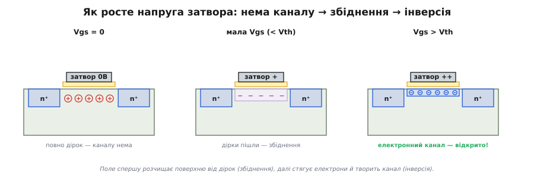
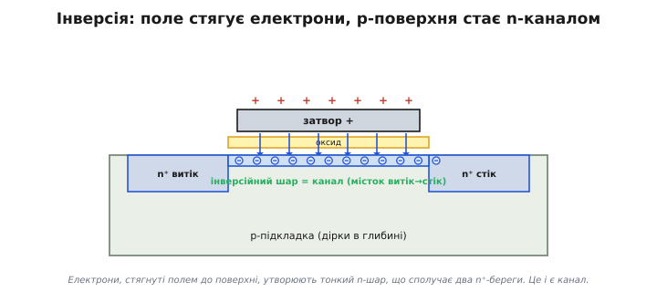
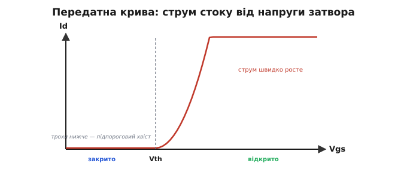
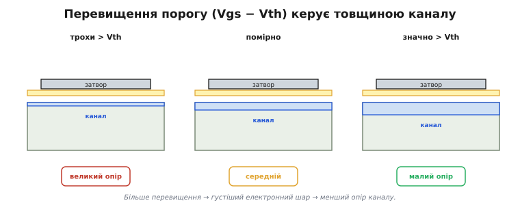
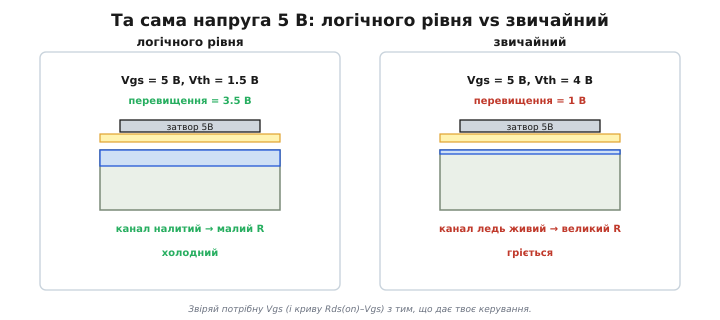
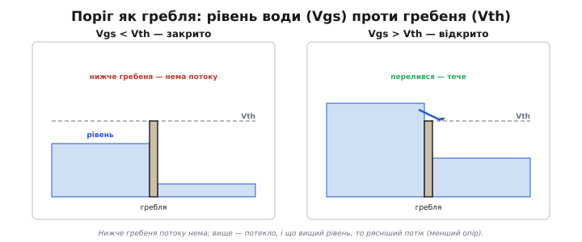

# Поріг і канал: як поле відкриває провідність

У [внутрішній будові MOSFET](root:hw-components/mosfet-structure) без напруги на затворі каналу немає — лише p-підкладка між двома n⁺-берегами, тобто два зустрічні діоди. Тепер найцікавіше: подаймо на затвор напругу й **простежимо крок за кроком**, як під ним народжується провідний канал. Це серцевина роботи MOSFET.

### Крок за кроком: від збіднення до інверсії

Канал — це поверхня p-кремнію прямо під оксидом. У p-кремнії основні носії — **дірки** (позитивні). Затвор лежить зверху крізь скло. Подаваймо на нього щораз більшу **додатну** напругу й дивімося, що робиться біля поверхні.

**Крок 0 — нуль на затворі.** Поверхня — звичайний p-кремній, повний дірок. Шляху для електронів від витоку до стоку немає. Прилад **закритий**.

**Крок 1 — невелика додатна напруга: збіднення.** Додатний заряд на затворі полем **відштовхує** однойменні позитивні дірки від поверхні вглиб — так само, як поле розчищає носії в [збідненій області p-n переходу](root:ph-condensed/pn-junction). Біля оксиду лишається шар, з якого дірки пішли, — **збіднена область** *(depletion region)*. Рухомих носіїв там тепер нема (дірки втекли, електронів ще не прийшло), тож струм **усе ще не тече**. Поле поки що «витрачається» на розчищення поверхні від дірок.

**Крок 2 — досить велика напруга: інверсія.** Піднімаймо напругу далі. Тепер поле таке сильне, що не лише відштовхує дірки, а й **притягує до поверхні електрони** — неосновні носії, яких удосталь у сусідніх n⁺-витоку та стоку. Під оксидом збирається тонкий шар **електронів**. Поверхня, що була p-типом, стала провідною для електронів — фактично **обернулася на n-тип**. Цей перевернутий шар і звуть **інверсійним** *(inversion layer)*, а інверсія — це і є **канал**: суцільний n-місток, що з'єднав n⁺-витік і n⁺-стік. Тепер електрони можуть бігти витік → канал → стік. Прилад **відкрився**.


*Як поле творить канал. Зліва — Vgs = 0: поверхня повна дірок, каналу нема. Посередині — мала Vgs: дірки відштовхнуто, збіднена область, але рухомих носіїв нема. Справа — велика Vgs: до поверхні притягнуто електрони, p-шар «інвертувався» в n-канал, що з'єднав витік і стік.*

### Інверсійний шар — це і є місток

Спинімося на головному моменті — **інверсії**. Дивовижно, що поле здатне не просто прибрати наявні носії, а **зібрати протилежні**: позитивний затвор стягує до поверхні негативні електрони, аж поки їх там не набереться стільки, що тонкий шар p-кремнію поводиться як n-кремній. Це наче поле **перефарбувало** поверхню з «діркової» на «електронну».

І саме цей наведений шар замикає коло. Якщо уявити [два n⁺-острови в p-морі](root:hw-components/mosfet-structure) без переправи, то інверсійний шар — і є той **наведений міст** між островами, зітканий із притягнутих електронів. Прибрав напругу — електрони розійшлися, міст розтанув, прилад знову закритий. Ось чому керування таке оборотне й дешеве: ми щоразу **наводимо** провідну доріжку полем, а не прокладаємо її назавжди.

Зверніть увагу: усе це — про **збагачений** (нормально закритий) тип, де канал доводиться наводити з нуля. Поріг тут — це момент, коли електронів під оксидом набирається стільки ж, скільки дірок у глибині, і поверхня впевнено «перевертається» в n-тип (фізики звуть цю мить **сильною інверсією**). До того — лише збіднення та кволі поодинокі носії; після — повноцінний канал, що проводить.


*Інверсійний шар зблизька. Поле затвора стягує електрони з n⁺-берегів до поверхні; коли їх досить, p-поверхня «інвертується» в n-канал — суцільний місток витік→стік. Це шар лише в кілька атомів завтовшки, але саме він проводить струм.*

### Поріг: напруга, з якої прилад оживає

Очевидно, що інверсія настає не одразу, а коли напруга на затворі **перевалить за певну межу** — досить велику, щоб стягнути достатньо електронів. Цю межу звуть **пороговою напругою** *(threshold voltage)* й позначають **Vth** (або Vgs(th) — бо міряється між затвором і витоком, як і вся [керівна напруга затвора](root:hw-components/field-control)).

Правило просте:

```
Vgs < Vth  →  каналу нема (або кволий)  →  ВИМКНЕНО
Vgs > Vth  →  канал є, проводить        →  УВІМКНЕНО
```

Порогова напруга — це паспортна риса транзистора. У логічних MOSFET для мікросхем Vth малий — частки вольта; у силових — звичайно 2…4 В. Знаючи Vth, ми знаємо, якою напругою його вмикати.

А від чого залежить сам поріг? Передусім від товщини оксиду й легування підкладки ([будова MOSFET](root:hw-components/mosfet-structure)): тонший оксид і слабше леговане тіло — нижчий поріг. Це закладають на виробництві, добираючи Vth під призначення: для логіки роблять низький (щоб перемикалося від кількох десятих вольта), для силових — вищий (щоб випадкова наводка не відкрила ключ ненароком). Свій внесок має й **ефект підкладки**: напруга на тілі теж зсуває поріг. Тож Vth — величина не зовсім абсолютна, а трохи «жива», залежна від умов; саме тому для надійного ключа беруть запас над нею.


*Передатна характеристика: струм стоку залежно від напруги затвора. До порога Vth струм майже нульовий (закрито); за порогом — швидко зростає (відкрито). Vth — це «вмикач», вбудований у фізику приладу.*

Насправді перехід не математично різкий: трохи **нижче** порога вже тече крихітний струм, що зростає по експоненті, — його звуть **підпороговим** *(subthreshold)*. Для одного ключа це дрібниця, якою нехтують («нижче порога = вимкнено»). Та коли таких транзисторів мільярди, ці крихітні струми складаються у відчутний **струм спокою** чипа — головний клопіт сучасних процесорів і одна з причин, чому смартфон у кишені все одно потроху розряджається. Тому поріг намагаються зробити й не надто низьким.

> 🔧 **Навіщо це.** Поріг — це те, що робить MOSFET чудовим **цифровим** ключем: є чітка межа між «вимкнено» й «увімкнено». Подав на затвор напругу нижче порога — нуль; вище — одиниця. На цьому, по суті, й тримається вся логіка процесора: мільярди порогових ключів, кожен каже «так» або «ні» залежно від того, чи перевалила напруга на його затворі за Vth.

### Скільки відкрити: перевищення порогу

Поріг каже, **коли** канал з'являється. А **наскільки добре** він проводить — залежить від того, **на скільки** ми перевищили поріг. Цю різницю, `Vgs − Vth`, звуть **перевищенням порогу** *(overdrive)*.

Логіка проста: що більше `Vgs − Vth`, то сильніше поле, то більше електронів стягнуто в канал, то **товщий** провідний шар і **менший** його опір. Це можна сказати й мовою конденсатора, [яким керує поле затвора](root:hw-components/field-control): заряд інверсійного шару — це заряд на «обкладці-каналі», і він пропорційний саме перевищенню порогу, Q ≈ C·(Vgs − Vth). Нижче порога цей корисний заряд нульовий (усе пішло на збіднення); вище — кожен зайвий вольт на затворі докидає в канал ще електронів. Перевищення порогу — буквально міра того, скільки носіїв ми «налили» в місток. Біля самого порога канал кволий, ледь живий — опір великий; із добрим запасом над порогом канал «налитий» електронами — опір малий, струм тече вільно.

Звідси два режими, як і в [робочих областях біполярного транзистора](root:hw-components/bjt-regions): біля порога й трохи вище — плавне керування (підсилювач); далеко за порогом — канал повністю відкритий, опір мінімальний (ключ). Нам для ключа потрібен саме другий режим: гнати Vgs **значно** вище порога, щоб канал був налитий, а опір — найменший. Саме цей опір відкритого каналу, [Rds(on)](root:hw-components/rds-on), і визначає, скільки ключ грітиметься під струмом.


*Перевищення порогу. Що більше Vgs над Vth, то густіший електронний шар і менший опір каналу. Біля порога канал кволий (великий опір); далеко за порогом — налитий (малий опір). Цим і керують яскравістю чи струмом.*

> 🧮 **Скільки саме струму.** Залежність струму від перевищення порогу не лінійна, а **квадратична**: Id ∝ (Vgs − Vth)². Звідки цей квадрат береться, чому передатна крива — парабола й як із одного закону випливає все сімейство кривих у даташиті — у математичній вставці [«Квадратичний закон»](root:hw-components/mosfet-threshold/math-square-law.md).

### «Логічного рівня»: чи вистачить вашої напруги

Тут чигає **найчастіша практична пастка** з MOSFET. Паспортний Vgs(th) — це напруга, за якої канал **лише починає** з'являтися (тече крихітний струм). Це **не** та напруга, за якої транзистор відкритий **повністю**! Щоб канал був по-справжньому налитий (малий Rds(on)), потрібне добре перевищення порогу.

Тому MOSFET ділять на звичайні й **«логічного рівня»** *(logic-level)*:

- **Звичайний силовий MOSFET:** Vgs(th) ≈ 2…4 В, але **повністю** відкривається лише при Vgs ≈ 10 В. Мікроконтролер на 3.3 чи 5 В його **не доведе** до кінця: канал ледь живий, опір великий, транзистор гріється.
- **MOSFET логічного рівня:** спеціально зроблений так, щоб бути повністю відкритим уже при Vgs ≈ 2.5…4.5 В. Його якраз і можна вмикати прямо з ніжки мікроконтролера.

Порахуймо на числах. Звичайний MOSFET із Vth ≈ 4 В вмикаємо від 5 В: перевищення лише 1 В — канал ледь прочинений, опір не обіцяні даташитом 0.02 Ом (то при 10 В!), а цілі оми. На струмі 3 А це P = I²·R = 9·1 ≈ **9 Вт** грійки — паяльник. А MOSFET логічного рівня з Vth ≈ 1.5 В при тих самих 5 В має перевищення 3.5 В, канал налитий, опір ті самі 0.02 Ом, грійка P = 9·0.02 ≈ **0.18 Вт**. Та сама схема, та сама напруга — лише різниця в Vth робить її робочою або згорілою.

Ще приємна риса MOSFET: опір відкритого каналу з нагрівом **зростає**. Тому паралельні MOSFET самі вирівнюють струм (гарячіший бере менше) — на відміну від [теплового розгону біполярного транзистора](root:embedded/bjt-load-driving) під навантаженням. Це одна з тих рис, через які [MOSFET і біполярний](root:embedded/bjt-vs-mosfet) вибирають під різні задачі.


*Та сама напруга 5 В на затворі: MOSFET логічного рівня вже повністю відкритий (малий опір), а звичайний — ледь прочинений (великий опір, грійка). Завжди звіряй потрібну Vgs із тим, що дає твоє керування.*

> 🔧 **Навіщо це.** Практичне правило: керуючи MOSFET від мікроконтролера (3.3 чи 5 В), **бери транзистор «логічного рівня»** — і дивись у даташиті не на сам Vgs(th), а на криву «Rds(on) від Vgs»: чи малий опір **при твоїй** напрузі затвора. Інакше класична халепа новачка: ключ начебто «вмикається», але гріється, бо насправді ледь прочинений. Це пряма аналогія до «недонасиченого» [біполярного ключа](root:hw-components/bjt-switch) — тільки там бракувало струму бази, а тут бракує напруги на затворі.

### Образ: гребля з порогом

Зведімо все в одну картинку. Уявіть рівчак між двома ставками (витік і стік), перегороджений **греблею**. Напруга на затворі — це рівень води, що ми наливаємо перед греблею. Поки рівень нижчий за гребінь (Vgs < Vth), вода нікуди не йде — ставки роз'єднані (закрито). Щойно рівень перевалив за гребінь (Vgs > Vth) — потекло через верх, ставки сполучилися (відкрито). А далі: що **вище** рівень над гребенем (більше перевищення), то **ширший і глибший** потік — то менший «опір» переправи.

Ця картинка пояснює й ще одну чесноту порога — **завадостійкість**. Невеликі коливання рівня води, поки вони далеко від гребеня, нічого не змінюють: закрите лишається закритим, відкрите — відкритим. Так само цифровий ключ не зважає на дрібний шум на затворі, аж поки той не підбереться до самого порога. Тому логіка на MOSFET надійно відрізняє «нуль» від «одиниці» навіть у не зовсім чистому сигналі — гребля-поріг відсікає дрібні брижі. Саме ця властивість і дала змогу складати з мільярдів ключів обчислювачі, що не плутають сигнали між собою.


*Поріг як гребля. Vgs — рівень води перед греблею; Vth — висота гребеня. Нижче гребеня потоку нема (закрито); вище — потекло (відкрито), і що вищий рівень над гребенем, то рясніший потік (менший опір).*

### Чому це працює саме так

Поле творить канал у три кроки — збіднення, потім інверсія, — а поріг Vth каже, з якої напруги канал оживає; перевищення ж порогу керує тим, наскільки добре він проводить. Уся ця розповідь стосувалася **n-канального** приладу — електронного містка в p-підкладці. Є й дзеркальний, [p-канальний](root:hw-components/nmos-pmos), де всі знаки обернені: від'ємний затвор, дірковий канал у n-підкладці. Механізм той самий — поле наводить інверсійний шар; різниться лише полярність. Саме поєднання обох типів і дає змогу будувати [логіку на польових ключах](root:hw-digital/cmos), де поріг кожного транзистора чітко ділить світ на «вимкнено» і «увімкнено».
