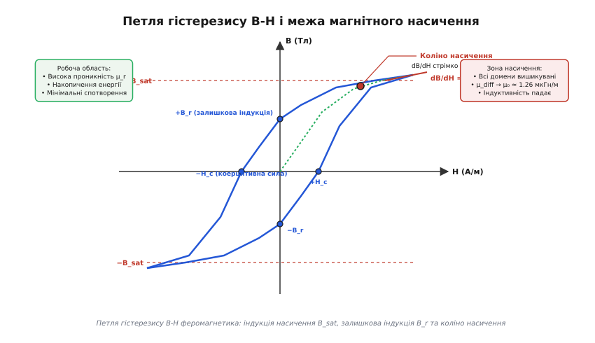
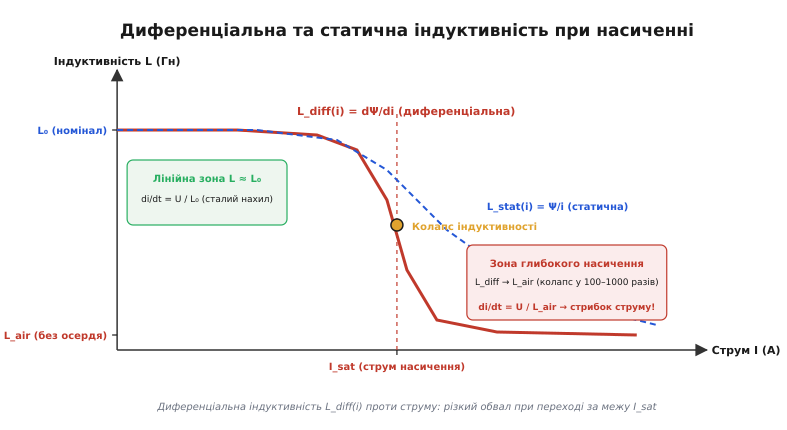
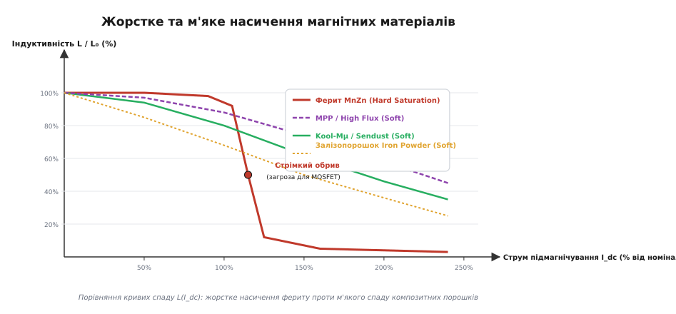
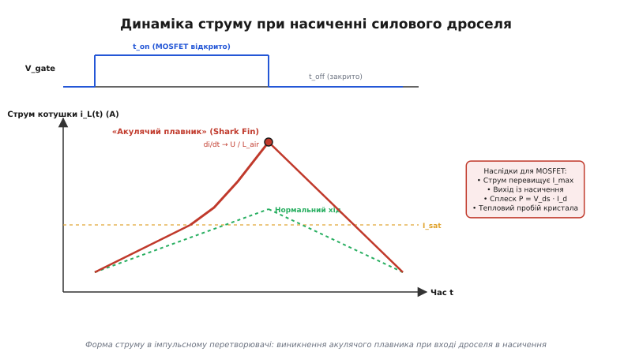
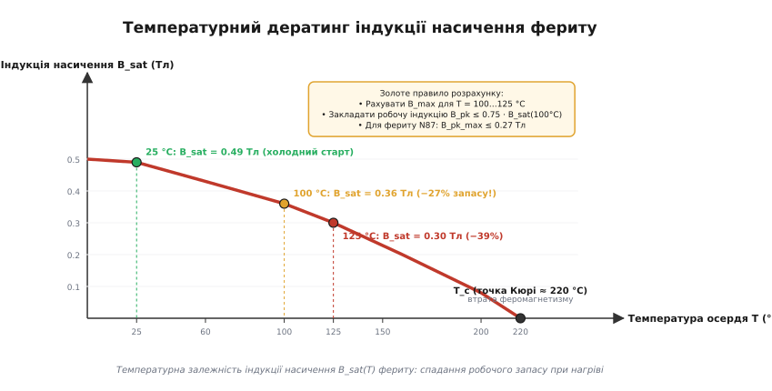
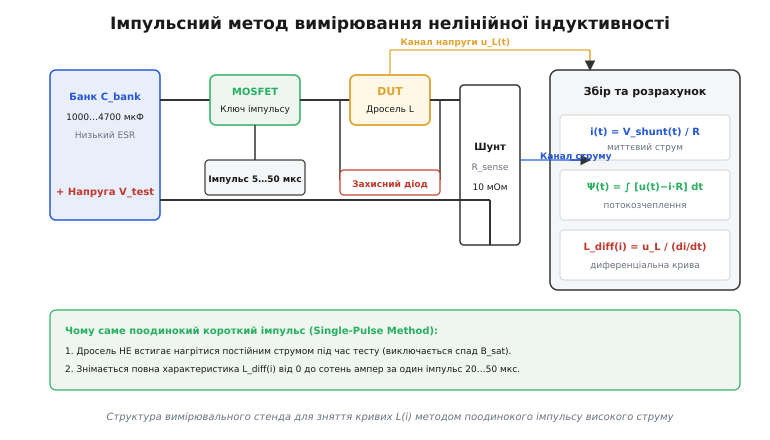

# Нелінійна індуктивність і насичення осердя

<preknowlist>
- [Котушка](root:ph-electromagnetism/inductor-coil) — базова будова індуктивності, витки створюють магнітне поле, а осердя концентрує потік.
- [Ферит і втрати в осерді](root:hw-components/core-losses) — доменна будова феромагнетиків, гістерезис і нагрів матеріалу змінним полем.
- [Закон електромагнітної індукції Фарадея](root:ph-electromagnetism/faraday-law) — наведена напруга дорівнює швидкості зміни магнітного потокозчеплення `u = dΨ/dt`.
- [Силовий дросель](root:hw-components/power-inductor) — накопичення енергії в магнітному полі та фільтрація струму в силових колах.
- [Buck-перетворювач](root:hw-power/buck) — робота понижувального стабілізатора та фази заряду й розряду накопичувального дроселя.
- [Лавинна робота MOSFET](root:hw-components/mosfet-avalanche) — граничні режими струму, падіння напруги на каналі та теплові межі транзистора.
</preknowlist>

Імпульсний перетворювач живлення розраховано на номінальний струм навантаження 3.0 А. Дросель індуктивністю 10 мкГн впевнено тримає форму сигналу, пульсації становлять акуратний трикутник розмахом 0.6 А, а силовий польовий транзистор ледь теплий. Ми плавно піднімаємо навантаження всього на двадцять відсотків — до 3.6 А. Тієї ж миті без будь-якого попередження захист не встигає зреагувати: корпус силового MOSFET розлітається з тріском, а кристал перетворюється на сплав кремнію та міді. Якщо випаяти дросель і виміряти його індуктивність лабораторним вимірювачем на столі, прилад покаже ті самі паспортні 10 мкГн.

Причина цієї раптової аварії полягає в тому, що котушка з магнітним осердям не є постійною величиною `L = const`. Її індуктивність існує лише доти, доки магнітні домени всередині осердя здатні реагувати на збільшення струму. Варто струму піднятися вище критичного порога, і осердя входить у стан **магнітного насичення** (*magnetic saturation*). У цій точці індуктивність обвалюється в сотні й тисячі разів, перетворюючи котушку на звичайний короткий шматок мідного дроту з опором у соті частки ома.

---

### Фізична природа посилення поля та межа доменної структури

Щоб зрозуміти, чому індуктивність зникає, необхідно простежити мікрофізичний механізм, завдяки якому вона взагалі з'являється. Порожня котушка без осердя створює магнітне поле виключно за рахунок руху електронів у дроті. Повітря і вакуум мають магнітну проникність `μ_0 = 4π · 10⁻⁷ Гн/м ≈ 1.257 · 10⁻⁶ Гн/м`. Отримати велику індуктивність на повітрі важко: для цього знадобилися б тисячі витків товстого дроту і величезні габарити.

Введення всередину котушки феромагнітного або феримагнітного осердя кардинально змінює ситуацію. Феромагнетик складається з **доменів** (*domain*, від латинського *dominium* — володіння) — мікроскопічних областей об'ємом від 10⁻⁶ до 10⁻³ мм³, усередині яких власні магнітні моменти неспарених спінів електронів спонтанно вишикувані в одному напрямку. Без зовнішнього поля вектори намагніченості окремих доменів орієнтовані хаотично вздовж осей легкої намагніченості кристалічної ґратки, компенсуючи один одного, тому макроскопічно осердя здається ненамагніченим.

Коли крізь обмотку починає текти струм `i`, він створює зовнішнє поле напруженістю `H = (N · i) / l_e`, де `N` — кількість витків, а `l_e` — середня довжина магнітної лінії. Це поле діє на домени, викликаючи три послідовні процеси:

1. **Оборотне зміщення доменних стінок (початкова ділянка):** У слабких полях стінки між доменами злегка прогинаються, збільшуючи об'єм тих доменів, орієнтація яких близька до напрямку поля. Якщо струм вимкнути, стінки повертаються у вихідне положення під дією пружних сил кристалічної решітки. На цій ділянці відносна магнітна проникність становить величину `μ_i` (початкова проникність).
2. **Незворотні стрибки доменних стінок (ділянка Баркгаузена):** При подальшому зростанні струму енергії поля стає достатньо, щоб доменні стінки зірвалися з дефектів кристалічної решітки, домішок і меж зерен. Стінки стрибкоподібно переміщуються на великі відстані. Тут спостерігається найкрутіший підйом магнітної індукції `B`, а диференціальна проникність досягає максимального значення `μ_max`.
3. **Обертання векторів намагніченості (перед насиченням):** Межі доменів вичерпали можливість зміщення. Усі домени об'єдналися у великі області, але їхні вектори намагніченості все ще відхилені від осі зовнішнього поля на кути, задані кристалографічною анізотропією. Зовнішнє поле починає насильно повертати самі вектори атомних магнітиків доти, доки вони не стануть строго паралельними напрямку поля котушки.


*Петля гістерезису феромагнітного осердя. Початкова крива намагнічування демонструє крутий лінійний підйом у робочій зоні. При наближенні до індукції насичення B_sat приріст сповільнюється (коліно насичення), після чого нахил кривої dB/dH падає до проникності вакууму μ₀.*

Після того, як усі без винятку магнітні моменти атомів зорієнтувалися вздовж вектора зовнішнього поля, ресурс матеріалу вичерпується повністю. У речовині більше немає жодного неорієнтованого спіна. Цей стан називається **магнітним насиченням**, а відповідна максимальна індукція осердя — **індукцією насичення `B_sat`**.

Подальше збільшення струму `i` продовжує лінійно збільшувати напруженість поля `H`, але магнітна індукція `B` тепер зростає лише на мізерну величину власного вакуумного поля котушки:

```
B = B_sat + μ_0 · H
```

Оскільки проникність вакууму `μ_0` в тисячі разів менша за початкову проникність матеріалу `μ_r · μ_0`, на графіку крива `B(H)` стає практично горизонтальною прямою лінією.

На петлі гістерезису осердя також фіксуються дві важливі фундаментальні точки:
- **Залишкова індукція `B_r`** (*remanence*, від латинського *remanere* — залишатися) — значення магнітної індукції, що зберігається в осерді після зняття зовнішнього струму (`H = 0`). Для м'яких феритів `B_r` становить 20–40% від `B_sat`.
- **Коерцитивна сила `H_c`** (*coercivity*, від латинського *coercere* — утримувати, примушувати) — напруженість зворотного магнітного поля, яку необхідно прикласти до осердя, щоб повністю розмагнітити його до нульової індукції (`B = 0`). М'які магнітні матеріали силових дроселів спеціально оптимізують для отримання мінімальної коерцитивної сили `H_c < 10...30 А/м`, що мінімізує площу петлі та втрати енергії на перемагнічування.

---

### Диференціальна індуктивність та механізм колапсу

В електротехніці індуктивність часто розглядають як скалярне число `L = Ψ / i`. Проте в нелінійних колах таке спрощене означення приховує небезпечну пастку. Необхідно розрізняти дві принципово різні величини: **статичну індуктивність `L_stat`** та **диференціальну індуктивність `L_diff`**.

Повне магнітне потокозчеплення котушки `Ψ` пов'язане з індукцією `B` площею перерізу осердя `A_e` та кількістю витків `N`:

```
Ψ = N · Φ = N · B · A_e
```

За [законом Фарадея](root:ph-electromagnetism/faraday-law), миттєва напруга на виводах котушки визначається швидкістю зміни потокозчеплення в часі:

```
u_L(t) = dΨ/dt
```

Розкриваючи похідну за правилом диференціювання складеної функції від струму `i(t)`:

```
u_L(t) = (dΨ/di) · (di/dt)
```

Множник перед похідною струму `di/dt` — це коефіцієнт, який у кожну мить часу визначає протидію котушки наростанню струму. Саме він називається **диференціальною індуктивністю**:

```
L_diff(i) = dΨ/di
```

Підставивши вираз для напруженості поля `H = (N · i) / l_e` та потокозчеплення `Ψ = N · A_e · B(H)`, отримуємо прямий зв'язок диференціальної індуктивності з похідною кривої намагнічування:

```
L_diff(i) = (N² · A_e / l_e) · (dB/dH)
```

Величина `dB/dH = μ_diff(H) = μ_0 · μ_r_diff` є **диференціальною магнітною проникністю** матеріалу. Вона чисельно дорівнює тангенсу кута нахилу дотичної до кривої `B(H)` у поточній робочій точці струму.

```
L_diff(i) = (N² · A_e / l_e) · μ_0 · μ_r_diff(i)
```

Повний математичний вивід та аналітичні моделі насичення наведено у вставці про [математичний апарат нелінійної індуктивності](root:hw-components/nonlinear-inductor/math-differential-inductance.md).


*Спад диференціальної індуктивності L_diff(i) та статичної індуктивності L_stat(i) при переході за струм насичення I_sat. Диференціальна індуктивність, яка визначає швидкість наростання струму, обвалюється значно раніше і різкіше, ніж статична.*

У ненасиченому стані для типового силового марганець-цинкового фериту (наприклад, матеріалу N87 або 3C90) початкова відносна проникність становить `μ_r ≈ 2200`. Якщо котушка на такому осерді має номінальну індуктивність `L_0 = 100 мкГн`, то внесок самого фериту становить 99.95 мкГн, а внесок геометричного об'єму повітря всередині котушки — лише 0.05 мкГн.

Щойно струм досягає коліна насичення, нахил `dB/dH` стрімко падає. У зоні повного насичення `μ_r_diff → 1`. Це означає, що диференціальна індуктивність дроселя падає від 100 мкГн до залишкових 0.05 мкГн — **відбувається колапс індуктивності у 2000 разів**.

З погляду електричного кола це рівнозначно тому, що дросель миттєво зник зі схеми і замкнувся накоротко.

---

### Жорстке насичення проти м'якого (Hard Saturation vs Soft Saturation)

Форма кривої спаду індуктивності `L(I_dc)` залежить від фізичної структури магнітопроводу. В електроніці чітко розрізняють два класи поведінки: **жорстке насичення** монолітних феритів та **м'яке насичення** порошкових композитів.


*Криві спаду відносної індуктивності L/L₀ від струму підмагнічування I_dc. Монолітний ферит MnZn демонструє жорсткий раптовий обрив (Hard Saturation), тоді як порошкові осердя Sendust, MPP та High Flux забезпечують плавний і передбачуваний спад (Soft Saturation).*

#### Монолітний ферит та дискретний зазор (Hard Saturation)

Силові ферити MnZn та NiZn є щільною магнітною керамікою з однорідною кристалічною структурою. Якщо намотати котушку на суцільне тороїдальне осердя без зазору, воно насичується при дуже малих струмах (частки ампера), оскільки через високу проникність магнітний опір кола мізерний, а поле `H` миттєво доходить до насичення.

Щоб феритовий дросель міг накопичувати значну енергію `W = (L · I²) / 2` і працювати при великих струмах, у ньому роблять **дискретний повітряний зазор** `l_g` (пропил у центральному керні або прокладку між половинками осердя E-типу). Повітряний зазор має проникність `μ_0 = 1`, тому його магнітний опір `R_m_gap = l_g / (μ_0 · A_e)` у сотні разів перевищує опір фериту. Зазор лінеаризує котушку, знижує ефективну проникність до значень `μ_e = 50...200` і дозволяє збільшити струм насичення в десятки разів.

Проте зазор **не здатний змінити властивості самого фериту**. Поки індукція `B < B_sat`, індуктивність тримається ідеально горизонтальної полиці. Але коли індукція в тілі фериту досягає `B_sat`, ферит миттєво вимикається з магнітного ланцюга. Відбувається жорсткий, майже вертикальний обвал індуктивності *(Hard Saturation)*. Достатньо перевищити струм насичення лише на 5–10%, щоб індуктивність впала на порядок.

#### Порошкові матеріали та розподілений зазор (Soft Saturation)

Композитні порошкові осердя (*Powder Cores* — торгові марки Kool-Mµ, Sendust, MPP, High Flux, Mega Flux) виготовляють принципово інакше. Металевий сплав подрібнюють на мікроскопічні гранули розміром 10–50 мікрометрів. Кожну гранулу покривають тонкою плівкою високотемпературного діелектрику (фосфату або полімеру), після чого суміш пресують під тиском понад 1000 МПа.

Мільйони мікроскопічних діелектричних оболонок між зернами утворюють **розподілений повітряний зазор** (*distributed air gap*). Через мікрогеометричну неоднорідність локальна напруженість поля в різних зернах відрізняється. Коли струм котушки зростає, зерна входять у стан насичення не всі разом, а по черзі: спочатку насичуються ділянки з найвищою концентрацією ліній поля, тоді як сусідні зерна залишаються ненасиченими.

У результаті крива `L(I_dc)` отримує плавний пологий профіль спаду *(Soft Saturation)*:
- При номінальному струмі індуктивність становить 100%.
- При перевищенні струму на 50% індуктивність плавно зменшується до 75–80%.
- При дворазовому перевантаженні залишається близько 50% індуктивності.

> 🔧 **Навіщо це.** М'яке насичення є рятівним колом для джерел живлення з коректорами коефіцієнта потужності (PFC) та сонячних інверторів. Коли в мережі трапляється динамічний кидок струму або вхідна синусоїда проходить через пік, порошковий дросель тимчасово зменшує свою індуктивність удвічі, але не втрачає її повністю. Струм через силовий транзистор продовжує контролюватися, перетворювач не зривається в аварію, а після спадання піку навантаження індуктивність миттєво повертається до 100%.

Детальний порівняльний аналіз хімічного складу, втрат і кривих спаду різних типів порошкових сплавів наведено у вставці про [порівняльний аналіз профілів насичення магнітних матеріалів](root:hw-components/nonlinear-inductor/comp-core-saturation-profiles.md).

---

### Динаміка струму в перетворювачах і загибель ключів

Розглянемо, як поводиться струм у реальному імпульсному перетворювачі — наприклад, у класичному [понижувальному Buck-перетворювачі](root:hw-power/buck), коли дросель входить у насичення.

Коли силовий транзистор відкривається на час `t_on`, до котушки прикладається стала пряма напруга `U_L = V_in - V_out`. За [законом Фарадея](root:ph-electromagnetism/faraday-law) швидкість зміни струму дроселя визначається рівнянням:

```
di/dt = (V_in - V_out) / L_diff(i)
```

Поки дросель працює в лінійному режимі (`L_diff = L_0`), швидкість `di/dt` є постійною. Струм котушки лінійно наростає з фіксованим нахилом, утворюючи класичний трикутний імпульс:

```
i(t) = I_min + ((V_in - V_out) / L_0) · t
```

Якщо під дією перевантаження або високої температури струм усередині імпульсу доходить до значення `I_sat`, диференціальна індуктивність `L_diff` різко падає в 50–200 разів.


*Осцилограма струму котушки під час імпульсу комутації. Перехід дроселя в насичення викликає різкий злам лінійного трикутника з формуванням експоненційного сплеску «акулячий плавник» (Shark Fin), що перевантажує силовий ключ.*

Швидкість наростання струму `di/dt` миттєво збільшується у стільки ж разів. Замість прямої лінії на осцилограмі виникає різкий експоненційний викид струму вгору, який силові інженери називають **«акулячим плавником»** (*shark fin*).

Струм дроселя тепер обмежується виключно сумарним активним омічним опором кола:

```
R_total = R_ds_on + R_dc_L + R_pcb + R_sense
```

Оскільки для низьковольтних перетворювачів цей сумарний опір становить лічені десятки міліом (наприклад, 30 мОм), теоретичний струм короткого замикання на напрузі 24 В прагне до `24 В / 0.030 Ом = 800 А`.

#### Механізм руйнування MOSFET

Що відбувається з комутуючим транзистором під час цього сплеску:

1. **Вихід із режиму насичення (активний режим):** Силовий польовий транзистор розраховано на роботу в ролі ключа (в області омічного опору відкритого каналу `R_ds_on`). Проте струм, який може пропустити відкритий канал MOSFET при фіксованій напрузі на затворі `V_gs` (наприклад, 10 В), фізично обмежений крутизною характеристики транзистора:
   ```
   I_d_sat = g_fs · (V_gs - V_th)
   ```
   Коли вибуховий струм від насиченого дроселя перевищує цей рівень, транзистор виходить із ключового режиму в активний лінійний режим.
2. **Катастрофічний стрибок напруги `V_ds`:** Опір каналу різко зростає, і на транзисторі починає падати практично повна напруга живлення `V_ds ≈ V_in`.
3. **Вибуховий тепловий імпульс:** Миттєва розсіювана потужність на кристалі дорівнює добутку повної напруги на надвисокий струм:
   ```
   P_loss(t) = V_ds(t) · I_d(t) = 24 В × 60 А = 1440 Вт
   ```
   Півтора кіловати тепла, що виділяються на кремнієвій пластинці площею кілька квадратних міліметрів за час у 1–2 мікросекунди, викликають локальний розігрів каналу до температур понад 400–600 °C.
4. **Вторинний пробій або розрив корпусу:** Відбувається [лавинний пробій або утворення паразитного тиристорного замикання](root:hw-components/mosfet-avalanche), розплавлення кремнію та вибухове випаровування внутрішніх зварних дротиків виводів.

Навіть якщо швидкий аналоговий компаратор мікросхеми ШІМ встигає зняти імпульс із затвора за 100 нс, закриття транзистора на струмі в 50–100 А через паразитну індуктивність друкованих провідників `L_trace` викликає гігантський викид напруги за [законом самоіндукції](root:ph-electromagnetism/faraday-law):

```
V_spike = L_trace · (di_off / dt)
```

Цей викид перебиває максимальну паспортну напругу `V_ds_max` стоку, і транзистор пробивається по напрузі.

---

### Температурний фактор: катастрофічний дератинг B_sat

Найпідступніша інженерна помилка при роботі з дроселями — це розрахунок схеми за паспортом при кімнатній температурі 25 °C.

Магнітний порядок у феромагнетиках тримається на обмінній взаємодії між електронними спінами сусідніх атомів. Тепловий рух кристалічної ґратки постійно розгойдує атоми і намагається зруйнувати це впорядкування. Чим вища температура осердя, тим більша частка доменів хаотизується, і тим менша індукція потрібна для того, щоб решта впорядкованих спінів вишикувалася в струнку лінію.

Температура, при якій тепловий рух повністю перемагає магнітну взаємодію і феромагнетик перетворюється на звичайний немагнітний парамагнетик (`μ_r = 1`), називається **точкою Кюрі `T_c`** (*Curie temperature*, на честь П'єра Кюрі). Для силових марганець-цинкових феритів точка Кюрі зазвичай лежить у діапазоні `T_c = 200...230 °C`.


*Температурний дератинг індукції насичення B_sat(T) для силового фериту MnZn. Зростання температури осердя від 25 °C до робочих 100–125 °C зменшує запас по індукції на 27–39%, створюючи пряму загрозу насичення.*

У типовому силовому фериті (класи N87, 3C90, PC40) індукція насичення спадає за такою закономірністю:
- При **+25 °C**: `B_sat = 0.49 Тл` (паспортне значення для холодного стану);
- При **+60 °C**: `B_sat = 0.43 Тл` (падіння на 12%);
- При **+100 °C**: `B_sat = 0.36 Тл` (падіння на 27%);
- При **+125 °C**: `B_sat = 0.30 Тл` (падіння на 39%).

Усередині закритого герметичного корпусу джерела живлення температура дроселя за рахунок власних втрат у міді та осерді легко досягає 90–110 °C при температурі довкілля 40–50 °C.

Якщо розробник розрахував піковий струм перетворювача так, що робоча індукція в осерді становить `B_pk = 0.40 Тл`, то на робочому столі при 25 °C пристрій працюватиме бездоганно (запас `0.49 - 0.40 = 0.09 Тл`). Але через 15 хвилин після ввімкнення під номінальним навантаженням дросель нагріється до 100 °C. Його реальне `B_sat` впаде до 0.36 Тл. Робоча індукція 0.40 Тл виявиться глибшою за межу насичення: дросель увійде в насичення прямо посеред нормальної роботи, викликавши аварійний вихід з ладу силового каскаду.

#### Золоте правило розрахунку індукції

> 🔧 **Навіщо це.** Максимальну розрахункову індукцію дроселя `B_max` завжди розраховують виходячи зі значення `B_sat` при максимальній робочій температурі осердя `T = 100...125 °C`, закладаючи додатковий запас на розкид параметрів партії (15–20%):
> ```
> B_max_design ≤ 0.75 · B_sat(100 °C)
> ```
> Для стандартних силових MnZn феритів це означає, що пікова індукція в найважчому режимі (максимальна напруга живлення + максимальний струм перевантаження) ніколи не повинна перевищувати **0.26...0.28 Тл**.

---

### Методи вимірювання та зняття характеристик L(I_dc)

Зняття точної характеристики `L_diff(I)` є обов'язковим етапом кваліфікації силових дроселів. Однак традиційні вимірювальні прилади для цього непридатні.

#### Чому стандартний LCR-метр дає хибний результат

Лабораторний цифровий міст RLC (LCR-метр) подає на котушку тестовий синусоїдальний сигнал частотою 1 кГц або 100 кГц з амплітудою напруги 0.5–1.0 В. Струм крізь котушку при цьому не перевищує 5–20 мА.

При такому мізерному струмі напруженість магнітного поля `H` товчеться біля самого початку координат кривої `B(H)`. Прилад чесно вимірює початкову індуктивність `L_0`, але він абсолютно «сліпий» до того, що станеться з дроселем при струмі 5 А чи 20 А. Покластися на одне число з LCR-метра — прямий шлях до помилки в силовому проєкті.

#### Метод підмагнічування постійним струмом (DC Bias Fixture)

Традиційний лабораторний метод полягає у підключенні досліджуваного дроселя до спеціального джерела постійного струму зміщення через масивний розділовий дросель високої індуктивності `L_bias >> L_DUT`. Поверх постійного струму накладається слабкий змінний вимірювальний сигнал.

Головний недолік методу — постійний струм великої сили тече крізь дросель неперервно протягом усього часу тестування. Котушка швидко розігрівається джоулевим теплом `I² · R_dc`, температура осердя пливе вгору, а `B_sat` падає. Виміряти «холодну» криву при 25 °C для струмів 20–50 А на такому стенді фізично неможливо без застосування масивних систем охолодження.

#### Імпульсний метод великого струму (Single-Pulse Method)

Сучасним промисловим стандартом для зняття кривих `L(I)` є випробування поодиноким прямокутним імпульсом напруги.


*Принцип побудови імпульсного стенда. Банк конденсаторів низького ESR розряджається крізь тестований дросель через потужний MOSFET-комутатор. Швидкісний збір сигналів u_L(t) та i(t) дозволяє розрахувати повну криву L_diff(i) за один імпульс.*

Принцип роботи імпульсного вимірювача:

1. Накопичувальний банк електролітичних конденсаторів ємністю 2200...4700 мкФ із низьким ESR заряджається від регульованого джерела до заданої напруги `V_test` (зазвичай 12...30 В).
2. За командою мікроконтролера надшвидкий силовий MOSFET із малим опором каналу `R_ds_on < 2 мОм` відкривається на короткий проміжок часу `t_pulse = 10...50 мкс`.
3. До дроселя прикладається стабільна сходинка напруги. Струм у котушці починає швидко наростати від нуля, проходить робочу лінійну ділянку, входить у коліно насичення і злітає вгору до струмів у десятки чи сотні ампер.
4. Досягнувши заданого струмового ліміту або після закінчення часу імпульсу, транзистор закривається, а енергія дроселя скидається крізь потужний швидкодіючий захисний діод.

Двоканальний цифровий АЦП із частотою дискретизації не менше 10–50 Мвиб/с записує миттєву напругу `u_L(t)` та струм через безіндуктивний шунт `i(t)`.

Обробка сигналів полягає в обчисленні диференціальної індуктивності для кожного відліку часу:

```
L_diff[k] = (u_L[k] - i[k] · R_dc) / ((i[k+1] - i[k-1]) / (2 · Δt))
```

Повне потокозчеплення `Ψ(t)` знаходиться чисельним інтегруванням за формулою:

```
Ψ(t) = ∫₀ᵗ (u_L(τ) - i(τ) · R_dc) dτ
```

Оскільки тривалість імпульсу становить лічені мікросекунди, повна енергія тепла, що виділяється в дроселі, становить менше 0.05 Дж. Зразок взагалі не встигає нагрітися, що дозволяє отримати ідеальну ізотермічну характеристику `L(i)` при строго контрольованій температурі.

Повну схемотехніку вимірювального стенда, вимоги до шунтів та вихідний код числової обробки на C і C++ представлено у вставці про [програмно-апаратний стенд для вимірювання динамічної індуктивності](root:hw-components/nonlinear-inductor/proj-saturation-tester.md).

---

### Практичний розрахунок робочої точки дроселя (Worked Example)

Розрахуємо робочу точку та параметри феритового силового дроселя для понижувального [Buck-перетворювача](root:hw-power/buck), перевіривши його на стійкість до насичення при максимальній робочій температурі.

**Вхідні технічні вимоги:**
- Вхідна напруга: `V_in = 24 В`;
- Вихідна стабілізована напруга: `V_out = 5 В`;
- Максимальний постійний струм навантаження: `I_out = 4.0 А`;
- Частота комутації ШІМ: `f_sw = 250 кГц` (період `T_sw = 1 / 250 000 = 4.0 мкс`);
- Коефіцієнт пульсацій струму дроселя: `r = 0.30` (30% від `I_out`);
- Максимальна робоча температура осердя: `T_max = 100 °C`.

#### Крок 1. Розрахунок коефіцієнта заповнення ШІМ та часу відкритого стану

Для ідеального Buck-перетворювача коефіцієнт заповнення `D`:

```
D = V_out / V_in = 5 / 24 ≈ 0.2083 (20.83%)
t_on = D · T_sw = 0.2083 × 4.0 мкс = 0.833 мкс
```

#### Крок 2. Розрахунок необхідної індуктивності

Розмах пульсацій струму `ΔI_L`:

```
ΔI_L = r · I_out = 0.30 × 4.0 А = 1.20 А
```

Необхідна індуктивність дроселя `L_nom` знаходиться з рівняння закону індукції для фази `t_on`:

```
L_nom = ((V_in - V_out) · t_on) / ΔI_L
L_nom = ((24 - 5) × 0.833 · 10⁻⁶) / 1.20 = (19 × 0.833 · 10⁻⁶) / 1.20 ≈ 13.2 · 10⁻⁶ Гн = 13.2 мкГн
```

Обираємо найближчий стандартний номінал: **`L = 15 мкГн`**.

Перераховуємо реальний розмах пульсацій для `L = 15 мкГн`:

```
ΔI_real = ((24 - 5) × 0.833 · 10⁻⁶) / (15 · 10⁻⁶) ≈ 1.055 А
```

#### Крок 3. Розрахунок пікового струму через дросель

Піковий струм `I_peak` складається з постійної складової струму навантаження та половини розмаху пульсацій:

```
I_peak = I_out + (ΔI_real / 2) = 4.0 + (1.055 / 2) = 4.528 А ≈ 4.53 А
```

#### Крок 4. Вибір осердя та розрахунок магнітної індукції

Обираємо стандартне феритове осердя типорозміру **E25/13/7** із силового марганець-цинкового фериту **N87** (TDK/Epcos):
- Ефективна площа перерізу: `A_e = 52 мм² = 52 · 10⁻⁶ м²`;
- Середня довжина магнітної лінії: `l_e = 57.5 мм = 0.0575 м`;
- Індукція насичення матеріалу N87 при 25 °C: `B_sat(25 °C) = 0.49 Тл`;
- Індукція насичення матеріалу N87 при 100 °C: `B_sat(100 °C) = 0.36 Тл`.

Згідно із золотим правилом температурного запасу, допустима пікова індукція:

```
B_max_allowed = 0.75 · B_sat(100 °C) = 0.75 × 0.36 Тл = 0.270 Тл
```

#### Крок 5. Розрахунок кількості витків обмотки

Зв'язок індуктивності, струму та пікової індукції виражається формулою:

```
N = (L · I_peak) / (B_max_allowed · A_e)
N = (15 · 10⁻⁶ × 4.53) / (0.270 × 52 · 10⁻⁶) = (67.95 · 10⁻⁶) / (14.04 · 10⁻⁶) ≈ 4.84
```

Округляємо кількість витків у більшу сторону до цілого числа: **`N = 5 витків`**.

Перевіряємо реальну пікову індукцію при `N = 5`:

```
B_peak = (L · I_peak) / (N · A_e) = (15 · 10⁻⁶ × 4.53) / (5 × 52 · 10⁻⁶) = 67.95 / 260 ≈ 0.261 Тл
```

Оскільки `0.261 Тл < 0.270 Тл`, умова температурного запасу повністю виконується (запас до точки гарячого насичення 0.36 Тл становить 27.5%).

#### Крок 6. Розрахунок немагнітного повітряного зазору

Повна індуктивність котушки з зазором `l_g`:

```
L = (μ_0 · N² · A_e) / (l_g + (l_e / μ_r))
```

Оскільки початкова проникність фериту N87 `μ_r ≈ 2200`, доданок `l_e / μ_r = 0.0575 / 2200 ≈ 0.026 мм` значно менший за очікуваний зазор. Звідси необхідна величина немагнітного зазору:

```
l_g ≈ (μ_0 · N² · A_e) / L
l_g = (4π · 10⁻⁷ × 5² × 52 · 10⁻⁶) / (15 · 10⁻⁶) = (1.2566 · 10⁻⁶ × 25 × 52 · 10⁻⁶) / (15 · 10⁻⁶)
l_g = (1.6336 · 10⁻⁹) / (15 · 10⁻⁶) ≈ 0.109 · 10⁻³ м = 0.109 мм ≈ 110 мкм
```

Для створення симетричного зазору на центральному керні робиться пропил товщиною 0.11 мм (або між бічними половинками вкладається немагнітна діелектрична прокладка товщиною `l_g / 2 ≈ 55 мкм`).

---

### Паспортні параметри дроселя в каталогах: I_sat проти I_rms

При виборі готових силових індуктивностей у каталогах виробників (Coilcraft, Wurth Elektronik, Bourns, TDK) у специфікації завжди наводяться два різних граничних струми, які не можна плутати:

1. **Струм насичення `I_sat`** (*Saturation Current*):
   Струм підмагнічування постійним струмом, при якому диференціальна індуктивність дроселя **падає на фіксований відсоток** від початкового номіналу `L_0` при кімнатній температурі 25 °C.
   - У прецизійних феритових дроселях виробники вказують `I_sat` за критерієм падіння на **10%** або **20%** (`ΔL/L = -10%` чи `-20%`).
   - У порошкових котушках із м'яким насиченням поріг `I_sat` часто дається за критерієм падіння на **30%** або навіть **40%**.
   - `I_sat` є суто **магнітною межею** осердя і не пов'язаний безпосередньо з нагрівом обмотки в момент вимірювання.
2. **Тепловий номінальний струм `I_rms` або `I_dc`** (*Rated Temperature Rise Current*):
   Постійний середньоквадратичний струм, тривале протікання якого крізь активний опір обмотки `R_dc` викликає **нагрів корпусу дроселя на задану дельту температури** (найчастіше `ΔT = +40 °C` відносно довкілля).
   - `I_rms` є суто **тепловою межею міді та ізоляції**, обумовленою законом Джоуля-Ленца `P = I_rms² · R_dc` та умовами тепловідведення з поверхні корпусу.

```
+-------------------------------------------------------------------------+
|                  ДВА ГРАНИЧНИХ СТРУМИ ДРОСЕЛЯ У СПЕЦИФІКАЦІЇ            |
+------------------------------------+------------------------------------+
|  I_sat (Струм насичення)           |  I_rms / I_dc (Тепловий струм)     |
+------------------------------------+------------------------------------+
| • Фізична природа: магнітна        | • Фізична природа: теплова         |
| • Критерій: падіння L на 10..30%   | • Критерій: саморозігрів на +40 °C |
| • Визначається: матеріалом осердя  | • Визначається: товщиною мідного   |
|   та площею перерізу A_e           |   дроту та опором R_dc             |
| • Порівнюється з: I_peak           | • Порівнюється з: I_load_avg (RMS) |
+------------------------------------+------------------------------------+
```

Практичне правило верифікації схеми:
- Середній струм навантаження перетворювача повинен задовольняти умову: `I_out_rms ≤ I_rms`.
- Піковий струм імпульсу з урахуванням пускових режимів та максимальної робочої температури повинен задовольняти умову: `I_peak ≤ I_sat(100 °C)`.

---

### Підсумковий синтез

Нелінійна індуктивність — це не небажаний дефект окремих котушок, а прямий прояв квантової природи магнітних доменів у твердому тілі. Магнітний матеріал віддає свою проникність для багаторазового посилення поля, але взамін виставляє жорстку межу індукції насичення `B_sat`, зумовлену скінченною кількістю неспарених спінів електронів в одиниці об'єму.

Інженерне проєктування силових магнітних вузлів — це керування динамічною траєкторією системи в багатовимірному просторі координат `(B, H, T, i)`. Розуміння колапсу диференціальної індуктивності `L_diff`, відмінностей між жорстким та м'яким профілями насичення та обов'язковий температурний дератинг гарантують надійну і безаварійну роботу силової електроніки в найважчих умовах експлуатації.
