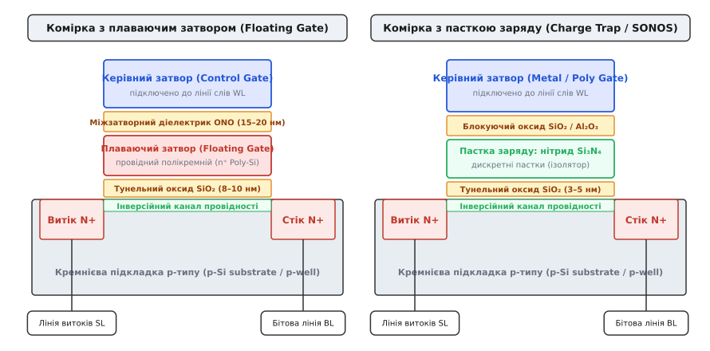
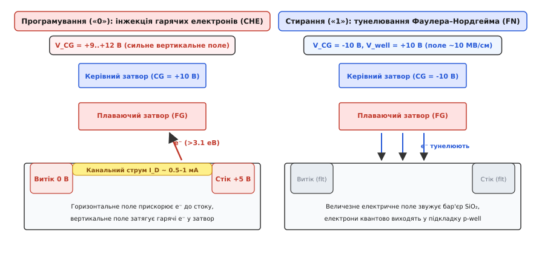
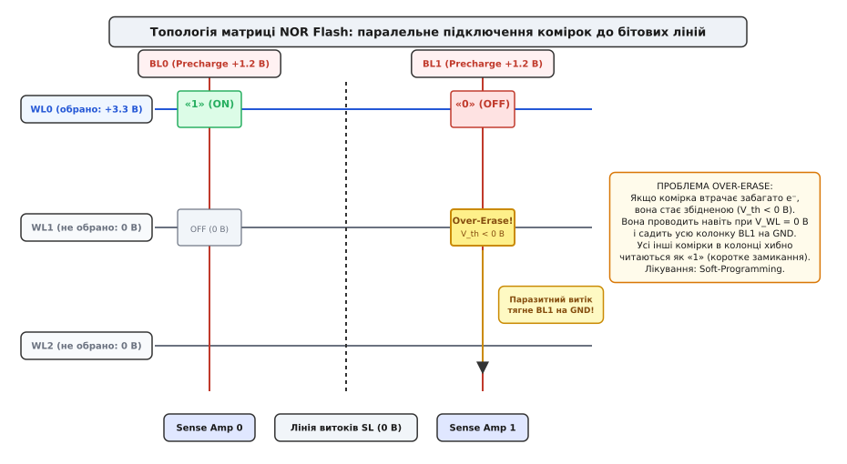
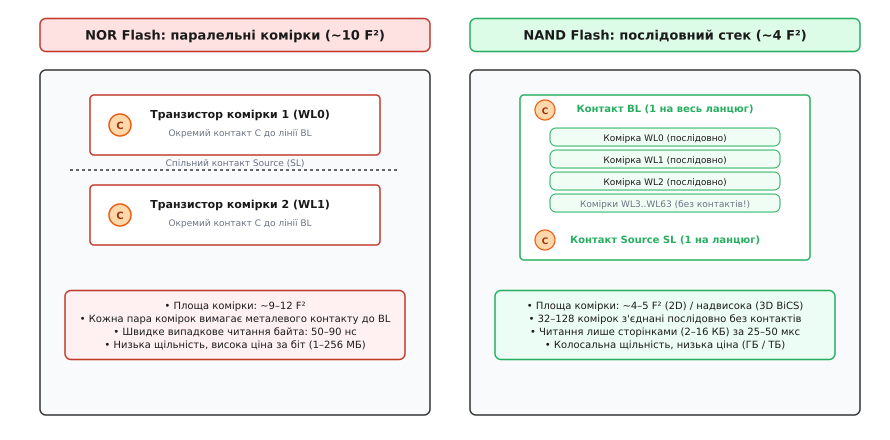

# NOR Flash: комірка, побайтове читання і блокове стирання

<preknowlist>
- [Будова MOSFET](topic:hw-components/mosfet-structure) — затвор, канал, діелектрик і польове керування провідністю.
- [Поріг MOSFET](topic:hw-components/mosfet-threshold) — порогова напруга V_th, виникнення інверсійного каналу.
- [DRAM](topic:hw-components/dram-cell) — організація матриці пам'яті: рядки (лінії слів WL), стовпці (бітові лінії BL) та двовимірна адресація.
- [CMOS](topic:hw-digital/cmos) — взаємодія n-канальних та p-канальних польових транзисторів на спільному кристалі.
</preknowlist>

Коли мікроконтролер підключають до живлення, процесорне ядро зобов'язане вже за перші 50–100 наносекунд отримати першу машинну інструкцію вектора скидання (reset vector) за абсолютною апаратною адресою системної шини. Статична пам'ять (SRAM) енергозалежна і втрачає вміст при знеструмленні; динамічна пам'ять (DRAM) вимагає тривалої ініціалізації контролера та постійної регенерації; маскове ПЗП (ROM) не дозволяє виправляти помилки прошивки в польових умовах; а твердотілі накопичувачі NAND Flash читають дані виключно великими сторінками через складні протокольні контролери з затримкою в десятки мікросекунд. Єдиним класом енергонезалежної пам'яті, який підключається безпосередньо до адресної шини процесора, підтримує випадкове побайтове зчитування за одиниці наносекунд та дозволяє виконувати машинний код напряму без попереднього копіювання в оперативну пам'ять, є пам'ять типу **NOR Flash** (*Flash*, англ. — «спалах», через миттєве стирання великих блоків).

### Фізична структура комірки: плаваючий затвор та пастковий діелектрик

В основі роботи будь-якої Flash-пам'яті лежить модифікований польовий транзистор з ізольованим затвором (MOSFET), здатний зберігати електричний заряд усередині своєї затворної структури роками навіть за повної відсутності зовнішнього живлення. На відміну від стандартного логічного транзистора, де є лише один металевий або полікремнієвий затвор, комірка Flash містить додатковий проміжний шар накопичення носіїв заряду.

В індустрії мікроелектроніки розвинулися дві базові фізичні реалізації цього шару: провідний **плаваючий затвор (Floating Gate)** та ізолюючий **пастковий діелектрик (Charge Trap / SONOS)**.


*Зліва: класична комірка з **плаваючим затвором (Floating Gate)** — острівець провідного полікремнію n⁺ оточений тунельним оксидом SiO₂ (8–10 нм) знизу та міжзатворним діелектриком ONO (15–20 нм) зверху; накопичені електрони вільно переміщуються по всьому об'єму затвора. Справа: комірка з **пасткою заряду (Charge Trap / SONOS)** — заряд захоплюється дискретними просторово ізольованими пастками в шарі нітриду кремнію Si₃N₄, що унеможливлює витік заряду через поодинокі дефекти оксиду й дозволяє зменшити товщину тунельного діелектрика до 3–5 нм.*

#### Комірка з плаваючим затвором (Floating Gate)

У класичній структурі з плаваючим затвором над слаболегованим напівпровідниковим каналом p-типу послідовно розташовані такі функціональні шари:
1. **Тунельний діелектрик (Tunnel Oxide):** високоякісний шар термічного діоксиду кремнію `SiO₂` товщиною `8–10 нм`. Він слугує потенціальним бар'єром, який за робочих напруг читання перешкоджає виходу електронів із плаваючого затвора.
2. **Плаваючий затвор (Floating Gate, FG):** провідний острівець сильно легованого полікристалічного кремнію n-типу (`n⁺ Poly-Si`). Цей шар електрично повністю ізольований від решти мікросхеми. Електрони, що потрапили в плаваючий затвор, утворюють вільний електронний газ, який рівномірно розподіляється по його провідному об'єму.
3. **Міжзатворний діелектрик (Interpoly Dielectric, IPD):** багатошарова структура оксид-нітрид-оксид (`SiO₂–Si₃N₄–SiO₂`, скорочено **ONO**) з ефективною діелектричною товщиною `15–20 нм`. Шар нітриду між шарами оксиду забезпечує високу діелектричну проникність (`ε_r ≈ 7.5`), що різко збільшує ємнісний зв'язок між затворами.
4. **Керівний затвор (Control Gate, CG):** зовнішній електрод із полікремнію або металу, безпосередньо з'єднаний із лінією слів (Wordline, WL) матриці пам'яті.

#### Модель ємнісного подільника та модуляція порога

Плаваючий затвор утворює центральний вузол ємнісного подільника напруги. Його потенціал `V_fg` визначається сумою ємнісних наведень від зовнішніх електродів та величиною накопиченого заряду:

```
V_fg = α_cg·V_cg + α_d·V_d + α_s·V_s + α_b·V_b + (Q_fg ÷ C_tot)
```

де `α_cg = C_cg / C_tot` — коефіцієнт ємнісного зв'язку керівного затвора (типово `0.6–0.75`), а `Q_fg` — сумарний електричний заряд електронів на плаваючому затворі.

Коли на плаваючому затворі накопичується надлишок електронів (`Q_fg < 0`), їхнє негативне електричне поле екранує позитивний потенціал, що подається на керівний затвор. Щоб подолати це екранування і сформувати інверсійний провідний канал у p-підкладці, на керівний затвор доводиться подавати значно більшу позитивну напругу. У результаті порогова напруга транзистора `V_th` зміщується вгору:

```
ΔV_th = - ΔQ_fg ÷ C_cg = (N_e · q) ÷ C_cg
```

Фізичний стан заряду однозначно транслюється у двійкову логіку:
* **Стертий стан (логічна «1»):** електрони видалені з плаваючого затвора (затвор електрично нейтральний або злегка збіднений). Порогова напруга низька: `V_th,low ≈ 1.5–2.2 В`. Якщо на керівний затвор подати напругу зчитування `V_read = 3.3 В`, транзистор відкривається і проводить значний струм (`I_cell ≈ 30–60 мкА`).
* **Запрограмований стан (логічний «0»):** у плаваючий затвор інжектовано від 20 000 до 50 000 електронів. Порогова напруга зростає до `V_th,high ≈ 5.5–7.0 В`. При подачі тієї самої напруги `V_read = 3.3 В` транзистор залишається надійно закритим, а струм через канал практично дорівнює нулю (`I_cell < 1 нА`).

Докладне аналітичне виведення ємнісних коефіцієнтів та розрахунок зарядових балансів наведено у вставці [фізика тунелювання Фаулера–Нордгейма та інжекції гарячих електронів](topic:hw-components/nor-flash-cell/math-fn-tunneling-che.md).

#### Комірка з пасткою заряду (Charge Trap / SONOS)

Головною вадою класичного плаваючого затвора є його суцільна провідність: якщо в тунельному оксиді внаслідок зносу чи виробничого дефекту виникає хоча б один мікроскопічний струмопровідний ланцюжок (пора діаметром у кілька ангстрем), **весь** накопичений заряд електронів миттєво витікає у підкладку, і комірка безповоротно втрачає записаний біт.

У технології **Charge Trap** (відомій як **SONOS** — *Silicon-Oxide-Nitride-Oxide-Silicon* або **MONOS** — *Metal-Oxide-Nitride-Oxide-Silicon*) провідний полікремнієвий острівець замінено тонким шаром діелектрика — нітриду кремнію `Si₃N₄`. Нітрид містить колосальну густину глибоких просторово локалізованих пасток заряду (`~10¹⁹ см⁻³`).

Коли електрони потрапляють у шар нітриду, вони захоплюються дискретними потенціальними ямами і виявляються «замороженими» у своїх просторових координатах. Оскільки нітрид є ізолятором, електрони не можуть вільно переміщатися вздовж шару. Якщо в тунельному оксиді під коміркою виникає локальний дефект, заряд втрачають лише кілька пасток у радіусі 1–2 нм, тоді як решта 99.9% електронів залишаються на місці.

Це дало змогу зменшити товщину тунельного оксиду з 9 нм до `3–4 нм`, знизити напругу програмування з 12 В до `6–8 В` та суттєво підвищити технологічний вихід придатних кристалів.

---

### Механізм запису: інжекція гарячих електронів каналу (CHE)

Для програмування (переведення комірки зі стану «1» у стан «0») необхідно загнати електрони крізь тунельний оксид у плаваючий затвор. У пам'яті NOR Flash для цієї мети використовують механізм **інжекції гарячих електронів через канал (Channel Hot Electron, CHE)**.


*Зліва: **програмування CHE** — сильне поздовжнє поле біля стоку (V_D = +5 В) прискорює канальні електрони, надаючи їм енергію понад 3.1 еВ, а високий позитивний потенціал керівного затвора (V_CG = +10 В) затягує гарячі електрони крізь оксид у плаваючий затвор. Справа: **стирання FN** — сильне реверсне електричне поле (~10 МВ/см), створене напругою V_CG = -10 В та V_well = +10 В, деформує зону провідності SiO₂ у трикутний бар'єр, дозволяючи електронам квантово тунелювати з плаваючого затвора назад у підкладку.*

Фізика процесу CHE розгортається у три послідовні фази:

1. **Формування інверсійного каналу та насичення струму:** на керівний затвор подають високу позитивну напругу `V_cg ≈ +9..+12 В`, яка відкриває n-канал. Одночасно на стік подають напругу `V_d ≈ +4.5..+5.5 В`, а витік і підкладку заземлюють (`V_s = V_b = 0 В`).
2. **Розігрів електронного газу:** поблизу стоку транзистор переходить у режим насичення (pinch-off). У цій вузькій ділянці каналу довжиною кілька десятків нанометрів виникає екстремально сильне горизонтальне електричне поле `E_lat > 10⁵ В/см`. Рухаючись у цьому полі, електрони інтенсивно прискорюються. Більшість носіїв розсіюють енергію на коливаннях решітки (фононах), але мала частка носіїв («щасливі електрони») пролітає довжину вільного пробігу без зіткнень і накопичує кінетичну енергію, що перевищує висоту енергетичного бар'єру на межі кремнію та діоксиду кремнію `Φ_B ≈ 3.15 еВ`.
3. **Вертикальна інжекція:** гарячі електрони зазнають пружного розсіювання на атомах решітки біля стокового переходу, змінюючи вектор свого руху з горизонтального на вертикальний. Сильне вертикальне електричне поле, створене напругою `+10 В` на керівному затворі, захоплює ці високоенергетичні електрони і переносить їх крізь зону провідності оксиду `SiO₂` всередину плаваючого затвора.

```
Енергетична умова інжекції гарячого електрона:
E_kinetic = q · ∫ E_lat(x) dx > Φ_B,eff ≈ 3.15 еВ - ΔΦ_Schottky
```

#### Енергетична ціна та обмеження CHE

Інжекція CHE характеризується надзвичайно малою ефективністю переносу заряду: коефіцієнт інжекції `γ_CHE` становить лише `10⁻⁶..10⁻⁵`. Це означає, що на кожні 100 000 або 1 000 000 електронів, які протікають по каналу від витоку до стоку й безслідно гріють кристал, лише **один** електрон успішно долає бар'єр і потрапляє в затвор.

Через це під час програмування кожна окрема комірка споживає значний постійний струм `I_D ≈ 0.5–1.0 мА`. Вбудовані помпи заряду мікросхеми фізично не здатні забезпечити такий струм для багатьох комірок одночасно:
* За один такт мікросхема NOR Flash може паралельно програмувати лише **1, 2 або 4 байти** (максимум буфер на 256 байтів, який прошивається короткими внутрішніми послідовними пачками);
* Час запису одного байта становить лічені мікросекунди (`5–10 мкс`), що забезпечує високу оперативність точкового оновлення даних, але обмежує сумарну швидкість масового запису межами `0.5–2 МБ/с`.

---

### Механізм стирання: квантове тунелювання Фаулера–Нордгейма (FN)

Щоб стерти комірку (повернути її порогову напругу до низького рівня `V_th ≈ 1.8 В` і відновити логічну «1»), необхідно вилучити накопичені електрони з плаваючого затвора. Оскільки під час стирання канальний струм відсутній, гарячі електрони сформувати неможливо. Електрони видаляють за допомогою квантовомеханічного явища — **тунелювання Фаулера–Нордгейма (Fowler-Nordheim, FN)**.

Фізичні умови стирання створюються подачею високої різниці потенціалів зворотної полярності:
* На керівний затвор подають високу негативну напругу `V_cg ≈ -9..-10 В`;
* На спільну кремнієву кишеню матриці (`p-well`) подають високу позитивну напругу `V_well ≈ +8..+10 В`;
* Виводи стоку та витоку переводять у високоімпедансний Z-стан (відключають).

Сумарна напруга на затворному сендвічі досягає `18–20 В`, що створює в тонкому шарі тунельного оксиду електричне поле гігантської напруженості `E_ox ≈ 8–10 МВ/см` (`10⁹ В/м`).

Під дією цього колосального поля енергетичні зони діоксиду кремнію зазнають сильного просторового нахилу. Прямокутний потенціальний бар'єр деформується у вузький трикутний бар'єр. Товщина бар'єру, яку має подолати електрон на рівні енергії Фермі, скорочується з початкових 9 нм до ефективної ширини `~3 нм`. Хвильова функція електрона просочується крізь цей звужений бар'єр, і електрони масово виходять із зони провідності плаваючого затвора у зону провідності оксиду, стікаючи в напівпровідникову підкладку `p-well`.

Густина тунельного струму `J_FN` експоненційно залежить від напруженості поля:

```
J_FN = A_FN · E_ox² · exp( - B_FN ÷ E_ox )
```

де `A_FN ≈ 1.2 × 10⁻⁶ А/В²`, а `B_FN ≈ 2.3 × 10⁸ В/см` — фундаментальні константи тунелювання системи Si–SiO₂.

#### Чому стирання у Flash завжди блокове (секторне)

На відміну від інжекції CHE, де запис локалізується перетином активної лінії слів `WL` та індивідуальної бітової лінії `BL`, квантове тунелювання FN вимагає подачі потенціалу `+10 В` на спільну напівпровідникову кишеню `p-well`.

Оскільки ізолювати кишеню `p-well` для кожної мікроскопічної комірки індивідуально неможливо (це вимагало б гігантських охоронних кілець і збільшило б площу кристала в десятки разів), спільна кишеня `p-well` виготовляється єдиною для всього функціонального блоку — **сектора** розміром `4 КБ`, `32 КБ`, `64 КБ` або `128 КБ`.

Коли на підкладку сектора подається імпульс стирання, електричне поле виникає **одночасно у всіх сотнях тисяч комірок цього сектора**. Саме тому у Flash-пам'яті фізично неможливо стерти один окремий байт: стирання завжди є масовою блоковою операцією.

Стирання FN не споживає постійного канального струму (крізь оксид кожної комірки протікає лише мікроскопічний тунельний струм близько `1–10 пА`), але триває значно довше за програмування — від `20` до `200 мілісекунд` на сектор.

Історію створення цієї архітектури японським інженером Фудзіо Масуокою в лабораторіях Toshiba викладено у вставці [винайдення Flash-пам'яті: Фудзіо Масуока та комерціалізація NOR](topic:hw-components/nor-flash-cell/hist-masuoka-nor-flash.md).

---

### Топологія матриці: паралельне підключення комірок

Своєю назвою NOR Flash завдячує внутрішній топології об'єднання транзисторів-комірок у двовимірну координатну решітку.


*Топологія NOR-матриці: усі комірки стовпця підключені **паралельно** між спільною вертикальною лінією стоків (BL) та загальною шиною витоків (SL). Щоб прочитати рядок, на лінію слів WL0 подають напругу читання V_read = +3.3 В, а на неактивні лінії WL1..WLn подають 0 В. Якщо комірка стерта («1»), вона відкривається і розряджає BL на GND. Якщо комірка запрограмована («0»), вона залишається закритою. Якщо ж комірка на неактивному рядку WL1 була перезастерта (Over-Erase, V_th < 0 В), вона паразитно проводить при 0 В і коротить усю бітову лінію BL1 на землю.*

У масиві NOR Flash:
* Кожна вертикальна колонка комірок має власну спільну металеву **бітову лінію (Bitline, BL)**, до якої паралельно приєднані стоки всіх транзисторів цієї колонки.
* Витоки всіх транзисторів підключені до спільної **лінії витоків (Source Line, SL)**, з'єднаної із землею (GND).
* Горизонтальні **лінії слів (Wordline, WL)** об'єднують керуючі затвори всіх комірок одного рядка.

Ця схема є точним схемотехнічним аналогом логічного вентиля **«АБО-НІ» (NOR)** на n-канальних ключах із підтяжкою догори (pull-up). Якщо **хоча б один** транзистор у стовпці відкривається, він замикає бітову лінію на землю.

#### Процедура побайтового зчитування (Random Byte Read)

Зчитування інформації з матриці NOR Flash відбувається у чотири синхронізовані кроки:

1. **Попередня зарядка (Precharge):** контролер підтягує паразитну ємність бітових ліній `BL` до стабілізованого опорного рівня `V_pre ≈ +1.0..+1.2 В`.
2. **Активація лінії слів:** дешифратор рядків виставляє робочу напругу читання `V_read ≈ +3.3 В` на обрану лінію `WL[target]`. На всі інші неактивні лінії слів подається напруга `0 В`.
3. **Модуляція струму:**
   * Якщо обрана комірка була **стерта (стан «1»)**, її поріг `V_th ≈ 1.8 В < V_read`. Транзистор миттєво відкривається, струм `~40 мкА` стікає в лінію `SL`, і потенціал бітової лінії `BL` швидко спадає до нуля.
   * Якщо обрана комірка була **запрограмована (стан «0»)**, її поріг `V_th ≈ 6.0 В > V_read`. Транзистор залишається наглухо закритим, струм не тече, і бітова лінія `BL` утримує початковий заряд `+1.2 В`.
   * Усі неактивні комірки цього стовпця мають `V_GS = 0 В < V_th,low`, тому вони надійно вимкнені й не впливають на стан лінії.
4. **Детектування підсилювачем (Sense Amplifier):** високочутливий диференційний підсилювач порівнює напругу або струм бітової лінії з еталонною опорною коміркою (Reference Cell) і формує на вихідній шині чіткі цифрові рівні логічного «0» або «1».

Оскільки шлях струму проходить лише крізь один відкритий транзистор комірки з малим опором каналу (`R_on ≈ 5–10 кОм`), розрядка бітової лінії відбувається надзвичайно швидко. Затримка зчитування першого випадкового байта становить лише **50–90 наносекунд**, а наступні байти в синхронному пакетному режимі передаються кожні **10–15 наносекунд** (на частотах шини понад 100 МГц).

#### Пряме виконання коду на місці (Execute-in-Place, XIP)

Виняткова швидкість випадкового доступу NOR Flash породила ключову системну архітектуру мікроконтролерів — режим **XIP (Execute-in-Place)**.

У режимі XIP мікросхема NOR Flash відображається безпосередньо у 32-бітний адресний простір ядра процесора (через шини паралельного доступу FSMC/FMC або серійні інтерфейси Quad-SPI та Octal-SPI):
* Процесор виставляє адресу інструкції на шину команд — і за десятки наносекунд отримує машинне слово опкоду;
* Відпадає потреба витрачати час на початкове копіювання мегабайтів коду з накопичувача в оперативну пам'ять (Shadowing);
* Апаратурі не потрібні масивні модулі оперативної пам'яті SRAM чи DRAM для зберігання програмного коду — вся пам'ять SRAM виділяється виключно під динамічний стек і змінні програми.

Архітектуру драйверів, протоколи SPI/QSPI та конфігурацію режиму XIP детально розібрано у вставці [драйвер SPI/QSPI NOR Flash та налаштування режиму XIP](topic:hw-components/nor-flash-cell/proj-nor-flash-driver.md).

---

### Критична вразливість: проблема перезастирання (Over-Erase)

Паралельна топологія матриці NOR Flash породжує специфічний і вкрай небезпечний фізичний дефект, відомий як **проблема перезастирання (Over-Erase Problem)**.

Під час стирання сектора висока напруга FN прикладається до сотень тисяч комірок одночасно. Через технологічний розкид товщини тунельного оксиду (`±0.2 нм`), флуктуації легування каналу та попередню історію зносу різні комірки стираються з різною швидкістю:
* Швидкі комірки втрачають електрони значно раніше за повільні;
* Якщо тривалість імпульсу стирання розрахована на найповільнішу комірку сектора, швидка комірка встигає віддати не лише надлишковий заряд, записаний під час програмування, а й частину власних електронів валентної зони полікремнію;
* На плаваючому затворі виникає стійкий **позитивний заряд** (`Q_fg > 0`).

```
Зсув порогової напруги при перезастиранні:
V_th = (V_th0 ÷ α_cg) - (Q_fg,pos ÷ C_cg) < 0 В   [перехід у збіднений режим]
```

Коли порогова напруга стає від'ємною (`V_th < 0 В`), транзистор із плаваючим затвором перетворюється зі збагаченого (enhancement-mode) на **збіднений (depletion-mode)** польовий транзистор.

#### Катастрофічний наслідок для стовпця (Column Short)

Збіднений транзистор залишається **відкритим і проводить струм навіть за нульової напруги на затворі (`V_GS = 0 В`)**.

Це руйнує роботу всієї матриці:
1. Нехай перезастерта комірка розташована у 5-му рядку стовпця `BL1`.
2. Процесор намагається прочитати зовсім іншу, запрограмовану комірку в 0-му рядку цього ж стовпця: він подає `V_read = 3.3 В` на лінію `WL0` та `0 В` на всі інші лінії `WL1..WLn`.
3. Комірка 0-го рядка закрита й не повинна проводити струм (стан «0»).
4. Проте перезастерта комірка 5-го рядка, попри `0 В` на своєму затворі `WL5`, постійно відкрита і через свій відкритий канал стягує потенціал лінії `BL1` на землю `SL`.
5. Підсилювач зчитування фіксує спад напруги й повертає логічну «1».

У результаті **всі комірки цієї бітової лінії починають читатися як постійна «1»** незалежно від того, що в них записано насправді. Одиничний дефект однієї комірки виводить із ладу весь стовпець пам'яті.

#### Інженерне рішення: алгоритм Program-Verify та м'яке допрограмування

Щоб унеможливити появу збіднених транзисторів, усі сучасні чипи NOR Flash містять складний апаратний автомат керування стиранням, який діє за алгоритмом **Pre-Program / Erase / Soft-Program**:

```
[Старт стирання]
       │
       ▼
[ 1. Попередній запис ] ──► Усі комірки сектора примусово шиються в «0» (вирівнювання заряду)
       │
       ▼
[ 2. Імпульс стирання FN ] ──► Короткий високовольтний імпульс FN (наприклад, 10 мс)
       │
       ▼
[ 3. Перевірка Erase-Verify ] ──► Чи всі комірки досягли V_th < 2.5 В?
       │                          ├── НІ: повторити крок 2
       ▼ ТАК                      
[ 4. Пошук перезатертих ] ──► Читання при заниженій напрузі WL = 1.0 В
       │                          ├── Знайдено комірку з V_th < 1.2 В?
       ▼ ТАК                      
[ 5. М'яке допрограмування ] ──► Короткі слабкі імпульси CHE (Soft-Programming)
 (Soft-Program)                  для повернення V_th у безпечний коридор 1.5..2.2 В
       │
       ▼
[Стирання успішно завершено]
```

Цей багатоступеневий цикл гарантує, що жодна комірка не опиниться у збідненому стані з `V_th < 0 В`, проте саме необхідність багаторазових внутрішніх перевірок та підтягування порогів збільшує сумарний час стирання сектора до десятків і сотень мілісекунд.

---

### Щільність розміщення та площа комірки: чому NOR програє NAND за ємністю

Головним економічним фактором у напівпровідниковій індустрії є собівартість зберігання одного біта, яка прямо пропорційна фізичній площі комірки на поверхні кремнієвої пластини. Площу прийнято нормувати через квадрат мінімального літографічного розміру технологічного процесу `F²` (де `F` — половина кроку ліній першого шару металізації).


*Зліва: **матриця NOR Flash** — паралельне підключення вимагає створення металевого стокового контакту (C) до лінії BL для кожної пари комірок плюс широкої шини витоків (SL), що роздуває площу комірки до 9–12 F². Справа: **матриця NAND Flash** — послідовне з'єднання 32–64 комірок у суцільний ланцюг без проміжних контактів скорочує площу комірки до теоретичного ліміту 4–5 F² у 2D-виконанні.*

#### Анатомія площі комірки NOR (`~10 F²`)

У матриці NOR Flash паралельне підключення вимагає виведення індивідуальних контактів:
* Кожна комірка повинна мати надійне металеве вікно контакту від стоку до вертикальної металевої шини `BL`;
* Навіть якщо один контакт ділиться між двома суміжними транзисторами стовпця, сам контакт, технологічні допуски на суміщення шарів фотолітографії та окільцьовуючі діелектричні зазори займають значну площу;
* Крім того, вздовж кожного ряду необхідно прокладати паралельну дифузійну або металеву лінію витоків `SL`.

У результаті мінімальна теоретична площа комірки NOR Flash становить:

```
Area_NOR ≈ 3F (по осі X) × 3.3F (по осі Y) ≈ 10 F²  (діапазон 9–12 F²)
```

#### Анатомія площі комірки NAND (`~4 F²`)

У матриці NAND Flash від 32 до 128 транзисторів з'єднані послідовно:
* Стік одного транзистора є витоком наступного без будь-яких проміжних контактів чи металізації;
* Уся послідовна колонка займає лише одну неперервну смужку дифузії в кремнії;
* Лише два металеві контакти потрібні на весь ланцюг із 64 комірок (один на початку та один у кінці).

Площа комірки 2D NAND Flash становить:

```
Area_NAND ≈ 2F (по осі X) × 2F (по осі Y) ≈ 4 F²
```

Це означає, що на одній і тій самій кремнієвій пластині при однаковому техпроцесі **NAND уміщує у 2.5 раза більше бітів у плоскому 2D-виконанні**, ніж NOR. А з появою технології тривимірної пам'яті (3D NAND BiCS), де комірки пакують вертикально у колони по 128–256 шарів, перевага NAND за щільністю перевищила сотні разів.

Детальне структурне порівняння параметрів, алгоритмів контролера та системних ніш обох технологій наведено у вставці [порівняння NOR та NAND Flash: архітектура, таймінги та застосування](topic:hw-components/nor-flash-cell/comp-nor-vs-nand-flash.md).

---

### Надійність, деградація та фізика зносу комірки

Жодна комірка Flash-пам'яті не може перезаписуватися нескінченно. Процеси міграції електронів крізь твердий оксид незворотно руйнують його атомну решітку.

#### Механізми фізичної деградації діелектрика

1. **Генерація електронних пасток в оксиді:** під час кожного циклу програмування (CHE) високоенергетичні електрони вдаряються об решітку діоксиду кремнію, розриваючи ковалентні зв'язки `Si–O` та `Si–H`. Це створює фіксовані нейтральні та заряджені пастки в об'ємі оксиду.
2. **Звуження зарядового вікна (Memory Window Closure):** частина електронів застрягає в пастках тунельного оксиду назавжди. У результаті порогова напруга стертого стану `V_th,low` з кожним циклом повільно повзе вгору (від 1.8 В до 3.0 В), а порогова напруга запрограмованого стану `V_th,high` через деградацію ефективності інжекції зміщується вниз. Робоче вікно між логічним «0» та «1» стискається, доки компаратор більше не може розрізнити два стани.
3. **Струм витоку, індукований напругою (SILC):** накопичення ланцюжків пасток у тонкому оксиді створює мікропровідні містки, через які заряд витікає з плаваючого затвора в режимі простою при нульових полях. Це скорочує час утримання даних (Data Retention).

```
Динаміка деградації комірки під час циклів перезапису (P/E Endurance):
[100 циклів]     : V_th(«1») = 1.8 В,  V_th(«0») = 6.5 В  (Вікно = 4.7 В, Retention > 20 років)
[10 000 циклів]  : V_th(«1») = 2.1 В,  V_th(«0») = 6.0 В  (Вікно = 3.9 В, Retention > 10 років)
[100 000 циклів] : V_th(«1») = 2.6 В,  V_th(«0») = 5.2 В  (Вікно = 2.6 В, Retention ≈ 1–3 роки)
```

Завдяки товстому тунельному оксиду (`8–10 нм`) та помірним полям інжекції NOR Flash витримує **до 100 000 циклів стирання/запису (P/E cycles)**, що у 30–100 разів перевищує ресурс масових комірок TLC/QLC NAND Flash (`1000–3000` циклів).

---

> 🔧 **Навіщо це.** Глибоке розуміння фізики та топології NOR Flash визначає ключові архітектурні рішення при розробці апаратного та програмного забезпечення вбудованих систем:
> 1. **Вибір типу пам'яті за призначенням:** якщо системі потрібне миттєве завантаження, робота без додаткової RAM та пряме виконання коду на частотах до 133–200 МГц — обирають **NOR Flash (XIP)**. Якщо ж системі потрібно зберігати гігабайти мультимедійних файлів, баз даних або логів — безальтернативно обирають **NAND Flash (eMMC/SSD)**.
> 2. **Захист від блокування процесора (Erase Latency):** оскільки стирання сектора триває до 200–400 мс і блокує чип для читання, код обробників критичних переривань (HardFault, аварійні датчики двигуна, таймери безпеки) ніколи не залишають у тій самій мікросхемі NOR Flash під час її модифікації — їх або переносять у внутрішню пам'ять SRAM (`__ramfunc`), або використовують функцію **Erase Suspend**.
> 3. **Організація енергонезалежних налаштувань:** через поблоковий характер стирання налаштування пристрою ніколи не записують на одне й те саме фізичне місце у NOR Flash. Замість цього використовують циклічні лог-файлові системи (LittleFS, SPIFFS), які дописують нові значення у вільні сторінки, зводячи кількість циклів стирання секторів до мінімуму та забезпечуючи збереження параметрів при раптовому вимкненні живлення.
