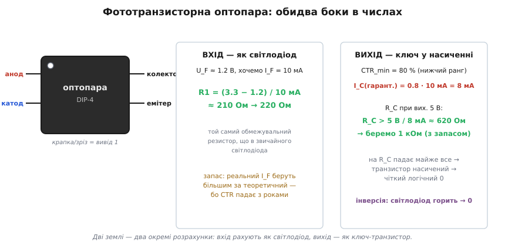
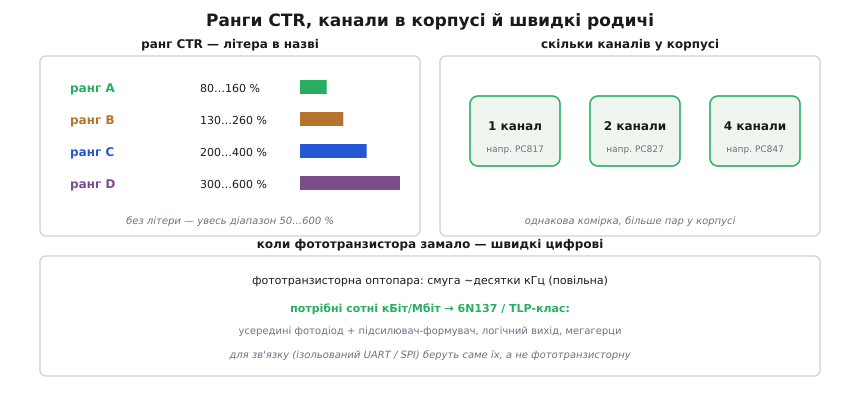

# 🔌 Фототранзисторна оптопара: розрахунок обох боків і старіння

[Оптопара й гальванічна розв'язка](topic:hw-components/optocoupler) як принцип — це світлодіод, що світить на фотоприймач через прозорий бар'єр, без жодного електричного контакту між боками. Найпоширеніший різновид — **фототранзисторна оптопара**: на вході світлодіод, на виході фототранзистор, а відношення вихідного струму до вхідного задає коефіцієнт передачі струму CTR (англ. *current transfer ratio* — відношення передачі струму). Цей клас настільки однотипний між виробниками, що його варто розібрати як клас: як порахувати резистори обох боків, чому проєктують під *найгірший* CTR, чому світлодіод неминуче старіє і де така оптопара вже не годиться. За приклад візьмемо ходовий PC817, але все сказане однакове для будь-якої фототранзисторної оптопари — змінюються лише цифри в даташиті.

### Чому розрахунок розпадається на дві половини

Усередині корпусу (типово DIP-4) — світлодіод плюс фототранзистор, а між ними лише прозорий компаунд: жодного електричного контакту, тільки світло. Саме тому вхід і вихід можна тримати на двох різних «землях», що відрізняються на сотні вольтів, — і саме тому розрахунок розпадається на **дві геть незалежні половини**. Найчастіше така оптопара перемикає цифровий сигнал «увімк/вимк» через ізоляцію, і кожну половину рахують окремо:


*Вхід рахують як звичайний світлодіод: резистор задає струм через нього. Вихід рахують як ключ-транзистор: резистор колектора підбирають так, щоб транзистор увійшов у насичення. Дві землі — два окремі розрахунки.*

**Вхідний бік.** Світлодіод оптопари має падіння U_F ≈ 1.2 В. Чому саме стільки, а не ~2 В, як у звичайного червоного індикаторного? Бо випромінювач оптопари зроблений з арсеніду галію (GaAs, gallium arsenide) і світить у ближньому інфрачервоному (≈940 нм) — а ширина забороненої зони GaAs (≈1.42 еВ) менша, ніж у видимих світлодіодів, тож і пряме падіння нижче. Працювати в інфрачервоному вигідно: кремнієвий фотоприймач саме там найчутливіший, бо енергія такого фотона ще впевнено перевищує заборонену зону кремнію (1.12 еВ) і кожен фотон народжує пару носіїв.

**Умова: засвітити світлодіод струмом I_F = 10 мА від логічного сигналу 3.3 В.** Тут усе як зі звичайним [обмежувальним резистором](topic:hw-sensing/led-photodiode) — від напруги сигналу віднімаємо падіння й ділимо на потрібний струм:

```
R1 = (U_сигналу − U_F) / I_F
   = (3.3 − 1.2) / 10 мА
   ≈ 210 Ом   →   220 Ом (найближчий зі стандартного ряду)
```

**Вихідний бік.** Тут потрібне **насичення** (saturation, англ. — повне відкриття) — щоб транзистор повністю «замкнувся» й дав чіткий логічний рівень. Чому не просто «трохи відкрити»? Бо лише в насиченні напруга колектор-емітер падає до ≈0.1–0.3 В, і вихід дає однозначний логічний нуль, нечутливий до точного значення струму; у лінійному режимі вихідна напруга «пливла» б за CTR, температурою й старінням.

**Умова: при 10 мА входу й вихідній шині 5 В загнати транзистор у насичення, узявши найгірший гарантований CTR.** Якщо найгірший гарантований CTR — 80 % (типово для нижчого рангу), транзистор певно пропустить хоча б 8 мА; резистор колектора беремо такий, щоб коло *просило* менше за ці 8 мА:

```
I_C(гарант.) = CTR_min · I_F = 0.8 · 10 мА = 8 мА
R_C > U_вих / I_C = 5 В / 8 мА ≈ 620 Ом   →   беремо 1 кОм із запасом
```

Логіка нерівності така: щоб гарантовано ввійти в насичення, коло колектора має *просити* менший струм, ніж той, що транзистор здатен пропустити. Якщо R_C тягне через себе більше за 8 мА (тобто R_C < 620 Ом), транзистор «не дотягне» і застрягне в активному режимі — вихід не сяде в нуль. Ставимо R_C побільше (1 кОм) — і потрібний струм виходу (5 В / 1 кОм = 5 мА) із запасом менший за гарантовані 8 мА. При насиченні майже вся вихідна напруга падає на R_C, і вихід дає чистий логічний нуль. З цього випливає **інверсія**, про яку легко забути: світлодіод горить → транзистор відкритий → вихід «0»; погас → вихід підтягнутий до «1». Це нормальна риса оптопари, яку враховують у логіці.

> 🔧 **Навіщо це.** Дві половини рахуються окремо саме тому, що між ними нема спільної землі — у реальній платі це означає, що вхід можна під'єднати до 3.3-вольтового виводу [мікроконтролера](topic:hw-components/bjt-switch), а вихід — до 24-вольтового промислового кола, і жоден сплеск на «брудному» боці не пройде в логіку по мідному дроту.

### Чому проєктують під найгірший CTR

Головне правило проєктування з фототранзисторною оптопарою випливає прямо з [примхливості CTR](topic:hw-components/optocoupler): він різниться в рази між екземплярами, падає на спеці й **старіє**. Тому беруть не «типовий», а **мінімальний гарантований** CTR — і ще додають запас по вхідному струму. Інакше схема, що працювала на свіжій оптопарі, через рік перестане давати насичення, і логіка «попливе».

Але звідки взагалі береться старіння — чому CTR не стоїть на місці? Корінь — у самому GaAs-світлодіоді, а не в транзисторі. Адже CTR = (світловий потік світлодіода) × (чутливість фотоприймача); кремнієвий транзистор зі своїм переходом практично не деградує, а от інфрачервоний випромінювач із роками тьмяніє. Механізм фізичний: у кристалі GaAs під час роботи мігрують дефекти ґратки — вакансії й міжвузлові атоми, частина яких уже «вбудована» ще при вирощуванні. Інжектований струм і тепло дають їм енергію рухатися, вони збираються в скупчення й утворюють так звані **центри безвипромінювальної рекомбінації** (non-radiative recombination centers): пастки в забороненій зоні, на яких електрон і дірка рекомбінують, віддаючи енергію не фотоном, а коливанням ґратки — теплом. Що більше таких центрів, то менша частка пар, що народжують світло, і то тьмяніший світлодіод при тому самому струмі. Світловий потік падає — CTR падає за ним. Звідси й типова цифра: за роки безперервної роботи світіння GaAs може просісти на десятки відсотків, причому тим швидше, чим вищий робочий струм (більше носіїв «розганяють» дефекти) і чим гарячіший кристал. Тому ще одна порада прямо випливає з механізму: не гнати світлодіод оптопари на максимальному струмі — помірні 5–10 мА і служать довше, і старіють повільніше.

Температурна частина тієї самої примхливості має споріднену природу: на спеці безвипромінювальна рекомбінація активніша (більше теплової енергії — частіше носій встигає «впасти» в пастку, перш ніж випроменити), тож світіння й CTR падають із нагрівом навіть без жодного старіння. Старіння — це коли таких пасток із часом стає дедалі більше, причому вже назавжди.

### Ранги CTR і сімейство

Через цей розкид фототранзисторні оптопари часто продають із **відсортованим** CTR, а ранг кодується **літерою** в назві:


*Літера задає діапазон CTR (наприклад A — 80…160 %, B — 130…260 %, C — 200…400 %, D — 300…600 %); без літери — увесь розкид 50…600 %. Та сама комірка буває в корпусах на 1, 2 і 4 канали. Для швидких ліній беруть зовсім інші оптопари.*

Чому взагалі доводиться сортувати? Бо CTR — це добуток двох величин, які виробник не може точно витримати в масовому процесі: ефективності світлодіода та підсилення транзистора (β). Обидві гуляють від партії до партії, тож сирий розкид CTR виходить шестикратним (типово 50…600 %). Замість викидати «слабкі» й «сильні» екземпляри, виробник вимірює кожен і сортує — звідси літера після номера. Практичний наслідок: якщо потрібен надійний запас на насичення, беруть вищий ранг — тоді того самого вхідного струму вистачає певніше, і навіть після кількох років старіння CTR не впаде нижче критичної межі. А коли каналів треба кілька, ту саму комірку випускають по два й по чотири в одному корпусі (на прикладі PC817 родичі — PC827 на два канали і PC847 на чотири).

### Коли фототранзисторна оптопара не годиться

Фототранзистор повільний — смуга такої оптопари близько кількох десятків кілогерц. Звідки ця млявість, адже сам кремнієвий транзистор може працювати на сотнях мегагерц? Вузьке місце не в підсиленні, а в тому, *де* народжуються носії. У фототранзисторі світло поглинається в широкій області база-колектор і породжує там фотоносії; ця велика, слабко легована й електрично «непідв'язана» база поводиться як містка ємність. Щоб вихід змінився, цю ємність треба зарядити й розрядити фотострумом — а фотострум малий. До того ж самі носії, народжені світлом, мусять спершу продифундувати до переходу й там бути зібраними полем або рекомбінувати; характерний **час життя носіїв** (carrier lifetime) і час їхньої дифузії в товстій базі — це десятки мікросекунд. Помножте велику ємність бази на малий струм заряджання — і фронт затягується на мікросекунди, що й дає смугу лише в десятки кілогерц. Підсилення β тут навіть шкодить швидкості: воно множить не лише корисний фотострум, а й ефективний заряд цієї повільної бази, тож «сильніша» оптопара часто ще й повільніша.

Цього досить для реле, кнопок, повільних команд, зворотного зв'язку живлення. Але для **зв'язку** — ізольованого UART, SPI на сотні кілобіт — потрібні швидкі оптопари з **логічним виходом**: 6N137, TLP-серія та подібні. Як вони обходять ту саму фізику? Усередині — не фототранзистор, а маленький **фотодіод плюс окремий підсилювач-формувач** (компаратор). Фотодіод працює зі зворотним зміщенням, його збіднена область вузька, а зібраний заряд одразу йде на швидкий транзисторний підсилювач — повільна ємнісна база на шляху сигналу вже не стоїть. Тому такі оптопари дають чіткі цифрові фронти на мегагерцах. Сплутати легко: поставив фототранзисторну оптопару на швидку лінію — і фронти «попливли», зв'язок не працює.

> 🔧 **Навіщо це.** Фототранзисторна оптопара — «робоча конячка» для повільних розв'язаних сигналів: вхід рахуйте як світлодіод (резистор під I_F ≈ 5–10 мА), вихід — як ключ у насиченні (R_C під мінімальний CTR). Беріть **мінімальний** гарантований CTR і запас по струму — бо GaAs-світлодіод старіє (множаться центри безвипромінювальної рекомбінації, світіння тьмяніє); вищий ранг дає певніше насичення на роки наперед. Не женіть вхідний струм на максимум — менший струм означає повільніше старіння. Пам'ятайте про інверсію виходу й про межу швидкості: повільна ємнісна база фототранзистора тримає смугу в десятках кГц, тож для зв'язку на сотні кБіт ставлять не фототранзисторну, а швидку цифрову оптопару з фотодіодом і формувачем (6N137-клас).
