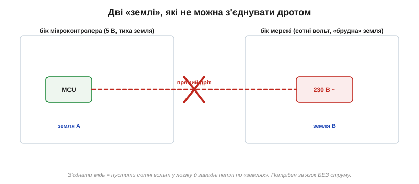
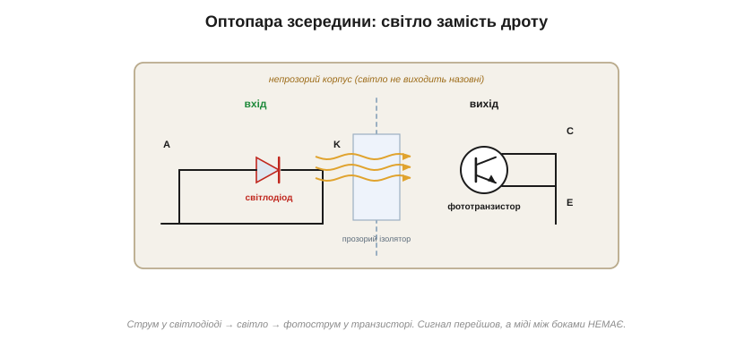
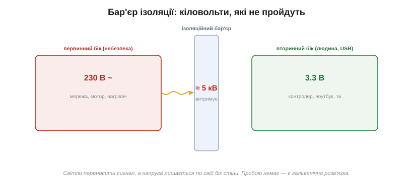
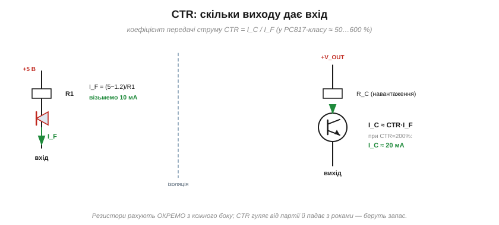
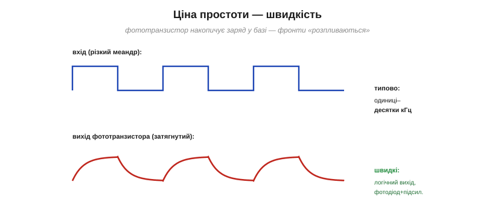
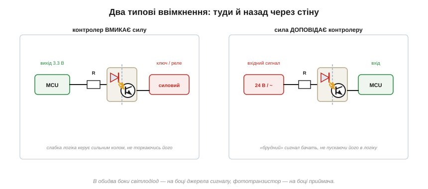
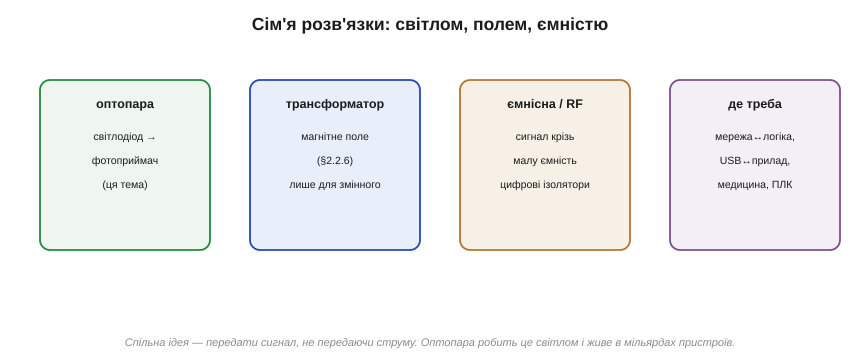

# Оптопара й гальванічна розв'язка

Зазвичай від діода чекають, що він щось **проводить**: струм, заряд, фотострум. А тут — найпарадоксальніша його служба, де головна цінність саме в тому, що струм **не** проходить. Уявімо дві схеми, які конче треба з'єднати сигналом — але з'єднувати дротом не можна. Мікроконтролер на тихих п'яти вольтах мусить увімкнути нагрівач у мережі на 230 вольт. Або: давач сидить на корпусі верстата, де по «землі» гуляють кіловольтні викиди від двигуна, а його сигнал треба завести в ноутбук, до якого торкається жива людина. Пряма мідь у таких місцях — це або сотні вольт у логіці, або смертельна петля по «землях». Потрібен зв'язок, який передає **сигнал, але не струм**. І пара зі [світлодіода й фотоприймача](topic:hw-sensing/led-photodiode) дає його напрочуд просто.

### Дві землі, яким не можна торкатися

Звичайна схема стоїть на тому, що всі її напруги відлічуються від однієї опорної точки — [«землі»](topic:hw-pcb/common-ground). Поки система одна, спільна земля — благо. Та щойно сходяться **два світи** з різними землями, дріт між ними стає бідою:

*Ліворуч — тиха земля логіки; праворуч — «брудна» земля мережі під сотнями вольт. Прямий дріт зрівняв би їхні потенціали — тобто пустив би мережеву напругу в мікроконтролер, а заодно завадні петлі по «землях». Зв'язок потрібен, але без спільної міді.*

Бід насправді дві, і обидві серйозні. Перша — **безпека й живучість**: якщо земля одного боку стрибне на сотні вольт відносно іншого (пробій, витік на корпус, мережевий потенціал), цей стрибок піде прямо в чутливу логіку — і спалить її, а в гіршому разі дістанеться людини. Друга, тонша — **завади**: коли два кола ділять спільний провід землі, по ньому течуть струми обох, і падіння напруги від сильного «брудного» кола підмішується в слабке вимірювальне — це механізм [спільного опору й земляних петель](topic:hw-pcb/ground-loops). Розірвати мідь — означає прибрати обидві біди одним ходом: немає спільного проводу — немає ні шляху для високої напруги, ні петлі для завад.

### Ідея: розірвати мідь, з'єднати світлом

Як передати сигнал крізь розрив, де навмисне немає дроту? Світлом. Поставмо на вхідному боці [**світлодіод**](topic:hw-sensing/led-photodiode): тече сигнальний струм — він світить, нема струму — темно. А навпроти, через крихітний прозорий проміжок, — **фотоприймач**, що ловить це світло й оживає від нього. Сигнал перестрибнув щілину, не торкнувшись її: на вході струм став світлом, на виході світло знову стало струмом. А між боками — лише прозорий ізолятор, крізь який летять фотони, але не може протекти жоден електрон. Цей зв'язок «через світло» і є серцем приладу, що зветься **оптопарою** (*optocoupler*, оптрон).

### Оптопара зсередини

Заводську оптопару збирають у єдиному непрозорому корпусі — щоб ніяке стороннє світло не заважало й ніяке власне не витікало:

*Світлодіод і фотоприймач дивляться одне на одного крізь прозорий ізолятор, замкнені в непрозорому корпусі. Струм у світлодіоді породжує світло, світло — фотострум у приймачі. Між входом і виходом немає жодного провідного шляху — лише потік фотонів.*

Фотоприймачем найчастіше служить не простий фотодіод, а **фототранзистор** — той самий [фотоефект](topic:hw-sensing/led-photodiode), але вбудований у [транзистор](topic:hw-components/transistor-idea), який заразом і **підсилює** свій кволий фотострум (тут досить знати, що він робить слабкий фотосигнал помітно сильнішим). Тому найпоширеніша оптопара — світлодіод плюс фототранзистор: на вхід подаєш міліампери крізь світлодіод, на виході дістаєш керований світлом транзистор, який умикає чи вимикає вихідне коло. Вхід і вихід при цьому живуть у різних електричних світах, не маючи спільної точки взагалі.

### Що означає «гальванічна розв'язка»

Оце «немає спільного провідного шляху» має точну назву — **гальванічна розв'язка** (*galvanic isolation*): два кола обмінюються сигналом (через світло, магнітне поле чи ємність), але між ними немає жодного шляху для постійного струму. Скільки б вольтів не з'явилося між їхніми землями — пробою не буде, бо між боками стоїть суцільний ізолятор. Наскільки високих — каже паспортний параметр **напруга ізоляції**:

*Типова оптопара витримує між боками близько 5 кіловольт — на порядки більше за будь-яку робочу напругу. Світло переносить сигнал, а напруга лишається кожна по свій бік стіни. Це і є гальванічна розв'язка: первинний бік може бути під мережею, вторинний — під пальцем людини.*

П'ять кіловольт — це не робоча напруга, а **запас міцності стіни**: навіть аварійний стрибок на тисячу-другу вольтів вона тримає, не пускаючи його на безпечний бік. Саме тому оптопари стоять усюди, де «небезпечне» сусідить із «людським»: між мережею і керуванням, між промисловим входом і контролером, в інтерфейсах медичних приладів, де від плати до пацієнта не сміє долетіти жоден зайвий мікроампер.

### CTR: коефіцієнт передачі струму

Раз сигнал двічі змінює природу — струм → світло → струм, — постає головне практичне питання: **скільки** виходу дає скільки входу? Це описує один параметр — **коефіцієнт передачі струму**, CTR (*current transfer ratio*): відношення вихідного струму колектора до вхідного струму світлодіода.

*I_C ≈ CTR · I_F. У типової оптопари PC817-класу CTR гуляє в межах 50…600 % залежно від екземпляра. Резистори двох боків рахують ОКРЕМО: вхідний задає струм світлодіода, вихідний — навантаження транзистора.*

Розрахунок розпадається на дві незалежні половини — у цьому й зручність розв'язки. **На вході** все як зі [звичайним світлодіодом](topic:hw-sensing/led-photodiode): від напруги керування віднімаємо падіння світлодіода (~1.2 В) і резистором задаємо потрібний струм, скажімо 10 мА. **На виході** фототранзистор поводиться як ключ, що пропускає до CTR·I_F: при CTR 200 % наші 10 мА на вході дають близько 20 мА на виході — досить, щоб увімкнути наступний каскад. Дві половини рахуються нарізно, кожна у своєму світі напруг, бо спільної землі в них немає.

Одне «але» цей CTR має велике, і про нього треба знати з самого початку: він **дуже неточний**. Від екземпляра до екземпляра однієї партії він різниться в рази, падає на холоді й на спеці, а головне — **старіє**: світлодіод усередині поступово тьмяніє, і за роки роботи CTR помітно меншає. Тому жодна надійна схема не закладається на конкретне значення — лише на гарантований мінімум, та ще й із запасом. Практичне правило: подай у світлодіод помітно більший струм, ніж теоретично треба, щоб навіть постарілої, найгіршої з партії оптопари вистачало з лишком. Як це виглядає в числах на найпоширенішому оптроні — видно на прикладі [PC817 з його рангами CTR за літерою в назві (A/B/C/D)](topic:hw-components/optocoupler): ранг прямо каже гарантований мінімум, під який і рахують обидва резистори, проєктуючи завжди під найгірший випадок.

### Платня за простоту: швидкість

За підкупливу простоту фототранзисторна оптопара бере плату — **повільністю**. Усередині транзистора світло має накопичити заряд, а потім цей заряд розсмоктати — а [будь-яке накопичення заряду](topic:hw-analog/rc-time-constant) означає затримку; тому різкі фронти на виході розпливаються:

*Різкий меандр на вході (струм світлодіода) виходить із фототранзистора затягнутим — заряд бази не встигає за швидкими перемиканнями. Звичайна оптопара чесно працює лише до одиниць–десятків кілогерц.*

Для повільних сигналів — увімкнути реле, передати команду «вкл/викл», завести в контролер стан кнопки — цих кілогерц із головою. Та коли треба швидко — ізолювати лінію зв'язку на сотні кілобіт чи зворотний зв'язок імпульсного перетворювача, — беруть **швидші** різновиди: оптопари з логічним виходом (усередині фотодіод плюс підсилювач-формувач, що видає чіткі цифрові фронти) або взагалі інші типи ізоляторів. Класичний інженерний компроміс: найдешевша й найпростіша деталь — найповільніша.

### Оптопара в ділі: туди й назад

Майже всі практичні ввімкнення оптопари — це один із двох дзеркальних випадків, і правило для обох однакове: **світлодіод ставлять на боці, що видає сигнал, фототранзистор — на боці, що його приймає**.

*Ліворуч — контролер керує силою: слабкий вихід через резистор світить світлодіодом, фототранзистор умикає силовий ключ у небезпечному колі. Праворуч — сила доповідає контролеру: «брудний» вхідний сигнал світить світлодіодом, а чистий фототранзистор заводить його у вхід MCU.*

Перший випадок — **контролер вмикає силу**. Вихід мікроконтролера дає лише міліампери при трьох вольтах — ним не ввімкнути ні мережевого нагрівача, ні двигуна. Зате цих міліампер досить, щоб засвітити світлодіод оптопари; а фототранзистор на тому боці вже відмикає силовий ключ у мережевому колі. Логіка керує силою, не маючи з нею жодного спільного дроту — і мережа фізично не може дістатися до контролера. Другий випадок **дзеркальний** — сила доповідає контролеру. Промисловий давач чи кнопка живляться від «брудних» 24 вольт або просто від іншого кола; завести такий сигнал прямо у вхід мікроконтролера небезпечно. Тому сигнал спершу світить світлодіодом оптопари, а контролер читає вже чистий, розв'язаний вихід фототранзистора. В обох випадках між «брудним» і «чистим» світами — лише прозора щілина.

### Класична служба: зворотний зв'язок крізь стіну

Є застосування, у якому оптопара стоїть майже в кожному домі, — **зарядний пристрій** телефона чи ноутбука. Усередині такого імпульсного блока живлення вхід (мережа) і вихід (низьковольтна шина, до якої торкаєтесь ви) навмисне розв'язані трансформатором — інакше мережа дісталася б до рук. Та керувальній мікросхемі на **первинному** (мережевому) боці треба знати напругу на **вторинному** (безпечному) — щоб підтримувати її рівною: впала — піддати, підскочила — зменшити. Виходить замкнене коло, у якому сигнал мусить перетнути ту саму ізоляційну стіну, не пробивши її. Оптопара робить це ідеально: на вторинному боці схема стежить за напругою й керує струмом світлодіода, а фототранзистор на первинному передає цю звістку керувальній мікросхемі — крізь світло, без жодного дроту через бар'єр. Розкрутіть будь-яку зарядку — маленький чотирививідний місток між двома половинами плати майже напевно виявиться саме оптопарою, що несе зворотний зв'язок через стіну ізоляції.

### Родина: не лише світлом

Оптопара — найвідоміший, але не єдиний спосіб передати сигнал без струму. Варто бачити всю сім'ю, щоб розуміти, коли яку розв'язку взяти:

*Світло (оптопара), магнітне поле (трансформатор), електричне поле крізь малу ємність (сучасні цифрові ізолятори). Спосіб різний — ідея спільна: перенести сигнал, не перенісши струму.*

Сама оптопара теж буває різною: фототранзисторна (найпростіша, для «вкл/викл» і повільних сигналів), із логічним виходом (швидша, для цифри), лінійна (передає аналоговий рівень, а не лише «є/нема»). А поряд із нею живуть інші родичі тієї самої ідеї. [**Трансформатор**](topic:ph-electromagnetism/mutual-inductance) розв'язує магнітним полем — але лише змінний сигнал, бо постійний крізь нього не пройде. Найновіші **цифрові ізолятори** переносять сигнал крізь крихітну ємність або мініатюрний трансформатор, вбудовані в мікросхему: вони швидші за оптопару в сотні разів і не старіють, тому в сучасній техніці дедалі частіше витісняють її там, де потрібна швидкість. Але там, де треба дешево, просто й надійно розв'язати повільний сигнал — мережеве реле, вхід контролера, зворотний зв'язок зарядного, — скромна оптопара зі світлодіодом і фототранзистором досі поза конкуренцією й стоїть у мільярдах пристроїв.

> 🔧 **Навіщо це.** Побачили на платі деталь, що з'єднує «небезпечний» бік (мережа, силовий каскад) із «логічним» (мікроконтролер), — це майже напевно оптопара або цифровий ізолятор, і його завдання — щоб біда одного боку не перейшла на інший. Закладаючи оптопару в схему: рахуйте струм світлодіода **з запасом** (CTR падає з партією, температурою й роками), перевіряйте паспортну **напругу ізоляції** під свою задачу, а на швидкі сигнали беріть оптопару з логічним виходом чи цифровий ізолятор замість простої фототранзисторної. І пам'ятайте головне правило безпеки: розв'язка має сенс лише доти, доки жоден інший дріт, спільне живлення чи земля не з'єднують боки в обхід неї — одна випадкова мідна перемичка зводить нанівець усю стіну.

Так той самий [світлодіод і фотоприймач](topic:hw-sensing/led-photodiode), поставлені один навпроти одного, дають те, чого не вміє жоден провідник, — передати звістку через прірву, не наводячи через неї мосту. На цьому власне розкривається й уся широчінь діода: один і той самий PN-перехід стає клапаном і випрямлячем, джерелом світла й давачем, опорою напруги й вартовим, а в парі з фотоприймачем — ще й містком крізь ізоляцію. Стільки ролей лише тому, що тим самим переходом користуються по-різному: то прямо, то зворотно, то в пробої, то під світлом. Уся хитрість не в нових деталях, а в новому **погляді** на ту саму межу між p і n.

Та діод уміє лише **реагувати**: він не підсилює й не слухається третього виводу. А що, як додати ще одну леговану область і керувальний електрод — щоб слабкий сигнал **керував** сильним струмом? Уявімо діод із **третім** виводом, який прочиняє й причиняє внутрішній «клапан»: тоді кволий сигнал на цьому виводі правив би потужним струмом крізь прилад — це підсилення. Саме це й робить [**транзистор**](topic:hw-components/transistor-idea), перетворюючи пасивну електроніку на активну — здатну підсилювати, перемикати й обчислювати: компоненти вже не просто реагують, а **керують**.
