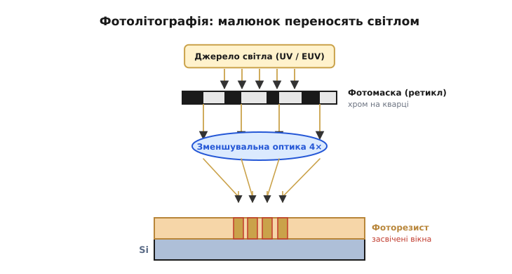
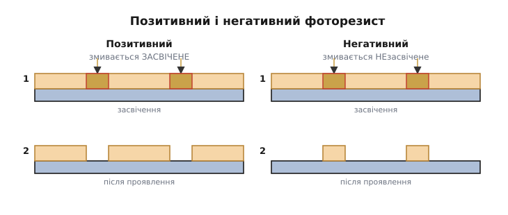
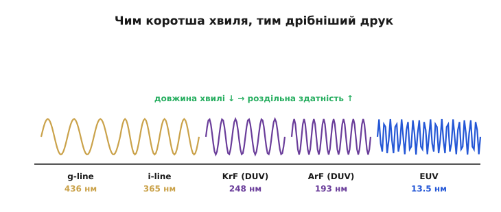
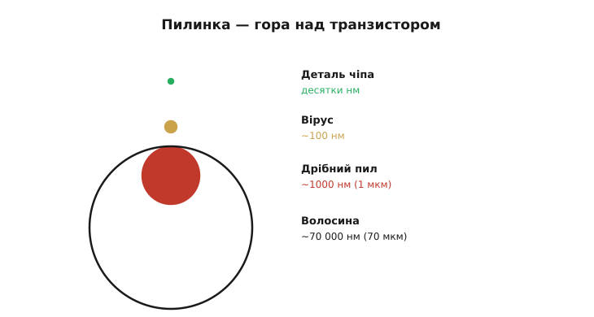

# Фотолітографія: схему друкують світлом

Перед нами полірована кремнієва пластина — чиста, гладенька, порожня. На ній треба розмістити мільярди транзисторів і дроти між ними, кожен у десятки нанометрів завширшки. Жоден різець, жодна голка такого не вміють — деталі надто дрібні, дрібніші за будь-який механічний інструмент, дрібніші навіть за довжину хвилі видимого світла. Спокуса намалювати схему «вістрям» хибна вже на старті: навіть якби існувало вістря потрібної тонкості, виводити ним мільярди елементів по одному довелося б тисячі років на кожен чіп. Потрібен спосіб нанести **весь** складний візерунок **одразу**, а не по точці.

Як же це роблять? Відповідь — одна з найкрасивіших ідей у техніці: малюнок **друкують світлом**, як фотографію, цілою картиною за раз. Процес зветься **фотолітографією** (від грец. *phos/photos* — світло, *lithos* — камінь, *graphein* — писати; буквально «світлом по каменю»), і саме він — серце всього виробництва, бо саме він задає, наскільки дрібні деталі взагалі можливі, і саме він — найдорожчий і найскладніший крок. Народилася ця ідея не на порожньому місці: сам [транзистор і потім інтегральна схема](root:hw-components/ic-invention) стали масовими лише тоді, коли навчилися друкувати рисунок схеми світлом, а не складати його вручну. Розберімо, як це працює, чому межу дрібності ставить сама природа світла й чому заради подолання цієї межі будують найскладніші машини на Землі.

### Ідея: фотографія навпаки

Принцип легше зрозуміти через знайому аналогію — старе плівкове фото. Там світло крізь негатив падало на світлочутливий папір і «проявляло» зображення. У фотолітографії — те саме за механізмом, тільки інше за метою: не отримати картинку для очей, а **створити фізичну маску** з малюнком схеми просто на пластині, маску, що далі керуватиме хімією й фізикою наступного кроку. Слово «літографія» (грец. «каменепис») прийшло зі старого способу друку, де малюнок наносили на камінь; «фото-» означає, що тепер «пише» світло. Аналогія з фотографією точна рівно доти, доки ми пам'ятаємо різницю: фотографія — кінцевий продукт, а тут «знімок» — лише проміжний трафарет.


*Світло від джерела проходить крізь **фотомаску** (*photomask*) — пластину кварцу з малюнком схеми, викладеним непрозорим хромом. Там, де хром, світло затримується; крізь прозорі ділянки воно проходить далі. **Зменшувальна оптика** (зазвичай 4×) стискає цей малюнок і проєктує його на пластину, вкриту тонким шаром світлочутливого **фоторезисту** (*photoresist*, від *photo-* — світло й *resist* — той, що чинить опір, тут опір розчиннику). Світло засвічує резист лише під прозорими місцями маски. Засвічений резист потім розчиняють (проявлення), і на пластині лишається рельєфна маска з резисту, що точно повторює рисунок.*

Простежмо хід світла. Спершу всю пластину вкривають рівним тонким шаром **фоторезисту** — речовини, яка змінює свою розчинність там, де її торкнулося світло. Наносять його красиво: краплю ллють на центр пластини й розкручують її на тисячі обертів — відцентрова сила розганяє резист рівним мікронним шаром по всій поверхні (так зване центрифугування). Над пластиною розміщують **маску**: прозорий кварц із візерунком схеми, накресленим непрозорим хромом. Світло проходить крізь маску — але тільки там, де **немає** хрому, — і засвічує резист під цими прозорими «вікнами».

Між маскою й пластиною стоїть **лінза**, що робить дивовижну річ: вона **зменшує** малюнок, зазвичай у чотири рази. Тут варто спинитися, бо це не дрібниця, а ключ до здійсненності всього процесу. Зробити маску з деталями в сотні нанометрів — посильно: вона велика, її роблять повільно й ретельно. А от прямо «накреслити» деталь у десятки нанометрів нічим не вийшло б. Зменшувальна оптика розв'язує це елегантно: на масці малюнок учетверо **більший**, а лінза стискає його, проєктуючи на пластину вже в потрібному дрібному масштабі. Похибки маски при цьому теж зменшуються вчетверо — ще один подарунок. Через це маску ще звуть **ретиклом** (*reticle*, від лат. *reticulum* — сіточка: колись на таких пластинах і справді була координатна сітка), а машину, що крок за кроком «штампує» нею пластину, — **степером** (*stepper*, від англ. *step* — крок) чи **сканером**: вона засвічує не всю пластину разом, а по одному кристалу (чи кількох) за спалах, тоді зсувається на крок — і знову, аж поки не вкриє весь диск. Різниця між ними в тому, як кристал отримує світло: степер засвічує все поле одним спалахом нерухомої маски, а сканер веде вузьку світлову смугу, синхронно совгаючи маску й пластину назустріч, — так лінзі легше тримати різкість по всьому полю, тому сучасні машини майже всі сканери.

Після засвічення пластину «проявляють»: спеціальний розчинник змиває резист за певним правилом (залежно від типу резисту), лишаючи на кремнії рельєфну маску — копію схеми у твердому резисті. Ця маска з резисту й керуватиме [наступним кроком обробки](root:hw-components/doping-etching-metal): вона захищає одні ділянки пластини й відкриває інші. Сама по собі вона нічого в кремнії не змінює — вона лише **трафарет** для дії, що настане далі.

Варто оцінити й темп цієї роботи. Сканер засвічує кристали один по одному, та робить це шалено швидко — десятки, а то й понад сотню пластин за годину, кожна з сотнями кристалів, і так цілодобово. Машина вартістю в сотні мільйонів доларів не може дозволити собі простоювати: її окупає саме потік. А оскільки масок на один чіп — десятки, кожна пластина проходить крізь літографію **багато разів**, щоразу з новим ретиклом для наступного шару, перемежовуючись із кроками [обробки кремнію](root:hw-components/doping-etching-metal). Літографія — не одна операція, а цілий ритм, що повторюється шар за шаром.

### Позитивний і негативний резист

Тут є тонкість, яку варто знати, бо вона повторюється скрізь у мікровиробництві: резист буває двох протилежних типів.


*Позитивний резист: світло руйнує зв'язки, тож при проявленні змивається саме засвічене — на пластині лишається рисунок «у негативі» до світлих місць маски. Негативний резист: світло, навпаки, зшиває його, роблячи стійким, тож змивається незасвічене. Та сама маска дає протилежний рельєф резисту — інженер обирає тип під свій крок обробки.*

Різниця проста, але практична. У **позитивному** резисті світло **руйнує** хімічні зв'язки, роблячи засвічене розчинним; проявник змиває саме ті місця, куди впало світло, — рельєф резисту виходить «у позитиві» до прозорих ділянок маски (звідси й назва). У **негативному** — навпаки: світло **зшиває** молекули в стійку сітку, тож змивається все, **окрім** засвіченого. Виходить, з однієї і тієї ж маски можна дістати два протилежні рельєфи — залишити резист там, де було світло, або там, де його не було.

Навіщо взагалі ця двоїстість? Бо наступний [крок обробки](root:hw-components/doping-etching-metal) буває різним за смислом. Якщо треба **витравити** вузькі канавки, зручно, щоб резист лишився суцільним полем із дірками-вікнами там, де канавки. Якщо ж, навпаки, нам треба захистити лише тонкі смужки металу, а решту прибрати, — зручніший протилежний рельєф. Інженер обирає тип резисту під конкретну операцію, як столяр обирає, з якого боку прикласти трафарет. Здебільшого в сучасному виробництві панує **позитивний** резист — він дає чіткіші, різкіші краї, а на нанометрових масштабах різкість краю важить над усе. Це гнучкість, яку дає сама хімія резисту: один і той самий рисунок маски здатен породити два протилежні рельєфи під дві різні задачі обробки.

### Чому дрібність обмежена довжиною хвилі

Тепер — найголовніше питання всього виробництва: наскільки **дрібний** малюнок можна надрукувати світлом? Виявляється, межу ставить сама природа світла — його **довжина хвилі**.


*Світлом не можна чітко намалювати деталь, набагато дрібнішу за його довжину хвилі — хвиля «розмазується» на надто малих ознаках. Тому індустрія десятиліттями переходила на дедалі коротші хвилі: видиме й близьке ультрафіолетове (g-line 436 нм, i-line 365 нм) → глибоке ультрафіолетове DUV (KrF 248 нм, ArF 193 нм) → і нарешті екстремальне EUV (13.5 нм). Коротша хвиля — дрібніший друк.*

Інтуїція тут фізична й глибока. Світло — це хвиля, і коли вона огинає чи проходить крізь отвір, набагато менший за її довжину, вона **дифрагує** — розпливається, і чіткого краю не виходить. Намалювати хвилею завдовжки 193 нм деталь у 20 нм — це як писати товстим маркером дрібний шрифт: лінії зливаються в пляму. Інженери виражають цю межу формулою роздільної здатності, але суть її проста:

```
мінімальна деталь  ≈  k₁ · λ / NA

λ    — довжина хвилі світла
NA   — числова апертура оптики (наскільки «широко» лінза збирає світло)
k₁   — коефіцієнт процесу (хитрощі друку; фізична межа ~0.25)
```

Це так зване рівняння Релея (*Rayleigh*) для роздільної здатності. Підставмо реальні числа, щоб побачити, чого від нього чекати. Візьмемо «сухий» ArF-крок з типовими значеннями:

```
λ  = 193 нм
NA = 0.93
k₁ = 0.30

мінімальна деталь ≈ 0.30 · 193 / 0.93
                  ≈ 57.9 / 0.93
                  ≈ 62 нм
```

Близько 62 нм — і це межа одного «сухого» проходу на 193 нм; усе дрібніше доводиться вибивати хитрощами, до яких ми зараз дійдемо. Дивіться, які важелі дає сама формула. Зменшити деталь можна трьома шляхами: узяти **коротшу хвилю** λ, зробити **ширшу апертуру** NA або стиснути коефіцієнт k₁ хитрощами процесу. Усіма трьома індустрія й користувалася десятиліттями. Найпряміший — **коротша хвиля**: весь поступ був, серед іншого, гонитвою за меншою λ, від видимого світла через глибоке ультрафіолетове (DUV, *deep ultraviolet*, 193 нм). На 193 нм індустрія застрягла надовго — і все одно протягла на ній ще кілька [поколінь техпроцесу](root:hw-components/process-node) самими хитрощами. Перша — **занурювальна літографія** (*immersion*): простір між лінзою й пластиною заливають надчистою водою, і та, заломлюючи світло, збільшує ефективну NA приблизно в 1.4 раза, ніби стискаючи ту саму хвилю. Друга — **мультипатернінг**: один шар друкують не за один прохід, а за два й більше, щоразу зі зсувом, тож сусідні лінії лягають удвічі частіше, ніж дозволяє один спалах. Третя — **поправки на дифракцію** на самій масці: рисунок навмисне спотворюють так, щоб після розпливання хвилі на пластині вийшов потрібний край. І лише коли всі ці резерви вичерпалися, індустрія зробила стрибок до **екстремального ультрафіолету** (EUV, *extreme ultraviolet*, 13.5 нм). Дався він страшенно важко: промінь такої короткої хвилі поглинається **геть усім** — повітрям, склом лінз, навіть звичайними дзеркалами, — тож працювати доводиться у глибокому вакуумі й на особливих багатошарових дзеркалах, а саме світло народжують, вистрілюючи потужним лазером по краплинах розплавленого олова, що спалахують плазмою. Машину, що це робить, недарма звуть найскладнішим серійним пристроєм в історії людства; її історію винесено в окрему 📜-вставку до цієї теми.

### Чому повітря мусить бути надчистим

І остання, дуже практична умова, без якої фотолітографія марна. Якщо деталі — десятки нанометрів, то будь-яка порошинка стає катастрофою.


*Масштаби в нанометрах. Деталь сучасного чіпа — десятки нанометрів. Дрібна порошинка — близько 1000 нм (1 мкм), у десятки разів більша за транзистор; людська волосина — ~70 000 нм, ціла гора. Одна пилинка, що сіла на пластину під час друку, накриває й губить сотні транзисторів. Тому повітря у виробництві фільтрують до одиниць частинок на кубометр.*

Уявіть масштаби буквально. Якщо транзистор — це купина, то пилинка — гора над нею, а волосина — цілий гірський хребет. Порошинка, що опустилася на пластину саме там, де друкується схема, спотворить малюнок резисту або затулить світло — і **вб'є** всі транзистори під собою, а це може бути цілий функціональний блок чи весь кристал. Звичайне кімнатне повітря містить **мільйони** частинок пилу в кожному кубометрі; для фотолітографії це смертельно. Тому чіпи виготовляють у **чистих кімнатах** (*cleanroom*) найвищого класу, де повітря безперервно й потужно проганяють згори вниз крізь фільтри тонкого очищення так, що в кубометрі лишаються **одиниці** частинок — у мільйони разів чистіше, ніж в операційній хірурга.

Боротьба з пилом пронизує тут усе. Працівники ходять у герметичних костюмах-«кролях» (*bunny suit*) не щоб захистити себе, а щоб захистити **пластину** від себе: людина — потужне джерело частинок (лусочки шкіри, волосся, волокна одягу, краплі від дихання). Повітря рухається ламінарним потоком, щоб не закручувати пил; матеріали добирають такі, що не пилять; навіть папір і олівці звичайні заборонені. А найдорожчі операції (як EUV-друк) узагалі ховають у вакуум — там пилу немає за визначенням. Ось чому «чисте повітря критичне»: на цих масштабах пил — головний ворог [виходу придатних кристалів](root:hw-components/yield), і боротьба з ним коштує не менше, ніж саме обладнання. Це ще одна грань того самого протистояння — **порядок проти випадковості**: [чистота самого кремнію](root:hw-components/silicon-monocrystal) бореться з чужими атомами в ґратці, а чистота кімнати — з чужими порошинками на поверхні.

> 🔧 **Навіщо це.** Фотолітографія пояснює дві речі, що прямо позначаються на вашій роботі й гаманці. Перше: **дрібність деталей обмежена фізикою світла**, і просування до менших вузлів коштує дедалі божевільніших грошей (машини EUV — сотні мільйонів доларів за штуку); звідси й ціна передових чіпів, і те, чому новий техпроцес з'являється повільно. Друге: **виробництво гранично чутливе до забруднення** — звідси чисті кімнати, звідси й те, чому напівпровідникові заводи неможливо «зліпити на коліні», а їх будують роками за мільярди. Концептуально ж засвойте головне: чіп **не вирізають, а друкують** — світлом, через маску, цілою пластиною за раз; саме масовість цього «друку» (тисячі однакових кристалів одним спалахом) робить кожен окремий транзистор практично безплатним, хоча сам процес шалено дорогий. Це фундамент [економіки всієї галузі](root:hw-components/fabs-fabless).
