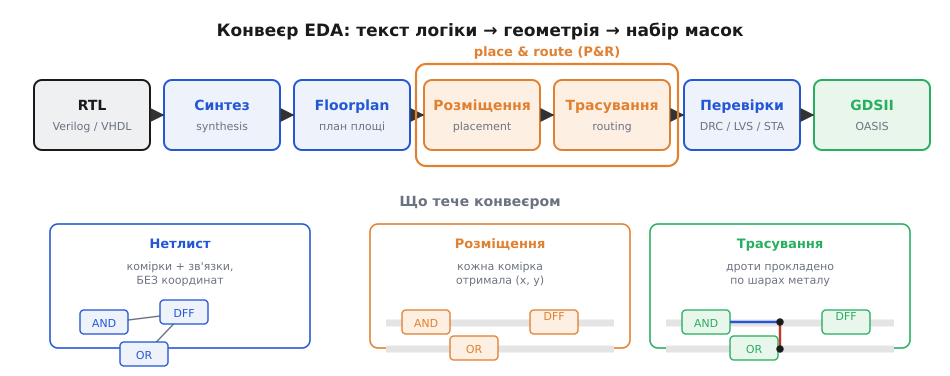
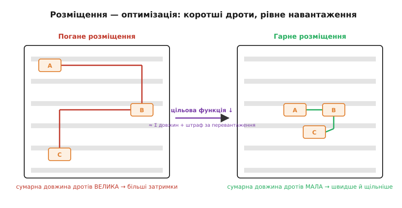
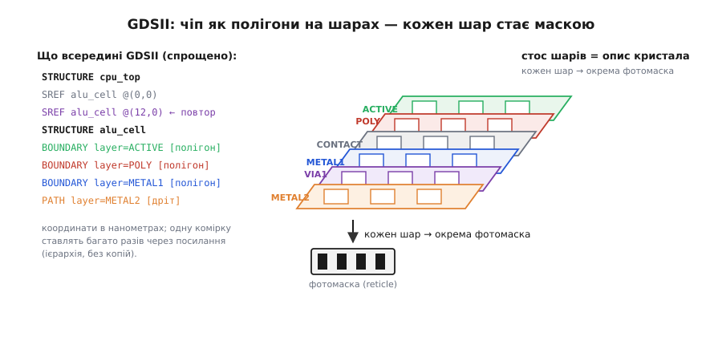

# ⚙️ Від схеми до маски: place & route і GDSII

> [Фотолітографія](root:hw-components/photolithography) друкує рисунок на пластині світлом крізь готовий набір **фотомасок** — але звідки беруться самі маски? Адже інженер пише не геометрію, а **логіку**. Між його текстом і креслеником масок лежить ланцюжок програм (EDA, *electronic design automation*), а серце цього ланцюжка — два алгоритми з говіркими назвами **placement** і **routing** (разом — **P&R**, *place & route*). Саме вони народжують геометрію, яка потім стане фотомасками. Розберімо якісно, що вони роблять і чому це одна з найважчих оптимізацій, які людство розв'язує щодня.

### Задача: текст логіки → координати мільярдів фігур

Цифрову схему інженер описує [мовою опису апаратури](root:hw-digital/hdl) — Verilog чи VHDL, де описують залізо, а не пишуть програму: «на фронті такту вихід дорівнює A AND B». Це **register-transfer level** (RTL): є логіка й те, який сигнал куди тече, але немає ані транзисторів, ані координат.

[Фотолітографія](root:hw-components/photolithography) ж вимагає протилежного — **геометрії**. Машина не вміє «надрукувати AND»; вона засвічує конкретний прямокутник на конкретному шарі в конкретному місці з точністю до нанометрів. Між цими світами зяє провалля: треба вирішити, **з яких транзисторів** скласти кожен вентиль, **де** його поставити і **якими доріжками** з'єднати з рештою. Помножте на мільярди вентилів процесора — і ясно, чому чіп не малюють вручну вже півстоліття. Цей шлях проходить ланцюжок EDA-програм.


*Шлях від тексту логіки до масок. Синтез зводить RTL до **нетлиста** — графа зі стандартних комірок (бібліотечних AND, OR, тригер…) без координат. Floorplan грубо ділить площу. **Placement** дає кожній комірці координати (x, y), **routing** прокладає дроти по шарах металу. Перевірки (DRC/LVS/STA) ловлять порушення правил, розбіжність із логікою й невитриманий таймінг. На виході — **GDSII**: багатошарова геометрія, з якої й роблять фотомаски.*

Кроки звуться так само, як у [потоці для ПЛІС](root:embedded/fpga-flow) («синтез → розміщення → трасування → бітстрім»), бо задача та сама. Різниця лише в кінцівці й ціні: там результат — бітстрім, що його перешивають за секунду, а тут — маски, які коштують мільйони. Тому вимоги до P&R на кремнії суворіші, але алгоритмічна суть однакова.

### Ідея: спершу розкласти комірки, потім з'єднати їх дротами

Хитрість — **розбити** непосильну задачу на дві й робити по черзі: спершу **placement** (де яка комірка), потім **routing** (як їх з'єднати).

Стандартні комірки шикуються в **рядки** однакової висоти, як цеглини в кладці; placement вирішує, яка комірка в якому рядку стоїть. Здавалося б, аби влізли — та місце визначає **довжину дротів**, а вона — це і затримка (довша доріжка має більшу ємність і повільніший фронт, а отже й ризик не [витримати такт](root:hw-digital/metastability-timing)), і витрата дефіцитного простору. Тому placement — це **оптимізація**: поставити пов'язані комірки **поруч**.


*Placement як мінімізація. Ліворуч комірки A, B, C одного ланцюга рознесені по кутах — дроти довгі, сигнал повзе. Праворуч ті самі комірки впритул — коротко й щільно. Алгоритм мінімізує **цільову функцію** ≈ сума довжин усіх з'єднань + штраф за перевантаження (коли в одне місце збігається більше дротів, ніж туди влазить).*

Routing з'єднує виводи дротами — але **не в одній площині**: на площині два дроти не розминути без дотику. Тому метал кладуть **багатьма шарами** (METAL1, METAL2 і далі, інколи понад десяток), а між ними ставлять вертикальні **перехідники** (*via*). Зазвичай один шар веде доріжки горизонтально, наступний — вертикально; щоб повернути, дріт «пірнає» крізь via на сусідній шар. Перетин на площині стає **переходом поверхами**, як на двоповерховій розв'язці.

Порядок саме такий, бо routing без координат безпорадний, а placement можна **оцінити** ще до прокладання — за прикидкою довжин. Зворотний бік: placement подеколи ставить комірки так щільно, що дроти не вміщаються, і тоді інструмент вертається й переставляє. Ця **петля** «розставив → не з'єднав → переставив» — серцевина реального P&R.

### Код: placement відпалом, routing хвилею

Обидва кроки — це пошук у величезному просторі варіантів; обидва зводяться до простого локального ходу, повтореного мільйони разів.

**Placement — імітований відпал** (*simulated annealing*, за аналогією з повільним охолодженням металу). Вартість розкладки — передусім сумарна довжина дротів; стандартна оцінка для одного ланцюга — **HPWL** (*half-perimeter wirelength*), півпериметр найменшого прямокутника, що охоплює всі його виводи. Хід — обмін двох комірок місцями; приймаємо його, якщо вартість упала, а зрідка й гіршу (з імовірністю, що спадає з «температурою»), аби вибратися з поганого локального мінімуму.

```cpp
#include <vector>
#include <random>
#include <cmath>
#include <algorithm>
#include <climits>

struct Cell { int row, col; };            // позиція комірки у сітці рядків
struct Net  { std::vector<int> cells; };  // ланцюг: індекси з'єднаних комірок

// HPWL (half-perimeter wirelength) — півпериметр обгортувального
// прямокутника ланцюга: ширина + висота. Стандартна оцінка довжини дротів.
long hpwl(const Net& net, const std::vector<Cell>& c) {
    int minR = INT_MAX, maxR = INT_MIN, minC = INT_MAX, maxC = INT_MIN;
    for (int id : net.cells) {
        minR = std::min(minR, c[id].row);  maxR = std::max(maxR, c[id].row);
        minC = std::min(minC, c[id].col);  maxC = std::max(maxC, c[id].col);
    }
    return (maxR - minR) + (maxC - minC);
}

long totalCost(const std::vector<Net>& nets, const std::vector<Cell>& c) {
    long sum = 0;
    for (const Net& n : nets) sum += hpwl(n, c);
    return sum;
}

// Розкладка імітованим відпалом: обмінюємо пари комірок місцями,
// приймаємо кожен хід, що коротшає дроти, і зрідка — гірший,
// щоб не застрягнути в поганому локальному мінімумі.
void placeAnneal(std::vector<Cell>& c, const std::vector<Net>& nets) {
    std::mt19937 rng(1);
    std::uniform_int_distribution<int> pick(0, static_cast<int>(c.size()) - 1);
    std::uniform_real_distribution<double> coin(0.0, 1.0);

    long cost = totalCost(nets, c);
    for (double T = 100.0; T > 0.01; T *= 0.995) {   // повільне охолодження
        int a = pick(rng), b = pick(rng);
        if (a == b) continue;
        std::swap(c[a], c[b]);                        // локальний хід: обмін місцями
        long delta = totalCost(nets, c) - cost;
        if (delta <= 0 || coin(rng) < std::exp(-delta / T))
            cost += delta;                            // кращий — лишаємо; гірший — інколи
        else
            std::swap(c[a], c[b]);                    // відкат ходу
    }
}
```

Ця оцінка перераховує всі ланцюги на кожному ході — прозоро, але повільно; справжні інструменти рахують лише **приріст** Δ по кількох зачеплених ланцюгах. І зверніть увагу: коли кожна комірка сидить у власному слоті рядка, перекриття неможливе за побудовою — тож штраф за нього тут відпадає; він потрібен аналітичним розкладачам, що дають коміркам плавні координати.

**Routing — хвильовий пошук Лі** (*Lee's algorithm*) по сітці доріжок, по одному з'єднанню. Пускаємо хвилю пошуку вшир від виводу-джерела, доки вона не дійде до цілі, оминаючи зайняті клітини; потім ідемо назад по спадній відстані — це й є найкоротша доріжка. Її клітини робимо зайнятими, щоб наступні з'єднання їх не перетнули.

```cpp
#include <vector>
#include <queue>
#include <cstdint>

struct Point { int r, c; };

// Хвильовий пошук Лі: BFS від джерела сіткою, доки хвиля не дійде
// до цілі, оминаючи зайняті клітини (grid: 0 — вільно, 1 — зайнято).
// Повертає доріжку або порожньо, якщо дороги не лишилося.
std::vector<Point> mazeRoute(std::vector<std::vector<uint8_t>>& grid,
                             Point src, Point dst) {
    int H = grid.size(), W = grid[0].size();
    std::vector<std::vector<int>> dist(H, std::vector<int>(W, -1));
    const int dr[] = {-1, 1, 0, 0}, dc[] = {0, 0, -1, 1};

    std::queue<Point> wave;
    wave.push(src);  dist[src.r][src.c] = 0;
    while (!wave.empty()) {
        Point p = wave.front();  wave.pop();
        if (p.r == dst.r && p.c == dst.c) break;       // хвиля дійшла до цілі
        for (int k = 0; k < 4; ++k) {
            int nr = p.r + dr[k], nc = p.c + dc[k];
            if (nr < 0 || nr >= H || nc < 0 || nc >= W) continue;
            if (grid[nr][nc] || dist[nr][nc] != -1) continue;   // зайнято / вже пройдено
            dist[nr][nc] = dist[p.r][p.c] + 1;
            wave.push({nr, nc});
        }
    }
    if (dist[dst.r][dst.c] < 0) return {};             // дороги немає → rip-up & reroute

    std::vector<Point> path;                           // зворотний хід по спадній відстані
    for (Point p = dst; ; ) {
        path.push_back(p);
        grid[p.r][p.c] = 1;                            // клітину доріжки робимо зайнятою
        if (p.r == src.r && p.c == src.c) break;
        for (int k = 0; k < 4; ++k) {
            int nr = p.r + dr[k], nc = p.c + dc[k];
            if (nr >= 0 && nr < H && nc >= 0 && nc < W &&
                dist[nr][nc] == dist[p.r][p.c] - 1) { p = {nr, nc}; break; }
        }
    }
    return path;
}
```

Порожня відповідь означає «дороги не лишилося» — і тоді вступає **rip-up & reroute**: висмикнути вже прокладені дроти й прокласти наново в іншому порядку, а як і це не рятує — вернутися в placement і рознести комірки. Тут сітка одношарова; справжній роутер жене ту саму хвилю по багатьох шарах металу (сітка стає тривимірною, а via — крок між поверхами), проте логіка пошуку незмінна. Уся ця зовнішня петля — `floorplan → placement → routing → перевірка DRC і таймінгу` — жене обидва алгоритми до збіжності: placement совгає комірки, доки дріт коротшає; routing шукає шлях, як хвиля в лабіринті; петля крутить їх, доки все не сходиться, — і аж тоді записує GDSII.

### Що таке GDSII: креслення кристала як стос полігонів

Підсумок P&R треба **записати** у формат для фабрики — **GDSII** (*Graphic Database System II*, стандарт із 1970-х; новіший наступник — **OASIS**). Усередині немає слів «AND» чи «тригер» — лише **геометрія**: полігони, кожен на своєму **шарі** (active, poly, contact, metal1, via1, metal2…), з координатами в нанометрах. По суті, це повне креслення кристала, пошарово, як стос прозорих калік.


*GDSII зсередини. Ліворуч — суть: файл містить **структури** (комірки), а в них полігони й дроти на шарах; повторювані блоки не копіюють, а **посилаються** (SREF) — інакше файл процесора важив би терабайти. Праворуч — той самий опис як стос шарів. **Кожен шар стає окремою фотомаскою**, і саме ці маски по черзі заряджає [літограф](root:hw-components/photolithography), друкуючи рисунок світлом шар за шаром.*

Тут видно, **звідки що береться**: полігони на металі — слід routing; полігони на active й poly — транзистори комірок, поставлених placement (а робочими їх роблять [легування, травлення й метал](root:hw-components/doping-etching-metal)); а ієрархія посилань — це повторюваність процесора, де однакові блоки не дублюють, а лише розставляють із координатами.

> 🔧 **Навіщо це.** GDSII — це **контракт** між тим, хто проєктує чіп, і тим, хто його виробляє: [фабрика](root:hw-components/fabs-fabless) не хоче знати вашого Verilog, їй потрібен лише цей файл геометрії. Думка «чіп — це стос полігонів на шарах» прямо пояснює суміжні питання: чому кожен шар потребує окремої (дорогої) маски — [економіка фабрик](root:hw-components/fabs-fabless); чому дефект псує конкретний полігон — [статистика виходу](root:hw-components/yield); чому «перекомпілювати» чіп без нового P&R неможливо.

### Складність і пастки

Перша й найголовніша засторога: **P&R не виконується на МК**. Жоден мікроконтролер цього не потягне — place & route великого чіпа крутиться на серверних фермах годинами, з'їдаючи десятки гігабайтів. «Складність» тут не про такти контролера, а про природу задачі.

- **Це NP-складні задачі — точного оптимуму ніхто не шукає.** Знайти **найкращу** розкладку нездійсненно вже для тисяч комірок. Тому інструменти користуються **евристиками** (відпал, хвильовий пошук): результат **добрий**, не гарантовано найкращий — і два запуски лягають трохи інакше.
- **Placement і routing тягнуть одне одного назад.** Найкоротша за дротом розкладка часто **нетрасовна**: дроти не вміщаються, треба рознесити комірки — і знову подовжити з'єднання. Цей конфлікт і робить P&R ітеративним.
- **Таймінг замикає петлю.** Якщо сигнал не встигає від тригера до тригера [за такт](root:hw-digital/metastability-timing), аналіз таймінгу (STA) знаходить **критичний шлях**, і P&R стартує знову — критичні дроти вкорочують. Тож placement, routing і таймінг — замкнене коло, а не три кроки поспіль.
- **DRC.** Геометрія мусить коритися **правилам процесу** (мінімальні ширини, проміжки): порушиш — [фотолітографія](root:hw-components/photolithography) рисунка не відтворить.
- **Де ви це реально запустите.** На кремнієвій фабриці — ніколи. Але **той самий клас алгоритмів** ганяють удома на ПЛІС: відкритий тулчейн Yosys → nextpnr (той самий [потік для FPGA](root:embedded/fpga-flow)) робить рівно це й за хвилини — найдешевший спосіб помацати P&R руками.

Отже, місток між [фотолітографією](root:hw-components/photolithography) і логікою інженера наводять саме ці алгоритми: синтез зводить RTL до нетлиста, placement дає координати, routing з'єднує шарами металу, а GDSII пакує геометрію в стос полігонів, де кожен шар стане маскою. Коли петля замикається, з GDSII виготовляють маски — і далі вже їхня черга малювати рисунок світлом.
