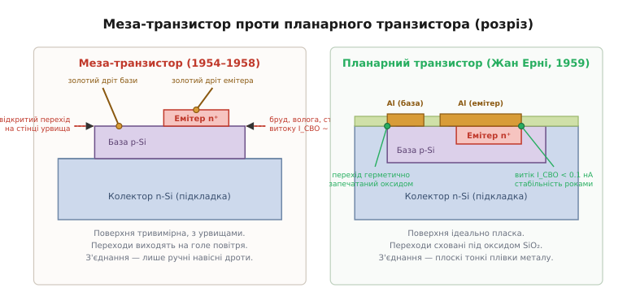
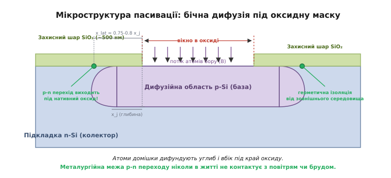
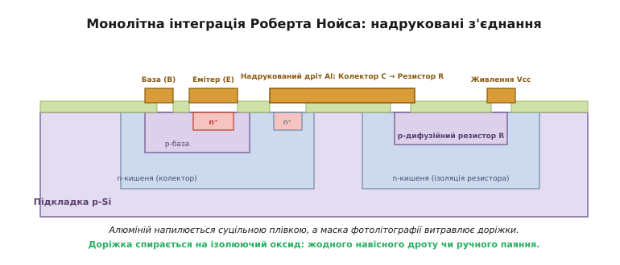
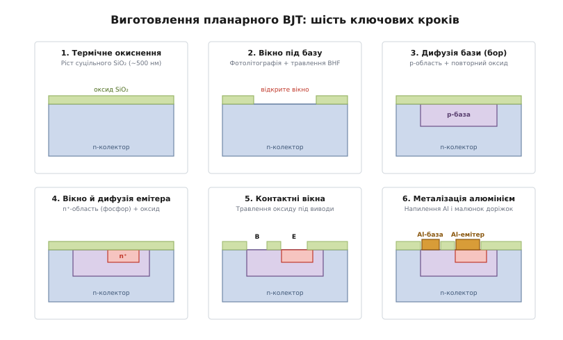

# Планарний процес

<preknowlist>
- [p-n перехід](root:ph-condensed/pn-junction) — як працює контакт напівпровідників p- та n-типу, звідки береться збіднена область і як виникає зворотний струм витоку.
- [Легування напівпровідників](root:ph-condensed/doping) — як домішки бору та фосфору створюють діркову та електронну провідність у кристалічній ґратці кремнію.
- [BJT-транзистори](root:hw-components/bjt) — тришарова структура емітер-база-колектор та принцип підсилення струму біполярним транзистором.
- [Фотолітографія](root:hw-components/photolithography) — як світло через фотомаску переносить малюнок на фоторезист для локального захисту поверхні.
</preknowlist>

Наприкінці 1950-х років розвиток напівпровідникової електроніки вперся в глухий кут, породжений конструкцією тогочасного флагмана індустрії — меза-транзистора. Щоб отримати високу граничну частоту підсилення, інженери навчилися формувати субмікронні базові шари за допомогою газової дифузії, але для електричного розділення сусідніх приладів на пластині доводилося витравлювати глибокі каньйони. Отримані мініатюрні столоподібні пагорби — мези — мали фатальний дефект: металургійна межа найчутливішої зони приладу, колекторного та емітерного p-n переходів, виходила просто на прямовисну бічну стінку кристала. На цій незахищеній поверхні миттєво осідали молекули атмосферної вологи, кисню та частинки виробничого пилу.

Оголений p-n перехід під дією робочої напруги перетворювався на джерело неконтрольованих витоків. Струми зворотного зміщення `I_CBO` непередбачувано зростали з мікроамперів до міліамперів, коефіцієнт підсилення струму плив під час нагрівання, а транзистори масово виходили з ладу в бортових комп'ютерах ракетних комплексів та обчислювальних машин після кількох сотень годин експлуатації. Загальноприйнята практика того часу вимагала повного хімічного змивання плівки діоксиду кремнію (SiO₂), що утворювалася під час дифузії, оскільки оксид вважали «технологічним брудом», який нібито погіршував електричний контакт і вносив сторонні дефекти.

У грудні 1957 року фізик швейцарського походження Жан Ерні (*Jean Hoerni*, 1924–1997), один із співзасновників компанії Fairchild Semiconductor, висунув ідею, що повністю перевернула напівпровідникову інженерію: не змивати термічний діоксид кремнію, а використати його як постійний захисний панцир і водночас як маску для локального введення домішок. Цей винахід отримав назву **планарний процес** (від латинського *planus* — «плоский, рівний»). Завдяки йому транзистор перестав бути тривимірним пагорбом із відкритими ранами на стінках, перетворившись на пласку монокристалічну пластину, у якій усі p-n переходи герметично сховані під нативним шаром скла, а з'єднання сформовані тонкою плівкою металу по поверхні ізолятора.


*Конструктивне зіставлення меза-транзистора та планарної структури в розрізі. У меза-приладі p-n переходи оголені на стінках витравленого пагорба і піддаються впливу атмосфери; з'єднання здійснюються тонкими золотими дротами. У планарному транзисторі вся поверхня захищена шаром оксиду SiO₂, під яким герметично запечатані виходи переходів, а контакти формуються напиленням пласкої металевої плівки крізь відкриті вікна.*

---

## Анатомія меза-кризи: чому відкритий кристал приречений

Щоб оцінити масштаб прориву Ерні, необхідно розглянути мікрофізику процесів, що відбуваються на незахищеній поверхні напівпровідника. У глибині монокристала кремнію кожен атом оточений чотирма сусідами у правильній тетраедричній ґратці алмазного типу, утворюючи міцні ковалентні зв'язки. Проте на поверхні, утвореній механічним різанням або хімічним травленням кислотами, періодична структура різко обривається.

У місці обриву виникають ненасичені валентні орбіталі — **обірвані зв'язки** (*dangling bonds*). На одному квадратному сантиметрі чистої поверхні кремнію зосереджено близько `10¹⁵` таких обірваних зв'язків. У забороненій зоні напівпровідника вони створюють неперервний спектр локалізованих енергетичних станів із високою густиною (`D_it ≈ 10¹³...10¹⁴ см⁻²·еВ⁻¹`), так званих поверхневих станів Тамма–Шоклі.

```
       Голий кремній (меза-урвище)              Кремній під нативним SiO₂ (планар)
       
       H₂O   Na⁺    O₂    Бруд                     O     O     O     O   (аморфна
        │     │     │      │                        ╲   ╱ ╲   ╱ ╲   ╱     сітка
       ─┴─────┴─────┴──────┴─                      ──Si────Si────Si──     кварцу)
       •   •   •   •   •   •  (обірвані              │     │     │   (міцні зв'язки
       │   │   │   │   │   │   зв'язки)              │     │     │    Si-O-Si)
      ─Si──Si──Si──Si──Si──Si─                      ─Si────Si────Si──
       │   │   │   │   │   │                     (монокристал кремнію, D_it < 10¹⁰)
```

Ці поверхневі стани діють як високоефективні пастки та центри рекомбінації–генерації носіїв струму. Коли на таку поверхню потрапляє молекула води з навколишнього повітря, вона поляризується й адсорбується. За наявності мікродомішок солей лужних металів (насамперед натрію Na⁺, який є всюдисущим у виробничому середовищі) на поверхні виникає потужний позитивний заряд. Цей заряд притягує електрони з глибини напівпровідника p-типу (бази) до поверхні, формуючи так званий **інверсійний канал** n-типу.

У результаті між колектором (n-тип) та емітером (n-тип) поверх бази утворюється паразитичний тонкий місток електронної провідності. Струм починає текти не через об'єм транзистора під керуванням базового виводу, а навпростець по брудній бічній стінці мези. Спроби вирішити проблему «герметизацією» — пакуванням кристалів у дорогі металеві баночки TO-5, заварені в атмосфері сухого азоту, — давали лише тимчасовий ефект: залишкові гази та мікроскопічні струмопровідні лусочки припою все одно призводили до відмов. Детальне зіставлення топології та параметрів ранніх напівпровідникових структур наведено у вставці про [еволюцію транзисторних архітектур від сплавних до планарних](root:hw-components/planar-process/comp-mesa-vs-planar.md).

---

## Кремній та його нативний діоксид: термодинаміка успіху

Порятунок прийшов із фізичної властивості, яка відрізняє кремній від германію. Германій утворює діоксид GeO₂, який розчиняється у воді, випаровується вже за температури близько 700 °C і має дефектну пористу структуру. Натомість кремній під час нагрівання в кисневому середовищі вкривається плівкою діоксиду кремнію (SiO₂) — скла надзвичайної термодинамічної та механічної стабільності.

Діоксид кремнію має низку визначних фізико-хімічних параметрів:
* **Широка заборонена зона:** близько `9.0 еВ` (ідеальний діелектрик із питомим опором понад `10¹⁶ Ом·см`).
* **Висока електрична міцність на пробій:** до `10 МВ/см` (плівка товщиною всього 100 нм витримує напругу до 100 В).
* **Аморфна структура:** просторова сітка тетраедрів `SiO₄`, з'єднаних через атоми кисню під кутами 120–180°, утворює суцільне безпористе скло без міжкристалічних меж, крізь які міг би просочуватися бруд.
* **Хімічна інертність:** SiO₂ не реагує з водою, розчиняється лише у фтороводневій (плавиковій) кислоті HF і витримує нагрівання до 1400 °C.

### Хімія процесу та заглиблення фронту окиснення

Термічне окиснення кремнію проводять у кварцових трубчастих печах за температур 900–1200 °C. Залежно від окиснювального середовища розрізняють два типи реакцій:

1. **Сухе окиснення** (у потоці чистого газу O₂):
```
Si + O₂ → SiO₂
```
2. **Вологе окиснення** (у потоці водяної пари H₂O або спаленого водню в кисні H₂ + O₂):
```
Si + 2H₂O → SiO₂ + 2H₂
```

Фундаментальна кінетична особливість процесу полягає в тому, що реакція відбувається не на зовнішній поверхні скла, а **на внутрішній межі поділу Si–SiO₂**. Кисень дифундує крізь уже утворений шар оксиду і вступає в реакцію з непорушеними атомами підкладки.

```
       Початковий рівень кремнію        ═════════════════════════════════════  ▲
                                        ▲                                      │
                                        │  56% товщини оксиду                  │
                                        │  росте вгору (розширення)            │ Повна
                                        ▼                                      │ товщина
       Початкова поверхня Si            ─────────────────────────────────────  │ оксиду
                                        ▲                                      │ x_ox
                                        │  44% товщини оксиду                  │
                                        │  в'їдається вглиб кремнію            ▼
       Новий фронт реакції Si-SiO₂      ─────────────────────────────────────
```

Густина монокристалічного кремнію становить `2.33 г/см³` (концентрація атомів кремнію `N_Si ≈ 5.0 · 10²² см⁻³`), тоді як густина аморфного термічного оксиду SiO₂ становить `2.21 г/см³` (концентрація молекул `N_ox ≈ 2.2 · 10²² см⁻³`). Щоб утворити одну молекулу SiO₂, потрібно забрати один атом кремнію з кристала, але об'єм, який займе молекула оксиду, у `2.27` раза перевищує об'єм вихідного атома кремнію.

Звідси випливає золота пропорція термічного окиснення:
* **44% товщини** новоутвореного шару SiO₂ виростає **за рахунок споживання об'єму кремнію** під початковою поверхнею.
* **56% товщини** шару оксиду **збільшує об'єм уверх**, піднімаючись над вихідним рівнем пластини.

Це означає, що фронт утворення діелектрика постійно занурюється в незаймані, ідеально чисті глибини монокристала. Усі попередні поверхневі дефекти, подряпини та мікрозабруднення повністю поглинаються і розчиняються в товщі оксиду, а межа між напівпровідником і діелектриком формується атом за атомом в абсолютно стерильних умовах безпосередньо під час високотемпературного росту. Математичний апарат дифузії та виведення лінійно-параболічного закону росту детально викладено у вставці про [кінетику термічного окиснення за моделлю Діла-Гроува](root:hw-components/planar-process/math-deal-grove.md).

---

## Маскувальна здатність SiO₂: бар'єр проти домішок

Другим стовпом планарного процесу стала здатність діоксиду кремнію зупиняти дифузію легуючих домішок за температур понад 1000 °C.

Коли кремнієву пластину нагрівають в атмосфері пари сполук бору (наприклад, триброміду бору BBr₃) або фосфору (хлороксиду фосфору POCl₃), атоми домішки починають рухатися всередину матеріалу. Проте швидкість цього руху в кристалічному кремнії та в сітці діоксиду кремнію різниться на багато порядків:

```
Домішка   │ Коефіцієнт дифузії в Si (1100 °C) │ Коефіцієнт дифузії в SiO₂ (1100 °C) │ Відношення D_Si / D_ox
──────────┼───────────────────────────────────┼─────────────────────────────────────┼─────────────────────────
Бор (B)   │ 1.5 · 10⁻¹² см²/с                 │ 2.0 · 10⁻¹⁵ см²/с                   │ ~750 разів повільніше
Фосфор (P)│ 2.0 · 10⁻¹² см²/с                 │ 1.0 · 10⁻¹⁵ см²/с                   │ ~2000 разів повільніше
Миш'як(As)│ 8.0 · 10⁻¹³ см²/с                 │ 1.2 · 10⁻¹⁶ см²/с                   │ ~6500 разів повільніше
```

У щільній просторовій сітці аморфного кварцу атоми тривалентного бору та п'ятивалентного фосфору намертво зв'язуються атомами кисню, утворюючи тугоплавкі боросилікатні та фосфоросилікатні стекла, які практично заморожують подальше просування домішки.

```
                  Газова фаза: атоми домішки (бор / фосфор)
                     ↓   ↓   ↓   ↓   ↓   ↓   ↓   ↓   ↓   ↓
             ┌─────────────────┐               ┌─────────────────┐
  Шар SiO₂   │ Маска оксиду    │  ВІДКРИТЕ     │ Маска оксиду    │
 (~500 нм)   │ блокує домішку  │  ВІКНО        │ блокує домішку  │
             └─────────────────┘               └─────────────────┘
  ─────────────────────────────────┐       ┌──────────────────────  Поверхня Si
                                   │       │
  Кремнієва підкладка              │  x_j  │   Дифузійна кишеня
                                   └───┬───┘   (p-база або n⁺-емітер)
                                       ▼
```

Якщо на пластині виростити шар SiO₂ товщиною всього `0.3–0.6 мкм` (300–600 нм) і прорізати в ньому отвори (вікна), то під час прожарювання в печі домішка проникне в кремній **тільки крізь відкриті вікна**. Решта пластини залишиться надійно заблокованою оксидним щитом.

Для відкриття вікон Ерні використав [фотолітографію](root:hw-components/photolithography) (від грецького *lithos* — камінь та *graphein* — писати):
1. На оксидовану пластину накапують рідкий світлочутливий полімер — **фоторезист**, і розкручують пластину на центрифузі до утворення рівномірної плівки товщиною ~1 мкм.
2. Крізь скляний фотошаблон із непрозорим малюнком пластину опромінюють ультрафіолетовим світлом.
3. Проявник змиває засвічені (або незасвічені) ділянки полімеру, оголюючи оксид у строго визначених координатах.
4. Пластину занурюють у буферизований розчин плавикової кислоти (**BHF** або BOE — суміш `NH₄F` та `HF` у співвідношенні 6:1 або 7:1). Фтороводнева кислота розчиняє діоксид кремнію за реакцією:
```
SiO₂ + 6HF → H₂SiF₆ + 2H₂O
```
Ця реакція має колосальну селективність: BHF жадібно розчиняє оксид зі швидкістю ~100 нм/хв, але практично не чіпає чистий кремній під ним (селективність травлення перевищує 100:1).
5. Залишки фоторезисту змивають розчинниками. На пластині залишається ідеальна оксидна маска з мікроскопічними вікнами під майбутні структури.

---

## Механізм самопасивації під захисним склом

Найгеніальніший фізичний наслідок планарної дифузії полягає в явищі **бічного розповзання домішки під маску**.

Дифузія атомів у твердому тілі є ненапрямленим, ізотропним процесом: атоми рухаються хаотично внаслідок теплових коливань кристалічної ґратки. Тому, проникаючи крізь відкрите вікно маски вглиб кремнію на глибину залягання `x_j`, домішка одночасно розповзається і **вбік під край оксидного шару** на відстань:

```
x_lat ≈ 0.75...0.80 · x_j
```


*Мікроструктура пасивації: завдяки ізотропній дифузії фронт домішки заходить під край оксидної маски. Металургійна межа p-n переходу виходить на поверхню кристала суворо під захисним шаром SiO₂, ніколи в процесі виробництва чи роботи не торкаючись навколишнього середовища.*

Це означає, що металургійна межа p-n переходу (місце, де концентрація акцепторів дорівнює концентрації донорів) піднімається до поверхні кремнію **глибоко під захисним шаром діоксиду кремнію**, на відстані кількох десятих мікрона від краю протравленого вікна.

Виникає ефект повної **пасивації** (від латинського *passivare* — «робити нерухомим, бездіяльним»):
* Межа переходу **ніколи в житті** не контактує з навколишнім повітрям, пилом чи цеховими хімікатами.
* Вона народжується під нативним оксидом у печі за 1000 °C і залишається запечатаною ним назавжди.
* Обірвані зв'язки кремнію на поверхні ковалентно замкнені атомами кисню сітки SiO₂; густина пасток `D_it` падає нижче `10¹⁰ см⁻²·еВ⁻¹`.
* Зворотний струм витоку колектора `I_CBO` падає з типових для меза-транзисторів значень `1000–10000 нА` до фантастичних для 1959 року величин **`0.01–0.1 нА`** (менше 100 пікоамперів!).
* Струми витоку перестають залежати від вологості й тиску навколишнього середовища, а час безвідмовної роботи приладів зростає з тисяч до мільйонів годин.

---

## Від планарного транзистора до інтегральної схеми Нойса

Створення планарного транзистора розв'язало не лише проблему надійності. Воно несподівано усунуло головний бар'єр на шляху до створення монолітної інтегральної схеми — проблему міжкомпонентних з'єднань.

Перша в історії мікросхема Джека Кілбі (вересень 1958 року, Texas Instruments) була зліплена на бруску германію, але окремі компоненти з'єднувалися між собою тонкими навісними золотими дротиками. Кожен дротик оператор мусив вручну припаювати під мікроскопом. Для схеми з кількох транзисторів це працювало; випустити в такий спосіб чип із сотнями елементів було неможливо — наставала «тиранія чисел» (*tyranny of numbers*).

Співзасновник Fairchild Роберт Нойс (*Robert Noyce*, 1927–1990) у січні 1959 року зрозумів: планарний процес Жана Ерні дає готову плоску діелектричну платформу. Оскільки вся пластина вже вкрита рівним шаром ізолюючого скла SiO₂, поверх цього скла можна нанести металеві доріжки, які з'єднають будь-які транзистори між собою без жодного ручного дротика.


*Конструкція монолітної інтегральної схеми за патентом Роберта Нойса. Завдяки ізолюючому шару SiO₂ алюмінієві доріжки напилюються суцільною плівкою та формуються фотолітографією просто по поверхні кристала, сполучаючи ізольовані компоненти (транзистори, резистори) у спільну функціональну схему.*

Технологічний стрибок Нойса спирався на три фізичні принципи:
1. **Планарна ізоляція:** діоксид кремнію слугує надійним підкладковим ізолятором для провідників; паразитична ємність і витоки на кремній зведені до мінімуму.
2. **Тонкоплівкова металізація алюмінієм:** алюміній (Al) випаровують у вакуумі (або розпилюють плазмою). Він осідає на всю поверхню пластини суцільною плівкою товщиною ~1 мкм. Потім за допомогою фотолітографії та хімічного травлення кислотою зайвий алюміній видаляють, залишаючи складну мережу тонких з'єднувальних шин і контактних майданчиків.
3. **Омічні контакти через вікна:** у місцях, де метал повинен торкнутися кремнію, в оксиді попередньо витравлюють контактні вікна. Під час фінального прогріву пластини за температури ~450 °C (процес спікання, або *sintering*) алюміній вступає в твердофазну реакцію з кремнієм, відновлюючи залишкові сліди оксиду:
```
4Al + 3SiO₂ → 2Al₂O₃ + 3Si
```
Ця реакція гарантує бездоганний низькоомний нелінійний електричний контакт без замикання сусідніх ділянок.

У поєднанні з ідеєю Курта Леговця про ізоляцію сусідніх компонентів на кристалі за допомогою зворотно зміщених [p-n переходів](root:hw-components/pn-isolation), планарна концепція Ерні та металізація Нойса створили класичну **монолітну інтегральну схему**, яка без принципових змін виробляється світовою індустрією донині.

---

## Фізика двостадійного легування: загонка та розгонка домішки

Введення легуючих домішок крізь вікна в оксиді здійснювалося не за один прийом, а за строго розділеним **двостадійним дифузійним процесом** (*two-step diffusion*), розробленим для незалежного контролю поверхневої концентрації та глибини залягання p-n переходу.

```
       1. Загонка (Pre-deposition)              2. Розгонка (Drive-in)
       Низька T (900–950 °C), джерело газу       Висока T (1100–1200 °C), чистий O₂
       
       Концентрація C(x)                         Концентрація C(x)
       C_s ───┐                                  C_s ───┐
              │  Нескінченне джерело                    ╲  Скінченне джерело Q
              │  Профіль erfc                            ╲  Профіль Гауса
              └───┐                                       └───┐
                  └───► Глибина x                             └───► Глибина x
```

### Стадія 1: Загонка домішки (*Pre-deposition / Predep*)
Пластину поміщають у піч за відносно низької температури (900–950 °C) у постійному потоці газу-носія з парою леткої сполуки домішки (BBr₃ для бору або POCl₃ для фосфору). На поверхні відкритого кремнію утворюється рідка плівка фосфоро- чи боросилікатного скла, яка підтримує граничну концентрацію домішки `C_s`, рівну максимальній твердій розчинності елемента в кремнії за даної температури (`10²⁰...10²¹ см⁻³`).

Цей процес описується дифузією з **нескінченного постійного джерела** (*constant source diffusion*). Розподіл концентрації домішки `C(x, t)` підпорядковується додатковій функції помилок:

```
C(x, t) = C_s · erfc(x / (2 · √(D_1 · t_1)))
```

де `D_1` — коефіцієнт дифузії за температури загонки, `t_1` — тривалість стадії, а `erfc(u)` — інтеграл Гауса помилок.

Головний результат загонки — це не глибина (шар виходить надзвичайно мілким, менше 0.2 мкм), а **введена доза домішки** `Q` (повна кількість атомів на квадратний сантиметр поверхні), яку визначають інтегруванням профілю:

```
Q = ∫[0 → ∞] C(x, t_1) dx = 2 · C_s · √(D_1 · t_1 / π)
```

Регулюючи температуру печі (яка задає розчинність `C_s`) та час `t_1`, інженер з високою точністю вводить у кремній строго задану кількість атомів домішки `Q`.

### Стадія 2: Розгонка домішки (*Drive-in*)
Подачу газу з домішкою вимикають, залишки рідкого скла на поверхні стравлюють, і пластину завантажують у другу піч із вищою температурою (1100–1200 °C) в атмосфері чистого кисню або пари.

Тепер джерело домішки відсутнє, а раніше введена доза `Q` розсіюється вглиб кристала. Це дифузія зі **скінченного миттєвого джерела** (*limited source diffusion*). Розподіл концентрації трансформується у класичний розподіл Гауса:

```
C(x, t) = (Q / √(π · D_2 · t_2)) · exp(-x² / (4 · D_2 · t_2))
```

де `D_2 · t_2` — дифузійний фактор розгонки (`D_2 ≫ D_1`).

Одночасно з розгонкою кисень у печі окиснює поверхню кремнію у відкритому вікні, нарощуючи свіжий шар діоксиду кремнію. Вікно повністю заростає оксидом, готуючи пластину до наступного літографічного кроку.

Двостадійний підхід розв'язав головну проблему старого одностадійного сплавлення:
* **Товщина бази регулюється часом і температурою:** за високої швидкості контролю можна отримати базовий шар товщиною `W_b = x_j_base - x_j_emit` усього `0.2–0.5 мкм` із відтворюваністю до сотих часток мікрона.
* **Гладенький градієнт концентрації:** гаусів профіль створює плавний внутрішній градієнт поля у базі (*built-in drift field*), який підганяє інжектовані електрони від емітера до колектора, підвищуючи частоту зрізу транзистора `f_T` до сотень мегагерців.

---

## Епітаксійно-планарний прорив: боротьба з опором колектора

Перші планарні транзистори мали одну внутрішню суперечність у колекторній області. Щоб транзистор витримував високу напругу колектор–база (наприклад, `BV_CBO > 50–100 В`), кремнієва підкладка мусила мати низьку концентрацію домішки (високий питомий опір `ρ ≈ 2–10 Ом·см`). Проте пластина мала товщину 300–400 мкм для механічної міцності, і струм колектора, протікаючи крізь усю товщу слаболегованого кремнію до нижнього контакту, зустрічав значний паразитичний опір `R_CS`.

Через високий `R_CS` напруга насичення колектор-емітер `V_CE(sat)` була неприпустимо великою (1–2 В), транзистор сильно грівся у ключовому режимі та повільно виходив із насичення.

```
   Звичайний планарний BJT (1959)             Епітаксійно-планарний BJT (1960)
   
     База      Емітер                           База      Емітер
     ┌──┐      ┌──┐                             ┌──┐      ┌──┐
   ══╧══╧══════╧══╧═══ SiO₂                   ══╧══╧══════╧══╧═══ SiO₂
       p-база    n⁺                                 p-база    n⁺
   ───────────────────                        ───────────────────  Тонкий шар n-епі
   Слаболегована підкладка n-Si               Слаболегований n-епі (10 мкм, висока U)
   (високий опір R_CS, V_CE(sat) > 1.5 В)     ───────────────────────────────────────
                                              Високолегована підкладка n⁺-Si
                                              (наднизький опір R_CS, V_CE(sat) < 0.2 В)
```

У 1960 році Бернард Мерфі та інженери Fairchild об'єднали планарний процес із **газофазною епітаксією** (*epitaxy* — від грецького *epi* «над» та *taxis* «порядок»).

Замість однорідної підкладки почали використовувати двошарову структуру:
1. Товста несуча монокристалічна підкладка з надвисоким рівнем легування (n⁺-тип, `ρ < 0.005 Ом·см`), яка має майже металеву провідність і зводить опір тіла кристала практично до нуля.
2. Вирощений на ній тонкий (5–15 мкм) монокристалічний епітаксійний шар слаболегованого кремнію (n-тип, `ρ ≈ 1–5 Ом·см`) з бездоганно впорядкованою кристалічною ґраткою.

Планарний транзистор формували всередині тонкого епітаксійного шару. Висока напруга пробою забезпечувалася слаболегованим епітаксійним шаром навколо колекторного переходу, а струм колектора, пройшовши всього 5–10 мкм епітаксії, потрапляв у надпровідну n⁺-підкладку. Напруга насичення `V_CE(sat)` впала нижче `0.2 В`, що дозволило створювати швидкодіючі цифрові мікросхеми насиченої логіки (DTL та TTL).

---

## Контроль якості та електрофізичні вимірювання на пластині

Впровадження планарного процесу зажадало принципово нових методів діагностики, оскільки контролювати структури під захисним оксидом за допомогою оптичного мікроскопа було неможливо. Для перевірки фізичних параметрів шарів на краю кожної робочої пластини виділяли спеціальні тестові майданчики — скрайб-лінії (*test chips / scribe lines*):

```
       Чотиризондовий метод                Структура Кельвіна (контактний опір)
       (опір шару R_sheet)                 
                                                I_force ──┐       ┌── V_sense(+)
        I+     V+     V-     I-                           │       │
        ▼      ▼      ▼      ▼                         ┌──▼───────▼──┐
       ─┴──────┴──────┴──────┴─                        │  Метал Al   │
       ▒▒▒▒▒▒▒▒▒▒▒▒▒▒▒▒▒▒▒▒▒▒▒▒ Дифузійний шар        ┌┴─────────────┴┐
       ──────────────────────── Підкладка             │  Вікно в SiO₂ │
                                                      ├───────────────┤
                                                      │  Кремній n⁺   │
                                                      └───────────────┘
```

### 1. Чотиризондовий метод і структура Ван дер Пау (*Sheet Resistance*)
Поверхневий опір дифузійних шарів `R_sheet` (вимірюється в Омах на квадрат, Ом/□) контролюють чотиризондовим методом: чотири голчасті контакти опускають на поверхню в одну лінію. Через крайні зонди пропускають калібрований струм `I`, а на внутрішніх вимірюють спад напруги `V`:

```
R_sheet = (π / ln 2) · (V / I) ≈ 4.532 · (V / I)
```

Для вимірювання на мікроструктурах використовують інтегровані тестові хрести Ван дер Пау (*van der Pauw cross*), які формуються фотолітографією в тому самому циклі, що й транзистори.

### 2. Структури Кельвіна (*Contact Resistance*)
Перехідний опір між алюмінієвою плівкою та дифузійним кремнієм у контактному вікні вимірюють за чотирипровідною схемою Кельвіна. Струмова лінія (*force*) та вимірювальна лінія напруги (*sense*) розведені на окремі металеві доріжки, що виключає вплив власного опору підвідних провідників і дає чистий питомий контактний опір `ρ_c` (типово менше `10⁻⁶ Ом·см²`).

### 3. Вольт-фарадний аналіз (C-V метод)
Якість межі поділу Si–SiO₂ та густину поверхневих станів контролюють вимірюванням високочастотної ємності тестової структури метал–оксид–напівпровідник (МОН-конденсатор). Зсув експериментальної C-V кривої відносно теоретичної ідеальної прямо вказує на наявність рухливих іонів натрію `Q_m` та фіксованого заряду в оксиді `Q_f`:

```
ΔV_FB = -(Q_f + Q_m) / C_ox
```

де `V_FB` — напруга плоских зон (*flat-band voltage*), а `C_ox = ε_ox / x_ox` — питома ємність оксиду. Це дозволяє забракувати пластину з надлишковим забрудненням ще до початку дорогих металізаційних операцій.

Розглянемо покроковий маршрут виготовлення класичного біполярного n-p-n транзистора за планарною технологією:


*Шість базових етапів планарного виробничого циклу: 1 — первинне термічне окиснення; 2 — фотолітографія та розтин вікна бази; 3 — дифузія бору та відновлення захисного оксиду; 4 — розтин вікна емітера та дифузія фосфору; 5 — травлення контактних вікон; 6 — вакуумна металізація алюмінієм.*

```
Етап маршруту                 │ Фізико-хімічна операція                         │ Технологічні параметри
──────────────────────────────┼─────────────────────────────────────────────────┼─────────────────────────────────
1. Вихідна підкладка          │ Монокристалічна пластина n-Si (100)/(111),      │ Питомий опір ρ ≈ 1–5 Ом·см,
                              │ легована фосфором (майбутній колектор)          │ товщина пластини 300–500 мкм
──────────────────────────────┼─────────────────────────────────────────────────┼─────────────────────────────────
2. Первинне окиснення         │ Вологе/сухе термічне окиснення в кварцовій печі │ T = 1050 °C, товщина SiO₂
                              │ для створення маскувального діелектрика         │ x_ox ≈ 0.5–0.6 мкм (500–600 нм)
──────────────────────────────┼─────────────────────────────────────────────────┼─────────────────────────────────
3. Літографія 1: вікно бази   │ Нанесення фоторезисту, експонування через       │ Травлення в BHF (NH₄F : HF = 7:1)
                              │ фотомаску 1, проявлення, селективне травлення   │ до повного відкриття кремнію
──────────────────────────────┼─────────────────────────────────────────────────┼─────────────────────────────────
4. Дифузія бази (p-тип)       │ Загонка бору (BBr₃/B₂H₆) + розгонка в окисню-   │ T = 1100 °C, глибина x_j_base ≈
                              │ вальній атмосфері з нарощуванням свіжого оксиду │ 2–3 мкм, поверхня відновлена оксидом
──────────────────────────────┼─────────────────────────────────────────────────┼─────────────────────────────────
5. Літографія 2: вікно емітера│ Повторне нанесення фоторезисту, суміщення       │ Розтин меншого вікна всередині
                              │ фотомаски 2, експонування, травлення в BHF      │ раніше сформованої p-бази
──────────────────────────────┼─────────────────────────────────────────────────┼─────────────────────────────────
6. Дифузія емітера (n⁺-тип)   │ Висококонцентраційна дифузія фосфору (POCl₃)   │ T = 1000 °C, глибина x_j_emit ≈
                              │ з одночасним вирощуванням фінального оксиду     │ 1.0–1.5 мкм (товщина бази W_b < 1 мкм)
──────────────────────────────┼─────────────────────────────────────────────────┼─────────────────────────────────
7. Літографія 3: контакти     │ Фотомаска 3: прорізання контактних вікон до     │ BHF травлення крізь тонкий
                              │ емітера (E) та бази (B); колекторний контакт    │ фінальний оксид до кремнію
──────────────────────────────┼─────────────────────────────────────────────────┼─────────────────────────────────
8. Нанесення металу           │ Вакуумне термічне випаровування або магнетронне │ Шар чистого алюмінію Al
                              │ осадження тонкої плівки алюмінію                │ товщиною d_met ≈ 0.8–1.2 мкм
──────────────────────────────┼─────────────────────────────────────────────────┼─────────────────────────────────
9. Літографія 4: розводка     │ Фотомаска 4: фотолітографія по металу,          │ Травлення в розчині H₃PO₄ + HNO₃
                              │ витравлювання форми доріжок і контактних шин    │ при 40–50 °C до оксиду
──────────────────────────────┼─────────────────────────────────────────────────┼─────────────────────────────────
10. Спікання (Sintering)      │ Термічний відпал у формувальному газі           │ T = 450 °C, час 15–30 хв;
                              │ (суміш N₂ + H₂, 9:1)                            │ утворення омічних контактів
```

Завдяки тому, що кожен дифузійний крок супроводжується повторним термічним окисненням, вікна попереднього етапу автоматично заростають новим надійним шаром діоксиду кремнію. До кінця процесу пластина підходить повністю запакованою в захисну оксидну броню.

---

## Фізичні крайові ефекти, пастки та межі застосування

Попри революційну простоту, планарна технологія натрапила на низку тонких фізичних обмежень, подолання яких визначило розвиток сучасного напівпровідникового матеріалознавства.

### 1. Алюмінієвий спайкінг (*Aluminium Spiking*) та евтектична пастка
Під час фінального спікання контактів за температури 450 °C алюміній і кремній утворюють просту евтектичну систему з евтектичною точкою 577 °C. Проте вже за 450 °C розчинність кремнію у твердому алюмінії становить близько `1.5 ат.%`.

```
                  Контактне вікно в SiO₂
               ┌───────────────────────────┐
               │    Алюмінієва шина (Al)   │
      ─────────┘                           └─────────  Шар SiO₂
      ──────────────────┐         ┌──────────────────  Поверхня кремнію
        n⁺-емітер       │  \   /  │  ← Кремній розчиняється в Al
       (глибина 0.3 мкм)│   \ /   │
      ──────────────────┼────▼────┼──────────────────  Межа переходу емітер-база
        p-база          │  Алюмі- │  ← СПАЙК ПРОБИВАЄ ПЕРЕХІД І
                        │  нієвий │     РОБИТЬ КОРОТКЕ ЗАМИКАННЯ!
                        │  шип    │
```

Атоми кремнію з контактного вікна починають жадібно дифундувати у плівку алюмінію, рухаючись уздовж міжкристалічних меж металу. На місці видалених атомів кремнію в підкладці утворюються мікроскопічні порожнини (каверни), які миттєво заповнюються алюмінієм. Утворюються гострі клиноподібні металеві голки — **спайки** (*spikes*), що проростають углиб кремнію на глибину до 0.5–1 мкм. Якщо глибина залягання емітерного переходу `x_j` менша за довжину спайка, алюмінієвий шип протикає перехід наскрізь, роблячи коротке замикання між емітером і базою.

**Інженерне розв'язання:**
* Додавання до алюмінію кремнію ще на етапі напилення: використання сплаву **Al–Si (1–2% Si)**. Метал насичується кремнієм наперед і більше не розчиняє підкладку.
* Введення тугоплавких проміжних **дифузійних бар'єрів** (плівки нітриду титану TiN або сплаву титан-вольфрам TiW), які повністю блокують прямий контакт алюмінію з кремнієм.

### 2. Дрейф рухливих лужних іонів (Na⁺, K⁺)
Найпідступнішим джерелом нестабільності перших планарних схем були іони лужних металів, насамперед натрію `Na⁺`. Натрій присутній у мікроскопічних дозах у кварцових трубах, хімічних реактивах і навіть у поті на пальцях інженерів.

Маючи малий іонний радіус, позитивні іони Na⁺ легко протискуються крізь пухку аморфну сітку тетраедрів SiO₂. Під дією постійної електричної напруги приладу та підвищеної температури (наприклад, +125 °C) іони Na⁺ дрейфують крізь товщу оксиду і накопичуються на межі Si–SiO₂. Їхній сумарний позитивний заряд інвертує тип провідності приповерхневого кремнію p-типу, створюючи неконтрольовані паразитні канали витоку та зсуваючи порогові напруги польових транзисторів.

**Інженерне розв'язання:**
* **Хлорне окиснення:** додавання в печі до кисню 1–3% хлористого водню (HCl) або 1,1,1-трихлоретану (TCA). Атоми хлору зв'язують іони натрію у леткі та нерухомі комплекси NaCl на зовнішній поверхні оксиду.
* **Пасивація фосфорно-силікатним склом (PSG):** осадження тонкого шару оксиду, легованого фосфором (P₂O₅), який незворотно захоплює («геттерує») іони лужних металів у свої структурні пастки.

### 3. Сегрегація та перерозподіл домішок на фронті росту оксиду
Коли оксид росте вглиб кремнію, легуючі домішки по-різному розподіляються між фазою SiO₂ та чистим Si. Це явище описують коефіцієнтом рівноважного розподілу (сегрегації) `m = C_Si / C_ox`:

* **Бор (B):** має `m ≈ 0.3 < 1`. Бор охочіше розчиняється в оксиді, ніж у кремнії. Шар оксиду під час росту «висмоктує» бор із поверхні підкладки, зменшуючи його концентрацію на межі в 2–3 рази (*depletion effect*). Це небажано збільшує питомий опір бази.
* **Фосфор (P), Миш'як (As), Стибій (Sb):** мають `m ≈ 10...20 > 1`. Оксид відштовхує ці домішки назад у кремній. На межі поділу виникає зона значного локального збагачення (*pile-up effect*).

Ці ефекти інженери враховують під час розрахунку тривалості термічних операцій, використовуючи комп'ютерне моделювання технологічних процесів (TCAD).

### 4. Термомеханічні напруження через різницю КТР
Коефіцієнт теплового розширення (КТР) кремнію становить `α_Si ≈ 2.6 · 10⁻⁶ K⁻¹`, тоді як для плавленого діоксиду кремнію він дорівнює всього `α_ox ≈ 0.5 · 10⁻⁶ K⁻¹`.

Коли пластину охолоджують від температури окиснення 1000 °C до кімнатної 20 °C, монокристалічний кремній стискається значно сильніше, ніж шар оксиду на ньому. У плівці SiO₂ виникають гігантські механічні напруження стиску (близько `300 МПа`), які згинають пластину сферичним куполом. На великих пластинах діаметром 300 мм це викликає розфокусування оптичних систем фотолітографії, що вимагає точного симетричного вирощування оксидних шарів на обох боках пластини для компенсації напружень.

---

## Спадщина винаходу: основа наноелектроніки

Планарний процес став поворотним пунктом в історії цивілізації. Він перетворив виготовлення електронних компонентів із ювелірного ремесла ручного збирання окремих деталей на фотолітографічний процес групового друку мільйонів і мільярдів приладів одночасно на спільній кремнієвій пластині.

```
       1959: Планарний BJT              1970–2000-ні: Планарний MOSFET         2010+: FinFET і Nanosheet
       
         Al        Al                             Затвор (полікремній)               Тривимірні планарні
        ┌──┐      ┌──┐                           ┌───────────┐                       ребра з атомним шаром
     ═══╧══╧══════╧══╧═══ SiO₂                ═══╧═══════════╧═══ SiO₂               High-k діелектрика
         ┌──┐                                      n⁺     n⁺
         │n⁺│ емітер                          ────┴──┬───┬──┴────                    (Та сама концепція
      ───┴──┴─────────── p-база                      └───┘ канал                     самопасивованого оксиду
     ─────────────────── n-колектор                  p-підкладка                     й літографічних вікон!)
```

Усі наступні покоління мікроелектронних приладів — від планарних МДН-транзисторів (MOSFET) і технології CMOS до сучасних просторових структур [FinFET](root:hw-components/finfet) і нанострічкових приладів GAA (Gate-All-Around) — є прямим еволюційним розвитком фундаментальних принципів Жана Ерні:
1. Використання нативних діелектричних плівок для пасивації активних зон кристала.
2. Локальне формування геометрії через літографічні маскувальні вікна.
3. Монолітне формування металевої багатоповерхової розводки по ізолюючому шару.

Без оксидного щита Ерні закон Мура зупинився б ще у 1960 році на межі кількох десятків ненадійних меза-транзисторів, а сучасний цифровий світ мікропроцесорів, пам'яті та телекомунікацій залишився б недосяжною фантазією.
