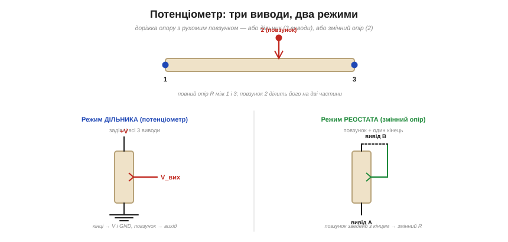

# 🔌 Потенціометр і тример: дільник, який можна крутити

Потенціометр (лат. *potentia* — сила, напруга + гр. *métron* — міра) — це [дільник напруги](topic:hw-analog/voltage-divider) із рухомим відводом: той самий принцип двох плечей, але співвідношення між ними задаєш рукою, повертаючи ручку. Тут — практичний бік цього компонента: які в нього виводи, у яких **режимах** і **корпусах** він буває, що таке **характеристика доріжки** й де чигають граблі.

### Три виводи й два режими


*Усередині — доріжка опору з повним опором R між кінцями 1 і 3 та рухомий повзунок 2. Ліворуч: режим дільника (всі три виводи — кінці на V і GND, повзунок дає V_вих). Праворуч: режим реостата (повзунок зведено з одним кінцем — виходить просто змінний опір).*

Головне, що варто засвоїти, — у потенціометра **три** виводи: два кінці суцільної доріжки опору (між ними завжди повний опір R) і **повзунок** (wiper) — рухомий відвід, що ковзає по доріжці. Уся фізика звідси й випливає: доріжка — це один безперервний резистор, а повзунок ділить його на два плеча. Назвемо їх R_верх (від верхнього кінця до повзунка) і R_низ (від повзунка до нижнього кінця). Оскільки доріжка суцільна, у будь-якому положенні R_верх + R_низ = R — повний опір нікуди не зникає, повзунок лише перерозподіляє його між двома половинами. Саме ця властивість і породжує два режими роботи. А як під'єднати ці три виводи до мікроконтролера — на яку ніжку АЦП заводити повзунок, чому кінці на 3.3 В і що таке ратіометричність — зібрано в [довідці з розпіновки й рівнів](topic:hw-components/potentiometer/api-potentiometer.md).

- **Дільник (потенціометр).** Задіяні **всі три** виводи: кінці доріжки — на живлення й землю, повзунок — вихід. Це й є регульований [дільник напруги](topic:hw-analog/voltage-divider): повзунок стоїть на стику R_верх і R_низ, тому віддає V_вих = V·R_низ/(R_верх+R_низ) = V·R_низ/R. Крутиш ручку — плавно змінюєш співвідношення плечей, а з ним V_вих від 0 до V. Зверни увагу: вихід залежить від **відношення** плечей, а не від абсолютного R. Тому два поти на 10 кОм і 100 кОм у режимі дільника дають однакову криву V_вих — різниця лише в тому, скільки струму вони беруть із джерела.
- **Реостат (змінний опір).** Задіяні лише **два** виводи — повзунок і один кінець. Тепер у грі тільки одне плече, тож виходить не дільник, а просто **регульований опір** від ~0 до R. Зайвий кінець варто **звести з повзунком** (пунктир на рисунку): тоді, якщо повзунок на мить втратить контакт із доріжкою (порох, вібрація, знос), струм піде через зведений кінець, і опір не «вистрибне» в нескінченність — а саме такий стрибок у багатьох схемах означає миттєвий обрив кола.

### Характеристика доріжки й корпуси


*Ліворуч: характеристика доріжки — лінійна (B), де вихід прямо пропорційний повороту, і логарифмічна (A) для гучності. Праворуч: форм-фактори — панельний пот із ручкою, дрібний тример під викрутку та повзунковий фейдер.*

Повзунок ділить опір за положенням — але **як саме** опір розподілений уздовж доріжки, лінійно чи ні, це окрема властивість, **характеристика** (*taper*):

- **Лінійна** (маркування **B**): опір росте рівномірно з кутом повороту, тож вихід прямо пропорційний повороту. Половина обороту — половина опору — половина напруги. Це базовий вибір для вимірювання, керування серводвигуном, завдання порога — скрізь, де хочемо, щоб «середнє положення = середнє значення».
- **Логарифмічна** (**A**, «audio»): опір наростає за приблизно експоненційною кривою вздовж доріжки, тож вихід на перших градусах майже не рухається, а під кінець стрибає. Така крива потрібна для **гучності** — і ось чому.

> 🔧 **Навіщо це.** Логарифмічний пот — не примха, а компенсація фізіології слуху. Без нього регулятор гучності був би непридатний: уся чутна гучність тиснулася б на останню чверть оберту, а перші 80 % ходу здавалися б «мертвими». Розберімо механізм.

Вухо сприймає не саму **інтенсивність** звуку (потужність на одиницю площі, Вт/м²), а її **логарифм**. Це **закон Вебера-Фехнера** (Weber–Fechner law): відчуття росте пропорційно логарифму подразника, бо чутливість рецептора падає тим сильніше, чим сильніший фон — приріст ΔI помічається, лише поки відношення ΔI/I лишається відчутним. Інакше кажучи, щоб гучність зросла «удвічі на слух», інтенсивність треба збільшити приблизно вдесятеро, а не вдвічі. Саме тому гучність міряють у **децибелах** — логарифмічній шкалі:

```text
рівень (дБ) = 10 · log₁₀(I / I₀)

де  I  — інтенсивність звуку (Вт/м²)
    I₀ — поріг чутності (опорна інтенсивність)
```

Тепер з'єднаймо два логарифми. Якщо взяти **лінійний** пот, вихідна напруга (а з нею й електрична потужність на динаміку) росте рівно з кутом. Але вухо стискає цю потужність у логарифм, тож суб'єктивна гучність злетить майже до максимуму вже на першій чверті ходу, а далі ручка «нічого не робить». **Логарифмічний** пот навмисне робить зворотне: на початку ходу віддає мало напруги і нарощує її за експонентою. Експонента доріжки скасовує логарифм вуха — і у висновку **суб'єктивна** гучність росте рівномірно з кутом повороту. Регулятор «відчувається» лінійним саме тому, що його доріжка спеціально нелінійна.

Корпуси теж різні: **панельний** пот із ручкою на передню панель (гучність, яскравість) — поворотний чи повзунковий (**фейдер**); і дрібний **тример** (*trimmer*, *preset*) на плату, який налаштовують **раз** викруткою при калібруванні й більше не чіпають. Поділ не косметичний: панельний розрахований на тисячі обертів пальцями, тример — на десятки дотиків викруткою за все життя, тож у нього коротший хід, фіксація і часто кращий матеріал доріжки. Цей матеріал і визначає якість: дешевий **вуглець** (carbon) шумить і пливе з температурою; стабільний **кермет** (cermet — кераміко-металева суміш) тримає опір при нагріві, тому його ставлять у тримери; тихий **провідний пластик** (conductive plastic) дає гладку доріжку без зерна, тому його беруть в аудіо й там, де повзунок ходить часто; точний **дротяний** (wirewound) намотаний дротом, тож опір росте дискретними **щаблями** — чудова стабільність, але крокова, не плавна регуляція. Окремий клас — **цифровий потенціометр** (digital potentiometer, digipot): мікросхема з ланцюжком резисторів і ключами, де положення «повзунка» задає мікроконтролер по шині (I²C/SPI) замість руки.

### Типові граблі

- **Шум повзунка.** Зношена або забруднена доріжка дає «тріскучий», стрибучий вихід: у місці поганого контакту опір на мить підскакує, і напруга на повзунку смикається. Для звуку це хрипи в гучності, для АЦП — викиди в зчитуванні, які треба або фільтрувати, або усереднювати. Якісні доріжки (провідний пластик) тихіші, бо контакт повзунка по них рівномірніший, без зерна. Як зчитати повзунок кодом і погасити ці викиди усередненням — [робочий приклад для ESP32](topic:hw-components/potentiometer/proj-potentiometer.md).
- **Не навантажуй повзунок.** Як і будь-який [дільник напруги](topic:hw-analog/voltage-divider), пот тримає свою характеристику, лише поки до повзунка приєднано **високоомне** навантаження. Чому — варто розписати з формулою, бо це найпоширеніша помилка. Коли до повзунка чіпляють резистор навантаження R_н, він стає паралельним до нижнього плеча R_низ, і ефективне нижнє плече падає:

```text
R_низ_еф = (R_низ · R_н) / (R_низ + R_н)

V_вих = V · R_низ_еф / (R_верх + R_низ_еф)
```

Поки R_н ≫ R, поправка дрібна й крива майже ідеальна. Але щойно R_н стає сумірним з R, паралель «притягує» нижнє плече вниз, дільник перекошується, і середина шкали провисає — пот перестає бути лінійним. Звідси практичне правило: бери R_н хоча б у 10 разів більше за R пота, або буферуй повзунок операційним підсилювачем-повторювачем.

> 🔧 **Навіщо це.** Найчастіша пастка новачка — завести повзунок 100-кілоомного пота прямо на низькоомний вхід чи на світлодіод. Дільник «попливе», і покази стрибатимуть від навантаження, а не від ручки. Розрахуймо, наскільки.

**Приклад: просідання середини шкали під навантаженням.**
Пот R = 100 кОм у режимі дільника, повзунок рівно посередині, живлення V = 3.3 В (типова шина ESP32). Без навантаження повзунок мав би віддати рівно половину — 1.65 В. Чіпляємо навантаження R_н = 10 кОм (наприклад, вхід із резистивним дільником чи недбало підібраний каскад).

```text
посередині:   R_верх = R_низ = 50 кОм

R_низ_еф = (50k · 10k) / (50k + 10k)
         = 500k² / 60k
         = 8.33 кОм

V_вих = 3.3 · 8.33k / (50k + 8.33k)
      = 3.3 · 8.33k / 58.33k
      = 3.3 · 0.1429
      = 0.47 В
```

Замість очікуваних 1.65 В на повзунку лише 0.47 В — похибка майже 1.2 В, понад дві третини шкали. Якби той самий вихід читав 12-бітний АЦП ESP32 (0…3.3 В → 0…4095), «середина ручки» дала б код ≈ 583 замість 2048. Ось як виглядає правильна перевірка ще на етапі прошивки:

:::tabs
```cpp
// очікуваний код АЦП для середини шкали без навантаження
const float V_supply = 3.3f;
const int   ADC_MAX  = 4095;

int expected = (int)((V_supply * 0.5f / V_supply) * ADC_MAX); // = 2047
int measured = analogRead(POT_PIN);

// велике розходження = повзунок навантажений, треба буфер
if (abs(measured - expected) > 200) {
    // ставимо ОП-повторювач або беремо пот меншого опору
}
```
```micropython
from machine import ADC, Pin

# 12-бітний АЦП ESP32; read_u16() масштабує результат до 0…65535
ADC_MAX = 65535
pot = ADC(Pin(POT_PIN))
pot.atten(ADC.ATTN_11DB)          # повний діапазон входу ~0…3.3 В

# очікуваний код АЦП для середини шкали без навантаження
expected = ADC_MAX // 2           # = 32767
measured = pot.read_u16()

# велике розходження = повзунок навантажений, треба буфер
if abs(measured - expected) > 3200:
    pass                          # ставимо ОП-повторювач або беремо пот меншого опору
```
:::

Лікування одне з двох: або взяти пот меншого опору (1…10 кОм, щоб R_н ≫ R виконувалось саме собою), або поставити між повзунком і навантаженням операційний підсилювач-повторювач — він має величезний вхідний опір, тож для пота навантаження «зникає», а низький вихідний опір тягне реальне коло.

- **Потужність у режимі реостата.** Тут крізь доріжку тече робочий струм, [гріючи її](topic:ph-electromagnetism/joule-heating) (I²R), — і небезпека підступна: коли ти зводиш опір до мінімуму, струм через те саме плече росте, а вся потужність розсіюється на короткій ділянці доріжки під повзунком. Тому реальна гаряча точка може перевищити середню потужність, навіть якщо за номіналом ти «в межах». Не перевищуй допустиму потужність, надто на малому опорі.
- **Механічне зношення.** Панельні поти живуть обмежене число обертів — доріжка фізично стирається повзунком, і спершу псується саме та ділянка, де ручка стоїть найчастіше. Тример розрахований на десятки дотиків, не на щоденне крутіння. Для довговічного щоденного регулювання беруть якісні поворотні **енкодери** (вони безконтактні або з довговічними контактами і не мають доріжки, що стирається) чи **digipot**, де «повзунок» — це електронний ключ без механіки взагалі.

Тож скромний «дільник, який можна крутити» виявляється цілим сімейством: від ручки гучності з логарифмічною доріжкою під фізіологію слуху до калібрувального тримера на керметі й цифрового пота під керуванням МК — але в основі завжди та сама трійця «доріжка + повзунок», де повзунок лише перерозподіляє незмінний повний опір R між двома плечима.
