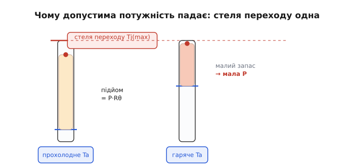
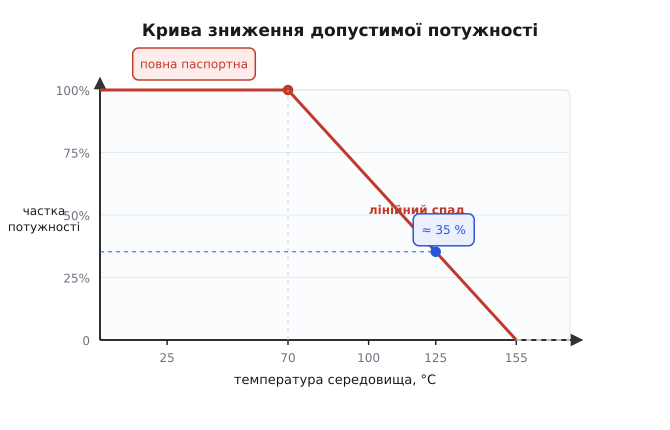
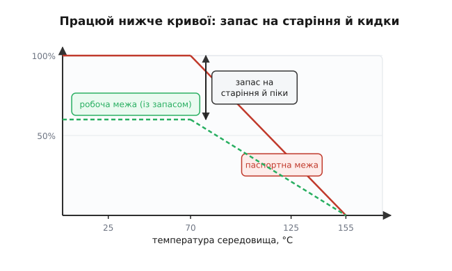

# Derating: зниження допустимої потужності з температурою

На корпусі резистора написано «0.25 Вт». Здавалося б, чесна обіцянка: пускай крізь нього хоч чверть вата — витримає. Але та сама деталь, що спокійно тримає 0.25 Вт на прохолодному столі, у нагрітому корпусі приладу при +110 °C згорить уже від половини цього. Паспортне число, виходить, не стала, а **умовна** обіцянка — справедлива лише за певної температури навколо. Розберімося, чому так, і як читати справжню межу.

Англійське слово **derating** (від *de-* — «зниження» і *rating* — «номінальне, паспортне значення») саме про це: допустиме навантаження деталі **знижується** в міру того, як росте температура довкола неї. Не «деталь стає гіршою» — а паспортна цифра від початку приховує застереження «за нормальних умов», і поза цими умовами її доводиться зменшувати.

## Паспортна потужність — це насправді про температуру

Почнімо з простого питання: що взагалі обмежує потужність на резисторі? Адже сам опір не «псується» від великого струму миттєво. Обмежує його **тепло**. Уся потужність, що виділяється на резисторі, перетворюється на тепло — крихітна спіраль чи плівка всередині гріється. А кожен матеріал має межу, за якою він починає руйнуватися: плівка вигоряє, паяння тече, пластик корпусу тріскається. Тобто паспортні «0.25 Вт» — це насправді замаскована теплова умова: «стільки тепла деталь здатна **відвести**, не перегрівшись понад безпечне».

> 🔧 **Навіщо це.** Тримати в голові, що ват у паспорті — це межа **тепловідводу**, а не якась магічна властивість опору, треба щоразу, коли деталь працює не на відкритому столі: у закритій коробці, впритул до інших гарячих деталей, на платі без обдування. У кожному з цих випадків реальна допустима потужність нижча за наклейку — і саме це найчастіше спалює резистори в готовому виробі, хоча «за розрахунком усе сходилося».

Тепер ключова ланка. Деталь гріється не до нескінченності: вона віддає тепло назовні — у повітря, у плату, у корпус приладу. Установлюється рівновага, коли скільки тепла народжується всередині, стільки й витікає. І тут працює акуратна аналогія з електрикою. Як струм тече крізь опір під дією різниці потенціалів (закон Ома), так і **тепловий потік** тече крізь матеріал під дією **різниці температур**. Чим більший опір шляху для тепла, тим більший перепад температури потрібен, щоб «проштовхнути» той самий потік. Цей опір шляху для тепла й називають **тепловим опором** (англ. *thermal resistance*), позначають Rθ (грецька «тета») і міряють у градусах на ват (°C/Вт).

> Тепловий опір — стрижень усієї цієї теми, тож варто знати головне. Найгарячіша точка деталі (у напівпровіднику — кристал, його звуть **переходом**, англ. *junction*) завжди гарячіша за середовище рівно на P·Rθ: температура переходу Tj = Ta + P·Rθ, де Ta — температура довкілля, P — розсіювана потужність. Кожна деталь має стелю Tj(max), яку не можна переходити. Докладніше — у [тепловому опорі й ланцюжку Rθ](root:ph-thermodynamics/thermal-resistance).

Звідси випливає вся механіка. Запишімо рівновагу як просту формулу — нею ми користуватимемося далі:

```
Tj = Ta + P · Rθ
```

Прочитаймо її як інженер. Зліва — температура найгарячішого місця деталі, та сама, що має не перевищити стелю Tj(max). Справа — температура середовища плюс «підйом», який дає сама розсіювана потужність, помножена на тепловий опір. Деталь у безпеці, поки `Ta + P·Rθ ≤ Tj(max)`.

## Чому ж допустима потужність падає з нагрівом

А тепер найголовніше — і воно випливає з цієї формули само собою. Стеля Tj(max) у деталі **одна й та сама** незалежно від погоди: кристал руйнується, скажімо, при +150 °C, і байдуже, холодно надворі чи спекотно. Тепловий опір Rθ теж приблизно сталий. Що ж міняється? Міняється Ta — температура середовища. А отже, міняється і той «підйом» P·Rθ, який ми можемо собі дозволити.

Перепишімо формулу під допустиму потужність — виразимо з неї P на самій межі, коли Tj дорівнює стелі:

```
P(доп) = (Tj(max) − Ta) / Rθ
```

Ось і вся розгадка. У чисельнику стоїть **різниця** між стелею й температурою довкілля. Поки надворі прохолодно, ця різниця велика — деталі є куди грітися, допустима потужність велика. Та щойно середовище нагрівається, різниця тане, і дозволена потужність падає **прямо пропорційно** до того, як Ta наближається до стелі. А в точці, де Ta дорівнює самій стелі Tj(max), різниця обертається на нуль: деталь уже й так нагріта до межі самим середовищем, тож **жодного** додаткового тепла розсіяти не може. Допустима потужність — нуль.


*Ліворуч — прохолодне середовище: від рівня довкілля до стелі переходу далеко, тож деталь може дати великий «підйом» P·Rθ, тобто розсіяти велику потужність. Праворуч — гаряче середовище підступило близько до стелі, запасу майже не лишилось, і допустима потужність мала.*

Це той рідкісний випадок, коли практичне правило виводиться з однієї формули за два рядки й більше нічого не треба пам'ятати. Уся «крива зниження потужності» з паспорта — це просто графік виразу `(Tj(max) − Ta)/Rθ` як функції від Ta.

## Як виглядає крива в паспорті

Виробник не змушує нас рахувати — він малює готовий графік, **криву зниження допустимої потужності** (англ. *derating curve*). По горизонталі — температура середовища, по вертикалі — частка паспортної потужності, яку можна дозволити. Виглядає вона завжди однаково за формою.


*До температури зламу (тут +70 °C) дозволені повні 100 % паспорта — це й є умова, за якої деталь випробували. Далі пряма спадає до нуля при максимальній робочій температурі (тут +155 °C). На +125 °C, наприклад, дозволено вже лише близько 35 % паспортної потужності.*

Чому крива має саме таку форму — пласку ділянку, а потім спад? Пласка частина зліва — це діапазон, у якому виробник **гарантує** повний паспорт. Він обрав комфортну температуру випробування (часто +70 °C, інколи +25 °C) і заявив для неї повне число. Поки середовище не гарячіше за цю точку, повні 100 % безпечні з запасом. А далі починається наш лінійний спад: різниця `Tj(max) − Ta` тане, і дозволена частка падає по прямій до нуля рівно в точці максимальної робочої температури деталі.

Нахил цієї прямої — не випадковий, у ньому захований тепловий опір. Що краще деталь віддає тепло (менший Rθ), то полога крива, то більше потужності лишається на високих температурах. Тонкий чип-резистор на платі без міді й могутній резистор на радіаторі мають **однакову форму** кривої, але різний нахил — і це теж прямо випливає з `P = (Tj(max) − Ta)/Rθ`.

## Порахуймо: резистор у гарячому корпусі

Сухе правило оживає на числах. Візьмімо типову задачу.

**Умова.** Резистор з паспортом 0.5 Вт при +70 °C і максимальною робочою температурою +155 °C стоїть усередині приладу, де повітря прогрівається до +105 °C. Скільки потужності він тепер може безпечно розсіяти?

Спершу знайдімо нахил спаду — скільки вата «з'їдається» на кожен градус понад точку зламу. Від +70 °C до +155 °C крива падає з повного паспорта до нуля, тобто весь діапазон спаду — це 155 − 70 = 85 градусів:

```
спад на градус = 0.5 Вт / (155 − 70) °C = 0.5 / 85 ≈ 0.00588 Вт/°C
```

Тепер рахуємо, на скільки градусів ми зайшли в зону спаду й скільки через це втратили:

```
перевищення  = 105 − 70 = 35 °C
втрата       = 35 °C · 0.00588 Вт/°C ≈ 0.206 Вт
допустима P  = 0.5 − 0.206 ≈ 0.29 Вт
```

Висновок промовистий: резистор «на пів вата» в цьому теплому ящику тримає лише близько **0.29 Вт** — майже вдвічі менше за наклейку. Якби ми наївно довантажили його до паспортних 0.5 Вт, кристал перегрівся б далеко за +155 °C і деталь почала б деградувати. Ось чому число на корпусі без температури — лише половина обіцянки.

Той самий результат можна дістати прямо з головної формули, якщо знати тепловий опір. Із паспорта Rθ = (155 − 70)/0.5 = 170 °C/Вт. Тоді:

```c
// допустима потужність деталі за поточної температури середовища
float p_allowed(float tj_max, float ta, float rth) {
    return (tj_max - ta) / rth;   // Вт
}

// у нашій задачі:
float p = p_allowed(155.0f, 105.0f, 170.0f);  // (155-105)/170 ≈ 0.294 Вт
```

Обидва шляхи — через нахил кривої й через тепловий опір — дають те саме, бо це **одна** фізика, записана двома способами.

## Працюй ще нижче: запас на старіння й кидки

Здавалося б, знайшли допустиму P за температурою — і вантаж рівно стільки. Але інженери йдуть далі: беруть навантаження ще **нижче** за криву, з добрим запасом. На те є дві окремі причини, і обидві серйозні.

Перша — **довговічність**. Деталь не зобов'язана згоріти, щоб завдати шкоди: вона може просто старіти швидше. Старіння — корозія, дифузія, висихання — це повільні хімічні процеси, а їхня швидкість росте з температурою експоненційно. Звідси відоме інженерне правило великого пальця: **кожні зайві 10 °C приблизно вдвічі скорочують строк життя деталі**. Тому навіть якщо при робочій температурі деталь «не горить», тримати її біля самої межі означає прирікати виріб на ранню відмову через місяці чи роки.

> 📜 Звідки взялася сама звичка свідомо недовантажувати деталі, до чого тут шведський хімік Арреніус і чому військовий довідник 1965 року узаконив це правило — коротка історія дисципліни в [нарисі про походження derating](root:hw-components/power-derating/hist-derating-discipline.md).

Друга причина — **піки**. Паспорт і крива говорять про **середню** потужність у тепловій рівновазі. Та в реальній схемі трапляються короткі сплески: кидок струму при ввімкненні, імпульсний режим, аварійна ситуація. Якщо робоча точка вже впритул до межі, перший же сплеск виштовхне деталь за неї. Запас лишає місце цим коротким пікам.


*Червона лінія — паспортна межа за температурою; зелена пунктирна — робоча межа, що її обирає інженер, відсотків на сорок нижче. Проміжок між ними — це навмисний запас: на старіння деталі та на короткі кидки потужності.*

Скільки саме закладати? Залежить від ваги виробу. Для побутової дрібниці часто беруть робочу точку відсотків на двадцять нижче допустимої. Для відповідальної техніки — нижче вдвічі й більше: половинний запас із потужності, та ще й окремий запас по температурі, напрузі, струму. Загальне правило просте й варте того, щоб запам'ятати: **проєктуй так, щоб у найгіршому передбаченому режимі деталь усе ще мала помітний запас до своєї кривої.**

> 🔧 **Навіщо це.** Запас рятує не від «середнього» дня, а від збігу нещасливих обставин: спекотне літо, забитий пилом корпус, виробничий розкид параметрів деталі й одночасний кидок навантаження. Кожне з цих відхилень окремо мале, але разом вони легко з'їдають усю різницю між паспортом і реальністю. Деталь, що працює «рівно по межі за розрахунком», насправді працює **за межею** в перший же поганий день. Запас — це і є плата за те, щоб виріб жив роками, а не до першої спеки.

## Це стосується не лише резисторів

Хоч ми говорили про резистор як про найнаочніший приклад, той самий закон керує **майже всім, що гріється**. Транзистор у силовому каскаді, стабілізатор напруги, світлодіод, навіть конденсатор — у кожного є своя стеля температури й своя крива зниження. У потужних транзисторів і мікросхем крива зниження потужності — взагалі центральний графік паспорта, бо саме тепло обмежує, скільки струму вони здатні комутувати.

Особливо красномовний приклад — **електролітичні конденсатори**. У них старіння — це буквальне висихання рідкого електроліту, і воно так точно підкоряється закону Арреніуса, що виробники прямо пишуть строк служби з прив'язкою до температури: «2000 годин при +105 °C», і кожні 10 °C охолодження подвоюють цей строк. Конденсатор не «згорає» від перегріву — він тихо висихає й втрачає ємність, і робить це тим швидше, чим гарячіше довкола.

> Окремо варто пам'ятати про підступну петлю зворотного зв'язку в напівпровідниках: нагрів збільшує струм, більший струм дає більше тепла, тепло ще піднімає струм — і деталь може загнати себе в розгін. Ця окрема небезпека описана в [тепловому розгоні транзистора](root:hw-components/thermal-runaway); derating і запас по температурі — один із головних способів не дати їй початися.

Тож derating — не вузька дрібниця про резистори, а спосіб мислення про будь-яку деталь, що розсіює потужність. Він зводиться до однієї ясної ідеї, яку варто винести з усього сказаного: **паспортна потужність дійсна лише за паспортної температури; у реальному теплому виробі бери менше — і лишай запас.** За цим простим правилом стоїть один акуратний закон — `P(доп) = (Tj(max) − Ta)/Rθ` — і ціла культура надійності, що виросла з гіркого досвіду перегрітих схем.
