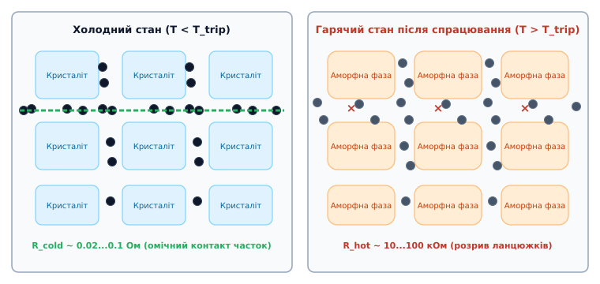
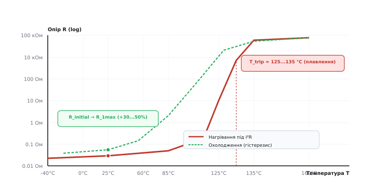
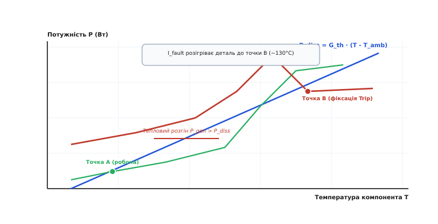
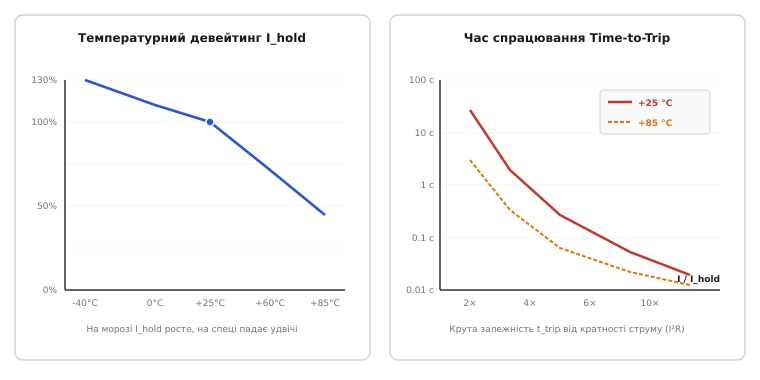
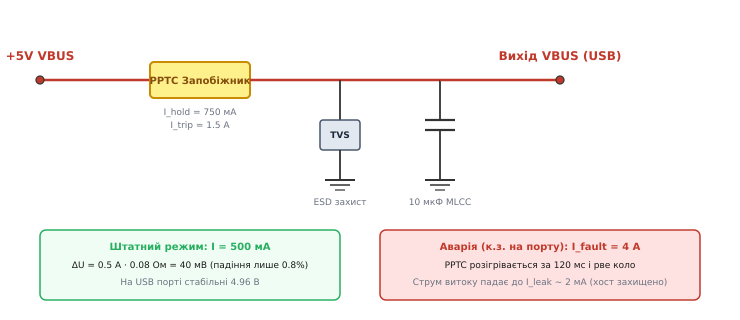

# Самовідновні запобіжники (Polymeric PTC)

<preknowlist>
- [Закон Ома](topic:hw-analog/ohms-law) — зв'язок між електричним струмом, прикладеною напругою та омічним опором провідника.
- [Джоулеве тепло](topic:ph-electromagnetism/joule-heating) — виділення теплової енергії в провіднику при протіканні струму `Q = I^2 · R · t`.
- [Залежність опору від температури](topic:ph-condensed/resistance-temperature) — позитивний та негативний температурні коефіцієнти опору (ТКО) матеріалів.
- [Типи запобіжників](topic:hw-components/fuse-types) — одноразові плавкі вставки, корпуси, швидкість перегорання F/T та часострумові криві.
</preknowlist>

Коли інженер підключає пошкоджений кабель до налагоджувальної плати з мікроконтролером, шина живлення 5 В миттєво замикається на землю, вимагаючи від стабілізатора аварійний струм у 4 А замість штатних 500 мА. Звичайний одноразовий запобіжник із тонким металевим дротиком перегорає за 20 мілісекунд, рятуючи доріжки друкованої плати, але назавжди перетворює прилад на неробочий модуль, доки технік не випаяє перегорілий корпус під мікроскопом. Електронні схеми обмеження на дискретних польових транзисторах вимагають десятка додаткових деталей, збільшуючи габарити та собівартість приладу. Самовідновний полімерний запобіжник пропонує витончене пасивне рішення: у штатному режимі його холодний опір становить соті частки ома, створюючи мізерне падіння напруги в 20–40 мВ, але під дією аварійного струму внутрішнє Джоулеве тепло розігріває полімер, викликаючи стрибкоподібне фазове розширення матриці на 12%, що розриває провідні ланцюжки та підкидає опір деталі на 5 порядків за частки секунди, обмежуючи струм до безпечних міліамперів до повного знеструмлення приладу.

Зрозуміти фізику цього стрибка, механіку фазового переходу в композиті, математичний баланс теплової фіксації та правила підбору компонентів для портів USB, HDMI та акумуляторів — це і є повна картина роботи самовідновних запобіжників.

## Що таке самовідновний запобіжник (PPTC)

Самовідновний запобіжник належить до класу полімерних терморезисторів із додатним температурним коефіцієнтом опору (терморезистор — від грец. *therme* «тепло» + лат. *resisto* «опиратися»; полімер — від грец. *polys* «численний» + *meros* «частина»). У міжнародній інженерній практиці ці компоненти називають **PPTC** (*Polymeric Positive Temperature Coefficient*) або за історичною торговельною маркою **PolySwitch**, розробленою корпорацією Raychem у 1980 році ([історію створення полімерних терморезисторів PolySwitch](topic:hw-components/ptc-fuse/hist-polyswitch.md)).

На відміну від класичних плавких запобіжників, усередині PPTC немає металевої нитки, що випаровується. Це твердотільний монолітний резистивний елемент, виконаний зі спеціального провідного композиту. Його головна властивість — нелінійна порогова характеристика: при нормальній температурі опір залишається стабільно низьким (`R_cold ~ 0.02...0.2 Ом`), але при досягненні температури спрацьовування `T_trip` (типово 125–135 °C) опір лавиноподібно зростає до десятків і сотень кілоомів (`R_hot ~ 10...100 кОм`).

Завдяки цьому компонент працює як автоматичний струмовий клапан: він пропускає номінальний робочий струм із мінімальними втратами, майже миттєво «розмикає» коло при короткому замиканні, надійно утримує аварійний стан за рахунок мізерного струму витоку і самостійно повертається в провідний стан, щойно дефектне навантаження відключають від джерела живлення.

## Мікроструктура композиту та механізм перколяції

Щоб зрозуміти, як пластмаса може проводити електричний струм майже як метал, а потім миттєво ставати діелектриком, необхідно зазирнути в мікроструктуру матеріалу.


*Мікроструктура композиту PPTC. Ліворуч: у холодному стані кристаліти HDPE витісняють частки вуглецю у вузькі аморфні межі, формуючи неперервні провідні ланцюжки перколяції з низьким опором. Праворуч: при нагріванні вище точки плавлення кристаліти плавляться, полімер розширюється на 10–15%, розсуваючи частки на відстані понад 10 нм і обриваючи омічний контакт.*

PPTC-композит складається з двох ключових компонентів:
1. **Напівкристалічна полімерна матриця:** Найчастіше застосовують поліетилен високої густини (High-Density Polyethylene, HDPE), поліпропілен або фторополімери (PVDF). У твердому стані нижче 120 °C полімер має напівкристалічну структуру (кристал — від грец. *krystallos* «лід», «гірський кришталь»), яка складається з щільно упакованих кристалічних блоків (ламелей та сферолітів) і тонких аморфних прошарків між ними (аморфний — від грец. *amorphos* «безформний»).
2. **Струмопровідний нанодисперсний наповнювач:** Високоструктурований технічний вуглець (сажа з розміром первинних зерен 20–50 нм) або мікрочастинки металевого нікелю з голчастою дендритною поверхнею.

### Ефект витіснення та поріг перколяції

Сам по собі поліетилен є чудовим діелектриком із питомим опором понад `10^14 Ом·см`. Вуглецеві наночастинки є провідниками. Проте провідність суміші визначається не середньою концентрацією вуглецю, а явищем просторової перколяції (від лат. *percolatio* — просочування, фільтрація).

Коли розплавлений компаунд охолоджується під час виробництва, полімерні ланцюги починають кристалізуватися, формуючи регулярну ґратку ламелей. Кристалічна ґратка є настільки щільною, що вона фізично виштовхує сторонні частинки вуглецю зі свого об'єму. Усі вуглецеві наночастинки витісняються у вузькі аморфні межі між кристалітами.

У результаті локальна концентрація вуглецю в міжкристалітних каналах зростає у 4–6 разів порівняно з середнім об'ємом матеріалу. Частинки щільно притискаються одна до одної, утворюючи неперервні тривимірні струмопровідні ланцюжки — перколяційні містки, що пронизують увесь об'єм компонента від одного металевого електрода до іншого. Електрони вільно рухаються цими ланцюжками за рахунок прямого омічного контакту та квантового тунелювання через субнанометрові проміжки (менше 1–2 нм). Завдяки цьому сумарний опір деталі в холодному стані становить лише десятки міліомів.

### Вуглецевий наповнювач проти металевого нікелю

У сучасних PPTC використовують два типи наповнювачів залежно від цільової робочої напруги та струму:
- **Технічний вуглець (Carbon Black):** Класичний матеріал для серій на напругу від 6 В до 60 В. Забезпечує високу діелектричну стійкість у гарячому стані та витримує перенапруги. Холодний питомий опір становить `~0.1...1.0 Ом·см`.
- **Металевий нікель (Nickel Micro-particles):** Застосовується в ультранизькоомних серіях для автомобільних блоків живлення 12 В та літій-іонних акумуляторів. Голчасті дендрити нікелю утворюють щільніші металеві контакти, знижуючи холодний опір до лічених міліомів (`R_cold ~ 2...10 мОм`). Проте через нижчий електричний опір розплаву нікелеві PPTC обмежені робочими напругами 6–16 В.

### Радіаційне зшивання молекулярного каркаса

Якби полімер був звичайним лінійним поліетиленом, при першому ж нагріванні вище точки плавлення він перетворився б на рідкий розплав. Вуглецеві частинки під дією сил поверхневого натягу незворотно коагулювали б у випадкові згустки, і деталь назавжди втратила б свої властивості.

Щоб запобігти розтіканню розплаву, спресований композит опромінюють пучком високоенергетичних електронів у промисловому прискорювачі. Радіація вибиває атоми водню, утворюючи вільні радикали, які зшивають сусідні полімерні макромолекули міцними ковалентними `C–C` зв'язками. Полімер отримує просторову зшиту сітку: при нагріванні він не переходить у рідкий стан, а стає пружним каучукоподібним гелем. Цей просторовий каркас запам'ятовує вихідну структуру і примушує полімер рекристалізуватися точно в первісну конфігурацію після кожного охолодження.

## Фізика фазового переходу та стрибок опору

Перемикання запобіжника з низькоомного стану у високоомний є наслідком класичного термодинамічного фазового переходу першого роду.


*Залежність електричного опору PPTC від температури на логарифмічній шкалі. Стрибок опору на 5 порядків біля точки плавлення HDPE (~130 °C) та петля гістерезису при охолодженні з залишковим збільшенням опору R_1max.*

Розглянемо ланцюжок фізичних процесів, що відбуваються всередині компонента при перевантаженні:

```
Аварійний струм I_fault
  │
  ▼
Джоулеве саморозігрівання: P = I^2 · R_cold
  │
  ▼
Нагрів до точки плавлення кристалітів: T → T_trip ≈ 125...135 °C
  │
  ▼
Руйнування кристалічної ґратки: перехід у повністю аморфну фазу
  │
  ▼
Стрибкоподібне об'ємне теплове розширення полімеру на 10...15%
  │
  ▼
Збільшення відстані між вуглецевими частками (> 10 нм)
  │
  ▼
Розрив перколяційних ланцюжків (зникнення квантового тунелювання)
  │
  ▼
Стрибок опору на 5 порядків: R_cold (0.05 Ом) → R_hot (50 кОм)
  │
  ▼
Струм спадає до безпечного рівня витоку I_leak ≈ 1...3 мА
```

### Чому стрибок опору такий стрімкий

У твердому стані густина кристалітів HDPE становить приблизно `0.98...1.00 г/см³`, тоді як густина аморфного розплаву поліетилену становить лише `0.85 г/см³`. Коли температура досягає точки фазового переходу `T_m`, щільна кристалічна упаковка макромолекул миттєво руйнується. Молекули переходять у невпорядкований клубоподібний стан, що викликає вибухоподібне збільшення питомого об'єму матеріалу на 10–15%.

Оскільки об'єм полімерної матриці різко зростає, вона розсуває вуглецеві наночастинки в різні боки. Відстань між сусідніми зернами збільшується з часток нанометра до 5–15 нм. Оскільки ймовірність тунелювання електронів крізь потенційний діелектричний бар'єр полімеру спадає експоненційно з відстанню (`~ e^(−2αd)`), провідність зникає практично миттєво. Опір компонента зростає у `100 000` разів у вузькому температурному вікні завширшки всього 3–5 °C.

### Ефект локалізації (шнурування струму) та гарячі мікрошари

На мікроскопічному рівні нагрівання PPTC ніколи не є абсолютно однорідним по всій товщині таблетки. Через мікроскопічні технологічні флуктуації концентрації вуглецю завжди існує один найтонший поперечний шар завтовшки в кілька мікронів, де локальний питомий опір трохи вищий за середній.

Саме цей мікрошар розігрівається першим. Досягнувши температури плавлення 130 °C, він розширюється і розриває свої ланцюжки перколяції раніше за решту об'єму. Опір цього тонкого шару підскакує до кілоомів, і практично вся прикладена напруга схеми миттєво падає саме на ньому. Решта маси полімерного блоку залишається тепловим баластом, який утримує деталь від загального перегріву.

Цей механізм шнурування струму та локалізації розриву пояснює, чому реальний час спрацьовування тонких SMD-компонентів при короткому замиканні становить лічені мілісекунди, що в десятки разів швидше за теоретичний час прогріву всього об'єму деталі.

## Теплова рівновага, біфуркація та стан фіксації (Latching)

Чому PPTC-запобіжник після спрацьовування не починає миттєво коливатися туди-сюди: охолов → увімкнувся → нагрівся → вимкнувся? 

Причиною є ефект нелінійної теплової рівноваги — біфуркації (від лат. *bifurcus* — роздвоєний), що детально виводиться з диференціального рівняння теплопровідності ([математичне виведення теплового балансу та часу спрацювання](topic:hw-components/ptc-fuse/math-ptc-thermal-model.md)).


*Діаграма теплового балансу PPTC. При робочому струмі пряма тепловідводу перетинає криву виділення тепла у стійкій низькотемпературній точці А. Струм перевантаження зсуває криву генерації вгору, викликаючи тепловий розгін до гарячої точки фіксації B (~130 °C), яка підтримується малим струмом витоку.*

Динаміка температури компонента описується балансом двох потужностей:
```
C_th · (dT / dt) = P_gen(T) − P_diss(T)
```
- `P_gen(T) = I^2 · R(T)` — швидкість виділення Джоулевого тепла;
- `P_diss(T) = G_th · (T − T_amb)` — швидкість тепловідведення в навколишнє повітря та плату за законом Ньютона (де `G_th` — теплова провідність у Вт/К, а `T_amb` — температура довкілля).

### Механіка теплового розгону та утримання

1. **Штатний режим (Точка A):** При струмі `I ≤ I_hold` лінія тепловідведення перетинає криву генерації тепла при низькій температурі (типово 35–45 °C). Якщо деталь випадково нагріється, тепловідвід перевищить нагрів, і вона охолоне назад. Це стійка робоча точка.
2. **Аварійний режим (Тепловий розгін):** Коли струм перевищує поріг спрацьовування `I_trip`, лінія генерації `P_gen` піднімається вище за пряму тепловідводу для всіх низьких температур. Швидкість нагріву `dT / dt > 0`: виділяється більше тепла, ніж розсіюється. Компонент швидко розігрівається до 130 °C.
3. **Стан фіксації (Точка B):** Коли опір зростає до десятків кілоомів, майже вся напруга живлення `U_src` падає на запобіжнику. Тепер потужність нагріву визначається напругою: `P_gen = U_src^2 / R_hot`. Крива генерації спадає з ростом `R` і перетинає пряму тепловідводу в другій стійкій точці при температурі близько 130–140 °C.

У цій гарячій точці струм через навантаження зменшується до мізерного струму витоку:
```
I_leak = U_src / R_hot ≈ P_d / U_src
```

Цього крихітного струму (типово 0.5–5 мА) виявляється цілком достатньо, щоб неперервно підтримувати компонент у гарячому аморфному стані з потужністю розсіювання `P_d ~ 0.5...1.5 Вт`. Запобіжник залишається «заблокованим» у розімкненому стані нескінченно довго, захищаючи схему.

Щоб скинути захист і повернути PPTC у низькоомний стан, необхідно **повністю зняти напругу живлення** (вимкнути прилад вимикачем або витягнути штекер). Без напруги виділення тепла припиняється, компонент вистигає до кімнатної температури за 20–60 секунд, полімер рекристалізується, вуглецеві ланцюжки замикаються, і провідність відновлюється.

## Параметричний контракт та інтерпретація даташиту

Підбір самовідновного запобіжника вимагає суворого врахування взаємопов'язаних параметрів специфікації ([повний довідник параметрів даташиту та алгоритм підбору](topic:hw-components/ptc-fuse/api-ptc-datasheet.md)).


*Ліворуч: температурний девейтинг струму утримання I_hold від температури довкілля (на морозі струм зростає, на спеці падає удвічі). Праворуч: залежність часу спрацювання Time-to-Trip від кратності струму при +25 °C та +85 °C.*

Розглянемо ключові параметри, на які спирається розробник:

### 1. Струм утримання (I_hold) та струм спрацьовування (I_trip)
- **`I_hold` (Holding Current):** Найбільший постійний струм, який запобіжник несе нескінченно довго при 25 °C без ризику переходу у високоомний стан. Робочий струм навантаження завжди повинен бути меншим за `I_hold`.
- **`I_trip` (Tripping Current):** Мінімальний струм, який гарантовано розмикає компонент при 25 °C. 
- **Зона невизначеності (`I_hold ... I_trip`):** Якщо струм потрапляє в інтервал між цими значеннями (типово `I_trip ≈ 2 · I_hold`), поведінка деталі залежить від конвекції повітря та температури плати. Запобіжник може спрацювати через кілька хвилин або не спрацювати взагалі. Заборонено проектувати схеми, розраховані на роботу в цьому проміжку.

### 2. Температурний девейтинг струму утримання
Оскільки PPTC є тепловим приладом, температура навколишнього середовища радикально змінює струм утримання:
- **На морозі (-40 °C):** Різниця температур `(T_trip − T_amb)` зростає з `105 °C` до `170 °C`. Тепловідведення посилюється, тому для нагріву потрібен більший струм: `I_hold` зростає на 30–45%.
- **На спеці (+85 °C):** Різниця температур скорочується до `45 °C`. Тепловідведення погіршується, і компонент розігрівається значно меншим струмом: `I_hold` падає на 50–55%.

*Приклад пастки:* Якщо в приладі з робочим струмом 1.0 А поставити PPTC на `I_hold = 1.1 А`, у спекотний літній день при температурі всередині корпусу +60 °C реальний струм утримання впаде до `1.1 · 0.72 = 0.79 А` — запобіжник буде хибно вимикати повністю справний прилад.

### 3. Граничні електричні режими: V_max та I_max
- **`V_max`:** Найбільша постійна або пікова змінна напруга, яку компонент витримує у гарячому розімкненому стані. Якщо напруга лінії перевищує `V_max`, всередині нагрітого розширеного полімеру виникне іонізація та дуговий пробій, що призведе до займання або руйнування корпусу.
- **`I_max`:** Найбільший струм короткого замикання, який деталь здатна перервати без вибуху. Типово для SMD-серій становить від 10 А (0603) до 100 А (1812/2920).

### 4. Опір: R_min, R_max та R_1max
- **`R_min` / `R_max`:** Технологічний розкид початкового опору нового компонента при 25 °C до першого монтажу.
- **`R_1max` (Post-Trip Resistance):** Опір через 1 годину після спрацьовування та вистигання. Через гістерезис рекристалізації `R_1max` завжди на 30–50% перевищує початковий опір. Розрахунок втрат напруги в колі необхідно виконувати строго за параметром `R_1max`.

### 5. Час спрацьовування (Time-to-Trip)
Час відключення визначається швидкістю накопичення тепла:
- При струмі `2 · I_hold` нагрів триває від 5 до 60 секунд.
- При струмі `10 · I_hold` (жорстке коротке замикання) процес стає адіабатичним, і час розриву скорочується до 10–200 мілісекунд.

## Практичні застосування та типові схемотехнічні рішення

Самовідновні запобіжники стали базовим стандартом захисту у вузлах, де існує висока ймовірність коротких замикань із вини користувача або зовнішніх підключень.

### 1. Захист ліній живлення портів USB (Type-A та Type-C)

У комп'ютерах, хабах та зарядних пристроях шина VBUS 5 В постійно піддається ризику замикання через пошкоджені кабелі чи несправні пристрої.


*Схема захисту порту живлення USB 5 В. У штатному режимі PPTC вносить мізерне падіння 40 мВ; при короткому замиканні на виході запобіжник спрацьовує за 120 мс, обмежуючи аварійний струм до 2 мА та рятуючи джерело живлення від перевантаження.*

У схемі захисту порту USB на струм 500 мА застосовують PPTC типорозміру 1206 або 1812 з номіналом `I_hold = 750 мА` (`I_trip = 1.5 А`) на напругу `V_max = 6...16 В`.
- У штатному режимі при струмі 500 мА на холодному опорі `0.08 Ом` падає лише `ΔU = 0.5 А · 0.08 Ом = 40 мВ` (втрата 0.8% від напруги 5 В, що повністю вкладається в жорсткі вимоги специфікації USB).
- При замиканні штекера струм стрибає до 4 А. Запобіжник розігрівається за 120 мс і переходить у стан блокування, обмежуючи аварійний струм витоку до 2 мА.
- Після відключення несправного кабелю порт відновлює нормальну напругу 5 В через 30–40 секунд без візиту до сервісного центру.

### 2. Захист літій-іонних акумуляторних батарей (Battery Straps)

Літій-іонні банки 18650 та пласкі Li-Po акумулятори смартфонів мають надзвичайно низький внутрішній опір (20–50 мОм). Коротке замикання виводів викликає розрядний струм у десятки ампер, що призводить до закипання електроліту, теплового розгону та вибуху акумулятора.

Спеціально для акумуляторів випускають PPTC у вигляді тонких нікельованих смужок під точкове зварювання (*battery straps*, серії Littelfuse VTP, LTP, SRP). Стрічку приварюють безпосередньо до металевого виводу банки послідовно з ланцюгом навантаження.

PPTC-стрічка забезпечує подвійний захист:
1. **Захист від електричного струму:** Розриває коло при зовнішньому короткому замиканні клем.
2. **Захист від перегріву акумулятора:** Оскільки запобіжник має прямий тепловий контакт із корпусом банки, при нагріванні акумулятора вище 80–85 °C (наприклад, через аварію плати зарядного контролера або перезаряд) тепло від батареї розігріває PPTC, викликаючи його спрацьовування навіть при невеликому робочому струмі.

### 3. Захист інтерфейсів HDMI, DisplayPort та відеовиходів

Стандарти HDMI та DisplayPort містять лінію живлення +5 В (HDMI Pin 18) для живлення мікросхем EDID/EEPROM у кабелях та приймачах. Стандарт вимагає обмеження струму цієї лінії на рівні не більше 0.5 А. PPTC типорозміру 0603 або 0805 на струм `I_hold = 0.5 А` надійно захищає графічну карту від замикань при «гарячому» підключенні кабелів.

### 4. Промислові шини RS-485 та токові петлі 4–20 мА

У довгих польових лініях автоматики існує ризик випадкового замикання сигнальних дротів на лінію живлення датчиків 24 В або потрапляння грозових імпульсів. Застосовують послідовний PPTC (наприклад, 60 В, 100 мА) у парі з захисним TVS-діодом на землю: TVS-діод фіксує імпульсну напругу, а PPTC обмежує тривалий струм, що протікає через відкритий діод, захищаючи трансивер від вигорання.

### 5. Автомобільна бортмережа 12 В / 24 В та імпульси ISO 7637-2

В автомобільній електроніці навантаження (мотори склопідйомників, центральні замки, дзеркала) піддаються ризику блокування ротора. При заклинюванні редуктора струм двигуна стрибає в 4–8 разів вище номіналу. PPTC здатний терпіти короткий пусковий струм мотора (100–300 мс), але надійно розмикає живлення при тривалому заклинюванні (понад 2–3 с).

Ба більше: PPTC має природну стійкість до комутаційних сплесків напруги в бортмережі (імпульси скидання навантаження *Load Dump* за стандартом ISO 7637-2 з амплітудою до 40–80 В), де одноразові запобіжники або транзисторні ключі часто пробиваються через паразитні індуктивності джгутів проводки.

## Інженерні компроміси, обмеження та типові граблі

Попри зручність, PPTC не є універсальною заміною звичайного запобіжника і має чіткі фізичні обмеження ([порівняльну таблицю з керамічними термісторами та одноразовими плавкими запобіжниками](topic:hw-components/ptc-fuse/comp-fuse-technologies.md)).

### 1. Наявність струму витоку після спрацьовування
PPTC ніколи не створює повної гальванічної розв'язки кола. Щоб залишатися гарячим і розімкненим, крізь нього повинен неперервно протікати струм витоку `I_leak ~ 0.5...10 мА`. 
- Це категорично неприпустимо у високовольтних мережах 230 В, де струм витоку може смертельно вразити людину або викликати тління ізоляції.
- У батарейних пристроях цей струм за кілька днів здатний повністю розрядити акумулятор у глибокий нуль.

### 2. Падіння напруги на наднизьковольтних лініях (3.3 В, 1.8 В, 1.2 В)
Опір PPTC (`0.05...0.3 Ом`) непомітний на шині 12 В або 24 В. Проте на сучасних процесорних платах із живленням 3.3 В або 1.8 В при струмі 2 А навіть опір `0.1 Ом` викличе падіння `0.2 В` (більше 6% номіналу). Це призводить до збоїв живлення оперативної пам'яті та постійних перезавантажень мікроконтролера.

### 3. Час релаксації та затримка повторного ввімкнення
Після зняття короткого замикання запобіжник не стає провідним миттєво. Йому потрібен час (від 20 секунд до 2 хвилин), щоб розсіяти тепло в повітря і пройти фазу рекристалізації. Якщо користувач увімкне прилад через 3 секунди після вимкнення, ще теплий PPTC спрацює від звичайного пускового струму.

### 4. Обмежений ресурс кількості циклів
PPTC не є вічним елементом. При кожному циклі розширення та стиснення мікроструктура полімеру зазнає механічних мікронапружень. Після 100–500 циклів аварійного спрацьовування його холодний опір може незворотно зрости на 50–100%, що зменшує струм утримання. PPTC призначений для захисту від *випадкових рідкісних аварій*, а не для регулярного використання як вимикача живлення.

### 5. Заливка компаундами та герметизація (Potting)
Оскільки робота PPTC заснована на фізичному об'ємному розширенні полімеру на 10–15%, деталь не можна заливати твердими нееластичними епоксидними компаундами. Жорстка смола затискає корпус і блокує теплове розширення: запобіжник втрачає здатність розривати коло і згорає при перевантаженні. При герметизації плат дозволяється використовувати лише м'які силіконові гелі або попередньо захищати деталь еластичним ковпачком.

### 6. Взаємодія зі стабілізаторами живлення та DC-DC перетворювачами
Якщо PPTC встановлено на виході імпульсного понижувального перетворювача перед великим блоком керамічних конденсаторів, початковий стрибок зарядного струму може нагріти запобіжник. Якщо час заряду конденсаторів перевищує кілька мілісекунд, зростаючий опір запобіжника може спотворити зворотний зв'язок стабілізатора, викликавши паразитні коливання або перехід у захист за перенапругою.

### 7. Трасування контактних майданчиків та товщина міді на платі
Тепловий коефіцієнт `G_th` суттєво залежить від того, як компонент розведений на платі. Припаювання виводів до широких силових полігонів з міддю 2 oz (70 мкм) та наскрізними перехідними отворами на внутрішні шари збільшує тепловідвід на 40–70%. Це підвищує реальний струм утримання `I_hold`, але водночас збільшує час спрацьовування `Time-to-Trip` при слабких перевантаженнях. Якщо ж під виводами залишити мінімальні доріжки 0.25 мм на тонкій міді 0.5 oz без полігонів, деталь буде грітися значно сильніше і спрацьовуватиме при меншому струмі.

## Підсумок

Самовідновний запобіжник (PPTC) — це полімерний композитний терморезистор, який перетворює фізику фазового плавлення кристалічного поліетилену на надійний самовідновний вимикач аварійного струму.

- **У штатному стані** щільні кристаліти HDPE утримують наночастинки технічного вуглецю в неперервних перколяційних ланцюжках, забезпечуючи низький опір у соті частки ома.
- **При перевантаженні** Джоулеве тепло нагріває полімер вище 125 °C, викликаючи фазовий перехід в аморфний стан із різким стрибком об'єму на 10–15%, що розриває провідні містки та підкидає опір на 5 порядків.
- **Стан фіксації** надійно утримується за рахунок мізерного струму витоку без ризику циклічного брязкоту контактів, доки зовнішнє коло не буде знеструмлене.
- **Грамотний вибір** вимагає обов'язкового врахування температурного девейтингу струму утримання `I_hold`, післяаварійного опору `R_1max` та відсутності жорсткої механічної фіксації корпусу компаундами.
