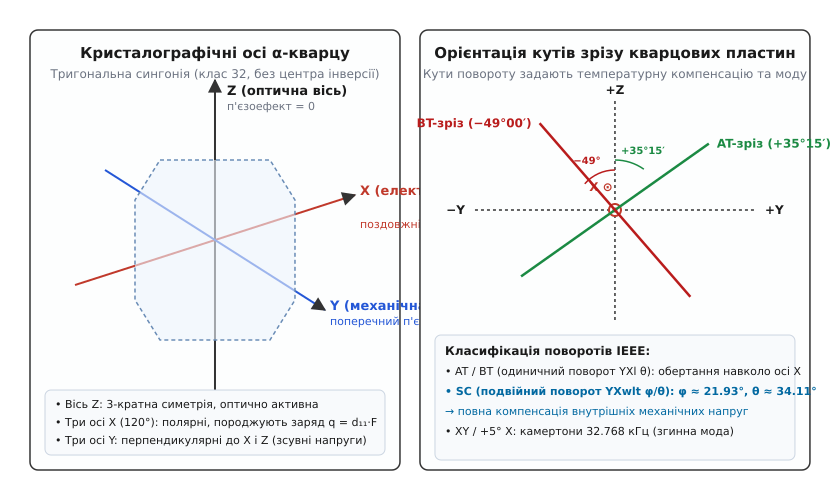
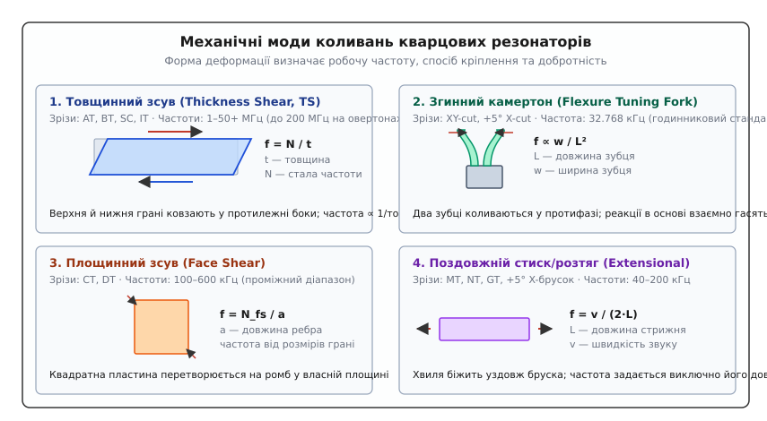
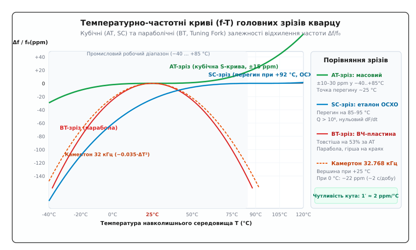
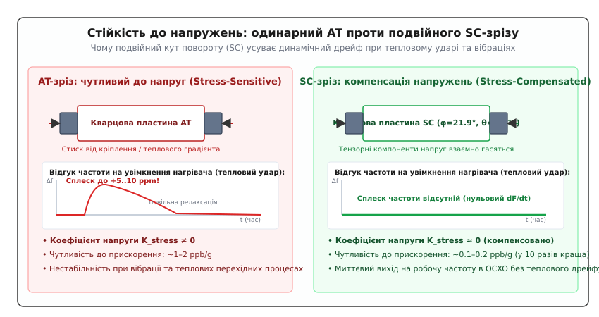

# Зрізи кварцу: AT, BT, SC та інші

<preknowlist>
- [Кварцовий резонатор](root:hw-components/quartz-resonator) — механічний п'єзоелектричний резонанс, добротність Q та захоплення енергії коливань.
- [RLC-модель кварцу](root:hw-components/quartz-rlc-model) — еквівалентна схема Баттерворта–ван Дайка, послідовна (fs) та паралельна (fp) частоти резонансу.
- [Точність та стабільність частоти](root:hw-components/frequency-accuracy-ppm) — похибка в ppm, температурний коефіцієнт частоти та криві дрейфу.
- [LC-резонанс](root:hw-analog/lc-resonance) — частота резонансу та коливальні процеси.
- [П'єзоелектричний ефект](root:ph-condensed/crystal-symmetry-piezo) — прямий і зворотний п'єзоефект, зв'язок механічної деформації та електричного поля через тензор п'єзомодулів.
</preknowlist>

Два однакових на вигляд металевих корпуси HC-49 на платі містять резонатори з однаковим маркуванням «16.000 МГц». Коли температура навколишнього середовища змінюється від −20 °C до +70 °C, частота першого резонатора відхиляється лише на 15 ppm (частин на мільйон), забезпечуючи надійну синхронізацію Ethernet та USB. Частота другого зміщується більш ніж на 150 ppm, викликаючи систематичні збої пакетної передачі даних. Якщо ж обидва кристали піддати швидкому нагріву поруч із силовим польовим транзистором або піддати вібрації від крокового двигуна, перший кристал дає раптовий сплеск частоти на 10 ppm, тоді як спеціалізований резонатор у сусідньому модулі термостатованого генератора OCXO тримає опорну частоту з точністю до десятих часток ppb (частин на мільярд).

Обидва зразки виготовлені з однакового матеріалу — надчистого синтетичного діоксиду кремнію (α-SiO₂), вирощеного в гідротермальному автоклаві. Вони мають ідентичну хімічну формулу, однакову густину та однаковий базовий п'єзоелектричний ефект. Єдина відмінність між ними — просторова геометрія: під якими саме кутами до кристалографічних осей вихідного монокристала було вирізано тонку коливальну пластину.

### Кристалографія α-кварцу та анізотропія п'єзоефекту

Кристалічний кварц належить до тригональної сингонії *(trigonal crystal system)*, просторова група симетрії `32` (точковий клас `D₃`). Головна особливість цієї ґратки — повна відсутність центра інверсії. Кожна елементарна комірка складається з атомів кремнію та кисню, розташованих у вигляді спіральних ланцюжків уздовж головної осі. Якщо кристал стиснути, центри тяжіння позитивних зарядів іонів кремнію `Si⁴⁺` та негативних зарядів іонів кисню `O²⁻` зміщуються в протилежні боки, породжуючи макроскопічний електричний дипольний момент. Це прямий п'єзоелектричний ефект *(piezoelectric effect)*, відкритий Жаком і П'єром Кюрі 1880 року.

Оскільки кристалічна ґратка не є ізотропною кулею, механічні, пружні, п'єзоелектричні та температурні властивості кварцу кардинально різняться за різними напрямками. У монокристалі виділяють три взаємно перпендикулярні головні осі:

* **Оптична вісь Z** — вісь симетрії третього порядку. Поворот кристала навколо осі Z на 120° суміщає його ґратку саму з собою. Уздовж осі Z кварц не проявляє п'єзоефекту: стиск або розтяг пластини, вирізаної строго перпендикулярно до Z (Z-зріз), не створює електричного заряду на її гранях, оскільки симетрія розташування атомів кремнію нейтралізує зміщення центрів зарядів. Вісь Z не має електричної полярності.
* **Електричні осі X** — три полярні осі симетрії другого порядку, розташовані в площині, перпендикулярній до Z, під кутом 120° одна до одної. Стиск уздовж будь-якої з осей X викликає виникнення електричного заряду прямо на гранях, перпендикулярних до цієї осі (поздовжній п'єзоефект). Заряд прямо пропорційний силі: `q = d₁₁ · F`, де `d₁₁` — п'єзоелектричний модуль кварцу.
* **Механічні осі Y** — три осі, перпендикулярні до площин шестигранної призми монокристала та до відповідних осей X і Z. Стиск уздовж осі Y породжує електричний заряд на гранях, перпендикулярних до осі X (поперечний п'єзоефект). Зсувні механічні напруження навколо осі Y безпосередньо збуджують електричні поля.


*Кристалографічні осі та орієнтація зрізів монокристала α-кварцу. Ліворуч — розташування оптичної осі Z, полярних електричних осей X та механічних осей Y у гексагональній призмі. Праворуч — кути орієнтації пластин AT-зрізу (+35°15′) та BT-зрізу (−49°00′) при повороті площини навколо осі X.*

Пружні властивості кварцу описуються тензором пружної податливості 4-го рангу з 6 незалежними константами `c₁₁`, `c₁₂`, `c₁₃`, `c₁₄`, `c₃₃`, `c₄₄`. Найважливіший для генерації факт полягає в тому, що температурні коефіцієнти цих констант мають **протилежні знаки**:

```
Tc₆₆ = (1/c₆₆) · (dc₆₆/dT) = +178·10⁻⁶ К⁻¹   (пружність зростає з нагрівом)
Tc₄₄ = (1/c₄₄) · (dc₄₄/dT) = −163·10⁻⁶ К⁻¹   (пружність падає з нагрівом)
```

Коли пластину вирізають під певним кутом до кристалографічних осей, її ефективний модуль пружності є лінійною комбінацією вихідних компонент тензора. Підбираючи кут нахилу, інженери змушують позитивний температурний коефіцієнт `c₆₆` точно компенсувати негативний коефіцієнт `c₄₄`. Це створює резонатор, частота якого залишається майже нерухомою при зміні температури.

Для однозначного опису орієнтації пластин стандарт IEEE (IEEE Standard on Piezoelectricity) використовує систему позначень, де вказуються вихідні осі товщини та довжини, а потім послідовність поворотів:
* **Одинарні зрізи (Singly Rotated Cuts):** позначаються як `(YXl) θ` — пластина, вихідна площина якої була перпендикулярна до осі Y, повертається навколо осі довжини (осі X) на кут `θ`. До цього сімейства належать класичні зрізи AT та BT.
* **Подвійні зрізи (Doubly Rotated Cuts):** позначаються як `(YXwlt) φ/θ` — вихідна площина зазнає двох послідовних поворотів: спочатку навколо осі Z на кут `φ`, а потім навколо новоутвореної осі X′ на кут `θ`. До цього сімейства належить зріз SC.

---

### Механічні моди коливань кварцової пластини

Кварцова пластина є тривимірним акустичним резонатором, у якому під дією змінного електричного поля збуджуються стоячі пружні хвилі. Залежно від геометрії пластини, орієнтації зрізу та розташування електродів у кристалі виникають різні типи коливань:


*Чотири механічні моди коливань кварцових пластин. 1 — товщинний зсув (TS, зрізи AT, BT, SC); 2 — згинний камертон (Flexure, 32.768 кГц); 3 — площинний контурний зсув (Face Shear, зрізи CT, DT); 4 — поздовжній стиск/розтяг (Extensional, зрізи MT, NT).*

#### 1. Товщинний зсув (Thickness Shear, TS)
Верхня та нижня поверхні пластини рухаються паралельно одна одній у протилежних напрямках. Деформація зсуву локалізована по товщині пластини `t`. Стояча акустична хвиля має вузлову площину посередині товщини та пучності зміщення на вільних гранях.

Частота основного резонансу визначається виключно швидкістю зсувної пружної хвилі `v` та товщиною пластини `t`:

```
f₀ = v / (2·t) = N / t
```

де `N` — частотна стала *(frequency constant)* для даного зрізу (вимірюється в кГц·мм або МГц·мм).

Для товщинного зсуву `N` становить від 1.6 до 2.6 МГц·мм. Це означає, що резонатор на 16 МГц має товщину близько 100 мкм. Товщинний зсув є основним робочим режимом для діапазону від 1 МГц до 50 МГц на основній моді, а на непарних механічних овертонах (3-я, 5-я гармоніки) — до 200–250 МГц. На цій моді працюють зрізи AT, BT, SC та IT.

Щоб хвиля зсуву не розсіювалася на краях пластини й не гасилася в точках кріплення, застосовують **захоплення енергії** *(energy trapping)* за принципом Бехмана. Металеві електроди напилюють тільки в центрі пластини. Додаткова маса електродів трохи знижує швидкість звуку в центральній зоні порівняно з чистими периферійними краями. Периферія стає бар'єром для хвилі, амплітуда зсуву спадає до країв за експоненційним законом, і пластину можна жорстко затискати в тримачах без падіння добротності.

#### 2. Згинні коливання (Flexure Mode)
Тонка балка або зубці камертона зазнають поперечного вигину. Частота згину визначається шириною `w` та довжиною `L` балки:

```
f ∝ (w / L²) · √(E / ρ)
```

де `E` — модуль Юнга, `ρ` — густина.

Оскільки частота обернено пропорційна **квадрату довжини**, згинний режим дозволяє отримати низькі звукові частоти (особливо 32.768 кГц) у крихітному фізичному розмірі (довжина зубців 1.5–3 мм). Якби для 32 кГц спробували використати товщинний зсув, товщина пластини склала б понад 5 сантиметрів, що технологічно безглуздо.

#### 3. Площинний (контурний) зсув (Face Shear)
Квадратна або дискова пластина зазнає зсуву у власній площині: квадрат періодично деформується в ромб. Частота залежить від розмірів граней пластини (довжини ребра `a`), а не від її товщини:

```
f = N_fs / a
```

Ця мода використовується в зрізах CT та DT для проміжного діапазону частот від 100 кГц до 600 кГц.

#### 4. Поздовжнє стиснення-розтягнення (Extensional / Longitudinal Mode)
Акустична хвиля біжить уздовж довгої осі стрижня або бруска, періодично подовжуючи та вкорочуючи його. Частота визначається довжиною `L`:

```
f = v_long / (2·L)
```

Застосовується в зрізах +5° X-cut, MT та NT для низьких частот від 40 кГц до 200 кГц.

---

### AT-зріз: масовий стандарт та кубічна характеристика

AT-зріз *(AT-cut)* — найпоширеніший тип кварцового резонатора у світі. Його винайшли 1934 року незалежно В. Лаккі (W. A. Lack), Дж. Косіцкі (J. Kousicky) та І. Кога (I. Koga).

Пластина AT-зрізу вирізається з монокристала поворотом навколо осі X на кут `θ = +35°15′` (35.25 градуса) відносно оптичної осі Z.

Головна перевага кута `+35°15′` полягає в тому, що перший температурний коефіцієнт пружності `Tc′₆₆` обнуляється строго при кімнатній температурі (`T₀ ≈ 25 °C`). У результаті відносна зміна частоти від температури описується кубічним поліномом Тейлора:

```
Δf / f₀ = a₁·(T − T₀) + a₂·(T − T₀)² + a₃·(T − T₀)³
```

Для ідеального кута `θ = +35°15′` коефіцієнти `a₁` та `a₂` практично дорівнюють нулю, і характеристика перетворюється на пологу S-подібну криву з точкою перегину при `25 °C – 27 °C`:

```
Δf / f₀ ≈ a₃ · (T − T₀)³
```

де `a₃ ≈ 0.95·10⁻¹⁰ / °C³` (або `+0.000095 ppm/°C³`).


*Температурно-частотні характеристики різних зрізів кварцу. Зелена лінія — кубічна S-крива AT-зрізу з точкою перегину при 25 °C (±15 ppm у широкому діапазоні). Блакитна лінія — кубічна крива SC-зрізу зі зміщеною точкою перегину на 92 °C для OCXO. Червона лінія — крута парабола BT-зрізу. Помаранчевий пунктир — парабола годинникового камертона 32.768 кГц.*

Завдяки кубічній формі кривої резонатор AT-зрізу забезпечує стабільність порядку **±10 ... ±30 ppm** у повному промисловому діапазоні температур від −40 °C до +85 °C, та близько **±5 ppm** у комерційному діапазоні (0...+70 °C) без застосування жодних нагрівачів чи схем термокомпенсації.

Частотна стала AT-зрізу становить `N = 1.661 МГц·мм` (1661 кГц·мм). Звідси розраховують товщину пластини для заданої частоти:

```
t = N / f₀
Для f₀ = 10 МГц:   t = 1.661 / 10 = 0.1661 мм = 166.1 мкм
Для f₀ = 16 МГц:   t = 1.661 / 16 = 0.1038 мм = 103.8 мкм
Для f₀ = 32 МГц:   t = 1.661 / 32 = 0.0519 мм = 51.9 мкм
Для f₀ = 50 МГц:   t = 1.661 / 50 = 0.0332 мм = 33.2 мкм
```

Товщина 30–33 мкм є практичною межею класичного механічного двостороннього шліфування та полірування кварцових пластин: тонші пластини стають надто крихкими й ламаються під час виготовлення. Для отримання вищих частот застосовують два шляхи:
1. **Збудження на непарних механічних овертонах (overtones):** пластина товщиною під 16.6 МГц збуджується на 3-й гармоніці (50 МГц) або 5-й гармоніці (83.3 МГц).
2. **Зворотне хімічне/плазмове травлення (Inverted Mesa Technology):** пластина має міцні товсті краї (100 мкм), а в центрі витравлюється тонка мембрана товщиною 10–15 мкм, що дозволяє генерувати частоти 100–156.25 МГц на основній моді.

Критичним параметром виробництва AT-зрізу є **кутова точність нарізки**. Чутливість лінійного коефіцієнта `a₁` до похибки кута нахилу становить:

```
da₁ / dθ ≈ −0.0847 ppm / (°C · кутова мінута)
```

Якщо пила відхилилася лише на 1 кутову мінуту (1/60 градуса), коефіцієнт `a₁` стає відмінним від нуля (`−0.085 ppm/°C`). Це нахиляє кубічну характеристику й збільшує розмах дрейфу в діапазоні −40...+85 °C з ±15 ppm до ±35 ppm. Тому контроль кутів зрізу на заводі здійснюється прецизійними рентгенівськими дифрактометрами (X-ray goniometers) з точністю до кількох кутових секунд.

Детальний математичний вивід температурних коефіцієнтів та розрахунок тензорних поворотів наведено в [🧮 Математичний аналіз температурних кривих та пружних констант](root:hw-components/quartz-cut-types/math-frequency-temperature.md).

> 🔧 **Навіщо це.** AT-зріз покриває 90% потреб усієї сучасної електроніки: тактування мікроконтролерів (STM32, ESP32, AVR), інтерфейси USB (12/48 МГц), Ethernet (25/50 МГц), Wi-Fi, Bluetooth, CAN-шини. Він забезпечує оптимальне поєднання низької вартості, високої добротності (`Q ≈ 30 000 – 100 000`) та малого динамічного опору (`R₁ = 15 – 40 Ом`), що дозволяє запускати генерацію за допомогою простих вбудованих інверторів із мікропотужним живленням.

---

### BT-зріз: товсті пластини для високих частот

BT-зріз *(BT-cut)* — другий корінь рівняння нульового температурного коефіцієнта першого порядку при повороті навколо осі X. Його кут становить `θ = −49°00′` відносно осі Z.

Пластина BT-зрізу також працює на моді товщинного зсуву, але має суттєво відмінні фізичні параметри:

1. **Збільшена частотна стала:** `N_BT ≈ 2.536 МГц·мм`.
   Це на **53% більше**, ніж у AT-зрізу (`1.661 МГц·мм`).

Порівняємо товщину пластин AT і BT для однакової частоти 25 МГц:

```
t_AT = 1.661 / 25 = 0.0664 мм = 66.4 мкм
t_BT = 2.536 / 25 = 0.1014 мм = 101.4 мкм
```

Пластина BT-зрізу на 53% товща. Її значно легше механічно обробляти, шліфувати та монтувати в корпус без ризику мікротріщин. Резонатор на 40 МГц на BT-зрізі має товщину 63 мкм, тоді як пластина AT-зрізу мала б товщину лише 41 мкм.

2. **Параболічна температурна характеристика:**
У BT-зрізі друга похідна модуля пружності за температурою є від'ємною величиною великої амплітуди. Залежність частоти від температури є перевернутою параболою:

```
Δf / f₀ ≈ −0.040 · (T − T₀)²  [ppm]
```

Вершина параболи лежить при кімнатній температурі `T₀ ≈ 25 °C`. Біля 25 °C температурний дрейф близький до нуля, але при віддаленні від вершини частота стрімко падає вниз:

```
При T = −40 °C (ΔT = −65 °C):   Δf/f₀ = −0.040 · (−65)² = −169 ppm
При T = +85 °C (ΔT = +60 °C):   Δf/f₀ = −0.040 · (+60)² = −144 ppm
```

У повному промисловому діапазоні BT-зріз дає похибку до **−170 ppm**, що майже на порядок гірше за кубічну характеристику AT-зрізу (±25 ppm).

Через це BT-зріз застосовують лише в тих випадках, коли критично отримати високу частоту основного резонансу (25–50 МГц) без переходу на овертони, або в приладах, що працюють у вузькому термостатованому температурному коридорі, де низька стабільність на краях діапазону не має значення.

---

### SC-зріз: подвійний поворот, компенсація напружень та еталони OCXO

Попри всі переваги AT-зрізу, у прецизійних вимірювальних приладах, базових станціях 5G, супутниковій навігації GPS/Galileo та авіаційних радарах він виявляє три фундаментальні фізичні обмеження:

1. **Чутливість до монтажних механічних напруг:** Притискання пластини струмопровідними клеями чи пружинними кліпсами створює внутрішні напруження. В AT-зрізі механічні напруги безпосередньо змінюють тензор пружності, викликаючи непередбачуваний зсув частоти та високу чутливість до вібрацій і прискорень (вектор `g-чутливості` становить `(1 ... 2)·10⁻⁹ / g`).
2. **Динамічний тепловий ефект (тепловий удар):** Коли резонатор швидко нагрівається (наприклад, увімкнення нагрівача в термостаті), по товщині та радіусу пластини виникає градієнт температури `dT/dt`. Різне теплове розширення шарів створює потужні внутрішні напруження. Частота AT-кварцу при цьому робить тимчасовий викид на 5–15 ppm, відновлюючись лише після повного вирівнювання температури по всьому об'єму через десятки хвилин.
3. **Обмежена добротність:** Типова ненавантажена добротність AT-зрізу обмежена рівнем `Q ≈ 100 000 – 200 000`.

Ці проблеми вирішив **зріз SC** *(Stress-Compensated cut)*, розрахований теоретично в 1970-х роках групою вчених (Е. ЕрНіссе, А. Баллато, Дж. Віг) на основі нелінійного тривимірного аналізу акустичних хвиль у деформованих анізотропних середовищах.


*Фізичний механізм стійкості до напружень. Ліворуч — одинарний поворот AT-зрізу: монтажні сили та градієнти температури dT/dt деформують ґратку та викликають сплеск частоти до +10 ppm. Праворуч — подвійний поворот SC-зрізу: компоненти планарного тензора напружень взаємно скорочуються, забезпечуючи нульовий динамічний сплеск і десятикратне зниження чутливості до вібрацій.*

SC-зріз належить до сімейства **подвійного повороту** *(doubly rotated)*:
* Перший поворот навколо оптичної осі Z на кут `φ ≈ 21.93°` (21°56′);
* Другий поворот навколо нової осі X′ на кут `θ ≈ +34.11°` (34°07′).

При такій просторовій орієнтації коефіцієнти чутливості швидкості зсувної акустичної хвилі до будь-яких планарних механічних напружень тотожно перетворюються на нуль:

```
K_stress(SC) ≈ 0
```

Це дає резонатору SC-зрізу комплекс унікальних властивостей:

* **Повна компенсація теплового перехідного процесу (Thermal Transient Compensation):** При різкій зміні температури динамічний коефіцієнт `dF/dt` прямує до нуля. Частота не робить сплеску при увімкненні підігріву.
* **Надвисока добротність:** Завдяки зниженню внутрішніх акустичних втрат ненавантажена добротність SC-зрізу сягає `Q = 1 000 000 ... 3 000 000` (у 10–20 разів вище, ніж у найкращих AT-кварців). Це забезпечує винятково чистий спектр і низький фазовий шум генератора на малих відстрочках (1 Гц, 10 Гц від носія).
* **Знижена чутливість до прискорень (Low g-sensitivity):** Вектор чутливості до гравітації та вібрацій становить `Γ ≈ (1 ... 2)·10⁻¹⁰ / g` — на порядок краще за AT-зріз.
* **Зміщена точка перегину для OCXO:** Точка перегину кубічної кривої SC-зрізу природно лежить при температурі `T₀ ≈ 90 °C – 95 °C`. Це ідеально підходить для термостатованих генераторів *(Oven Controlled Crystal Oscillator, OCXO)*: внутрішня камера нагрівається до постійної температури 85–92 °C (яка гарантовано вища за будь-яку літню спеку зовні). У цій робочій точці похідна частоти за температурою дорівнює нулю (`df/dT = 0`), що забезпечує стабільність опорного сигналу на рівні `0.0001 ppm` (0.1 ppb).
* **Низька швидкість старіння:** Старіння SC-кварцу становить менше `10⁻¹¹ / добу`.

Головна інженерна складність застосування SC-зрізу полягає в тому, що в ньому одночасно існують дві моди товщинного зсуву:
1. **C-мода (робоча мода):** повільна зсувна хвиля з високим п'єзоелектричним зв'язком і нульовою чутливістю до напружень (`N_C ≈ 1.797 МГц·мм`).
2. **B-мода (паразитна мода):** швидка зсувна хвиля з частотою приблизно на 9% вище за C-моду (`N_B ≈ 1.96 МГц·мм`), яка має високу чутливість до напружень.

Схема генератора на SC-кварці обов'язково повинна містити селективний LC-фільтр або спеціальну фазову пастку, що пригнічує генерацію на B-моді та гарантує старт виключно на повільній C-моді.

Зведена інженерна таблиця характеристик усіх зрізів доступна у вставці [📊 Комплексна порівняльна матриця зрізів кварцу](root:hw-components/quartz-cut-types/comp-cut-matrix.md).

---

### Годинникові резонатори: згинний камертон 32.768 кГц

Частота **32 768 Гц** є світовим еталоном для годинникових систем реального часу *(Real-Time Clock, RTC)*. Вибір цього числа обумовлений двійковою математикою:

```
32768 = 2¹⁵
```

Ланцюжок із 15 послідовних двійкових тригерів (15-розрядний двійковий лічильник) ділить цю частоту на 2 п'ятнадцять разів поспіль, даючи рівно 1 такт за секунду (1.000000 Гц) для перемикання годинникового регістра. Генератор на частоті 32.768 кГц споживає від батарейки менше ніж 0.5–1 мкА струму, дозволяючи наручному годиннику чи мікросхемі RTC працювати від однієї літієвої таблетки CR2032 понад 10 років.

Для виготовлення резонатора на 32.768 кГц використовують **зріз XY** або **зріз +5° X**.

Кристалічний елемент виготовляють у формі мініатюрного камертона *(tuning fork)* розміром близько 2–3 мм з двома зубцями. Зубці коливаються у протифазі (назустріч один одному) у площині пластини.

Протифазний рух зубців є ключовим фізичним рішенням: динамічні сили реакції в основі камертона взаємно компенсуються й не передаються на корпус. Акустична енергія виявляється замкненою всередині зубців, забезпечуючи високу добротність `Q = 30 000 ... 100 000` у мініатюрному корпусі SMD 2.0 × 1.2 мм або циліндрі 2 × 6 мм.

Температурна характеристика годинникового камертона є чистою параболою з вершиною при кімнатній температурі:

```
Δf / f₀ = −B · (T − T₀)²
```

де `B = 0.034 ... 0.040 ppm/°C²` (типово `0.035 ppm/°C²`), а `T₀ ≈ 25 °C`.

Розрахуємо реальне відставання годинника при різних температурах:

```
1. Кімнатна температура T = 25 °C (ΔT = 0 °C):
Δf/f₀ = 0.0 ppm  →  Похибка = 0 с/добу

2. Наручний годинник на руці (T ≈ 30 °C, ΔT = +5 °C):
Δf/f₀ = −0.035 · (5)² = −0.875 ppm
Похибка за добу: −0.875·10⁻⁶ · 86400 с ≈ −0.076 с/добу  (відставання на 2.3 с/місяць)

3. Годинник на вулиці восени (T = 0 °C, ΔT = −25 °C):
Δf/f₀ = −0.035 · (−25)² = −21.875 ppm
Похибка за добу: −21.875·10⁻⁶ · 86400 с ≈ −1.89 с/добу  (відставання на ~1 хвилину на місяць!)

4. Зимовий мороз (T = −20 °C, ΔT = −45 °C):
Δf/f₀ = −0.035 · (−45)² = −70.875 ppm
Похибка за добу: −70.875·10⁻⁶ · 86400 с ≈ −6.12 с/добу  (відставання на 3.1 хвилини за місяць)
```

Камертонний кристал спроєктовано так, щоб максимальна точність досягалася при контакті з тілом людини (28–32 °C). Якщо пристрій працює на відкритому повітрі (лічильники газу, автомобільні реєстратори), мікросхема RTC обов'язково повинна мати функцію термокомпенсації (TCXO-RTC, наприклад DS3231), де внутрішній термометр кожні кілька секунд вимірює температуру кристала й коригує коефіцієнт ділення лічильника, компенсуючи параболічне відставання.

---

### Інші типи зрізів: GT, CT, DT, IT

Крім основної трійки (AT, BT, SC) та годинникового камертона, у спеціальній вимірювальній техніці знайшли застосування інші кристалографічні зрізи:

* **GT-зріз (GT-cut):** відкритий 1940 року С. Мейсоном (W. P. Mason). Пластина зазнає подвійного повороту `(YXlt) +51°07′ / −45°` і працює на взаємодії двох зв'язаних поздовжніх мод розтягу-стиску по довжині та ширині. GT-зріз має феноменальну температурну стабільність: його частота відхиляється менш ніж на **±1 ppm у гігантському діапазоні від −20 °C до +100 °C** без жодного підігріву. Проте пластина має значні габарити (100–500 кГц) і дуже складна у кріпленні, тому сьогодні майже повністю витіснена цифровими мікросхемами TCXO на базі компактного AT-зрізу.
* **CT та DT-зрізи:** контурні зрізи, що коливаються площинним зсувом (Face Shear). Застосовуються в низькочастотних фільтрах і резонаторах на частоти від 100 кГц до 500 кГц. Їхня температурна крива є параболічною.
* **IT-зріз (IT-cut):** двічі повернутий зріз (`φ ≈ 19.1°`, `θ ≈ 34.3°`), проміжний між AT та SC. Має точку перегину при `75 °C – 80 °C`, що дозволяє будувати термостати OCXO з меншим енергоспоживанням на підігрів камери порівняно з SC-зрізом.

---

### Еквівалентна схема Баттерворта–ван Дайка та зв'язок із кристалографічним зрізом

Електрична поведінка будь-якого п'єзоелектричного зрізу кварцу описується чотириелементною моделлю Баттерворта–ван Дайка *(Butterworth–Van Dyke, BVD)*. Усі чотири елементи моделі безпосередньо випливають із кристалографічної орієнтації та геометрії пластини:

```
         ┌─────── R₁ ─────── L₁ ─────── C₁ ───────┐
  o──────┤                                        ├──────o
         │             (механічна гілка)          │
         │                                        │
         └───────────────── C₀ ───────────────────┘
                       (статична ємність)
```

1. **Статична ємність електродів `C₀`:**
   Звичайна діелектрична ємність кварцової пластини як конденсатора:

   ```
   C₀ = ε′ · ε₀ · (A / t)
   ```

   де `ε′` — діелектрична проникність кварцу в напрямку зрізу, `A` — площа електродів, `t` — товщина. Типове значення: `1.5 ... 7 пФ`.

2. **Динамічна індуктивність `L₁` (Motional Inductance):**
   Еквівалент коливної акустичної маси пластини `M`, перетвореної через ефективний п'єзоелектричний модуль зрізу `d′`:

   ```
   L₁ = M / (8 · d′² · A)
   ```

   Для частот 10–16 МГц `L₁` становить від 5 мГн до 50 мГн, а для годинникового камертона 32 кГц — від 5 000 до 10 000 Генрі.

3. **Динамічна ємність `C₁` (Motional Capacitance):**
   Еквівалент пружності кристалічної ґратки:

   ```
   C₁ = (8 / π²) · d′² · s′ · (A / t)
   ```

   де `s′` — модуль пружної податливості зрізу. Значення `C₁` мізерне: для мегагерцових AT-кварців це соті частки пікофарада (`0.01 ... 0.03 пФ` або `10 ... 30 фФ`), а для годинникових резонаторів — усього `2 ... 3 фФ` (фемтофаради, `10⁻¹⁵ Ф`).

4. **Динамічний опір втрат `R₁` (Motional Resistance, ESR):**
   Еквівалент внутрішнього акустичного та в'язкого тертя в кристалі:

   ```
   R₁ = η′ / (8 · d′² · A)
   ```

   Для високочастотних AT-кварців `R₁ = 15 ... 50 Ом`, для SC-кварців `R₁ = 40 ... 100 Ом`, для годинникових камертонів `R₁ = 30 ... 70 кОм`.

Ефективність електромеханічного перетворення описується коефіцієнтом зв'язку `k_eff` та **відношенням ємностей** `r = C₀ / C₁`:

```
r = C₀ / C₁
```

Відношення `r` прямо визначає відстань між послідовною частотою `fs` (коли реактивний опір `L₁` і `C₁` взаємно компенсується) та паралельною частотою `fp` (антирезонанс гілки з `C₀`):

```
(fp − fs) / fs ≈ 1 / (2 · r) = C₁ / (2 · C₀)
```

Порівняння відношення ємностей для різних зрізів:
* **AT-зріз:** `r ≈ 200 – 250`. Відстань `(fp − fs) ≈ 0.2%` від номіналу (близько 32 кГц на частоті 16 МГц). Це забезпечує помірний діапазон підстроювання частоти зовнішніми навантажувальними конденсаторами (*pullability*).
* **SC-зріз:** `r ≈ 500 – 650`. П'єзоелектричний зв'язок слабший, резонансний пік значно гостріший, підтягування частоти ускладнене, проте стабільність частоти до паразитної ємності монтажу втричі вища.
* **Камертон 32.768 кГц:** `r ≈ 400 – 800`. Дуже високий динамічний опір `R₁` вимагає високого коефіцієнта підсилення в петлі генератора П'єрса при мінімальній потужності розсіювання (drive level < 1 мкВт), щоб не пошкодити тонкі зубці кварцу.

Програмний розрахунок параметрів BVD за результатами вимірювань наведено у вставці [⚙️ Калькулятор параметрів зрізів кварцу та BVD-моделі](root:hw-components/quartz-cut-types/proj-cut-calculator.md).

---

### Інженерні критерії вибору зрізу

При проектуванні вузлів генерації та тактування вибір кристалографічного зрізу здійснюється за такими правилами:

1. **Загальне тактування цифрових систем (MCU, FPGA, USB, Ethernet, Wi-Fi):**
   * Вибір: **AT-зріз**.
   * Діапазон: 8 МГц – 50 МГц.
   * Причина: мінімальна ціна, кубічна крива f-T (±10–30 ppm у −40...+85 °C), низький ESR, сумісність зі стандартними вбудованими інверторами мікроконтролерів.

2. **Годинники реального часу, батарейні лічильники, автономні реєстратори:**
   * Вибір: **Згинний камертон 32.768 кГц (XY-зріз)**.
   * Причина: наднизьке споживання енергії (< 1 мкА), двійковий поділ `2¹⁵ → 1 Гц`, мікроатюрний розмір. Для зовнішніх умов — обов'язкова термокомпенсація (TCXO-RTC).

3. **Опорні генератори зв'язку, базова техніка 5G, GPS-приймачі, військові радіостанції:**
   * Вибір: **SC-зріз у термостаті (OCXO)**.
   * Робоча точка: 85–95 °C.
   * Причина: добротність `Q > 1 000 000`, нульовий сплеск при теплових перехідних процесах, низька g-чутливість під час вібрацій двигунів, довготривале старіння < `10⁻¹¹ / добу`.

4. **Високі частоти без використання овертонів:**
   * Вибір: **BT-зріз** або **AT-зріз із mesa-травленням**.
   * Причина: на 53% більша товщина пластини при тій самій частоті, підвищена механічна міцність.
