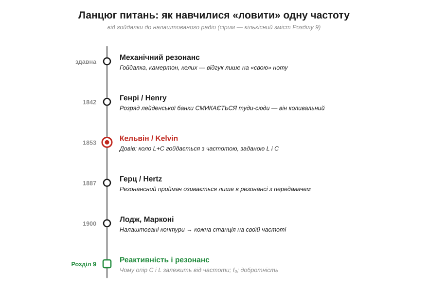
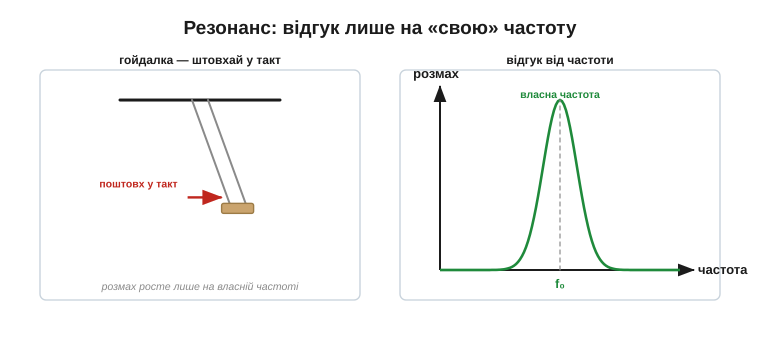
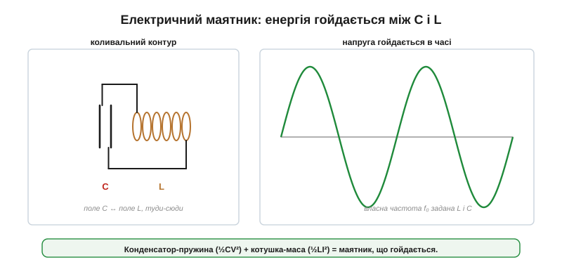
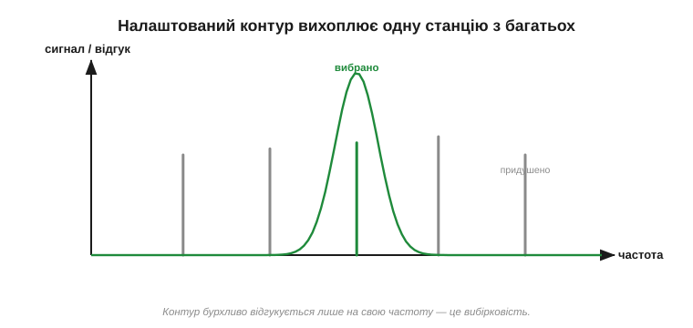
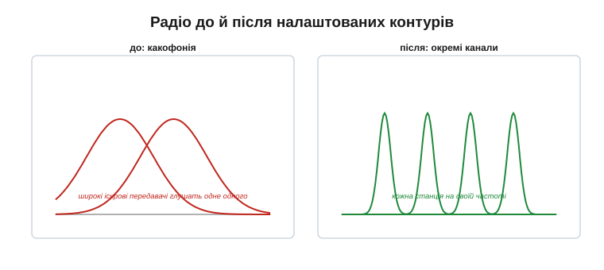

# 📜 Налаштований контур: як навчилися «ловити» одну частоту

Ця історія веде **ланцюгом питань** навколо одного дива, яке ми звикли не помічати: як радіоприймач вихоплює з ефіру **одну** станцію з-поміж сотень, що звучать одночасно? Відповідь — **резонанс** (*resonance*), а точніше **налаштований контур** із котушки й конденсатора. І за цим простим колом стоїть шлях від гойдалки на дитячому майданчику до патентних воєн на зорі радіо.

Повітря навколо вас просто зараз напхане радіохвилями: десятки FM-станцій, Wi-Fi, мобільний зв'язок, Bluetooth — усе разом, в одному просторі. Та коли ви крутите ручку приймача, з цієї какофонії раптом виринає **одна** чиста станція. Як таке можливо? Це не фільтр-сито й не хитрий комп'ютер — це фізичне явище, старе як гойдалка: коло, що відгукується лише на **свою** частоту. Пройдімо шлях, яким люди дійшли від «дивно, воно само розгойдується» до радіо, що вміє слухати один голос у натовпі.

*Кожен щабель — нове питання. Чому речі відгукуються лише на «свою» ноту? → Чи може коло мати свою ноту? → Як упіймати в ефірі одну хвилю? → Звідки в радіо ручка налаштування? Сірим — те, що стане кількісним змістом теми: реактивність, f₀, добротність.*

---

## Своя нота: резонанс у механіці

Почнімо здалеку — з явища, яке кожен відчував тілом. Штовхаючи дитину на гойдалці, ви помітили: якщо підштовхувати **в такт** її гойданню, розмах швидко росте; а якщо абияк — гойдалка лише збивається. У гойдалки є **своя** частота, і вона жадібно бере енергію саме на ній, а на чужому ритмі — майже ні. Це і є той самий **резонанс**.

*Гойдалку розгойдує лише штовхання в її власному ритмі; камертон озивається на звук тільки своєї ноти; келих можна розбити голосом, поціливши в його частоту. Скрізь те саме: система має власну частоту й бурхливо відгукується лише на неї.*

Прикладів безліч. Камертон починає гудіти сам, коли поруч звучить **його** нота, — і мовчить на будь-якій іншій (співзвучність). Оперна співачка може розбити келих голосом, якщо влучить точно в його власну частоту. Міст може розхитатися до руйнування, якщо вітер чи крок солдатів збігся з його резонансом. Галілей ще на межі XVI–XVII століть помітив, що навіть важкий маятник можна розгойдати дрібними поштовхами — аби в такт. Висновок, який природа повторювала тисячі разів: **у багатьох систем є власна частота, і на ній вони відгукуються незрівнянно сильніше**.

Чому це взагалі працює? Бо в такій системі є **два сховища енергії**, між якими вона гойдається: у гойдалки — висота (потенціальна енергія) і рух (кінетична); у камертона — згин зубців і їхня швидкість. Енергія перетікає з одного сховища в інше й назад із певним темпом — це і є власна частота. Підштовхуючи **в такт** із нею, ви щоразу додаєте крихту енергії в потрібну мить, і коливання росте; б'ючи невпопад — то додаєте, то віднімаєте, і нічого не виходить. Запам'ятаймо це: **два сховища енергії й перетікання між ними** — рецепт коливань. Лишалося запитати: а чи має таку пару сховищ електричне коло?

> 🔧 **Навіщо це.** Резонанс — двосічний меч, і це варто тримати в голові. З одного боку, він дозволяє **вихопити** слабкий сигнал на потрібній частоті (радіо, давачі, кварцові годинники). З іншого — небажаний резонанс руйнує: розхитує конструкції, дзвенить у живленні, свистить у підсилювачах. Інженер усе життя то **ловить** корисний резонанс, то **гасить** шкідливий — і для обох потрібно розуміти ту саму фізику.

---

## Чи може коло мати свою ноту?

Тепер вирішальне питання. Є два компоненти, що **запасають енергію**: [конденсатор](topic:hw-components/capacitor) тримає її в електричному полі, а [котушка](topic:ph-electromagnetism/inductor-coil) — у магнітному. А що, як з'єднати їх разом? Виявляється, заряджений конденсатор, замкнений на котушку, не просто розряджається — він **гойдається**.

Перший натяк дав француз **Фелікс Саварі** (*Félix Savary*) ще **1827 року**: за тим, як розряд лейденської банки крізь дротяну петлю намагнічував сталеві голки то в один бік, то в інший (залежно від відстані), він виснував, що розряд має бути **коливальним**, а не однонапрямним. Згодом, у 1830-х–40-х, цей дослід повторив і поглибив **Джозеф Генрі** (*Joseph Henry*): розряджаючи банку, він теж бачив, що вона намагнічує голки змінно, ніби струм **смикається туди-сюди**. Розряд справді виявився **коливальним**. Строго це довів **Вільям Томсон** (*William Thomson*), згодом лорд **Кельвін**, **1853 року**: він показав математично, що коло з котушки й конденсатора розряджається не монотонно, а **коливається** з певною частотою, заданою величинами L і C. А **1859 року** **Феддерсен** (*Feddersen*) сфотографував іскру розряду в обертовому дзеркалі — і на знімку та розтяглася в низку згасних спалахів, наочно підтвердивши коливання.

*Заряджений конденсатор віддає енергію котушці (поле наростає), та повертає її назад (тепер заряджаючи конденсатор у протилежний бік), і так туди-сюди. Енергія гойдається між **електричним** полем (C) і **магнітним** (L) — точнісінько як у маятнику між потенціальною і кінетичною. Звідси й власна частота кола.*

Ось де чудово сходяться два знайомі компоненти. [Конденсатор](topic:ph-electromagnetism/capacitor-energy) — це «електрична пружина» (запасає ½·C·V²), а [котушка](topic:ph-electromagnetism/inductor-energy) — «електрична інерція», маховик струму (запасає ½·L·I²). З'єднайте пружину з масою — і отримаєте **маятник**, що гойдається. Так само конденсатор із котушкою утворюють **електричний маятник**: енергія перетікає з поля конденсатора в поле котушки й назад, раз за разом. Це і є **коливальний контур** (*resonant circuit*, або LC-контур). Його власна частота — це [**резонансна частота**](topic:hw-analog/lc-resonance) f₀: більші L чи C — повільніше гойдання, нижча частота; менші — швидше, вища. Коло справді має свою ноту.

Чому ж коливання згасає, а не триває вічно? Бо в реальному колі є **опір** — він потроху перетворює енергію на тепло, як тертя гасить маятник. Що менший опір, то довше дзвенить контур і то «чистіша» його нота. Цю якість — наскільки добре контур тримає коливання — називають [**добротністю**](topic:hw-analog/quality-factor) Q; вона ж визначає, наскільки **гостро** контур вибирає свою частоту з-поміж сусідніх. Ідеальний контур без опору гойдався б вічно; реальний дзвенить від кількох коливань до мільйонів, залежно від втрат.

> 🔧 **Навіщо це.** Коливальний LC-контур — серце незліченних пристроїв: він задає частоту радіопередавача, виділяє станцію в приймачі, тактує безконтактні картки й бездротові зарядки. А коли потрібна **дуже** точна й стабільна частота (годинник, процесор), замість котушки з конденсатором беруть кварцовий кристал — механічний резонатор із фантастично високою добротністю, що тримає свою ноту стабільніше за будь-який LC. Принцип той самий — власна частота системи, — лише носій інший.

---

## Герц ловить хвилю своїм контуром

Коливальний контур виявився не лабораторною цікавинкою, а ключем до радіо. **1887 року** **Генріх Герц** (*Heinrich Hertz*) уперше згенерував і впіймав **електромагнітні хвилі** — і зробив це саме резонансними контурами. Передавач — іскровий проміжок у контурі, що дзвенів на своїй частоті; приймач — простий дротяний виток із проміжком, який давав іскорку лише тоді, коли був **налаштований у резонанс** із передавачем. Зміни розмір приймального витка — і він глухне; повернеш у резонанс — знову відгукується.

Це був перший доказ, що резонанс дозволяє **вибрати** конкретну хвилю. Дослід Герца — це, по суті, гойдалка, тільки електрична й на відстані: передавач «штовхав» простір своїми коливаннями певної частоти, а приймальний контур, налаштований на ту саму частоту, розгойдувався у відповідь і давав іскру; розладнаний — мовчав. Уперше стало видно, що хвилю можна не лише випромінити, а й **вибірково впіймати** резонансом.

Сама історія електромагнітних хвиль — як Максвелл їх передбачив, а Герц упіймав — це окрема велика тема; тут важливий лише висновок Герца: налаштований контур відгукується на свою частоту й мовчить на чужій, навіть коли йдеться про хвилі в порожнечі.

---

## Лодж, Марконі і кінець какофонії

Раннє радіо мало ганебну ваду: іскрові передавачі гриміли по **всьому** діапазону одразу, як удар по всіх клавішах піаніно. Кілька станцій в одному місті глушили одна одну — слухати щось одне було неможливо. Розв'язок був той самий — **резонанс**.

Англієць **Олівер Лодж** (*Oliver Lodge*) у 1890-х розробив **синтонію** (*syntony*, від грецького «співзвучність») — налаштування передавача й приймача на **спільну** частоту, щоб вони «чули» одне одного й не зважали на решту. А **Ґульєльмо Марконі** (*Guglielmo Marconi*) **1900 року** оформив знаменитий патент **№ 7777** («чотири сімки») на налаштовані контури, що дозволяли кільком станціям працювати поряд, не заважаючи. Це була революція: ефір із суцільного шуму перетворювався на безліч окремих «каналів».

Чому це було таким проривом? Перші іскрові передавачі випромінювали **широку** смугу частот — будь-який приймач чув усіх одразу, як у кімнаті, де всі кричать. Дві станції в одному місті означали суцільну кашу. Налаштовані контури звузили і випромінювання передавача, і чутливість приймача до **вузької** смуги — і раптом у тій самій кімнаті кожен зміг говорити «своїм голосом», а слухач — обирати, кого слухати. Боротьба за пріоритет цього винаходу (Лодж, Марконі, Тесла, а також **Джон Стоун Стоун**) тяглася в судах роками: ставкою було все майбутнє радіо.

*В ефірі — багато сигналів різних частот водночас. Налаштований контур бурхливо відгукується лише на **одну**, свою частоту, а решту майже не помічає. Це **вибірковість** (*selectivity*) — здатність вибрати один сигнал із багатьох.*

*До налаштованих контурів іскрові передавачі гриміли широко й глушили одне одного — какофонія. Після (Лодж, Марконі) кожна станція сиділа на своїй частоті, а приймач, налаштований у резонанс, брав лише її. Так радіо стало придатним для багатьох станцій.*

Хто саме «винайшов» налаштування — Лодж, Марконі, Тесла (його резонансний трансформатор, «котушка Тесли», теж був налаштованим контуром) чи **Джон Стоун Стоун** — стало предметом довгих патентних суперечок. Показово, що **Верховний суд США 1943 року** (та сама справа *Marconi v. United States*) визнав широкі «налаштувальні» претензії Марконі недійсними, бо їх **випередили** патенти Лоджа, Стоуна й Тесли. Але фізика в усіх була одна: **коло з L і C має власну частоту, і на ній воно відгукується незрівнянно сильніше**.

---

## Ручка, що ловить станцію

Лишалося питання зручності: як **перемикатися** між станціями? Якщо власна частота контуру задана величинами L і C, то досить зробити одну з них **змінною** — і частоту можна плавно зсувати, ловлячи різні станції. Так народилася **ручка налаштування**: за нею найчастіше стояв **змінний конденсатор** (пластини, що засуваються одна між одну, плавно міняючи ємність) або котушка зі змінним осердям.

Коли ви крутили коліщатко старого радіо, ви фізично міняли ємність контуру — і його резонансна частота повзла діапазоном, по черзі збігаючись із кожною станцією. У ту мить, коли f₀ контуру збігалася з частотою станції, та виринала гучно й чисто, а сусідні стихали. Це й є та сама вибірковість, лише керована вашою рукою.

Як працював той змінний конденсатор? Набір нерухомих пластин і набір рухомих, що засувалися між них; повертаючи ручку, ви міняли площу їхнього перекриття, а отже, [ємність](topic:ph-electromagnetism/capacitance) — і резонансна частота контуру плавно повзла діапазоном. Той самий принцип «дві обкладки з повітрям між ними», лише з керованою площею. Ось чому в старих приймачах за ручкою налаштування ховалася велика ажурна коробочка з блискучих пластин.

> 🔧 **Навіщо це.** Хоч сучасні приймачі давно цифрові, ідея жива всюди: щоб вибрати частоту, налаштовують резонансний контур. На ній стоять не лише радіо, а й безконтактні картки (RFID відгукується на свою частоту), бездротові зарядки, кварцові генератори (де роль контуру грає кристал зі своєю точною «нотою»), смугові фільтри в кожному передавачі. «Налаштувати на частоту» — це майже завжди десь усередині «звести резонанс контуру до потрібної».

---

## Що з цього лишилось

Озирнімося на цей ланцюг. Людство пройшло від спостереження, що гойдалка любить свій ритм, до кола, яке вміє вибрати один голос із тисяч, — і за цим стоять кілька понять, у які варто вдивитися окремо:

- **резонанс** — те, що гойдалка, камертон і LC-контур мають спільного: власну частоту, на якій відгук найсильніший;
- **коливальний контур** із котушки й конденсатора — «електричний маятник», у якому енергія гойдається між полями [електричної «пружини»](topic:hw-components/capacitor) і магнітної «інерції»;
- [**резонансна частота**](topic:hw-analog/lc-resonance) f₀, задана величинами L і C;
- **вибірковість** і [**добротність**](topic:hw-analog/quality-factor) — гострота відгуку, від якої залежить, наскільки чисто контур виділяє свою станцію;
- **ручка налаштування** — змінний конденсатор, що зсуває f₀.

А головне: і конденсатор, і котушка по-різному ставляться до **частоти**. Саме в тому, як їхній «опір» залежить від того, швидко чи повільно міняється сигнал, і ховається вся магія резонансу: ця частотна залежність робить контур вибірковим, а ручку налаштування — дієвою. Власне, без неї не було б ані власної ноти кола, ані здатності вихопити одну станцію з ефіру.
