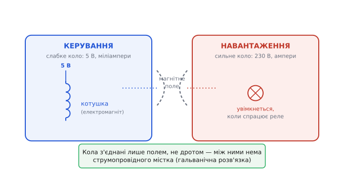
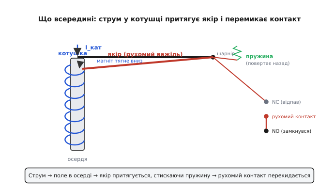
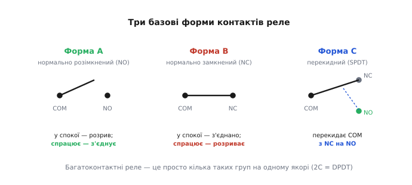
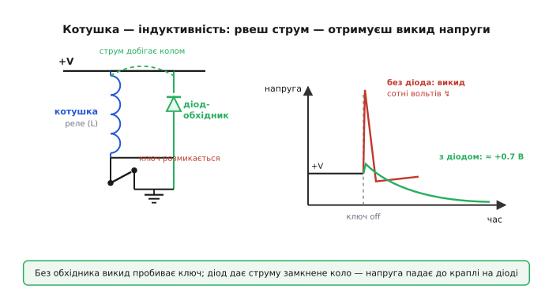

# Реле

Уявіть просту, але неприємну задачу. У вас є мікроконтролер, що живиться від 5 вольтів і віддає на виводі якісь міліампери струму. А вам треба, щоб за його командою ввімкнувся обігрівач від мережі — 230 вольтів, кілька ампер. Просто з'єднати дротом вивід контролера й мережу не можна: ці два світи несумісні. Малий слабкий сигнал не подужає велике навантаження, а велика небезпечна напруга, потрапивши на ніжку контролера, миттю його спалить, та ще й під рукою людини. Потрібен посередник, який бере крихітну команду з одного боку — і власними силами замикає потужне коло з іншого, **не пускаючи між ними жодного спільного дроту**.

Саме це робить **реле** (фр. *relais*, від *relayer* — «міняти на свіже»; так на поштових станціях підставляли свіжих коней замість стомлених — естафета сили). Реле — це керований електрикою вимикач: подаєш слабкий струм на його вхід, і всередині фізично перемикається окремий контакт у сильному колі. Один світ керує іншим через спільне лише магнітне поле, а не через провід.


*Реле як посередник: ліворуч слабке коло керування (вольти, міліампери), праворуч потужне навантаження (сотні вольтів, ампери). Місток між ними — магнітне поле, а не дріт, тож кола електрично розв'язані.*

## Навіщо потрібен саме такий посередник

Здавалося б, перемкнути навантаження можна й транзистором — він теж керований ключ. Часто так і роблять. Але транзистор має дві межі, яких реле не має, і саме вони пояснюють, чому реле досі живе.

Перша межа — **гальванічна розв'язка** (від прізвища Ґальвані; означає, що між двома колами немає спільного струмопровідного шляху). У транзистора керувальне коло та комутоване мають спільну точку — землю; струм керування й струм навантаження течуть тими самими провідниками. Якщо в навантаженні стрибне напруга чи вріже завада, вона піде назад у керувальну схему. Реле такого шляху не дає взагалі: котушка й контакти — це дві окремі деталі, між якими лише повітря й магнетизм. Хоч 1000 вольтів на контактах — на вхід вони не пролізуть.

> 🔧 **Навіщо це.** У промисловій автоматиці реле часто стоїть саме як «стіна» між тендітною цифрою й брудною силовою частиною. Контролер за 5 вольтів дає команду, реле замикає двигун на 380 вольтів — і будь-який сплеск, іскра чи наведення з силового боку лишаються по той бік стіни. Без цієї розв'язки одна аварія в навантаженні вбивала б керувальну плату.

Друга межа — **байдужість до роду струму й форми сигналу**. Замкнений металевий контакт реле — це просто шматок металу, що торкнувся іншого шматка. Йому однаково, постійний струм тече чи змінний, у який бік, яка частота, чи це взагалі аналоговий сигнал. Транзистор натомість має полярність, падіння напруги у відкритому стані, нелінійність. Тому реле спокійно комутує і змінну мережу, і високовольтну напругу, і слабесенький вимірювальний сигнал, який не можна спотворити — те, з чим напівпровідниковому ключу впоратися важче.

Ціну за це теж видно одразу: реле має рухомі частини, тож воно повільне (типово мілісекунди на спрацювання), клацає, зношується й не вмикається мільйони разів за секунду. Де треба швидко й часто — беруть [твердотільне реле](root:hw-power/solid-state-relay) (без механіки, на напівпровідниках) або просто транзистор; де треба надійна розв'язка й байдужість до сигналу — електромеханічне реле досі поза конкуренцією.

## Як це влаштовано: магніт тягне важіль

Усередині реле — два майже не зв'язані механізми, з'єднані одним рухомим важелем. Розберімо за течією подій.

Перший механізм — **електромагніт**. На залізне осердя (від *осердя* — те, що в серцевині) намотана котушка тонкого дроту. Поки струму немає, осердя — звичайна залізяка. Щойно крізь котушку пускають струм, навколо неї виникає магнітне поле, осердя намагнічується й починає притягувати все залізне поблизу. Чим більший струм у котушці, тим сильніший магніт — це ключ до всього.

Поряд із осердям на пружному шарнірі сидить **якір** (від *якір* — бо він гойдається, як судно на якорі) — рухома залізна пластинка-важіль. У спокої її відтягує вбік слабенька **пружина повернення**. Коли котушка намагнічується, магнітне притягання пересилює пружину й **притягує якір до осердя**. Якір повертається на шарнірі — і своїм рухом перемикає **контакти** у силовому колі. Вимкнули струм котушки — поле зникає, пружина відкидає якір назад, контакти повертаються у вихідний стан. Уся робота реле — це перетворення «є струм / нема струму» у «замкнуто / розімкнуто», через одну механічну ланку.


*Внутрішня механіка реле. Струм у котушці намагнічує осердя; магніт притягує якір-важіль, долаючи пружину повернення; рух якоря перекидає рухомий контакт із одного нерухомого на інший. Зник струм — пружина повертає все назад.*

Зверніть увагу на причинно-наслідковий ланцюжок, бо в ньому захована вся поведінка реле: **струм котушки → сила магніту → подолання пружини → перекид контакту**. Звідси одразу видно дві важливі речі. По-перше, реле спрацьовує не за будь-якого струму, а лише коли магніт переборе пружину — є поріг. По-друге, відпускає воно за меншого струму, ніж спрацьовує: притягнутий якір уже близько до осердя, де поле сильніше, тож тримається навіть тоді, коли струм трохи впав. Цю «затримку» між порогом спрацювання й порогом відпускання називають **гістерезисом** (гр. *hystéresis* — відставання), і вона корисна: реле не «дрижить» біля межі.

## Форми контактів: що саме перемикається

Контакт реле — це пара металевих площадок, які або торкаються (коло замкнене), або ні. Але площадок може бути по-різному, і від цього залежить логіка вмикання. Три базові варіанти знати обов'язково.

**Нормально розімкнений** (англ. *normally open*, **NO**) — у спокої коло розірване, реле спрацьовує й **замикає** його. Так умикають навантаження: нема команди — нема струму в навантаженні.

**Нормально замкнений** (англ. *normally closed*, **NC**) — навпаки: у спокої коло з'єднане, реле спрацьовує й **розриває** його. Так роблять аварійне вимкнення: поки система жива й тримає струм на котушці — коло замкнене; зникло живлення керування — реле саме розімкне навантаження.

**Перекидний контакт** (англ. *single-pole double-throw*, **SPDT**) поєднує обидва: є спільний вивід (COM) і два нерухомі — NO та NC. Рухомий контакт у спокої лежить на NC, а спрацювавши, **перекидається** на NO. Тобто реле не просто вмикає чи вимикає, а **перемикає** навантаження з одного кола на інше.


*Три базові форми контактів. Форма A (NO) у спокої розімкнена; форма B (NC) у спокої замкнена; форма C (перекидна, SPDT) перекидає спільний вивід COM з контакту NC на NO. Складніші реле — це кілька таких груп на одному якорі.*

Ці три типи інженери часто звуть за старою телеграфною традицією: **форма A** (NO), **форма B** (NC), **форма C** (перекидна). А якщо на одному якорі сидить дві однакові групи, що перемикаються разом, — це **двополюсне** реле (DPDT, «2C»): одним рухом комутуються два незалежні кола, наприклад обидва дроти двополюсної мережі заразом.

## Котушка й контакти: на що дивитися в характеристиках

Реле описують двома наборами чисел — окремо для входу (котушки) і для виходу (контактів), бо це фізично різні кола.

З боку **котушки** головне — її **робоча напруга** (5, 12, 24 вольти — типові) і **струм** (звідси й потужність керування). Котушка має сталий опір, тож струм рахується законом Ома без жодних хитрощів. Звідси одразу видно, чи потягне ваш керувальний вузол це реле напряму, чи потрібен підсилювач струму.

**Worked-приклад: чи витягне ніжка контролера котушку.** Реле на 5 В з опором котушки 125 Ом. Чи можна керувати ним прямо з виводу мікроконтролера?

```
I_кат = U / R
I_кат = 5 / 125
I_кат = 0.040 А = 40 мА
```

Сорок міліампер — це забагато: типова ніжка контролера віддає щонайбільше 20 мА, а часто менше. Висновок: напряму не можна, котушку треба вмикати через [транзистор-драйвер](root:hw-motion/relay-driver), а ніжка хай лише керує транзистором. Перевіримо це в коді ще до паяння:

:::tabs
```c
// Чи можна живити котушку прямо з GPIO, чи потрібен драйвер?
// Усе у вольтах та омах; струм — в амперах.
int relay_needs_driver(float u_coil, float r_coil, float gpio_max_ma)
{
    float i_coil_ma = (u_coil / r_coil) * 1000.0f;   // струм котушки, мА
    return i_coil_ma > gpio_max_ma;                  // 1 → треба транзистор
}
// relay_needs_driver(5.0f, 125.0f, 20.0f) -> 1 (40 мА > 20 мА, потрібен драйвер)
```
```python
# Чи можна живити котушку прямо з GPIO, чи потрібен драйвер?
# Усе у вольтах та омах; струм — в амперах.
def relay_needs_driver(u_coil, r_coil, gpio_max_ma):
    i_coil_ma = (u_coil / r_coil) * 1000.0            # струм котушки, мА
    return i_coil_ma > gpio_max_ma                    # True → треба транзистор


# relay_needs_driver(5.0, 125.0, 20.0) -> True (40 мА > 20 мА, потрібен драйвер)
```
:::

З боку **контактів** головне — **гранична напруга** й **граничний струм**, які вони можуть комутувати, не згоряючи. Тут є підступ: припустимий струм для змінного й постійного навантаження різний, і для постійного зазвичай **набагато менший**. Причина — електрична дуга (іскра): коли контакти розмикаються під навантаженням, між ними проскакує іскра. Змінний струм 50 разів на секунду сам проходить через нуль, і дуга в цю мить гасне; постійний струм через нуль не проходить ніколи, тож дуга тягнеться, випалює метал контактів і може їх **приварити** одне до одного. Тому в даташиті ви побачите окремі рядки на кшталт «10 А при 250 В змінного» і «5 А при 30 В постійного» — і це не помилка.

> 🔧 **Навіщо це.** Якщо взяти реле, розраховане на змінну мережу, і ним комутувати потужне постійне навантаження (скажімо, акумулятор на двигун), контакти швидко обгорять, а в гіршому разі зваряться в замкненому стані — і навантаження вже не вимкнеться командою. Тому для постійного силового кола або беруть реле з належним постійним рейтингом, або гасять дугу спеціально. Розрахунок реле «на струм» без огляду на рід струму — класична причина пожежі в саморобці.

Коли потрібні дуже великі струми — десятки й сотні ампер, потужні двигуни, цілі лінії — застосовують старшого родича реле: **контактор**. Це те саме за принципом, але збудоване на велику потужність: масивні контакти з гасінням дуги, котушка під сильне поле, зазвичай лише нормально розімкнені силові контакти плюс кілька слабких допоміжних для логіки. Межа між «реле» й «контактором» розмита, та орієнтир простий: приблизно до десятка ампер — реле, понад те й для двигунів — контактор.

## Пастка котушки: викид напруги при вимиканні

Є одна річ, через яку реле найчастіше вбиває керувальну схему, і обійти її треба завжди. Котушка реле — це **індуктивність**: вона запасає енергію в магнітному полі, поки тече струм. А індуктивність має вперту властивість — вона **опирається будь-якій зміні струму крізь себе**. Поки струм тече рівно, усе спокійно. Але в мить, коли ви розмикаєте ключ і обриваєте струм, поле починає різко спадати, і котушка, намагаючись утримати струм, **сама генерує напругу** — тим більшу, чим різкіше рветься струм. Цей зворотний сплеск називають [протиЕРС](root:hw-motion/back-emf) (проти-електрорушійна сила: котушка стає миттєвим джерелом напруги, спрямованої проти змін).

Біда в тому, наскільки цей сплеск великий. Розмикання транзистором триває мікросекунди, струм рветься майже миттєво — і навіть скромна котушка на 12 чи 24 вольти видає викид у **десятки, а то й сотні вольтів** зворотної полярності. Цей удар прикладається саме до ключа, який щойно розімкнувся, — і легко пробиває транзистор або ніжку контролера, чий поріг лежить далеко нижче. Реле комутує спокійно роками, а потім раптом «вмирає» драйвер — майже завжди це непогашений викид.


*Чому потрібен діод-обхідник. Зверху без захисту: розрив струму дає викид на сотні вольтів, що пробиває ключ. Знизу з діодом, увімкненим зустрічно паралельно котушці: при викиді він відкривається, дає струму замкнене коло крізь себе, і напруга падає до краплі (≈ 0.7 В) на діоді.*

Лікують це елегантно — одним **діодом-обхідником** (його ще звуть зворотним, гасильним або «вільнобіжним»), увімкненим **зустрічно паралельно котушці**. Поки реле працює, діод стоїть під зворотною напругою й нічого не проводить, його ніби немає. Та в мить розмикання полярність на котушці перевертається, діод відкривається — і дає струмові, що його котушка вперто проштовхує, **замкнене коло крізь себе**. Енергія поля тихенько розсіюється по колу «котушка → діод», а напруга на ключі ніколи не підскакує вище, ніж падіння на відкритому діоді — близько 0.7 вольта замість сотень. Підмикання діода — обов'язковий ритуал при будь-якій котушці: реле, соленоїд, клапан, двигун.

> 🔧 **Навіщо це.** Правило для прошивника й схемотехніка коротке: **бачиш котушку — став обхідний діод**, катодом (смужкою) до плюса живлення котушки, анодом до боку, який рве ключ. Це копійчана деталь, що рятує дорогий драйвер і весь вузол. Пропустити її — означає закласти бомбу сповільненої дії: усе працює на столі, а в полі за тижні-місяці драйвери починають вибивати від накопиченого зносу.

## Звідки реле взялося й чому це важливо

Реле — не просто зручний вимикач; історично воно стало однією з найважливіших цеглинок усієї електроніки. Винайшли його в епоху телеграфу, щоб **підсилювати слабкий сигнал у довгій лінії**: на проводі за сотні кілометрів струм згасав до кволого, нездатного клацнути приймач, тож на проміжній станції цей кволий струм живив котушку реле, а свіже сильне коло вже передавало сигнал далі — естафета, точнісінько як свіжі коні на поштовій станції, звідки й назва. Та сама ідея — слабкий вхід керує сильним виходом — це ж визначення підсилення; а реле, що вмикає інше реле, — це вже логічний елемент, з яких збирали перші релейні обчислювальні машини. Як саме телеграфна потреба породила реле, хто й коли його зробив і чому цей перемикач став прабатьком цифрової логіки — у [короткій історії реле](root:hw-components/relay/hist-telegraph-relay.md): від електромагніта Стерджена до релейних комп'ютерів, з обережним розбором, що тут усталений факт, а що — пізніший переказ самих учасників.

Тримаючи в голові цей ланцюжок — слабке керує сильним, кола розв'язані, контакт байдужий до сигналу, але котушку треба гасити діодом — ви розумієте реле не як чорну коробку, а як просту й чесну машинку: магніт тягне важіль, важіль перемикає метал. Усе інше — деталі цієї однієї думки.
