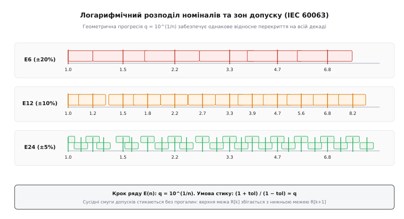
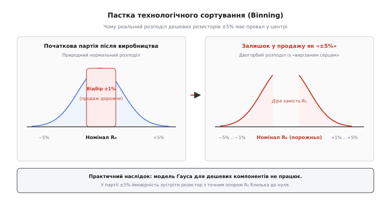
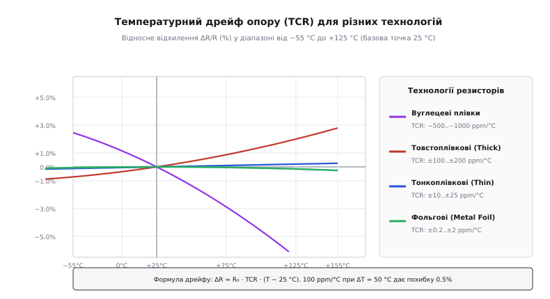
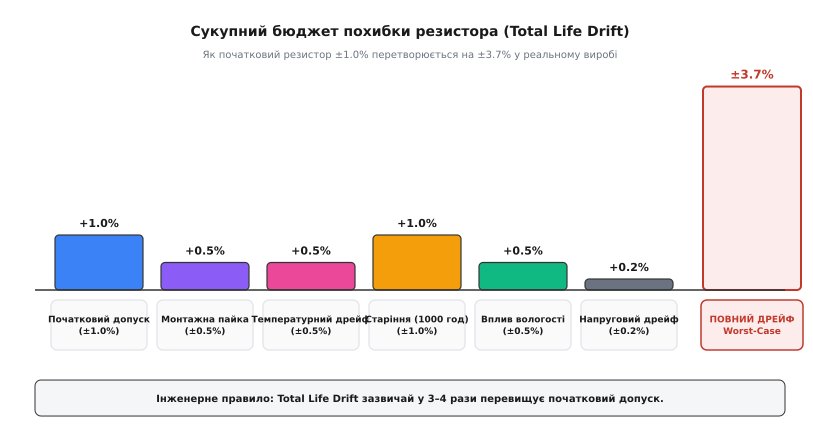
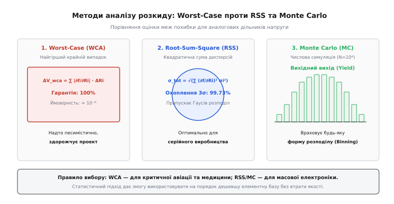
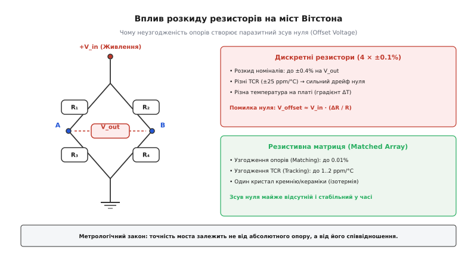

# Допуск і розкид резисторів

<preknowlist>
- [Закон Ома](root:hw-analog/ohms-law) — напруга, струм та опір у лінійному електричному колі.
- [Дільник напруги](root:hw-analog/voltage-divider) — коефіцієнт передачі двох послідовних резисторів.
- [Міст Вітстона](root:hw-sensing/wheatstone-bridge) — вимірювання малих змін опору в диференціальному включенні.
- [Резистор](root:hw-components/resistor) — конструкція, допустима потужність і розсіювання тепла.
- [Точність за частотою та одиниці ppm](root:hw-components/frequency-accuracy-ppm) — розрахунок відносних часток на мільйон.
- [Математичне сподівання та дисперсія](root:math-probability/mean-variance) — числові характеристики розподілу випадкових величин.
- [Центральна гранична теорема](root:math-probability/central-limit) — збіжність суми незалежних похибок до нормального розподілу Гауса.
</preknowlist>

Розробник створює джерело опорної напруги 2.500 В для 16-розрядного аналого-цифрового перетворювача (АЦП) із шини живлення 5.000 В. Для цього він ставить резистивний дільник із двох звичайних резисторів номіналом 10.0 кОм із маркованим класом точності 1 %. Здавалося б, схема має дати рівно половину напруги живлення. Проте лабораторний вольтметр показує на виході 2.525 В. Похибка становить 25 мВ, що для 16-бітної шкали з ціною молодшого розряду (LSB) 76 мкВ дорівнює **328 розрядам похибки** ще до того, як прилад торкнувся вимірюваного сигналу.

Коли зібрана плата нагрівається всередині корпусу приладу від кімнатної температури 25 °C до робочих 75 °C, дешеві товстоплівкові резистори з температурним коефіцієнтом 100 ppm/°C дрейфують ще на 0.5 %. Монтажна пайка додала термоудар на 0.5 %, а за рік роботи в умовах вологості опір зміщується ще на 1.0 %. Початковий дільник із деталей «1 %» у реальному виробі дає сукупний дрейф понад 3.5 %, перетворюючи прецизійний вимірювальний прилад на генератор випадкових чисел.

Опір реального резистора ніколи не є фіксованим математичним числом. Це випадкова величина, яка формується технологічними допусками на заводі, тепловими коливаннями кристалічної ґратки, механічними деформаціями друкованої плати та незворотними процесами хімічного старіння матеріалу.

---

### Чому не можна замовити «будь-який» опір: математика рядів E

У теоретичних розрахунках інженер може отримати будь-яке числове значення: наприклад, дільник вимагає опір 3.847 кОм. Проте відкривши складський каталог, він знаходить найближчі номінали 3.6 кОм, 3.9 кОм або прецизійний 3.83 кОм.

Причина полягає в принциповій неможливості та економічній безглуздості виготовлення безперервної шкали номіналів. Якби фабрика випускала резистори з лінійним кроком у 1 Ом або 10 Ом, склади були б захаращені мільйонами найменувань. При цьому для опору 10 Ом крок в 1 Ом дає відносну зміну 10 %, а для опору 1 МОм той самий крок в 1 Ом становить мізерні 0.0001 %, які тонуть у тепловому шумі.

Система номіналів має забезпечувати **однакову відносну роздільну здатність** на будь-якій ділянці шкали — від десятих часток ома до десятків мегаом. Цю задачу вирішує логарифмічний розподіл за стандартом **IEC 60063**, що базується на геометричній прогресії.


*Логарифмічний розподіл номіналів рядів E6, E12 та E24. Смуги виробничого допуску сусідніх номіналів стикаються своїми крайніми межами без розривів на всій декаді завдяки знаменнику геометричної прогресії q = 10^(1/n).*

У рядах номіналів кожен десятикратний інтервал (декада, наприклад від 1.0 до 10.0 кОм) розбивається на `n` інтервалів із постійним знаменником геометричної прогресії `q`:

```
q = 10^(1/n)
```

Номер ряду `E` прямо вказує на кількість номіналів усередині однієї декади:

1. **Ряд E6 (допуск ±20 %):** `n = 6`, крок `q = 10^(1/6) ≈ 1.468`. Номінали декади: 1.0, 1.5, 2.2, 3.3, 4.7, 6.8.
2. **Ряд E12 (допуск ±10 %):** `n = 12`, крок `q = 10^(1/12) ≈ 1.212`. Номінали: 1.0, 1.2, 1.5, 1.8, 2.2, 2.7, 3.3, 3.9, 4.7, 5.6, 6.8, 8.2.
3. **Ряд E24 (допуск ±5 %):** `n = 24`, крок `q = 10^(1/24) ≈ 1.101`. Номінали містять 24 значення на декаду.
4. **Ряд E48 (допуск ±2 %):** `n = 48`, крок `q = 10^(1/48) ≈ 1.049`.
5. **Ряд E96 (допуск ±1 %):** `n = 96`, крок `q = 10^(1/96) ≈ 1.024` (тризначні мантиси).
6. **Ряд E192 (допуск ±0.5 %, ±0.25 %, ±0.1 %):** `n = 192`, крок `q = 10^(1/192) ≈ 1.012`.

Математичний зв'язок між допуском (англ. *tolerance*, від лат. *tolerare* — витримувати, терпіти) і кількістю номіналів у ряді підпорядковується **умові безперервного покриття діапазону**. Верхня межа допуску поточного номіналу `R[k]` мусить збігатися з нижньою межею допуску наступного номіналу `R[k+1]`:

```
R[k] · (1 + tol) = R[k+1] · (1 − tol)
```

Оскільки за означенням геометричної прогресії `R[k+1] / R[k] = q = 10^(1/n)`, отримуємо строге співвідношення між допуском і кількістю ступенів:

```
(1 + tol) / (1 − tol) = 10^(1/n)
```

Підставивши для ряду E12 значення `tol = 0.10` (±10 %):

```
(1 + 0.10) / (1 − 0.10)
= 1.10 / 0.90         [підставили tol = 0.10]
= 1.222...            [обчислили частку]
≈ 10^(1/12)           [збігається з кроком ряду E12: 10^(1/12) ≈ 1.212]
```

Це доводить: якщо фабрика виготовляє резистори з випадковим розкидом ±10 %, то розклавши готову продукцію по 12 номіналах ряду E12, вона не викине в брак жодного виробу — будь-який опір знайде своє місце у смузі одного з номіналів.

Про те, як цей математичний принцип виник із логістики повітроплавних дирижаблів XIX століття та перетворився на міжнародний стандарт, детально описано в історичній вставці [Від канатів Ренара до стандарту IEC 60063](root:hw-components/resistor-tolerance/hist-renard-iec60063.md).

> 🔧 **Навіщо це.** Якщо ви розрахували опір 2.87 кОм, не намагайтеся знайти такий номінал у дешевому ряді E24. Найближчі варіанти — 2.7 кОм або 3.0 кОм. Щоб отримати саме 2.87 кОм без підрядного підбору, переходять до ряду E96, де є стандартний заводський номінал 2.87 кОм (маркування «2871» або «45B»).

---

### Класи точності та технологічна пастка сортування (Binning)

У документації на резистори зазначають клас початкового допуску: ±20 %, ±10 %, ±5 %, ±1 %, ±0.5 %, ±0.1 %, ±0.05 %, ±0.01 %. Більшість інженерів-початківців помилково вважають, що якщо на корпусі написано «±5 %», то розподіл опорів у придбаній партії підпорядковується звичайному нормальному закону Гауса з вершиною точно на номіналі.

У реальному фабричному виробництві це не так.


*Технологічна пастка сортування (Binning). Автоматичний тестер вилучає з партії центральні прецизійні екземпляри (±1 %), залишаючи в партії ±5 % двогорбий залишок із нульовою ймовірністю точного номіналу.*

Коли конвеєр виготовляє партію товстоплівкових резисторів, вихідний технологічний розкид після спікання та первинного лазерного підганяння підпорядковується широкому нормальному розподілу. Далі партія проходить автоматичну станцію сортування (англ. *binning*):

1. Усі резистори, опір яких випадково потрапив у вузьке вікно **±1 %**, автоматично відбирають, маркують як прецизійні резистори E96 і продають за вищою ціною.
2. Екземпляри з відхиленням від ±1 % до ±2 % маркують як ряд E48.
3. Усі резистори, що залишилися в «хвостах» розподілу (від ±2 % до ±5 %), маркують як дешевий ряд E24 із допуском **±5 %**.

Внаслідок цього партія резисторів ±5 % надходить до споживача не з гаусовим куполом, а з **двогорбим розподілом із вирізаним центром**. Ймовірність знайти в такій стрічці резистор із точним опором `R₀` практично дорівнює нулю: більшість деталей матимуть відхилення або від −5 % до −2 %, або від +2 % до +5 %.

Розрахунок схем на таких компонентах за статистичною моделлю 3-сигма без урахування біннінгу призводить до масового браку на виробництві.

---

### Температурний коефіцієнт опору (TCR) і фізика резистивного шару

Початковий допуск визначає похибку виробу лише за кімнатної температури +25 °C у момент увімкнення. Як тільки крізь деталь починає протікати струм або змінюється температура навколишнього середовища, опір починає дрейфувати.

Інтенсивність цього дрейфу описує **температурний коефіцієнт опору** (англ. *Temperature Coefficient of Resistance*, TCR, від лат. *coefficiens* — той, що сприяє разом). Оскільки відносні зміни опору дуже малі, їх виражають у частках на мільйон на кожен градус Цельсія — **ppm/°C** (англ. *parts per million*):

```
1 ppm/°C = 0.0001 %/°C = 10⁻⁶ / °C
```

Формула зміни опору від температури:

```
ΔR = R₀ · TCR · (T − T₀)
```

де `T₀ = 25 °C` — стандартизована базова температура калібрування.

Якщо резистор має `TCR = 100 ppm/°C`, то при нагріванні від 25 °C до 75 °C (`ΔT = 50 °C`) його опір гарантовано зміститься на:

```
ΔR / R₀ = 100 · 10⁻⁶ · 50 = 5000 · 10⁻⁶ = +0.50 %
```

Для прецизійного резистора з допуском 0.1 % такий нагрів створює похибку, яка в **п'ять разів перевищує його власний номінальний допуск**.


*Залежність відносного відхилення опору ΔR/R від температури для чотирьох основних технологій виготовлення. Металофольгові резистори демонструють практично нульовий параболічний дрейф у робочому діапазоні.*

Величина і знак TCR безпосередньо залежать від фізичної природи матеріалу та механізму руху електронів крізь резистивний шар:

1. **Вуглецеві композити та плівки (Carbon Composition/Film):** Провідність визначається тунелюванням електронів крізь смоляну матрицю між зернами графіту. З нагріванням зв'язуюча речовина розширюється, а енергія теплового руху полегшує подолання бар'єрів. TCR має від'ємний знак і досягає колосальних значень **від −500 до −1500 ppm/°C**.
2. **Товстоплівкові резистори (Thick Film):** Резистивний шар складається з мікрокристалів оксиду рутенію (RuO₂), зчеплених боросилікатним склом. Поєднання металевої провідності зерен і напівпровідникового тунелювання через скло дає типовий TCR **від ±100 до ±200 ppm/°C** для стандартних SMD-чіпів.
3. **Тонкоплівкові резистори (Thin Film):** Вакуумне магнетронне напилення однорідного металевого сплаву нікель-хрому (NiCr) або нітриду танталу (TaN) товщиною всього 10–50 нм утворює суцільну металеву ґратку. Провідність має суто металевий характер з розсіюванням електронів на фононах. TCR таких деталей становить **від ±10 до ±25 ppm/°C** (у спеціальних серіях — до ±5 ppm/°C).
4. **Прецизійна металева фольга (Bulk Metal Foil):** Монолітна холоднокатана фольга зі сплаву Evanohm товщиною 2.5 мкм наклеюється на керамічну підкладку з підібраним коефіцієнтом термічного розширення. За рахунок взаємної компенсації розширення ґратки і п'єзорезистивного стиснення досягається рекордно низький суб-ppm TCR: **від ±0.2 до ±2.0 ppm/°C**.

Повний фізико-хімічний аналіз структури шарів, рівня струмових шумів та поведінки під напругою розібрано в порівняльній вставці [Фізика і технології резистивних шарів](root:hw-components/resistor-tolerance/comp-resistor-technologies.md).

---

### Довготривалий дрейф і сукупний життєвий бюджет (Total Life Drift)

Окрім температури, на опір резистора безперервно діє комплекс руйнівних факторів навколишнього середовища та монтажу. Даташити на якісні компоненти регламентують випробування на надійність за міжнародними стандартами (MIL-PRF-55342, AEC-Q200, IEC 60115-1):

* **Термічний удар пайки (Resistance to Soldering Heat):** Занурення або оплавлення при температурі 260 °C протягом 10 секунд викликає різке теплове розширення кераміки та припою. Зміна номіналу становить **±0.2 % .. ±0.5 %**.
* **Вологостійкість (Moisture Resistance):** Випробування у вологій камері (85 °C при відносній вологості 85 % протягом 1000 годин). Водяна пара проникає крізь епоксидне захисне покриття, викликаючи електрохімічне окиснення та набрякання підкладки. Зсув номіналу: **±0.5 % .. ±1.0 %**.
* **Довготривале старіння під номінальним навантаженням (Load Life Stability):** Робота при температурі 70 °C з розсіюванням номінальної потужності протягом 1000 або 2000 годин. Постійне виділення тепла прискорює дифузію атомів у резистивному шарі та релаксацію механічних напружень навколо лазерного пропилу. Дрейф: **±0.5 % .. ±2.0 %** для товстої плівки і **±0.05 %** для тонкої плівки.
* **Коефіцієнт напруги (Voltage Coefficient of Resistance — VCR):** Нелінійне зменшення опору при прикладанні високої напруги через мікроіскріння та тунелювання між ізольованими провідними зернами. Вимірюється в **ppm/V**. Для високовольтних дільників напруги (100–1000 В) на дешевій товстій плівці VCR може додати додаткову похибку до 1–2 %.
* **Механічний вигин друкованої плати (Board Flex):** Деформація склотекстоліту FR4 під час монтажу в корпус або вібрації передає зусилля на виводи SMD-компонента, змінюючи опір через п'єзоефект або викликаючи мікротріщини.


*Сукупний життєвий бюджет похибки для товстоплівкового чіп-резистора номіналом 1 %. Під дією пайки, перепаду температур, вологості та старіння початковий допуск 1 % деградує до сумарного розкиду 3.7 %.*

Підсумовуючи всі фактори, інженер отримує так званий **сукупний життєвий допуск (Total Life Tolerance / End-of-Life Drift)**.

> 🔧 **Навіщо це.** Головне правило метрологічного проектування: **повний життєвий дрейф звичайного резистора зазвичай у 3–4 рази перевищує його паспортний початковий допуск**. Якщо ви ставите в схему резистор 1 %, розраховуйте працездатність схеми для діапазону ±3.5 % .. ±4.0 %. Якщо ж схема вимагає сумарної похибки не гірше 1.0 % протягом 5 років експлуатації, необхідно застосовувати тонкоплівкові резистори з початковим допуском 0.1 % та низьким TCR.

---

### Методи аналізу розкиду: Worst-Case, RSS та симуляція Monte Carlo

Як оцінити вплив сукупного розкиду кількох резисторів на вихідні параметри складної аналогової схеми? В інженерній практиці застосовують три методи математичного аналізу.


*Порівняння методів аналізу похибок. Worst-Case дає гарантовані абсолютні межі, але завищує вимоги; RSS базується на статистичному підсумовуванні дисперсій; Monte Carlo симулює реальний виробничий розподіл.*

#### 1. Аналіз найгіршого випадку (Worst-Case Analysis — WCA)

У методі WCA розглядають найбільш екстремальні комбінації допусків компонентів. Припускають, що кожен резистор у схемі одночасно відхилився на максимально можливу величину саме в той бік, який максимально спотворює вихідний сигнал.

Загальне лінійне наближення через частинні похідні (коефіцієнти чутливості):

```
Δy_wca = ∑ [ |∂f / ∂Rᵢ| · ΔRᵢ_max ]
```

Для дільника напруги з двох резисторів `V_out = V_in · R₂ / (R₁ + R₂)` найгірший випадок виникає, коли верхнє плече `R₁` має максимальний опір `R₁·(1 + tol)`, а нижнє `R₂` — мінімальний `R₂·(1 − tol)` (або навпаки).

* **Перевага:** 100 % гарантія безвідмовності схеми. Жоден екземпляр у всесвіті не вийде за ці межі.
* **Недолік:** крайній песимізм. Ймовірність того, що всі 10 чи 20 резисторів схеми одночасно ляжуть на крайні протилежні межі допуску, становить менше `10⁻⁶`. Проектування за WCA змушує встановлювати надто дорогі надпрецизійні компоненти там, де це економічно недоцільно. Метод WCA є обов'язковим лише для критичних систем безпеки: авіаційної авіоніки, медичних апаратів життєзабезпечення та космічних апаратів.

#### 2. Метод квадратичного підсумовування (Root-Sum-Square — RSS)

Якщо розкид резисторів є незалежними випадковими величинами з нормальним законом розподілу, то згідно з центральною граничною теоремою теорії ймовірностей загальна дисперсія функції дорівнює зваженій сумі дисперсій окремих компонентів:

```
σ_total = √[ ∑ ( (∂f / ∂Rᵢ)² · σ²(Rᵢ) ) ]
```

Для симетричного дільника з двох однакових резисторів із допуском `tol` (який відповідає межі `3σ`):

```
tol_rss = tol / √2 ≈ 0.707 · tol
```

Статистична похибка дільника виявляється в 1.41 раза меншою, ніж найгірший випадок WCA, оскільки випадкові відхилення двох компонентів з високою ймовірністю частково компенсують одне одного.

Повне математичне виведення чутливості за Боде для дільників та мостових схем наведено у вставці [Перенесення похибок у резистивних колах](root:hw-components/resistor-tolerance/math-tolerance-propagation.md).

#### 3. Статистична симуляція Монте-Карло (Monte Carlo)

Коли схема містить нелінійні елементи (операційні підсилювачі, транзистори, діоди), а розподіл резисторів не є гаусовим (наприклад, через технологічний біннінг або однобічний температурний дрейф), аналітичні формули стають занадто громіздкими.

У симуляції Монте-Карло комп'ютер генерує велику вибірку випадкових значень компонентів (від 10 000 до 100 000 ітерацій) згідно з їхніми реальними законами розподілу та розраховує схему для кожної комбінації.

На основі отриманої гістограми розробник визначає **коефіцієнт виходу придатних (Production Yield)** — частку виробів, параметри яких потрапляють у допустимий діапазон (наприклад, 99.73 % для концепції 3-сигма або 99.99966 % для стандарту 6-сигма).

Практичний алгоритм аналізу та робочий код числової симуляції наведено у вставці [Числовий аналіз розкиду: Worst-Case та симуляція Monte Carlo](root:hw-components/resistor-tolerance/proj-tolerance-analysis.md).

---

### Розкид у вимірювальних мостах та узгоджені резистивні збірки

Особливо гостро проблема розкиду номіналів проявляється у диференціальних схемах — мостах Вітстона та інструментальних підсилювачах.


*Похибка моста Вітстона. Чотири дискретні резистори з допуском ±0.1 % створюють неприпустимий паразитний зсув нуля. Застосування узгодженої тонкоплівкової матриці (Matched Array) усуває похибку завдяки точному співвідношенню на одному кристалі.*

У класичному мості Вітстона, де всі чотири плеча номінально мають опір `R₀`, вихідна напруга є різницею потенціалів середніх точок двох дільників:

```
V_out = V_in · [ (R₂ / (R₁ + R₂)) − (R₄ / (R₃ + R₄)) ]
```

При ідеально рівних опорах `V_out = 0`. Але якщо використати чотири окремі дискретні резистори з допуском ±0.1 %, то в найгіршому випадку вихідна напруга зміститься на паразитну напругу зсуву (англ. *offset voltage*):

```
V_offset_max ≈ V_in · tol = V_in · 0.001
```

При напрузі живлення моста `V_in = 10 В` похибка розбалансу становить **10 мВ**. Якщо міст підключено до тензометричного давача з чутливістю 2 мВ/В (повний корисний сигнал лише 20 мВ при максимальному навантаженні), то паразитний зсув нуля «з'їсть» **50 % усієї робочої шкали датчика** ще до прикладання тиску.

Крім того, оскільки дискретні резистори рознесені по друкованій платі, тепловий градієнт між ними (наприклад, поруч стоїть теплий стабілізатор живлення) викликає незворотний дрейф нуля при нагріванні.

#### Порятунок: монолітні узгоджені матриці (Matched Resistor Networks)

Для вирішення цієї проблеми виробники інтегральних схем випускають **резистивні матриці на одному кремнієвому або керамічному кристалі** (наприклад, збірки з двох або чотирьох резисторів в одному корпусі SOT-23 або SOIC-8).

У таких компонентах використовують фундаментальний метрологічний принцип: **у багатьох аналогових схемах важливий не абсолютний опір деталей, а точність їхнього співвідношення (Ratio Matching)**.

1. **Абсолютний допуск (Absolute Tolerance):** Опір кожного окремого резистора на кристалі може мати звичайну похибку ±1 % або ±2 % через варіації товщини шару.
2. **Узгодженість опорів (Ratio Matching):** Оскільки всі резистори формуються на відстані кількох мікрометрів один від одного в єдиному технологічному циклі фотолітографії, геометрія їхніх каналів збігається з точністю до атомних шарів. Співвідношення `R₁ / R₂` узгоджене з фантастичною точністю — **до 0.01 % або 0.005 %**.
3. **Узгодженість температурного дрейфу (TCR Tracking):** Сам по собі кристал може мати TCR близько 25 ppm/°C. Але оскільки всі резистори виготовлені з одного матеріалу і перебувають в однаковій температурній точці, їхній опір змінюється строго синхронно. Різниця дрейфу (коефіцієнт стеження — *TCR tracking*) становить усього **0.5 .. 2 ppm/°C**.

Заміна чотирьох дискретних резисторів 0.1 % на одну узгоджену матрицю зменшує початковий зсув нуля моста у 20–50 разів, а температурний дрейф — у 100 разів без істотного зростання вартості виробу.

---

### Шунти, термоелектрорушійна сила (EMF) та підключення Кельвіна

При вимірюванні великих струмів за спадом напруги на низькоомних шунтах (номінали 1–100 мОм) розкид опору підпорядковується додатковим фізичним ефектам, про які часто забувають.

1. **Опір паяних з'єднань і доріжок:** Опір шару мідної фольги друкованої плати завтовшки 35 мкм становить приблизно 0.5 мОм на квадрат площі. Більше того, мідь має колосальний температурний коефіцієнт `TCR = +3900 ppm/°C` (+0.39 % на градус!). Якщо вимірювальні провідники підключені до силових контактних площадок шунта 10 мОм, опір припою і міді додасть до вимірювань похибку в кілька відсотків з жахливим температурним дрейфом. Щоб усунути цей розкид, застосовують **чотирипровідне підключення Кельвіна (Kelvin 4-wire connection)**: струм протікає крізь два силові виводи, а напруга знімається з двох окремих внутрішніх сигнальних площадок прямо з тіла резистивного сплаву.
2. **Термоелектрорушійна сила Зеєбека (Thermal EMF):** Контакт між металевим резистивним сплавом (манганін, ізоом) та мідною доріжкою плати утворює термопару. Якщо між двома виводами шунта виникає градієнт температур (наприклад, один кінець резистора охолоджується великим полігоном землі, а другий нагрівається силовим транзистором), на виводах виникає постійна термо-ЕРС величиною від 1 до 10 мкВ на кожен градус перепаду `ΔT`. Для шунта 10 мОм при струмі 100 мА корисний сигнал становить 1.0 мВ; у цьому випадку термо-ЕРС 50 мкВ створює додаткову систематичну похибку **5.0 %**, яку неможливо усунути калібруванням за однієї температури.

---

### Високочастотні паразитні параметри резисторів

На високих частотах реальний резистор перестає бути чисто активним опором. Його еквівалентна схема заміщення містить послідовну індуктивність виводів `L_s` (0.5–2.0 нГн для чіпів SMD) та паралельну міжелектродну ємність `C_p` (0.05–0.2 пФ).

Поведінка повного імпедансу `Z(f)` залежить від номіналу:
* **Низькоомні резистори (менше 100 Ом):** Домінує послідовна індуктивність. На частотах понад 100 МГц опір починає монотонно зростати (`Z ≈ R + jωL_s`), що спотворює узгодження радіочастотних трактів 50 Ом.
* **Високоомні резистори (понад 10 кОм):** Домінує паралельна ємність. На високих частотах струм шунтується крізь ємність (`Z ≈ R || (1 / jωC_p)`), і еквівалентний імпеданс різко падає. Резистор 100 кОм на частоті 100 МГц має реальний імпеданс менше 10 кОм.

Чим менший геометричний типорозмір корпусу (SMD 0402 або 0201 проти 1206), тим менші його паразитні ємності та індуктивності, і тим ширший частотний діапазон, у якому опір зберігає свій номінальний допуск.

---

### Корозія від сірки (Sulfuration) в промисловій електроніці

У промислових зонах, автомобільній електроніці та на серверах центрів обробки даних у повітрі присутні мікроконцентрації сірководню (H₂S) та діоксиду сірки (SO₂).

У стандартних дешевих товстоплівкових резисторах внутрішні електроди виготовляють зі срібно-паладієвої пасти (Ag/Pd). Атоми сірки дифундують крізь пори захисного епоксидного лаку та вступають у хімічну реакцію зі сріблом:

```
2 Ag + H₂S → Ag₂S + H₂
```

Утворюється сульфід срібла (`Ag₂S`) — непровідний діелектрик. Кристали сульфіду поступово розривають контакт між резистивним шаром і виводом, внаслідок чого опір спочатку хаотично дрейфує в бік збільшення, а через кілька місяців деталь переходить у повний обрив (Open Circuit).

Для надійної апаратури застосовують **антисульфураційні резистори (Anti-Sulfur Resistors за стандартом ASTM B809-95)**, у яких контакти захищені шаром золота (Au) або спеціальними непроникними полімерними бар'єрами.

---

### Зведена інженерна пам'ятка вибору резисторів

| Тип вузла схеми | Рекомендована технологія | Допуск номіналу | TCR | Коментар до застосування |
| :--- | :--- | :--- | :--- | :--- |
| **Цифрові підтяжки (Pull-up/down)** | Товста плівка (Thick Film) | ±5.0 % (E24) | 200 ppm/°C | Дешеві, масові, точність не критична |
| **Струмообмеження світлодіодів** | Товста плівка (Thick Film) | ±5.0 % (E24) | 200 ppm/°C | Запас за потужністю не менше 2× |
| **Аналогові фільтри, ОП** | Тонка плівка (Thin Film NiCr)| ±0.1 % .. ±0.5 % (E96)| 25 ppm/°C | Низький шум, висока часова стабільність |
| **Дільники зворотного зв'язку DC-DC** | Тонка плівка (Thin Film) | ±0.5 % .. ±1.0 % (E96)| 50 ppm/°C | Забезпечує стабільність вихідної напруги |
| **Опори АЦП, джерела V_ref** | Тонка плівка / Металофольга | ±0.05 % .. ±0.1 % | 5..10 ppm/°C| Визначає абсолютну точність перетворення |
| **Мости Вітстона, дифпідсилювачі** | Узгоджені матриці (Matched Array)| 0.01 % (Matching) | 2 ppm/°C (Track)| Вирішує точність співвідношення на одному чіпі |
| **Силові вимірювальні шунти** | Металофольга / Манганін | ±0.5 % .. ±1.0 % | 15 ppm/°C | Чотирипровідне підключення Кельвіна, низька термо-ЕРС |
| **Промислові та вуличні плати** | Антисульфураційні (Anti-Sulfur)| За потребою | За потребою | Захист від обриву через сульфідацію срібла Ag₂S |

---

### Підсумок інженерних правил

1. **Номінали підпорядковані рядам E:** Стандарт IEC 60063 гарантує безперервне логарифмічне перекриття виробничого діапазону кроком `q = 10^(1/n)`.
2. **Паспортний допуск — це лише старт:** Реальний сукупний дрейф (Total Life Drift) з урахуванням монтажу, нагріву, вологості та старіння зазвичай у 3–4 рази більший за номінальний допуск.
3. **У диференціальних схемах вирішує Matching, а не абсолютний опір:** Застосування спарених тонкоплівкових матриць на одному кристалі знижує дрейф і зсув нуля на два порядки порівняно з дискретними деталями.
4. **На шунтах обов'язкове підключення Кельвіна:** Окремі сигнальні провідники захищають вимірювальний сигнал від опору припою та мідних доріжок із їхнім високим температурним дрейфом +3900 ppm/°C.
