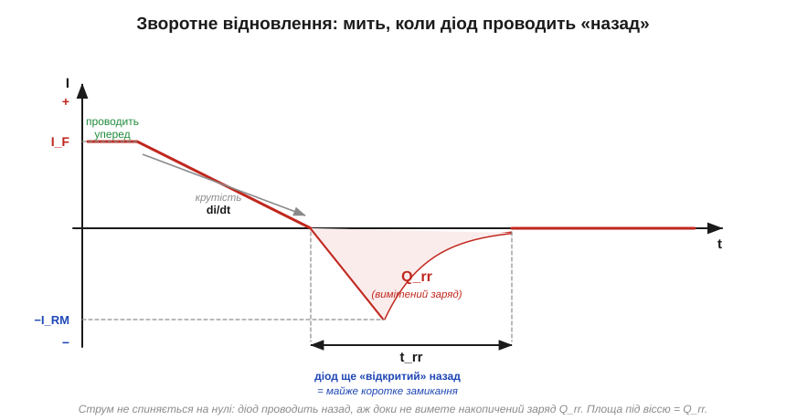
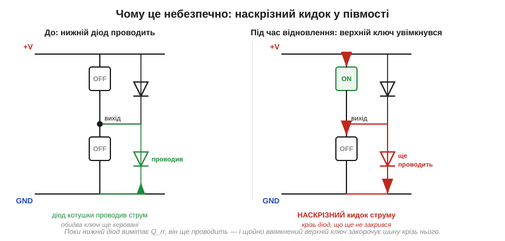

# Зворотне відновлення діода: мить, коли він — коротке замикання

<preknowlist>
- [PN-перехід](root:ph-condensed/pn-junction) — під час прямої провідності в переході накопичується запас неосновних носіїв заряду.
- [ВАХ діода](root:hw-components/diode-iv-curve) — діод пропускає струм уперед і замикає назад; що таке пряме падіння й зворотна напруга.
</preknowlist>

Ідеальний діод — досконалий однобічний клапан: щойно напруга стала зворотною, струм тієї ж миті спиняється. Справжній кремнієвий діод так **не вміє**. Ще якусь мить після того, як він проводив уперед, він проводить **назад** — крізь нього тече зворотний струм, хоча він мав би вже замкнутися. Ця мить має назву — **зворотне відновлення** (*reverse recovery*) — і саме вона палить діоди та транзистори у швидких схемах.

### Звідки береться зворотний струм

Причина — у фізиці [PN-переходу](root:ph-condensed/pn-junction). Поки крізь діод у прямому напрямку тече струм, у його базі накопичено **неосновні носії**, впорснуті крізь перехід. Поки цей заряд там є, діод **фізично не може** замкнутися: щоб напруга на ньому стала зворотною, носії спершу треба прибрати. А прибрати їх можна лише струмом. Тому при спробі різко замкнути діод струм не спиняється на нулі, а **обертається назад** і деякий час тече у зворотний бік, вимітаючи накопичений заряд.

Цю «мить назад» описують трьома числами з даташита:

- **Заряд відновлення** (*reverse recovery charge*, **Q_rr**) — повний заряд, який треба винести зворотним струмом, щоб діод нарешті замкнувся. Одиниця — нанокулон (нКл).
- **Час відновлення** (*reverse recovery time*, **t_rr**) — скільки триває цей зворотний струм, від переходу через нуль до майже повного спаду. Наносекунди (нс).
- **Піковий зворотний струм** (*peak reverse current*, **I_RM**) — найбільше значення того зворотного кидка.


*Струм діода при різкому замиканні. Спершу тече прямий I_F; потім струм лінійно падає, проходить нуль і йде в мінус — діод проводить НАЗАД. Пік сягає −I_RM, далі «хвіст» згасає до нуля. Уся площа під віссю — це і є винесений заряд Q_rr.*

### Чому це коротке замикання

Головне тут — не сам факт зворотного струму, а те, що **поки він тече, діод відкритий в обидва боки**. Падіння на ньому майже нульове — він поводиться не як клапан, а як шматок дроту. Якщо в цю мить до діода прикладено напругу джерела, ніщо її не стримує, і струм визначається лише зовнішнім колом. Це і є мить, коли діод — коротке замикання.

Звідси видно й важелі, якими цим керують. Заряд Q_rr тим більший, чим більший був прямий струм (більше носіїв накопичено) і чим **гарячіший** діод — з температурою Q_rr різко зростає. А піковий кидок I_RM залежить іще й від того, **як швидко** зовнішнє коло заганяє струм у мінус, — від крутості фронту di/dt. Спростивши форму сплеску до трикутника, ці три величини зв'язують просто:

```
Q_rr ≈ ½ · I_RM · t_rr          (площа сплеску зворотного струму)
I_RM ≈ √( 2 · Q_rr · di/dt )    (що крутіший фронт, то вищий пік)
```

Друга рівність — головна практична: подвоїли крутість фронту — піковий зворотний струм зріс у √2. У швидкому півмості di/dt сягає сотень ампер за мікросекунду, тож навіть Q_rr у десятки нКл дає кидок у кілька ампер — додатково до робочого струму.

### Скільки це коштує

Кожне таке замикання спалює енергію. Поки крізь діод тече зворотний струм, на транзисторі, що його заганяє, стоїть майже повна напруга шини U — тобто на ключі **одночасно** є і струм, і напруга:

```
E_rr ≈ Q_rr · U              (втрати на одну подію відновлення)
P_rr ≈ Q_rr · U · f          (середня потужність при частоті комутації f)
```

**Приклад. Діод з Q_rr = 80 нКл у мості на U = 320 В, що комутує з частотою f = 100 кГц:**

```
E_rr ≈ 80·10⁻⁹ · 320       = 25.6 мкДж за одне замикання
P_rr ≈ 25.6·10⁻⁶ · 100·10³ = 2.56 Вт   (лише через відновлення!)
```

Два з половиною вати з повітря — і це ще без урахування кидка I_RM, що додає просадку напруги, дзвін на паразитних індуктивностях і завади. Замінили діод на [Шотткі](root:embedded/zener-schottky) (у нього немає накопиченого заряду, тож Q_rr ≈ 0) або на «ультрашвидкий» з малим Q_rr — і ці вати зникають.

### Найгірший випадок: наскрізний струм у півмості

Зайве тепло — ще не найгірше. Є схема, де ті самі наносекунди незакритого діода обертаються не плавним нагрівом, а різким кидком, здатним пробити ключ. Це **півміст**: два ключі стоять стовпчиком між +V і землею, а паралельно кожному — діод (часто це вбудований *body diode* самого [силового транзистора](root:hw-components/mosfet-power-switch)). Поки один ключ працює, діод другого плеча проводить струм навантаження. Коли керування вмикає перший ключ, діод другого мусить замкнутися — але через Q_rr він **ще мить проводить назад**.


*Ліворуч: нижній діод проводив струм котушки. Праворуч: верхній ключ увімкнувся, та нижній діод ще не вимів Q_rr — і верхній ключ б'є струмом просто крізь нього на землю. На цю мить обидва плеча відкриті: шину закорочено.*

Це **наскрізний струм** (*shoot-through*): на час t_rr верхній ключ з'єднує шину живлення із землею майже накоротко через відкритий діод нижнього плеча. Кидок обмежений лише паразитними опорами й може сягати десятків ампер — звідси перегрів і пробій ключів у погано прорахованих мостах. Тому захисні правила однозначні: ставити в мости **швидкі діоди** з малим Q_rr, не робити фронти зайво крутими й закладати «мертвий час» між ключами — але навіть він не рятує, якщо діод вимітається повільніше за цю паузу.

### Третє число вибору діода

Q_rr — це третє число вибору діода поряд із прямим струмом I_F та зворотною напругою V_R. Для мережевого випрямляча на 50 Гц воно байдуже: між півперіодами діод має цілі мілісекунди, щоб спокійно вимести заряд. А для будь-якої швидкої комутації воно стає вирішальним — саме воно кількісна причина, чому Шотткі незамінний в імпульсних блоках живлення і чому сигнальний 1N4148 (t_rr ≈ 4 нс) беруть туди, де випрямний 1N400x уже «гальмує».

> 🔧 **Навіщо це.** Обираючи діод для будь-якої швидкої комутації, дивіться в даташит не лише на I_F та V_R, а й на Q_rr / t_rr — і пам'ятайте, що вони ростуть із температурою, тож оцінюйте їх при робочій, а не кімнатній. Там, де напруга дозволяє, Шотткі з його Q_rr ≈ 0 знімає проблему одразу; де не дозволяє — беруть «ультрашвидкий» діод із малим зарядом.

Справжній діод, отже, не досконалий вимикач: на час t_rr після прямої провідності він стає дротом, і за це коло платить теплом, кидками струму, а в півмості — коротким замиканням шини. Ліки прості — діод, що не накопичує заряду ([Шотткі](root:embedded/zener-schottky)) або накопичує його мало (ультрашвидкий): менший Q_rr — коротша та небезпечна мить.

---
