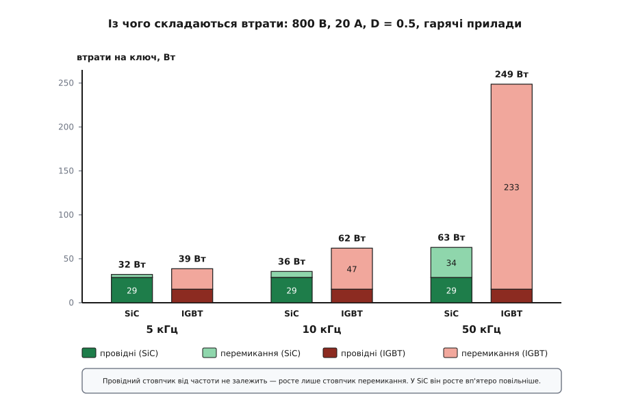
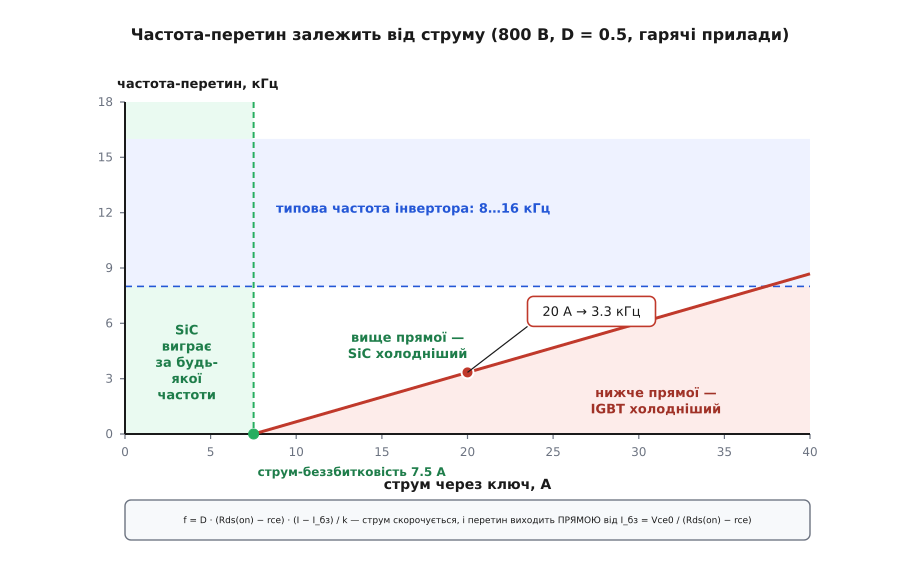

# ⚙️ Коли SiC окупає ціну

### Задача

Ми будуємо трифазний інвертор: шина постійного струму 800 В, крізь кожен ключ іде близько 20 А. Треба вибрати ключ — і на столі лежать два реальні прилади одного класу, обидва в корпусі TO-247, обидва на 1200 В: карбідкремнієвий польовий ключ і кремнієвий [IGBT](topic:hw-components/igbt). Карбідний коштує втричі більше.

Загальну відповідь знає кожен: «на високій частоті виграє SiC». Але «висока» — не число. Інвертор доведеться проєктувати на конкретну частоту, і питання стоїть інакше, гостріше: **з якої саме частоти SiC справді холодніший — і з якої зекономлене тепло встигає повернути переплату за кристал?**

Обидві відповіді — числа, і обидва можна порахувати з даташитів за півгодини. Порахуймо.

### Ідея: усе зводиться до двох прямих

Втрати в ключі природно розпадаються надвоє — за тим, як вони пов'язані з частотою.

**Провідні втрати** з'являються, поки ключ відкритий: крізь нього тече струм, на ньому падає напруга, добуток гріє кристал. Скільки разів на секунду ключ перемикається, провідним втратам байдуже — важить лише те, яку частку часу він відкритий. За сталої шпаруватості вони від частоти **не залежать зовсім**.

**[Втрати перемикання](topic:hw-components/switching-losses)** — це ціна самого переходу. Поки ключ переходить із відкритого стану в закритий, на ньому одночасно є й помітна напруга, й помітний струм; їхній добуток, проінтегрований за час переходу, дає енергію одного перемику. Ця енергія — стала: скільки разів перемкнув, стільки разів і заплатив. Отже, потужність тут — енергія на кількість перемиків за секунду, тобто **лінійна від частоти**.

Складімо:

```
P(f) = P_провід + E_перемик · f
```

Це рівняння прямої. Відрізок на осі — провідні втрати; нахил — енергія одного перемику. Два прилади дають дві прямі, і весь вибір між ними — це геометрія двох прямих на одному кресленні.

Прямі лягають характерно. IGBT заливає дрейфову область носіями, тож у відкритому стані падає на собі майже сталі два вольти незалежно від струму — **низький відрізок**. Зате з кожним вимиканням залиті носії треба вимести, і хвіст струму робить енергію перемику великою — **крутий нахил**. SiC-MOSFET навпаки: чесний [Rds(on)](topic:hw-components/rds-on) на великому струмі дає **вищий відрізок**, а відсутність хвоста — **пологий нахил**.

Дві прямі з різними відрізками й різними нахилами перетинаються рівно один раз. Прирівняймо:

```
P_провід,SiC + E_SiC · f  =  P_провід,IGBT + E_IGBT · f
```

і розв'яжімо відносно f:

```
                P_провід,SiC − P_провід,IGBT       ΔP_провід
f_перетину =  ─────────────────────────────────  =  ───────────
                    E_IGBT − E_SiC                  ΔE_перемик
```

Ця формула читається як речення. У чисельнику — **скільки ватів IGBT виграє провідністю**; у знаменнику — **скільки джоулів SiC виграє на одному перемику**. Вати, поділені на джоулі, дають одиницю на секунду, тобто герци: формула просто питає, **скільки разів на секунду треба перемкнути, щоб виграш на кожному перемику покрив програш у провідності**. Один поділ — і маємо число.

> 🔧 **Навіщо це.** Формула коштує більше, ніж окреме число, бо показує, за що триматися. Хочете зсунути перетин ліворуч (щоб SiC вигравав раніше) — або зменшуйте чисельник, або збільшуйте знаменник: беріть ключ із меншим Rds(on), або розганяйте перехід швидшим драйвером. І одразу видно приховану пастку: якщо чисельник вийде **від'ємним** — тобто SiC виграє ще й провідністю, — то перетину не існує взагалі, і SiC холодніший на будь-якій частоті. Формула сама попереджає, коли питання «з якої частоти» безглузде.

### Числа: що даташит дає, а чого не дає

Беремо два опубліковані даташити.

**SiC: Wolfspeed C2M0080120D** (1200 В, TO-247-3, ред. 6, жовтень 2024):

```
Rds(on)  =  80 мОм   (тип., Vgs = 20 В, Id = 20 А, 25 °C)
Rds(on)  = 144 мОм   (тип., ті самі умови, Tj = 150 °C)
Eon      = 523 мкДж  ┐ Vds = 800 В, Id = 20 А, Rg(ext) = 2.5 Ом,
Eoff     =  72 мкДж  ┘ Vgs = −5/+20 В, Tj = 25 °C, зустрічний діод C4D10120A
```

**Si: Infineon IKW40N120H3** (TRENCHSTOP IGBT4, 1200 В, 40 А, TO-247, зі вбудованим зустрічним діодом):

```
Vce(sat) = 2.05 В    (тип., Ic = 40 А, Vge = 15 В, Tvj = 25 °C)
Eon+Eoff = 3.2 + 1.2 = 4.4 мДж   (Vcc = 600 В, Ic = 40 А, Rg = 12 Ом, Tvj = 25 °C)
Eon+Eoff = 4.4 + 2.6 = 7.0 мДж   (ті самі умови, Tvj = 175 °C)
```

Тепер найважливіше: **двох величин, яких модель потребує, даташит не друкує зовсім** — і саме тут гине більшість розрахунків.

**Перше — поріг і нахил IGBT.** Модель провідності IGBT — це `Vce = Vce0 + rce · Ic`: поріг плюс опір. Даташит дає **одну** точку кривої (2.05 В при 40 А), а одна точка не вміє розділити поріг і нахил. Візьмете її як сталі 2.05 В — перебільшите втрати на малому струмі. Візьмете як чистий опір 2.05/40 = 51 мОм — применшите їх. Другу точку доводиться **знімати з вихідної ВАХ** у даташиті. Крива при 175 °C для цього приладу дає приблизно 1.55 В при 20 А і 2.3 В при 40 А, звідки:

```
rce  = (2.3 − 1.55) / (40 − 20) = 0.75 / 20 = 37.5 мОм
Vce0 = 2.3 − 0.0375 · 40 = 0.8 В
```

Модель варто одразу перевірити на тому, що даташит **таки** надрукував. Знята так само, але з холодної кривої, пара (Vce0 = 0.9 В, rce = 29 мОм) дає при 40 А: `0.9 + 0.029 · 40 = 2.06 В` — проти даташитних 2.05 В. Збіг у другому знаку означає, що лінеаризація чесна, а не вигадана.

**Друге — енергії у ВАШОМУ режимі.** Даташитні енергії виміряні там, де зручно виробникові, а не там, де працює ваш інвертор: SiC — при 800 В і 20 А, IGBT — при 600 В і 40 А. Порівнювати 595 мкДж із 7.0 мДж «як є» — це порівнювати різні режими. Обидві треба звести в одну точку. Енергія переходу приблизно **лінійна і по напрузі, і по струму** (напруга задає висоту, струм — ширину того самого добутку V·I під час переходу):

```
E(V, I) ≈ E_даташит · (V / V_даташит) · (I / I_даташит)
```

**Зводимо IGBT до 800 В і 20 А.**

```
E_IGBT = 7.0 мДж · (800 / 600) · (20 / 40)
       = 7.0 · 1.333 · 0.5 = 4.67 мДж

SiC уже виміряний у нашій точці: 595 мкДж при 25 °C.
Накинемо стриманих 15 % на нагрів:  595 · 1.15 ≈ 684 мкДж
```

Ось воно, чесне порівняння в одному режимі: **4.67 мДж проти 0.68 мДж — SiC перемикається всемеро дешевше.** Ті 15 % на нагрів — свідомо обережні: енергія перемикання польового ключа майже не залежить від температури, бо переходом керує перезаряд ємностей, а не розсмоктування носіїв. У IGBT навпаки — хвіст струму з нагрівом густішає, і 4.4 мДж перетворюються на 7.0 мДж. Понад третину свого відриву SiC отримує просто за те, що йому байдуже до градусів.

### Реальний код

Модель сама просить, щоб її записали як два прилади й одну формулу. Основна мова тут — Python: це розрахунок за столом, де важать читність і швидке перебирання варіантів, а не швидкодія. Поруч — C++: та сама модель нерідко живе не в блокноті, а **всередині самого інвертора** — прошивка щоперіоду оцінює втрати, щоб стежити за температурою кристала й вчасно зрізати струм.

**Модель повних втрат і частота-перетин.**

:::tabs
```python
from dataclasses import dataclass


@dataclass(frozen=True)
class Switch:
    """Ключ у двох рисах: як він падає напругу і чого коштує один перемик."""
    name:  str
    v0:    float   # В   — поріг ВАХ; у польового ключа його немає
    r:     float   # Ом  — нахил ВАХ (rce) або Rds(on) — обов'язково ГАРЯЧИЙ
    e_ref: float   # Дж  — Eon+Eoff у даташитній точці
    v_ref: float   # В   — напруга тієї точки
    i_ref: float   # А   — струм тієї точки
    price: float   # $

    def p_cond(self, i, duty):
        """Провідні втрати: поріг бере струм, опір бере квадрат струму."""
        return duty * (self.v0 * i + self.r * i * i)

    def e_sw(self, v, i):
        """Даташитна енергія, перерахована на наш режим: лінійно по V і по I."""
        return self.e_ref * (v / self.v_ref) * (i / self.i_ref)

    def p_total(self, v, i, duty, fsw):
        return self.p_cond(i, duty) + self.e_sw(v, i) * fsw


SIC = Switch("SiC C2M0080120D @150 °C", v0=0.0, r=0.144,
             e_ref=684e-6, v_ref=800.0, i_ref=20.0, price=25.0)
IGBT = Switch("Si IKW40N120H3 @175 °C", v0=0.8, r=0.0375,
              e_ref=7.0e-3, v_ref=600.0, i_ref=40.0, price=8.0)


def f_crossover(mos, igbt, v, i, duty):
    """Частота, вище якої польовий ключ холодніший. None — перетину не існує."""
    cond_gap = mos.p_cond(i, duty) - igbt.p_cond(i, duty)
    sw_gain = igbt.e_sw(v, i) - mos.e_sw(v, i)
    if sw_gain <= 0:
        return None          # відігравати нічим
    if cond_gap <= 0:
        return 0.0           # MOSFET кращий і провідністю — виграє на будь-якій частоті
    return cond_gap / sw_gain


def breakeven_current(mos, igbt):
    """Струм, нижче якого MOSFET кращий і в провідності теж."""
    dr = mos.r - igbt.r
    return igbt.v0 / dr if dr > 0 else None


V_DC, I_SW, DUTY = 800.0, 20.0, 0.5

print("струм-беззбитковість : %.1f А" % breakeven_current(SIC, IGBT))
print("частота-перетин @%.0f А: %.2f кГц"
      % (I_SW, f_crossover(SIC, IGBT, V_DC, I_SW, DUTY) / 1e3))
print()
print("f, кГц    SiC, Вт   IGBT, Вт    виграш")
for f_khz in (2, 5, 10, 20, 50):
    ps = SIC.p_total(V_DC, I_SW, DUTY, f_khz * 1e3)
    pi = IGBT.p_total(V_DC, I_SW, DUTY, f_khz * 1e3)
    print("%6d   %8.1f   %8.1f   %+7.1f" % (f_khz, ps, pi, pi - ps))
```

```cpp
#include <cstdio>
#include <optional>
#include <initializer_list>

struct Switch {
    const char* name;
    double v0;      // В   — поріг ВАХ; у польового ключа його немає
    double r;       // Ом  — нахил ВАХ (rce) або Rds(on) — обов'язково ГАРЯЧИЙ
    double e_ref;   // Дж  — Eon+Eoff у даташитній точці
    double v_ref;   // В   — напруга тієї точки
    double i_ref;   // А   — струм тієї точки
    double price;   // $

    // Провідні втрати: поріг бере струм, опір бере квадрат струму.
    constexpr double p_cond(double i, double duty) const {
        return duty * (v0 * i + r * i * i);
    }
    // Даташитна енергія, перерахована на наш режим: лінійно по V і по I.
    constexpr double e_sw(double v, double i) const {
        return e_ref * (v / v_ref) * (i / i_ref);
    }
    constexpr double p_total(double v, double i, double duty, double fsw) const {
        return p_cond(i, duty) + e_sw(v, i) * fsw;
    }
};

constexpr Switch SIC { "SiC C2M0080120D @150 °C", 0.0, 0.144, 684e-6, 800.0, 20.0, 25.0 };
constexpr Switch IGBT{ "Si IKW40N120H3 @175 °C",  0.8, 0.0375, 7.0e-3, 600.0, 40.0, 8.0 };

// nullopt — «перетину не існує»; 0.0 — «виграє на будь-якій частоті»
std::optional<double> f_crossover(const Switch& mos, const Switch& igbt,
                                  double v, double i, double duty) {
    const double cond_gap = mos.p_cond(i, duty) - igbt.p_cond(i, duty);
    const double sw_gain  = igbt.e_sw(v, i) - mos.e_sw(v, i);
    if (sw_gain <= 0.0) return std::nullopt;   // відігравати нічим
    if (cond_gap <= 0.0) return 0.0;
    return cond_gap / sw_gain;
}

std::optional<double> breakeven_current(const Switch& mos, const Switch& igbt) {
    const double dr = mos.r - igbt.r;
    if (dr <= 0.0) return std::nullopt;
    return igbt.v0 / dr;
}

int main() {
    constexpr double V_DC = 800.0, I_SW = 20.0, DUTY = 0.5;

    std::printf("струм-беззбитковість : %.1f А\n", *breakeven_current(SIC, IGBT));
    std::printf("частота-перетин @%.0f А: %.2f кГц\n\n",
                I_SW, *f_crossover(SIC, IGBT, V_DC, I_SW, DUTY) / 1e3);

    std::printf("f, кГц    SiC, Вт   IGBT, Вт    виграш\n");
    for (double f_khz : {2.0, 5.0, 10.0, 20.0, 50.0}) {
        const double ps = SIC.p_total(V_DC, I_SW, DUTY, f_khz * 1e3);
        const double pi = IGBT.p_total(V_DC, I_SW, DUTY, f_khz * 1e3);
        std::printf("%6.0f   %8.1f   %8.1f   %+7.1f\n", f_khz, ps, pi, pi - ps);
    }
}
```
:::

Прогін:

```
струм-беззбитковість : 7.5 А
частота-перетин @20 А: 3.34 кГц

f, кГц    SiC, Вт   IGBT, Вт    виграш
     2       30.2       24.8      -5.3
     5       32.2       38.8      +6.6
    10       35.6       62.2     +26.5
    20       42.5      108.8     +66.4
    50       63.0      248.8    +185.8
```

Перше, що варто помітити: **на 2 кГц IGBT справді холодніший**, і то відчутно — на п'ять із гаком ватів. Це не похибка моделі, це чесна фізика: перемиків замало, щоб хвіст струму встиг нашкодити, а сталі два вольти на такому струмі дешевші за 144 мОм, помножені на квадрат струму. Нижче за перетин перевага IGBT — справжня.

Далі прямі розходяться, і швидко. На 10 кГц SiC економить 26.5 Вт на ключі; на 50 кГц IGBT сягає 249 Вт — і ось на цьому числі варто спинитися окремо, бо воно вже не про вибір.


*Провідна частина від частоти не залежить — однакова на всіх трьох парах стовпчиків. Росте лише перемикання, і саме воно вирішує все: у SiC цей стовпчик росте всемеро повільніше, тож на 50 кГц IGBT опиняється просто в іншому масштабі.*

### Струм вирішує, де буде перетин

Число 3.34 кГц отримане для 20 А. Спокуса — запам'ятати його як «частоту-перетин цієї пари приладів». Це помилка: **перетин пливе за струмом**, і пливе сильно. Розкриймо чисельник:

```
ΔP_провід = D · (Rds(on) · I²)  −  D · (Vce0 · I + rce · I²)
          = D · I · [ (Rds(on) − rce) · I  −  Vce0 ]
```

Квадратна дужка додатна лише тоді, коли струм достатньо великий:

```
I_бз = Vce0 / (Rds(on) − rce) = 0.8 / (0.144 − 0.0375) = 7.5 А
```

Це **струм-беззбитковість**. Нижче за нього SiC виграє ще й провідністю — бо його втрати ростуть із квадратом і на малому струмі мізерні, а IGBT платить свій поріг Vce0 навіть за крихітного струму. Перетину там **не існує**: SiC холодніший на будь-якій частоті, хоч на 100 Гц. Саме тому код повертає нуль, а не число: це не «перетин на нулі герц», це «питання не має сенсу».

А тепер найкрасивіше. Знаменник — `ΔE_перемик` — теж пропорційний струмові: обидві енергії масштабуються лінійно по I. Позначмо через `k` виграш в енергії **на кожен ампер**; тоді `ΔE_перемик = k · I`, і струм у дробі скорочується:

```
             D · I · [ (Rds(on) − rce) · I − Vce0 ]        D · (Rds(on) − rce)
f_перетину = ─────────────────────────────────────── = ─────────────────────── · (I − I_бз)
                            k · I                                  k
```

Частота-перетин виявляється **прямою від струму**, що стартує зі струму-беззбитковості. Для нашої пари `k = 3.98 мДж / 20 А ≈ 199 мкДж/А`, і нахил виходить `0.5 · 0.1065 / 199e-6 ≈ 267 Гц на ампер`.


*Ліворуч від струму-беззбитковості перетину не існує зовсім — SiC холодніший за будь-якої частоти. Праворуч перетин росте прямою: 267 Гц на кожен ампер. Навіть на граничних для цього SiC 36 А він дотягує лише до 7.6 кГц — а типова частота інвертора починається з восьми.*

І ось із цієї прямої випливає висновок, вартий усього розрахунку. На 36 А — а це вже стеля струму для цього SiC — перетин дотягує тільки до 7.6 кГц. **За всього діапазону струмів, який прилад узагалі здатен нести, перетин не досягає 8 кГц.** А типовий інвертор працює на 8–16 кГц. Отже, для цієї пари питання «з якої частоти SiC холодніший» має практичну відповідь: **із будь-якої, на якій ви реально працюватимете, і за будь-якого навантаження**.

### Тепер про гроші

Холодніший — ще не дешевший. Переплату за кристал повертає зекономлена енергія, і цей рахунок робиться окремо.

Нехай IGBT коштує близько $8, а SiC — близько $25 (числа орієнтовні й швидко застарівають; підставте свої). Різниця — $17 на ключ, у трифазному мості шість ключів:

**Чи повернуться $102 переплати.**

```
Переплата:            ($25 − $8) · 6 = $102

На 10 кГц виграш:     26.5 Вт · 6 = 159 Вт
Сонячний інвертор:    2000 год/рік, тариф $0.15/кВт·год
Економія за рік:      159 · 2000 / 1000 · 0.15 = $47.7
Окупність:            102 / 47.7 ≈ 2.1 року

На 5 кГц виграш:      6.6 Вт · 6 = 39.6 Вт  →  $11.9/рік  →  окупність 8.6 року
```

Два роки для інвертора, що житиме двадцять, — вирок на користь SiC. Майже дев'ять років — вирок проти: за такий строк дешевше поставити IGBT.

Звідси головне, що варто винести з рахунку грошей: **частота-перетин втрат і частота-окупності — це різні частоти**. Втрати зрівнюються на 3.3 кГц, але SiC стає вигідним ближче до 8–10 кГц. Між ними лежить ціла смуга, де SiC холодніший — і все одно не вартий грошей.

### Складність і пастки

**Стовпчик «25 °C» — найдорожча помилка в усьому розрахунку.** Даташит починається з холодних чисел, і взяти їх найлегше. Порахуймо, що з цього вийде. На 25 °C Rds(on) SiC — 80 мОм, і провідні втрати падають до 16 Вт проти 14.8 Вт у IGBT: розрив лише 1.2 Вт. Тоді перетин виходить **0.5 кГц**, а струм-беззбитковість — аж 17.6 А. Проти гарячих 3.3 кГц і 7.5 А. Холодна модель лестить карбіду вшестеро — і лестить у найнебезпечніший бік: ви пообіцяєте ККД, якого залізо не дасть. Причина проста: **Rds(on) карбіду до 150 °C зростає майже вдвічі** (80 → 144 мОм), і саме це число вирішує весь спір. Ключ у роботі гарячий завжди — беріть гарячий стовпчик.

**Rg — це половина Eon.** Ті 523 мкДж SiC виміряні при зовнішньому опорі затвора 2.5 Ом, а IGBT — при 12 Ом. Опір затвора керує швидкістю переходу майже напряму: побільшили — перехід довший — енергія більша. І тут ховається неприємне: SiC часто **навмисно сповільнюють**, бо шалений dV/dt наводить перешкоди й хибно відкриває сусідній ключ, а драйвер мусить давати +15/−4 В і немалий струм ([керування затвором SiC і GaN](topic:hw-power/sic-gan-gate-drive) — окрема серйозна тема). Кожен доданий ом затвора з'їдає частину того самого відриву, за який заплачено втричі. SiC, сповільнений до швидкості IGBT, — це просто дорогий IGBT.

**Eon — це наполовину чужий діод.** Найтонше місце всієї таблиці. Коли ключ у півмості вмикається, він мусить перехопити струм у зустрічного діода протилежного плеча — а той не замикається миттєво: спершу [віддає накопичений заряд зворотним сплеском](topic:hw-components/reverse-recovery). Цей сплеск тече крізь **наш** ключ і входить у **його** Eon. Тепер погляньте на умови вимірювання: Wolfspeed міряв 523 мкДж із карбідним діодом Шотткі C4D10120A, який майже не має зворотного відновлення, а Infineon — із рідним кремнієвим діодом, який його має вповні. Отже, частина того семикратного відриву — це не «SiC-MOSFET проти IGBT», а «карбідний діод проти кремнієвого». Поставте до IGBT карбідний Шотткі — і його Eon помітно впаде. Порівнюйте пари ключ+діод, а не самі ключі.

**D·I² — не вся правда.** Наша модель рахує сталий струм при сталій шпаруватості. У справжньому інверторі струм синусоїдний, а шпаруватість гуляє за період [модуляції](topic:hw-motion/svpwm), тож усереднювати треба по періоду. Чесні усереднені формули для синусоїдної ШІМ такі (Î — амплітуда фазного струму, M — глибина модуляції, cos φ — коефіцієнт потужності):

```
P_провід,IGBT = Î · Vce0 · ( 1/(2π) + M·cos φ / 8 )  +  β · rce · ( 1/8 + M·cos φ / (3π) )
P_провід,MOSFET =                                       β · Rds(on) · ( 1/8 + M·cos φ / (3π) )
```

MOSFET лишає з них лише другий доданок — порога в нього немає. Наші `D = 0.5` зі сталим струмом — це рівно випадок `M = 0` цих самих формул (звідки й коефіцієнти 1/(2π) та 1/8), тобто законний атом задачі. Для реальної машини підставте амплітуду й модуляцію — і не забудьте, що квадрат бере [діючий струм](topic:hw-power/rms-current), а не середній. Але форма не міняється: усе одно відрізок плюс нахил на f, тож уся розмова про перетин лишається чинною — рухаються тільки числа.

**І найбільша пастка: питання поставлене неправильно.** Увесь рахунок вище відповідав: «SiC чи IGBT **на тій самій частоті**?» Саме це питання й робить із SiC сумнівну покупку з окупністю два роки. Але погляньте ще раз на останній рядок таблиці. На 50 кГц IGBT розсіює 249 Вт на ключі — це 1.5 кВт на шість ключів у корпусах TO-247. Це вже не задача про [радіатор](topic:hw-components/heatsink) і не питання [теплового опору](topic:ph-thermodynamics/thermal-resistance) — це інша машина, якої не буде. IGBT туди просто не їде. А SiC на тих же 50 кГц має 63 Вт — звичайний, робочий режим.

І саме там лежать справжні гроші. Бо на 50 кГц економлять не на ключі: [котушка й конденсатори перетворювача](topic:hw-power/converter-inductor) зменшуються приблизно обернено до частоти, а вони, а не ключ, займають більшу частину плати й ваги. Замінити IGBT на SiC у готовій схемі на 10 кГц, не чіпаючи більше нічого, — це купити собі два роки окупності й трохи прохолодніший радіатор. Перепроєктувати той самий інвертор на 50 кГц — чого IGBT не дозволяє **в принципі** — це скоротити магнетику в рази й зробити інший виріб.

SiC окупається не тоді, коли переграє IGBT на частоті IGBT. Він окупається тоді, коли дозволяє з тієї частоти піти.
