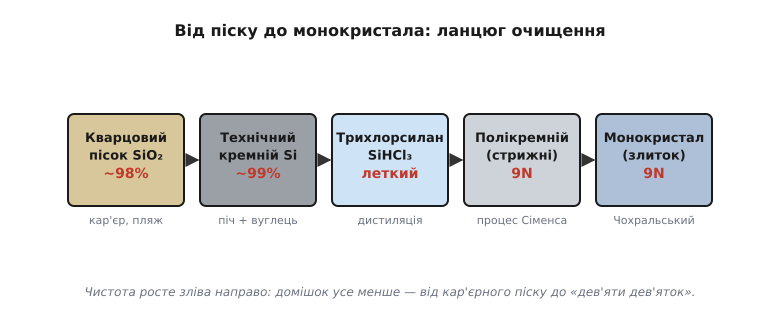
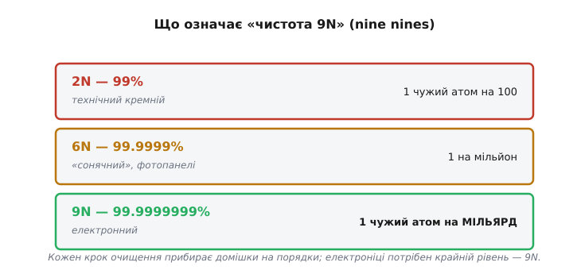
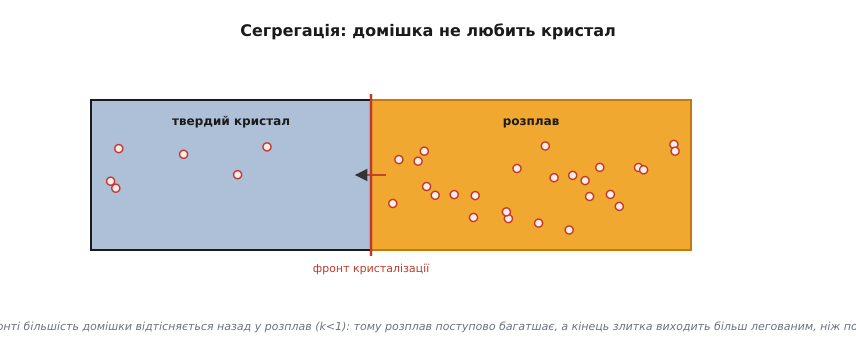
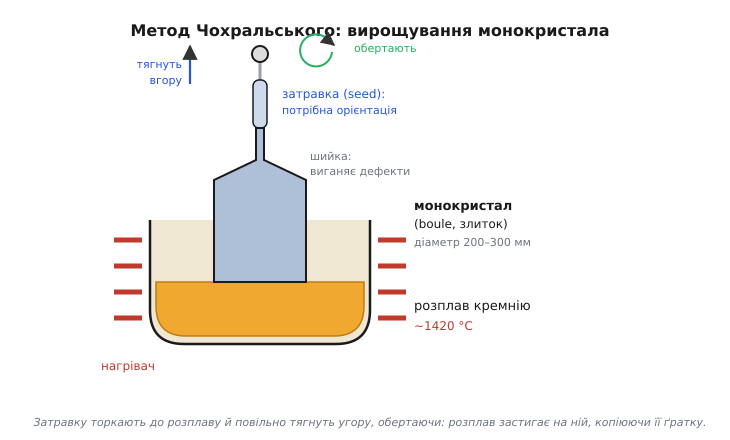
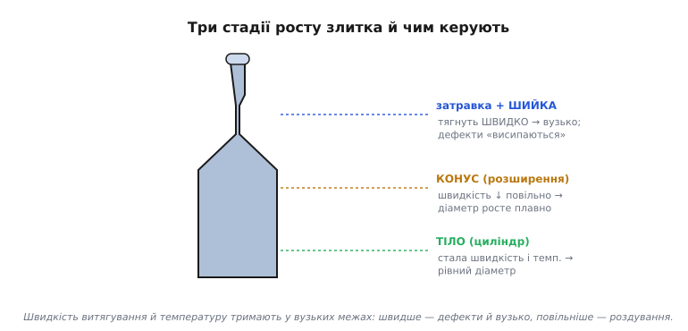
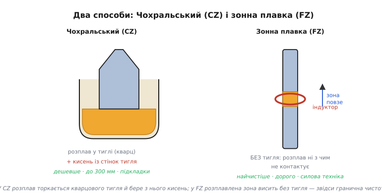
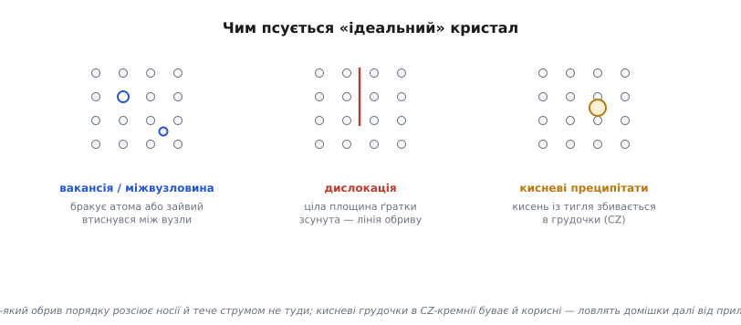
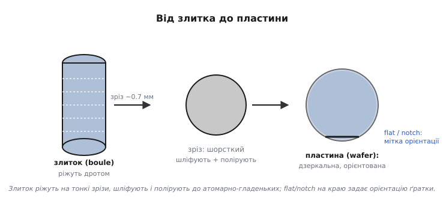

# Кремній і монокристал

Ось найнесподіваніший факт в усій електроніці: основа кожного процесора, кожного мікроконтролера, кожної мікросхеми пам'яті — це **пісок**. Точніше, кремній (*silicon*, від латинського *silex* — кремінь, твердий камінь), добутий із кварцового піску, найпоширенішої після кисню речовини в земній корі. Сировина буквально лежить під ногами й коштує копійки. Уся складність — і вся вартість — у тому, щоб довести цей пісок до стану, який потрібен електроніці: майже ідеально чистого, з атомами, вишикуваними в один бездоганний кристал. Простежмо весь цей шлях, бо він тримається на одній думці: виробництво чіпів — це передусім **боротьба за чистоту й порядок** на атомному рівні.

### Чому саме кремній

Перше питання — чому взагалі кремній (Si)? Тому що кремній — [напівпровідник](root:ph-condensed/semiconductor), тобто речовина, що сидить рівно посередині між провідником і ізолятором, і — головне — його провідністю можна **керувати**, додаючи мікроскопічні домішки ([легування](root:ph-condensed/doping)). Саме ця керованість робить можливими і [діод](root:ph-condensed/pn-junction), і [транзистор](root:hw-components/field-control). Германій, з якого складали перші транзистори, цю властивість теж має, але кремнію пощастило з кількома дрібницями, що виявилися вирішальними.

Найголовніша з них — **оксид**. Природний оксид кремнію (SiO₂ — той самий кварц, скло, пісок) — чудовий, стабільний **ізолятор**, який легко виростити прямо на поверхні кристала, просто нагрівши його в кисні. Германій такого подарунка не має: його оксид нестійкий, розчинний у воді й непридатний. А вся планарна технологія, [на якій будують структуру чіпа](root:hw-components/doping-etching-metal), тримається саме на тому, що ізолятор можна вирощувати локально на поверхні й використовувати і як [підзатворний діелектрик транзистора](root:hw-components/mosfet-structure), і як маску, і як захист. Друга перевага — кремній витримує вищі температури, ніж германій, не «розпливаючись», а виробництво вимагає нагрівів до сотень градусів. Третя — він **дешевий і всюдисущий**: після кисню це найпоширеніший елемент земної кори, тоді як германій рідкісний. Складіть усе — і стане ясно, чому кремній переміг: не тому, що він найкращий напівпровідник за чистою фізикою (за рухливістю носіїв його перевершують і германій, і арсенід галію), а тому, що він **найзручніший у масовому виробництві**. Тут проступає урок, що повторюється в усій мікроелектроніці: перемагає не теоретично найкраще, а технологічно найпридатніше.

### Ланцюг очищення

Між піском і чіпом лежить ціла низка хімічних перетворень, кожне з яких прибирає чергову порцію домішок.


*Шлях від піску до монокристала. Кварцовий пісок (SiO₂, чистота ~98%) у дуговій печі з вуглецем відновлюють до технічного кремнію (~99%). Його перетворюють на леткий трихлорсилан (SiHCl₃) і ретельно дистилюють — саме тут відсікаються домішки. Очищений газ осаджують назад у твердий полікремній дуже високої чистоти. І нарешті з нього вирощують єдиний монокристал. Чистота росте зліва направо: від кар'єрного піску до «дев'яти дев'яток».*

Простежмо логіку цього ланцюга, бо вона повчальна. Спершу пісок **відновлюють** — у величезній дуговій печі при майже 2000 °C вуглець відбирає в SiO₂ кисень, лишаючи металічний кремній. Та цей «технічний» кремній (його так і звуть — *metallurgical-grade*, металургійної чистоти) для електроніки безнадійно брудний: ~99% чистоти означає цілий відсоток чужих атомів, а це астрономічно багато. Наскільки багато — буде видно, щойно введемо строгу міру чистоти; поки досить інтуїції, що для напівпровідника відсоток домішки — це катастрофа.

Прямо очистити твердий кремній до потрібного рівня неможливо — домішки сидять у ньому надто міцно. Тому хитрість тут обхідна: кремній переводять у **летку сполуку** (трихлорсилан, SiHCl₃, що кипить уже за ~32 °C), яку вже можна **дистилювати**, як спирт. Сенс у тому, що різні речовини киплять за різних температур, тож, багаторазово випаровуючи й конденсуючи трихлорсилан, домішки відсікають одну за одною — рівно так, як перегонка розділяє суміш рідин. Це і є місце, де народжується чистота: не в печі, а в дистиляційній колоні. Уже очищений газ тоді **розкладають назад** на твердий кремній: у реакторі (процес Сіменса) гарячі стрижні «обростають» чистим кремнієм, що осідає з газу шар за шаром, — виходять палички **полікремнію** (*polysilicon*, від грецького *polýs* — багато: «багатокристальний»), сировина вже електронної чистоти.

Та є нюанс, заради якого додають ще одну, останню стадію. «Полі-» означає, що цей кремній складається з безлічі дрібних кристаликів, зрослих в усіх напрямках абияк — як купа піщинок, спечених докупи. Чистота вже є, а от **порядку** немає. А чому порядок узагалі важливий? Бо на межах між кристаликами (їх звуть **зернами**) ґратка обривається, і там електрони розсіюються й застрягають — поведінка напівпровідника на таких межах непередбачувана. Транзистор же завтовшки в десятки атомів не терпить, щоб посеред його каналу проходила границя зерна. Йому потрібен **єдиний** кристал з нерозривною ґраткою — саме його й дає вирощування монокристала.

### Що означає «чистота 9N»

Слово «чистий» в електроніці має дуже конкретну міру, і вона вражає.


*Чистоту записують числом «дев'яток» (nines). 2N (99%) — технічний кремній: один чужий атом на сто. 6N (99.9999%) — «сонячний», для фотопанелей: один на мільйон. 9N (99.9999999%) — електронний: один чужий атом на мільярд кремнієвих. Кожен крок очищення прибирає домішки на порядки; електроніці потрібен крайній рівень.*

Закарбуймо цей масштаб, бо він пояснює всю дорожнечу процесу. «Дев'ять дев'яток» — це **один сторонній атом на мільярд** атомів кремнію. Уявіть стадіон, заповнений людьми, і помножте його населення в мільйони разів — і серед усього цього натовпу має бути лише кілька «чужих». Чому така параноя? Бо [легування](root:ph-condensed/doping) — це додавання домішки в концентрації якраз порядку «кілька атомів на мільйон-мільярд». Якщо вихідний кремній уже забруднений на цьому рівні **неконтрольовано**, то контрольоване легування втрачає сенс: ви не знатимете, скільки насправді носіїв у вашому напівпровіднику, і транзистори поводитимуться як заманеться. Чистота тут — не перфекціонізм, а передумова самої керованості, на якій тримається вся електроніка.

Сама кристалізація, до речі, теж потай очищає кремній — і той самий механізм пояснює, чому злиток виходить нерівномірним. Більшість домішок «не любить» сидіти у строгій ґратці й при застиганні відтісняється назад у розплав: атоми, що ростуть у кристал, виштовхують чужинців перед фронтом кристалізації. Це зветься **сегрегацією** (від латинського *segregare* — відділяти).


*Чому при застиганні домішка тікає в рідину. На межі твердого й рідкого більшість сторонніх атомів не вбудовується в ґратку, а відтісняється назад у розплав, тож тверда частина виходить чистішою за рідину. Звідси два наслідки заразом: на цьому ефекті стоїть очищення зонною плавкою (розплавлена зона «згрібає» домішки вздовж стрижня), а ще через нього розплав поступово багатшає домішкою, і кінець злитка виходить більш легованим, ніж початок, — це доводиться враховувати, відважуючи дрібку домішки в тигель.*

### Метод Чохральського: один кристал

Полікремній уже чистий, але «зернистий» — безліч дрібних кристаликів. А транзистор хоче рости в **ідеально впорядкованій** ґратці, єдиній на всю пластину, — у **монокристалі** (від грецького *mónos* — один: один-єдиний кристал, без внутрішніх меж). Як виростити такий кристал розміром із відро? Відповідь знайшов 1916 року польський хімік **Ян Чохральський** (*Jan Czochralski*) — і знайшов випадково: замислившись, він умочив перо не в чорнильницю, а в тигель із розплавленим оловом, висмикнув — і за пером потяглася тонка застигла металева нитка, яка виявилася монокристалом. Метод, названий його іменем, і досі лежить в основі виробництва кремнію.


*Полікремній розплавляють у тиглі (~1420 °C). До поверхні розплаву торкаються маленькою затравкою (seed) — шматочком кремнію з потрібною орієнтацією ґратки. Затравку повільно тягнуть угору, водночас обертаючи. Розплав застигає на ній, атом за атомом копіюючи її кристалічну структуру, — і за затравкою росте суцільний монокристал (boule, злиток) діаметром 200–300 мм.*

Осягніть, наскільки це елегантно. Розплавлений кремній — це хаос вільних атомів. Затравка дає їм **зразок для наслідування**: кожен атом, що пристає до фронту кристалізації (тонкого шару на межі розплаву й твердого), стає на «правильне» місце за прикладом сусідів, продовжуючи ту саму ґратку. Виходить, увесь майбутній злиток «успадковує» орієнтацію однієї маленької затравки — тому її кристалографічний напрямок обирають заздалегідь, і він задає орієнтацію всіх майбутніх пластин. Повільно витягуючи затравку, ми ніби «намотуємо» на неї дедалі довший монокристал.

Тонкощів тут чимало, і кожна важлива. Швидкість витягування й температуру тримають у дуже вузьких межах: трохи швидше — і ґратка не встигає копіюватися рівно, з'являються дефекти; трохи повільніше — і злиток роздувається. На самому початку затравку навмисно тягнуть **швидко**, утоншуючи кристал до вузької «шийки», — цей прийом виганяє з кристала успадковані від затравки дефекти, бо вони «висипаються» на тонкому перешийку й не йдуть далі в тіло злитка. Лише потім швидкість зменшують, і кристал розростається до повного діаметра. Обертання тигля й кристала усереднює неминучі неоднорідності розплаву й температури, щоб злиток вийшов рівним і однаковим по всьому перерізу.


*Один прохід витягування — це насправді три стадії з різним режимом. Спершу затравку тягнуть швидко й кристал звужується в тонку шийку, де успадковані дефекти «висипаються». Тоді швидкість плавно зменшують, і кристал розширюється конусом до повного діаметра. Далі швидкість і температуру тримають сталими — росте рівний циліндр-тіло, з якого й нарізатимуть пластини. Усе керування зводиться до однієї пари важелів: швидкість витягування й температура розплаву.*

Так за кілька десятків годин виростає циліндр — **злиток** (англ. *ingot*; фр. *boule* — куля, головка) — багатокілограмовий, дзеркально-сірий, і весь він — **один кристал** з єдиною нерозривною ґраткою від краю до краю. Тут же, на стадії розплаву, у кремній часто вводять і первинне [легування](root:ph-condensed/doping), кидаючи в тигель точно відважену дрібку домішки, — так весь злиток рівномірно «підфарбовують» у слабкий n- чи p-тип, що стане підкладкою майбутніх транзисторів.

Метод Чохральського панує, бо він дешевий і дає товсті злитки, та в нього є вроджена вада: розплав торкається стінок кварцового тигля й потроху розчиняє з нього кисень, який лишається в кристалі. Для звичайних чипів це терпимо, а подекуди й корисно, але там, де кисень заважає, — у силовій електроніці, де струми великі, а чистота критична, — застосовують інший спосіб, **зонну плавку** (англ. *float zone*, FZ).


*Два способи виростити монокристал. У методі Чохральського розплав сидить у кварцовому тиглі й бере з його стінок кисень — зате спосіб дешевий і дає злитки до 300 мм, тож на ньому роблять переважну більшість підкладок. У зонній плавці тигля немає взагалі: вузьку розплавлену зону тримає магнітне поле індуктора й повільно проганяє вздовж стрижня, і розплав ні з чим не контактує — звідси гранична чистота, але й висока ціна, тому FZ-кремній лишають для силових приладів.*

Чому ж навколо досконалості ґратки стільки клопоту? Бо «монокристал» — це ідеал, до якого лише наближаються: навіть у найкращому злитку лишаються дрібні **дефекти** — місця, де порядок атомів обривається. І кожен такий обрив у напівпровіднику дається взнаки.


*Чим псується «ідеальний» кристал. Бувають точкові дефекти — бракує атома (вакансія) або зайвий втиснувся між вузли; буває дислокація — ціла площина ґратки зсунута, лишивши лінію обриву; а в CZ-кремнії кисень із тигля збивається в дрібні грудочки-преципітати. Будь-який обрив порядку розсіює носії заряду й пускає струм не туди, де він має текти, — тому за кількістю дефектів пильно стежать. Цікаво, що кисневі грудочки буває й корисні: розташовані глибоко, далі від приладів, вони ловлять блукаючі домішки, прибираючи їх від робочого шару.*

### Від злитка до пластини

Злиток — це ще не те, на чому роблять чіпи. Його треба перетворити на тонкі круглі **пластини** (*wafer* — англійською це тонке кругле печиво, вафля; форма й тонкість дали назву) — ті самі блискучі диски, що стали символом мікроелектроніки.


*Циліндричний злиток ріжуть тонкою дротяною пилкою на зрізи завтовшки ~0.7 мм — майбутні пластини. Кожен зріз шліфують і полірують до дзеркального, атомарно-гладенького стану. На краю роблять зріз (flat) або виїмку (notch) — позначку орієнтації ґратки. Виходить кругла полірована пластина, на якій далі друкуватимуть схеми.*

Логіка останніх кроків проста, але вимоглива. Злиток **нарізають** надтонкою дротяною пилкою на сотні зрізів — кожен стане окремою пластиною. Помітна частина дорогого кремнію при цьому буквально йде в тирсу (пропил завширшки з саму пластину), і з цим мовчки миряться — інакше тонких рівних зрізів не дістати. Та поверхня після різання шорстка й пошкоджена, а майбутні транзистори завтовшки в нанометри не терплять і найменшої нерівності, тож пластини **шліфують і полірують** (механічно й хімічно), доки вони не стають гладенькими на **атомному** рівні й дзеркальними — настільки, що в них можна дивитися, як у люстро. Невеличкий зріз (flat) чи виїмка (notch) на краю — не прикраса, а **позначка орієнтації** кристалічної ґратки: за нею обладнання точно знає, як пластина повернута, що критично, бо кристал має напрямки, уздовж яких його легше травити чи розколювати.

Чому ж пластини роблять дедалі більшими? Бо обробка йде **цілою пластиною за раз** — багато кроків (печі, осадження, травлення, а почасти й друк) обробляють увесь диск одним заходом, і їхня вартість слабо залежить від того, велика пластина чи мала. Отже, що більша пластина, то більше чіпів виходить за ту саму обробку, і то дешевший кожен. Саме тому індустрія десятиліттями нарощувала діаметр — від перших пластин у кілька сантиметрів до сьогоднішнього стандарту 300 мм (12 дюймів). Наступний логічний крок до 450 мм, утім, забуксував: вигода від більшого диска не покрила страшної ціни нового покоління обладнання, тож перехід поки відклали — рідкісний випадок, коли економіка масштабу спіткнулася. Скільки ж чіпів дає одна пластина — питання не риторичне, а грошове, тож оцінімо його прямо.

**Приклад (скільки кристалів на пластині).** Пластина діаметром 300 мм; кристал процесора — квадрат 10 мм × 10 мм. Грубо оцінимо, скільки кристалів поміститься.

```
Площа пластини:     S = π·r²  = 3.14 × (150 мм)²  ≈ 70 700 мм²
Площа кристала:     A = 10 × 10                    =     100 мм²
Наївна оцінка:      N ≈ S / A = 70 700 / 100       ≈     707 шт.
Поправка на край:   круглий диск ↔ квадратні кристали — по краю
                    кристали «не влазять» цілими, втрата ~10–15%
Реально:            N ≈ 600 кристалів
```

Сімсот складних процесорів з одного диска кремнію — ось чому окремий чіп може коштувати недорого, попри захмарну вартість заводу: витрати розмазуються на сотні штук із кожної пластини, а пластин — потік. Зверніть увагу й на **поправку на край**: круглий диск погано б'ється на квадрати, і частина периферії пропадає — це той самий «геометричний податок» на круглу форму, що дається взнаки і при підрахунку [придатних кристалів](root:hw-components/yield). На цій-от полірованій круглій пластині — чистій, упорядкованій, дзеркальній — і розгортається вся подальша магія виготовлення чіпів. Саме впорядкованість цього єдиного кристала згодом і дозволила зробити стрибок, з якого почалася мікроелектроніка, — [виготовляти на ньому не окрему деталь, а цілу схему разом](root:hw-components/ic-invention).

> 🔧 **Навіщо це.** Здавалося б, де ви — і де вирощування кристалів. Та ця стадія пояснює базові факти, з якими ви стикаєтесь постійно. Перше: **кремнієва підкладка — це монокристал надвисокої чистоти**, і саме тому «сире» виробництво напівпровідників таке дороге й зосереджене в кількох країнах; ціна вашого чипа починається тут. Друге: **пластини круглі, а кристали чипів прямокутні** — звідси неминучі втрати по краях круга й сама ідея «скільки чіпів влізе на пластину», що прямо впливає на [собівартість і вихід придатних](root:hw-components/yield). Третє, концептуальне: уся електроніка тримається на **контрольованій чистоті** — один зайвий атом на мільярд псує гру; це підкаже вам, чому навіть мікроскопічне забруднення на будь-якому етапі фатальне (а саме тому виробництво й виносять у [надчисті кімнати](root:hw-components/photolithography)). Тримайте в голові образ: ваш процесор виріс із піску, який спершу зробили чистішим за будь-що у природі, а тоді вишикували в один бездоганний кристал.
