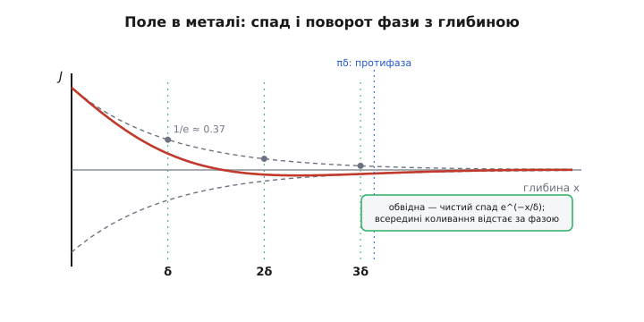
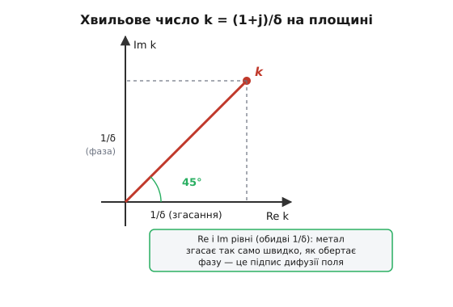

# 🧮 Виведення глибини проникнення δ = √(2ρ/ωμ)

Формулу глибини проникнення легко запам'ятати й легко застосувати — але доти, доки її просто оголошено, кожна буква в ній лишається на віру. Чому саме корінь? Чому частота внизу, а опір угорі? Чому спад густини — рівно експоненційний, а не якийсь інакший? І звідки береться те магічне «1/e», яким означають саму δ? На всі ці «чому» є одна відповідь, і вона ховається в тому, що всередині металу рівняння Максвела перестають описувати хвилю, яка вільно летить, і починають описувати щось геть інше — **дифузію поля**, повільне просочування, як тепла в стінку. Пройдемо цей шлях від початку до кінця: з двох законів електромагнетизму дістанемо рівняння руху поля в металі, розв'яжемо його для найпростішого випадку — плаского краю металу — і побачимо, як звідти самі собою випадуть і експонента, і δ, і зсув фази, і поверхневий опір.

Домовимося про єдине спрощення, яке працюватиме всюди далі, і сформулюймо, чому воно чесне.

## Чому в металі струм зміщення можна викинути

Рівняння Максвела в загальному вигляді тримають два джерела магнітного поля: справжній струм провідності (рух зарядів) і струм зміщення (змінне електричне поле саме собою, без жодного руху зарядів). У вакуумі чи діелектрику лишається тільки другий — і саме він робить електромагнітну хвилю хвилею, дозволяючи полю летіти крізь порожнечу. У металі ж є вільні електрони, тож обидва джерела присутні. Питання лише в тому, котре з них більше.

Порівняймо їх на пальцях. Струм провідності — це J = σ·E, де σ — питома провідність (величина, обернена до питомого опору: σ = 1/ρ). Струм зміщення — це швидкість зміни електричного зсуву, ∂D/∂t = ε·∂E/∂t; для поля, що коливається з частотою ω, похідна за часом дає множник ω, тож за амплітудою це ω·ε·E. Відношення двох густин:

```
J_провід     σ·E        σ
────────  =  ──────  =  ────
J_зміщ      ω·ε·E      ω·ε
```

Підставмо мідь на найгіршому для нас, найвищому радіодіапазоні. У міді σ ≈ 6·10⁷ См/м, а діелектрична проникність — приблизно як у вакуумі, ε ≈ 8.85·10⁻¹² Ф/м. Візьмімо навіть 1 ГГц (ω ≈ 6.3·10⁹ рад/с):

```
σ / (ω·ε) = 6·10⁷ / (6.3·10⁹ · 8.85·10⁻¹²) ≈ 6·10⁷ / 0.056 ≈ 1.1·10⁹
```

Струм провідності більший за струм зміщення **у мільярд разів**. У доброму провіднику ця перевага тримається аж до інфрачервоних частот; на всьому діапазоні, який цікавить електроніку — від мережевих 50 Гц до одиниць гігагерц, — струм зміщення просто губиться на тлі провідності. Тож ми його чесно викидаємо. І тільки-но ми це зробили, характер рівнянь міняється докорінно: рівняння хвилі перетворюється на рівняння дифузії. Саме ця підміна й породить усю фізику скін-ефекту.

> 🔧 **Навіщо це.** Це не педантизм, а межа застосовності всієї формули δ. Вона працює **лише** там, де метал поводиться як провідник, а не як діелектрик, — тобто поки σ ≫ ω·ε. На надвисоких частотах (оптика, плазмоніка) ця нерівність ламається, і скін-ефект у звичному вигляді зникає — метал стає майже прозорим. Але для будь-якої задачі електроніки, силової чи радіо, ми з колосальним запасом усередині зони, де струм зміщення нехтовний.

## Два закони, з яких усе виходить

Нам потрібні рівно два рівняння Максвела — ті, що зв'язують електричне й магнітне поле через їхні завихрення (curl, ротор). Ротор — це міра того, наскільки поле «закручене» в даній точці; для наших цілей достатньо знати, що він перетворює просторову зміну одного поля на джерело іншого.

**Закон Ампера** (без струму зміщення, як ми домовилися): завихрення магнітного поля породжується струмом провідності.

```
∇×H = J = σ·E
```

Читається так: там, де тече струм, магнітне поле навколо нього закручується. Це кількісний бік тієї самої картини, що й компас біля проводу.

**Закон Фарадея** (електромагнітна індукція): завихрення електричного поля породжується швидкістю зміни магнітного.

```
∇×E = −∂B/∂t = −μ·∂H/∂t
```

Читається так: там, де магнітне поле міняється в часі, навколо нього закручується електричне — те саме, що наводить струм у витку котушки. Мінус — це закон Ленца в математичному вбранні: наведене поле спрямоване так, щоб опиратися зміні. Тут μ — магнітна проникність металу (для міді практично μ₀ = 4π·10⁻⁷ Гн/м; для заліза — у сотні разів більша), а B = μ·H зв'язує магнітну індукцію з напруженістю.

Ці два закони вже містять усю суть скін-ефекту, тільки в неявному вигляді. Закон Ампера каже: струм робить магнітне поле. Закон Фарадея каже: змінне магнітне поле робить електричне (а отже — за σ·E — і вихровий струм). Замкнімо це коло: струм → поле → змінне поле → наведений струм, який протидіє. Саме це коло ми зараз і згорнемо в одне рівняння для поля.

Логіку цих двох законів — індукцію, закон Ленца, знак «мінус» — детально розібрано в темі про [індуктивний опір](root:hw-components/inductive-reactance): змінне магнітне поле наводить електрорушійну силу, спрямовану проти зміни струму. Тут ми беремо це як робочий інструмент.

## Згортаємо два рівняння в одне: рівняння дифузії поля

Маємо два рівняння з двома невідомими полями, E і H. Мета — виключити одне поле й дістати одне рівняння для другого. Стандартний хід: узяти ротор від закону Фарадея.

```
∇×(∇×E) = ∇×(−μ·∂H/∂t) = −μ·∂(∇×H)/∂t
```

У правій частині всередині похідної за часом стоїть ∇×H — а це, за законом Ампера, дорівнює σ·E. Підставляємо:

```
∇×(∇×E) = −μ·∂(σ·E)/∂t = −μσ·∂E/∂t
```

Тепер ліву частину розкриваємо через відому тотожність векторного аналізу: ∇×(∇×E) = ∇(∇·E) − ∇²E. У металі вільних об'ємних зарядів немає (вони миттєво розтікаються по поверхні), тому ∇·E = 0, і перший доданок зникає. Лишається просто −∇²E. Скорочуючи мінуси з обох боків, дістаємо чисте рівняння для електричного поля:

```
∇²E = μσ · ∂E/∂t
```

Точнісінько так само, узявши ротор від закону Ампера й підставивши туди Фарадея, дістаємо рівняння тієї самої форми для магнітного поля:

```
∇²H = μσ · ∂H/∂t
```

Ось воно — серце всієї теми. Придивімося, що це за звір. Ліворуч — просторова кривина поля (лапласіан ∇², друга похідна за координатами). Праворуч — швидкість зміни поля в часі. Рівняння, у якому друга похідна за простором дорівнює першій похідній за часом, має власну назву й власний характер: це **рівняння дифузії** (або теплопровідності). Точнісінько така сама математика описує, як тепло просочується в глибину стінки, як крапля чорнила розпливається у воді, як домішка дифундує в кристал. Поле в металі не летить хвилею — воно **просочується**, дифундує вглиб, гальмуючись і згасаючи.

Це найважливіший поворот усього виведення, тож зупинимося на ньому. У діелектрику (де ми лишили б струм зміщення) праворуч стояла б **друга** похідна за часом, ∂²E/∂t², — і це рівняння хвилі, поле летить без утрат зі швидкістю світла. Одна відмінність — перша похідна проти другої — і фізика інша: замість вільного польоту маємо в'язке просочування з тертям. Тертя тут — це омічні втрати: наведений вихровий струм тече крізь опір металу й гріє його, з'їдаючи енергію поля. Саме тому поле й згасає вглиб. Скін-ефект — це, по суті, **дифузія електромагнітного поля в провідник**, і глибина проникнення δ виявиться характерною глибиною цієї дифузії.

> 🔧 **Навіщо це.** Аналогія з теплом — не прикраса, а робочий інструмент інтуїції. Як тепло від гарячої поверхні проникає в стінку тим глибше, чим повільніше гріємо (нижча частота коливань температури) і чим краще стінка проводить тепло, — так і поле проникає в метал тим глибше, чим нижча частота й чим гірше метал проводить струм. Хто відчув дифузію тепла, той наперед угадає всю поведінку δ, ще не бачивши формули.

## Розв'язуємо для півпростору: звідки береться експонента

Загальне рівняння в об'ємі складне, але вся суть скін-ефекту видна вже на найпростішій геометрії — **півпростір**. Уявімо, що весь метал заповнює половину світу: праворуч від площини x = 0 суцільна мідь, ліворуч — порожнеча, а поле притиснуте до поверхні ззовні. Координата x — це глибина в метал. Такий плаский край локально наближає й поверхню товстого проводу, і стінку шини, коли δ набагато менша за радіус кривини: струмові байдуже, що десь далеко провід круглий, — він відчуває лише плаский метал під собою.

Поле в металі коливається в часі з тією самою частотою ω, що й джерело. Змінну часу зручно відокремити стандартним прийомом — комплексною амплітудою (фазором): пишемо поле як добуток просторової частини на коливання e^(jωt), а всю фізику згортаємо в комплексне число, що несе і амплітуду, і фазу. Нехай магнітне поле спрямоване вздовж поверхні (скажімо, по осі z) і залежить тільки від глибини x:

```
H(x, t) = H(x) · e^(jωt)
```

Підставмо це в рівняння дифузії. Оскільки поле міняється лише вздовж x, лапласіан ∇² зводиться до другої похідної d²/dx². А похідна за часом від e^(jωt) просто дає множник jω. Рівняння дифузії стає звичайним диференціальним рівнянням для просторової частини H(x):

```
d²H/dx² = μσ · jω · H = jωμσ · H
```

Це рівняння вигляду «друга похідна = стала × сама функція». Його розв'язок — експонента e^(kx), де k — корінь із тієї сталої:

```
k² = jωμσ        →        k = √(jωμσ)
```

Уся сіль — у цьому корені з уявної одиниці j. Скористаймося тим, що j = e^(jπ/2) (уявна одиниця — це поворот на 90°), тож корінь із неї — поворот на 45°:

```
√j = e^(jπ/4) = cos45° + j·sin45° = (1 + j)/√2
```

Підставляємо й акуратно збираємо множники:

```
k = √(ωμσ) · √j = √(ωμσ) · (1 + j)/√2 = (1 + j)·√(ωμσ/2)
```

Тепер визначмо одним символом ту довжину, що ховається в корені, — і вона одразу виявиться нашою δ. Позначмо:

```
1/δ = √(ωμσ/2)        →        δ = √(2/(ωμσ)) = √(2ρ/(ωμ))
```

(остання рівність — бо σ = 1/ρ). **Ось вона, шукана формула — і не оголошена, а виведена.** Корінь, частота внизу, опір угорі — усе випало саме з кореня √(jωμσ), а той узявся з того, що рівняння дифузії має першу похідну за часом (звідки один множник ω під коренем) і другу за простором (звідки корінь загалом). Через цю δ хвильове число записується гранично коротко:

```
k = (1 + j)/δ
```

Комплексне хвильове число k, у якому дійсна й уявна частини рівні, — це підпис дифузії поля; саме рівність цих частин зробить згодом реактивний опір рівним активному.

## Складаємо розв'язок: спад і обертання разом

Повний розв'язок для поля в глибині металу — це H(x) = H₀·e^(−kx) (беремо знак мінус, бо поле мусить спадати вглиб, а не рости до нескінченності). Розпишімо експоненту, підставивши k = (1+j)/δ:

```
H(x) = H₀ · e^(−(1+j)x/δ) = H₀ · e^(−x/δ) · e^(−jx/δ)
```

Дивімося на два множники окремо — кожен несе свій шматок фізики.

**Перший множник, e^(−x/δ) — це спад амплітуди.** Він дійсний і завжди менший за одиницю, тож із глибиною поле слабшає. І слабшає **експоненційно** — ось звідки взявся той плавний експоненційний спад, про який говорять, описуючи скін-ефект. На глибині x = δ показник дорівнює −1, тож поле падає до e⁻¹ ≈ 0.368 від поверхневого. **Ось воно, те саме «1/e»**, яким означають глибину проникнення: δ — це глибина, на якій амплітуда поля (а разом із нею і густина струму J = σ·E, бо вони пропорційні) спадає рівно в e разів. Не якесь довільне число — саме e, бо саме e стоїть в експоненті розв'язку рівняння дифузії. На 2δ лишається e⁻² ≈ 0.135, на 3δ — e⁻³ ≈ 0.050. Тобто в шарі завтовшки кілька δ поле практично догасає, і глибше метал майже не працює.

**Другий множник, e^(−jx/δ) — це поворот фази.** Він за модулем дорівнює одиниці (амплітуди не чіпає), зате крутить фазу поля тим більше, чим глибше. Це означає, що коливання струму на глибині **відстає** за фазою від коливання на поверхні: поки хвиля дифундує вглиб, вона запізнюється. На глибині x = δ фаза зсунута на 1 радіан (≈ 57°), на глибині x = πδ — на 180°, тобто струм у цьому шарі тече вже **в протифазі** до поверхневого: коли зверху струм на північ, там — на південь. Це не парадокс, а прямий наслідок скінченної швидкості просочування поля — та сама природа, що робить наведений вихор у центрі проводу зустрічним до основного струму.


*Розв'язок H(x) = H₀·e^(−x/δ)·e^(−jx/δ) наочно. Обвідна (штрихова) — чистий експоненційний спад e^(−x/δ): на δ це 1/e ≈ 0.37, на 2δ — 0.14, на 3δ — 0.05. Усередині обвідної біжить саме коливання: із глибиною воно не лише слабшає, а й відстає за фазою (крива зсувається праворуч). На глибині πδ струм уже в протифазі до поверхневого. Спад і поворот — два боки одного комплексного показника (1+j)/δ.*

Разом ці два множники й дають цілісну картину: **згасна біжуча хвиля**, що заходить у метал, слабшаючи з кроком δ і відстаючи за фазою з тим самим кроком. Її можна уявити як звичайну хвилю, у якої і довжина, і глибина згасання — та сама величина δ (точніше, довжина хвилі в металі λ = 2πδ). Це геть не схоже на хвилю у вакуумі, де амплітуда трималася б, а довжина хвилі була б у мільйони разів більша. Метал душить поле за одну-єдину довжину хвилі — тому струм і не встигає проникнути глибоко.

Щоб побачити, наскільки коротка ця хвиля, підставмо мідь на 1 МГц: δ ≈ 66 мкм, тож довжина хвилі в металі λ = 2π·66 мкм ≈ 0.4 мм. У повітрі хвиля на 1 МГц має довжину 300 метрів. Метал стискає її майже в мільйон разів і тут-таки гасить — за один свій крок вона вже майже зникла. Саме тому струм притиснутий до тонкої шкірки: далі просто немає куди дійти незгаслою хвилі.

## Комплексне хвильове число на площині: чому 45°

Варто на мить затримати погляд на самому числі k = (1+j)/δ, бо вся дивина скін-ефекту закодована в його положенні на комплексній площині. Число (1+j) лежить точно на бісектрисі першого квадранта — під кутом 45°, з рівними дійсною й уявною частинами. Ця рівність не випадкова й не приблизна: вона — прямий відбиток того, що під коренем стояло чисте уявне число jωμσ, а корінь із уявного завжди дає рівно 45°.

А тепер згадаймо, що означають дійсна й уявна частини показника −kx. Дійсна частина (той самий 1/δ) керує **згасанням** — як швидко амплітуда падає. Уявна частина (теж 1/δ) керує **обертанням фази** — як швидко хвиля запізнюється. Рівність цих двох частин означає незвично сильну річ: **у металі поле згасає рівно так само швидко, як обертається**. За той самий крок глибини δ, за який амплітуда падає в e разів, фаза встигає провернутися на 1 радіан. У вільній хвилі ці два процеси розв'язані (можна мати слабке згасання при швидкому обертанні); у дифузії поля вони жорстко пов'язані в одне. Це і є математичний відбиток того, що поле не летить, а просочується.


*Комплексне хвильове число k = (1+j)/δ. Воно лежить точно на бісектрисі 45°, бо взялося з кореня з чисто уявного jωμσ. Дійсна вісь (Re k = 1/δ) — темп згасання амплітуди вглиб; уявна (Im k = 1/δ) — темп обертання фази. Їхня рівність — підпис дифузії: за один крок δ поле і слабшає в e разів, і провертається на 1 радіан. Модуль |k| = √2/δ.*

## Від поля до опору: поверхневий імпеданс

Формула δ описує, як глибоко заходить поле. Але інженерові потрібне число, яке б зв'язало це з тим, що він міряє в колі, — з **опором**. Це число зветься **поверхневий імпеданс** Zs (англ. *surface impedance*): він каже, який опір «бачить» струм, що тече по поверхні металу з цим експоненційним профілем углиб. Виведемо його прямо з нашого розв'язку.

Поверхневий імпеданс за означенням — це відношення дотичного електричного поля на поверхні до повного струму, що тече в шарі під одиницею ширини поверхні; за розмірністю та фізикою це імпеданс на квадрат поверхні (Ом). Його можна дістати коротшим шляхом — через відношення поля E до поля H на поверхні. Із закону Ампера в нашій одновимірній задачі E і H зв'язані через k: беручи ротор для плоскої хвилі, дістаємо E = (k/σ)·H на поверхні (з точністю до напрямку). Відношення E до H і є імпеданс:

```
Zs = E/H = k/σ = (1 + j)/(σ·δ)
```

Ось і поверхневий імпеданс — і він теж комплексний, і теж під 45°, успадкувавши це від k. Розкладімо його на дві частини, бо кожна має ясний технічний сенс:

```
Zs = Rs + j·Xs        Rs = 1/(σ·δ) = ρ/δ        Xs = 1/(σ·δ) = ρ/δ
```

**Дійсна частина Rs = ρ/δ — це поверхневий опір** (англ. *surface resistance*), той самий активний опір на квадрат, що гріє метал. Придивімося, що він каже: опір такий, наче весь струм тече рівномірно в шарі завтовшки рівно δ. Тобто складний експоненційний профіль густини дає точнісінько такий самий опір, як простенька модель «увесь струм у шарі δ, глибше нічого». Це не збіг, а математична властивість експоненти: інтеграл e^(−x/δ) від 0 до нескінченності дорівнює δ — площа під експонентою така сама, як під прямокутником заввишки в поверхневе значення й завширшки δ. Ось строге виправдання того наочного правила «робочий шар — це δ», яким користуються, рахуючи опір проводу на частоті.

**Уявна частина Xs = ρ/δ — це поверхнева реактивність**, внесок внутрішньої індуктивності металу. І вона рівна активному опору — знову той самий підпис 45°. Це означає дуже конкретну річ для високочастотного проводу: на високій частоті його внутрішня індуктивна складова реактивного опору **дорівнює** його активному опору. Струм у поверхневому шарі не лише гріє метал (Rs), а й запізнюється відносно напруги (Xs) — і рівно настільки ж. Обидві складові ростуть з частотою однаково, як √f, бо обидві обернені до δ, а δ падає як 1/√f.

> 🔧 **Навіщо це.** Поверхневий опір Rs = ρ/δ — це та єдина величина, якою реально користуються, коли рахують високочастотні втрати. Опір смужки чи витка на частоті — це просто Rs, помножений на довжину й поділений на ширину провідника (число «квадратів» поверхні), як опір тонкої плівки. Саме через Rs рахують загасання в лініях передачі, добротність котушок і резонаторів, утрати в екранах. А рівність Rs = Xs пояснює, чому високочастотний провід — це завжди «опір плюс рівна йому індуктивність»: одне без одного не буває, обоє родом з тієї самої дифузії поля.

## Звідки береться правило δ(мм) ≈ 66/√f для міді

Лишилося показати, що загальна формула δ = √(2ρ/(ωμ)) справді згортається в те зручне число, яким користуються практики. Підставмо ω = 2πf і винесімо частоту окремо:

```
δ = √( 2ρ / (2πf·μ) ) = √( ρ / (π·μ·f) ) = √( ρ/(π·μ) ) · (1/√f)
```

Уся частотна залежність — це множник 1/√f; решта — стала, що залежить лише від металу. Порахуймо цю сталу для міді, підставивши її числа: ρ = 1.68·10⁻⁸ Ом·м, μ = μ₀ = 4π·10⁻⁷ Гн/м (мідь немагнітна, μ_r = 1).

**Стала для міді.** Рахуємо √(ρ/(π·μ)) в одиницях СІ (метри):

```
ρ/(π·μ) = 1.68·10⁻⁸ / (π · 4π·10⁻⁷)
        = 1.68·10⁻⁸ / (3.95·10⁻⁶)
        ≈ 4.25·10⁻³
√(4.25·10⁻³)  ≈ 0.0652   [м·√Гц]
```

Отже δ ≈ 0.0652/√f метра, тобто **65.2/√f у міліметрах** (домножили на 1000). Практичне правило заокруглює цю сталу до 66 — звідси й знайоме δ(мм) ≈ 66/√f. Перевірмо на контрольній точці 1 МГц:

```
δ(1 МГц) = 65.2 / √(10⁶) = 65.2 / 1000 = 0.0652 мм = 65 мкм
```

Збігається з тими 66 мкм, що фігурують у розрахунках проводів на 1 МГц (мала розбіжність — від заокруглення сталої 65.2 → 66). Ось код, який рахує δ для будь-якого металу з першого принципу, без жодних заокруглених констант, — саме так це роблять у прошивці чи в інженерному калькуляторі:

:::tabs
```c
// Глибина проникнення δ = sqrt(2·rho / (omega·mu)) — прямо з формули, без сталих-заокруглень.
// Повертає δ у метрах; f — частота в Гц, rho — питомий опір (Ом·м), mu_r — відносна проникність.
#include <math.h>

float skin_depth(float f, float rho, float mu_r) {
    const float MU0 = 1.256637e-6f;    // магнітна стала, Гн/м (4π·10⁻⁷)
    float mu = mu_r * MU0;             // повна проникність металу
    float w  = 2.0f * (float)M_PI * f; // колова частота ω = 2πf
    return sqrtf(2.0f * rho / (w * mu));
}

// Приклад: мідь на 1 МГц.
//   skin_depth(1.0e6f, 1.68e-8f, 1.0f)  ->  ≈ 6.52e-5 м = 65 мкм
```
```python
# Глибина проникнення δ = sqrt(2·rho / (omega·mu)) — прямо з формули, без сталих-заокруглень.
# Повертає δ у метрах; f — частота в Гц, rho — питомий опір (Ом·м), mu_r — відносна проникність.
import math

def skin_depth(f, rho, mu_r):
    MU0 = 1.256637e-6         # магнітна стала, Гн/м (4π·10⁻⁷)
    mu = mu_r * MU0           # повна проникність металу
    w  = 2.0 * math.pi * f    # колова частота ω = 2πf
    return math.sqrt(2.0 * rho / (w * mu))

# Приклад: мідь на 1 МГц.
#   skin_depth(1.0e6, 1.68e-8, 1.0)  ->  ≈ 6.52e-5 м = 65 мкм
```
:::

Загальніший вигляд, який часто наводять у довідниках, — δ(мм) ≈ 503·√(ρ/(μ_r·f)) (ρ у Ом·м) — це рівно та сама формула: усередині кореня 503 = √(2/μ₀)·1000/√(2π), просто зібране в один множник для будь-якого металу. Для міді, підставивши ρ = 1.68·10⁻⁸ і μ_r = 1, воно дає ті самі 65/√f. Заліза з його μ_r у сотні разів більшою — δ у √(сотні) ≈ 10–30 разів менша: ось математичний доказ того, чому в феромагнетику струм тримається геть тонесенької шкірки.

## Що ця математика дала темі

Ми почали з двох законів Максвела — Ампера й Фарадея — і, викинувши нехтовний струм зміщення, згорнули їх у рівняння дифузії поля ∇²H = μσ·∂H/∂t. Розв'язавши його для плаского краю металу, ми не оголосили, а **побачили народження** кожного шматка формули: комплексне хвильове число k = (1+j)/δ дало і згасну біжучу хвилю, і рівно-експоненційний спад амплітуди, і поворот фази з глибиною; глибина δ = √(2ρ/ωμ) випала сама як довжина, схована в корені; множник 1/e виявився не домовленістю, а прямим значенням експоненти на глибині δ; поверхневий імпеданс Zs = (1+j)/(σδ) звів усе до інженерного опору Rs = ρ/δ і показав, що складний профіль струму опором своїм рівний простій моделі «шар завтовшки δ»; а число 66/√f для міді виявилося просто сталою металу під тим коренем. Тепер у формулі глибини проникнення немає жодної букви на віру — кожну видно з того, що всередині металу поле не летить, а дифундує, і δ — характерна глибина цієї дифузії.
