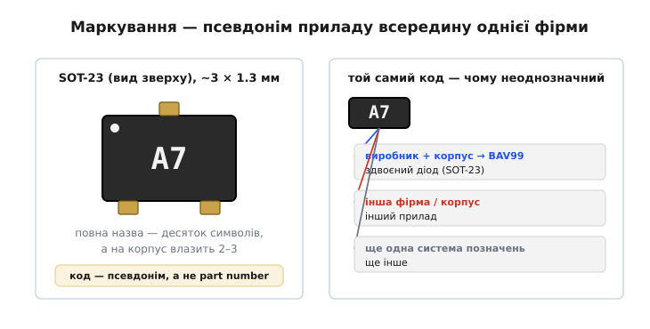
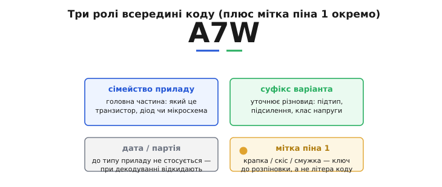
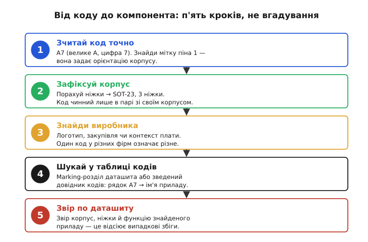
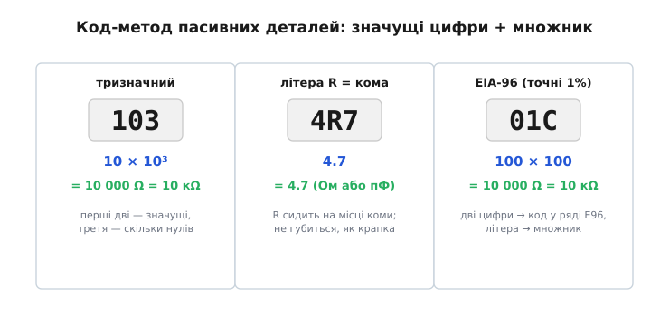

# 🔌 Маркування SMD

На корпусі крихітного транзистора чи діода ви знайдете не назву, а загадковий рядок із двох-трьох знаків — щось на кшталт `A7`. Це **SMD-маркування** *(від англ. surface-mount device — прилад поверхневого монтажу)*: короткий код, нанесений лазером або фарбою, який заміняє повну назву там, де її фізично нема куди подіти. І перше, що варто засвоїти про цей код, найважливіше: він **не однозначний сам собою**. Той самий `A7` у різних виробників означає різні прилади — тож декодування маркування це не «зазирнути в один словник», а маленьке розслідування.

## Маркування — це псевдонім, а не ім'я

Чому взагалі код, а не назва? Корпус поверхневого монтажу буває крихітний. Класичний **SOT-23** *(small-outline transistor — малий транзисторний корпус)* має приблизно 3 × 1.3 мм, менший за рисове зернятко. Повна назва приладу — скажімо, `MMBT3904LT1G` — це десяток-півтора символів; на таку площу їх читабельно не покласти. Тож виробник наносить **код** — рядок із 2–4 знаків, який у його системі позначень однозначно вказує на конкретний прилад.

І ось ключове розрізнення: маркування — це **не part number**. Part number (повне замовне ім'я, як-от `BAV99`) однозначний у всьому світі: за ним ви закажете деталь у будь-якого постачальника й отримаєте те саме. Код на корпусі лише **скорочення**, чинне **в межах системи позначень одного виробника й одного корпусу**. Той самий `A7` у фірми X може бути здвоєним діодом, а в фірми Y — зовсім іншим приладом, бо системи позначень у них свої й між собою не узгоджені. Саме тому за кодом не можна одразу назвати деталь: спершу треба звузити, **чий** це код і в **якому** корпусі.


*Код на корпусі однозначний лише всередині системи одного виробника й одного корпусу — це псевдонім приладу, а не глобальне ім'я. Той самий `A7` у різних фірм веде до різних приладів, тож першими фільтрами стають корпус і виробник, а не сам код.*

> 🔧 **Навіщо це.** Декодування маркування потрібне щоразу, коли ви тримаєте плату, а схеми до неї немає: треба зрозуміти, що це за деталь, перш ніж її замінити чи повторити схему. Без цього вміння крихітний прилад із кодом `A7` лишається анонімом — і ремонт або реверс плати глухне на першому ж непідписаному корпусі.

## З чого зібраний код

Якщо код це псевдонім, корисно розібрати, з яких частин той псевдонім зібраний. Системи в різних виробників свої, та всередині коду майже завжди ховаються ті самі три ролі — їх корисно бачити окремо.

- **Сімейство приладу** *(device family)* — головна частина коду, що вказує на сам прилад: який це транзистор, діод чи мікросхема. У коді `A7W` основу несуть символи `A7`.
- **Суфікс варіанта** — додаткова буква, що уточнює різновид: підтип, коефіцієнт підсилення, клас напруги або **корпус**. Часто це остання буква. У `A7W` суфікс `W` означає, що це той самий прилад, але в меншому корпусі (SC-70 замість SOT-23), — варіант сімейства, не окреме сімейство.
- **Код партії або заводу** *(date/lot code)* — інколи до маркування додають окремий символ чи крапку, що позначає тиждень випуску або лінію. До типу приладу він стосунку не має, тож при декодуванні його **відкидають**.

Окремо стоїть **орієнтир піна 1**. На багатьох корпусах поряд із кодом є **крапка, скіс кута або смужка** — мітка, що задає, з якого боку рахувати ніжки. Її не плутають із символом коду: це не літера, а ключ до [розпіновки корпусу](root:hw-components/packages-pinout).


*Те, що виглядає суцільним рядком, насправді складене з ролей: головна частина — сімейство приладу, остання буква — суфікс варіанта (підтип чи навіть корпус). Дата/партія до типу не стосується й відкидається, а мітка піна 1 — це орієнтир розпіновки, а не знак коду.*

## Корпус — перший фільтр

Друга опора декодування — **корпус**, бо код чинний лише в парі зі своїм корпусом: для кожного корпусу виробник веде **окрему** таблицю кодів. Двох-трьох символів вистачає на сотні позначень саме тому, що їх розводять по різних корпусах — однаковий рядок в іншому корпусі належить уже іншій таблиці. Тож корпус каже, **в якій із таблиць** шукати, і визначити його треба раніше, ніж розшифровувати самі символи.

Практично корпус упізнають за двома ознаками: **число ніжок** і **форма**. Три ніжки в маленькому пластмасовому корпусі — майже напевно SOT-23 (родина дрібних транзисторів і діодів). П'ять-шість ніжок — SOT-23-5 або SOT-23-6 (там уже бувають мікросхеми). Дві ніжки в циліндрі чи бруску — діод. Порахувавши ніжки й глянувши на обриси, ви вже знаєте, в якому розділі довідника шукати код.

## Процедура декодування

Маємо дві опори — ролі коду й корпус як перший фільтр. Лишається зібрати їх у впорядковану процедуру: як від коду дійти до приладу. Це послідовність дій, а не вгадування, і пропуск будь-якого кроку — особливо «чий це код» — веде до хибної відповіді.


*Декодування коду — це впорядкована процедура з п'яти кроків. Найслабша ланка — третій крок: поки виробник невідомий, відповідь лишається тільки ймовірною, бо один код у різних фірм означає різне.*

**Крок 1. Зчитай код точно.** Під лупою або камерою телефона з макрозйомкою розберіть символи без здогадок. Тут легко помилитися, тож фіксуйте кожен знак: велике це `A` чи мале, цифра `7` чи буква. Окремо знайдіть мітку піна 1.

**Крок 2. Зафіксуй корпус.** Порахуйте ніжки й визначте корпус (SOT-23, SOT-23-5, SOD-323…). Це звужує пошук до однієї таблиці.

**Крок 3. Знайди виробника.** Це найважче й найважливіше. Іноді на платі є логотип фірми; іноді відомо із закупівлі, чий компонент стоїть; іноді підказує контекст схеми. Поки виробник невідомий — відповідь буде лише ймовірною.

**Крок 4. Шукай у таблиці кодів.** Є два шляхи. Перший — **таблиця маркування в самому даташиті**: у багатьох даташитах є розділ *Marking Information*, де прямо написано, який код наносять на який корпус. Другий — **зведений довідник кодів** *(marking codes database — база кодів маркування)*: онлайн-бази й офлайн-довідники, де за кодом і корпусом знаходять ім'я приладу. У такому довіднику рядок `A7` для SOT-23 дає кандидата — наприклад, конкретний прилад.

**Крок 5. Звір по даташиту.** Знайшовши кандидата, **відкрийте його даташит** і переконайтеся, що все збігається: той самий корпус, та сама кількість ніжок, та сама функція, той самий код у розділі маркування. Цей крок відсіює випадкові збіги — і саме він перетворює здогад на впевнену відповідь.

### Приклад: `A7` на SOT-23

Пройдімо процедуру на справжньому коді. На платі стоїть корпус із трьома ніжками й маркуванням `A7`.

```
Крок 1.  Символи: A7 (велике A, цифра 7). Поряд — крапка-мітка піна 1.
Крок 2.  Три ніжки, маленький пластмасовий корпус → SOT-23.
Крок 3.  Логотип на платі / закупівля вказують на типового виробника
         дрібних діодів (Nexperia, onsemi, Diodes Inc. — система схожа).
Крок 4.  Таблиця для SOT-23: рядок «A7» → BAV99.
Крок 5.  Даташит BAV99: SOT-23, 3 ніжки, маркування A7 ✔
         функція — здвоєний перемикальний діод (два діоди в одному корпусі).
```

Висновок: `A7` на SOT-23 — це **BAV99**, здвоєний перемикальний діод; його часто ставлять на лінії даних і входи мікроконтролера. А якби той самий прилад трапився з кодом `A7W`, суфікс `W` сказав би, що це той самий BAV99, але в меншому корпусі SC-70 — інша таблиця, інакший монтаж, та сама внутрішня функція.

Сам клас здвоєного діода вартий окремого погляду: три ніжки, а діодів усередині два, і від того, як з'єднана спільна ніжка (послідовна пара, спільний анод чи спільний катод), повністю залежить, куди його можна ставити. Це розібрано у вставці [здвоєний діод у SOT-23](root:hw-components/smd-marking/comp-dual-diode-sot23.md).

> 🔧 **Навіщо це.** Здвоєний діод `A7` легко переплутати з одиночним або з транзистором, якщо взяти першу-ліпшу відповідь із довідника. А переплутати означає поставити на лінію зовсім не той прилад — захист не спрацює або сигнал спотвориться. Звірка по даташиту (крок 5) коштує хвилину й рятує цю помилку до того, як плата піде під напругу.

## Пасивні деталі: інший код, той самий прийом

Резистори й конденсатори для поверхневого монтажу мають **власну** систему маркування — числові коди номіналу, які не плутають із кодами активних приладів. Та принцип за ними той самий, що тисне на все маркування: на корпус завбільшки з макове зерно повне число «10000» не вмістиш, тож номінал стискають прийомом **«значущі цифри + множник»**. Варто прочитати кілька таких кодів, щоб упізнавати цю логіку всюди.


*Один і той самий прийом у трьох обличчях: тризначний код кладе множник останньою цифрою (скільки нулів), літера R заміняє кому, а EIA-96 ховає три значущі цифри у дводизначний код ряду E96 плюс літеру-множник.*

**Тризначний код резистора.** Перші дві цифри — значущі знаки, третя — **скільки нулів дописати** (показник десятого степеня):

```
103  →  10 × 10³  =  10 000 Ω  =  10 кΩ
472  →  47 × 10²  =   4 700 Ω  =  4.7 кΩ
100  →  10 × 10⁰  =      10 Ω
```

**Літера R замість коми.** Для малих значень десяткову кому ставлять **на місце літери `R`** — друкована крапка на такій крихті забилася б або зчиталася як подряпина, а літера займає цілу позицію й не губиться:

```
4R7  →  4.7        (4.7 Ом у резистора або 4.7 пФ у конденсатора)
R47  →  0.47       (R на початку — нуль цілих)
```

**SMD-код конденсатора.** Той самий тризначний запис, але база — завжди **пікофарад** (пФ), хоч її ніде й не пишуть. Тому `104` це не «сто чотири», а `10 × 10⁴`:

```
104  →  10 × 10⁴  =  100 000 пФ  =  100 нФ   (найужиточніша розв'язка живлення)
```

**Код EIA-96** *(від назви стандарту Electronic Industries Alliance — об'єднання виробників електроніки)* — формат для точних резисторів ряду E96 (допуск 1 %), де навіть три цифри «100» довші за код, а на дрібному корпусі кожен знак на вагу золота. Тут дві цифри — це **не саме значення**, а **порядковий код** значення в ряді E96 (його дивляться в таблиці), а літера задає **множник**:

```
01C  →  код 01 = 100  ·  літера C = ×100  =  10 000 Ω  =  10 кΩ
01A  →  код 01 = 100  ·  літера A = ×1    =     100 Ω
38C  →  код 38 = 243  ·  літера C = ×100  =  24 300 Ω
```

Літери-множники йдуть за десятками: `A` ×1, `B` ×10, `C` ×100, `D` ×1000, `E` ×10⁴, `F` ×10⁵, а дробові — `X` ×0.1, `Y` ×0.01. Повну розшифровку коду й кольорових кілець резистора дає окрема [стаття про маркування резисторів](root:hw-components/resistor-marking); SMD-коди й типорозміри конденсаторів — [маркування конденсаторів](root:hw-components/capacitor). Тут важлива сама нитка: і активний прилад, і пасивна деталь стискають своє позначення під брак місця, лише активний код веде до **імені приладу**, а пасивний — прямо до **числа номіналу**.

> 🔧 **Навіщо це.** Сплутати тут легко, а ціна висока. Прочитати конденсаторний `104` як 104 пФ замість 100 нФ — це помилитися в **мільйон разів** по ємності: розв'язка не працюватиме, мікроконтролер скидатиметься на ходу. А прийняти EIA-96 `01C` за «звичайний» тризначний код дасть зовсім інше число. Упізнавши, який це формат, ви читаєте номінал за секунду й не ставите деталь, що тихо завалить схему.

## Типові граблі

Процедура виглядає простою, та зривається вона майже завжди на тих самих місцях.

- **Сплутані символи.** На дрібному корпусі легко переплутати `0`/`O`, `1`/`I`, `5`/`S`, `8`/`B`, `2`/`Z`. Не вгадуйте — дивіться під збільшенням і звіряйте регістр (великі й малі літери в кодах значать різне).
- **Перевернутий корпус.** Читаючи код «догори ногами», `A7` легко прочитати як щось інше. Спершу знайдіть мітку піна 1 (крапку чи скіс) і зорієнтуйте корпус правильно, а вже потім читайте символи.
- **Ігнорування виробника.** Найпідступніша помилка: знайти код у першому-ліпшому довіднику й узяти першу відповідь, не звіривши, чий він. Один код у різних фірм означає різні прилади — без виробника відповідь ненадійна.
- **Код партії за код приладу.** Зайвий символ чи крапка поряд з основним кодом — це часто дата або партія, а не частина типу. Не намагайтеся «вкласти» його в назву приладу.
- **Зупинка на кандидаті без звірки.** Знайшли ім'я в таблиці — це ще не кінець. Поки не відкрили даташит і не звірили корпус та функцію, відповідь — лише гіпотеза.

## Варіації класу

Розібрана на SOT-23 процедура переноситься на решту дрібних корпусів — лише з поправками.

- **Двоногі діоди** (SOD-323, SOD-123, MELF): коди ще коротші (одна-дві позиції), а орієнтацію задає **смужка-катод**, а не крапка.
- **SOT-23-5/-6 і дрібні мікросхеми**: коди довші (4–5 символів), із власними скороченнями виробника — частіше доводиться лізти саме в розділ *Marking Information* даташита.
- **Зовсім крихітні корпуси** (SC-70, SOT-553): місця так мало, що код стискають до однієї-двох позицій — неоднозначність ще гостріша, тож виробник і даташит критичні.
- **Резистори й конденсатори SMD** мають свою числову систему (коди номіналу), розібрану вище, — її не плутають із кодами активних приладів.

Спільна нитка одна: маркування — це псевдонім приладу всередину системи одного виробника, а не глобальне ім'я. Тому шлях завжди той самий: точно зчитати код, зафіксувати корпус, знайти виробника, дійти таблицею до part number, звірити по даташиту. Хто тримає в голові цей ланцюжок, той за `A7` на SOT-23 спокійно дійде до конкретного компонента — а не зупиниться на першому-ліпшому збігу.
