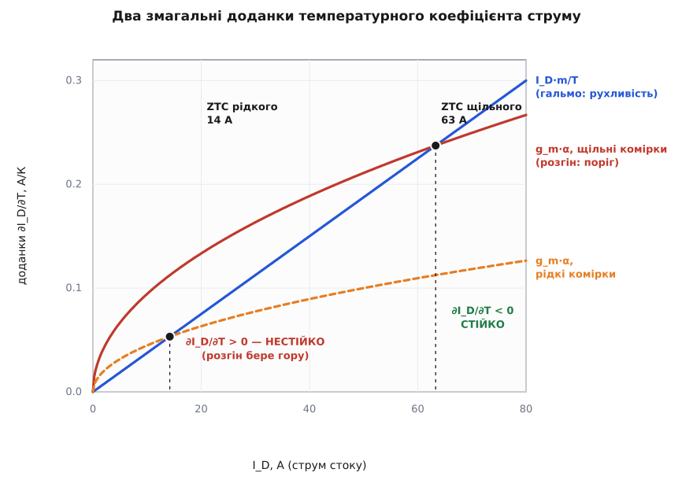
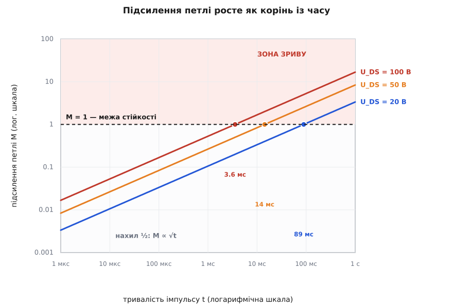
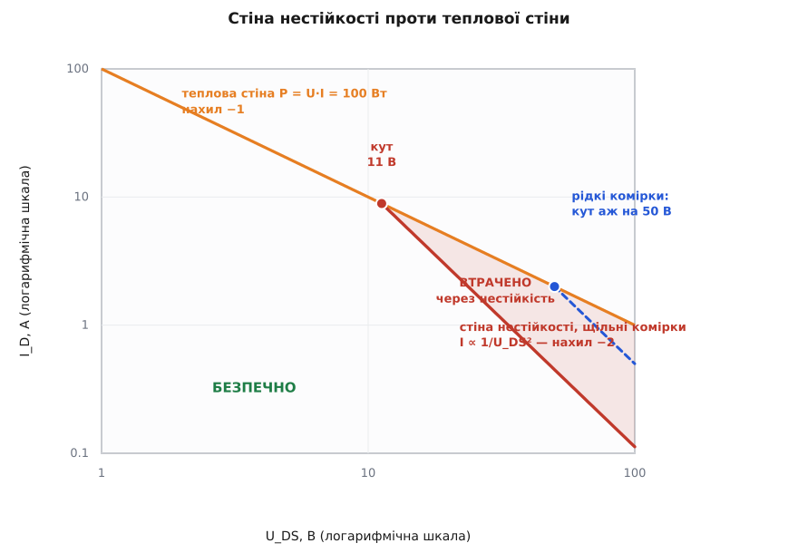

# 🧮 Критерій теплової нестійкості: звідки береться просідання SOA

Питання, на яке тут шукаємо відповідь, оманливо схоже на вже знайоме — і тому його легко проґавити.

«Чи не перегріється кристал?» — це питання про **середнє**. Беремо всю розсіяну потужність, женемо її крізь тепловий опір, дивимося на температуру переходу. Звідси й виходить звичайна теплова стіна P = U·I, і вона чесна: вище неї кристал справді не витягне.

«Чи втримається рівномірність?» — питання зовсім інше. Мільйони комірок поділили струм між собою порівну, і ми питаємо не про те, чи гарячий кристал, а про те, **чи цей поділ узагалі здатен себе втримати**. Тут ідеться про стійкість не приладу, а *стану* приладу. І відповідь суворіша за теплову: буває, що середнє з великим запасом — кристал ледве тепліший за корпус, розсіяно чверть дозволеного бюджету, — а рівномірний поділ струму вже неможливий у принципі, бо найменша випадкова нерівність росте сама з себе, доки весь струм не збереться в одну пляму.

Саме ця друга відповідь і зрізає SOA при високій напрузі. Мета вставки — дістати її у вигляді нерівності з числами: показати, звідки береться кожен множник, чому критичний струм падає з напругою **як квадрат**, а не лінійно, і чому кожне покоління щільніших комірок робить цю стіну ще тіснішою.

## Що саме має бути стійким

Механіку самої петлі перевигадувати не треба — вона вже розібрана в [критерії теплової стійкості](topic:hw-components/thermal-runaway/math-runaway-criterion.md): обійти замкнене коло «температура → струм → потужність → температура», перемножити похідні на кожній ланці й дістати число M — у скільки разів кожен наступний оберт сильніший за попередній. M < 1 — збурення згасає, M > 1 — втікає. Для біполярного каскаду це дало M = Rθ·Vce·(dIc/dTj).

Але там петлю обходив **весь прилад**: dIc/dTj — це струм цілого транзистора, а Rθ — тепловий опір цілого кристала до корпусу. Такий M відповідає на питання про середнє. Нам потрібне те саме коло, обійдене **всередині** кристала: збурюємо не температуру приладу, а температуру однієї плями на тлі решти.

Різниця не косметична, і видно її одразу з двох країв ланцюжка. По-перше, замість dIc/dTj біполярного переходу потрібен температурний коефіцієнт струму MOSFET — а він влаштований принципово інакше: у біполярного приладу нагрів завжди штовхає струм угору, у польового ж усередині борються два протилежні впливи, і знак коефіцієнта залежить від робочої точки. По-друге, замість Rθ(j-c) з даташита потрібен тепловий опір **плями до решти кристала** — а це вже не паспортне число, і навіть не стала величина: він залежить від того, яка пляма і скільки часу минуло. Обидва краї доведеться будувати наново.

## Перша ланка: як струм стоку чує температуру

Струм стоку в активному режимі — це струм каналу, і температура заходить у нього рівно двома дверима. Запишімо це чесно, ще не припускаючи жодної конкретної моделі:

```
I_D = μ(T) · f( U_GS − U_th(T) )
```

Тут μ — [рухливість носіїв](topic:ph-condensed/carrier-mobility) у каналі: наскільки жваво електрони розганяються полем. Що гарячіше — то густіші коливання ґратки, то частіше електрон об них спотикається, то рухливість менша. А U_th — [порогова напруга](topic:hw-components/mosfet-threshold): скільки треба на затворі, щоб канал узагалі відкрився. Вона з нагрівом теж **падає** — гарячий канал відкривається меншою напругою. Функція f — форма передавальної характеристики, і поки що нам байдуже, яка саме.

Тепер продиференціюймо цей добуток за температурою, тримаючи затвор нерухомим (саме так стоїть прилад у лінійному режимі: напруга на затворі задана, а струм — що вийде):

```
∂I_D/∂T |U_GS  =  μ′(T)·f(·)  +  μ(T)·f′(·)·( −dU_th/dT )
```

Другий доданок варто прочитати уважно. Добуток μ·f′ — це похідна струму по аргументу (U_GS − U_th), тобто рівно **[крутість](topic:hw-analog/transconductance)** g_m: на скільки ампер відгукується стік на вольт на затворі. А чи то поріг з'їхав униз, чи то затвор підняли вгору — канал не відрізнить: для нього важить сама лише різниця. Тож падіння порога діє точнісінько як додана напруга на затворі й перетворюється на струм тим самим коефіцієнтом g_m. Перший доданок простіший — це відносна зміна рухливості, помножена на сам струм.

Уведімо два позначення для того, що дає фізика приладу:

```
α ≡ −dU_th/dT  ≈ 5 мВ/К       (поріг падає з нагрівом; типово 2…6 мВ/К)
μ(T) ∝ T^(−m),   m ≈ 3/2       (розсіяння на фононах ґратки)
```

Обидва числа — не припущення заради зручності: спад порога 2…6 мВ/К стоїть у даташитах силових MOSFET, а показник 3/2 для розсіяння на коливаннях ґратки — стандарт компактних моделей. Підставмо їх:

```
μ′/μ = −m/T

∂I_D/∂T = g_m·α  −  I_D·(m/T)
          └─────┘    └────────┘
          розгін      гальмо
```

Ось вона, перша ланка — і вона **двоскладова**. Перший доданок додатний: поріг падає, канал відкривається ширше, струм росте, нагрів підсилює сам себе. Другий від'ємний: рухливість гіршає, канал гірше проводить, струм спадає, нагрів сам себе гасить. Обидва впливи справжні, обидва є завжди, і питання лише в тому, хто кого переважить.

Розмірність збігається: [А/В]·[В/К] = А/К, і [А]·[1/К] = А/К. Обидва доданки — ампери на кельвін, як і має бути.

## Точка ZTC як умова на g_m/I_D

Прирівняймо коефіцієнт до нуля — це й буде та особлива точка, де два впливи гасять один одного:

```
g_m·α = I_D·(m/T)      ⟹      g_m/I_D = m/(α·T)
```

Форма відповіді куди цікавіша за сам факт. Умова ZTC — це умова **не на струм і не на напругу окремо**, а на їхнє відношення g_m/I_D: скільки крутості припадає на кожен ампер. І в цю умову не входить ані f, ані геометрія приладу, ані щільність комірок — самі лише α, m і температура. Порахуймо:

```
g_m/I_D = m/(α·T) = 1.5 / (0.005 В/К · 400 К) = 0.75 В⁻¹
```

Отже, хоч який MOSFET, хоч якого покоління — рівновага настає там, де крутість становить приблизно три чверті ампера на вольт на кожен ампер струму. Одне число на всю технологію.

Далі важить те, що g_m/I_D **монотонно спадає** зі струмом. Це загальна властивість каналу: біля порога кожен зайвий мілівольт затвора дає величезний відносний приріст струму, а глибоко у відкритому стані — уже мізерний. Тому рівність g_m/I_D = m/(α·T) виконується рівно в одній точці: нижче за струмом крутості на ампер забагато й панує розгін, вище — замало й панує гальмо. Одне перетинання, не два.

Щоб дістати числа, потрібна вже конкретна f. Візьмімо [квадратичний закон](topic:hw-components/mosfet-threshold/math-square-law.md) — біля порога він для силового MOSFET працює непогано:

```
I_D = K·U_ov²,   U_ov ≡ U_GS − U_th,   g_m = 2·K·U_ov = 2·√(K·I_D)
```

тоді g_m/I_D = 2/U_ov, і умова ZTC стає зовсім прозорою:

```
U_ov,ZTC = 2·α·T/m = 2 · 0.005 · 400 / 1.5 = 2.67 В
I_ZTC    = K·U_ov,ZTC² = 4·α²·K·T²/m²
```

Ось перший висновок, заради якого все й рахувалося. **Надлишок над порогом у точці ZTC від щільності комірок не залежить взагалі** — це майже стала технології, ті самі ~2.7 В хоч у старого приладу, хоч у нового. А от **струм ZTC пропорційний K** — питомій крутості, тобто рівно тій величині, яку кожне нове покоління щільних комірок задирає вгору, аби збити опір відкритого каналу. Прилад із учетверо щільнішими комірками має ZTC на вчетверо більшому струмі.

Наслідок неприємний: у щільного приладу «стійка» ділянка починається так високо, що весь корисний діапазон лінійного режиму лишається в нестійкій зоні. Це не теорія — це те, що бачать вимірювачі: у [прикладній записці Fairchild](https://linearaudio.net/sites/linearaudio.net/files/Fairchild_Cabiluna_AN-4161-TrenchMOS-SOA-Spirito-linear-mode_09-Dec-2013_PDF.pdf) про траншейні MOSFET у лінійному режимі сказано прямо: що вища крутість, то вищий струм перетину; а [Infineon](https://www.infineon.com/dgdl/Infineon-ApplicationNote_Linear_Mode_Operation_Safe_Operation_Diagram_MOSFETs-ApplicationNotes-v01_00-EN.pdf?fileId=db3a30433e30e4bf013e3646e9381200) додає, що сучасні MOSFET нарощують крутість — і разом із нею вгору повзе ZTC.


*Гальмо I_D·m/T — пряма, і від щільності комірок вона не залежить зовсім. А розгін g_m·α росте як корінь зі струму, і що щільніші комірки, то вище лежить його крива. Перетин — точка ZTC: ліворуч від неї коефіцієнт додатний. Ущільнення комірок піднімає лише криву розгону — і перетин їде праворуч, розтягуючи нестійку зону.*

Підставивши I_ZTC назад, дістаємо коефіцієнт у формі, з якої видно все одразу:

```
∂I_D/∂T = g_m·α·( 1 − √(I_D/I_ZTC) )
```

Дужка — увесь баланс сил в одному виразі: на струмі ZTC вона обертається на нуль, вище — на мінус. А ще вона чесно каже, коли гальмом можна знехтувати: **його відносна вага дорівнює √(I_D/I_ZTC)**. Працюючи вдвадцятеро нижче за ZTC, ви помиляєтеся на корінь з однієї двадцятої — тобто відсотків на двадцять; удвохсотеро нижче — уже лише на сім. Саме там і сидить лінійний режим, тож нижче ми гальмо відкинемо — але вже знаючи ціну.

## Замикання петлі й критерій

Тепер решта кола. Пляма нагрілася на ΔT відносно сусідів — і потягла зайвий струм:

```
ΔI_D = (∂I_D/∂T)·ΔT
```

Цей зайвий струм тече крізь ту саму напругу стік-витік, що стоїть на всьому приладі, — пляма ж не має власного джерела. Значить, зайва потужність, що виділяється **саме в плямі**:

```
ΔP = U_DS·ΔI_D
```

Ось де U_DS входить у гру й чому вона входить так боляче. Напруга тут — курс обміну міліамперів на вати. При 5 В зайвий міліампер коштує 5 мВт; при 50 В той самий міліампер коштує 50 мВт. Пляма розплачується за свою жадібність удесятеро дорожче — і саме цим напруга керує петлею, хоч у сам температурний коефіцієнт вона не входить зовсім.

І остання ланка: зайва потужність підіймає температуру плями через її власний [тепловий опір](topic:ph-thermodynamics/thermal-resistance) — скільки градусів дає кожен ват:

```
ΔT_назад = Z_th·ΔP
```

Зчепімо коло:

```
ΔT_назад = Z_th·U_DS·(∂I_D/∂T)·ΔT  =  M·ΔT

M = U_DS · (∂I_D/∂T) · Z_th
```

Розмірність M: [В]·[А/К]·[К/Вт] = Вт/Вт = 1. Безрозмірне, як і належить підсиленню петлі.

Що M означає точно — краще видно, якщо не ганяти збурення по колу вручну, а розв'язати задачу одним рухом. Хай якась зовнішня причина — порожнина в припої, розкид порога, крапля неоднорідності — дає плямі власний перегрів ΔT_зовн. Повний перегрів складається з нього й того, що петля додала сама:

```
ΔT = ΔT_зовн + M·ΔT      ⟹      ΔT = ΔT_зовн / (1 − M)
```

Це рівно та сама формула, що й у будь-якому підсилювачі з додатним зворотним зв'язком — [підсилення в контурі](topic:hw-analog/loop-gain) у знаменнику. І читається вона так само безжально. При M = 0.5 будь-яка неоднорідність подвоюється — прикро, але скінченно. При M = 0.9 множиться на десять. А коли M підповзає до одиниці, знаменник обертається на нуль: **нескінченно мала неоднорідність дає нескінченний відгук**. Це й є втрата стійкості. Не «стало гаряче» — а «рівномірний розподіл перестав бути розв'язком». Критерій:

```
стійко   ⟺   M = U_DS · (∂I_D/∂T) · Z_th  <  1
```

Саме таку **аналітичну форму** критерію дала група Паоло Спіріто з Неаполітанського університету, позначивши ліву частину літерою S: критичність настає при S ≥ 1 (P. Spirito, G. Breglio, V. d'Alessandro, N. Rinaldi, ISPSD 2002). Варто розрізняти внески: саме явище — стягування струму в низьковольтних силових MOSFET — виміряли й описали й раніше, зокрема група A. Consoli в IEEE Transactions on Power Electronics 2000 року; неаполітанський доробок — не спостереження, а модель, яка дала змогу цю межу **порахувати наперед**, зокрема для імпульсного режиму. Результат усталений і багато разів перевірений. Ми лишаємо позначення M, щоб не плодити двох літер на одне поняття.

## Яка саме Z_th: пляма сама обирає свій розмір

Лишилося найтонше. У критерій входить Z_th — але **чий**? Взяти Rθ(j-c) з даташита не можна: це опір усього кристала до корпусу, тобто знову про середнє. Нам треба опір плями. А пляма — це не деталь конструкції, її ніхто не малював на масці. Який же в неї розмір?

Відповідь виходить сама, якщо спитати, як залежить M від розміру. Візьмімо ділянку площею A з питомим коефіцієнтом ∂J/∂T (ампер на кельвін на квадратний міліметр). Струмовий відгук ділянки росте з площею: ∂I/∂T = A·(∂J/∂T). А її тепловий опір із площею **спадає**. Тож два впливи тягнуть у різні боки — і все залежить від того, як саме спадає опір.

Поки пляма широка, а тепло встигло піти лише неглибоко, воно тече з неї просто вниз, майже без розтікання вбік. Такий потік дає опір, обернено пропорційний площі: Z_th = z″(t)/A, де z″ — питомий перехідний опір ділянки, К·мм²/Вт. Підставмо:

```
M = U_DS · A·(∂J/∂T) · z″(t)/A  =  U_DS · (∂J/∂T) · z″(t)
```

Площа **скоротилася**. Це сильне твердження: усі плями, ширші за глибину прогріву, мають однакове підсилення петлі — і крихітна група комірок, і чверть кристала. Розмір не рятує нікого; M — властивість технології й робочої точки, а не геометрії.

Але тільки-но пляма стає **вужчою** за глибину прогріву, тепло починає розтікатися вбік, і опір спадає вже не як 1/A, а повільніше — приблизно як 1/√A. Тоді M ∝ A/√A = √A: дрібні плями мають **менше** підсилення, бо сусіди підставляють їм плече й розбирають тепло. Вони в безпеці.

Ось і відповідь на питання про розмір. Підсилення петлі росте з розміром плями, доки та не досягне глибини прогріву, а далі виходить на полицю. Значить, **перша пляма, що зривається, має розмір саме глибини прогріву** — це найменший масштаб, якому вже не допомагає розтікання. А цю глибину задає чиста дифузія тепла, і керує нею [температуропровідність](topic:ph-thermodynamics/thermal-diffusivity) a — теплопровідність λ, поділена на те, скільки тепла треба влити, щоб нагріти кубометр речовини на градус:

```
δ = √(a·t)
a = λ/(c·ρ)
```

Для кремнію біля 130 °C це λ ≈ 100 Вт/(м·К), c ≈ 800 Дж/(кг·К), ρ = 2330 кг/м³, звідки a ≈ 55 мм²/с. Порахуймо глибину для трьох часів (a в мм²/с, t у секундах — тож δ виходить у міліметрах):

```
t = 1 мкс   →  δ = √(55 · 1e-6) = 0.0074 мм = 7.4 мкм   — кілька комірок
t = 1 мс    →  δ = √(55 · 1e-3) = 0.23 мм               — тисячі комірок
t = 100 мс  →  δ = √(55 · 0.1)  = 2.35 мм              — майже весь кристал
```

Крок комірок траншейного MOSFET — одиниці мікрометрів. Тож за мікросекунду «зговоритися» встигає лише кілька сусідніх комірок, а за сотню мілісекунд — уже весь кристал разом. Пляма не задана конструкцією; **її розмір задає годинник**.

Тепер зрозуміло й те, чому Z_th у критерії росте з часом. Для потоку вглиб напівнескінченного кремнію питомий опір при сталій потужності відомий:

```
z″(t) = (2/λ)·√(a·t/π)
```

Він росте як √t — і разом із ним росте M. Підставивши, дістаємо всю часову залежність підсилення петлі:

```
M(t) = U_DS · (∂J/∂T) · (2/λ)·√(a·t/π)     ∝  U_DS·√t
```


*У логарифмічних осях M ∝ √t лягає прямою з нахилом ½. Робоча точка одна й та сама, різна лише напруга — але кожне подвоєння U_DS підіймає пряму вдвічі й **вчетверо** скорочує час до зриву. Поки пряма нижча за одиницю, збурення згасають і прилад цілий; перетин — момент, коли рівномірність перестає бути можливою.*

**Приклад: скільки живе рівномірність.** Щільний прилад, робоча точка нижче за ZTC із ∂I_D/∂T = 0.02 А/К, кристал 10 мм², тобто ∂J/∂T = 0.002 А/(К·мм²).

```c
#include <math.h>

// Довжини — міліметри, час — секунди.
#define LAMBDA_SI  0.1f      // теплопровідність кремнію, Вт/(мм·К)
#define A_SI       55.0f     // температуропровідність кремнію, мм²/с

// Час, за який підсилення петлі доростає до одиниці:
//   M(t) = U_DS · (dJ/dT) · (2/λ) · sqrt(a·t/π) = k·sqrt(t) = 1
float t_crit(float U_DS, float dJdT)   // В, А/(К·мм²)
{
    float k = U_DS * dJdT * (2.0f / LAMBDA_SI) * sqrtf(A_SI / 3.14159f);
    return 1.0f / (k * k);             // секунди
}

float delta(float t) { return sqrtf(A_SI * t); }   // глибина прогріву, мм

// t_crit(20.0f,  0.002f) = 0.089 с  → пляма delta = 2.2 мм
// t_crit(50.0f,  0.002f) = 0.014 с  → пляма delta = 0.89 мм
// t_crit(100.0f, 0.002f) = 0.0036 с → пляма delta = 0.44 мм
```

При 20 В та сама робоча точка тримається 89 мс, при 100 В — 3.6 мс: t_крит ∝ 1/U_DS². І пляма, що зривається першою, тим дрібніша, чим вища напруга — при 50 В це ~0.9 мм на кристалі 3.2×3.2 мм. Записка Fairchild, де прилади доводили до відмови й розглядали кристал під мікроскопом, узгоджується з цією картиною: слід відмови там щоразу локальний, а передчасну загибель при 60 В автори пояснюють саме тим, що до зриву залучена «відносно мала ділянка кристала». Прямого виміру діаметра плями вони не наводять — але порядок величини й напрямок залежності від напруги збігаються.

Звідси й уся родина кривих імпульсної SOA. Короткий імпульс безпечний не лише тому, що кристал не встигає прогрітися в середньому, — а й тому, що змовитися встигає надто мала пляма, і петля не встигає розкрутитися. Стала ж потужність — найгірший випадок: δ доростає до кристала, z″ — до повного Rθ, і M сягає стелі.

> 🔧 **Навіщо це.** Звідси випливає правило, що рятує від найпоширенішої помилки в лінійних схемах: **перевіряти прилад на ту тривалість, яку він справді відпрацьовує**. Пусковий MOSFET у [гарячому підключенні](topic:hw-power/hot-swap) заряджає конденсатори мілісекунди — йому годиться імпульсна крива. А той самий прилад в [електронному запобіжнику](topic:hw-power/efuse), що годинами тримає струм навантаження на просілій шині, живе на кривій DC, де та сама точка (U, I) вже далеко за стіною. Одна деталь, одна робоча точка — і два протилежні вироки, бо M росте як корінь із часу.

## Звідки береться нахил −2

Тепер зберімо все й дістаньмо форму самої стіни. Лінійний режим сидить глибоко під ZTC, тож гальмо відкидаємо (пам'ятаючи ціну — √(I_D/I_ZTC)) і лишаємо самий розгін:

```
∂I_D/∂T ≈ g_m·α = 2·α·√(K·I_D)
```

Підставмо в критерій і прирівняймо до одиниці — це й буде межа:

```
U_DS · Z_th · 2·α·√(K·I_D) = 1

√(K·I_D) = 1/(2·α·Z_th·U_DS)
```

і, піднісши до квадрата:

```
I_крит = 1 / (4·α²·K·Z_th²·U_DS²)
```

Ось воно. **Критичний струм спадає з напругою як квадрат** — а не як 1/U_DS, чого вимагала б стала потужність. У логарифмічних осях теплова стіна має нахил −1, а ця — **−2**. Не якийсь загадковий «загин», а рівно вдвічі крутіший нахил, і причина його тепер прозора: напруга б'є двічі. Один раз прямо в петлі — множником U_DS у M. Другий раз через струм: щоб петлю втримати, доводиться зменшити ∂I_D/∂T, тобто крутість, а крутість спадає лише як корінь зі струму — тож струм мусить упасти квадратично. Корінь у першій ланці й породжує квадрат у відповіді.

Дозволена потужність тоді:

```
P_крит = U_DS·I_крит = 1 / (4·α²·K·Z_th²·U_DS)
```

Вона теж падає з напругою — тоді як звичайна теплова стіна тримає P = const. Ось чому «прилад при 60 В безпечно тримає менше ватів, ніж при 10 В, хоч тепловий опір той самий».

Дві стіни перетинаються там, де P_крит зрівнюється з тепловою стелею P_max = (T_j,max − T_корпуса)/Rθ:

```
U_кут = 1 / (4·α²·K·Z_th²·P_max)
```

Нижче за U_кут головує теплова стіна, вище — нестійкість. І погляньте, як входить у цю формулу тепловий опір: **у квадраті**. Подвоївши Z_th, ви вчетверо зрізаєте і дозволений струм, і кут.

Саме ця асиметрія й відповідає на те, чому крива DC просідає, а мілісекундна майже ні. Скоротімо час імпульсу так, щоб перехідний опір став удесятеро меншим за сталий. Обидві стіни підуть угору — але **по-різному**: теплова тримає P = ΔT/Z_th, тож підіймається вдесятеро, а стіна нестійкості має Z_th у квадраті й підіймається **в сто разів**. Нестійкість тікає від теплової стіни на порядок, і кут між ними їде з 11 В аж на 112 В — тобто за паспортну межу напруги, де його вже ніхто не побачить. Загин нікуди не подівся; він просто виїхав за край графіка.

**Приклад: де стоїть стіна.** Щільний траншейний MOSFET: K = 8.9 А/В² (з передавальної кривої: 20 А при надлишку 1.5 В над порогом), α = 5 мВ/К, кристал на радіаторі з Rθ(j-c) = 1 К/Вт, стеля переходу 175 °C, корпус 75 °C.

```c
// Теплова стіна — про середнє:
float P_max = (175.0f - 75.0f) / 1.0f;        // = 100 Вт, хоч при 10 В, хоч при 50 В

// Стіна нестійкості — про рівномірність:
float K = 8.9f, alpha = 0.005f, Zth = 1.0f;   // А/В², В/К, К/Вт
float d = 4.0f * alpha*alpha * K * Zth*Zth;   // = 8.9e-4

float I_crit_50 = 1.0f / (d * 50.0f*50.0f);   // = 0.449 А   → P = 22.5 Вт
float I_crit_10 = 1.0f / (d * 10.0f*10.0f);   // = 11.2 А    → P = 112 Вт
float U_corner  = 1.0f / (d * P_max);         // = 11.2 В
```

При 10 В нестійкість дозволяє 112 Вт — більше за теплові 100 Вт, тож головує теплова стіна й прилад поводиться «як у підручнику». При 50 В нестійкість дозволяє **22.5 Вт замість 100** — вчетверо з гаком менше за те, що обіцяв тепловий опір. Кут між двома режимами — 11 В. Інженер, що на 50 В повірив тепловій стелі й заклав 80 Вт, перевищив справжню межу в три з половиною рази — і жодного з трьох паспортних чисел при цьому не порушив.


*Обидва прилади йдуть тепловою стіною, доки не дійдуть до свого кута, — а тоді відламуються вниз удвічі крутіше. Уся заштрихована площа — робочі точки, які теплова стеля дозволяє, а рівномірність не витримує. Щільний прилад ламається на 11 В і втрачає більшу частину правої половини поля.*

## Перевірка на чужих вимірах

Нахил −2 — сильне твердження, і перевіряється воно легко: спалити однакові прилади при двох напругах і **однаковій тривалості** (щоб Z_th не змінилася) та порівняти струми. Такий дослід уже зроблено, і числа опубліковані.

У згаданій записці Fairchild траншейні MOSFET доводили до відмови імпульсами по 10 мс. При 30 В прилад гинув на 8.3 А (249 Вт), при 60 В — на 2.1 А (126 Вт). Прикладімо формули:

```
Подвоєння напруги 30 В → 60 В, та сама тривалість (Z_th незмінна):

струм:      I_крит ∝ 1/U_DS²   →   8.3 / 4    = 2.08 А    (виміряно 2.1 А)
потужність: P_крит ∝ 1/U_DS    →   249 / 2    = 124.5 Вт  (виміряно 126 Вт)
```

Похибка близько відсотка — на обох величинах одразу. Для порівняння: якби межу тримала звичайна теплова стіна, при 60 В прилад мав би витримати ті самі 249 Вт, тобто 4.15 А, — удвічі більше за виміряне. Стала потужність тут не просто неточна, вона хибна вдвічі, а квадратичний закон лягає в межі похибки досліду.

Ця збіжність варта того, щоб на ній затриматися. Ми не підганяли жодного коефіцієнта: у передбачення входить самий лише **показник степеня**, який виліз із ланцюжка «корінь у крутості → квадрат у струмі». Прилад про наше виведення не знав — і згорів рівно там, де воно вказало.

## Ціна щільності

Тепер видно, чому кожне нове покоління приладів у лінійному режимі гірше за попереднє — і видно кількісно. Питома крутість K входить в обидва результати, і обидва рази **проти** інженера:

```
I_крит ∝ 1/K      — щільніші комірки → нижча стіна нестійкості
I_ZTC  ∝ K        — щільніші комірки → «стійка» зона починається пізніше
```

Механізм спільний і простий до прикрості. Ущільнення комірок — це більша ширина каналу на тому самому квадратному міліметрі; саме нею й збивають опір відкритого каналу. Але та сама ширина каналу на тому самому струмі означає **більшу крутість** — а крутість, помножена на α, і є доданок розгону. Тобто K — не побічна характеристика: це рівно та ручка, яку виробник крутить заради нижчого R_DS(on), і кожен її оберт прямо підсилює петлю. Тепловий опір при цьому не покращується: тепло однаково тече крізь той самий кремній.

**Приклад: два покоління, одна робоча точка.** Порівняймо щільний прилад (K = 8.9 А/В²) зі старішим і рідкішим (K = 2 А/В²) — усе інше однакове, обидва на радіаторі з Rθ = 1 К/Вт і тепловою стелею 100 Вт.

```c
// P_крит = 1/(4·α²·K·Z_th²·U_DS);  U_кут = 1/(4·α²·K·Z_th²·P_max)
// α = 5 мВ/К, Z_th = 1 К/Вт, P_max = 100 Вт, робоча напруга 50 В

// рідкий,  K = 2.0:  U_кут = 50.0 В  →  при 50 В дозволено 100 Вт (теплова стеля)
// щільний, K = 8.9:  U_кут = 11.2 В  →  при 50 В дозволено 22.5 Вт

// I_ZTC = 4·α²·K·T²/m²  (T = 400 К, m = 1.5)
// рідкий:  14.2 А        щільний:  63.3 А
```

Рідкий прилад при 50 В ще стоїть рівно на своєму куті: нестійкість дозволяє йому ті самі 100 Вт, що й тепловий опір, — просідання SOA в його робочому діапазоні просто нема, і три паспортні числа його не обманюють. Щільний на тій самій точці дозволяє 22.5 Вт. Пропорція витримана точно, як і обіцяла формула: крутість більша в 4.45 раза — рівно в стільки ж разів менша дозволена потужність, бо P_крит ∝ 1/K і більше ні від чого тут не залежить. Кут поїхав із 50 В на 11 В, а ZTC — з 14 А на 63 А, тобто в щільного приладу нестійка зона поглинула майже весь практичний діапазон лінійного режиму.

Це й пояснює, чому «візьмімо найкращий сучасний MOSFET» — найгірша порада для лінійної схеми, і чому виробники тримають окремі лінійки приладів із розширеною лінійною SOA: у них навмисно **жертвують** щільністю комірок, погоджуючись на вищий R_DS(on), заради нижчого K. Це не відсталість технології, а свідома торгівля: обмін ключових втрат на живучість у лінійному режимі. Nexperia формулює цей компроміс без дипломатії: новіші технології мають узагалі гіршу лінійну спроможність, а старіші траншейні й планарні — вищий опір, але кращу поведінку в лінійному режимі.

## Що з цього тримати в руках

Уся вставка стискається в один рядок і чотири ручки під ним:

```
стійко ⟺  M = U_DS · (∂I_D/∂T) · Z_th(t) < 1,

           де  ∂I_D/∂T = g_m·α·( 1 − √(I_D/I_ZTC) )
```

- **U_DS** — курс обміну ампера на ват усередині плями. Входить у M лінійно, а в дозволений струм — квадратично. Найдорожча ручка й водночас часто єдина, яку схемотехнік справді може крутити: розбити падіння на два послідовні прилади — це вчетверо кожному з них полегшити.
- **Z_th(t)** — тепловий опір **плями**, не кристала, і росте він як √t. Звідси t_крит ∝ 1/U_DS² і вся родина імпульсних кривих. Радіатор тут допомагає менше, ніж хочеться: він збиває середню температуру, а петлю плями замикає кремній у неї під низом.
- **K** — питома крутість, тобто щільність комірок. Не ваша ручка, а виробникова, і крутив він її в інший бік. Але вона ж — критерій вибору деталі: для лінійного режиму беруть прилад із **низьким** ZTC, і тепер видно, що це просто інший спосіб сказати «з низьким K».
- **α ≈ 5 мВ/К** — фізика порога, її не прибрати. Єдиний доданок, що їй протидіє, — гальмо рухливості, і воно набирає силу лише біля ZTC, тобто там, куди лінійний режим і не заходить.

І головне, що варто винести. Теплова стіна відповідає на питання «чи витримає кристал у середньому» — і чесно відповідає. Але прилад помирає не від середнього. Він помирає тоді, коли **рівномірність перестає бути розв'язком**: знаменник 1/(1 − M) обертається на нуль, і крапля неоднорідності, що досі була нешкідливою дрібницею, за частку секунди збирає весь струм у пляму завширшки з глибину прогріву. Три паспортні числа про це не знають, теплова стеля — теж. Знає лише M.
