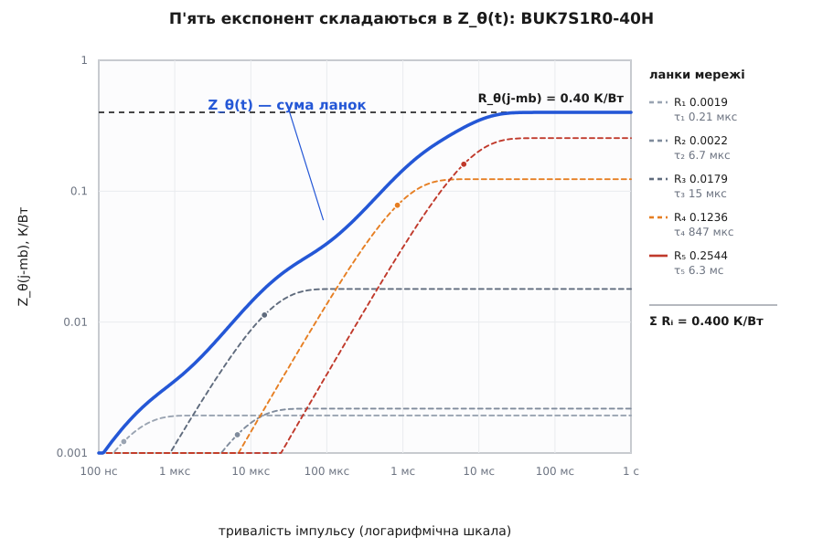
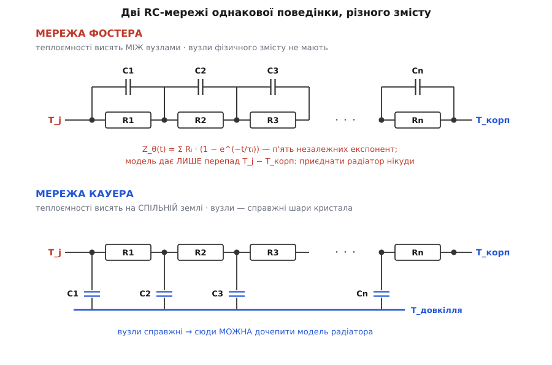
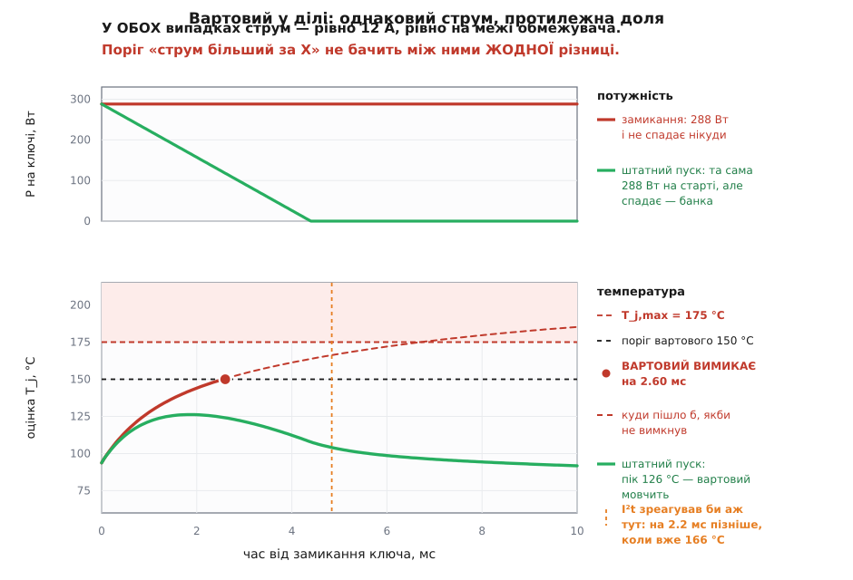
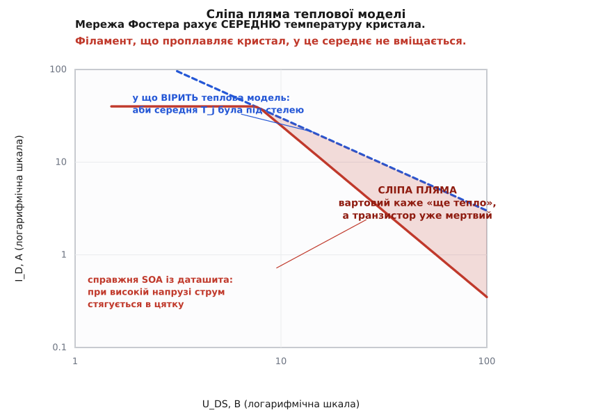

# ⚙️ Тепловий вартовий: прошивка, що знає температуру кристала

Найпоширеніший захист силового ключа в прошивці має вигляд одного рядка: «якщо струм більший за X — вимикай». Він виглядає розсудливо й коштує три такти. Зараз ми візьмемо пару найзвичайніших подій із життя [гарячого підключення](root:hw-power/hot-swap) плати й перевіримо цей рядок на них — і він розсиплеться не тому, що поріг підібрали невдало, а тому, що потрібної інформації в струмі немає взагалі.

> 🔧 **Що треба знати наперед.** [Тепловий опір Rθ і температура переходу](root:ph-thermodynamics/thermal-resistance): розсіяна потужність тече крізь тепловий опір із кристала назовні й підіймає T_j над температурою корпуса; у сталому режимі T_j = T_корп + P·Rθ, а стеля T_j,max для кремнію типово 150…175 °C. Уся ця вставка — про те, як порахувати ліву частину цієї рівності в реальному часі, коли режим НЕ сталий.

## Дві події, які не розрізнити за струмом

Ось стенд. Шина 24 В, пусковий транзистор, за ним банка конденсаторів на 2200 мкФ, і обмежувач струму, налаштований на 12 А. Обмежувач — не запобіжник: він не вимикає, а тримає, заганяючи транзистор у лінійний режим, де той гасить на собі різницю напруг.

**Подія перша: плату вставили штатно.** Обмежувач притискає струм до 12 А, банка набирає заряд, напруга на ній повзе вгору, а на транзисторі — вниз. Скільки це триває:

```
t_зар = C · U / I = 2200·10⁻⁶ · 24 / 12 = 4.4·10⁻³ с = 4.4 мс
```

Потужність на ключі на початку: 24 В × 12 А = 288 Вт. Далі вона лінійно спадає до нуля — бо U_DS спадає. Через 4.4 мс транзистор відкритий, на ньому мілівольти, і все скінчилося добре.

**Подія друга: на виході коротке замикання.** Обмежувач так само притискає струм до 12 А. Але напруга на банці нікуди не росте — її там немає, вихід закорочено. Тож на транзисторі лишається всі 24 В. Потужність: ті самі 288 Вт — і вони не спадають ніколи.

А тепер головне. **Струм в обох подіях — рівно 12 А.** Не «приблизно однаковий» — тотожний, бо його тримає той самий обмежувач, і тримає рівно на тій самій межі. Поріг «струм більший за 15 А» не спрацює ні там, ні там: у першому випадку правильно, у другому — з фатальними наслідками. Опустити поріг під 12 А? Тоді він верещатиме на кожному штатному вставлянні плати.

Різниця між життям і смертю сидить не в струмі. Вона сидить у **U_DS**: у штатному пуску напруга на ключі падає, в аварії — стоїть. А вбиває кристал добуток P = U·I, накопичений за час. Тож вимірювати треба обидві величини, а рахувати — температуру.

> 🔧 **Навіщо це.** Парадокс тут не в тому, що поріг за струмом грубий, а в тому, що **обмежувач струму власноруч знищує інформацію**, за якою поріг збирався судити. Він за побудовою робить струм сталим і нецікавим. Будь-який захист, що дивиться лише на струм, після обмежувача сліпне — і що краще працює обмежувач, то він сліпіший.

## Ідея: рахувати температуру, а не струм

Стіна, яку не можна перетнути, зветься T_j,max. У сталому режимі до неї рахувати легко: T_j = T_корп + P·Rθ. Але 4.4 мс — це не сталий режим. Кристал має теплову інерцію: за мілісекунду тепло не встигає ані прогріти кремній до кінця, ані розповзтися в корпус. Замість сталого Rθ тут працює перехідний тепловий опір Zθ(t) — тим менший, чим коротший імпульс.

Отже задача вартового: щотакту взяти миттєві U_DS та I_D, помножити, пропустити добуток крізь модель теплової інерції й дістати оцінку T_j. Вимкнути — коли ця оцінка підходить до стелі. Питання одне: яка модель влізе в переривання на 20 кГц.

## Мережа Фостера: п'ять експонент замість кривої

Zθ(t) у даташиті — це крива на графіку. Крива — картинка; прошивка картинок не їсть. Але ця крива має цілком певний вигляд, і вигляд цей не випадковий:

```
Z_θ(t) = Σᵢ Rᵢ · (1 − e^(−t/τᵢ)),   де  τᵢ = Rᵢ · Cᵢ
```

Сума експонент. За нею стоїть проста картинка: ланцюжок ланок, у кожній тепловий опір Rᵢ і теплоємність Cᵢ увімкнені паралельно, а самі ланки — послідовно. Кожна ланка — інерційна ланка першого порядку зі своєю сталою часу τᵢ: подайте на неї сталу потужність, і її внесок у перегрів піде до P·Rᵢ за експонентою. Складіть внески — дістанете криву. Це й зветься **мережею Фостера** (за Ronald M. Foster, американський математик із Bell Labs; його праця «A Reactance Theorem» у Bell System Technical Journal за квітень 1924 року заклала спосіб розкладати мережі на такі канонічні форми).

Звідки взяти Rᵢ і τᵢ? Є два шляхи. Або підігнати їх під даташитну криву [найменшими квадратами](root:math-probability/least-squares) — до цього ми зараз дійдемо. Або взяти готові: багато виробників публікують RC-моделі своїх приладів окремим файлом.

**Візьмімо справжній прилад.** BUK7S1R0-40H — 40 В, 1.0 мОм, у корпусі LFPAK88. Даташит дає: T_j від −55 до 175 °C, R_θ(j-mb) типово 0.35, максимум 0.4 К/Вт, повна розсіювана потужність 375 Вт при температурі основи 25 °C. Зверніть увагу, як ці числа сходяться між собою: 375 Вт × 0.4 К/Вт = 150 К перегріву, а 25 + 150 = 175 °C. Паспортна потужність — це рівно та, що доводить кристал до стелі.

Nexperia публікує для цього приладу п'ятиланкову модель. Перерахована в форму Фостера, вона така:

| ланка | Rᵢ, К/Вт | τᵢ |
|---|---|---|
| 1 | 0.001935 | 0.21 мкс |
| 2 | 0.002183 | 6.7 мкс |
| 3 | 0.017918 | 15 мкс |
| 4 | 0.123572 | 847 мкс |
| 5 | 0.254393 | 6.3 мс |
| **Σ** | **0.400000** | |

Сума опорів — рівно 0.400 К/Вт, тобто паспортний R_θ(j-mb). Це не збіг, а вбудована перевірка: при t → ∞ усі експоненти насичуються, кожна ланка віддає свій повний Rᵢ, і Zθ(∞) мусить дорівнювати сталому тепловому опору. Якщо у вашій підгонці сума не сходиться з даташитним Rθ — підгонка зіпсована, далі можна не йти.


*Кожна пунктирна крива — одна ланка: вона «прокидається» біля своєї τᵢ й виходить на плато Rᵢ. Синя суцільна — їхня сума, та сама Zθ(t) з даташита. Кружечок на кожній ланці — точка t = τᵢ, де ланка набрала 63% свого внеску.*

Тепер подивіться на розкид τ: від 0.21 мкс до 6.3 мс. **П'ять десяткових порядків.** Запам'ятайте це число — за хвилину воно визначить усе.

## Фостер чи Кауер — і чому це не питання смаку

Ту саму теплову поведінку можна описати двома різними мережами, і плутати їх дорого.


*Обидві мережі дають ту саму Zθ(t) на клемах і переводяться одна в одну точно. Але у Фостера теплоємності висять між сусідніми вузлами, а в Кауера — усі на спільній землі. Звідси й уся різниця в тому, що з ними можна робити.*

**Мережа Кауера** (за Wilhelm Cauer, німецький математик, який після Фостерової праці 1924 року й заснував теорію синтезу мереж, поширивши метод на RC-кола й на драбинчасту форму) — це драбинка, де теплоємності приєднані до спільної землі. Її вузли **справжні**: вони відповідають шарам кристала, припою, підкладки. У Кауера можна спитати «а яка температура під припоєм» і дістати осмислену відповідь. І — головне — до Кауерової мережі можна **дочепити ще щось**: модель радіатора, модель плати.

**Мережа Фостера** таких прав не має. Її вузли фізичного змісту не мають — теплоємності між вузлами не відповідають нічому в кристалі. У документації Nexperia це сказано прямо: моделі Фостера не мають фізичного змісту, бо теплоємності між вузлами не мають фізичної дійсності; а Фостерову RC-модель не можна ані ділити, ані вмикати в розрив — приєднати до неї RC-мережу радіатора не вийде.

Це не педантизм, а два практичні наслідки, з якими ви зустрінетесь того ж дня:

Перший: **для прошивки Фостер незрівнянно зручніший.** Сума експонент означає, що ланки одна на одну не впливають: кожна живе своїм життям, її можна порахувати одним рядком, і жодної матриці. Кауерова драбинка так не вміє — там вузли зв'язані, і чесний крок вимагає розв'язувати тридіагональну систему щотакту. У перериванні на 20 кГц це різниця між «непомітно» й «ніколи».

Другий: **Фостер дає тільки перепад T_j − T_корп** — і більше нічого. Приєднати радіатор нікуди, бо приєднувати нема до чого. Тому температуру корпуса вартовий мусить дістати окремо, справжнім давачем. Про це — нижче, у пастках.

І ще одна дрібниця, яка добре показує, наскільки «немає фізичного змісту» слід розуміти буквально. Розклад кривої на експоненти **не єдиний**. Підганяючи ту саму Zθ(t) сіткою з дванадцяти сталих часу, я дістав сім ненульових ланок із зовсім іншими τ, ніж у «справжній» п'ятиланковій моделі, — і крива відтворилася з похибкою близько відсотка. Однакова поведінка на клемах, різні нутрощі. Ланки Фостера — це не деталі приладу, а коефіцієнти розкладу.

## Точний крок: чому Ейлер тут не працює

Кожна ланка описується одним рівнянням: швидкість зміни її внеску пропорційна тому, наскільки він ще не дійшов до своєї стелі P·Rᵢ.

```
dTᵢ/dt = (P · Rᵢ − Tᵢ) / τᵢ
```

Це [експоненційне ОДУ](root:math-analysis/exponential-ode) — найпростіше рівняння на світі. Спокуса дискретизувати його в лоб, явним Ейлером:

```
Tᵢ[n] = Tᵢ[n−1] + Δt · (P · Rᵢ − Tᵢ[n−1]) / τᵢ
```

І тут усе валиться. Явний Ейлер на такому рівнянні стійкий лише поки Δt < 2τᵢ ([числові методи ОДУ](root:math-numeric/numerical-ode) розбирають цю межу докладно). Підставмо найшвидшу ланку:

```
τ₁ = 0.21 мкс  →  Δt < 0.43 мкс  →  частота семплів > 2.3 МГц
```

Два з половиною мегагерци в перериванні, з двома АЦП-каналами й множенням. Ні. А викинути першу ланку не можна: разом три найшвидші ланки несуть 0.022 К/Вт — при 288 Вт це 6.3 К, які просто зникнуть із оцінки.

Вихід є, і він не компроміс, а точна рівність. Ми ж семплимо потужність раз на такт і до наступного такту вважаємо її сталою — іншої інформації в нас усе одно немає. А **для сталої на інтервалі потужності рівняння розв'язується точно**:

```
Tᵢ[n] = Tᵢ[n−1] · aᵢ + P[n] · Rᵢ · (1 − aᵢ),   де  aᵢ = e^(−Δt/τᵢ)
```

Це не наближення. Це аналітичний розв'язок, узятий у моменти семплів. Коефіцієнт aᵢ — «скільки лишилося від старого», Rᵢ(1 − aᵢ) — «скільки долилося від нового». Обидва завжди між нулем і одиницею, тож схема стійка **безумовно**, за будь-якого Δt.

А тепер найкраще. Подивімося, що станеться зі швидкими ланками при Δt = 50 мкс (20 кГц):

| ланка | τᵢ | aᵢ = e^(−Δt/τᵢ) | Rᵢ(1 − aᵢ) |
|---|---|---|---|
| 1 | 0.21 мкс | 2·10⁻¹⁰² | 0.001935 |
| 2 | 6.7 мкс | 0.000548 | 0.002182 |
| 3 | 15 мкс | 0.036550 | 0.017263 |
| 4 | 847 мкс | 0.942703 | 0.007080 |
| 5 | 6.3 мс | 0.992129 | 0.002002 |

Перша ланка дістає a₁ = e^(−234) — нуль із запасом у сотню порядків. Тобто вона щотакту повністю забуває минуле й миттєво стрибає на P·R₁. І це **фізично правильно**: ланка зі сталою часу 0.21 мкс за 50 мкс справді встигає усталитися двісті разів. Точна схема сама, без жодного спецвипадку, перетворює завеликі для неї ланки на чистий опір — рівно те, чим вони на цьому кроці і є. Явний Ейлер на тому самому кроці вибухнув би.

## Код: сам вартовий

Модель. Коефіцієнти рахуються раз при старті, у гарячому шляху лишається п'ять множень-додавань.

```c
#include <math.h>
#include <stdbool.h>

#define SOA_STAGES 5

typedef struct {
    float a[SOA_STAGES];   /* e^(-dt/tau_i) — скільки лишилося від старого */
    float g[SOA_STAGES];   /* R_i*(1 - a_i) — скільки долилося від нового  */
    float t[SOA_STAGES];   /* стан: внесок ланки в перегрів, К            */
} soa_model;

/* r[], tau[] — мережа Фостера приладу; dt — крок семплювання, с */
void soa_init(soa_model *m, const float *r, const float *tau, float dt)
{
    for (int i = 0; i < SOA_STAGES; i++) {
        m->a[i] = expf(-dt / tau[i]);
        m->g[i] = r[i] * (1.0f - m->a[i]);
        m->t[i] = 0.0f;
    }
}

/* Один крок. p — миттєва потужність на ключі, Вт.
   Повертає перегрів переходу над корпусом, К. */
float soa_step(soa_model *m, float p)
{
    float rise = 0.0f;
    for (int i = 0; i < SOA_STAGES; i++) {
        m->t[i] = m->t[i] * m->a[i] + p * m->g[i];
        rise += m->t[i];
    }
    return rise;
}
```

Мережа приладу й переривання:

```c
/* BUK7S1R0-40H: мережа Фостера, звірена з паспортним R_th(j-mb) = 0.4 К/Вт */
static const float FOSTER_R[SOA_STAGES] = {
    0.001935f, 0.002183f, 0.017918f, 0.123572f, 0.254393f      /* К/Вт */
};
static const float FOSTER_TAU[SOA_STAGES] = {
    0.2136e-6f, 6.658e-6f, 15.11e-6f, 847.4e-6f, 6.327e-3f     /* с */
};

#define DT_S     50e-6f     /* 20 кГц */
#define TJ_TRIP  150.0f     /* поріг: 25 К запасу під паспортні 175 °C */

static bool soa_curve_ok(float u, float i);   /* друга перевірка, нижче */

static soa_model      g_soa;
static volatile float g_tcase = 25.0f;   /* оновлює повільний цикл з NTC */

void soa_guard_init(void)
{
    soa_init(&g_soa, FOSTER_R, FOSTER_TAU, DT_S);
}

/* Переривання АЦП: U та I ВЗЯТІ ОДНОЧАСНО, здвоєним режимом */
void adc_isr(void)
{
    float u = uds_from_counts(ADC_DUAL->DR_A);    /* В */
    float i = id_from_counts(ADC_DUAL->DR_B);     /* А */
    float p = u * i;                              /* Вт — саме миттєвий добуток */

    float tj = g_tcase + soa_step(&g_soa, p);

    if (tj >= TJ_TRIP || !soa_curve_ok(u, i)) {
        fet_off();                    /* спершу залізо... */
        fault_latch(tj, u, i);        /* ...потім розбір польотів */
    }
}
```

Порядок у цьому `if` не косметичний: `fet_off()` мусить бути першим викликом, а не після запису журналу. І `soa_curve_ok()` — то друга, окрема перевірка; чому теплової оцінки самої по собі не досить, зараз побачимо.

Ось як це виглядає на наших двох подіях:


*Угорі — потужність: обидві події починаються з тих самих 288 Вт, але в штатному пуску вона спадає разом із U_DS, а в аварії стоїть. Унизу — оцінка T_j: штатний пуск дає пік 126 °C і вартовий мовчить, аварія перетинає поріг 150 °C на 2.60 мс і ключ гасне. Струм при цьому — 12 А в обох випадках.*

Штатний пуск доходить до 126 °C — двадцять чотири градуси запасу під порогом, вартовий його не чіпає. Аварія перетинає 150 °C на 2.60 мс і вимикається; якби не вимкнулася, то на 10 мс була б уже за 185 °C, а в усталеному режимі — за 200 °C, тобто далеко за паспортною стелею. І все це — за незмінних 12 А.

## Сліпа пляма, про яку треба знати з першого дня

Тепер найважливіше речення цієї вставки. **Мережа Фостера рахує середню температуру кристала.**

Zθ(t) міряють як відгук усього приладу: подали потужність, побачили, як піднялася «віртуальна» температура переходу. Ця віртуальна температура — усереднення по всій площі кристала. А кристал силового MOSFET — це мільйони паралельних комірок, і гине він зазвичай не тому, що прогрівся весь, а тому, що струм стягнувся в одну цятку: гарячіша комірка тягне більший струм, від того гріється ще дужче — [тепловий розгін](root:hw-components/thermal-runaway), тільки локальний. Філамент, що проплавляє кремній, має всередині кілька сотень градусів, а середнє по кристалу тим часом лишається пристойним. Саме через це, до речі, паспортні криві SOA при високій напрузі загинаються донизу крутіше, ніж вимагає проста P = U·I: там ця пастка розкручується найлегше.

Висновок для вартового прямий і невтішний:


*Синій пунктир — межа, у яку вірить теплова модель: аби середня T_j була під стелею. Червона — справжня SOA з даташита. Заштрихована смуга при високій напрузі — де вартовий каже «ще тепло», а прилад уже мертвий.*

Тому тепловий вартовий — **необхідний, але не достатній**. Він чудово ловить теплову стіну й враховує тривалість. Він не ловить нічого з того, що діється при високій U_DS, бо в його світі кристал однорідний. Друга перевірка мусить бути прямою: чи лежить точка (U, I) під паспортною кривою SOA. Ось вона:

```c
/* ── Друга лінія: пряма перевірка кривої SOA ──────────────────────────
   Точки знімають із графіка SOA у даташиті САМЕ ВАШОГО приладу, для тієї
   тривалості, що відповідає вашій аварії. Таблиця — за зростанням U.  */
typedef struct { float u, i; } soa_point;

static const soa_point SOA_CURVE[] = {   /* ← числа з вашого даташита! */
    { 1.0f, 200.0f }, { 2.0f, 110.0f }, { 4.0f, 58.0f }, { 8.0f, 28.0f },
    { 12.0f, 16.0f }, { 18.0f,  9.0f }, { 26.0f, 4.6f }, { 40.0f, 1.8f },
};
#define SOA_N (sizeof SOA_CURVE / sizeof SOA_CURVE[0])

static bool soa_curve_ok(float u, float i)
{
    if (u <= SOA_CURVE[0].u)
        return i <= SOA_CURVE[0].i;
    if (u >= SOA_CURVE[SOA_N - 1].u)
        return false;                    /* поза графіком — не ризикуємо */

    /* Сходинка, а НЕ лінійна інтерполяція: беремо струм правого вузла,
       тобто менший. Крива SOA у лінійних осях опукла (I ~ P/U), а хорда
       над опуклою кривою лежить ВИЩЕ за неї — інтерполяція дозволила б
       зайве. Сходинка ж завжди лишається під кривою. Ціною кількох
       відсотків консерватизму дістаємо нуль логарифмів у перериванні. */
    for (unsigned k = 1; k < SOA_N; k++)
        if (u <= SOA_CURVE[k].u)
            return i <= SOA_CURVE[k].i;

    return false;
}
```

І чесна примітка про сам прилад. BUK7S1R0-40H — ключовий транзистор на траншейній суперперехідній структурі; його даташит дає SOA у вигляді межі за R_DS(on) плюс крива одиничного імпульсу 10 мкс, і жодного віяла ліній для тривалої лінійної роботи там немає. Тобто прилад із чудовою тепловою моделлю може бути кепським вибором на пусковий ключ саме тому, що по лінійному режиму він не схарактеризований. Теплова модель вам про це не скаже — вона порахує середнє й заспокоїть. Для [електронного запобіжника](root:hw-power/efuse) чи гарячого підключення беруть прилади з паспортною лінійною SOA.

## Простіший запасний варіант — і чому I²t тут не той

Якщо ставити повну модель ніколи, є коротший шлях: [інтегральний захист I²t](root:hw-power/i2t-protection). Накопичуй ∫i²dt, перевищив дозу — вимикай. Для запобіжника й для дроту це правильна фізика: там потужність справді дорівнює I²R при сталому R.

Але наш ключ — не дріт. У лінійному режимі його потужність дорівнює U·I, і опір тут ні до чого. Згадаймо наші дві події: струм в обох — 12 А. **I²t бачить у них тотожний сигнал.** Він фізично не здатен їх розрізнити й вироджується на цьому місці в звичайний таймер: «12 А довше, ніж стільки-то — вимикай». Порахуймо, чого це коштує. Штатний пуск набирає 12² × 4.4 мс = 0.634 А²с. Поставимо поріг на десять відсотків вище — 0.697 А²с:

```
t_спрац = 0.697 / 12² = 4.84·10⁻³ с = 4.84 мс
```

Аварія вимкнеться на 4.84 мс — на 2.24 мс пізніше за теплову модель, коли перехід уже за 166 °C. Ще трохи — і за стелею.

Полагодити це просто: інтегруйте **енергію**, а не квадрат струму, — ∫U·I dt. Ця величина U_DS уже бачить. Поріг на чверть вище за пускову енергію 0.634 Дж дає спрацювання на 2.75 мс при 152 °C — майже там само, де й повна модель.

А тепер погляньте, що таке цей інтегратор енергії насправді. Візьміть точний крок однієї ланки й спрямуйте її сталу часу в нескінченність:

```
Tᵢ[n] = Tᵢ[n−1]·aᵢ + P·Rᵢ(1 − aᵢ),   aᵢ = e^(−Δt/τᵢ)

при τᵢ → ∞:   aᵢ → 1,   Rᵢ(1 − aᵢ) → Rᵢ·Δt/τᵢ = Δt/Cᵢ

Tᵢ[n] = Tᵢ[n−1] + P·Δt/Cᵢ
```

Чисте накопичення без витоку. Тобто **інтегратор енергії — це одноланкова мережа Фостера з вимкненим витоком**. Запасний варіант не інша техніка, а та сама, обрізана до однієї ланки. Повна модель — це п'ять відер, кожне зі своєю дірочкою.

Звідси й головна вада відра без дірки: воно **нічого не забуває**. Десяток штатних вставлянь поспіль накопичать енергію до порога, і захист відключить справну плату. Дірочку доводиться робити — а щойно ви дасте τ скінченне значення, ви написали одноланкового Фостера. Тоді вже нема причин не написати п'ятиланкового: різниця — чотири рядки.

## Складність і пастки

**Ціна.** O(n) на семпл, де n — кількість ланок: п'ять множень-додавань і одне множення U·I. На Cortex-M4F це десятки тактів — на 20 кГц непомітно. Пам'яті — три масиви по п'ять float. Уся вартість переїхала в `soa_init()`, де рахуються п'ять експонент, і той рахунок відбувається раз.

**Крок Δt — це роздільна здатність вартового за часом.** Ланки, швидші за Δt, працюють як чистий опір: вони чесно додають P·Rᵢ, але виходить це чесно лише тому, що ми **вважаємо P сталою на всьому інтервалі**. Якщо справжня потужність устигла стрибнути й повернутися між семплами, вартовий цього не побачить ніколи. Тому: на кидок струму й на замикання за мілісекунди прошивка встигає; на жорстке замикання за мікросекунди — ні, і не встигне за жодної оптимізації. Перша лінія оборони там — залізний [компаратор](root:hw-analog/comparator), що гасить затвор без участі процесора. Прошивка — друга.

**Фостер не ділиться.** Модель дає **тільки** T_j − T_корп. T_корп мусить прийти справжнім давачем — [термістором](root:hw-sensing/ntc-thermistor) біля приладу. Добра новина: корпус має сталі часу в секунди, тож опитувати його можна в повільному циклі, як у коді вище. Погана: якщо ви забудете й підставите замість T_корп кімнатні 25 °C, вартовий недорахує рівно стільки, на скільки нагрілася плата, — і на гарячому шасі це десятки градусів мовчазної похибки.

**Проміжні Tᵢ — не температури.** Не виводьте `m->t[2]` в журнал як «температуру припою»: у Фостера вузли фізичного змісту не мають. Осмислена лише сума. Хочете температури шарів — беріть мережу Кауера й платіть за неї зв'язаною системою.

**U та I треба брати ОДНОЧАСНО.** P = U·I має сенс, лише коли обидва співмножники з одного моменту. Якщо АЦП опитує канали по черзі й між ними 25 мкс, то під час пуску, коли U_DS падає на десятки вольт за мілісекунду, ви множите теперішній струм на позавчорашню напругу. Здвоєний режим одночасної вибірки або два АЦП з одним запуском ([вибірка й зберігання](root:hw-analog/adc-sample-hold) розбирає, чому момент фіксації — це не момент перетворення).

**Затримка тракту з'їдає запас.** [Підсилювач вимірювання струму](root:hw-sensing/current-monitor) має скінченну смугу, антизавадний фільтр — свою сталу, АЦП — час перетворення. Разом це легко 10–30 мкс, протягом яких вартовий діє за застарілими даними, а транзистор гріється за теперішніми. Ця затримка не зменшує Δt-крок — вона зсуває всю оцінку назад у часі. Її треба або закласти в запас порога (наші 25 К під стелею — саме на це), або чесно змоделювати.

**Підгонка бреше рівно там, де вам треба.** Ось пастка, на якій легко втратити день. Підганяючи мережу Фостера найменшими квадратами «в лоб», ви мінімізуєте **абсолютну** похибку. А Zθ пробігає від 0.001 до 0.4 К/Вт — три порядки. Тому МНК чесно вилизує плато на довгих імпульсах, де числа великі, і майже ігнорує швидкий кінець кривої, де вони дрібні. У моєму досліді дванадцятиланкова підгонка в лоб дала 1.2% відносної похибки на довгих імпульсах — і 12% на коротких. Десятикратна асиметрія, і вся вона проти вас: рішення вартового під час швидкої аварії залежать саме від короткого кінця. П'ятьма ланками в лоб — уже до 46%, знову на коротких часах.

Лік простий: **важити точки на 1/Zθ**, тобто мінімізувати відносну похибку — тоді кожна точка кривої важить однаково незалежно від свого масштабу. Це вирівнює похибку по діапазону: у тій самій дванадцятиланковій підгонці лишається близько 3% у робочій середині, а найгірше сповзає на саму межу підгонки. Але важіння не творить чудес: п'ятьма ланками на фіксованій сітці п'ять порядків τ не покрити, хоч зважуй, хоч ні — сітка просто не влучає у справжні сталі часу. Або давайте сітці більше вузлів і дозвольте зайвим ланкам обнулитися, або підганяйте τ разом із R, уже нелінійно.

**За межами даташита моделі немає.** Крива в даташиті починається десь на одиницях мікросекунд. Підгонка, яку туди екстраполювали, — фантазія: у тому самому досліді модель, підігнана від 1 мкс, на 100 нс промахнулася втричі. Обмежте область, де вартовий вважає себе компетентним, і поза нею вимикайте за іншим правилом.

**Числа.** З `float` на Cortex-M4F проблем немає: динаміка від 10⁻¹⁰² до сотень градусів у нього вміщається. А от на M0 без FPU доведеться перейти на [фіксовану кому](root:hw-arch/fixed-point) — і там пильнуйте за станом ланок: у повільної п'ятої ланки aᵢ = 0.992, тобто щотакту від стану віднімається менш ніж відсоток. У Q15 цей відсоток може округлитися в нуль — і ланка застрягне назавжди, тихо занижуючи оцінку. Тримайте стан ланок ширшим за вхід: Q15 на вході, Q31 на стані.

**Останнє.** Вартовий рахує оцінку, а не температуру. Він вартий рівно стільки, скільки варті мережа з даташита, число з давача корпуса й ваше припущення про однорідність кристала. Це багато — досить, щоб побачити аварію, якої поріг за струмом не бачить у принципі. Але це не термометр усередині кремнію, і поводитися з його показом слід відповідно: із запасом під стелею й із залізним компаратором за спиною.
