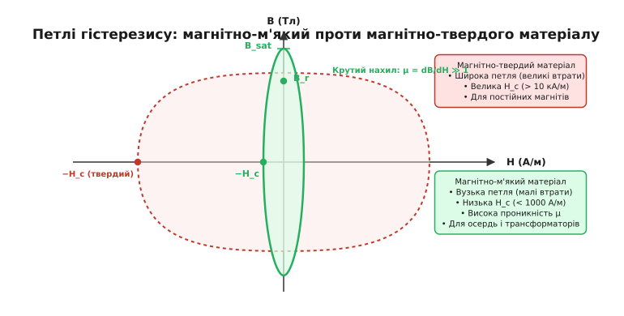
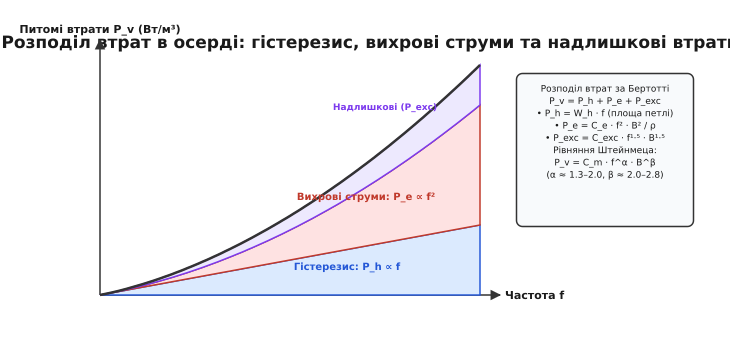
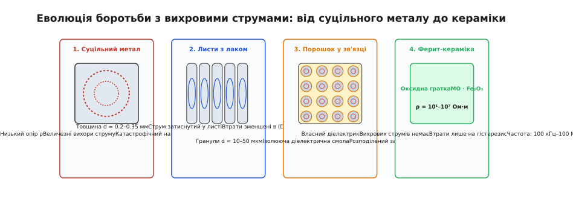
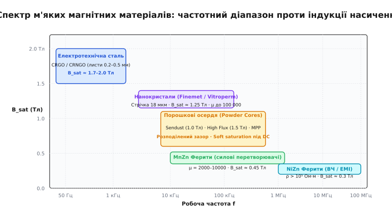
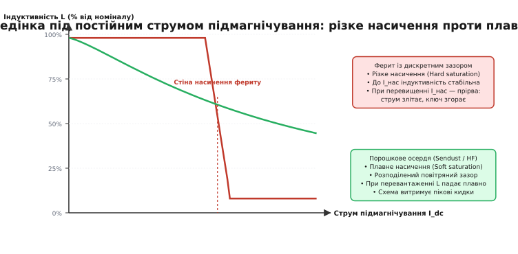

# М'які магнітні матеріали

<preknowlist>
- [Котушка](topic:ph-electromagnetism/inductor-coil) — витки зі струмом створюють магнітне поле, посилене феромагнітним осердям.
- [Індуктивність](topic:ph-electromagnetism/inductance) — зв'язок між струмом у провіднику та повним магнітним потоком через контур.
- [Закон електромагнітної індукції Фарадея](topic:ph-electromagnetism/faraday-law) — швидкість зміни магнітного потоку наводить електрорушійну силу.
- [Ферит і втрати в осерді](topic:hw-components/core-losses) — базові механізми нагріву осердя через гістерезис та вихрові струми.
</preknowlist>

Звичайна котушка з мідного проводу, намотана на порожньому каркасі в повітрі, є ідеальним індуктивним елементом з точки зору лінійності: вона накопичує енергію в магнітному полі без втрат на перемагнічування та не насичується за будь-яких струмів. Проте магнітна проникність вакууму `μ_0 = 4·π·10⁻⁷ Гн/м` настільки мізерна, що для отримання індуктивності в кілька мілігенрі довелося б намотувати тисячі витків мідного дроту масою в десятки кілограмів. Щоб сконцентрувати магнітний потік і підняти індуктивність у тисячі разів за збереження компактних габаритів, усередину котушки поміщають магнітопровід. Але якщо вставити всередину високочастотного силового дроселя шматок суцільного конструкційного заліза, перетворювач перетвориться на індукційну піч: за лічені секунди метал розжариться від вихрових струмів та гістерезису, а транзистори згорять від різкого спаду проникності. Вибір та конструювання магнітного осердя — це завжди пошук балансу між здатністю матеріалу проводити магнітний потік і тепловою ціною, яку схема платить за кожне перемагнічування.

Магнітні матеріали в електроніці діляться на дві діаметрально протилежні групи за тим, як легко вони змінюють свій магнітний стан під дією зовнішнього струму:
- **Магнітно-тверді матеріали** (*hard magnetic materials*): важко намагнітити, але вони «намертво» утримують залишкову намагніченість і вимагають гігантського зовнішнього поля для розмагнічування. Це клас постійних магнітів (неодимові NdFeB, самарій-кобальтові SmCo, магнітотверді барієві ферити), призначення яких — створювати постійне статичне поле без споживання струму.
- **Магнітно-м'які матеріали** (*soft magnetic materials*): легко намагнічуються навіть від мізерного струму в котушці, підсилюють магнітне поле в тисячі разів, а після зняття струму майже повністю втрачають намагніченість, повертаючись у вихідний нульовий стан. Саме вони є основою трансформаторів, дроселів, фільтрів завад, реле та магнітних підсилювачів.

---

### Фізика м'якого магнетизму та петля гістерезису B-H

Феромагнітний або феримагнітний матеріал нижче [точки Кюрі](topic:hw-components/magnet-grades) складається з мікроскопічних областей спонтанного намагнічування — **доменів Вейса** (*domains*, від латинського *dominium* — володіння). Усередині кожного окремого домену квантово-механічна обмінна взаємодія електронів вишиковує магнітні спінові моменти атомів строго в одному напрямку аж до локального магнітного насичення. Проте у розмагніченому шматку металу чи кераміки мільйони доменів спрямовані хаотично у різні боки, тому результуюче зовнішнє магнітне поле зразка дорівнює нулю.

Між сусідніми доменами існують перехідні граничні шари товщиною в сотні атомних площин — **доменні стінки Блоха та Нееля**. Коли ми пропускаємо струм крізь обмотку й створюємо зовнішню напруженість поля `H` (у амперах на метр, А/м), матеріал реагує двома послідовними мікроскопічними механізмами:
1. **Зміщення доменних стінок (*domain wall motion*):** у слабких полях домени, орієнтація яких наближена до вектора зовнішнього поля, починають рости за рахунок сусідніх «неправильно» орієнтованих доменів. Межі доменів зсуваються в товщі матеріалу.
2. **Обертання вектора намагніченості (*magnetization rotation*):** у сильних полях, коли всі вигідні домени вже поглинули сусідів, магнітні моменти доменів починають насильно повертатися в напрямку поля, долаючи внутрішні сили кристалічної ґратки, доки весь об'єм матеріалу не перетвориться на один гігантський монодомен — настає повне **магнітне насичення** (*magnetic saturation*, `B_sat`).

```
Процес намагнічування доменної структури:
1. Розмагнічено (H = 0)     2. Слабке поле H (зсув стінок)   3. Сильне поле H (насичення B_sat)
┌───────┬───────┐            ┌───────────┬───┐               ┌───────────────────────────────┐
│  ───> │ <───  │            │           │ < │               │   ═════════════════════════>  │
├───────┼───────┤   ───>     │   ─────>  ├───┤      ───>     │   Всі спіни вишикувані        │
│  <─── │  ───> │            │           │ < │               │   вздовж зовнішнього поля     │
└───────┴───────┘            └───────────┴───┘               └───────────────────────────────┘
  Сумарне B = 0                Домени поля ростуть             B = B_sat (максимум індукції)
```

Чому одні матеріали намагнічуються легко, а інші чинять шалений опір? Усе визначають дві фундаментальні константи кристала:
- **Магнітокристалічна анізотропія (*magnetocrystalline anisotropy*, `K_1`):** прагнення магнітних моментів атомів лежати строго вздовж певних кристалографічних осей (осей легкого намагнічування). Що вища анізотропія, то важче розвернути домен і то ширшою стає петля перемагнічування.
- **Магнітострикція (*magnetostriction*, `λ_s`):** зміна геометричних розмірів тіла при намагнічуванні. Якщо кристал деформується під дією поля, внутрішні механічні напруження блокують рух доменних стінок.

У якісних магнітно-м'яких матеріалах металурги та хіміки спеціальним підбором складу та термічною обробкою зводять константи `K_1` та `λ_s` практично до нуля. Доменні стінки рухаються в них майже без внутрішнього тертя.

Зв'язок між прикладеною напруженістю магнітного поля `H` (струмом у витках `N · I`) та виникаючою магнітною індукцією `B` (щільністю магнітного потоку в теслах, Тл) за повний цикл перемагнічування описує замкнена крива — **петля гістерезису** (*hysteresis loop*, від грецького *hysteresis* — запізнення).


*Магнітно-м'який матеріал має вузьку стрімку петлю гістерезису з низькою коерцитивною силою H_c та високою проникністю μ_r, що мінімізує втрати на перемагнічування. Магнітно-твердий матеріал має широку петлю з гігантською H_c і використовується виключно для постійних магнітів.*

Ключові параметри, за якими інженер оцінює магнітно-м'який матеріал:

1. **Коерцитивна сила (`H_c`, Coercivity):** напруженість зворотного магнітного поля, яку необхідно прикласти до попередньо насиченого зразка, щоб повністю зняти його намагніченість (звести `B` до нуля). Для магнітно-м'яких матеріалів за стандартом IEC `H_c < 1000 А/м`, а в найкращих сучасних сплавах вона становить менше `1...10 А/м`. Низька коерцитивність означає вузьку петлю й мізерні втрати енергії за цикл.
2. **Відносна магнітна проникність (`μ_r`, Relative Permeability):** безрозмірний коефіцієнт, що показує, у скільки разів індукція в матеріалі більша за індукцію у вакуумі при тому самому полі:
   ```
   μ_r = B / (μ_0 · H)
   ```
   Розрізняють **початкову проникність** `μ_i` (в мікрополях при `H → 0`), **амплітудну проникність** `μ_a` за конкретного розмаху коливань та **максимальну проникність** `μ_max` у точці найкрутішого нахилу кривої. У якісних м'яких феритів `μ_r = 2000...15 000`, а в нанокристалічних стрічок сягає `100 000...200 000`.
3. **Індукція насичення (`B_sat`, Saturation Flux Density):** гранична щільність магнітного потоку, вище якої матеріал вичерпує свою здатність підсилювати поле й починає поводитися як звичайне повітря (`dB/dH = μ_0`). Що вища `B_sat`, то більший магнітний потік `Φ = B · A_e` може пропустити осердя даного перерізу без заходу в насичення і то компактнішим буде силовий трансформатор.
4. **Залишкова індукція (`B_r`, Remanence):** величина магнітної індукції, що лишається в осерді після повного вимкнення зовнішнього струму (`H = 0`).

---

### Джерела втрат у магнітопроводі: модель Бертотті та закон Штейнмеца

Коли магнітне поле в осерді періодично змінюється з частотою `f`, електрична енергія перетворюється на тепло. Згідно з класичною електродинамічною моделлю Джорджіо Бертотті, сумарна об'ємна густина втрат `P_v` (у Вт/м³ або мВт/см³) складається з трьох фізичних складових:

```
P_v = P_h + P_e + P_exc
```

Детальний математичний аналіз інтегрування площі петлі, розрахунку вихрових струмів та модифікацій формул для несинусоїдних імпульсних хвиль наведено у вставці [Розрахунок втрат в осерді](topic:hw-components/soft-magnetic-materials/math-steinmetz-losses.md).

```
Втрати перемагнічування в осерді:
┌────────────────────────────────────────────────────────────────────────────┐
│ P_v = P_h (Гістерезис) + P_e (Вихрові струми) + P_exc (Надлишкові втрати)   │
└─────────────────────────────────────┬──────────────────────────────────────┘
                                      │
        ┌─────────────────────────────┼─────────────────────────────┐
        ▼                             ▼                             ▼
┌───────────────────────────┐ ┌───────────────────────────┐ ┌───────────────────────────┐
│ P_h = ∮ H dB · f          │ │ P_e ∝ (f² · B² · d²) / ρ  │ │ P_exc ∝ f¹·⁵ · B¹·⁵       │
│                           │ │                           │ │                           │
│ Теорія: внутрішнє тертя   │ │ Теорія: струми Фуко       │ │ Теорія: мікровихори біля  │
│ доменних стінок за дефекти│ │ у провідному тілі осердя; │ │ рухомих доменних меж      │
│ кристалічної ґратки.      │ │ квадрат товщини стрічки d │ │ під час стрибків          │
│ Пропорційні f¹.           │ │ та питомий опір ρ.        │ │ Баркгаузена.              │
└───────────────────────────┘ └───────────────────────────┘ └───────────────────────────┘
```


*Розподіл питомих втрат за моделлю Бертотті: при низьких частотах домінує гістерезис (P_h ∝ f), а при підвищенні частоти стрімко виростають квадратичними вихровими втратами (P_e ∝ f²). Рівняння Штейнмеца емпірично апроксимує цю суму.*

1. **Гістерезисні втрати (`P_h`):** енергія, яка витрачається за один період коливання, строго дорівнює площі петлі гістерезису `W_h = ∮ H dB`. За секунду таких циклів відбувається `f` штук, тому потужність гістерезисних втрат прямо пропорційна першому степеню частоти `P_h = W_h · f`. На низьких частотах (50–400 Гц) гістерезис становить основну частку загальних втрат.
2. **Класичні вихрові втрати (`P_e`):** згідно із [законом індукції Фарадея](topic:ph-electromagnetism/faraday-law), змінне магнітне поле наводить у провідному тілі осердя вихрові струми Фуко. Ці струми замикаються контурами в площині, перпендикулярній до ліній поля, і виділяють джоулеве тепло. Для пластини або стрічки товщиною `d` з питомим електричним опором `ρ` потужність вихрових втрат виражається формулою:
   ```
   P_e = (π² · d² · f² · B_pk²) / (6 · ρ)
   ```
   З цієї формули видно, чому вихрові струми стають головним ворогом високих частот: вони зростають **пропорційно квадрату частоти `f²`** та квадрату індукції `B_pk²`.
3. **Надлишкові (динамічні) втрати (`P_exc`):** виникають через нерівномірний, стрибкоподібний рух доменних стінок (стрибки Баркгаузена), що викликає локальні мікроскопічні вихори струму навколо рухомих меж доменів: `P_exc ∝ f¹·⁵ · B_pk¹·⁵`.

Для придушення вихрових струмів інженерія пройшла чотири послідовні ступені еволюції матеріалів:


*Чотири ступені придушення вихрових струмів: від суцільного металу (величезні втрати) через тонкі ізольовані листи електротехнічної сталі (CRGO) та пресовані мікропорошки (Sendust) до оксидної кераміки-діелектрика (ферити).*

Для швидкої інженерної оцінки загальних втрат в осерді в діапазоні синусоїдальних частот використовують емпіричне **рівняння Штейнмеца**:

```
P_v = C_m · f^α · B_pk^β
```

де `C_m`, `α ≈ 1.3...2.0`, `β ≈ 2.0...2.8` — константи, що визначаються з виміряних паспортних графіків конкретного матеріалу.

> 🔧 **Навіщо це.** В імпульсній силовій електроніці магнітний потік має форму не синусоїди, а трикутника чи трапеції з постійним струмом підмагнічування. Звичайне рівняння Штейнмеца дає похибку у 2–4 рази при несиметричних шпаруватостях `D = 0.1...0.3`. Для точних розрахунків DCDC-перетворювачів застосовують покращене узагальнене рівняння iGSE (*Improved Generalized Steinmetz Equation*), яке інтегрує миттєву швидкість зміни індукції `|dB/dt|` вздовж реальної форми сигналу.

---

### Класифікація магнітно-м'яких матеріалів: чотири великі сімейства

Жоден універсальний матеріал не здатен одночасно забезпечити рекордну індукцію `2 Тл`, гігантську проникність `100 000`, нульові втрати на мегагерцах і копійчану ціну. Світ силової електроніки розділений між чотирма фундаментальними сімействами матеріалів, кожне з яких займає свою нішу на діаграмі «частота — індукція насичення».


*Карта вибору магнітно-м'яких матеріалів за робочою частотою та індукцією насичення. Металеві листи домінують на низьких частотах завдяки B_sat до 2.0 Тл; нанокристали та порошки покривають діапазон 10–500 кГц; ферити незамінні на високих частотах від 100 кГц до 100+ МГц.*

Детальну історію появи цих матеріалів — від дослідів Гадфілда та підпільної лабораторії Philips у роки Другої світової війни до квантового прориву сплаву Finemet — описано у вставці [Історія магнітно-м'яких сплавів](topic:hw-components/soft-magnetic-materials/hist-silicon-steel-to-nanocrystal.md).

```
                     Класифікація магнітно-м'яких матеріалів:
┌─────────────────────────────────────────────────────────────────────────────────┐
│                          МАГНІТНО-М'ЯКІ МАТЕРІАЛИ                                │
└──────────────┬───────────────────┬───────────────────┬──────────────────┬───────┘
               │                   │                   │                  │
               ▼                   ▼                   ▼                  ▼
┌───────────────────────┐ ┌─────────────────┐ ┌─────────────────┐ ┌───────────────┐
│ 1. Кремнієва сталь    │ │ 2. М'які ферити │ │ 3. Порошкові    │ │ 4. Нанокристали│
│    (Electrical Steel) │ │    (Ferrites)   │ │    осердя       │ │    (Finemet)   │
├───────────────────────┤ ├─────────────────┤ ├─────────────────┤ ├───────────────┤
│ • CRGO / CRNGO        │ │ • MnZn (силові) │ │ • Sendust       │ │ • Стрічка 18мкм│
│ • Листи 0.23–0.5 мм   │ │ • NiZn (ВЧ/EMI) │ │ • High Flux     │ │ • B_sat=1.25 Тл│
│ • B_sat = 1.7–2.0 Тл  │ │ • B_sat=0.4 Тл  │ │ • MPP / XFlux   │ │ • μ до 200 000 │
│ • Частота: 50–400 Гц  │ │ • Частота:      │ │ • B_sat=1.0–1.5 │ │ • Частота:     │
│                       │ │   100кГц–100МГц │ │ • Soft saturation││   10–200 кГц   │
└───────────────────────┘ └─────────────────┘ └─────────────────┘ └───────────────┘
```

---

#### 1. Електротехнічна кремнієва сталь (Electrical Steel)

Електротехнічна сталь є наймасовішим магнітним матеріалом цивілізації: з неї виготовляють магнітопроводи силових трансформаторів електромереж, статори та ротори генераторів гідроелектростанцій та тягових електродвигунів.

- **Склад та металургія:** сплав заліза з вмістом `1.5%...3.5%` кремнію (Si). Кремній збільшує питомий електричний опір металу в 4–5 разів (з `10 мкОм·см` у чистого заліза до `45...50 мкОм·см`), пригнічуючи вихрові струми, та повністю ліквідує магнітне старіння від розчиненого вуглецю. Проте додавання понад `4%` кремнію робить сталь настільки крихкою, що її стає неможливо вальцювати в тонкі листи.
- **Холоднокатана текстурована сталь (CRGO — Cold Rolled Grain Oriented):** завдяки вальцюванню та високотемпературному відпалу у водні кристалічні зерна сталі формують **текстуру Госса `(110)[001]`**. Осі легкого намагнічування всіх зерен вишиковуються суворо вздовж напрямку прокатки листа. Це піднімає проникність до `μ_r ≈ 20 000...40 000` та знижує коерцитивну силу до `H_c < 15 А/м`.
- **Нетекстурована сталь (CRNGO — Non-Oriented):** має ізотропні магнітні властивості в усіх напрямках площини листа. Застосовується в обертових електричних машинах (моторах та генераторах), де напрямок магнітного потоку постійно змінюється відносно осердя.
- **Товщина листів та ламінація:** сталь постачається у вигляді тонких листів товщиною `0.50 мм`, `0.35 мм`, `0.27 мм` або `0.23 мм` (а для авіаційної частоти 400 Гц — до `0.10 мм`), покритих з обох боків неорганічною діелектричною плівкою фосфатів чи силікатів (покриття Carlite товщиною `1...3 мкм`). Листи шихтують у пакети (Ш-подібні, броньові, тороїдальні виті осердя), завдяки чому вихрові струми залишаються замкненими всередині кожного окремого тонкого листа й не циркулюють за всім об'ємом трансформатора.
- **Параметри:** рекордна індукція насичення `B_sat ≈ 1.7...2.0 Тл` (найвища серед доступних промислових матеріалів). Робочий частотний діапазон: `50 Гц — 400 Гц` (у звукових трансформаторах — до кількох кілогерц).

---

#### 2. М'які ферити — магнітна кераміка (Soft Ferrites)

Ферити є основою високочастотної імпульсної електроніки. Це не метал, а складна неорганічна оксидна кераміка зі структурою мінералу шпінелі, що має загальну хімічну формулу `M²⁺Fe₂³⁺O₄`, де `M` — двохвалентний іон перехідного металу. За типом магнетизму ферити є феримагнетиками: магнітні моменти іонів заліза у двох різних підґратках спрямовані антипаралельно, проте вони мають різну величину, створюючи сильну результуючу намагніченість.

Оскільки це керамічний оксид, ферит має колосальний питомий електричний опір — у мільйони разів вищий, ніж у металів. Вихрові струми в ньому практично відсутні, що дозволяє феритам працювати на частотах від десятків кілогерц до сотень мегагерц.

У практичній електроніці домінують дві великі родини феритів:

```
Характеристика          MnZn ферити (Марганець-Цинк)     NiZn ферити (Нікель-Цинк)
Хімічний склад          Mn_a Zn_(1-a) Fe₂O₄              Ni_a Zn_(1-a) Fe₂O₄
Питомий опір ρ          0.1 ... 10 Ом·м (напівпровідник) 10⁵ ... 10⁷ Ом·м (чесний діелектрик)
Початкова проникність μ 2 000 ... 15 000                 15 ... 1 500
Індукція насичення B_sat 0.38 ... 0.52 Тл                0.25 ... 0.35 Тл
Робоча частота          10 кГц ... 2 МГц                 1 МГц ... 100+ МГц
Точка Кюрі T_C          150 ... 230 °C                   120 ... 350 °C
Типове застосування     Силові імпульсні трансформатори  ВЧ-дроселі, балуни, антени,
                        (Flyback, LLC, Forward), дроселі феритові намистини EMI
```

- **Границя Снука (*Snoek's limit*):** фундаментальний закон для феритів, що пов'язує початкову магнітну проникність `μ_i` з критичною резонансною частотою природного феромагнітного резонансу `f_r`:
  ```
  μ_i · f_r = (2/3) · γ · M_s = const
  ```
  де `γ` — гіромагнітне співвідношення, а `M_s` — спонтанна намагніченість. Цей фізичний інваріант доводить: неможливо створити матеріал, який мав би одночасно гігантську проникність `μ_i = 10 000` і працював на частоті `100 МГц`. Зі зростанням частоти інженер змушений переходити від високопроникних MnZn феритів до низькопроникних, але швидких NiZn феритів.

---

#### 3. Порошкові залізні осердя (Powder Cores)

Якщо трансформатор передає енергію безпосередньо з первинної обмотки у вторинну без накопичення енергії в осерді (для чого потрібен суцільний ферит із замкненим магнітним колом), то **накопичувальний дросель** (у схемах Buck, Boost, PFC, Flyback) зобов'язаний накопичувати енергію в магнітному полі:

```
W_mag = 1/2 · L · I² = 1/2 · ∫ (B² / μ) dV
```

Оскільки у високопроникному фериті `μ_r ≈ 3000`, накопичити помітну енергію в суцільному осерді неможливо — матеріал миттєво насититься при мізерному струмі. Щоб запасти енергію, в осердя необхідно ввести немагнітний об'єм (повітряний зазор з `μ_r = 1`), де густина енергії `B² / (2·μ_0)` є максимальною.

У феритах зазор роблять механічним пропилом центрального керна (*discrete air gap*). Проте це створює локальний потік розсіювання, який вигинається назовні зазору й перепалює мідні витки обмотки вихровими струмами.

Порошкові осердя вирішують цю задачу радикально: замість одного великого зазору вони мають **розподілений повітряний зазор** (*distributed air gap*). Осердя пресують під тиском до `20 тонн/см²` із мікроскопічних гранул металевого сплаву розміром `10...50 мкм`, кожна з яких покрита найтоншим шаром діелектрика.


*Ферит із дискретним зазором тримає стабільну індуктивність до порогу I_нас, після чого падає у прірву насичення (hard saturation). Порошкове осердя за рахунок розподіленого мікрозазору знижує індуктивність плавно (soft saturation), забезпечуючи захист схеми при перехідних кидках струму.*

Порівняння основних марок порошкових сплавів детально розібрано у вставці [Порівняння порошкових матеріалів](topic:hw-components/soft-magnetic-materials/comp-powder-core-comparison.md):
- **Iron Powder (Розпилене залізо):** найдешевше, `B_sat ≈ 1.2...1.6 Тл`, але має високі вихрові втрати всередині частинок та ризик термічного старіння органічного клею при `> 100 °C`. Використовується у фільтрах постійного струму.
- **Sendust / Kool Mµ (Fe-Si-Al):** класичний японський сплав із **нульовою магнітострикцією** (`λ_s ≈ 0`). Працює абсолютно безшумно (0 дБ акустичного писку), має `B_sat ≈ 1.05 Тл`, низькі втрати та відмінне співвідношення «ціна/якість» для PFC-дроселів.
- **High Flux (50% Ni — 50% Fe):** має рекордну індукцію `B_sat ≈ 1.5 Тл` серед сплавів нікелю та найвищу здатність утримувати індуктивність під великим постійним струмом. Застосовується в компактних сильнострумових модулях живлення процесорів та електромобілів.
- **MPP (Molypermalloy, 81% Ni — 17% Fe — 2% Mo):** найнижчі втрати та найвища температурна стабільність `±1%` у діапазоні `-55...+125 °C`. Найдорожчий порошковий матеріал для авіації, космосу та прецизійних фільтрів.
- **XFlux (Fe-Si 93.5/6.5):** економічна альтернатива High Flux з `B_sat ≈ 1.6 Тл` для потужних сонячних інверторів (>10 кВт).

---

#### 4. Аморфні та нанокристалічні сплави (Amorphous & Nanocrystalline)

Вершиною сучасної металургії м'яких магнітних матеріалів є стрічкові аморфні та нанокристалічні сплави на основі заліза та кобальту (торгові марки **Finemet**, **Vitroperm**, **Metglas**, **Nanoperm**).

- **Аморфні металеві сплави (Metallic Glasses):** отримують надшвидким загартуванням розплаву (*melt spinning*) зі швидкістю понад `1 000 000 °C/с`. Метал застигає у вигляді рідкої структури без кристалічної ґратки, утворюючи гнучку стрічку товщиною `20...30 мкм`. Відсутність кристалографічної анізотропії та меж зерен різко знижує коерцитивну силу (`H_c < 2 А/м`). Сплави на основі заліза (наприклад, Metglas 2605SA1, `Fe-Si-B`) мають високу індукцію `B_sat ≈ 1.56 Тл` і застосовуються в енергоощадних розподільчих трансформаторах електромереж, де втрати холостого ходу зменшуються на 70% порівняно з кремнієвою сталлю. Сплави на основі кобальту (Metglas 2714A) мають нульову магнітострикцію, надзвичайно високу проникність (`μ_r > 200 000`) і слугують осердями магнітних ключів та підсилювачів імпульсних модуляторів.
- **Нанокристалізація Finemet (модель Хьорцера):** нанокристалічні сплави створюють контрольованим термічним відпалом аморфної стрічки складу `Fe-Cu-Nb-Si-B` при температурі `540...580 °C` у присутності магнітного поля. Атоми міді (Cu) створюють мільярди центрів кристалізації, а тугоплавкий ніобій (Nb) гальмує ріст кристалів. Утворюється унікальна двофазна наноструктура: ультракрихітні зерна кремнієвого заліза `Fe-Si` розміром всього `10...15 нм`, рівномірно розподілені в аморфному матриксі `Fe-B`.
- **Фізичний парадокс Хьорцера:** коли розмір зерна `D ≈ 10 нм` стає меншим за товщину доменної стінки (магнітну довжину обміну `L_ex ≈ 35 нм`), магнітокристалічна анізотропія окремих випадково орієнтованих кристалітів повністю усереднюється квантовою обмінною взаємодією електронів. Згідно з моделлю Хьорцера, ефективна анізотропія падає пропорційно шостому степеню розміру зерна: `⟨K⟩ ∝ D⁶`.
- **Характеристики:**
  * Індукція насичення: `B_sat ≈ 1.25...1.30 Тл` (утричі вище за силовий ферит);
  * Магнітна проникність: `μ_r = 50 000...200 000` (у 20–50 разів вище за ферит);
  * Питомі втрати на частотах `50...200 кГц` нижчі, ніж у найкращих силових феритів N87/3C95;
  * Температурний діапазон: точка Кюрі `T_C ≈ 570 °C` (нанокристали зберігають працездатність при нагріві до `150...180 °C` без деградації індукції насичення).

---

### Зведена таблиця характеристик основних класів матеріалів

```
Матеріал             B_sat (Тл)  μ_r (початкова)  Питомий опір ρ   Частотна смуга   Головна перевага
Електротехнічна сталь 1.8...2.0   5 000...40 000   0.5 мкОм·м       50...400 Гц      Рекордна B_sat, низька ціна
MnZn Ферит           0.38...0.50 2 000...15 000   0.1...10 Ом·м    10 кГц...2 МГц   Мінімальні втрати, дешевизна
NiZn Ферит           0.25...0.35 15...1 500       10⁵...10⁷ Ом·м   1...100+ МГц     Справжній діелектрик на ВЧ
Sendust (Порошок)    1.0...1.05  14...125         100 мкОм·м       10...500 кГц     Плавне насичення, 0 дБ шуму
High Flux (Порошок)  1.5...1.55  14...160         100 мкОм·м       10...500 кГц     Максимальний DC-bias у порошках
Аморфний Fe-сплав    1.50...1.56 5 000...20 000   1.3 мкОм·м       50 Гц...50 кГц   Мінімальні втрати при 1.5 Тл
Нанокристал (Finemet)1.2...1.3   50 000...200 000 1.2 мкОм·м       10...200 кГц     B_sat + μ_r + мінімум втрат
```

---

### Фізика крайового потоку в дискретних зазорах

При використанні феритових осердь із пропиляним повітряним зазором `l_g` лінії магнітного поля не обриваються строго на межі керна, а вигинаються назовні у вікно намотування — виникає **крайовий потік розсіювання** (*fringing flux*).

```
Крайовий потік довкола повітряного зазору:
       ┌──────────────┐
       │  ФЕРИТ       │
       └───┐      ┌───┘
           │      │   <─── Потік вигинається назовні (Fringing Field)
        ░░░│      │░░░
        ░░░│      │░░░<─── Мідні витки обмотки біля зазору
        ░░░│      │░░░     перетинаються перпендикулярним полем і плавляться!
       ┌───┘      └───┐
       │  ФЕРИТ       │
       └──────────────┘
```

Крайовий потік викликає три інженерні проблеми:
1. **Зростання ефективної площі зазору:** реальна еквівалентна площа зазору `A_gap` стає більшою за площу керна `A_e`, що описується коефіцієнтом вигинання `F = 1 + (l_g / √A_e) · ln(2·G / l_g)`, де `G` — висота вікна. Через це фактична індуктивність виявляється на `10%...30%` вищою за спрощений розрахунок.
2. **Локальний перегрів міді:** лінії крайового поля перетинають сусідні витки мідного проводу під прямим кутом, наводячи в товщі міді гігантські вихрові струми. Температура найближчих до зазору витків може на `40...80 °C` перевищувати середню температуру обмотки.
3. **Правило відступу обмотки:** щоб запобігти прогару ізоляції, витки обмотки на каркасі слід відсувати від площини повітряного зазору на відстань щонайменше `3 · l_g`, або замінювати один великий центральний зазор на кілька дрібніших зазорів на бічних кернах, або переходити на порошкові осердя з розподіленим мікрозазором.

---

### Лабораторні методи вимірювання динамічних характеристик B-H

Для верифікації параметрів магнітних матеріалів та готових індуктивних компонентів у лабораторії застосовують два базових інструментальних методи:

1. **Двообмотковий трансформаторний метод (B-H Loop Tracer):**
   На тестове осердя намотують дві незалежні обмотки: первинну `N_1` (намагнічувальна) та вторинну `N_2` (вимірювальна).
   - Напруженість поля `H(t)` обчислюється з виміряного струму первинної обмотки `i_1(t)` через прецизійний шунт `R_shunt`:
     ```
     H(t) = (N_1 · i_1(t)) / l_e
     ```
   - Магнітна індукція `B(t)` обчислюється апаратним або цифровим інтегруванням напруги вторинної обмотки `v_2(t)` за законом Фарадея:
     ```
     v_2(t) = N_2 · A_e · (dB/dt)
     B(t) = (1 / (N_2 · A_e)) · ∫ v_2(t) dt
     ```
   Подаючи сигнал `H(t)` на вісь X, а сигнал `B(t)` на вісь Y осцилографа, отримують реальну динамічну петлю гістерезису матеріалу за поточної частоти та температури. Площа замкненої кривої визначає повні теплові втрати в осерді за цикл.

2. **Імпедансний метод на LCR-метрі / аналізаторі імпедансу:**
   Котушка з тестовим осердям вимірюється в послідовній схемі заміщення `(L_s, R_s)`. Дійсна та уявна частини комплексної проникності розраховуються безпосередньо з виміряних значень індуктивності та активного опору втрат:
   ```
   μ′ = (L_s · l_e) / (μ_0 · N² · A_e)
   μ″ = (R_s · l_e) / (2 · π · f · μ_0 · N² · A_e)
   ```

---

### Інженерний вибір магнітопроводу під схемотехнічну задачу

Практичний вибір матеріалу визначається конкретною схемотехнічною функцією індуктивного вузла в апаратурі:

```
                            Яка функція магнітного компонента?
                                            │
        ┌───────────────────┬───────────────┴───────────────┬───────────────────┐
        ▼                   ▼                               ▼                   ▼
┌───────────────┐   ┌───────────────┐               ┌───────────────┐   ┌───────────────┐
│ Силовий       │   │ Накопичувальний│               │ Синфазний     │   │ ВЧ фільтр     │
│ трансформатор │   │ дросель       │               │ фільтр (CMC)  │   │ / EMI-намистина│
├───────────────┤   ├───────────────┤               ├───────────────┤   ├───────────────┤
│ Режим: ±B_ac  │   │ Режим: I_dc + │               │ Режим: висока │   │ Режим: високі │
│ без I_dc      │   │ пульсація ΔI  │               │ індуктивність │   │ втрати на ВЧ  │
│               │   │               │               │ без DC bias   │   │               │
│ Вибір:        │   │ Вибір:        │               │ Вибір:        │   │ Вибір:        │
│ • MnZn ферит  │   │ • Sendust/HF  │               │ • Нанокристал │   │ • NiZn ферит  │
│ • Нанокристал │   │ • Ферит із    │               │ • MnZn ферит  │   │   (намистина  │
│   (без зазору)│   │   зазором     │               │   (μ > 7000)  │   │   на кабель)  │
└───────────────┘   └───────────────┘               └───────────────┘   └───────────────┘
```

1. **Силовий трансформатор імпульсного перетворювача (Half-Bridge, Full-Bridge, Push-Pull, LLC):**
   Магнітний потік здійснює симетричні коливання навколо нуля (`+B_pk ⇄ −B_pk`), постійний струм відсутній. Мета конструктора — отримати максимальну індуктивність первинної обмотки за мінімальної кількості витків і мінімальних втрат на нагрів.
   - **Оптимальний вибір:** силовий MnZn ферит (марки N87, N97 від TDK/Epcos; 3C90, 3C95 від Ferroxcube) або тороїдальні нанокристалічні осердя (Vitroperm 500F) без повітряного зазору.
2. **Накопичувальний дросель зі значним постійним струмом (Buck, Boost, SEPIC, PFC):**
   Через обмотку протікає великий постійний струм навантаження `I_out` з накладеними високочастотними пульсаціями `ΔI`.
   - **Оптимальний вибір:** порошкові тороїди Sendust (Kool Mµ) або High Flux із розподіленим зазором. У разі обмеженого бюджету застосовують Ш-подібні феритові осердя з каліброваним пластиковим або шліфованим центральним зазором `0.5...2.0 мм`.
3. **Синфазний протизавадний дросель (Common-Mode Choke, CMC):**
   Дросель вхідного мережевого фільтра має створювати величезний індуктивний опір `Z = 2·π·f·L` для несиметричних синфазних завад, що проникають у мережу від комутації ключів. Оскільки робочі струми живлення течуть у зустрічних напрямках і взаємно компенсують свої магнітні поля, постійного підмагнічування в осерді немає.
   - **Оптимальний вибір:** нанокристалічні стрічкові осердя з проникністю `μ_r = 70 000...150 000` або високопроникні MnZn ферити (марки T38, N30 з `μ_r = 7000...10 000`). Нанокристалічний синфазний дросель у 3–4 рази менший за габаритами та вагою порівняно з феритовим аналогом.
4. **Високочастотний фільтр та поглинач завад (Ferrite Bead):**
   На частотах `10...500 МГц` деталь повинна працювати не як реактивна індуктивність (яка може утворити паразитний резонансний контур із ємністю плати й викликати генерацію дзвінка), а як активний частотно-залежний резистор, що поглинає енергію завади й розсіює її у вигляді тепла.
   - **Оптимальний вибір:** високоомні NiZn ферити.

Створити точну комп'ютерну модель розрахунку робочої точки дроселя, перевірити запас за насиченням `B_pk < B_sat` та оцінити кінцевий перегрів конструкції можна за допомогою робочого коду симулятора у вставці [Калькулятор робочої точки та втрат осердя](topic:hw-components/soft-magnetic-materials/proj-core-loss-sim.md).

---

### Практичні граблі та граничні режими

При роботі з магнітно-м'якими матеріалами у реальних приладах слід остерігатися прихованих фізичних ефектів, що не завжди очевидні з ідеалізованих схемних моделей:

- **Температурний дератинг індукції насичення:** у паспортних даних феритів індукція насичення `B_sat ≈ 0.48...0.52 Тл` завжди наводиться для кімнатної температури `25 °C`. Проте всередині закритого корпусу блока живлення осердя прогрівається до `80...100 °C`. За цієї температури `B_sat` падає до `0.35...0.38 Тл`. Розрахунок силового каскаду за значеннями для `25 °C` неминуче призведе до аварійного насичення та згоряння ключів під час виходу пристрою на робочий тепловий режим.
- **Механічний стрес та компаундування:** ферити та нанокристалічні стрічки надзвичайно чутливі до механічного тиску (п'єзомагнітний ефект). Заливка відкритого тороїдального осердя жорстким епоксидним компаундом або надмірне зусилля затягування металевого кріпильного болта деформує кристалічну ґратку, викликаючи катастрофічне падіння проникності `μ_r` на `30%...60%` та подвоєння втрат гістерезису. Нанокристалічні осердя обов'язково упаковують у захисні пластикові контейнери із зазором, заповненим силіконовим демпфером.
- **Акустичний шум:** за наявності змінного струму в діапазоні чутних частот (`20 Гц — 20 кГц`) магнітострикція змушує осердя фізично пульсувати, працюючи як динамічний гучномовець. Для тихих медичних приладів, студійного аудіо та домашньої побутової техніки слід обирати матеріали з нульовою магнітострикцією (Sendust або нанокристали).
