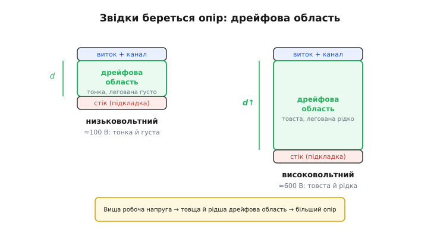
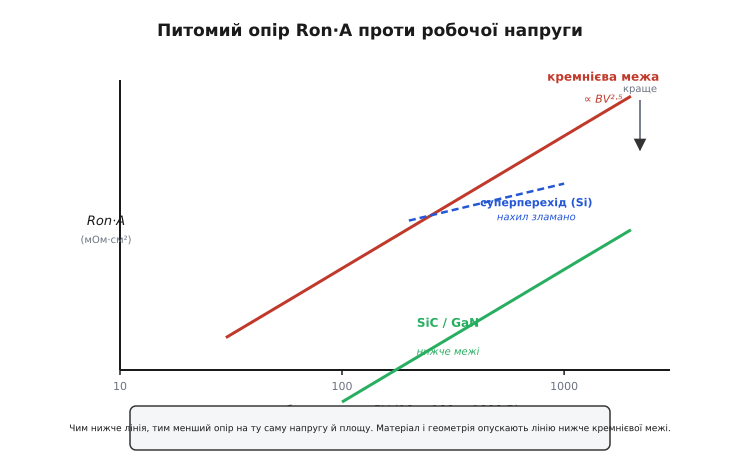
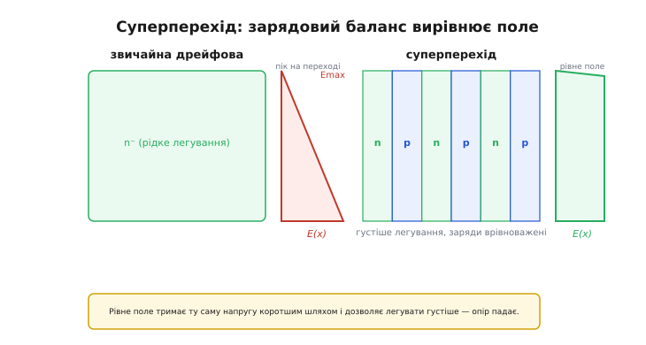

# Питомий опір Ron·A та обмеження матеріалу

Візьміть два силові MOSFET на однаковий струм — скажімо, обидва тримають 50 А. Один розрахований на 30 В і має [опір відкритого каналу](topic:hw-components/rds-on) в кілька міліом. Другий тримає 600 В — і його опір раптом у сотні разів більший, цілі десяті ома. Той самий виробник, та сама технологія, схожий струм — а гріється високовольтний так, що без масивного радіатора його не поставиш. Це не примха окремого приладу: це **закон**. Що вища напруга, яку кремнієвий ключ мусить тримати закритим, то дорожче обходиться кожен ом провідності, коли він відкритий. Розберімося, звідки цей закон береться, чому в нього є непереборна для кремнію стеля — і чим її пробивають.

## Опір і площа торгуються між собою

Перше, що заважає порівнювати прилади чесно, — це **площа кристала**. Опір відкритого каналу легко зробити мізерним: візьми кристал удесятеро більший, постав десять однакових ключів паралельно — і опір упаде вдесятеро. Але й кремнію піде вдесятеро більше, ціна злетить, корпус розбухне. Виходить, «малий Rds(on)» сам по собі нічого не каже про якість приладу — він каже лише про те, скільки кремнію не пошкодував виробник.

Щоб прибрати цей вплив розміру й побачити саму **природу матеріалу**, опір нормують на площу. Величину

```
Ron·A  =  опір відкритого каналу  ×  площа кристала     [Ом·см²]
```

звуть **питомим опором у відкритому стані** *(specific on-resistance)*. Це «опір на одиницю площі» — скільки ома дає кожен квадратний сантиметр кремнію. Тепер порівняння чесне: менший Ron·A означає, що з тієї самої площі прилад видає більшу провідність. І одразу видно головний **компроміс**: реальний опір Rds(on) = Ron·A / A, тож зменшити його можна лише двома шляхами — або взяти матеріал із меншим Ron·A, або збільшити площу A (більше кремнію, дорожче). Ці двоє торгуються завжди: платиш або якістю матеріалу, або грішми за кремній.

> 🔧 **Навіщо це.** Коли в даташиті бачите Rds(on) = 2 мОм — не поспішайте радіти. Питайте, ЯКОЮ ЦІНОЮ: великий дорогий кристал може дати малий опір і на посередньому матеріалі, а крихітний дешевий чип на доброму матеріалі — такий самий. Ron·A знімає розмір з рівняння й показує, хто справді кращий «на грам кремнію». Саме за Ron·A інженер вирішує, чи варта нова технологія своєї ціни, і саме він визначає, наскільки маленьким (а отже дешевим) вийде прилад на потрібний опір.

## Уся справа в дрейфовій області

Чому ж високовольтний прилад такий опірний? Провина майже цілком на одному шарі всередині — **дрейфовій області** *(drift region)*.

Силовий MOSFET, на відміну від дрібного логічного, будують **вертикально**: струм тече згори (від витоку) вниз, крізь товщу кристала, до стоку на зворотному боці. Між ними лежить дрейфова область — товстий шар слабо легованого кремнію. Саме він тримає на собі всю високу напругу, коли ключ закритий. І саме він, коли ключ відкритий, дає майже весь опір. [Канал під затвором](topic:hw-components/mosfet-structure), опір виводів, контактів — усе це на високій напрузі дрібниці проти дрейфової області.

Щоб зрозуміти закон, треба побачити, як цей шар мусить рости з напругою. Напруга тримається на **збідненому шарі** — області, з якої відтягнуто вільні носії; всередині неї стоїть електричне поле. У кожного напівпровідника є межа — **критичне поле** *(critical field, Ec)*, вище за яке починається лавинний пробій: поле розганяє поодинокі носії так, що вони вибивають нові, ті ще нові, і струм лавиною виходить з-під контролю. Кремній витримує приблизно **0.3 МВ/см** — не більше.

Звідси проста, але невблаганна геометрія. Напруга — це поле, помножене на товщину. Якщо поле не може перевищити Ec, то єдиний спосіб утримати вищу напругу — **зробити шар товщим**:

```
BV  ≈  Ec · d        →      d  ≈  BV / Ec
```

Хочеш тримати вдвічі більшу напругу — роби шар удвічі товщим. Але це ще півбіди. Щоб поле в товстому шарі не задиралося на піку понад Ec, шар доводиться легувати **рідше** — класти менше донорів на кубічний сантиметр. А рідше леговане — це менше вільних носіїв, тобто **гірша провідність**. Ось і подвійний удар: з ростом напруги дрейфова область стає і **товщою** (довший шлях струму), і **рідшою** (менше носіїв на шляху). Опір росте з обох боків одразу.


*Струм у силовому MOSFET тече вертикально крізь дрейфову область. На низьку напругу вона тонка й легована густо — опору мало. На високу її доводиться робити і товщою (щоб поле не перевищило критичне), і рідшою (щоб пік поля не задерся) — опір росте з обох причин.*

## Стеля кремнію: Ron·A росте як BV²·⁵

Складімо це в число. Опір шару — це його товщина, поділена на провідність (провідність тим більша, чим густіше легування й чим рухливіші носії). Товщина росте пропорційно напрузі, а потрібне легування зі зростанням напруги падає — і коли підставити одне в одне через критичне поле, площа скорочується, а лишається чиста залежність питомого опору від напруги. Повне виведення — акуратне, з полем усередині шару й умовою пробою — [винесено в окрему математичну вставку](topic:hw-components/specific-on-resistance-metric/math-ron-a-derivation.md); тут важливий результат:

```
Ron·A(ідеальна)  ≈   4 · BV²
                    ─────────────
                     ε · μ · Ec³
```

Три властивості матеріалу в знаменнику — діелектрична проникність ε, рухливість носіїв μ і критичне поле Ec — і квадрат напруги в чисельнику. Ключове тут — **Ec у кубі**: критичне поле входить у третьому степені, тож саме воно вирішує все. Матеріал, що витримує вдесятеро сильніше поле, дає, за інших рівних, у **тисячу разів** менший питомий опір. Запам'ятайте цей куб — він і буде тим важелем, яким пробивають кремнієву стелю.

Для чистого кремнію цю теоретичну межу зручно згорнути в один інженерний вираз, яким користуються щодня:

```
Ron·A(кремній, межа)  ≈  8.3 × 10⁻⁹ · BV²·⁵     [Ом·см²,  BV у вольтах]
```

Показник **2.5** трохи більший за двійку з формули — бо в реального кремнію критичне поле саме злегка зростає з рівнем легування, і це підправляє степінь. Але суть та сама: питомий опір злітає з напругою круто, швидше за квадрат. Це й називають **кремнієвою межею** *(silicon limit)* — найменший можливий Ron·A, який кремній фізично здатен дати на задану напругу. Не «поки що не досягли» — а стеля, під яку впирається сам матеріал. Хоч як вилизуй технологію, нижче цієї лінії з кремнію в простій вертикальній будові не спуститися.


*Кремнієва межа круто йде вгору (∝ BV²·⁵): що вища напруга, то дорожчий кожен ом. Широкозонні матеріали (SiC, GaN) опускають лінію на два-три порядки нижче. Суперперехід ламає сам нахил кремнієвої кривої, роблячи ріст майже лінійним. Чим нижче лінія, тим кращий прилад на ту саму напругу й площу.*

Ця крутизна пояснює все, з чого ми почали. Перейти з 30 В на 600 В — це помножити напругу на 20; питомий опір при цьому зростає не в 20, а приблизно в 20²·⁵ ≈ **1800 разів**. Ось чому високовольтний кремнієвий ключ такий гарячий, чому [для великих напруг і струмів радше беруть IGBT](topic:hw-components/igbt) з його біполярною провідністю, і чому [силовий MOSFET на 600 В](topic:hw-components/mosfet-power-switch) — це завжди чималий кристал у чималому корпусі.

## Як пробивають стелю: кращий матеріал

Формула сама підказала, де важіль: критичне поле Ec стоїть **у кубі**. Знайди матеріал із набагато вищим Ec — і межа обвалиться. Такі матеріали є: їх звуть **широкозонними** *(wide-bandgap)* — карбід кремнію (SiC) і нітрид галію (GaN).

Ширша **заборонена зона** *(bandgap — енергетична щілина, яку електронові треба здолати, щоб стати вільним)* — у кремнію близько 1.1 еВ, у SiC і GaN близько 3.2–3.4 еВ — означає, що вибити носій із кристала важче. А раз важче — матеріал терпить куди сильніше поле, перш ніж почнеться лавина. У SiC і GaN критичне поле сягає приблизно **3 МВ/см** — удесятеро вище за кремнієві 0.3 МВ/см.

Тепер увімкнімо куб. Удесятеро вище Ec → у першому наближенні у **1000 разів** менший питомий опір на ту саму напругу. Практичний виграш скромніший (бо рухливість і проникність у цих матеріалів інші), але й він приголомшливий: за загальновживаною мірою якості SiC перевершує кремній приблизно в **340 разів**, а GaN — близько **870 разів**. Це означає геометрію навпаки: щоб тримати ту саму напругу, дрейфову область із SiC можна зробити **вдесятеро тоншою** й легувати густіше — коротший шлях, більше носіїв, крихітний опір.

Саме цю міру якості — наскільки матеріал придатний для силових ключів — увів [Байґа своєю «фігурою якості»](topic:hw-components/specific-on-resistance-metric/hist-baliga-fom.md): проста комбінація ε·μ·Ec³, що одним числом каже, у скільки разів даний матеріал кращий за кремній. Вона ще в 1980-х передбачила тріумф карбіду кремнію задовго до того, як його навчилися вирощувати придатним для приладів.

> 🔧 **Навіщо це.** Ось чому SiC і GaN раптом усюди — у зарядних станціях електромобілів, сонячних інверторах, компактних блоках живлення ноутбуків. Не мода: там, де кремнієва межа робить ключ гарячим і громіздким, широкозонний прилад на ту саму напругу має в сотні разів менший питомий опір, тож або гріється менше, або займає в рази менше місця. Малесенький «гаманцевий» зарядний блок на 100 Вт — це майже завжди GaN усередині: кремнієвий тих самих габаритів просто перегрівся б.

Матеріал не безкоштовний: SiC дорожчий за кремній, GaN має свої тонкощі керування й зазвичай працює до кількохсот вольт, тоді як SiC добре почувається й на кіловольтах. Але напрям однозначний — там, де важить питомий опір на високій напрузі, широкозонні прилади витісняють кремній, і навіть [межу «MOSFET проти IGBT»](topic:hw-components/igbt) вони зрушують, відвойовуючи в біполярних приладів їхню територію.

## Як пробивають стелю: розумніша геометрія

Матеріал — не єдиний важіль. Кремнієву межу вивели для **простої** вертикальної дрейфової області, де поле всередині трикутне: на переході воно на піку, а вглиб спадає до нуля. Через цей пік напругу тримає, по суті, лише вершина, а решта товщі «недопрацьовує». А що, як зробити поле по всій товщі **рівним**? Тоді та сама напруга втримається на коротшому шляху — і легувати можна густіше.

Саме це робить **суперперехід** *(superjunction)*. Замість суцільного шару n-типу в дрейфову область вбудовують чергування вузьких **стовпців** n- і p-типу, поставлених поряд. Заряди сусідніх стовпців ретельно **врівноважені**: скільки донорів в одному, стільки акцепторів у сусідньому. У закритому стані ці стовпці збіднюють одне одного вбік, з боків, а не лише зверху вниз — і поле вздовж струму виходить майже **прямокутним**, рівним по всій висоті замість трикутного піку.


*Ліворуч — звичайна дрейфова область: поле трикутне, з піком на переході, тож напругу тримає в основному вершина. Праворуч — суперперехід: врівноважені стовпці n/p забирають поле вбік, лишаючи його рівним по всій висоті. Рівне поле тримає ту саму напругу коротшим шляхом і дозволяє легувати густіше — питомий опір падає.*

Наслідок разючий: коли поле рівне, потрібне легування вже **не мусить** падати зі зростанням напруги так круто. Залежність Ron·A від напруги з крутого BV²·⁵ ламається на майже **лінійну**. Суперперехідні кремнієві прилади (широко знані під торговою назвою CoolMOS та її аналогами) дали на 500–900 В у кілька разів менший опір, ніж дозволяла класична кремнієва межа, — не міняючи матеріалу, самою лише геометрією зарядового балансу.

У суперперехідного приладу є своя ціна — складніше виробництво (глибокі стовпці треба витравити чи наростити точно) і специфічна поведінка [вбудованого діода](topic:hw-components/body-diode) та ємностей при швидкому перемиканні. Але сам факт важливий концептуально: **кремнієва межа — не закон природи, а межа однієї конкретної будови**. Зміни будову (суперперехід) або матеріал (SiC/GaN) — і стеля зрушується. Формула Ron·A ∝ BV²/(ε·μ·Ec³) — це стеля для простого вертикального шару; розумніша конструкція грає за іншими правилами.

## Порахуймо: скільки кремнію коштує напруга

Візьмімо задачу з практики й прогнаньмо через кремнієву межу — щоб побачити, як питомий опір диктує розмір і ціну.

**Задача: ключ на 600 В, бажаний Rds(on) = 50 мОм. Скільки кремнію треба — і що дасть SiC?**

:::tabs
```c
#include <math.h>
#include <stdio.h>

// Кремнієва межа: Ron·A [Ом·см²] = 8.3e-9 · BV^2.5
double si_ron_a(double bv_volts) {
    return 8.3e-9 * pow(bv_volts, 2.5);   // Ом·см²
}

int main(void) {
    double BV      = 600.0;      // робоча напруга, В
    double Rds_max = 0.050;      // бажаний опір, Ом (50 мОм)

    double ronA_si = si_ron_a(BV);          // Ом·см² на межі кремнію
    double area_si = ronA_si / Rds_max;     // потрібна площа: A = Ron·A / R
    printf("Si: Ron*A = %.4f Ом*см^2,  площа = %.3f см^2\n", ronA_si, area_si);

    // SiC: приблизно у 340 разів менший питомий опір -> у 340 разів менша площа
    double ronA_sic = ronA_si / 340.0;
    double area_sic = ronA_sic / Rds_max;
    printf("SiC: Ron*A = %.5f Ом*см^2, площа = %.4f см^2\n", ronA_sic, area_sic);

    printf("Виграш за площею: %.0fx\n", area_si / area_sic);
    return 0;
}
```
```python
# Кремнієва межа: Ron·A [Ом·см²] = 8.3e-9 · BV^2.5
def si_ron_a(bv_volts):
    return 8.3e-9 * bv_volts ** 2.5   # Ом·см²


BV      = 600.0    # робоча напруга, В
Rds_max = 0.050    # бажаний опір, Ом (50 мОм)

ronA_si = si_ron_a(BV)        # Ом·см² на межі кремнію
area_si = ronA_si / Rds_max   # потрібна площа: A = Ron·A / R
print(f"Si: Ron*A = {ronA_si:.4f} Ом*см^2,  площа = {area_si:.3f} см^2")

# SiC: приблизно у 340 разів менший питомий опір -> у 340 разів менша площа
ronA_sic = ronA_si / 340.0
area_sic = ronA_sic / Rds_max
print(f"SiC: Ron*A = {ronA_sic:.5f} Ом*см^2, площа = {area_sic:.4f} см^2")

print(f"Виграш за площею: {area_si / area_sic:.0f}x")
```
:::

```
Si:  Ron*A = 0.0732 Ом*см^2,  площа = 1.464 см^2
SiC: Ron*A = 0.00022 Ом*см^2, площа = 0.0043 см^2
Виграш за площею: 340x
```

Півтора квадратних сантиметра кремнієвого кристала лише на дрейфову область — це великий і дорогий чип у корпусі на кшталт TO-247. А карбід кремнію дає той самий опір на площі в **340 разів** меншій: клаптик кремнію-карбіду в кілька квадратних міліметрів. Навіть з поправкою на дорожчий матеріал і додаткові опори (канал, контакти, які тут не враховано) виграш очевидний — саме тому в силовій техніці на сотні вольт SiC витісняє кремній.

Той самий розрахунок працює і як **фільтр вибору приладу**. Знаючи потрібні напругу й опір, одразу видно, чи реальний прилад близький до межі свого матеріалу — чи виробник узяв надто малий (а отже занадто опірний) або невиправдано великий кристал:

:::tabs
```c
// Наскільки прилад близький до теоретичної межі свого матеріалу
// (частка = Ron·A межі / Ron·A приладу; ближче до 1 = ближче до фізичної стелі)
double closeness_to_limit(double bv, double rds_ohm, double area_cm2,
                          double material_factor /* Si=1, SiC≈340 */) {
    double ronA_dev   = rds_ohm * area_cm2;             // фактичний Ron·A
    double ronA_limit = si_ron_a(bv) / material_factor; // межа матеріалу
    return ronA_limit / ronA_dev;                       // 0..1
}
```
```python
# Наскільки прилад близький до теоретичної межі свого матеріалу
# (частка = Ron·A межі / Ron·A приладу; ближче до 1 = ближче до фізичної стелі)
def closeness_to_limit(bv, rds_ohm, area_cm2, material_factor=1.0):  # Si=1, SiC≈340
    ronA_dev   = rds_ohm * area_cm2             # фактичний Ron·A
    ronA_limit = si_ron_a(bv) / material_factor # межа матеріалу
    return ronA_limit / ronA_dev                # 0..1
```
:::

Наблизитися до одиниці впритул не вдасться (заважають канал, контакти, розтікання струму), але число близько 0.3–0.6 каже, що прилад добротний, а 0.05 — що кристал невиправдано малий і гарячий на свою напругу.

> 🔧 **Навіщо це.** Питомий опір — це місток між фізикою й гаманцем. Він одразу перекладає «треба тримати стільки-то вольт при такому-то опорі» у площу кремнію, а площа — це ціна. Прикинувши Ron·A межі, ви бачите, скільки принципово коштуватиме прилад і чи не пора перейти на інший матеріал: якщо кремнієва межа жене площу (і ціну, і грійку) в захмарну, це прямий сигнал брати SiC чи GaN.

## Що з цього лишається в голові

Питомий опір Ron·A прибирає з порівняння розмір кристала й показує саму спроможність матеріалу: скільки провідності дає квадратний сантиметр. Уся ця провідність на високій напрузі впирається в **дрейфову область**, яку доводиться робити і товщою, і рідшою, щоб утримати напругу нижче критичного поля, — тому питомий опір злітає круто, як BV²·⁵. Це **кремнієва межа** — стеля не технології, а самого кремнію в простій вертикальній будові.

Пробивають її двома важелями, і обидва видно у формулі Ron·A ∝ BV²/(ε·μ·Ec³). Перший — **матеріал**: широкозонні SiC і GaN з утричі більшою забороненою зоною тримають удесятеро сильніше поле, а що Ec стоїть у кубі, дають на два-три порядки менший питомий опір. Другий — **геометрія**: суперперехід вирівнює поле стовпцями зарядового балансу й ламає крутий нахил кремнієвої кривої на майже лінійний. Важіль різний, ідея одна — межа тримається лише для конкретної пари «матеріал + будова»; зміни будь-що з двох, і стеля зрушиться. Саме цей питомий опір — тихий, але головний суддя того, наскільки маленьким, холодним і дешевим вийде силовий ключ на потрібну напругу.
