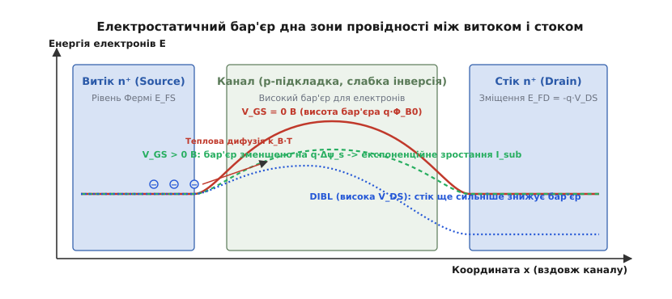
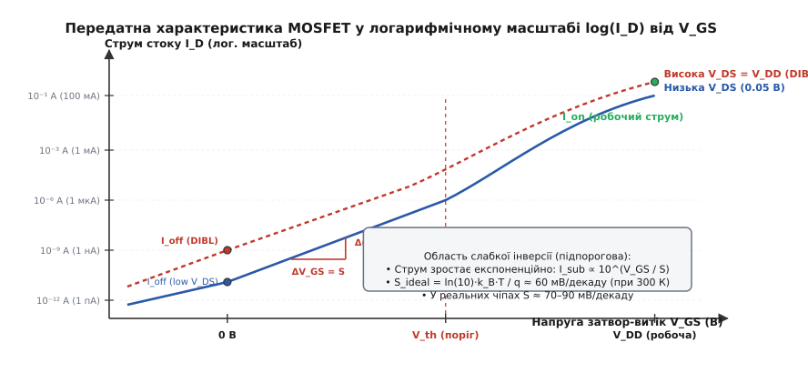
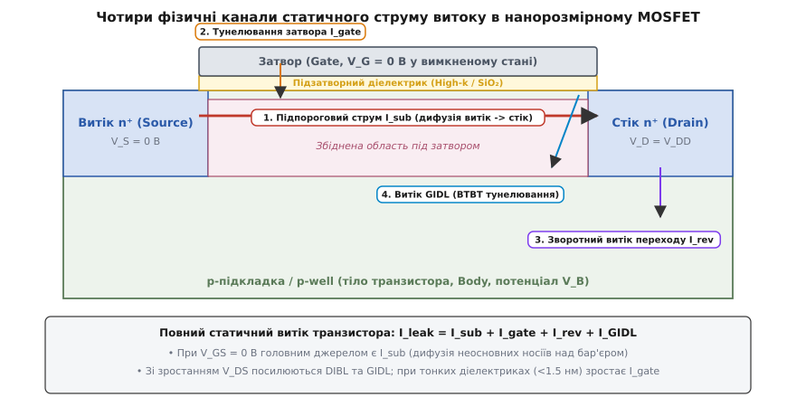
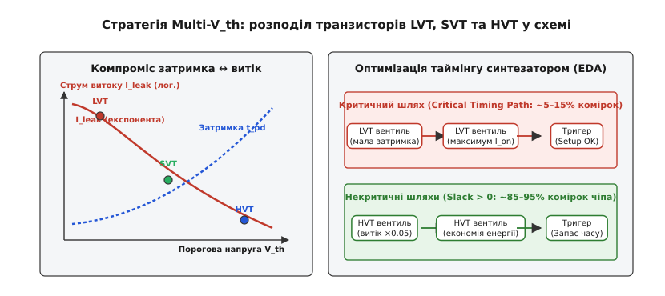
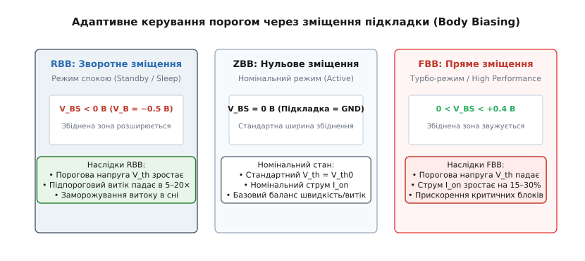

# Підпороговий струм і витік

<preknowlist>
- [Будова MOSFET](topic:hw-components/mosfet-structure) — просторове розташування витоку, стоку, затвора та підкладки й утворення ізолюючих p-n переходів.
- [Поріг відкривання MOSFET](topic:hw-components/mosfet-threshold) — фізичний механізм сильної інверсії та формування провідного каналу.
- [CMOS-логіка](topic:hw-digital/cmos) — побудова логічних вентилів на комплементарних парах транзисторів і принцип відсутності наскрізного струму в статичному стані.
</preknowlist>

Сучасний процесорний кристал площею у двісті квадратних міліметрів містить понад тридцять мільярдів польових транзисторів. Якщо перевести цей чип у режим глибокого сну, повністю зупинити тактовий генератор і зафіксувати всі логічні сигнали на незмінних рівнях, споживання енергії не впаде до нуля: кристал продовжує розсіювати від кількох сотень міліватів у мобільному телефоні до десятків ватів у серверному вузлі. Джерелом цього некерованого нагрівання є статичний струм витоку кожного окремого закритого транзистора, який за напруги на затворі нижче порогової здатен проводити мікроскопічні частки наноампера, що при множенні на десятки мільярдів елементів перетворюються на масивний постійний струм розряду батареї.

Цей парадокс руйнує базове уявлення про польовий транзистор як про ідеальний ключ, що миттєво й повністю розмикає електричне коло. У реальному напівпровідниковому приладі провідний канал не є механічним контактом, а являє собою електростатичний потенціальний бар'єр, висотою якого керує поле затвора. Оскільки електрони в напівпровіднику підпорядковуються законам термодинамічної статистики, теплова енергія постійно підкидає частину носіїв заряду вище гребеня цього бар'єра, утворюючи підпороговий струм дифузії навіть за формально вимкненого затвора.

### Фізика слабкої інверсії: дифузійний перенос неосновних носіїв

Щоб збагнути походження підпорогового струму, необхідно простежити зміну фізичних процесів у каналі при переході від увімкненого стану до закритого. У режимі сильної інверсії *(strong inversion)*, коли напруга між затвором і витоком `V_GS` перевищує паспортну порогову напругу `V_th`, поле затвора стягує до поверхні кремнію величезну густину вільних електронів. Їхня концентрація під діелектриком затвора перевищує концентрацію фонових домішок у підкладці, утворюючи неперервний високопровідний місток між n⁺-областями витоку й стоку. Провідність такого каналу визначається дрейфом носіїв під дією поздовжнього електричного поля стоку, а результуючий струм лінійно або квадратично залежить від різниці `V_GS - V_th`.

Коли напругу затвора знижують нижче порогового значення (`V_GS < V_th`), канал руйнується, а сильна інверсія зникає. Проте поверхня напівпровідника під затвором не повертається миттєво до стану нейтрального p-кремнію: вона переходить у стан слабкої інверсії *(weak inversion)* або глибокого збіднення. У цьому стані концентрація вільних електронів під оксидом стає на багато порядків меншою за концентрацію дірок у глибині кристала, але вона залишається відмінною від нуля.

Головна відмінність слабкої інверсії від сильної полягає в домінуючому механізмі перенесення заряду. Оскільки концентрація вільних носіїв у підпороговому режимі надзвичайно мала, падіння потенціалу вздовж поверхні каналу практично відсутнє, а поздовжнє дрейфове електричне поле між витоком і стоком є знехтовно слабким. Електрони не протягуються електричним полем, як це відбувається у відкритому каналі, а вільно дифундують завдяки тепловому хаотичному руху від області високої концентрації біля витоку до області низької концентрації біля стоку.

У режимі слабкої інверсії польовий транзистор за своєю фізичною суттю перетворюється на горизонтальний біполярний транзистор *(lateral BJT)*. n⁺-область витоку виконує роль емітера, що інжектує електрони через знижений бар'єр; p-підкладка під затвором виступає в ролі бази, крізь яку електрони дифундують як неосновні носії; а зміщена під додатною напругою n⁺-область стоку працює колектором, який підхоплює всі носії, що добігли до його збідненої межі.

Оскільки концентрація електронів біля зворотньо зміщеного стоку падає практично до нуля, вздовж каналу встановлюється стабільний градієнт концентрації. За законом Фіка цей градієнт створює сталий підпороговий струм дифузії `I_sub`, пропорційний концентрації електронів на витоковому краї каналу:

```
I_sub = -q · W · D_n · (dn / dx) ≈ q · W · D_n · (n_s(0) / L)
```

де `q` — елементарний заряд, `W` та `L` — ширина й довжина каналу транзистора, `D_n` — коефіцієнт теплової дифузії електронів, а `n_s(0)` — поверхнева густина електронів біля межі з витоком.


*Електростатичний бар'єр між витоком і стоком у підпороговому режимі. Затвор керує висотою бар'єра крізь ємнісний дільник, а висока напруга стоку додатково опускає вершину бар'єра внаслідок ефекту DIBL.*

### Електростатичний бар'єр і ємнісний дільник потенціалу

Концентрація електронів біля витокового краю каналу `n_s(0)` визначається висотою потенціального бар'єра `Φ_B`, який відділяє багату на електрони n⁺-область витоку від поверхні p-підкладки. У термодинамічній рівновазі енергія носіїв заряду розподілена за класичним законом Максвелла-Больцмана. Частка електронів, здатних подолати енергетичний бар'єр висотою `q · Φ_B`, експоненційно залежить від відношення цієї висоти до теплової енергії кристалічної ґратки `k_B · T`:

```
n_s(0) = n_0 · exp(-q · Φ_B / (k_B · T))
```

де `k_B` — стала Больцмана *(Ludwig Boltzmann)*, `T` — абсолютна температура в Кельвінах, а величина `v_t = k_B · T / q` являє собою термічний потенціал напівпровідника, що становить приблизно 25.85 мВ за стандартної кімнатної температури 300 К (27 °C).

Коли інженер прикладає напругу до затвора `V_GS`, електричне поле проникає крізь діелектрик і змінює поверхневий потенціал кремнію `ψ_s`, модулюючи висоту бар'єра: `Φ_B = Φ_B0 - ψ_s`. Проте напруга затвора не передається на поверхню кремнію повністю. Між металевим електродом затвора та об'ємом напівпровідника утворюється природний ємнісний дільник напруги.

Цей дільник складається з двох послідовно з'єднаних ємностей:
1. Питомої ємності підзатворного діелектрика `C_ox = ε_ox / t_ox`, яка прагне передати всю напругу затвора на поверхню каналу;
2. Питомої ємності збідненого шару напівпровідника `C_dep = ε_si / W_dep`, яка утворена нерухомими іонізованими атомами акцепторної домішки й прагне утримати потенціал каналу на рівні підкладки.

Швидкість зміни поверхневого потенціалу `ψ_s` при зміні напруги затвора `V_GS` визначається коефіцієнтом передачі цього ємнісного дільника:

```
d(ψ_s) / d(V_GS) = C_ox / (C_ox + C_dep) = 1 / m
```

де безрозмірний коефіцієнт `m` називають фактором підпорогової неідеальності або фактором підкладки:

```
m = 1 + C_dep / C_ox = 1 + (ε_si / ε_ox) · (t_ox / W_dep)
```

Оскільки товщина збідненої області `W_dep` та товщина діелектрика `t_ox` завжди скінченні й додатні, ємність `C_dep` строго більша за нуль. Через це коефіцієнт `m` фізично завжди перевищує одиницю (`m > 1`). У планарних кремнієвих транзисторах типове значення `m` становить від 1.2 до 1.4, що означає відчутну втрату ефективності керування: кожні 100 мВ зміни напруги на затворі зрушують енергетичний бар'єр у каналі лише на 70–80 мВ.

Підставляючи промодульовану висоту бар'єра у вираз для дифузійного струму, отримуємо класичне рівняння підпорогового струму транзистора:

```
I_sub = I_0 · exp((V_GS - V_th) / (m · v_t)) · [1 - exp(-V_DS / v_t)]
```

де `I_0` — характерний струм, що пропорційний геометричному відношенню ширини до довжини каналу `W/L` та питомій ємності оксиду `C_ox`.

Множник `[1 - exp(-V_DS / v_t)]` описує вплив напруги стоку: коли напруга стоку перевищує значення `3 ... 4 · v_t` (близько 0.1 В), експоненційний член прямує до нуля, а множник стає рівним одиниці. За таких умов підпороговий струм повністю насичується і в довгоканальному наближенні залежить виключно від напруги на затворі та температури.

> 🧮 **Термодинамічне виведення.** Повний математичний розрахунок ємнісного дільника, розв'язання рівняння Пуассона для інверсійного заряду та аналітичне інтегрування дифузійного струму наведено у математичній вставці [«Термодинаміка слабкої інверсії та виведення підпорогового розмаху»](topic:hw-components/subthreshold-leakage/math-subthreshold-swing.md).


*Передатна характеристика MOSFET: експоненційне зростання підпорогового струму з нахилом S, співвідношення струмів I_on/I_off та зсув робочої точки внаслідок ефекту DIBL.*

### Підпороговий розмах і фундаментальна межа 60 мВ/декаду

Для кількісної оцінки того, наскільки круто транзистор вимикається при зниженні напруги затвора, у мікроелектроніці використовують параметр підпорогового розмаху *(Subthreshold Swing, позначається літерою S)*.

Підпороговий розмах визначається як зміна напруги затвор-витік `ΔV_GS`, необхідна для зміни струму стоку `I_sub` рівно вдесятеро (на один десятковий порядок, або на одну декаду):

```
S = d(V_GS) / d(log₁₀(I_sub)) = ln(10) · [d(V_GS) / d(ln(I_sub))]
```

Беручи похідну від логарифма підпорогового струму за напругою затвора, отримуємо фундаментальний вираз для розмаху:

```
S = ln(10) · m · v_t = ln(10) · (1 + C_dep / C_ox) · (k_B · T / q)
```

Розглянемо випадок абсолютно ідеального транзистора, у якому затвор має нескінченно сильний електростатичний зв'язок із каналом (`C_ox ≫ C_dep`, тобто `m = 1.0`). У цій теоретичній границі підпороговий розмах досягає свого абсолютного фізичного мінімуму:

```
S_ideal = ln(10) · (k_B · T / q) ≈ 2.3026 · (1.3806 × 10⁻²³ · T / 1.6022 × 10⁻¹⁹)
```

Підставивши значення констант при кімнатній температурі `T = 300 К`, отримуємо:

```
S_ideal = 2.3026 · 25.852 мВ ≈ 59.52 мВ/декаду ≈ 60 мВ/декаду
```

Значення **60 мВ на декаду струму при 300 К** — це фундаментальна термодинамічна межа класичної напівпровідникової електроніки *(Boltzmann tyranny)*. Вона не залежить від матеріалу напівпровідника (кремній, германій, арсенід галію), не залежить від форми електродів і не може бути подолана жодним удосконаленням літографії, допоки носії заряду долають потенціальний бар'єр виключно за рахунок свого теплового розподілу Максвелла-Больцмана.

У реальних планарних кремнієвих транзисторах через вплив ємності збіднення підкладки (`m ≈ 1.25 ... 1.40`) величина `S` становить близько 75–90 мВ/декаду. Це означає, що для гарантованого зменшення струму витоку закритого ключа на шість порядків (наприклад, з робочого струму `1 мА` до струму спокою `1 нА`) напругу затвора необхідно знизити щонайменше на `6 · 80 мВ = 480 мВ` відносно порогового значення.

Підпороговий розмах лінійно деградує з підвищенням температури кристала. Якщо за кімнатної температури (300 К) ідеальний розмах становить 60 мВ/дек, то при типовому робочому нагріванні процесора під навантаженням до 85 °C (358 К) він погіршується до 71 мВ/дек, а в гарячих точках кристала при 125 °C (398 К) сягає 80 мВ/дек (для реальних транзисторів — понад 105–115 мВ/дек). У результаті навіть за незмінної напруги затвора струм витоку гарячого чіпа зростає в десятки разів порівняно з холодним станом.

Екстремальне зниження температури дає змогу обійти цю проблему: за кріогенного охолодження рідким азотом до 77 К (-196 °C) термічний потенціал `v_t` падає до 6.6 мВ, а підпороговий розмах `S` загострюється до фантастичних 15–18 мВ/декаду. Транзистор вмикається й вимикається практично миттєво, що дозволяє різко знизити робочу напругу живлення без зростання витоків, однак складність кріогенної інфраструктури обмежує це рішення спеціалізованими квантовими та суперкомп'ютерними системами.

### Ефект короткого каналу та DIBL

Коли довжина каналу транзистора `L` зменшується нижче ста нанометрів заради підвищення щільності інтеграції, одновимірне електростатичне наближення руйнується. Виникає комплекс паразитних явищ, відомих як ефекти короткого каналу *(Short-Channel Effects, SCE)*.

Головним із них у підпороговій області є індуковане стоком зниження потенціального бар'єра — **DIBL** *(Drain-Induced Barrier Lowering, від англійського «drain-induced barrier lowering»)*.

У довгоканальному транзисторі збіднені області витоку та стоку просторово віддалені одна від одної, тому позитивний потенціал стоку впливає лише на вихідний край каналу. У короткому каналі збіднена область стоку проникає майже на всю довжину каналу, змикаючись зі збідненою областю витоку. Силові лінії електричного поля, що беруть початок на позитивно зарядженому стоці, пронизують товщу напівпровідника і частково замикаються на негативні іони біля витоку.

У результаті висока додатна напруга на стоці `V_DS` самостійно опускає вершину потенціального бар'єра `Φ_B` біля витоку без будь-якої допомоги з боку затвора. Транзистор починає самовільно відкриватися під дією напруги на власному стоці.

Ефект DIBL кількісно оцінюють коефіцієнтом, який показує, на скільки мілівольтів зменшується ефективна порогова напруга транзистора `V_th` при збільшенні напруги стоку на один вольт:

```
DIBL = -ΔV_th / ΔV_DS = (V_th(low V_DS) - V_th(high V_DS)) / (V_DD - V_DS_low)
```

У довгому каналі коефіцієнт DIBL близький до нуля. У короткоканальних планарних структурах він може досягати 100–150 мВ/В. Наслідки цього катастрофічні для енергоспоживання: коли логічний вентиль перебуває у вимкненому стані, на його стоці присутня повна напруга живлення `V_DS = V_DD`. Через DIBL поріг транзистора зміщується вниз на 100–150 мВ. Оскільки підпороговий струм експоненційно залежить від зсуву порогу:

```
I_off(з DIBL) = I_off(без DIBL) · 10^(ΔV_th / S)
```

Зниження порогу на 120 мВ при підпороговому розмаху `S = 80 мВ/дек` призводить до зростання статичного витоку транзистора в `10^(120/80) = 10^(1.5) ≈ 31.6 раза`.

Якщо довжину каналу скоротити ще сильніше без належного масштабування товщини діелектрика, збіднені шари витоку й стоку змикаються повністю в глибині підкладки. Настає режим наскрізного пробою підкладки *(punch-through)*, за якого затвор остаточно втрачає здатність перекривати потік електронів, а струм між витоком і стоком починає неконтрольовано зростати за законами об'ємного струму, обмеженого просторовим зарядом.


*Чотири фізичні канали витоку струму в нанорозмірному польовому транзисторі: підпороговий струм каналу I_sub, квантове тунелювання крізь діелектрик затвора I_gate, зворотний струм переходу I_rev та міжзонне тунелювання GIDL.*

### Повна картина: чотири канали витоку в нанотранзисторі

Хоча підпороговий струм каналу `I_sub` зазвичай становить левову частку статичних втрат, у сучасних субмікронних процесах повний струм витоку закритого транзистора формується сумою чотирьох фізично різних механізмів:

```
I_leak = I_sub + I_gate + I_rev + I_GIDL
```

Розглянемо кожну з трьох додаткових компонентів, що виникають через граничне стиснення розмірів структури.

#### 1. Квантове тунелювання крізь діелектрик затвора (I_gate)

Щоб зберегти ємнісний контроль затвора над каналом при зменшенні довжини `L`, розробники десятиліттями зменшували товщину підзатворного оксиду кремнію `SiO₂`. На технологічних вузлах 90 нм та 65 нм товщина діоксиду кремнію досягла 1.2–1.4 нанометра, що відповідає товщині всього у 4–5 атомних шарів кремнію та кисню.

За такої мікроскопічної товщини потенціальний бар'єр діелектрика стає прозорим для електронів відповідно до законів квантової механіки. Виникає пряме квантове тунелювання *(Direct Tunneling)*, за якого хвильова функція електрона з полікремнієвого затвора безпосередньо проникає крізь шар діоксиду кремнію в канал. Густина струму тунелювання затвора експоненційно зростає зі зменшенням товщини оксиду:

```
j_tunnel ∝ exp(-2 · √(2 · m_e · q · Φ_ox) · t_ox / ℏ)
```

Зменшення товщини `SiO₂` лише на 0.2 нм призводить до зростання струму витоку затвора на порядок. На вузлі 65 нм витік крізь затвор зрівнявся за величиною з підпороговим струмом каналу, досягнувши величини понад 100 А/см², що загрожувало зупинкою подальшого розвитку мікроелектроніки.

Порятунком став перехід на діелектрики з високою діелектричною проникністю — **High-k** (переважно на основі діоксиду гафнію `HfO₂`, де відносна проникність `k ≈ 20 ... 25` проти `k = 3.9` у `SiO₂`) у поєднанні з металевими затворами *(HKMG)*. Це дозволило збільшити фізичну товщину діелектрика до 2.5–3.0 нм при збереженні еквівалентної ємнісної товщини оксиду *(EOT, Equivalent Oxide Thickness)* на рівні менше 1 нм, придушивши тунельний витік затвора на кілька порядків.

#### 2. Зворотний струм зміщення p-n переходів (I_rev)

n⁺-області витоку та стоку утворюють із протилежно легованою p-підкладкою діодні p-n переходи. Коли транзистор вимкнений, перехід між стоком і підкладкою перебуває під максимальною зворотною напругою `V_DB = V_DD`.

Зворотний струм цього переходу складається з двох складових:
- Дифузійного струму теплової генерації неосновних носіїв у нейтральній p-області поза межами переходу (класичний струм Шоклі);
- Генераційно-рекомбінаційного струму в самій збідненій області за рахунок термоемісії носіїв через глибокі енергетичні пастки в забороненій зоні (механізм Шоклі-Ріда-Холла, SRH).

Цей струм сильно залежить від площі донних і бічних поверхонь дифузійних n⁺-кишень. Генераційний струм прямо пропорційний власній концентрації носіїв `n_i`, яка експоненційно зростає з температурою (`n_i ∝ T^(3/2) · exp(-E_g / (2 · k_B · T))`). При нагріванні чипа від 25 °C до 100 °C зворотний струм переходів зростає у 50–100 разів, що робить його критичним фактором деградації часу зберігання заряду в комірках динамічної пам'яті DRAM.

#### 3. Струм витоку, індукований затвором (GIDL)

Струм **GIDL** *(Gate-Induced Drain Leakage)* виникає в зоні просторового перекриття металевого затвора та сильно легованої n⁺-області стоку.

Коли затвор вимкнений (`V_G = 0 В`), а на стоці присутня висока напруга живлення (`V_D = V_DD`), між затвором і стоком виникає різниця потенціалів `V_DG = V_DD`. Оскільки підзатворний діелектрик надзвичайно тонкий, у поверхневому шарі n⁺-стока виникає локальне поперечне електричне поле колосальної напруженості — понад 1–2 МВ/см.

Це надвисоке поле викликає сильне локальне викривлення енергетичних зон кремнію. Зона провідності опускається нижче стелі валентної зони на відстані всього кількох нанометрів. Виникає явище міжзонного тунелювання *(Band-to-Band Tunneling, BTBT)*: електрони з валентної зони підкладки безпосередньо тунелюють крізь вузький заборонений бар'єр у зону провідності стоку, а дірки, що залишилися, виштовхуються електричним полем у контакт підкладки.

Струм GIDL експоненційно зростає зі збільшенням напруги живлення `V_DD` і потовщенням перекриття затвора зі стоком, перетворюючись на головний обмежувач максимальної напруги живлення в ультраглибоких нанометрових вузлах.

### Крах закону Денарда та поява темного кремнію

У 1974 році Роберт Денард *(Robert Dennard)* сформулював принципи класичного масштабування MOSFET: якщо всі просторові розміри транзистора (довжину, ширину, товщину оксиду) зменшити в `κ` разів, а напругу живлення `V_DD` та порогову напругу `V_th` також зменшити в `κ` разів, то електричні поля всередині приладу залишаться сталими.

При такому масштабуванні затримка перемикання зменшується в `κ` разів, динамічна потужність одиничного вентиля падає в `κ²` разів, а сумарна питома потужність на одиницю площі кристала `P/A` залишається незмінною. Це правило забезпечувало фантастичний ріст тактових частот процесорів від мегагерців до гігагерців протягом тридцяти років.

Проте приблизно у 2005 році (на технологічних вузлах 90 нм і 65 нм) закон Денарда зазнав нищівного краху. Причиною цього став саме підпороговий розмах і фундаментальна межа 60 мВ/декаду.

Логіка краху невідворотна:
1. Щоб зберігати високу швидкодію, струм увімкненого стану `I_on ∝ (V_DD - V_th)^α` має залишатися великим.
2. При зниженні напруги живлення `V_DD` з 5 В до 1 В для збереження різниці `V_DD - V_th` інженери мусили пропорційно знижувати порогову напругу `V_th` — з 0.7 В до 0.2 В.
3. Але підпороговий розмах `S` не масштабується! Він залишається затиснутим термодинамічною межею `S ≥ 60 мВ/дек` (на практиці 80–90 мВ/дек).
4. Зниження порогу `V_th` з 0.7 В до 0.2 В при `S = 80 мВ/дек` скоротило запас закривання на `0.5 В / 0.08 В = 6.25 декади`.
5. Струм витоку вимкненого стану кожного транзистора зріс у `10^(6.25) ≈ 1 800 000 разів` (майже у два мільйони разів!).

Статична потужність витоку `P_static = V_DD · I_leak · N` вибухоподібно зросла, зрівнялася з динамічною потужністю перемикання `P_dynamic = α · C · V_DD² · f` і почала загрожувати розплавленням кристала. Інженери більше не могли одночасно знижувати `V_DD` і піднімати тактову частоту `f`.

Це явище отримало назву «енергетичної стіни» *(Power Wall)*. Воно призвело до зупинки зростання тактових частот на рівні 3–5 ГГц і породило феномен «темного кремнію» *(Dark Silicon)* — ситуацію, коли на кристалі з десятками ядер через обмеження тепловідведення неможливо одночасно заживити всі транзистори на повну потужність, змушуючи більшу частину блоків перебувати у вимкненому стані.


*Розподіл комірок Multi-Vt: швидкі LVT-транзистори задіяні виключно на критичних затримкових шляхах, тоді як енергоефективні HVT-комірки заповнюють до 90% некритичних вузлів схеми.*

### Схемотехнічні методи приборкання витоку: бібліотеки Multi-Vt

Оскільки змінити термодинаміку напівпровідника неможливо, інженери створили багаторівневий комплекс схемотехнічних та топологічних технологій боротьби зі статичним струмом витоку. Найпоширенішим із них є використання багатопорогових бібліотек стандартних комірок — **Multi-Vt**.

Сучасна фабрика напівпровідників надає можливість у межах одного технологічного процесу виготовляти транзистори з різними пороговими напругами, змінюючи дозу легування каналу, товщину діелектрика або роботу виходу металу затвора:

1. **Low-Vt (LVT / ULVT — Ultra Low Threshold):**
   Транзистори з низьким порогом (`V_th ≈ 0.20 ... 0.25 В`). Завдяки високому перевищенню порогу `V_GS - V_th` вони забезпечують колосальний струм увімкненого стану `I_on` і мінімальну затримку перемикання вентиля, але платять за це гігантським струмом витоку `I_off` (до сотен наноамперів на мікрон ширини).
2. **Standard-Vt (SVT / RVT — Regular Threshold):**
   Транзистори зі збалансованим номінальним порогом (`V_th ≈ 0.32 ... 0.38 В`), що забезпечують компроміс між помірною швидкодією та контрольованим витоком.
3. **High-Vt (HVT / EHVT — Extra High Threshold):**
   Транзистори з високим порогом (`V_th ≈ 0.45 ... 0.55 В`). Вони мають уповільнену затримку перемикання, але їхній статичний струм витоку в 20–100 разів менший, ніж у LVT-елементів.

Автоматизовані системи проектування (САПР, EDA-інструменти синтезу та трасування) оптимізують кристал на рівні логічних шляхів. На критичних шляхах поширення сигналу *(Critical Timing Paths)*, де кожна пікосекунда затримки визначає максимальну робочу частоту процесора, синтезатор встановлює надшвидкі LVT-комірки. Частка таких критичних елементів на кристалі зазвичай не перевищує 5–15%.

На всіх інших некритичних шляхах, де є часовий запас *(Timing Slack)*, САПР автоматично замінює елементи на повільні, але надзвичайно «герметичні» HVT-комірки. У результаті процесор виконує задані частотні вимоги, проте його сумарний струм спокою зменшується на 80–90% порівняно з гіпотетичним дизайном, побудованим виключно на LVT-транзисторах.


*Схеми зміщення підкладки: зворотне зміщення RBB пригнічує струм спокою в режимі сну, а пряме зміщення FBB прискорює логіку в пікових навантаженнях.*

### Адаптивне зміщення підкладки (Adaptive Body Bias)

Ще одним динамічним важелем керування витоками є зміщення підкладки — технологія **Body Biasing**.

Фізичною основою цієї технології є [ефект підкладки](topic:hw-components/body-effect), згідно з яким порогова напруга транзистора залежить від різниці потенціалів між витоком і тілом напівпровідника `V_BS`:

```
V_th = V_th0 + γ · (√(2 · ϕ_F - V_BS) - √(2 · ϕ_F))
```

де `γ` — коефіцієнт ефекту підкладки, а `2 · ϕ_F` — подвійний потенціал Фермі кремнію.

Залежно від знака прикладеної напруги `V_BS` реалізують дві стратегії:

#### 1. Зворотне зміщення підкладки (Reverse Body Bias, RBB)
На p-підкладку n-канальних транзисторів подають від'ємну напругу (`V_BS < 0`, наприклад -0.5 В відносно землі). Це призводить до:
- Розширення збідненого шару під каналом;
- Зростання висоти потенціального бар'єра;
- Збільшення порогової напруги `V_th` на 100–180 мВ;
- Зменшення підпорогового струму витоку `I_sub` в 5–20 разів.

Режим RBB активують у моменти переходу процесора в режим очікування *(Standby / Sleep)*, буквально «заморожуючи» статичний витік мікросхеми.

#### 2. Пряме зміщення підкладки (Forward Body Bias, FBB)
На p-підкладку подають невелику додатну напругу (`0 < V_BS < 0.4 В`). Величина напруги суворо обмежена порогом прямого відкривання паразитного p-n діода підкладка-витік (близько 0.6 В), щоб уникнути катастрофічного наскрізного струму підкладки. Пряме зміщення звужує збіднений шар, знижує порогову напругу `V_th` на 60–120 мВ і різко підсилює струм відкритого стану `I_on`, що дозволяє розігнати блок до пікової частоти в турбо-режимі.

У передових процесорах зміщення підкладки роблять **адаптивним (Adaptive Body Bias, ABB)**: спеціальні вбудовані сенсори постійно вимірюють параметри технологічного розкиду кремнію (Process), напругу (Voltage) та поточну температуру кристала (Temperature) — комплекс PVT. Апаратний мікроконтролер замкненого контуру регулює напругу підкладки `V_BS` у реальному часі, компенсуючи виробничий розкид кристалів: «повільні» екземпляри підганяються прямим зміщенням FBB, а кристали з підвищеним витоком «гасяться» зворотним зміщенням RBB.

Найбільшої досконалості технологія Body Bias досягла в архітектурі **FD-SOI** *(Fully Depleted Silicon-On-Insulator)*. Завдяки наявності ізолюючого оксидного шару (Buried Oxide, BOX) підкладка ізольована від каналу, що усуває небезпеку паразитного прямого струму p-n діода і розширює діапазон безпечного регулювання напруги підкладки від -3 В до +3 В.

### Еволюція геометрії: від планарного кремнію до FinFET та GAA

На межі технологічного вузла 20 нм планарний польовий транзистор остаточно вичерпав можливості масштабування: провідний шар підкладки став занадто товстим, DIBL перевищив 150 мВ/В, а підпороговий розмах здеградував до 100 мВ/дек. Єдиний плоский затвор зверху більше не міг утримувати підпороговий бар'єр у глибині кристала.

Рішенням став перехід від двовимірної планарної структури до об'ємних транзисторів:

1. **FinFET (реберні польові транзистори):**
   Канал транзистора підняли над поверхнею підкладки у вигляді тонкого вертикального кремнієвого ребра *(Fin)* завтовшки лише 5–8 нм. Металевий затвор обхоплює це ребро з трьох боків (зверху, зліва й справа). Завдяки відсутності об'ємної підкладки ємність збіднення `C_dep` падає практично до нуля (`m → 1.05 ... 1.10`), ефект DIBL різко пригнічується, а підпороговий розмах загострюється до 65–70 мВ/декаду.
2. **GAA Nanosheet (Gate-All-Around):**
   Подальший розвиток на вузлах 3 нм і 2 нм. Ребро розділене на стопку горизонтальних кремнієвих нанострічок завтовшки 5 нм, кожна з яких повністю, з усіх чотирьох боків оточена затвором. Це забезпечує абсолютний електростатичний контроль каналу, знижуючи підпороговий розмах до 62–64 мВ/декаду (майже впритул до термодинамічної межі 59.5 мВ/дек).

> 🔧 **Навіщо це.** Розуміння фізики підпорогового струму є наріжним каменем для проектування енергоефективної мікроелектроніки. Будь-яка оптимізація мобільного чипа починається з балансу: як низько можна опустити порогову напругу `V_th` для досягнення цільової продуктивності, не втопивши пристрій у статичному витоку спокою. Від розрахунку підпорогового розмаху та коефіцієнта DIBL залежить правильний вибір бібліотеки стандартних комірок Multi-Vt, налаштування режимів сну в системах Power Gating та вибір архітектури транзисторів для наступних поколінь кремнієвих процесорів.
